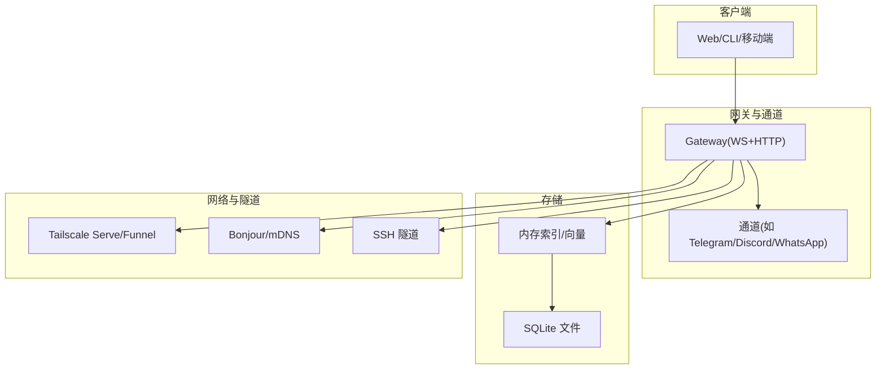
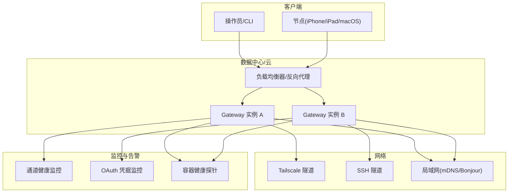
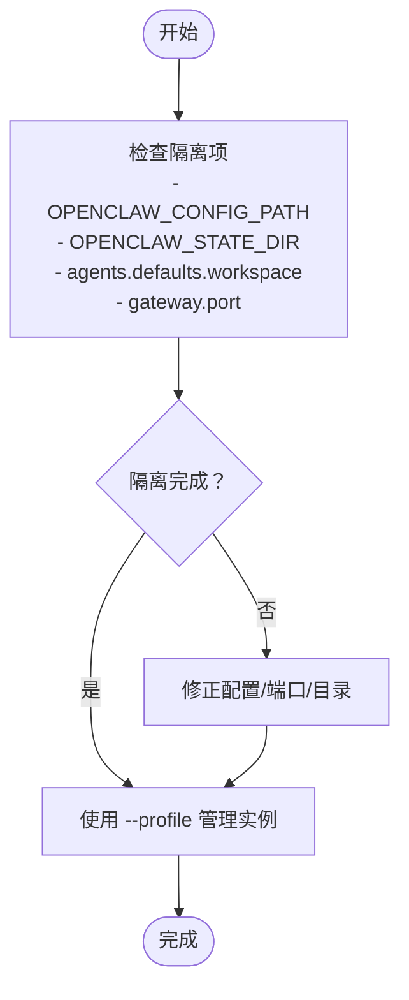
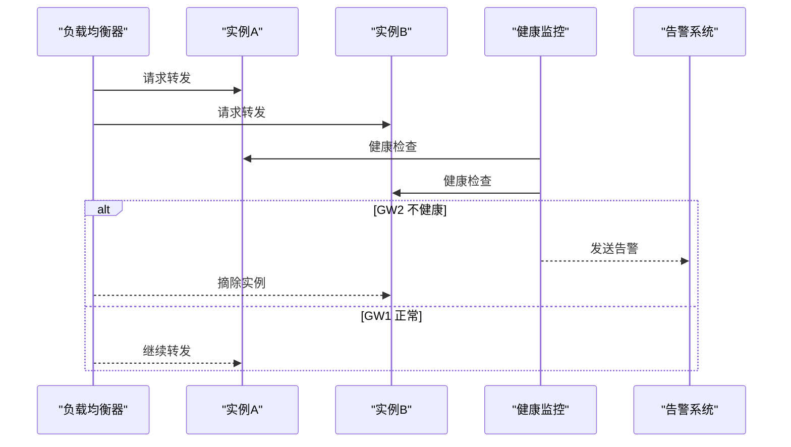
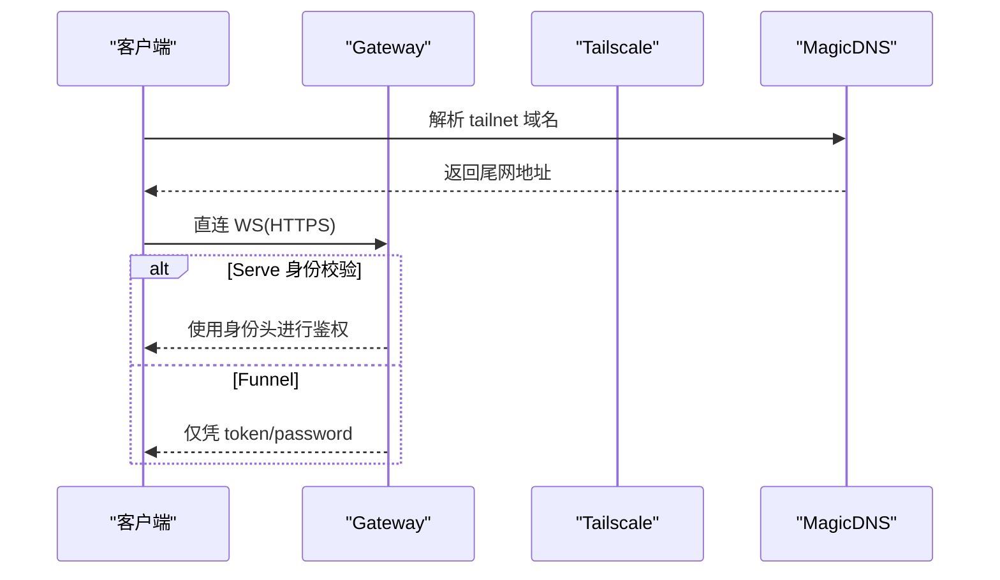
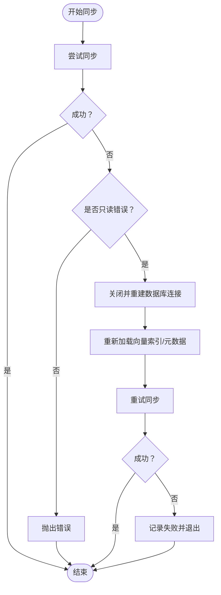
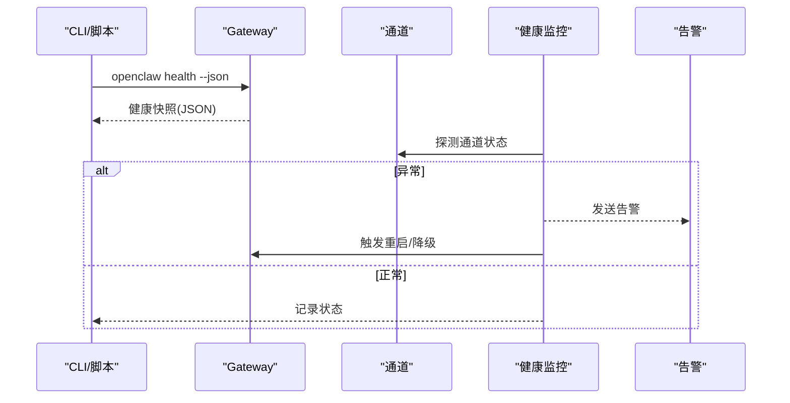
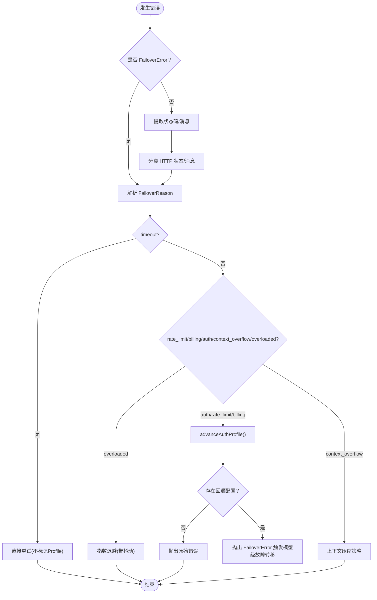
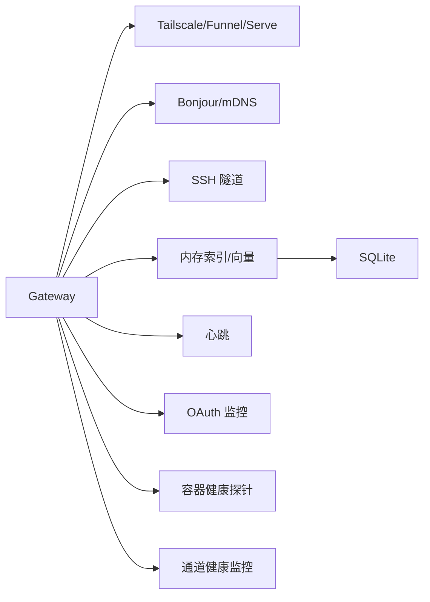

# 高可用配置

<cite>
**本文引用的文件**
- [tailscale.md](file://docs/gateway/tailscale.md)
- [multiple-gateways.md](file://docs/gateway/multiple-gateways.md)
- [discovery.md](file://docs/gateway/discovery.md)
- [docker.md](file://docs/install/docker.md)
- [fly.md](file://docs/install/fly.md)
- [configuration-reference.md](file://docs/gateway/configuration-reference.md)
- [heartbeat.md](file://docs/gateway/heartbeat.md)
- [health.md](file://docs/gateway/health.md)
- [auth-monitoring.md](file://docs/automation/auth-monitoring.md)
- [architecture.md](file://docs/concepts/architecture.md)
- [failover-error.ts](file://src/agents/failover-error.ts)
- [failover-error.test.ts](file://src/agents/failover-error.test.ts)
- [channel-health-monitor.ts](file://src/gateway/channel-health-monitor.ts)
- [manager.ts](file://src/memory/manager.ts)
- [manager.readonly-recovery.test.ts](file://src/memory/manager.readonly-recovery.test.ts)
- [manager-sync-ops.ts](file://src/memory/manager-sync-ops.ts)
- [TailscaleServeGatewayDiscovery.swift](file://apps/macos/Sources/OpenClawDiscovery/TailscaleServeGatewayDiscovery.swift)
- [WideAreaGatewayDiscovery.swift](file://apps/macos/Sources/OpenClawDiscovery/WideAreaGatewayDiscovery.swift)
- [HealthStore.swift](file://apps/macos/Sources/OpenClaw/HealthStore.swift)
- [test-perf-budget.mjs](file://scripts/test-perf-budget.mjs)
</cite>

## 目录

1. [简介](#简介)
2. [项目结构](#项目结构)
3. [核心组件](#核心组件)
4. [架构总览](#架构总览)
5. [详细组件分析](#详细组件分析)
6. [依赖关系分析](#依赖关系分析)
7. [性能考量与容量规划](#性能考量与容量规划)
8. [故障排查指南](#故障排查指南)
9. [结论](#结论)
10. [附录](#附录)

## 简介

本指南面向在生产环境中部署与运维 OpenClaw 的工程团队，聚焦“高可用架构”的落地实践，覆盖以下关键主题：

- 多网关部署与端口隔离
- 负载均衡与故障转移策略
- Tailscale 隧道、服务发现与跨网络访问
- 数据库高可用、数据同步与备份恢复
- 监控告警、健康检查与自动故障切换
- 性能基准测试与容量规划

目标是帮助你在不同规模与网络环境下，构建稳定、可观测、可扩展且具备自动恢复能力的 OpenClaw 高可用体系。

## 项目结构

OpenClaw 的高可用相关能力分布在多个层面：

- 文档层：提供部署模式、配置参考、健康检查与自动化监控等权威说明
- 客户端与服务端：通过 WebSocket 控制面连接，节点与操作员客户端共享同一网关实例
- 内存与存储：基于本地 SQLite 的内存索引与向量检索，支持只读恢复与安全重索引
- 健康与故障转移：内置错误分类与退避策略，通道健康监控与重启控制

章节来源

- [architecture.md:12-52](file://docs/concepts/architecture.md#L12-L52)
- [docker.md:470-495](file://docs/install/docker.md#L470-L495)
- [fly.md:66-81](file://docs/install/fly.md#L66-L81)

## 核心组件

- 网关与通道：单实例网关负责维护各消息通道连接与会话状态，客户端通过 WebSocket 控制面交互
- 存储与索引：内存索引/向量依赖 SQLite；支持只读错误恢复与安全重索引
- 健康与监控：心跳、通道健康监控、OAuth 凭据监控、容器健康探针
- 自动化与故障转移：错误分类与退避、过载退避策略、通道重启冷却与频率限制

章节来源

- [architecture.md:27-52](file://docs/concepts/architecture.md#L27-L52)
- [heartbeat.md:18-44](file://docs/gateway/heartbeat.md#L18-L44)
- [auth-monitoring.md:9-27](file://docs/automation/auth-monitoring.md#L9-L27)
- [manager.ts:451-551](file://src/memory/manager.ts#L451-L551)

## 架构总览

下图展示高可用场景下的典型拓扑：多网关实例、跨网络访问（Tailscale/SSH）、通道健康监控与自动恢复、容器健康探针与外部告警。

图表来源

- [fly.md:66-81](file://docs/install/fly.md#L66-L81)
- [discovery.md:43-108](file://docs/gateway/discovery.md#L43-L108)
- [docker.md:470-495](file://docs/install/docker.md#L470-L495)
- [auth-monitoring.md:9-27](file://docs/automation/auth-monitoring.md#L9-L27)

## 详细组件分析

### 多网关部署与端口隔离

- 同机多实例：通过配置路径、状态目录、工作空间与端口隔离，避免共享资源冲突
- 推荐使用配置文件与状态目录分离，并为每个实例分配至少 20 个端口间距，确保派生端口不冲突
- 救援网关：在同一主机上运行独立实例，用于故障时调试与配置变更

章节来源

- [multiple-gateways.md:13-22](file://docs/gateway/multiple-gateways.md#L13-L22)
- [multiple-gateways.md:23-56](file://docs/gateway/multiple-gateways.md#L23-L56)
- [multiple-gateways.md:77-92](file://docs/gateway/multiple-gateways.md#L77-L92)

### 负载均衡与故障转移

- 负载均衡：在多实例场景中，通过反向代理或云负载均衡器分发请求至多个网关实例
- 故障转移：结合容器健康探针与外部告警，实现实例故障检测与自动摘除/替换
- 通道健康监控：周期性检查通道状态，配合重启冷却与频率限制，避免惊群效应

章节来源

- [channel-health-monitor.ts:76-111](file://src/gateway/channel-health-monitor.ts#L76-L111)
- [docker.md:470-495](file://docs/install/docker.md#L470-L495)

### Tailscale 隧道与服务发现

- Serve/Funnel：在不暴露公网端口的前提下，通过 Tailscale 提供 HTTPS 与路由
- 身份校验：Serve 注入身份头，Funnel 不注入；可通过配置启用/禁用
- 客户端发现：Bonjour 用于局域网自动发现；跨网络使用 Tailscale MagicDNS 或稳定尾网 IP
- 客户端行为：优先直连，否则回退到 SSH 隧道

章节来源

- [tailscale.md:9-43](file://docs/gateway/tailscale.md#L9-L43)
- [discovery.md:86-108](file://docs/gateway/discovery.md#L86-L108)
- [TailscaleServeGatewayDiscovery.swift:27-42](file://apps/macos/Sources/OpenClawDiscovery/TailscaleServeGatewayDiscovery.swift#L27-L42)
- [WideAreaGatewayDiscovery.swift:33-40](file://apps/macos/Sources/OpenClawDiscovery/WideAreaGatewayDiscovery.swift#L33-L40)

### 数据库高可用、数据同步与备份恢复

- 只读错误恢复：检测 SQLite 只读错误后，重建连接并重新加载向量索引，保证写入能力恢复
- 安全重索引：在临时数据库上重建索引，失败时回滚到原状态，成功后再切换
- 备份建议：结合持久化卷与定期快照，确保状态目录与数据库文件的备份

章节来源

- [manager.ts:451-551](file://src/memory/manager.ts#L451-L551)
- [manager-sync-ops.ts:1017-1058](file://src/memory/manager-sync-ops.ts#L1017-L1058)
- [manager.readonly-recovery.test.ts:38-71](file://src/memory/manager.readonly-recovery.test.ts#L38-L71)

### 监控告警、健康检查与自动故障切换

- 心跳：周期性触发模型回合，输出“正常”或“告警”，支持按渠道可见性控制
- OAuth 凭据监控：通过 CLI 检查凭据有效期，退出码区分过期/即将过期/正常
- 容器健康探针：内置 liveness/readiness 探针，失败时由编排系统自动重启
- 通道健康监控：周期性检查通道运行时快照，配合冷却与重启频率限制

章节来源

- [heartbeat.md:18-44](file://docs/gateway/heartbeat.md#L18-L44)
- [auth-monitoring.md:9-27](file://docs/automation/auth-monitoring.md#L9-L27)
- [docker.md:470-495](file://docs/install/docker.md#L470-L495)
- [channel-health-monitor.ts:76-111](file://src/gateway/channel-health-monitor.ts#L76-L111)
- [HealthStore.swift:147-163](file://apps/macos/Sources/OpenClaw/HealthStore.swift#L147-L163)

### 错误分类与自动故障切换

- 错误分类：根据 HTTP 状态码、错误消息与超时特征，识别“超时/过载/认证/配额/上下文溢出”等原因
- 退避策略：对“过载”采用指数退避与抖动，降低并发压力
- 故障切换：当所有认证配置不可用时，触发模型级故障转移

章节来源

- [failover-error.ts:151-240](file://src/agents/failover-error.ts#L151-L240)
- [failover-error.test.ts:71-82](file://src/agents/failover-error.test.ts#L71-L82)
- [aaron/openclaw-agent-mechanism-deep-dive.md:967-1002](file://aaron/openclaw-agent-mechanism-deep-dive.md#L967-L1002)

## 依赖关系分析

- 网络与隧道：Gateway 依赖 Tailscale/Funnel/Serve 与 Bonjour/mDNS/SSH 提供跨网络访问
- 存储与索引：内存索引/向量依赖 SQLite；只读错误恢复与安全重索引保障数据一致性
- 监控与告警：心跳、OAuth 监控、容器健康探针与通道健康监控共同构成闭环
- 配置与绑定：通过配置参考文档定义通道、模型、绑定与账户策略

图表来源

- [discovery.md:43-108](file://docs/gateway/discovery.md#L43-L108)
- [manager.ts:451-551](file://src/memory/manager.ts#L451-L551)
- [heartbeat.md:18-44](file://docs/gateway/heartbeat.md#L18-L44)
- [auth-monitoring.md:9-27](file://docs/automation/auth-monitoring.md#L9-L27)
- [docker.md:470-495](file://docs/install/docker.md#L470-L495)

章节来源

- [configuration-reference.md:18-91](file://docs/gateway/configuration-reference.md#L18-L91)
- [fly.md:66-81](file://docs/install/fly.md#L66-L81)

## 性能考量与容量规划

- 性能基线：通过脚本对关键流程设定最大耗时与回归阈值，避免性能退化
- 资源规划：Fly.io 示例展示了最小内存与端口绑定要求；容器健康探针与重启策略需与资源上限匹配
- 通道与模型：合理设置通道重试、流式传输与历史限制，平衡吞吐与成本
- 建议：
  - 在多实例部署中预留足够的 CPU/内存余量，避免过载退避导致的抖动
  - 对高并发通道启用指数退避与限流，减少上游限流与超时
  - 使用心跳与 OAuth 监控作为容量预警信号，提前扩容或降载

章节来源

- [test-perf-budget.mjs:98-127](file://scripts/test-perf-budget.mjs#L98-L127)
- [fly.md:260-277](file://docs/install/fly.md#L260-L277)
- [heartbeat.md:381-386](file://docs/gateway/heartbeat.md#L381-L386)

## 故障排查指南

- 快速诊断：使用状态与健康命令获取网关与通道概览，定位问题范围
- 深度诊断：检查凭据文件时间戳、会话存储与日志中的连接/重连事件
- 常见问题：
  - 通道未就绪：执行重新登录流程，确认允许列表与提及规则
  - 网关不可达：启动网关并检查端口占用，必要时强制重启
  - OAuth 过期：使用模型状态检查与监控脚本，及时刷新凭据

章节来源

- [health.md:12-36](file://docs/gateway/health.md#L12-L36)
- [auth-monitoring.md:9-27](file://docs/automation/auth-monitoring.md#L9-L27)

## 结论

通过多网关部署、Tailscale 隧道与服务发现、通道健康监控与自动故障切换、以及数据库只读恢复与安全重索引，OpenClaw 可在多样化环境中实现高可用与自愈。结合容器健康探针与告警机制，可在故障早期介入并自动恢复，保障业务连续性。容量规划与性能基线则为持续优化提供量化依据。

## 附录

- 部署模式参考
  - Docker 容器化与沙箱：适合快速验证与隔离工具执行
  - Fly.io 托管：提供持久化存储与 HTTPS，适合云端部署
- 配置参考
  - 通道与账户策略、心跳与可见性、模型与绑定等关键字段
- 客户端发现
  - 局域网使用 Bonjour，跨网络使用 Tailscale MagicDNS 或 SSH 隧道

章节来源

- [docker.md:35-84](file://docs/install/docker.md#L35-L84)
- [fly.md:10-491](file://docs/install/fly.md#L10-L491)
- [configuration-reference.md:18-91](file://docs/gateway/configuration-reference.md#L18-L91)
- [discovery.md:43-108](file://docs/gateway/discovery.md#L43-L108)
