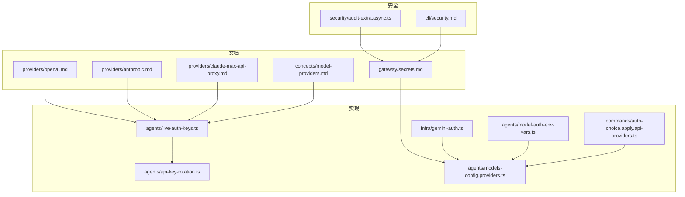
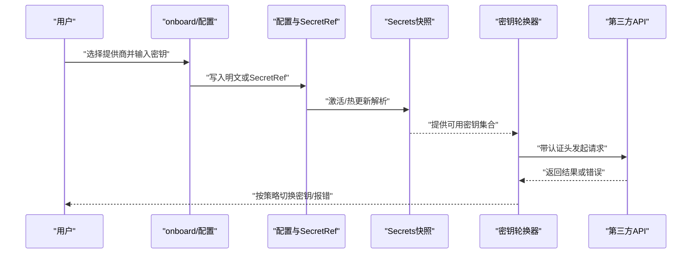
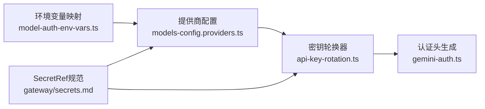

# API密钥认证

<cite>
**本文档引用的文件**
- [docs/gateway/secrets.md](file://docs/gateway/secrets.md)
- [docs/providers/openai.md](file://docs/providers/openai.md)
- [docs/providers/anthropic.md](file://docs/providers/anthropic.md)
- [docs/providers/claude-max-api-proxy.md](file://docs/providers/claude-max-api-proxy.md)
- [docs/providers/index.md](file://docs/providers/index.md)
- [docs/concepts/model-providers.md](file://docs/concepts/model-providers.md)
- [src/agents/live-auth-keys.ts](file://src/agents/live-auth-keys.ts)
- [src/agents/api-key-rotation.ts](file://src/agents/api-key-rotation.ts)
- [src/infra/gemini-auth.ts](file://src/infra/gemini-auth.ts)
- [src/agents/model-auth-env-vars.ts](file://src/agents/model-auth-env-vars.ts)
- [src/commands/auth-choice.apply.api-providers.ts](file://src/commands/auth-choice.apply.api-providers.ts)
- [src/agents/models-config.providers.ts](file://src/agents/models-config.providers.ts)
- [docs/help/faq.md](file://docs/help/faq.md)
- [docs/cli/security.md](file://docs/cli/security.md)
- [src/security/audit-extra.async.ts](file://src/security/audit-extra.async.ts)
- [scripts/debug-claude-usage.ts](file://scripts/debug-claude-usage.ts)
</cite>

## 目录

1. [简介](#简介)
2. [项目结构](#项目结构)
3. [核心组件](#核心组件)
4. [架构总览](#架构总览)
5. [详细组件分析](#详细组件分析)
6. [依赖关系分析](#依赖关系分析)
7. [性能考虑](#性能考虑)
8. [故障排除指南](#故障排除指南)
9. [结论](#结论)
10. [附录](#附录)

## 简介

本指南面向在 OpenClaw 中配置与管理各类 AI 服务提供商 API 密钥的工程师与运维人员，覆盖以下内容：

- 各主要提供商的密钥获取、配置与使用方式（OpenAI、Anthropic、Google/Gemini 等）
- 密钥存储策略：明文环境变量、SecretRef（环境/文件/执行器）与认证档案
- 密钥轮换与重试机制
- 权限控制与使用限制配置
- 安全最佳实践与常见问题排查

## 项目结构

围绕 API 密钥认证的关键文档与实现分布在如下位置：

- 文档层：提供各提供商的配置示例与说明
- 实现层：密钥收集、轮换、错误识别与认证头生成
- 安全层：SecretRef 规范、审计与权限加固

图表来源

- [docs/providers/openai.md:1-246](file://docs/providers/openai.md#L1-L246)
- [docs/providers/anthropic.md:1-49](file://docs/providers/anthropic.md#L1-L49)
- [docs/providers/claude-max-api-proxy.md:1-155](file://docs/providers/claude-max-api-proxy.md#L1-L155)
- [docs/gateway/secrets.md:1-455](file://docs/gateway/secrets.md#L1-L455)
- [docs/concepts/model-providers.md:39-71](file://docs/concepts/model-providers.md#L39-L71)
- [src/agents/live-auth-keys.ts:1-203](file://src/agents/live-auth-keys.ts#L1-L203)
- [src/agents/api-key-rotation.ts:1-73](file://src/agents/api-key-rotation.ts#L1-L73)
- [src/infra/gemini-auth.ts:1-40](file://src/infra/gemini-auth.ts#L1-L40)
- [src/agents/model-auth-env-vars.ts:1-44](file://src/agents/model-auth-env-vars.ts#L1-L44)
- [src/commands/auth-choice.apply.api-providers.ts:618-653](file://src/commands/auth-choice.apply.api-providers.ts#L618-L653)
- [src/agents/models-config.providers.ts:301-360](file://src/agents/models-config.providers.ts#L301-L360)
- [src/security/audit-extra.async.ts:983-1067](file://src/security/audit-extra.async.ts#L983-L1067)
- [docs/cli/security.md:43-72](file://docs/cli/security.md#L43-L72)

章节来源

- [docs/providers/index.md:1-63](file://docs/providers/index.md#L1-L63)
- [docs/concepts/model-providers.md:39-71](file://docs/concepts/model-providers.md#L39-L71)

## 核心组件

- 密钥收集与轮换
  - 支持从环境变量列表、主键、前缀枚举与单次强制键中收集密钥，并去重
  - 提供按顺序尝试的轮换执行器，自动识别速率限制与配额错误并切换密钥
- 认证头生成
  - 针对 Google/Gemini 提供两种认证模式：传统 API Key 与 OAuth JSON
- SecretRef 机密管理
  - 支持 env/file/exec 三种来源，启动时严格解析，失败即刻中止；热更新采用原子替换
- 认证档案与配置
  - 通过 onboarding 与命令交互式写入认证档案，支持 SecretRef 与明文混用

章节来源

- [src/agents/live-auth-keys.ts:100-148](file://src/agents/live-auth-keys.ts#L100-L148)
- [src/agents/api-key-rotation.ts:40-73](file://src/agents/api-key-rotation.ts#L40-L73)
- [src/infra/gemini-auth.ts:15-40](file://src/infra/gemini-auth.ts#L15-L40)
- [docs/gateway/secrets.md:76-198](file://docs/gateway/secrets.md#L76-L198)
- [src/commands/auth-choice.apply.api-providers.ts:618-653](file://src/commands/auth-choice.apply.api-providers.ts#L618-L653)

## 架构总览

下图展示从“配置到调用”的端到端流程：用户通过 onboarding 或配置文件设置密钥；系统在启动或热更新时解析 SecretRef 并构建运行时快照；调用阶段根据提供商选择密钥轮换策略并注入认证头。

图表来源

- [docs/gateway/secrets.md:312-364](file://docs/gateway/secrets.md#L312-L364)
- [src/agents/api-key-rotation.ts:40-73](file://src/agents/api-key-rotation.ts#L40-L73)
- [src/infra/gemini-auth.ts:15-40](file://src/infra/gemini-auth.ts#L15-L40)

## 详细组件分析

### OpenAI 密钥配置

- 获取与存储
  - 在 OpenAI 控制台创建 API Key，推荐通过明文环境变量或 SecretRef 存储
  - 支持多密钥轮换：OPENAI_API_KEYS、OPENAI_API_KEY_1、OPENAI_API_KEY_2，以及单次覆盖 OPENCLAW_LIVE_OPENAI_KEY
- 使用与传输
  - 默认传输为 WebSocket 优先、SSE 回退；可按模型参数调整
  - 支持 WebSocket 预热与优先级处理参数透传
- 配置示例与 CLI 步骤见文档

章节来源

- [docs/providers/openai.md:15-101](file://docs/providers/openai.md#L15-L101)
- [docs/providers/openai.md:103-167](file://docs/providers/openai.md#L103-L167)
- [docs/concepts/model-providers.md:39-49](file://docs/concepts/model-providers.md#L39-L49)

### Anthropic（Claude）密钥配置

- 获取与存储
  - 推荐使用 API Key；也可通过 Claude Code CLI 的 setup-token 作为兼容路径
  - 支持多密钥轮换：ANTHROPIC_API_KEYS、ANTHROPIC_API_KEY_1、ANTHROPIC_API_KEY_2，以及单次覆盖 OPENCLAW_LIVE_ANTHROPIC_KEY
- 使用与注意事项
  - 订阅账号不直接提供 API Key，setup-token 仅技术兼容，需自行评估风险
  - CLI 与交互式向导支持粘贴 setup-token 或直接输入 API Key

章节来源

- [docs/providers/anthropic.md:14-36](file://docs/providers/anthropic.md#L14-L36)
- [docs/help/faq.md:719-740](file://docs/help/faq.md#L719-L740)
- [docs/concepts/model-providers.md:57-65](file://docs/concepts/model-providers.md#L57-L65)

### Google（Gemini）密钥配置

- 获取与存储
  - 通过 GEMINI_API_KEY 设置；支持 SecretRef
  - 可通过代理（如 Claude Max API Proxy）将订阅凭证映射为 OpenAI 兼容接口
- 认证头生成
  - 支持传统 API Key 与 OAuth JSON（含 token 与 projectId），自动选择合适头
- 搜索与检索
  - 搜索提供商可基于 GEMINI_API_KEY 自动检测

章节来源

- [src/infra/gemini-auth.ts:15-40](file://src/infra/gemini-auth.ts#L15-L40)
- [src/commands/auth-choice.apply.api-providers.ts:618-653](file://src/commands/auth-choice.apply.api-providers.ts#L618-L653)
- [docs/providers/claude-max-api-proxy.md:80-95](file://docs/providers/claude-max-api-proxy.md#L80-L95)

### Claude 最大化订阅代理（社区工具）

- 用途
  - 将 Claude Max/Pro 订阅转换为 OpenAI 兼容接口，便于在 OpenAI 生态工具中使用
- 注意
  - 技术兼容路径，需自行确认服务条款与风险

章节来源

- [docs/providers/claude-max-api-proxy.md:12-28](file://docs/providers/claude-max-api-proxy.md#L12-L28)

### SecretRef 机密管理与安全策略

- SecretRef 合同
  - 统一对象形状：{ source, provider, id }，支持 env/file/exec
  - 各来源的校验规则与约束（正则、路径、命令限制等）
- 运行时行为
  - 启动时严格解析，失败即中止；热更新采用原子替换，失败保留上一次已知良好快照
  - 仅对“有效表面”进行校验；非活动表面忽略解析失败
- 命令与工作流
  - secrets audit/secrets configure/secrets apply 的审计与应用流程
  - 与 auth-profiles.json 的优先级与影子覆盖提示

章节来源

- [docs/gateway/secrets.md:76-198](file://docs/gateway/secrets.md#L76-L198)
- [docs/gateway/secrets.md:288-327](file://docs/gateway/secrets.md#L288-L327)
- [docs/gateway/secrets.md:365-424](file://docs/gateway/secrets.md#L365-L424)

### 密钥轮换与重试机制

- 密钥收集
  - 从 OPENCLAW*LIVE*_\_KEY、_\_API_KEYS、_\_API_KEY、_\_API_KEY_n 等环境变量聚合
  - 对重复值去重，保证轮换顺序唯一性
- 执行与重试
  - 按顺序尝试调用；默认以速率限制/配额错误触发切换
  - 支持自定义 shouldRetry/onRetry 回调扩展

章节来源

- [src/agents/live-auth-keys.ts:100-148](file://src/agents/live-auth-keys.ts#L100-L148)
- [src/agents/api-key-rotation.ts:40-73](file://src/agents/api-key-rotation.ts#L40-L73)

### 认证头生成与模型配置

- 认证头
  - Gemini：根据输入格式自动选择 x-goog-api-key 或 Authorization: Bearer
- 模型配置
  - SecretRef 与明文混用时，SecretRef 优先
  - 配置规范化过程中会将明文占位符标准化为 SecretRef 标记

章节来源

- [src/infra/gemini-auth.ts:15-40](file://src/infra/gemini-auth.ts#L15-L40)
- [src/agents/models-config.providers.ts:301-360](file://src/agents/models-config.providers.ts#L301-L360)

## 依赖关系分析

- 提供商环境变量映射
  - 统一维护各提供商的 API Key 环境变量候选名，便于 onboarding 与自动检测
- 认证来源优先级
  - SecretRef 优先于明文；当同时存在时发出警告并记录审计信号

图表来源

- [src/agents/model-auth-env-vars.ts:1-44](file://src/agents/model-auth-env-vars.ts#L1-L44)
- [src/agents/models-config.providers.ts:301-360](file://src/agents/models-config.providers.ts#L301-L360)
- [src/agents/api-key-rotation.ts:40-73](file://src/agents/api-key-rotation.ts#L40-L73)
- [src/infra/gemini-auth.ts:15-40](file://src/infra/gemini-auth.ts#L15-L40)
- [docs/gateway/secrets.md:296-306](file://docs/gateway/secrets.md#L296-L306)

章节来源

- [src/agents/model-auth-env-vars.ts:1-44](file://src/agents/model-auth-env-vars.ts#L1-L44)
- [src/agents/models-config.providers.ts:301-360](file://src/agents/models-config.providers.ts#L301-L360)
- [docs/gateway/secrets.md:296-306](file://docs/gateway/secrets.md#L296-L306)

## 性能考虑

- 传输与预热
  - OpenAI WebSocket 预热可降低首包延迟；可根据网络与模型特性调整
- 轮换策略
  - 合理设置密钥池大小与顺序，避免频繁切换导致抖动
- 解析与缓存
  - SecretRef 快照解析在启动/热更新时一次性完成，避免请求路径上的额外开销

## 故障排除指南

- 启动失败（SecretRef 未解析）
  - 检查 SecretRef 合同与来源合法性；确认 provider 配置与 id 指针正确
  - 查看“有效表面”日志，确认该密钥是否处于当前运行时生效范围
- 热更新失败
  - 系统会保留上次已知良好快照；修复后重新应用
- 权限问题
  - 确保 auth-profiles.json 与状态目录权限为 600/700；避免组与其他用户可读写
- 速率限制与配额
  - 检查 isApiKeyRateLimitError/isAnthropicBillingError 判定逻辑；启用多密钥轮换
- Claude 订阅使用
  - setup-token 仅为兼容路径，建议优先使用 API Key；若使用，请自行评估条款

章节来源

- [docs/gateway/secrets.md:328-342](file://docs/gateway/secrets.md#L328-L342)
- [src/security/audit-extra.async.ts:983-1067](file://src/security/audit-extra.async.ts#L983-L1067)
- [src/agents/api-key-rotation.ts:150-202](file://src/agents/api-key-rotation.ts#L150-L202)
- [docs/help/faq.md:719-740](file://docs/help/faq.md#L719-L740)

## 结论

通过统一的 SecretRef 合同、严格的启动校验与热更新原子替换、以及完善的密钥轮换与错误判定机制，OpenClaw 为多提供商 API 密钥认证提供了安全、可控且易于运维的解决方案。建议优先采用 SecretRef 存储密钥，结合最小权限原则与定期审计，确保生产环境的安全与稳定。

## 附录

### 各提供商密钥配置要点速查

- OpenAI
  - 环境变量：OPENAI_API_KEY、OPENAI_API_KEYS、OPENAI_API_KEY_n、OPENCLAW_LIVE_OPENAI_KEY
  - 传输与优先级参数可通过模型参数透传
- Anthropic
  - 环境变量：ANTHROPIC_API_KEY、ANTHROPIC_API_KEYS、ANTHROPIC_API_KEY_n、OPENCLAW_LIVE_ANTHROPIC_KEY
  - 订阅账号建议使用 API Key；setup-token 仅兼容路径
- Google（Gemini）
  - 环境变量：GEMINI_API_KEY；支持 OAuth JSON
  - 可配合 Claude Max API Proxy 使用

章节来源

- [docs/providers/openai.md:39-49](file://docs/providers/openai.md#L39-L49)
- [docs/providers/anthropic.md:14-36](file://docs/providers/anthropic.md#L14-L36)
- [src/infra/gemini-auth.ts:15-40](file://src/infra/gemini-auth.ts#L15-L40)
- [docs/providers/claude-max-api-proxy.md:80-95](file://docs/providers/claude-max-api-proxy.md#L80-L95)
