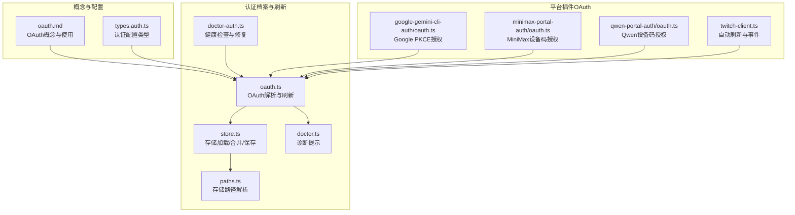
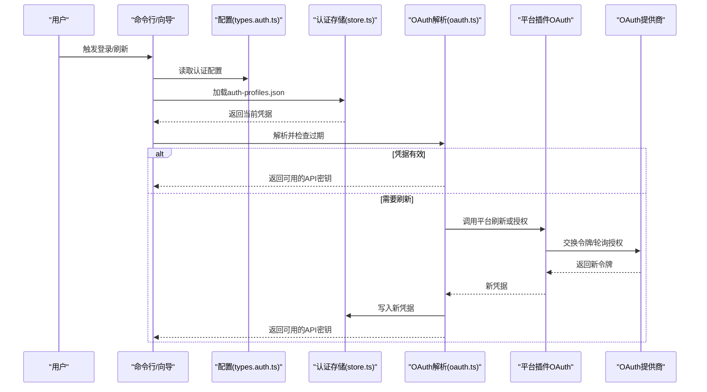
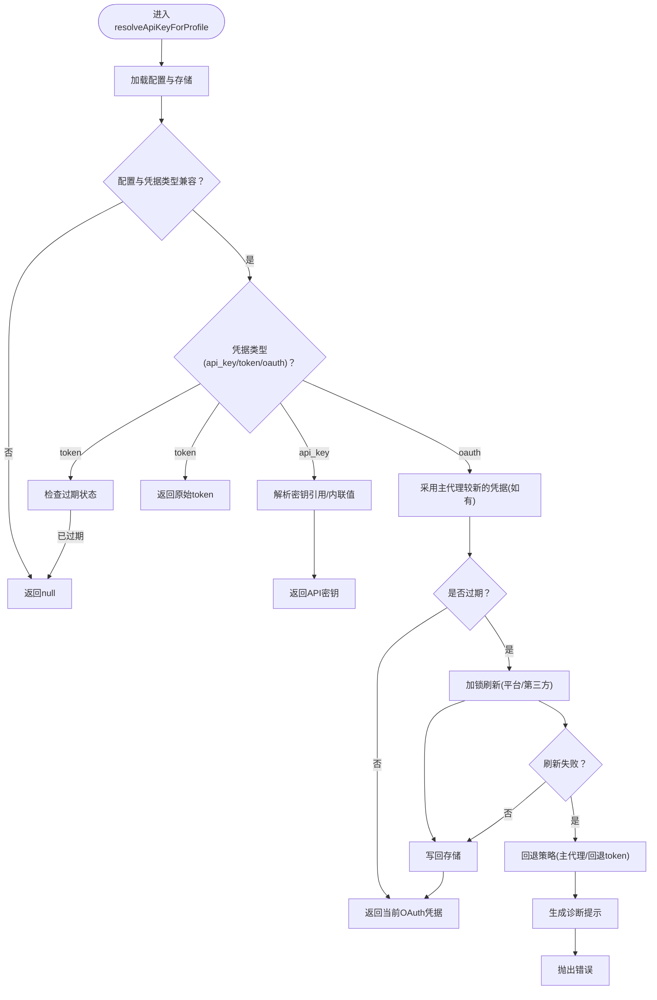
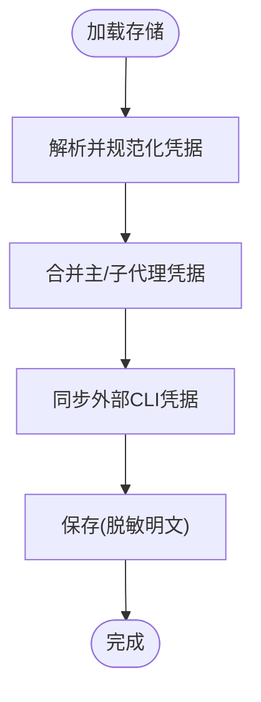
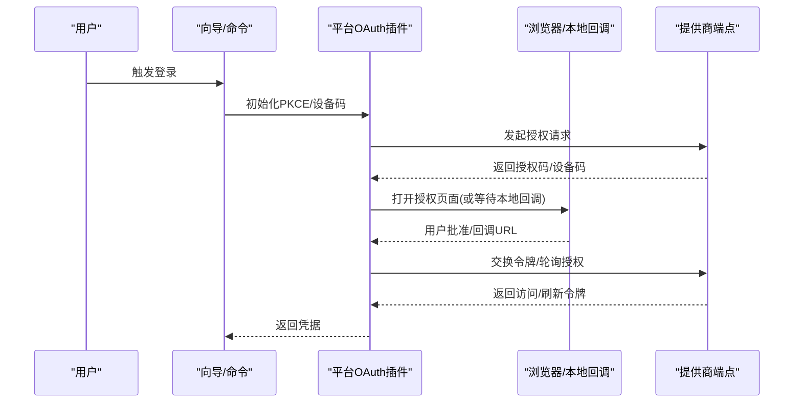
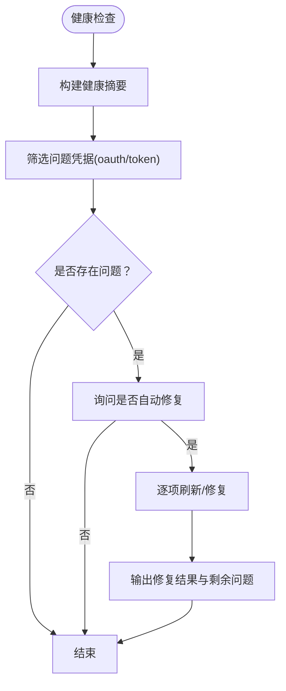
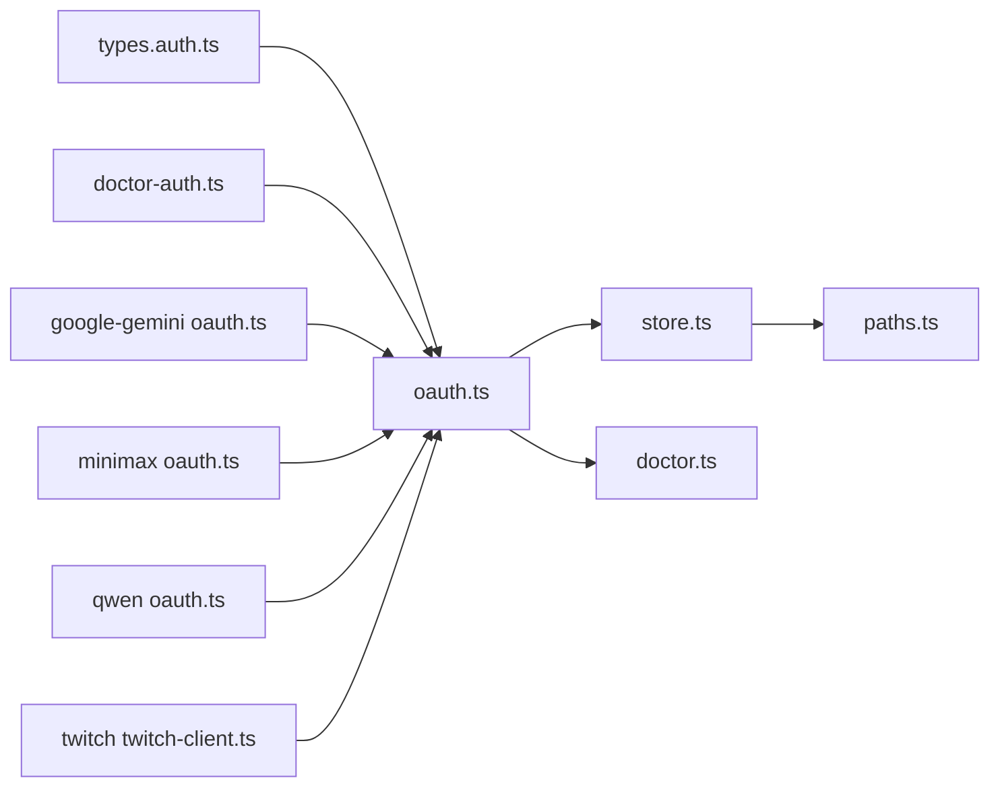

# OAuth认证

<cite>
**本文引用的文件**
- [oauth.md](file://docs/concepts/oauth.md)
- [oauth.ts](file://src/agents/auth-profiles/oauth.ts)
- [store.ts](file://src/agents/auth-profiles/store.ts)
- [paths.ts](file://src/agents/auth-profiles/paths.ts)
- [doctor.ts](file://src/agents/auth-profiles/doctor.ts)
- [doctor-auth.ts](file://src/commands/doctor-auth.ts)
- [oauth.ts](file://extensions/google-gemini-cli-auth/oauth.ts)
- [oauth.ts](file://extensions/minimax-portal-auth/oauth.ts)
- [oauth.ts](file://extensions/qwen-portal-auth/oauth.ts)
- [twitch-client.ts](file://extensions/twitch/src/twitch-client.ts)
- [types.auth.ts](file://src/config/types.auth.ts)
- [onboard-auth.config-core.ts](file://src/commands/onboard-auth.config-core.ts)
- [list.status-command.ts](file://src/commands/models/list.status-command.ts)
</cite>

## 目录

1. [简介](#简介)
2. [项目结构](#项目结构)
3. [核心组件](#核心组件)
4. [架构总览](#架构总览)
5. [详细组件分析](#详细组件分析)
6. [依赖关系分析](#依赖关系分析)
7. [性能考量](#性能考量)
8. [故障排查指南](#故障排查指南)
9. [结论](#结论)
10. [附录](#附录)

## 简介

本指南面向在OpenClaw中配置与使用OAuth认证的用户与开发者，覆盖OAuth 2.0授权流程、令牌获取与刷新机制、多账户与多配置文件路由、令牌存储与安全传输、以及常见失败场景的诊断与重试策略。文档同时给出针对不同平台（如Google Gemini CLI、MiniMax门户、Qwen门户、Discord/Twitch等）的配置要点与注意事项。

## 项目结构

围绕OAuth的关键模块分布如下：

- 概念与使用说明：docs/concepts/oauth.md
- 认证档案解析与刷新：src/agents/auth-profiles/oauth.ts、store.ts、paths.ts
- 平台特定OAuth实现：extensions/google-gemini-cli-auth/oauth.ts、extensions/minimax-portal-auth/oauth.ts、extensions/qwen-portal-auth/oauth.ts
- 故障诊断与修复：src/agents/auth-profiles/doctor.ts、src/commands/doctor-auth.ts
- 配置类型与模式：src/config/types.auth.ts
- 配置应用与状态展示：src/commands/onboard-auth.config-core.ts、src/commands/models/list.status-command.ts

**图表来源**

- [oauth.md:1-159](file://docs/concepts/oauth.md#L1-L159)
- [types.auth.ts:1-29](file://src/config/types.auth.ts#L1-L29)
- [oauth.ts:1-488](file://src/agents/auth-profiles/oauth.ts#L1-L488)
- [store.ts:1-510](file://src/agents/auth-profiles/store.ts#L1-L510)
- [paths.ts:1-34](file://src/agents/auth-profiles/paths.ts#L1-L34)
- [doctor.ts:1-48](file://src/agents/auth-profiles/doctor.ts#L1-L48)
- [doctor-auth.ts:1-358](file://src/commands/doctor-auth.ts#L1-L358)
- [oauth.ts:1-735](file://extensions/google-gemini-cli-auth/oauth.ts#L1-L735)
- [oauth.ts:1-245](file://extensions/minimax-portal-auth/oauth.ts#L1-L245)
- [oauth.ts:1-183](file://extensions/qwen-portal-auth/oauth.ts#L1-L183)
- [twitch-client.ts:34-72](file://extensions/twitch/src/twitch-client.ts#L34-L72)

**章节来源**

- [oauth.md:1-159](file://docs/concepts/oauth.md#L1-L159)
- [types.auth.ts:1-29](file://src/config/types.auth.ts#L1-L29)

## 核心组件

- OAuth解析与刷新引擎：负责从认证档案读取凭据、判断过期、执行刷新、回写存储，并在失败时提供诊断提示与回退策略。
- 存储系统：统一管理auth-profiles.json，支持主/子代理继承、运行时快照、文件锁保护、兼容旧格式迁移。
- 平台插件OAuth：封装各平台的授权端点、PKCE参数、回调处理与轮询逻辑。
- 诊断与修复：健康度汇总、问题定位、一键修复建议与自动重试。

**章节来源**

- [oauth.ts:154-211](file://src/agents/auth-profiles/oauth.ts#L154-L211)
- [store.ts:80-99](file://src/agents/auth-profiles/store.ts#L80-L99)
- [paths.ts:9-33](file://src/agents/auth-profiles/paths.ts#L9-L33)
- [doctor.ts:8-47](file://src/agents/auth-profiles/doctor.ts#L8-L47)
- [doctor-auth.ts:286-357](file://src/commands/doctor-auth.ts#L286-L357)

## 架构总览

下图展示了从命令行到平台插件再到OAuth刷新的整体流程。

**图表来源**

- [types.auth.ts:1-29](file://src/config/types.auth.ts#L1-L29)
- [store.ts:346-441](file://src/agents/auth-profiles/store.ts#L346-L441)
- [oauth.ts:213-252](file://src/agents/auth-profiles/oauth.ts#L213-L252)
- [oauth.ts:659-735](file://extensions/google-gemini-cli-auth/oauth.ts#L659-L735)
- [oauth.ts:184-245](file://extensions/minimax-portal-auth/oauth.ts#L184-L245)
- [oauth.ts:132-183](file://extensions/qwen-portal-auth/oauth.ts#L132-L183)

## 详细组件分析

### 组件A：OAuth解析与刷新（核心）

- 功能要点
  - 兼容“oauth”与“token”两种Bearer模式，允许互换使用。
  - 判断凭据是否过期；若过期则加锁刷新，支持多提供商差异化刷新逻辑。
  - 支持主代理凭据继承与回退策略（主代理有新鲜凭据时复制到子代理）。
  - 失败时生成诊断提示，必要时启用OpenAI Codex回退方案。
- 关键流程
  - 解析配置与存储，校验配置与凭据类型兼容性。
  - 若未过期直接返回；否则按提供商调用刷新或第三方刷新器。
  - 刷新成功后写回存储，失败时尝试回退与提示。

**图表来源**

- [oauth.ts:305-487](file://src/agents/auth-profiles/oauth.ts#L305-L487)

**章节来源**

- [oauth.ts:29-55](file://src/agents/auth-profiles/oauth.ts#L29-L55)
- [oauth.ts:154-211](file://src/agents/auth-profiles/oauth.ts#L154-L211)
- [oauth.ts:305-487](file://src/agents/auth-profiles/oauth.ts#L305-L487)

### 组件B：认证存储与路径（持久化）

- 功能要点
  - 统一解析auth-profiles.json路径，确保文件存在并初始化版本字段。
  - 支持主/子代理凭据合并与运行时快照，避免并发冲突。
  - 兼容旧版auth.json与外部CLI同步，迁移后清理旧文件。
  - 保存时对引用型密钥进行脱敏输出，仅保留引用而不落盘明文。
- 关键流程
  - 加载：优先解析新格式，其次兼容旧格式并迁移。
  - 合并：主代理凭据可被子代理继承，避免重复配置。
  - 保存：根据类型对明文进行脱敏，仅保存引用或必要字段。

**图表来源**

- [store.ts:346-441](file://src/agents/auth-profiles/store.ts#L346-L441)
- [store.ts:484-509](file://src/agents/auth-profiles/store.ts#L484-L509)
- [paths.ts:9-33](file://src/agents/auth-profiles/paths.ts#L9-L33)

**章节来源**

- [store.ts:80-99](file://src/agents/auth-profiles/store.ts#L80-L99)
- [store.ts:346-441](file://src/agents/auth-profiles/store.ts#L346-L441)
- [store.ts:484-509](file://src/agents/auth-profiles/store.ts#L484-L509)
- [paths.ts:9-33](file://src/agents/auth-profiles/paths.ts#L9-L33)

### 组件C：平台插件OAuth（Google/Qwen/MiniMax/Twitch）

- Google Gemini CLI OAuth
  - 使用PKCE授权码流程，本地回调端口固定为8085，支持远程/VPS手动粘贴回调。
  - 自动发现客户端ID/密钥，若未安装CLI则报错引导安装。
  - 获取用户邮箱与项目ID，必要时通过负载均衡端点探测与引导。
- MiniMax门户OAuth
  - 设备码授权流程，轮询等待用户批准，支持CSRF防护与超时控制。
- Qwen门户OAuth
  - 设备码授权流程，轮询等待用户批准，支持慢速降级与超时控制。
- Twitch OAuth
  - 基于RefreshingAuthProvider自动刷新，支持onRefresh/onRefreshFailure事件监听。

**图表来源**

- [oauth.ts:659-735](file://extensions/google-gemini-cli-auth/oauth.ts#L659-L735)
- [oauth.ts:184-245](file://extensions/minimax-portal-auth/oauth.ts#L184-L245)
- [oauth.ts:132-183](file://extensions/qwen-portal-auth/oauth.ts#L132-L183)
- [twitch-client.ts:34-72](file://extensions/twitch/src/twitch-client.ts#L34-L72)

**章节来源**

- [oauth.ts:1-735](file://extensions/google-gemini-cli-auth/oauth.ts#L1-L735)
- [oauth.ts:1-245](file://extensions/minimax-portal-auth/oauth.ts#L1-L245)
- [oauth.ts:1-183](file://extensions/qwen-portal-auth/oauth.ts#L1-L183)
- [twitch-client.ts:34-72](file://extensions/twitch/src/twitch-client.ts#L34-L72)

### 组件D：诊断与健康检查

- 健康度汇总：识别过期/即将过期/缺失的OAuth/静态token配置。
- 一键修复：支持批量刷新过期令牌、迁移旧配置、移除废弃CLI配置。
- 诊断提示：针对Anthropic等提供具体修复建议与命令示例。

**图表来源**

- [doctor-auth.ts:286-357](file://src/commands/doctor-auth.ts#L286-L357)
- [doctor.ts:8-47](file://src/agents/auth-profiles/doctor.ts#L8-L47)

**章节来源**

- [doctor-auth.ts:1-358](file://src/commands/doctor-auth.ts#L1-L358)
- [doctor.ts:1-48](file://src/agents/auth-profiles/doctor.ts#L1-L48)

## 依赖关系分析

- 类型与配置
  - types.auth.ts定义了认证配置的模式（api_key/oauth/token）与冷却策略。
  - onboard-auth.config-core.ts将用户选择写入配置，决定profileId与provider绑定。
- 运行时依赖
  - oauth.ts依赖store.ts进行文件锁保护与存储读写。
  - 各平台插件独立实现授权细节，但最终都通过oauth.ts完成统一的刷新与存储。
- 诊断链路
  - doctor-auth.ts基于health摘要与doctor.ts的提示生成器，形成闭环修复。

**图表来源**

- [types.auth.ts:1-29](file://src/config/types.auth.ts#L1-L29)
- [oauth.ts:1-488](file://src/agents/auth-profiles/oauth.ts#L1-L488)
- [store.ts:1-510](file://src/agents/auth-profiles/store.ts#L1-L510)
- [paths.ts:1-34](file://src/agents/auth-profiles/paths.ts#L1-L34)
- [doctor.ts:1-48](file://src/agents/auth-profiles/doctor.ts#L1-L48)
- [doctor-auth.ts:1-358](file://src/commands/doctor-auth.ts#L1-L358)
- [oauth.ts:1-735](file://extensions/google-gemini-cli-auth/oauth.ts#L1-L735)
- [oauth.ts:1-245](file://extensions/minimax-portal-auth/oauth.ts#L1-L245)
- [oauth.ts:1-183](file://extensions/qwen-portal-auth/oauth.ts#L1-L183)
- [twitch-client.ts:34-72](file://extensions/twitch/src/twitch-client.ts#L34-L72)

**章节来源**

- [types.auth.ts:1-29](file://src/config/types.auth.ts#L1-L29)
- [onboard-auth.config-core.ts:473-495](file://src/commands/onboard-auth.config-core.ts#L473-L495)
- [list.status-command.ts:259-278](file://src/commands/models/list.status-command.ts#L259-L278)

## 性能考量

- 文件锁与并发：所有写操作均通过withFileLock保护，避免多进程并发写入导致的数据损坏。
- 运行时快照：主/子代理凭据合并与运行时快照减少重复IO与解析成本。
- 轮询节流：设备码授权流程内置指数退避与最大上限，降低无效请求压力。
- 存储脱敏：保存时对明文密钥进行脱敏，仅保留引用，降低敏感信息泄露风险。

[本节为通用指导，不涉及具体文件分析]

## 故障排查指南

- 常见症状与定位
  - 凭据过期/即将过期：通过健康检查命令查看摘要，识别问题profileId与提供商。
  - 刷新失败：查看错误消息与诊断提示，确认网络、端口占用、回调地址等。
  - 主/子代理凭据不一致：启用主代理凭据继承，或手动迁移至目标代理。
- 一键修复步骤
  - 运行健康检查命令，按提示确认自动修复。
  - 对于Anthropic等特殊提供商，参考诊断提示中的建议命令。
- 重试策略
  - 设备码授权：遇到authorization_pending/slow_down时自动延长轮询间隔。
  - 本地回调失败：切换到手动粘贴回调URL模式。
  - 回退方案：当刷新失败且具备缓存access_token时，可临时回退使用缓存token。

**章节来源**

- [doctor-auth.ts:286-357](file://src/commands/doctor-auth.ts#L286-L357)
- [doctor.ts:8-47](file://src/agents/auth-profiles/doctor.ts#L8-L47)
- [oauth.ts:455-487](file://src/agents/auth-profiles/oauth.ts#L455-L487)
- [oauth.ts:712-734](file://extensions/google-gemini-cli-auth/oauth.ts#L712-L734)
- [oauth.ts:236-241](file://extensions/minimax-portal-auth/oauth.ts#L236-L241)
- [oauth.ts:174-179](file://extensions/qwen-portal-auth/oauth.ts#L174-L179)

## 结论

OpenClaw的OAuth体系以统一的认证档案与刷新引擎为核心，结合平台插件实现多提供商授权流程，并通过健康检查与诊断工具提供完善的运维能力。遵循本文档的配置与排障建议，可在多平台环境下稳定地完成令牌获取、刷新与安全存储。

[本节为总结性内容，不涉及具体文件分析]

## 附录

### OAuth 2.0授权流程与令牌刷新（概念）

- 授权码流程（PKCE）：生成verifier/challenge，打开授权页，捕获回调或手动粘贴，交换令牌，保存refresh_token用于后续刷新。
- 设备码流程：获取设备码与用户码，轮询等待用户批准，批准后交换令牌。
- 刷新机制：在过期前自动加锁刷新，失败时回退到主代理凭据或缓存token。

**章节来源**

- [oauth.md:83-122](file://docs/concepts/oauth.md#L83-L122)

### 各平台OAuth配置要点

- Google Gemini CLI
  - 回调端口：8085；作用域：云平台、用户信息；项目ID：需显式设置或自动探测。
  - 客户端ID/密钥：优先使用环境变量，其次从已安装CLI提取。
- MiniMax门户
  - 授权端点：根据区域选择；使用设备码授权，支持CSRF校验与超时。
- Qwen门户
  - 授权端点：设备码授权；轮询等待用户批准，支持慢速降级。
- Discord/Twitch
  - 使用RefreshingAuthProvider自动刷新；支持onRefresh/onRefreshFailure事件。

**章节来源**

- [oauth.ts:1-735](file://extensions/google-gemini-cli-auth/oauth.ts#L1-L735)
- [oauth.ts:1-245](file://extensions/minimax-portal-auth/oauth.ts#L1-L245)
- [oauth.ts:1-183](file://extensions/qwen-portal-auth/oauth.ts#L1-L183)
- [twitch-client.ts:34-72](file://extensions/twitch/src/twitch-client.ts#L34-L72)

### 令牌存储、轮换与安全传输

- 存储位置：每个代理独立的auth-profiles.json，支持$OPENCLAW_STATE_DIR覆盖。
- 轮换策略：过期自动刷新，主代理凭据可继承到子代理，失败时回退。
- 安全传输：仅在内存中处理明文密钥，保存时脱敏；敏感信息不落盘。

**章节来源**

- [oauth.md:41-56](file://docs/concepts/oauth.md#L41-L56)
- [store.ts:484-509](file://src/agents/auth-profiles/store.ts#L484-L509)
- [paths.ts:9-33](file://src/agents/auth-profiles/paths.ts#L9-L33)
