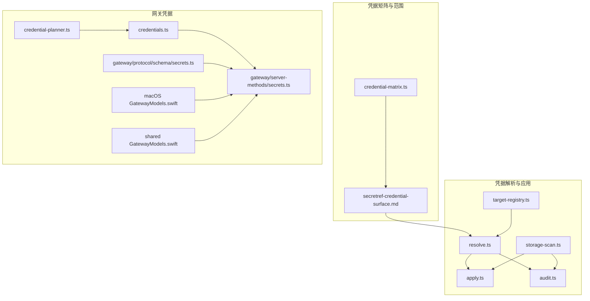
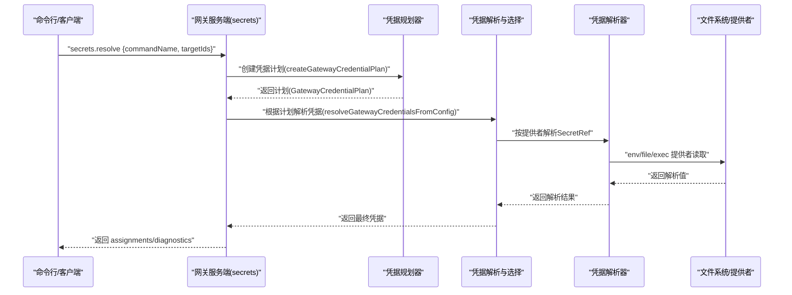
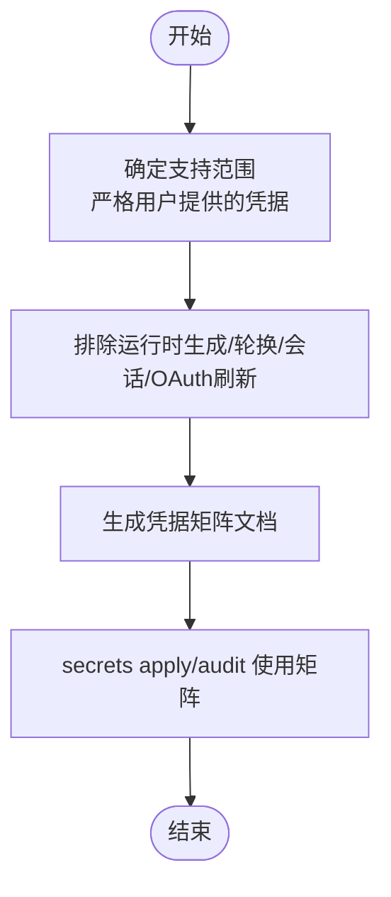
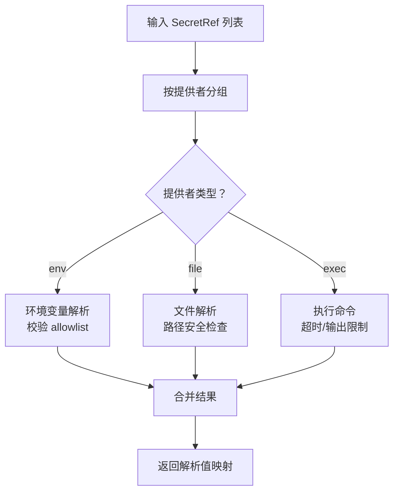
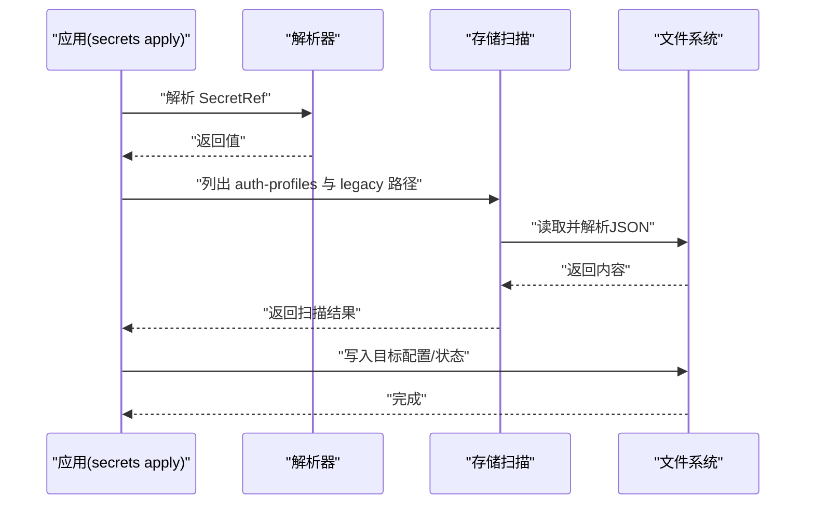
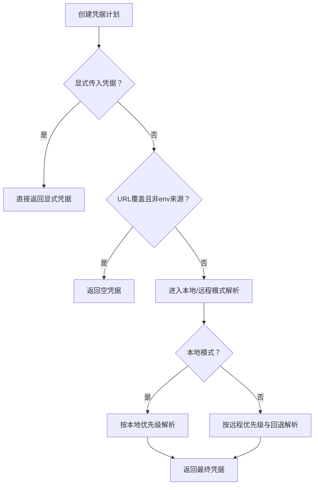
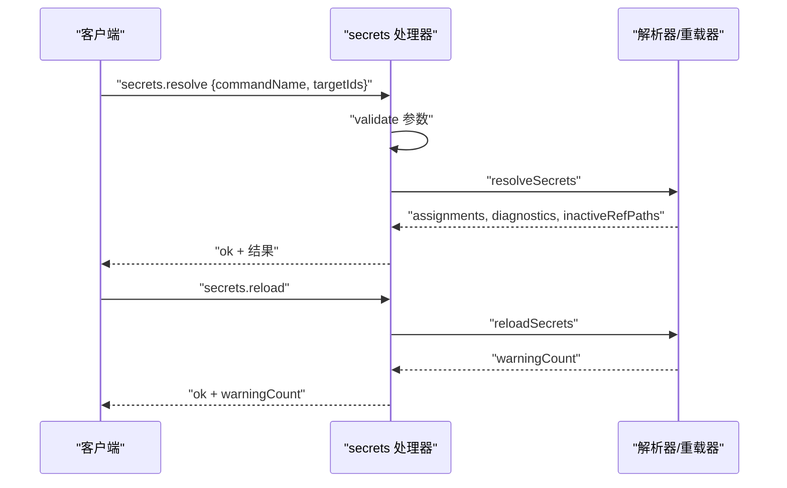
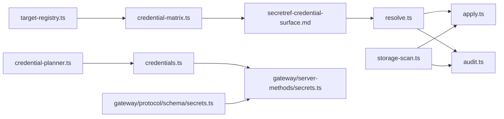

# 凭据管理

<cite>
**本文引用的文件**
- [src/secrets/credential-matrix.ts](file://src/secrets/credential-matrix.ts)
- [docs/reference/secretref-credential-surface.md](file://docs/reference/secretref-credential-surface.md)
- [src/gateway/credentials.ts](file://src/gateway/credentials.ts)
- [src/gateway/credential-planner.ts](file://src/gateway/credential-planner.ts)
- [src/gateway/protocol/schema/secrets.ts](file://src/gateway/protocol/schema/secrets.ts)
- [apps/macos/Sources/OpenClawProtocol/GatewayModels.swift](file://apps/macos/Sources/OpenClawProtocol/GatewayModels.swift)
- [apps/shared/OpenClawKit/Sources/OpenClawProtocol/GatewayModels.swift](file://apps/shared/OpenClawKit/Sources/OpenClawProtocol/GatewayModels.swift)
- [src/gateway/server-methods/secrets.ts](file://src/gateway/server-methods/secrets.ts)
- [src/secrets/resolve.ts](file://src/secrets/resolve.ts)
- [src/secrets/apply.ts](file://src/secrets/apply.ts)
- [src/secrets/audit.ts](file://src/secrets/audit.ts)
- [src/secrets/storage-scan.ts](file://src/secrets/storage-scan.ts)
- [src/secrets/target-registry.ts](file://src/secrets/target-registry.ts)
</cite>

## 目录

1. [简介](#简介)
2. [项目结构](#项目结构)
3. [核心组件](#核心组件)
4. [架构总览](#架构总览)
5. [详细组件分析](#详细组件分析)
6. [依赖关系分析](#依赖关系分析)
7. [性能考量](#性能考量)
8. [故障排查指南](#故障排查指南)
9. [结论](#结论)
10. [附录](#附录)

## 简介

本指南聚焦于凭据管理与安全存储，覆盖以下方面：

- 敏感信息的加密与安全存储策略（基于路径权限审计与最小暴露原则）
- 访问控制与凭据解析优先级（环境变量、配置文件、外部执行器）
- 生命周期管理：创建、更新、删除与轮换流程
- 凭据模板与环境变量注入、动态配置更新机制
- 泄露预防与应急响应流程

系统通过“凭据矩阵”定义支持范围，结合“凭据规划器”与“凭据解析器”，在运行时将 SecretRef 解析为明文值，并在应用层进行安全注入与持久化。

## 项目结构

围绕凭据管理的关键目录与文件：

- 凭据矩阵与支持范围：src/secrets/credential-matrix.ts、docs/reference/secretref-credential-surface.md
- 凭据解析与应用：src/secrets/resolve.ts、src/secrets/apply.ts、src/secrets/audit.ts、src/secrets/storage-scan.ts
- 网关凭据选择与优先级：src/gateway/credentials.ts、src/gateway/credential-planner.ts
- 网关协议与模型：src/gateway/protocol/schema/secrets.ts、apps/macos/Sources/OpenClawProtocol/GatewayModels.swift、apps/shared/OpenClawKit/Sources/OpenClawProtocol/GatewayModels.swift
- 网关服务端方法：src/gateway/server-methods/secrets.ts
- 目标注册与路径模式：src/secrets/target-registry.ts

**图表来源**

- [src/secrets/credential-matrix.ts:1-61](file://src/secrets/credential-matrix.ts#L1-L61)
- [docs/reference/secretref-credential-surface.md:1-130](file://docs/reference/secretref-credential-surface.md#L1-L130)
- [src/secrets/resolve.ts:1-800](file://src/secrets/resolve.ts#L1-L800)
- [src/secrets/apply.ts:1-34](file://src/secrets/apply.ts#L1-L34)
- [src/secrets/audit.ts:256-297](file://src/secrets/audit.ts#L256-L297)
- [src/secrets/storage-scan.ts:1-133](file://src/secrets/storage-scan.ts#L1-L133)
- [src/secrets/target-registry.ts:1-2](file://src/secrets/target-registry.ts#L1-L2)
- [src/gateway/credential-planner.ts:1-217](file://src/gateway/credential-planner.ts#L1-L217)
- [src/gateway/credentials.ts:1-351](file://src/gateway/credentials.ts#L1-L351)
- [src/gateway/protocol/schema/secrets.ts:1-35](file://src/gateway/protocol/schema/secrets.ts#L1-L35)
- [apps/macos/Sources/OpenClawProtocol/GatewayModels.swift:1161-1213](file://apps/macos/Sources/OpenClawProtocol/GatewayModels.swift#L1161-L1213)
- [apps/shared/OpenClawKit/Sources/OpenClawProtocol/GatewayModels.swift:1161-1213](file://apps/shared/OpenClawKit/Sources/OpenClawProtocol/GatewayModels.swift#L1161-L1213)
- [src/gateway/server-methods/secrets.ts:26-68](file://src/gateway/server-methods/secrets.ts#L26-L68)

**章节来源**

- [src/secrets/credential-matrix.ts:1-61](file://src/secrets/credential-matrix.ts#L1-L61)
- [docs/reference/secretref-credential-surface.md:1-130](file://docs/reference/secretref-credential-surface.md#L1-L130)
- [src/gateway/credentials.ts:1-351](file://src/gateway/credentials.ts#L1-L351)
- [src/gateway/credential-planner.ts:1-217](file://src/gateway/credential-planner.ts#L1-L217)
- [src/gateway/protocol/schema/secrets.ts:1-35](file://src/gateway/protocol/schema/secrets.ts#L1-L35)
- [apps/macos/Sources/OpenClawProtocol/GatewayModels.swift:1161-1213](file://apps/macos/Sources/OpenClawProtocol/GatewayModels.swift#L1161-L1213)
- [apps/shared/OpenClawKit/Sources/OpenClawProtocol/GatewayModels.swift:1161-1213](file://apps/shared/OpenClawKit/Sources/OpenClawProtocol/GatewayModels.swift#L1161-L1213)
- [src/gateway/server-methods/secrets.ts:26-68](file://src/gateway/server-methods/secrets.ts#L26-L68)
- [src/secrets/resolve.ts:1-800](file://src/secrets/resolve.ts#L1-L800)
- [src/secrets/apply.ts:1-34](file://src/secrets/apply.ts#L1-L34)
- [src/secrets/audit.ts:256-297](file://src/secrets/audit.ts#L256-L297)
- [src/secrets/storage-scan.ts:1-133](file://src/secrets/storage-scan.ts#L1-L133)
- [src/secrets/target-registry.ts:1-2](file://src/secrets/target-registry.ts#L1-L2)

## 核心组件

- 凭据矩阵与支持范围
  - 通过“凭据矩阵文档”定义受支持的 SecretRef 范围与排除项，确保仅对用户提供的静态凭据启用 SecretRef 管理。
  - 支持范围包括 openclaw.json 与 auth-profiles.json 的目标键位；排除运行时生成或轮换类凭据。
- 凭据解析器
  - 支持 env/file/exec 三类提供者，具备并发限制、批量大小限制、超时与输出大小限制等安全参数。
  - 对文件提供者进行路径权限与归属校验，避免世界可读/写与非当前用户拥有。
- 凭据应用与审计
  - 应用阶段将解析结果写入目标配置与状态文件，同时扫描历史遗留位置与 auth-profiles 存储以进行审计。
  - 审计收集未解析引用、无效 JSON、过宽权限等风险点。
- 网关凭据选择
  - 基于配置与环境变量构建“凭据计划”，决定本地/远程模式、优先级与回退策略，防止 SecretRef 在不可用上下文中被使用。
- 协议与服务端方法
  - 定义 secrets.resolve/secrets.reload 的请求/响应结构与错误码，服务端实现参数校验与错误响应。

**章节来源**

- [src/secrets/credential-matrix.ts:14-60](file://src/secrets/credential-matrix.ts#L14-L60)
- [docs/reference/secretref-credential-surface.md:14-130](file://docs/reference/secretref-credential-surface.md#L14-L130)
- [src/secrets/resolve.ts:167-276](file://src/secrets/resolve.ts#L167-L276)
- [src/secrets/resolve.ts:786-800](file://src/secrets/resolve.ts#L786-L800)
- [src/secrets/apply.ts:1-34](file://src/secrets/apply.ts#L1-L34)
- [src/secrets/audit.ts:256-297](file://src/secrets/audit.ts#L256-L297)
- [src/gateway/credentials.ts:267-323](file://src/gateway/credentials.ts#L267-L323)
- [src/gateway/credential-planner.ts:137-216](file://src/gateway/credential-planner.ts#L137-L216)
- [src/gateway/protocol/schema/secrets.ts:1-35](file://src/gateway/protocol/schema/secrets.ts#L1-L35)
- [src/gateway/server-methods/secrets.ts:26-68](file://src/gateway/server-methods/secrets.ts#L26-L68)

## 架构总览

下图展示从“凭据矩阵”到“凭据解析/应用/审计”的整体流程，以及网关侧的凭据选择与协议交互。

**图表来源**

- [src/gateway/server-methods/secrets.ts:26-68](file://src/gateway/server-methods/secrets.ts#L26-L68)
- [src/gateway/credential-planner.ts:137-216](file://src/gateway/credential-planner.ts#L137-L216)
- [src/gateway/credentials.ts:267-323](file://src/gateway/credentials.ts#L267-L323)
- [src/secrets/resolve.ts:167-276](file://src/secrets/resolve.ts#L167-L276)

## 详细组件分析

### 凭据矩阵与支持范围

- 凭据矩阵文档用于生成“凭据表面”清单，明确哪些键位支持 SecretRef，哪些排除（如会话令牌、OAuth 刷新材料等）。
- 排除列表覆盖运行时生成/轮换、会话类与 OAuth 持久化材料，确保只对静态用户输入启用 SecretRef 管理。

**图表来源**

- [src/secrets/credential-matrix.ts:23-60](file://src/secrets/credential-matrix.ts#L23-L60)
- [docs/reference/secretref-credential-surface.md:14-130](file://docs/reference/secretref-credential-surface.md#L14-L130)

**章节来源**

- [src/secrets/credential-matrix.ts:14-60](file://src/secrets/credential-matrix.ts#L14-L60)
- [docs/reference/secretref-credential-surface.md:14-130](file://docs/reference/secretref-credential-surface.md#L14-L130)

### 凭据解析器（env/file/exec）

- 并发与批量限制：限制每个提供者的并发数、每批最大字节数与最大引用数，防止资源滥用与拒绝服务。
- 文件提供者安全检查：绝对路径、非符号链接、非世界可读/写、当前用户归属（类 Unix），Windows 上 ACL 可验证性提示。
- 执行提供者：严格的超时、无输出超时、最大输出字节限制；要求协议版本与响应格式正确。
- 错误分类：区分提供者级与引用级错误，便于定位问题来源。

**图表来源**

- [src/secrets/resolve.ts:167-276](file://src/secrets/resolve.ts#L167-L276)
- [src/secrets/resolve.ts:345-376](file://src/secrets/resolve.ts#L345-L376)
- [src/secrets/resolve.ts:378-428](file://src/secrets/resolve.ts#L378-L428)
- [src/secrets/resolve.ts:652-784](file://src/secrets/resolve.ts#L652-L784)

**章节来源**

- [src/secrets/resolve.ts:167-276](file://src/secrets/resolve.ts#L167-L276)
- [src/secrets/resolve.ts:345-376](file://src/secrets/resolve.ts#L345-L376)
- [src/secrets/resolve.ts:378-428](file://src/secrets/resolve.ts#L378-L428)
- [src/secrets/resolve.ts:652-784](file://src/secrets/resolve.ts#L652-L784)

### 凭据应用与审计

- 应用阶段：将解析后的值写入目标配置与状态文件，同时扫描 auth-profiles 与遗留 auth.json 位置，确保覆盖所有可能的存储位置。
- 审计阶段：收集未解析引用、无效 JSON、过宽权限等风险点，形成诊断报告。

**图表来源**

- [src/secrets/apply.ts:1-34](file://src/secrets/apply.ts#L1-L34)
- [src/secrets/storage-scan.ts:13-73](file://src/secrets/storage-scan.ts#L13-L73)
- [src/secrets/audit.ts:256-297](file://src/secrets/audit.ts#L256-L297)

**章节来源**

- [src/secrets/apply.ts:1-34](file://src/secrets/apply.ts#L1-L34)
- [src/secrets/storage-scan.ts:13-73](file://src/secrets/storage-scan.ts#L13-L73)
- [src/secrets/audit.ts:256-297](file://src/secrets/audit.ts#L256-L297)

### 网关凭据选择与优先级

- 凭据规划器：从配置与环境变量中提取候选值，识别是否为 SecretRef，计算本地/远程表面与回退条件。
- 凭据解析：根据规划结果与优先级（env-first/config-first、remote-first/env-first 等）解析最终凭据；若在不可用上下文使用 SecretRef，抛出专用错误。

**图表来源**

- [src/gateway/credential-planner.ts:137-216](file://src/gateway/credential-planner.ts#L137-L216)
- [src/gateway/credentials.ts:267-323](file://src/gateway/credentials.ts#L267-L323)

**章节来源**

- [src/gateway/credential-planner.ts:137-216](file://src/gateway/credential-planner.ts#L137-L216)
- [src/gateway/credentials.ts:267-323](file://src/gateway/credentials.ts#L267-L323)

### 协议与服务端方法

- 协议定义：secrets.resolve/secrets.reload 的请求/响应结构，包含 assignments、diagnostics、inactiveRefPaths 等字段。
- 服务端实现：参数校验、错误响应（INVALID_REQUEST/UNAVAILABLE）、调用内部解析与重载逻辑。

**图表来源**

- [src/gateway/protocol/schema/secrets.ts:1-35](file://src/gateway/protocol/schema/secrets.ts#L1-L35)
- [apps/macos/Sources/OpenClawProtocol/GatewayModels.swift:1161-1213](file://apps/macos/Sources/OpenClawProtocol/GatewayModels.swift#L1161-L1213)
- [apps/shared/OpenClawKit/Sources/OpenClawProtocol/GatewayModels.swift:1161-1213](file://apps/shared/OpenClawKit/Sources/OpenClawProtocol/GatewayModels.swift#L1161-L1213)
- [src/gateway/server-methods/secrets.ts:26-68](file://src/gateway/server-methods/secrets.ts#L26-L68)

**章节来源**

- [src/gateway/protocol/schema/secrets.ts:1-35](file://src/gateway/protocol/schema/secrets.ts#L1-L35)
- [apps/macos/Sources/OpenClawProtocol/GatewayModels.swift:1161-1213](file://apps/macos/Sources/OpenClawProtocol/GatewayModels.swift#L1161-L1213)
- [apps/shared/OpenClawKit/Sources/OpenClawProtocol/GatewayModels.swift:1161-1213](file://apps/shared/OpenClawKit/Sources/OpenClawProtocol/GatewayModels.swift#L1161-L1213)
- [src/gateway/server-methods/secrets.ts:26-68](file://src/gateway/server-methods/secrets.ts#L26-L68)

## 依赖关系分析

- 凭据矩阵依赖目标注册表生成条目，再由解析器与应用/审计模块消费。
- 网关凭据选择依赖配置与环境变量，解析器作为底层提供者接口。
- 协议层与服务端方法为跨平台客户端与网关通信提供契约。

**图表来源**

- [src/secrets/target-registry.ts:1-2](file://src/secrets/target-registry.ts#L1-L2)
- [src/secrets/credential-matrix.ts:35-60](file://src/secrets/credential-matrix.ts#L35-L60)
- [docs/reference/secretref-credential-surface.md:1-130](file://docs/reference/secretref-credential-surface.md#L1-L130)
- [src/secrets/resolve.ts:1-800](file://src/secrets/resolve.ts#L1-L800)
- [src/gateway/credential-planner.ts:137-216](file://src/gateway/credential-planner.ts#L137-L216)
- [src/gateway/credentials.ts:267-323](file://src/gateway/credentials.ts#L267-L323)
- [src/gateway/server-methods/secrets.ts:26-68](file://src/gateway/server-methods/secrets.ts#L26-L68)
- [src/gateway/protocol/schema/secrets.ts:1-35](file://src/gateway/protocol/schema/secrets.ts#L1-L35)
- [src/secrets/apply.ts:1-34](file://src/secrets/apply.ts#L1-L34)
- [src/secrets/audit.ts:256-297](file://src/secrets/audit.ts#L256-L297)
- [src/secrets/storage-scan.ts:1-133](file://src/secrets/storage-scan.ts#L1-L133)

**章节来源**

- [src/secrets/target-registry.ts:1-2](file://src/secrets/target-registry.ts#L1-L2)
- [src/secrets/credential-matrix.ts:35-60](file://src/secrets/credential-matrix.ts#L35-L60)
- [docs/reference/secretref-credential-surface.md:1-130](file://docs/reference/secretref-credential-surface.md#L1-L130)
- [src/secrets/resolve.ts:1-800](file://src/secrets/resolve.ts#L1-L800)
- [src/gateway/credential-planner.ts:137-216](file://src/gateway/credential-planner.ts#L137-L216)
- [src/gateway/credentials.ts:267-323](file://src/gateway/credentials.ts#L267-L323)
- [src/gateway/server-methods/secrets.ts:26-68](file://src/gateway/server-methods/secrets.ts#L26-L68)
- [src/gateway/protocol/schema/secrets.ts:1-35](file://src/gateway/protocol/schema/secrets.ts#L1-L35)
- [src/secrets/apply.ts:1-34](file://src/secrets/apply.ts#L1-L34)
- [src/secrets/audit.ts:256-297](file://src/secrets/audit.ts#L256-L297)
- [src/secrets/storage-scan.ts:1-133](file://src/secrets/storage-scan.ts#L1-L133)

## 性能考量

- 并发与批处理：限制每个提供者的并发数与每批引用数量，避免高负载导致的资源争用。
- I/O 超时与输出限制：为文件与执行提供者设置超时与最大输出字节，防止长时间阻塞与内存膨胀。
- 路径权限检查：在类 Unix 系统上进行 UID 归属与权限校验，减少后续读写失败带来的重试成本。
- 缓存：文件提供者与引用解析缓存可降低重复读取与解析开销。

**章节来源**

- [src/secrets/resolve.ts:167-180](file://src/secrets/resolve.ts#L167-L180)
- [src/secrets/resolve.ts:278-343](file://src/secrets/resolve.ts#L278-L343)
- [src/secrets/resolve.ts:438-558](file://src/secrets/resolve.ts#L438-L558)

## 故障排查指南

常见问题与定位建议：

- SecretRef 未解析
  - 检查提供者配置是否存在、源匹配是否一致。
  - 环境变量提供者需在 allowlist 中，且变量非空。
  - 文件提供者需满足绝对路径、非符号链接、权限不过宽、当前用户归属。
  - 执行提供者需满足超时、无输出超时、最大输出字节限制与协议版本。
- 网关凭据不可用
  - 若在不可用命令路径使用 SecretRef，将抛出专用错误；可通过设置环境变量、显式参数或在可解析上下文中运行解决。
- 审计发现风险
  - 未解析引用：确认 SecretRef 是否在当前上下文可用。
  - 非法 JSON：修正配置文件格式。
  - 权限过宽：收紧文件权限，避免世界可读/写。

**章节来源**

- [src/secrets/resolve.ts:186-206](file://src/secrets/resolve.ts#L186-L206)
- [src/secrets/resolve.ts:345-376](file://src/secrets/resolve.ts#L345-L376)
- [src/secrets/resolve.ts:208-276](file://src/secrets/resolve.ts#L208-L276)
- [src/gateway/credentials.ts:36-77](file://src/gateway/credentials.ts#L36-L77)
- [src/secrets/audit.ts:256-297](file://src/secrets/audit.ts#L256-L297)

## 结论

本系统通过“凭据矩阵”限定支持范围，结合“凭据规划器”与“凭据解析器”，在保证安全的前提下实现凭据的动态解析与注入。应用与审计流程确保变更可追踪、风险可发现。网关侧的凭据选择与协议契约提供了跨平台的一致行为。建议在生产环境中严格遵循权限最小化、超时与输出限制、以及审计与监控策略，以降低泄露风险并提升可观测性。

## 附录

- 凭据模板与环境变量注入
  - 使用 SecretRef 指向 env/file/exec 提供者，避免在配置中硬编码明文。
  - 通过凭据矩阵与支持范围文档核对目标键位是否受支持。
- 动态配置更新机制
  - secrets.reload 触发重载，secrets.resolve 返回 assignments 与诊断信息，便于增量更新与验证。
- 凭据生命周期管理
  - 创建：在凭据矩阵支持范围内新增 SecretRef。
  - 更新：修改提供者配置或引用，重新应用并审计。
  - 删除：移除 SecretRef 或相关提供者配置，清理残留引用。
  - 轮换：对运行时生成/轮换类凭据采用替代方案（不在 SecretRef 支持范围内）。

**章节来源**

- [docs/reference/secretref-credential-surface.md:19-129](file://docs/reference/secretref-credential-surface.md#L19-L129)
- [src/gateway/server-methods/secrets.ts:26-68](file://src/gateway/server-methods/secrets.ts#L26-L68)
- [src/gateway/credentials.ts:267-323](file://src/gateway/credentials.ts#L267-L323)
