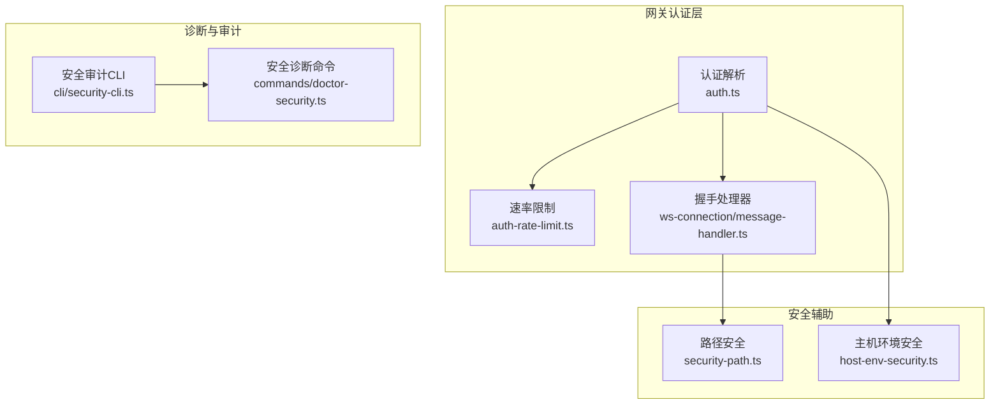
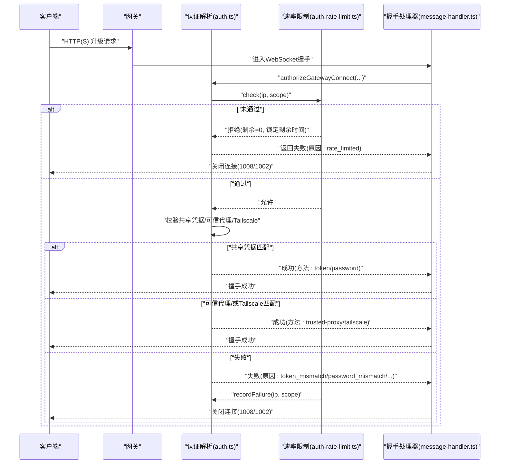
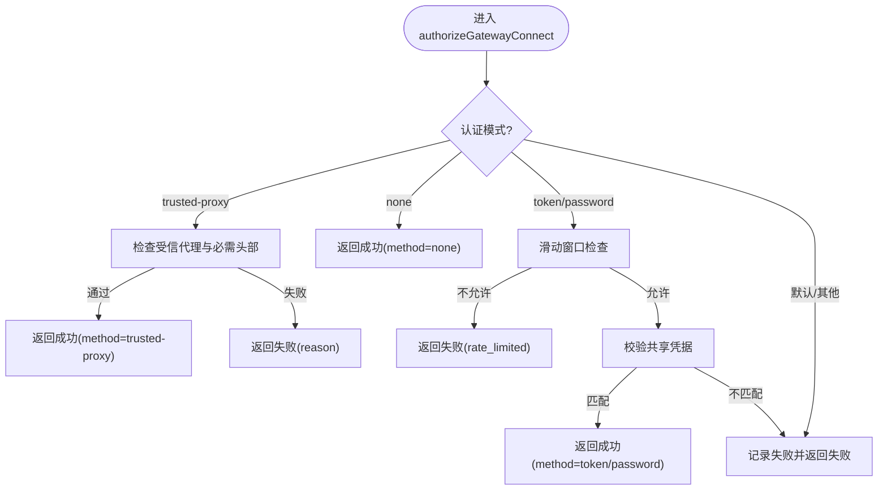
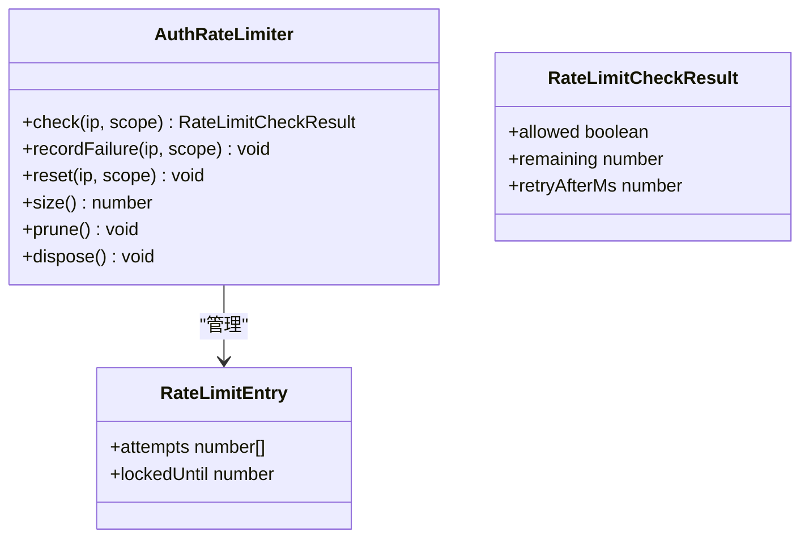
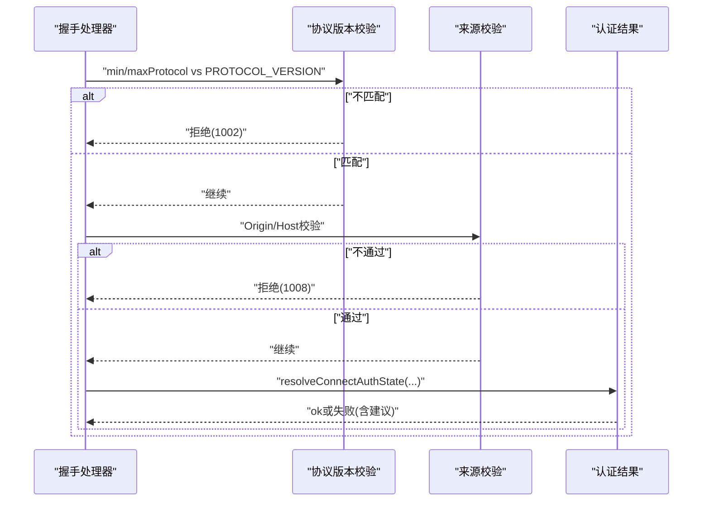
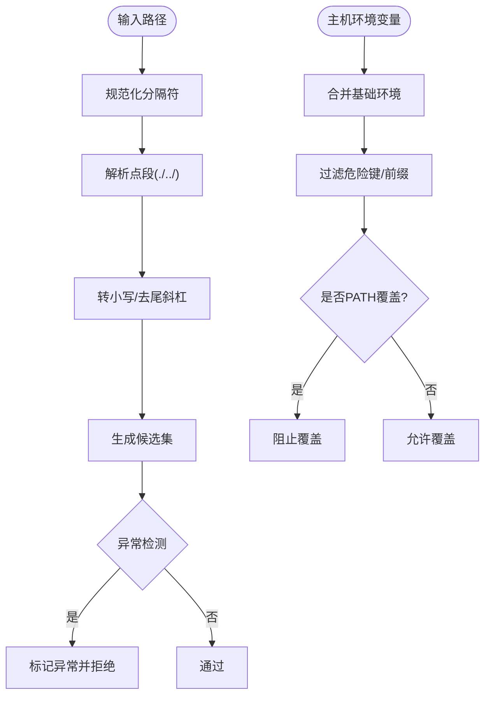
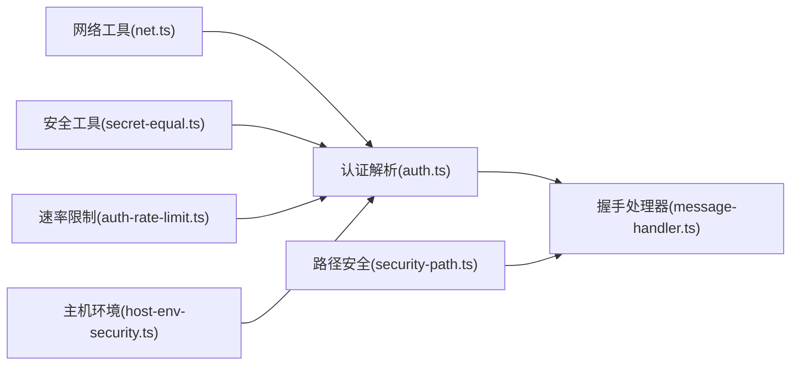

# 网关认证

<cite>
**本文引用的文件**
- [src/gateway/auth.ts](file://src/gateway/auth.ts)
- [src/gateway/auth-rate-limit.ts](file://src/gateway/auth-rate-limit.ts)
- [src/gateway/server/ws-connection/message-handler.ts](file://src/gateway/server/ws-connection/message-handler.ts)
- [src/gateway/security-path.ts](file://src/gateway/security-path.ts)
- [src/infra/host-env-security.ts](file://src/infra/host-env-security.ts)
- [src/commands/doctor-security.ts](file://src/commands/doctor-security.ts)
- [src/cli/security-cli.ts](file://src/cli/security-cli.ts)
</cite>

## 目录

1. [简介](#简介)
2. [项目结构](#项目结构)
3. [核心组件](#核心组件)
4. [架构总览](#架构总览)
5. [详细组件分析](#详细组件分析)
6. [依赖关系分析](#依赖关系分析)
7. [性能考量](#性能考量)
8. [故障排查指南](#故障排查指南)
9. [结论](#结论)
10. [附录](#附录)

## 简介

本文件面向OpenClaw网关认证体系，系统性阐述网关级认证机制、连接认证、令牌验证与访问控制。内容覆盖：

- 客户端连接认证流程（HTTP与WebSocket握手）
- WebSocket握手过程中的身份验证与来源校验
- 网关间通信的认证协议要点
- 认证策略配置（模式选择、可信代理、Tailscale集成）
- 速率限制、IP白名单与安全边界设置
- 常见失败场景诊断与解决建议

## 项目结构

围绕认证的关键模块分布如下：

- 网关认证核心：解析认证模式、执行凭据校验、速率限制与来源判定
- 连接握手处理器：在WebSocket升级阶段完成协议协商、角色与来源校验、设备令牌绑定
- 路径安全与环境安全：路径规范化与危险环境变量过滤
- 安全审计与诊断：CLI安全审计命令与“医生”安全提示

图示来源

- [src/gateway/auth.ts:1-504](file://src/gateway/auth.ts#L1-L504)
- [src/gateway/auth-rate-limit.ts:1-233](file://src/gateway/auth-rate-limit.ts#L1-L233)
- [src/gateway/server/ws-connection/message-handler.ts:400-599](file://src/gateway/server/ws-connection/message-handler.ts#L400-L599)
- [src/gateway/security-path.ts:1-162](file://src/gateway/security-path.ts#L1-L162)
- [src/infra/host-env-security.ts:1-158](file://src/infra/host-env-security.ts#L1-L158)
- [src/cli/security-cli.ts:1-165](file://src/cli/security-cli.ts#L1-L165)
- [src/commands/doctor-security.ts:1-234](file://src/commands/doctor-security.ts#L1-L234)

章节来源

- [src/gateway/auth.ts:1-504](file://src/gateway/auth.ts#L1-L504)
- [src/gateway/auth-rate-limit.ts:1-233](file://src/gateway/auth-rate-limit.ts#L1-L233)
- [src/gateway/server/ws-connection/message-handler.ts:400-599](file://src/gateway/server/ws-connection/message-handler.ts#L400-L599)
- [src/gateway/security-path.ts:1-162](file://src/gateway/security-path.ts#L1-L162)
- [src/infra/host-env-security.ts:1-158](file://src/infra/host-env-security.ts#L1-L158)
- [src/cli/security-cli.ts:1-165](file://src/cli/security-cli.ts#L1-L165)
- [src/commands/doctor-security.ts:1-234](file://src/commands/doctor-security.ts#L1-L234)

## 核心组件

- 认证解析与授权
  - 解析并确定认证模式（无、令牌、密码、可信代理），支持从配置、环境变量与覆盖参数中解析
  - 执行共享凭据校验（令牌/密码），记录失败并触发速率限制
  - 支持Tailscale用户身份校验与本地直连判定
  - 可选启用可信代理模式，基于自定义头部与可选用户白名单进行授权
- 速率限制
  - 滑动窗口计数器，按{作用域, 客户端IP}维度统计失败尝试
  - 默认对回环地址豁免，支持自定义窗口、锁定期与清理周期
- 握手处理器
  - 协议版本协商、角色与来源校验、设备令牌绑定
  - 对控制UI/Webchat等客户端进行Origin校验，必要时允许Host头回退
- 路径与环境安全
  - 路径规范化与候选集生成，检测异常编码与越界段
  - 主机环境变量白名单与覆盖过滤，阻断危险键值与前缀

章节来源

- [src/gateway/auth.ts:217-292](file://src/gateway/auth.ts#L217-L292)
- [src/gateway/auth.ts:378-503](file://src/gateway/auth.ts#L378-L503)
- [src/gateway/auth-rate-limit.ts:95-232](file://src/gateway/auth-rate-limit.ts#L95-L232)
- [src/gateway/server/ws-connection/message-handler.ts:462-532](file://src/gateway/server/ws-connection/message-handler.ts#L462-L532)
- [src/gateway/security-path.ts:106-161](file://src/gateway/security-path.ts#L106-L161)
- [src/infra/host-env-security.ts:83-129](file://src/infra/host-env-security.ts#L83-L129)

## 架构总览

下图展示从请求进入网关到握手完成的认证链路，包括速率限制与来源判定。

图示来源

- [src/gateway/auth.ts:378-485](file://src/gateway/auth.ts#L378-L485)
- [src/gateway/auth-rate-limit.ts:141-199](file://src/gateway/auth-rate-limit.ts#L141-L199)
- [src/gateway/server/ws-connection/message-handler.ts:462-599](file://src/gateway/server/ws-connection/message-handler.ts#L462-L599)

## 详细组件分析

### 组件A：认证解析与授权（auth.ts）

- 功能要点
  - 模式解析：优先级为覆盖配置 > 配置 > 密码 > 令牌 > 默认（令牌）
  - 共享凭据校验：令牌/密码采用常量时间比较；匹配成功则重置速率限制
  - 可信代理：要求来自受信代理且满足必需头部、可选用户白名单
  - Tailscale：仅在非本地直连且允许时启用，结合反向代理头进行身份核验
  - 来源判定：区分本地直连请求，避免误判转发
- 关键类型与行为
  - 返回结构含ok、method、user、reason及可选的rateLimited/retryAfterMs
  - 支持显式authSurface（HTTP/WS控制UI）以决定是否允许Tailscale头认证

图示来源

- [src/gateway/auth.ts:378-485](file://src/gateway/auth.ts#L378-L485)
- [src/gateway/auth-rate-limit.ts:141-199](file://src/gateway/auth-rate-limit.ts#L141-L199)

章节来源

- [src/gateway/auth.ts:217-292](file://src/gateway/auth.ts#L217-L292)
- [src/gateway/auth.ts:378-503](file://src/gateway/auth.ts#L378-L503)

### 组件B：速率限制（auth-rate-limit.ts）

- 设计特性
  - 滑动窗口失败计数，支持多作用域（如共享凭据、设备令牌、Hook认证）
  - 回环地址默认豁免，避免本地会话被锁死
  - 后台定时清理过期条目，防止内存膨胀
- 关键接口
  - check/reset/recordFailure/prune/dispose
  - 归一化客户端IP（兼容IPv4映射IPv6）

图示来源

- [src/gateway/auth-rate-limit.ts:59-72](file://src/gateway/auth-rate-limit.ts#L59-L72)
- [src/gateway/auth-rate-limit.ts:43-57](file://src/gateway/auth-rate-limit.ts#L43-L57)

章节来源

- [src/gateway/auth-rate-limit.ts:1-233](file://src/gateway/auth-rate-limit.ts#L1-L233)

### 组件C：WebSocket握手与来源校验（message-handler.ts）

- 协议与角色
  - 协商协议版本，不匹配则拒绝并关闭
  - 角色解析与默认拒绝策略（需显式scopes）
- 来源校验
  - 控制UI/Webchat等客户端强制Origin校验
  - 可选允许Host头作为Origin回退（受配置开关控制）
- 设备令牌绑定
  - 若共享凭据错误但存在设备身份，允许改用设备令牌重试
- 失败恢复建议
  - 根据失败原因返回下一步建议（更新配置/凭据/等待重试/审查配置）

图示来源

- [src/gateway/server/ws-connection/message-handler.ts:462-532](file://src/gateway/server/ws-connection/message-handler.ts#L462-L532)
- [src/gateway/server/ws-connection/message-handler.ts:564-599](file://src/gateway/server/ws-connection/message-handler.ts#L564-L599)

章节来源

- [src/gateway/server/ws-connection/message-handler.ts:400-599](file://src/gateway/server/ws-connection/message-handler.ts#L400-L599)

### 组件D：路径安全与环境安全

- 路径安全
  - 规范化分隔符、去除多余斜杠与尾随斜杠
  - 处理点段（.、..）与大小写转换，生成候选路径集
  - 异常检测：畸形编码、解码上限到达、原始路径匹配
- 主机环境安全
  - 基于策略文件的危险键名/前缀白名单
  - 执行环境变量合并与覆盖过滤，阻断危险键值
  - Shell包装器下的覆盖键白名单，严格限制PATH覆盖

图示来源

- [src/gateway/security-path.ts:106-161](file://src/gateway/security-path.ts#L106-L161)
- [src/infra/host-env-security.ts:83-129](file://src/infra/host-env-security.ts#L83-L129)

章节来源

- [src/gateway/security-path.ts:1-162](file://src/gateway/security-path.ts#L1-L162)
- [src/infra/host-env-security.ts:1-158](file://src/infra/host-env-security.ts#L1-L158)

## 依赖关系分析

- 认证解析依赖网络工具（来源IP解析、可信代理判定）、速率限制器与安全工具（常量时间比较、Tailscale Whois）
- 握手处理器依赖认证解析结果，并在协议与来源校验后决定是否建立连接
- 速率限制器为纯内存实现，避免外部依赖，适合单进程网关
- 路径与环境安全模块为独立工具，服务于更广的安全边界

图示来源

- [src/gateway/auth.ts:1-22](file://src/gateway/auth.ts#L1-L22)
- [src/gateway/auth-rate-limit.ts:19-21](file://src/gateway/auth-rate-limit.ts#L19-L21)
- [src/gateway/server/ws-connection/message-handler.ts:400-532](file://src/gateway/server/ws-connection/message-handler.ts#L400-L532)
- [src/gateway/security-path.ts:1-162](file://src/gateway/security-path.ts#L1-L162)
- [src/infra/host-env-security.ts:1-158](file://src/infra/host-env-security.ts#L1-L158)

章节来源

- [src/gateway/auth.ts:1-22](file://src/gateway/auth.ts#L1-L22)
- [src/gateway/auth-rate-limit.ts:19-21](file://src/gateway/auth-rate-limit.ts#L19-L21)
- [src/gateway/server/ws-connection/message-handler.ts:400-532](file://src/gateway/server/ws-connection/message-handler.ts#L400-L532)
- [src/gateway/security-path.ts:1-162](file://src/gateway/security-path.ts#L1-L162)
- [src/infra/host-env-security.ts:1-158](file://src/infra/host-env-security.ts#L1-L158)

## 性能考量

- 速率限制
  - 滑动窗口与定期清理降低内存占用；默认窗口1分钟，锁定期5分钟，适合缓解暴力破解
  - 回环豁免避免本地调试与运维操作被误伤
- 握手阶段
  - 协议版本与来源校验为轻量CPU操作；建议在高并发场景下保持合理的超时与并发阈值
- 路径与环境安全
  - 路径规范化与候选集生成为O(n)复杂度；环境变量过滤按键名集合判断，开销较小

## 故障排查指南

- 常见失败原因与建议
  - 协议不匹配：确认客户端协议版本范围与网关一致
  - 无效握手/角色非法：检查首次帧与角色参数
  - Origin不允许：在控制UI配置中添加允许的Origin，或启用Host头回退（谨慎使用）
  - 令牌/密码错误：核对凭据配置与覆盖；注意速率限制导致的临时锁定
  - 速率限制：等待锁定期结束或调整配置；回环地址默认豁免
  - 受信代理/可信Tailscale：检查代理来源、必需头部与用户白名单
- 诊断命令
  - 使用安全审计命令扫描配置与状态中的常见安全风险
  - 使用“医生”命令输出安全警告与修复建议，包括网关绑定暴露与DM策略

章节来源

- [src/gateway/server/ws-connection/message-handler.ts:400-599](file://src/gateway/server/ws-connection/message-handler.ts#L400-L599)
- [src/gateway/auth.ts:415-485](file://src/gateway/auth.ts#L415-L485)
- [src/cli/security-cli.ts:30-165](file://src/cli/security-cli.ts#L30-L165)
- [src/commands/doctor-security.ts:51-234](file://src/commands/doctor-security.ts#L51-L234)

## 结论

OpenClaw网关认证体系以“明确模式、严格校验、可审计”为核心设计原则：通过认证解析与速率限制抵御暴力破解，借助握手处理器强化协议与来源约束，辅以路径与环境安全工具构建纵深防御。配合CLI安全审计与“医生”诊断命令，可帮助运维人员快速定位并修复潜在风险，确保网关在开放网络中的安全运行。

## 附录

### 认证策略配置要点

- 模式选择
  - none：无需认证（仅限内网或受控环境）
  - token：共享令牌认证（推荐用于远程访问）
  - password：共享密码认证（启动早期或特殊场景）
  - trusted-proxy：由前置代理注入用户身份（需配置必需头部与可选用户白名单）
- Tailscale集成
  - 在非本地直连且允许时启用，结合反向代理头进行身份核验
- 来源校验
  - 控制UI/Webchat等客户端强制Origin校验；可选允许Host头回退（仅在受信任场景启用）

章节来源

- [src/gateway/auth.ts:217-292](file://src/gateway/auth.ts#L217-L292)
- [src/gateway/auth.ts:378-503](file://src/gateway/auth.ts#L378-L503)
- [src/gateway/server/ws-connection/message-handler.ts:497-532](file://src/gateway/server/ws-connection/message-handler.ts#L497-L532)
