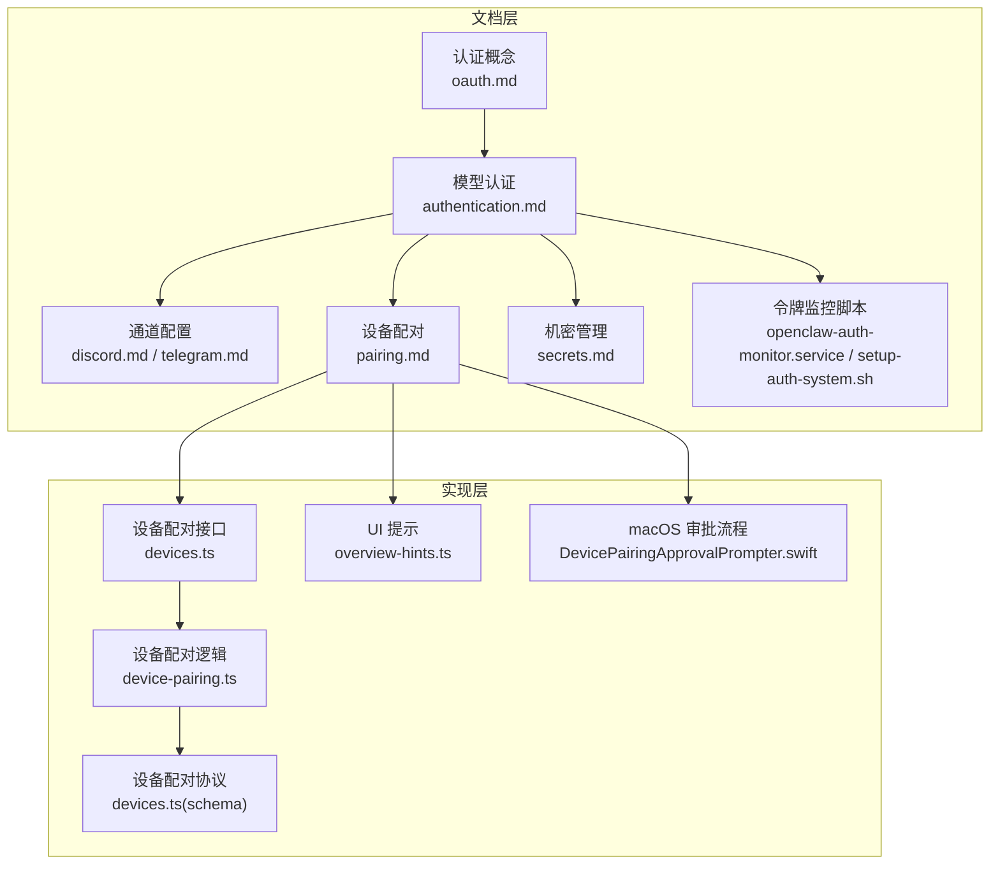
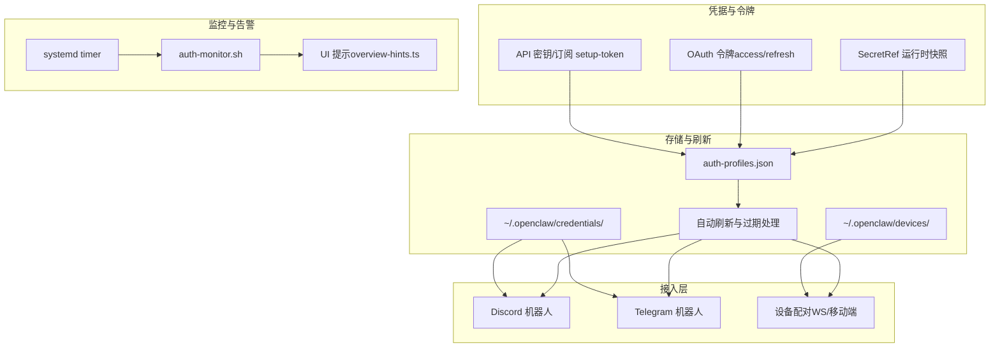
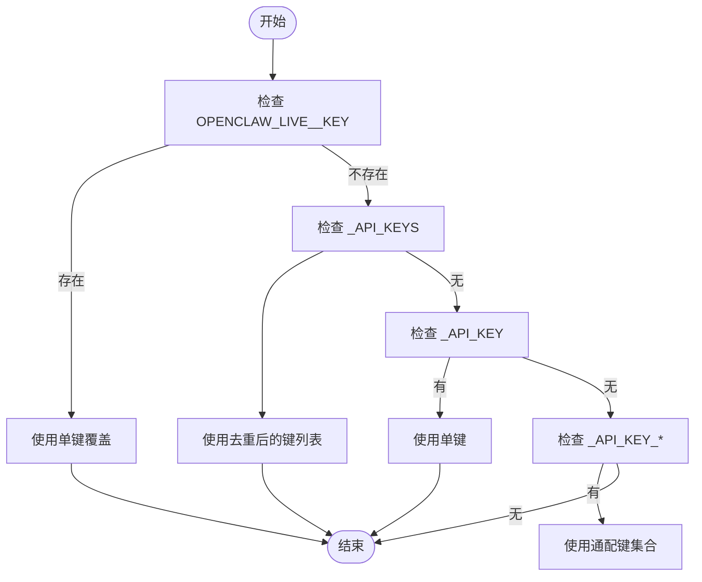
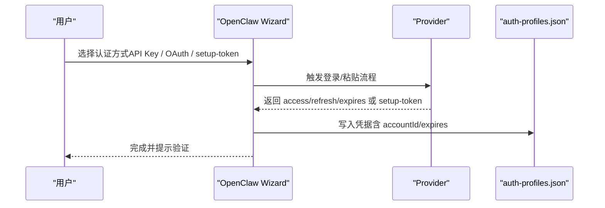
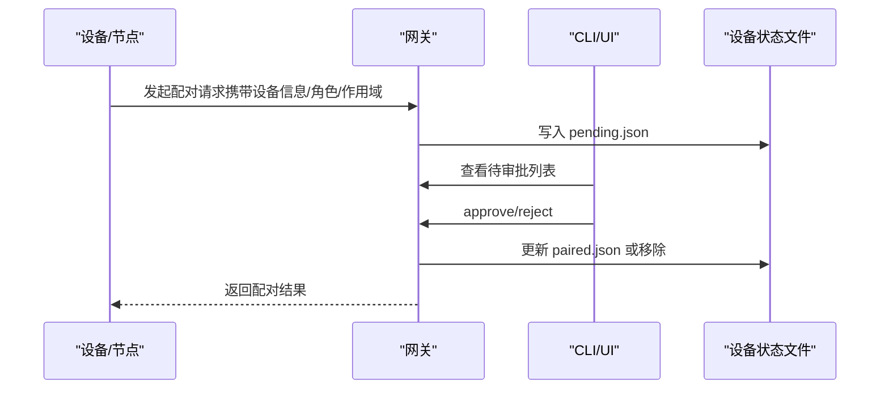
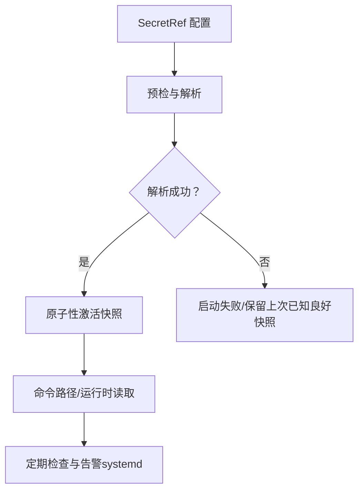
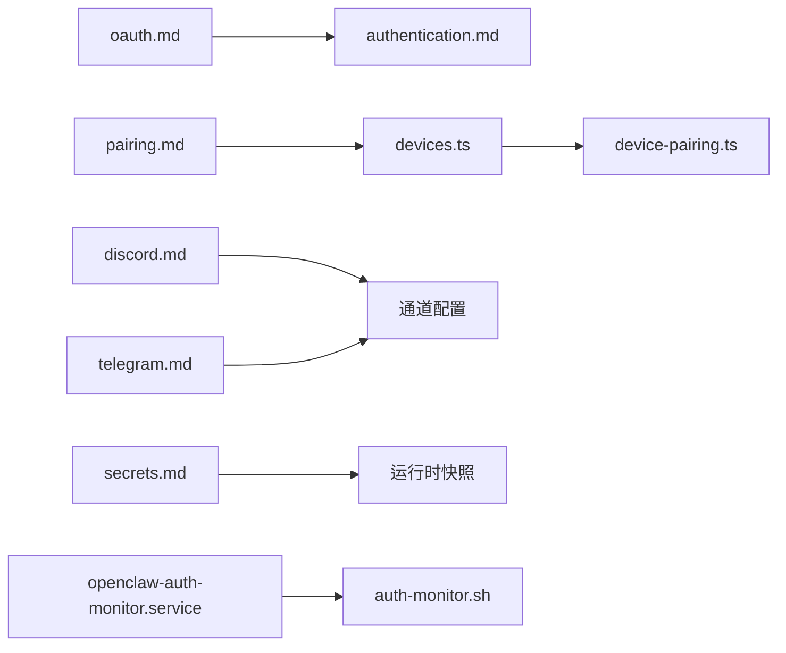
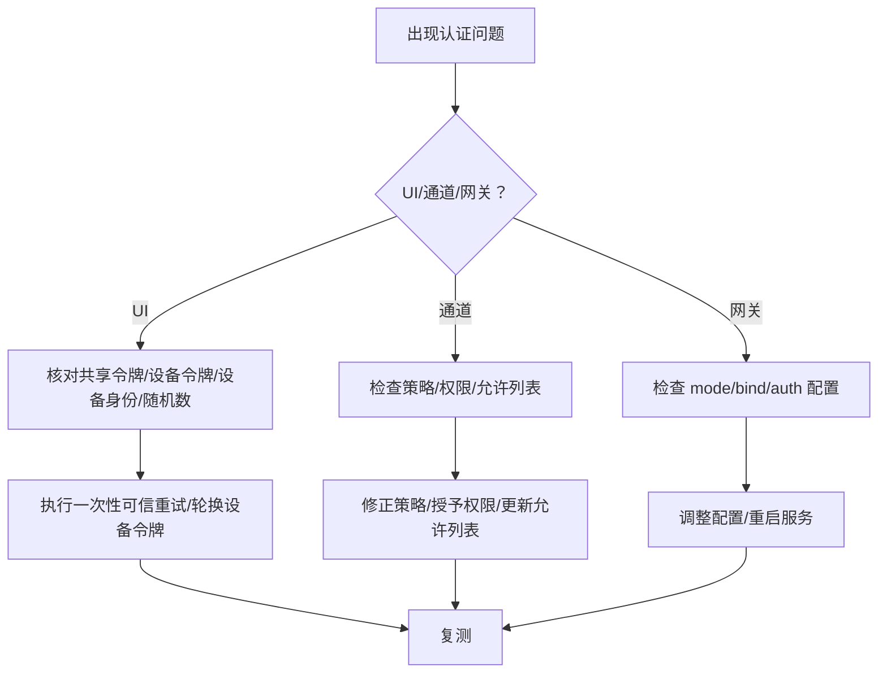

# 认证配置

<cite>
**本文档引用的文件**
- [authentication.md](file://docs/gateway/authentication.md)
- [oauth.md](file://docs/concepts/oauth.md)
- [pairing.md](file://docs/channels/pairing.md)
- [secrets.md](file://docs/gateway/secrets.md)
- [openai.md](file://docs/providers/openai.md)
- [anthropic.md](file://docs/providers/anthropic.md)
- [discord.md](file://docs/channels/discord.md)
- [telegram.md](file://docs/channels/telegram.md)
- [troubleshooting.md](file://docs/gateway/troubleshooting.md)
- [troubleshooting.md](file://docs/help/troubleshooting.md)
- [openclaw-auth-monitor.service](file://scripts/systemd/openclaw-auth-monitor.service)
- [setup-auth-system.sh](file://scripts/setup-auth-system.sh)
- [devices.ts](file://src/gateway/server-methods/devices.ts)
- [device-pairing.ts](file://src/infra/device-pairing.ts)
- [devices.ts](file://src/gateway/protocol/schema/devices.ts)
- [overview-hints.ts](file://ui/src/ui/views/overview-hints.ts)
- [DevicePairingApprovalPrompter.swift](file://apps/macos/Sources/OpenClaw/DevicePairingApprovalPrompter.swift)
</cite>

## 目录

1. [简介](#简介)
2. [项目结构](#项目结构)
3. [核心组件](#核心组件)
4. [架构总览](#架构总览)
5. [详细组件分析](#详细组件分析)
6. [依赖关系分析](#依赖关系分析)
7. [性能考虑](#性能考虑)
8. [故障排除指南](#故障排除指南)
9. [结论](#结论)
10. [附录](#附录)

## 简介

本指南面向在 OpenClaw 中配置和管理各类认证方式的用户，覆盖以下主题：

- 模型提供商认证：API 密钥、OAuth、订阅 setup-token
- 第三方通道认证：Discord、Telegram 等
- 设备配对与节点认证
- 认证令牌管理、轮换策略与安全最佳实践
- 常见认证失败的诊断与修复

## 项目结构

OpenClaw 的认证相关能力由多层文档与实现共同支撑：

- 文档层：认证与 OAuth 概念、各渠道配置、令牌监控脚本
- 实现层：网关设备配对接口、令牌存储与刷新逻辑、UI 提示与 macOS 审批流程

**图表来源**

- [oauth.md](file://docs/concepts/oauth.md)
- [authentication.md](file://docs/gateway/authentication.md)
- [discord.md](file://docs/channels/discord.md)
- [telegram.md](file://docs/channels/telegram.md)
- [pairing.md](file://docs/channels/pairing.md)
- [secrets.md](file://docs/gateway/secrets.md)
- [openclaw-auth-monitor.service](file://scripts/systemd/openclaw-auth-monitor.service)
- [devices.ts](file://src/gateway/server-methods/devices.ts)
- [device-pairing.ts](file://src/infra/device-pairing.ts)
- [devices.ts](file://src/gateway/protocol/schema/devices.ts)
- [overview-hints.ts](file://ui/src/ui/views/overview-hints.ts)
- [DevicePairingApprovalPrompter.swift](file://apps/macos/Sources/OpenClaw/DevicePairingApprovalPrompter.swift)

**章节来源**

- [authentication.md](file://docs/gateway/authentication.md)
- [oauth.md](file://docs/concepts/oauth.md)
- [pairing.md](file://docs/channels/pairing.md)
- [secrets.md](file://docs/gateway/secrets.md)
- [openclaw-auth-monitor.service](file://scripts/systemd/openclaw-auth-monitor.service)

## 核心组件

- 模型认证与凭据管理
  - 支持 API 密钥、OAuth（含订阅 setup-token）、SecretRef 存储与运行时快照
  - 多账户/多配置文件的凭据路由与优先级控制
- 通道认证
  - Discord 机器人令牌、权限与意图配置；Telegram 机器人令牌与分组策略
- 设备配对与节点认证
  - 设备请求、审批、拒绝、轮换与撤销；UI 提示与 macOS 审批流程
- 令牌监控与告警
  - systemd 任务与脚本，定时检查令牌状态并通知

**章节来源**

- [authentication.md](file://docs/gateway/authentication.md)
- [oauth.md](file://docs/concepts/oauth.md)
- [discord.md](file://docs/channels/discord.md)
- [telegram.md](file://docs/channels/telegram.md)
- [pairing.md](file://docs/channels/pairing.md)
- [secrets.md](file://docs/gateway/secrets.md)
- [openclaw-auth-monitor.service](file://scripts/systemd/openclaw-auth-monitor.service)

## 架构总览

OpenClaw 的认证体系围绕“凭据存储—令牌刷新—通道/设备接入—UI/脚本告警”展开。

**图表来源**

- [authentication.md](file://docs/gateway/authentication.md)
- [oauth.md](file://docs/concepts/oauth.md)
- [discord.md](file://docs/channels/discord.md)
- [telegram.md](file://docs/channels/telegram.md)
- [pairing.md](file://docs/channels/pairing.md)
- [secrets.md](file://docs/gateway/secrets.md)
- [openclaw-auth-monitor.service](file://scripts/systemd/openclaw-auth-monitor.service)
- [overview-hints.ts](file://ui/src/ui/views/overview-hints.ts)

## 详细组件分析

### 组件一：模型认证与凭据管理

- 支持方式
  - API 密钥：适用于长期运行的网关主机，推荐将密钥写入环境或 .env 文件
  - OAuth：支持订阅型 OAuth（如 OpenAI Codex），以及 provider 插件自定义 OAuth
  - setup-token（Anthropic）：订阅授权的兼容路径，需注意政策风险
  - SecretRef：通过 env/file/exec 提供器将敏感值以引用形式注入，避免明文存储
- 凭据优先级与轮换
  - OPENCLAW*LIVE*<PROVIDER>\_KEY 单键覆盖
  - <PROVIDER>\_API_KEYS 列表（去重后按错误类型重试）
  - <PROVIDER>_API_KEY 与 <PROVIDER>\_API_KEY_\* 多键回退
- 多账户与路由
  - 支持 per-agent 的 auth-profiles.json 与 per-session 的 /model @profile 路由
  - 支持 profiles 多账号模式与全局/会话级排序控制

**图表来源**

- [authentication.md](file://docs/gateway/authentication.md)

**章节来源**

- [authentication.md](file://docs/gateway/authentication.md)
- [oauth.md](file://docs/concepts/oauth.md)
- [secrets.md](file://docs/gateway/secrets.md)

### 组件二：第三方服务认证配置

- OpenAI
  - API 密钥：直接平台密钥，适合用量计费场景
  - Codex 订阅 OAuth：支持外部工具使用，OpenClaw 明确支持该 OAuth 流程
- Anthropic
  - API 密钥：推荐用于生产
  - setup-token：订阅授权兼容路径，注意政策限制与风险
- Discord
  - 需要 Bot Token、启用 Message Content Intent、Server Members Intent 等
  - 支持 DM pairing，默认 DM 策略为 pairing
- Telegram
  - 需要 Bot Token，支持长轮询与可选 Webhook
  - 支持 DM pairing，群组策略与提及要求可配置

**图表来源**

- [openai.md](file://docs/providers/openai.md)
- [anthropic.md](file://docs/providers/anthropic.md)
- [discord.md](file://docs/channels/discord.md)
- [telegram.md](file://docs/channels/telegram.md)
- [oauth.md](file://docs/concepts/oauth.md)

**章节来源**

- [openai.md](file://docs/providers/openai.md)
- [anthropic.md](file://docs/providers/anthropic.md)
- [discord.md](file://docs/channels/discord.md)
- [telegram.md](file://docs/channels/telegram.md)

### 组件三：设备配对与节点认证

- 请求与审批
  - 网关生成设备配对请求（包含 requestId、deviceId、角色与作用域等）
  - 通过 CLI 或 UI 审批/拒绝请求
- 令牌管理
  - 支持轮换与撤销设备令牌，记录创建/轮换/撤销时间
- 状态存储
  - pending.json（短期有效）与 paired.json（已配对设备与令牌）
- UI 与系统集成
  - overview-hints.ts 根据错误码提示设备配对引导
  - macOS 审批弹窗展示请求详情并记录决策

**图表来源**

- [devices.ts](file://src/gateway/server-methods/devices.ts)
- [device-pairing.ts](file://src/infra/device-pairing.ts)
- [devices.ts](file://src/gateway/protocol/schema/devices.ts)
- [overview-hints.ts](file://ui/src/ui/views/overview-hints.ts)
- [DevicePairingApprovalPrompter.swift](file://apps/macos/Sources/OpenClaw/DevicePairingApprovalPrompter.swift)

**章节来源**

- [pairing.md](file://docs/channels/pairing.md)
- [devices.ts](file://src/gateway/server-methods/devices.ts)
- [device-pairing.ts](file://src/infra/device-pairing.ts)
- [devices.ts](file://src/gateway/protocol/schema/devices.ts)
- [overview-hints.ts](file://ui/src/ui/views/overview-hints.ts)
- [DevicePairingApprovalPrompter.swift](file://apps/macos/Sources/OpenClaw/DevicePairingApprovalPrompter.swift)

### 组件四：令牌管理、轮换与安全最佳实践

- SecretRef 合同与解析
  - 支持 env/file/exec 三种提供器，严格校验 provider 与 id
  - 运行时快照解析，启动失败快速中止，热重载原子替换
- 凭据表面与优先级
  - 明文与 SecretRef 并存时，SecretRef 优先
  - 对静态凭据进行清理与审计，避免残留明文
- 安全策略
  - 不写回滚备份含历史明文
  - 令牌过期自动刷新，支持 per-session 与 per-agent 路由
- 令牌监控与告警
  - systemd 任务定时执行 auth-monitor.sh，支持 ntfy/电话等通知

**图表来源**

- [secrets.md](file://docs/gateway/secrets.md)
- [openclaw-auth-monitor.service](file://scripts/systemd/openclaw-auth-monitor.service)

**章节来源**

- [secrets.md](file://docs/gateway/secrets.md)
- [openclaw-auth-monitor.service](file://scripts/systemd/openclaw-auth-monitor.service)
- [setup-auth-system.sh](file://scripts/setup-auth-system.sh)

## 依赖关系分析

- 文档与实现耦合
  - oauth.md 与 authentication.md 共同定义 OAuth 与凭据存储布局
  - pairing.md 与 devices.ts/device-pairing.ts 协同实现设备配对生命周期
  - 各通道文档（discord.md/telegram.md）与对应 CLI/配置项绑定
- 外部依赖
  - systemd timer 与 auth-monitor.sh 作为运维层依赖
  - provider 插件（如 google-gemini-cli-auth、minimax-portal-auth 等）扩展 OAuth 能力

**图表来源**

- [oauth.md](file://docs/concepts/oauth.md)
- [authentication.md](file://docs/gateway/authentication.md)
- [pairing.md](file://docs/channels/pairing.md)
- [devices.ts](file://src/gateway/server-methods/devices.ts)
- [device-pairing.ts](file://src/infra/device-pairing.ts)
- [discord.md](file://docs/channels/discord.md)
- [telegram.md](file://docs/channels/telegram.md)
- [secrets.md](file://docs/gateway/secrets.md)
- [openclaw-auth-monitor.service](file://scripts/systemd/openclaw-auth-monitor.service)

**章节来源**

- [oauth.md](file://docs/concepts/oauth.md)
- [authentication.md](file://docs/gateway/authentication.md)
- [pairing.md](file://docs/channels/pairing.md)
- [devices.ts](file://src/gateway/server-methods/devices.ts)
- [device-pairing.ts](file://src/infra/device-pairing.ts)
- [discord.md](file://docs/channels/discord.md)
- [telegram.md](file://docs/channels/telegram.md)
- [secrets.md](file://docs/gateway/secrets.md)
- [openclaw-auth-monitor.service](file://scripts/systemd/openclaw-auth-monitor.service)

## 性能考虑

- 凭据解析与热重载采用原子快照切换，避免运行时受密钥提供器故障影响
- OAuth 自动刷新在文件锁保护下进行，减少并发冲突
- 设备配对状态文件按时间排序，便于快速检索与清理过期请求
- 令牌监控脚本按计划执行，避免频繁轮询造成负载

## 故障排除指南

- 控制界面无法连接
  - 核查共享令牌/设备令牌不匹配、设备身份/随机数缺失或过期
  - 参考错误细节码定位问题并执行一次性可信重试或设备令牌轮换
- 无回复
  - 检查 DM 策略（pairing/allowlist/open/disabled）、群组提及要求、通道允许列表
  - 关注日志中的“mention required”“pairing pending”“blocked/allowlist”
- 通道连接但消息不流动
  - 排查权限缺失（missing_scope/not_in_channel/401/403）
- 网关未启动/服务异常
  - 检查 gateway.mode、bind 与 auth 配置是否匹配
  - 非本地绑定需配置 auth
- 升级后异常
  - 注意 URL/认证覆盖行为变化与更严格的绑定与认证约束
  - 检查 pending 的设备/DM 审批状态

**图表来源**

- [troubleshooting.md](file://docs/gateway/troubleshooting.md)
- [troubleshooting.md](file://docs/help/troubleshooting.md)

**章节来源**

- [troubleshooting.md](file://docs/gateway/troubleshooting.md)
- [troubleshooting.md](file://docs/help/troubleshooting.md)

## 结论

OpenClaw 提供了从模型提供商到第三方通道、再到设备配对的完整认证体系。通过 SecretRef、OAuth 自动刷新与设备配对审批机制，结合 systemd 令牌监控与 UI 提示，能够满足生产环境对安全性与可维护性的高要求。建议优先采用 API 密钥与 SecretRef 存储，并配合令牌监控与定期审计，确保认证链路稳定可靠。

## 附录

- 快速参考
  - 模型认证：参见 [authentication.md](file://docs/gateway/authentication.md) 与 [oauth.md](file://docs/concepts/oauth.md)
  - 通道配置：参见 [discord.md](file://docs/channels/discord.md) 与 [telegram.md](file://docs/channels/telegram.md)
  - 设备配对：参见 [pairing.md](file://docs/channels/pairing.md) 与 [devices.ts](file://src/gateway/server-methods/devices.ts)
  - 机密管理：参见 [secrets.md](file://docs/gateway/secrets.md)
  - 令牌监控：参见 [openclaw-auth-monitor.service](file://scripts/systemd/openclaw-auth-monitor.service) 与 [setup-auth-system.sh](file://scripts/setup-auth-system.sh)
