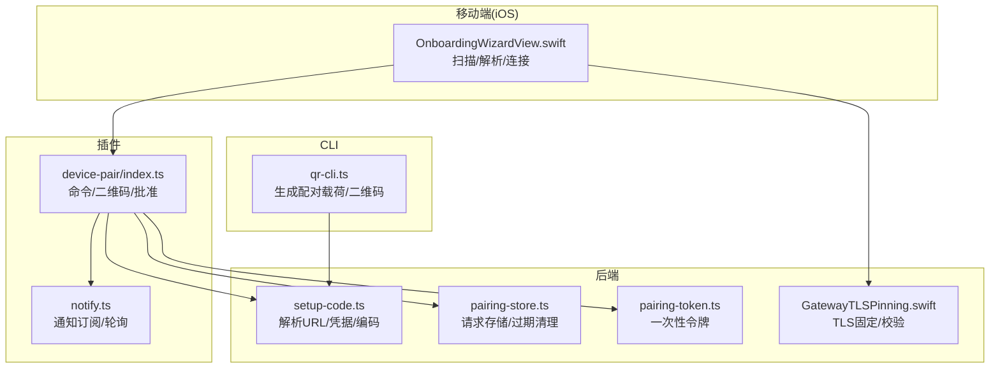
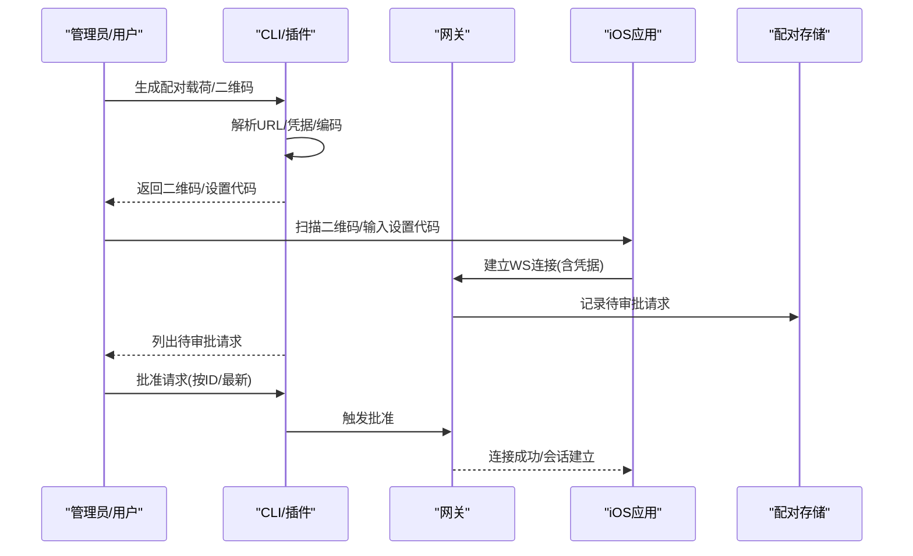
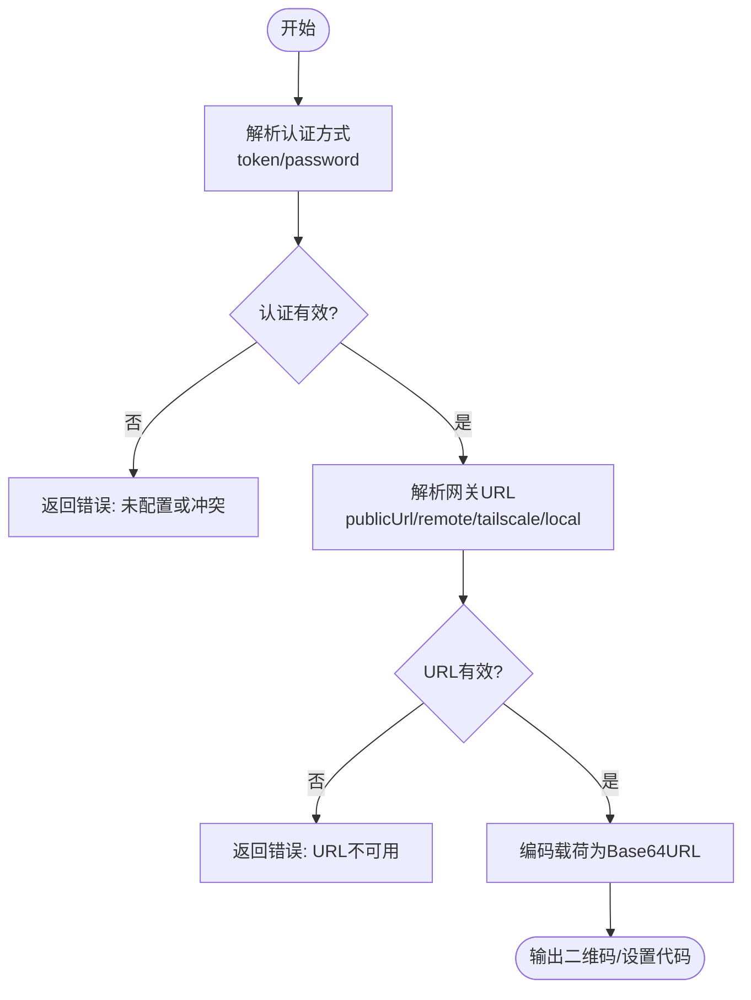
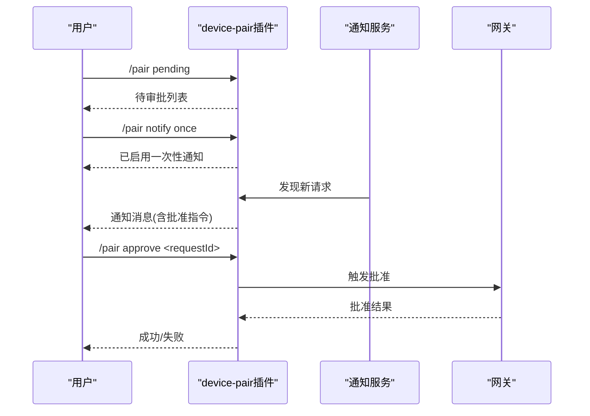
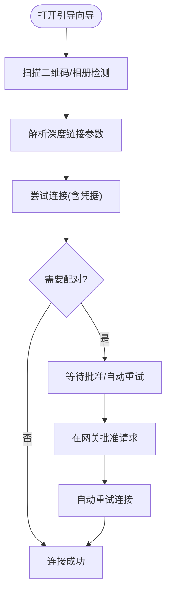
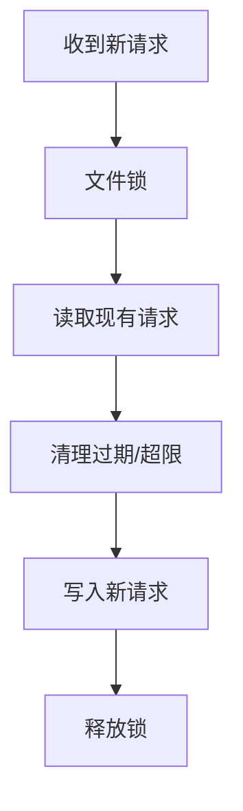
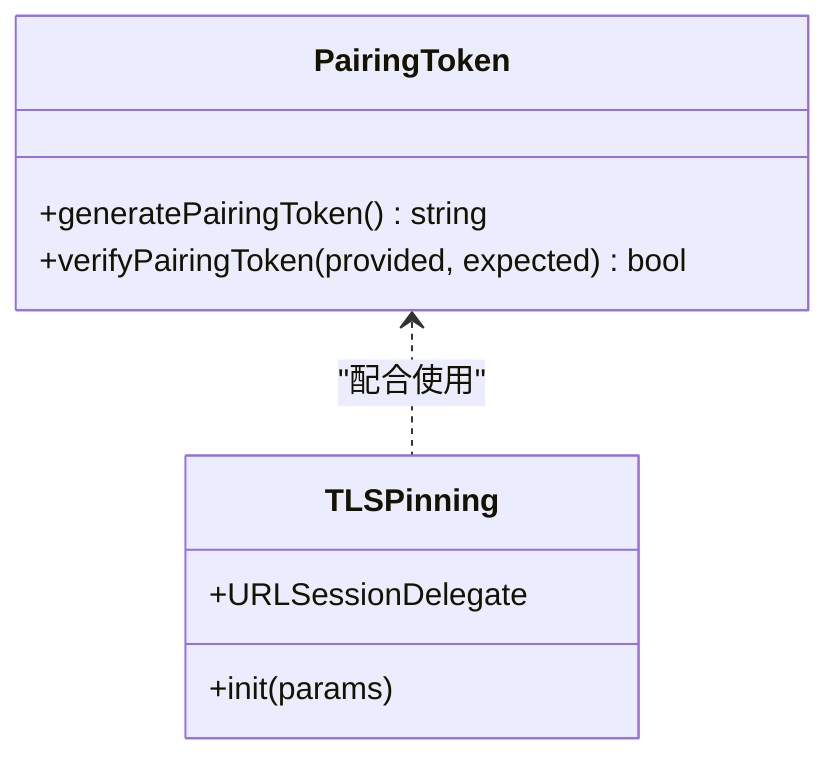
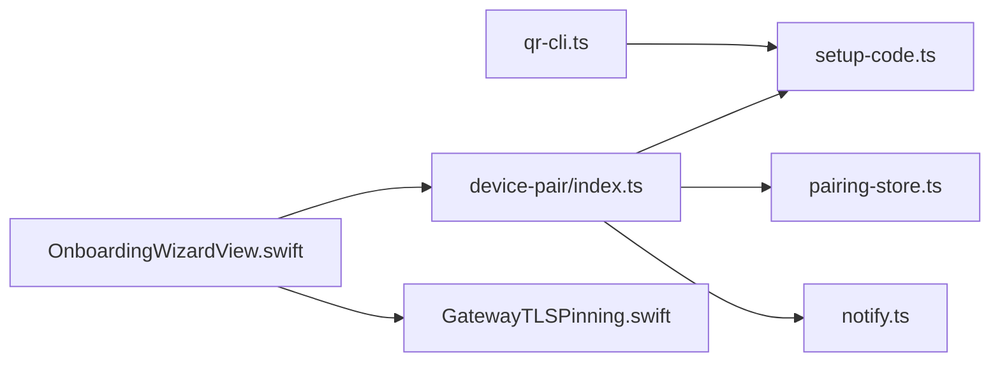

# 设备配对

<cite>
**本文引用的文件**
- [extensions/device-pair/index.ts](file://extensions/device-pair/index.ts)
- [extensions/device-pair/notify.ts](file://extensions/device-pair/notify.ts)
- [src/cli/qr-cli.ts](file://src/cli/qr-cli.ts)
- [apps/ios/Sources/Onboarding/OnboardingWizardView.swift](file://apps/ios/Sources/Onboarding/OnboardingWizardView.swift)
- [src/pairing/setup-code.ts](file://src/pairing/setup-code.ts)
- [src/pairing/pairing-store.ts](file://src/pairing/pairing-store.ts)
- [src/infra/pairing-token.ts](file://src/infra/pairing-token.ts)
- [apps/shared/OpenClawKit/Sources/OpenClawKit/GatewayTLSPinning.swift](file://apps/shared/OpenClawKit/Sources/OpenClawKit/GatewayTLSPinning.swift)
- [docs/cli/pairing.md](file://docs/cli/pairing.md)
</cite>

## 目录

1. [简介](#简介)
2. [项目结构](#项目结构)
3. [核心组件](#核心组件)
4. [架构总览](#架构总览)
5. [详细组件分析](#详细组件分析)
6. [依赖关系分析](#依赖关系分析)
7. [性能考量](#性能考量)
8. [故障排查指南](#故障排查指南)
9. [结论](#结论)
10. [附录](#附录)

## 简介

本文件面向“设备配对认证”的完整配置与使用，覆盖本地设备与网关的配对流程、QR 码认证与安全绑定机制，以及密钥交换、信任建立与会话管理。文档同时给出移动设备（iOS）、桌面应用与服务器之间的配对配置方法，并提供配对失败的诊断方法与安全注意事项。

## 项目结构

围绕配对能力的关键模块分布如下：

- CLI 侧：生成配对二维码与设置载荷，支持远程/本地 URL 选择与凭据注入。
- 插件侧：在聊天通道中生成配对请求、展示待审批列表、通知订阅与批准。
- 移动端：iOS 引导向导扫描 QR 码、解析连接参数、触发配对请求与自动重试。
- 存储与令牌：配对请求持久化、过期清理、一次性配对令牌校验。
- 安全与信任：TLS 固定与证书链校验、通道级信任策略。

**图表来源**

- [src/cli/qr-cli.ts:118-271](file://src/cli/qr-cli.ts#L118-L271)
- [extensions/device-pair/index.ts:326-550](file://extensions/device-pair/index.ts#L326-L550)
- [extensions/device-pair/notify.ts:427-461](file://extensions/device-pair/notify.ts#L427-L461)
- [apps/ios/Sources/Onboarding/OnboardingWizardView.swift:641-722](file://apps/ios/Sources/Onboarding/OnboardingWizardView.swift#L641-L722)
- [src/pairing/setup-code.ts:357-398](file://src/pairing/setup-code.ts#L357-L398)
- [src/pairing/pairing-store.ts:1-200](file://src/pairing/pairing-store.ts#L1-L200)
- [src/infra/pairing-token.ts:1-12](file://src/infra/pairing-token.ts#L1-L12)
- [apps/shared/OpenClawKit/Sources/OpenClawKit/GatewayTLSPinning.swift:58-69](file://apps/shared/OpenClawKit/Sources/OpenClawKit/GatewayTLSPinning.swift#L58-L69)

**章节来源**

- [src/cli/qr-cli.ts:118-271](file://src/cli/qr-cli.ts#L118-L271)
- [extensions/device-pair/index.ts:326-550](file://extensions/device-pair/index.ts#L326-L550)
- [extensions/device-pair/notify.ts:427-461](file://extensions/device-pair/notify.ts#L427-L461)
- [apps/ios/Sources/Onboarding/OnboardingWizardView.swift:641-722](file://apps/ios/Sources/Onboarding/OnboardingWizardView.swift#L641-L722)
- [src/pairing/setup-code.ts:357-398](file://src/pairing/setup-code.ts#L357-L398)
- [src/pairing/pairing-store.ts:1-200](file://src/pairing/pairing-store.ts#L1-L200)
- [src/infra/pairing-token.ts:1-12](file://src/infra/pairing-token.ts#L1-L12)
- [apps/shared/OpenClawKit/Sources/OpenClawKit/GatewayTLSPinning.swift:58-69](file://apps/shared/OpenClawKit/Sources/OpenClawKit/GatewayTLSPinning.swift#L58-L69)

## 核心组件

- 配对载荷与二维码生成
  - CLI 与插件均通过统一的“配对载荷”生成器解析网关 URL、认证方式与凭据，再进行 Base64URL 编码为二维码或文本形式。
- 通道内配对请求与批准
  - 插件提供 /pair 命令，支持生成二维码、列出待审批请求、单次/持久通知订阅、按 requestId 或最新请求批准。
- 移动端引导与自动重试
  - iOS 引导向导支持扫描 QR 码、从图片检测二维码、自动连接与配对状态粘性处理、后台自动恢复。
- 请求存储与过期控制
  - 按通道与账号维度持久化配对请求，限制最大挂起数量与 TTL，定期清理过期条目。
- 一次性配对令牌与安全校验
  - 使用安全比较函数校验一次性令牌，避免时序攻击；移动端实现 TLS 固定与证书链校验。
- 通知服务
  - 轮询检查新请求并按订阅模式（一次性/持久）发送通知，支持 Telegram 通道。

**章节来源**

- [src/pairing/setup-code.ts:357-398](file://src/pairing/setup-code.ts#L357-L398)
- [extensions/device-pair/index.ts:326-550](file://extensions/device-pair/index.ts#L326-L550)
- [extensions/device-pair/notify.ts:427-461](file://extensions/device-pair/notify.ts#L427-L461)
- [apps/ios/Sources/Onboarding/OnboardingWizardView.swift:641-722](file://apps/ios/Sources/Onboarding/OnboardingWizardView.swift#L641-L722)
- [src/pairing/pairing-store.ts:1-200](file://src/pairing/pairing-store.ts#L1-L200)
- [src/infra/pairing-token.ts:1-12](file://src/infra/pairing-token.ts#L1-L12)
- [apps/shared/OpenClawKit/Sources/OpenClawKit/GatewayTLSPinning.swift:58-69](file://apps/shared/OpenClawKit/Sources/OpenClawKit/GatewayTLSPinning.swift#L58-L69)

## 架构总览

下图展示了从生成配对载荷到移动端完成配对与批准的端到端流程。

**图表来源**

- [src/cli/qr-cli.ts:118-271](file://src/cli/qr-cli.ts#L118-L271)
- [extensions/device-pair/index.ts:326-550](file://extensions/device-pair/index.ts#L326-L550)
- [apps/ios/Sources/Onboarding/OnboardingWizardView.swift:641-722](file://apps/ios/Sources/Onboarding/OnboardingWizardView.swift#L641-L722)
- [src/pairing/pairing-store.ts:1-200](file://src/pairing/pairing-store.ts#L1-L200)

## 详细组件分析

### 组件A：配对载荷与二维码生成

- 功能要点
  - 解析网关 URL：优先使用显式 publicUrl，其次 remote.url，再次 Tailscale MagicDNS，最后回退到本地绑定地址。
  - 解析认证方式：支持 token/password 二选一或二者皆有但需明确模式；环境变量优先于配置项。
  - 编码载荷：将 URL、token/password 序列化为 JSON 并进行 Base64URL 替换，便于 QR 与文本传输。
- 适用场景
  - CLI 与插件命令均可生成二维码或纯文本设置代码，供移动端扫描或手动输入。

**图表来源**

- [src/pairing/setup-code.ts:357-398](file://src/pairing/setup-code.ts#L357-L398)
- [src/cli/qr-cli.ts:118-271](file://src/cli/qr-cli.ts#L118-L271)

**章节来源**

- [src/pairing/setup-code.ts:357-398](file://src/pairing/setup-code.ts#L357-L398)
- [src/cli/qr-cli.ts:118-271](file://src/cli/qr-cli.ts#L118-L271)

### 组件B：通道内配对请求与批准

- 功能要点
  - /pair 命令支持：
    - status/pending：列出待审批请求；
    - notify on/off/once/status：订阅/取消/一次性通知；
    - approve [requestId|latest]：批准指定或最新请求；
  - 二维码渲染：在 Telegram 等通道中可直接发送 ASCII QR，或回退到纯文本提示。
  - 通知服务：定时轮询新请求，按订阅模式发送消息提醒。
- 适用场景
  - 在 Telegram 等聊天通道中，管理员可远程批准来自移动端的配对请求。

**图表来源**

- [extensions/device-pair/index.ts:326-550](file://extensions/device-pair/index.ts#L326-L550)
- [extensions/device-pair/notify.ts:427-461](file://extensions/device-pair/notify.ts#L427-L461)

**章节来源**

- [extensions/device-pair/index.ts:326-550](file://extensions/device-pair/index.ts#L326-L550)
- [extensions/device-pair/notify.ts:427-461](file://extensions/device-pair/notify.ts#L427-L461)

### 组件C：移动端配对与自动重试

- 功能要点
  - 支持扫码与相册图片检测二维码；
  - 自动解析深度链接参数（主机、端口、TLS、token/password）；
  - 配对状态粘性处理：在需要配对/鉴权时保持状态不闪烁；
  - 后台自动恢复：应用回到前台或定时器触发时尝试重新连接。
- 适用场景
  - iOS 用户首次连接或断线重连时，通过引导向导完成配对与认证。

**图表来源**

- [apps/ios/Sources/Onboarding/OnboardingWizardView.swift:641-722](file://apps/ios/Sources/Onboarding/OnboardingWizardView.swift#L641-L722)

**章节来源**

- [apps/ios/Sources/Onboarding/OnboardingWizardView.swift:641-722](file://apps/ios/Sources/Onboarding/OnboardingWizardView.swift#L641-L722)

### 组件D：请求存储与过期控制

- 功能要点
  - 按通道与账号维度存储配对请求，文件名安全转义；
  - 最大挂起数限制与 TTL 控制，定期清理过期条目；
  - 文件锁保证并发写入一致性。
- 适用场景
  - 防止过多悬而未决的请求占用资源，保障系统稳定性。

**图表来源**

- [src/pairing/pairing-store.ts:1-200](file://src/pairing/pairing-store.ts#L1-L200)

**章节来源**

- [src/pairing/pairing-store.ts:1-200](file://src/pairing/pairing-store.ts#L1-L200)

### 组件E：一次性配对令牌与安全校验

- 功能要点
  - 生成安全随机令牌；
  - 使用常量时间比较函数校验令牌，降低时序攻击风险；
  - 与移动端 TLS 固定配合，确保握手阶段的证书可信。
- 适用场景
  - 在配对流程中作为一次性凭据，降低长期凭证泄露风险。

**图表来源**

- [src/infra/pairing-token.ts:1-12](file://src/infra/pairing-token.ts#L1-L12)
- [apps/shared/OpenClawKit/Sources/OpenClawKit/GatewayTLSPinning.swift:58-69](file://apps/shared/OpenClawKit/Sources/OpenClawKit/GatewayTLSPinning.swift#L58-L69)

**章节来源**

- [src/infra/pairing-token.ts:1-12](file://src/infra/pairing-token.ts#L1-L12)
- [apps/shared/OpenClawKit/Sources/OpenClawKit/GatewayTLSPinning.swift:58-69](file://apps/shared/OpenClawKit/Sources/OpenClawKit/GatewayTLSPinning.swift#L58-L69)

## 依赖关系分析

- 组件耦合
  - CLI 与插件共享“配对载荷”解析逻辑，确保两端一致；
  - 插件依赖通知服务与配对存储，形成闭环；
  - 移动端依赖插件提供的二维码与批准指令，同时负责连接与状态反馈。
- 外部依赖
  - 通道运行时（如 Telegram）用于发送通知与消息；
  - 文件系统用于持久化配对请求与允许来源列表；
  - 网络接口用于解析本地/私网/隧道地址。

**图表来源**

- [src/cli/qr-cli.ts:118-271](file://src/cli/qr-cli.ts#L118-L271)
- [extensions/device-pair/index.ts:326-550](file://extensions/device-pair/index.ts#L326-L550)
- [extensions/device-pair/notify.ts:427-461](file://extensions/device-pair/notify.ts#L427-L461)
- [apps/ios/Sources/Onboarding/OnboardingWizardView.swift:641-722](file://apps/ios/Sources/Onboarding/OnboardingWizardView.swift#L641-L722)
- [src/pairing/setup-code.ts:357-398](file://src/pairing/setup-code.ts#L357-L398)
- [src/pairing/pairing-store.ts:1-200](file://src/pairing/pairing-store.ts#L1-L200)
- [apps/shared/OpenClawKit/Sources/OpenClawKit/GatewayTLSPinning.swift:58-69](file://apps/shared/OpenClawKit/Sources/OpenClawKit/GatewayTLSPinning.swift#L58-L69)

**章节来源**

- [src/cli/qr-cli.ts:118-271](file://src/cli/qr-cli.ts#L118-L271)
- [extensions/device-pair/index.ts:326-550](file://extensions/device-pair/index.ts#L326-L550)
- [extensions/device-pair/notify.ts:427-461](file://extensions/device-pair/notify.ts#L427-L461)
- [apps/ios/Sources/Onboarding/OnboardingWizardView.swift:641-722](file://apps/ios/Sources/Onboarding/OnboardingWizardView.swift#L641-L722)
- [src/pairing/setup-code.ts:357-398](file://src/pairing/setup-code.ts#L357-L398)
- [src/pairing/pairing-store.ts:1-200](file://src/pairing/pairing-store.ts#L1-L200)
- [apps/shared/OpenClawKit/Sources/OpenClawKit/GatewayTLSPinning.swift:58-69](file://apps/shared/OpenClawKit/Sources/OpenClawKit/GatewayTLSPinning.swift#L58-L69)

## 性能考量

- 二维码渲染与消息发送
  - CLI 与插件在 Telegram 中优先拆分消息发送以提升兼容性，必要时回退到单条消息。
- 文件锁与并发
  - 配对存储采用带重试与超时的文件锁，避免高并发写入导致的阻塞。
- 通知轮询
  - 通知服务以固定间隔轮询，避免频繁查询造成负载过高；一次性订阅在首次通知后自动移除。
- 连接重试
  - iOS 引导向导在后台周期性尝试重连，避免用户频繁操作。

[本节为通用指导，无需特定文件来源]

## 故障排查指南

- 无法生成二维码/设置代码
  - 检查网关 URL 解析：是否配置了 publicUrl、remote.url 或 Tailscale 可用；若仅绑定本地回环，需调整绑定或启用隧道。
  - 检查认证配置：是否明确 token/password 模式且已配置对应凭据。
- 移动端无法连接
  - 确认扫描的二维码包含正确的主机、端口与 TLS 标记；
  - 若使用 token/password，确认已在移动端正确输入；
  - 查看连接状态与错误提示，必要时重启发现或切换模式。
- 通道内无通知
  - 在 Telegram 中启用 /pair notify once/on/status，确认订阅状态；
  - 检查通知服务是否正常运行与写入状态文件。
- 批准无效
  - 确认请求 ID 正确，或使用 /pair approve latest；
  - 检查网关日志与 CLI 输出，确认批准已生效。
- CLI 文档参考
  - 参考配对命令的 CLI 文档，了解 list/approve 的用法与账户参数。

**章节来源**

- [src/pairing/setup-code.ts:357-398](file://src/pairing/setup-code.ts#L357-L398)
- [extensions/device-pair/index.ts:326-550](file://extensions/device-pair/index.ts#L326-L550)
- [extensions/device-pair/notify.ts:427-461](file://extensions/device-pair/notify.ts#L427-L461)
- [apps/ios/Sources/Onboarding/OnboardingWizardView.swift:641-722](file://apps/ios/Sources/Onboarding/OnboardingWizardView.swift#L641-L722)
- [docs/cli/pairing.md:1-33](file://docs/cli/pairing.md#L1-L33)

## 结论

该配对体系通过“载荷编码 + 通道批准 + 存储控制 + 通知联动 + 移动端引导”的组合，实现了跨平台、可审计、可恢复的设备配对流程。配合一次性令牌与 TLS 固定等安全措施，可在多种网络环境下稳定、安全地建立信任与会话。

[本节为总结，无需特定文件来源]

## 附录

- 移动端、桌面与服务器的配对配置建议
  - 移动端（iOS）：使用引导向导扫描二维码，自动解析连接参数；在需要时手动输入 token/password。
  - 桌面应用：通过 CLI 生成二维码或设置代码，结合通道批准完成配对。
  - 服务器：优先使用远程 URL 或 Tailscale，确保公网可达；在通道中启用通知以便及时批准。
- 安全注意事项
  - 仅在受信网络或启用 TLS 的情况下使用 token/password；
  - 定期清理过期配对请求，限制最大挂起数；
  - 使用一次性令牌与常量时间比较，降低时序攻击风险；
  - 对 TLS 证书进行固定与校验，防止中间人攻击。

[本节为通用指导，无需特定文件来源]
