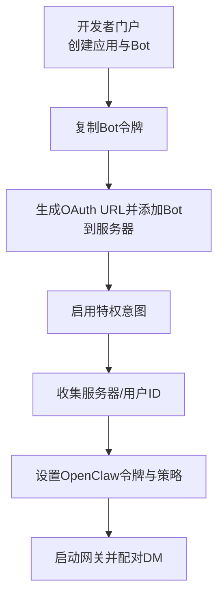
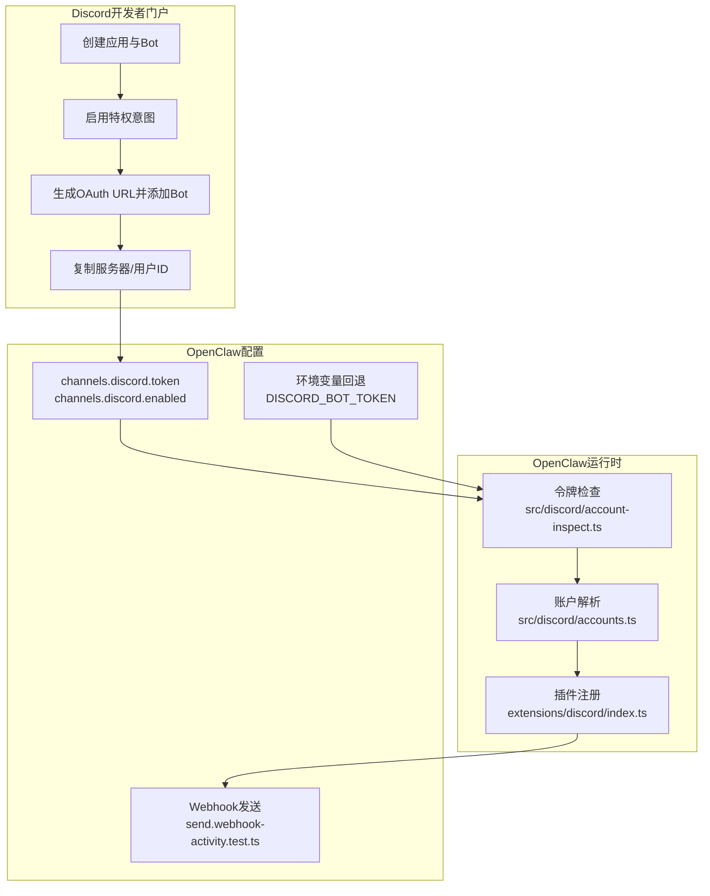
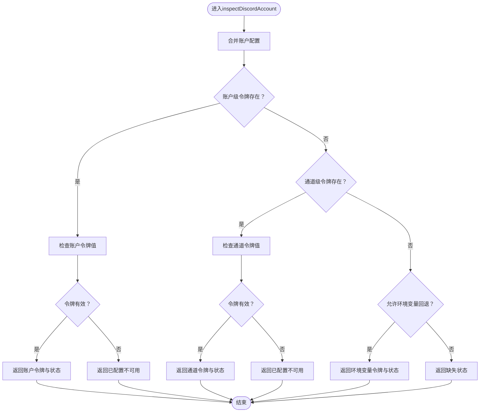
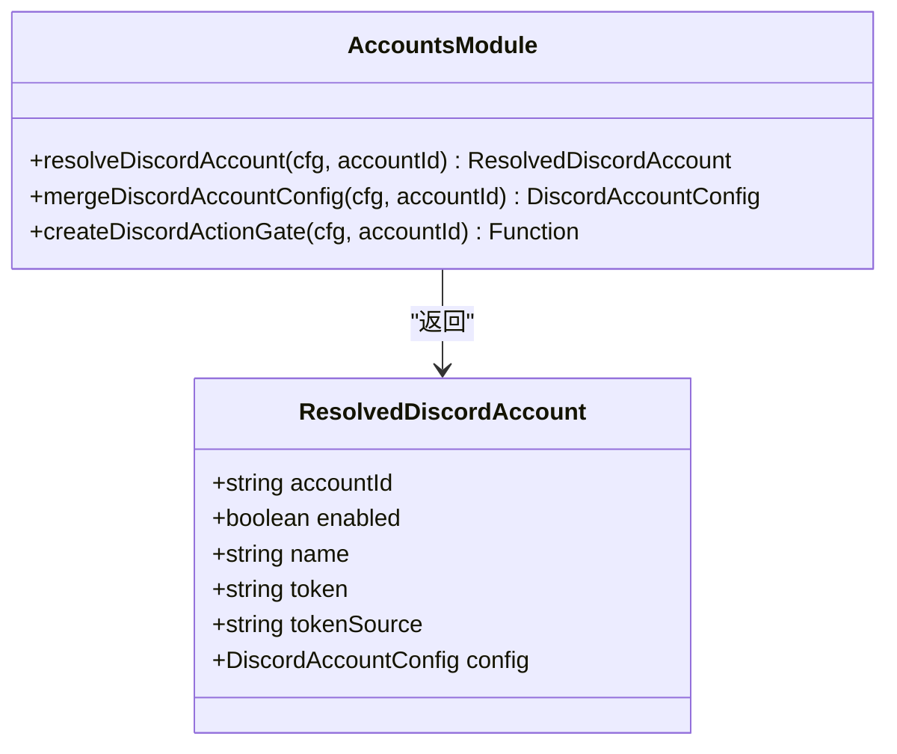
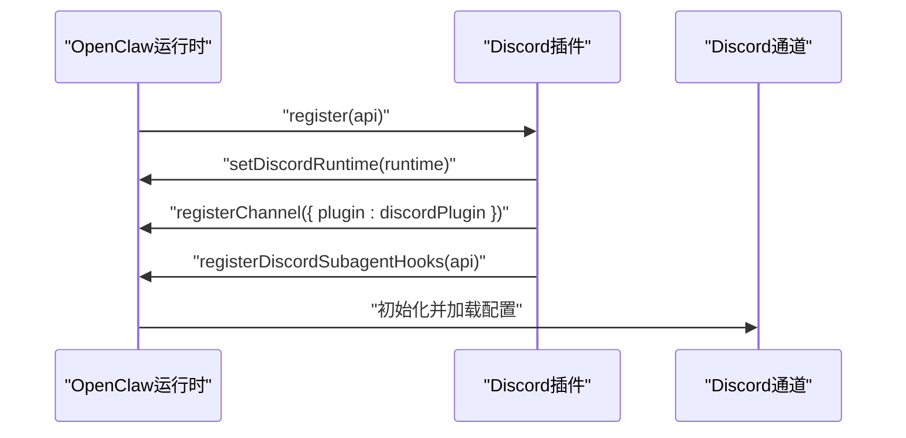
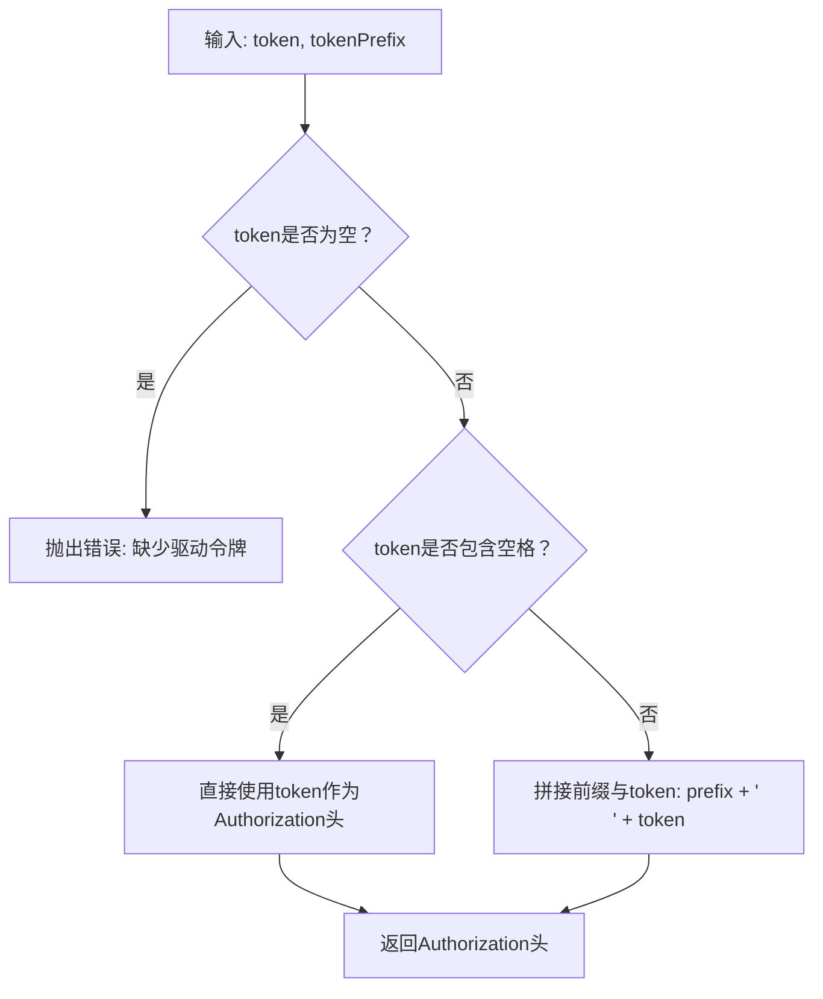
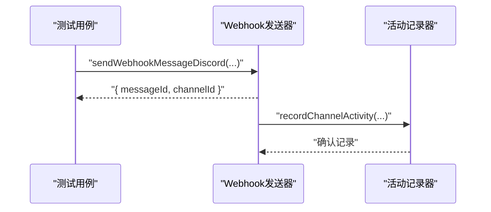
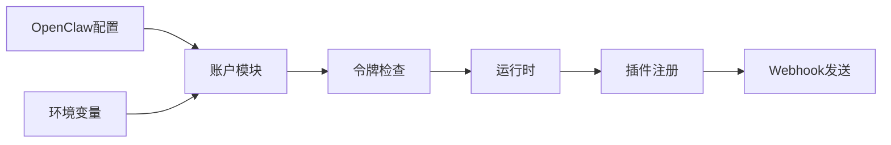

# Discord认证配置

<cite>
**本文引用的文件**
- [docs/channels/discord.md](file://docs/channels/discord.md)
- [src/discord/account-inspect.ts](file://src/discord/account-inspect.ts)
- [src/discord/accounts.ts](file://src/discord/accounts.ts)
- [extensions/discord/index.ts](file://extensions/discord/index.ts)
- [scripts/dev/discord-acp-plain-language-smoke.ts](file://scripts/dev/discord-acp-plain-language-smoke.ts)
- [src/discord/send.webhook-activity.test.ts](file://src/discord/send.webhook-activity.test.ts)
- [docs/channels/troubleshooting.md](file://docs/channels/troubleshooting.md)
- [docs/concepts/oauth.md](file://docs/concepts/oauth.md)
</cite>

## 目录

1. [简介](#简介)
2. [项目结构](#项目结构)
3. [核心组件](#核心组件)
4. [架构总览](#架构总览)
5. [详细组件分析](#详细组件分析)
6. [依赖关系分析](#依赖关系分析)
7. [性能考量](#性能考量)
8. [故障排除指南](#故障排除指南)
9. [结论](#结论)
10. [附录](#附录)

## 简介

本指南面向需要在OpenClaw中完成Discord通道认证与配置的用户与工程师，覆盖从Discord开发者门户创建应用与Bot、获取Bot令牌、生成邀请链接并添加到服务器、配置OpenClaw的令牌与策略，以及常见问题的诊断与修复。文档同时解释OpenClaw对Discord Bot令牌的解析优先级、环境变量回退机制、以及多账户支持。

## 项目结构

围绕Discord认证与通道功能，相关实现分布在以下位置：

- 文档与指引：docs/channels/discord.md 提供完整的“快速设置”和“开发者门户设置”步骤
- 认证与令牌解析：src/discord/account-inspect.ts、src/discord/accounts.ts 负责令牌来源解析与账户合并
- 扩展注册：extensions/discord/index.ts 将Discord通道插件注册到运行时
- 开发辅助与示例：scripts/dev/discord-acp-plain-language-smoke.ts 展示了授权头构造与API调用方式
- Webhook发送与活动记录：src/discord/send.webhook-activity.test.ts 展示了Webhook发送流程与活动记录
- 故障排除：docs/channels/troubleshooting.md 提供Discord通道的典型症状与修复建议
- OAuth概念：docs/concepts/oauth.md 解释OpenClaw的OAuth存储与多账户模式（适用于其他通道的OAuth场景）

**章节来源**

- [docs/channels/discord.md:24-167](file://docs/channels/discord.md#L24-L167)

## 核心组件

- 令牌解析与状态检查：inspectDiscordAccount负责按优先级解析令牌来源（配置文件 > 环境变量），并返回令牌状态与来源
- 账户配置合并：resolveDiscordAccount与mergeDiscordAccountConfig负责合并全局与账户级配置，确定启用状态与最终配置
- 插件注册：extensions/discord/index.ts 将Discord通道注册到OpenClaw运行时，使通道可用
- 授权头构造：scripts/dev/discord-acp-plain-language-smoke.ts 展示如何为Discord API请求构造Authorization头（自动补全前缀）
- Webhook发送：send.webhook-activity.test.ts 展示Webhook发送流程与活动记录

**章节来源**

- [src/discord/account-inspect.ts:47-129](file://src/discord/account-inspect.ts#L47-L129)
- [src/discord/accounts.ts:22-69](file://src/discord/accounts.ts#L22-L69)
- [extensions/discord/index.ts:7-19](file://extensions/discord/index.ts#L7-L19)
- [scripts/dev/discord-acp-plain-language-smoke.ts:325-376](file://scripts/dev/discord-acp-plain-language-smoke.ts#L325-L376)
- [src/discord/send.webhook-activity.test.ts:42-68](file://src/discord/send.webhook-activity.test.ts#L42-L68)

## 架构总览

下图展示了OpenClaw中Discord通道的认证与配置流，从令牌解析到插件注册与Webhook发送的关键节点：

**图表来源**

- [extensions/discord/index.ts:7-19](file://extensions/discord/index.ts#L7-L19)
- [src/discord/accounts.ts:22-69](file://src/discord/accounts.ts#L22-L69)
- [src/discord/account-inspect.ts:47-129](file://src/discord/account-inspect.ts#L47-L129)
- [src/discord/send.webhook-activity.test.ts:42-68](file://src/discord/send.webhook-activity.test.ts#L42-L68)

**章节来源**

- [docs/channels/discord.md:24-167](file://docs/channels/discord.md#L24-L167)

## 详细组件分析

### 组件A：令牌解析与状态检查（inspectDiscordAccount）

- 功能要点
  - 按优先级解析令牌来源：账户级配置 > 通道级配置 > 环境变量回退（仅默认账户）
  - 返回令牌状态（可用/已配置不可用/缺失）与来源（配置/环境/无）
  - 自动去除“Bot ”前缀，确保后续API调用的Authorization头正确
- 关键行为
  - 配置令牌存在且已配置但不可用时，标记为“configured_unavailable”
  - 环境变量回退仅对默认账户生效
  - 未配置任何令牌时，标记为“missing”，并返回未配置状态

**图表来源**

- [src/discord/account-inspect.ts:47-129](file://src/discord/account-inspect.ts#L47-L129)

**章节来源**

- [src/discord/account-inspect.ts:11-129](file://src/discord/account-inspect.ts#L11-L129)

### 组件B：账户配置合并与动作门控（resolveDiscordAccount / createDiscordActionGate）

- 功能要点
  - 合并全局与账户级Discord配置，决定最终启用状态
  - 基于账户动作配置创建动作门控，控制消息、线程、频道、权限等操作是否可用
- 使用场景
  - 在执行消息工具或频道管理操作前，先通过动作门控判断是否允许

**图表来源**

- [src/discord/accounts.ts:9-69](file://src/discord/accounts.ts#L9-L69)

**章节来源**

- [src/discord/accounts.ts:22-69](file://src/discord/accounts.ts#L22-L69)

### 组件C：插件注册（extensions/discord/index.ts）

- 功能要点
  - 注册Discord通道插件，注入运行时并注册子代理钩子
  - 作为OpenClaw与Discord通道交互的入口点

**图表来源**

- [extensions/discord/index.ts:7-19](file://extensions/discord/index.ts#L7-L19)

**章节来源**

- [extensions/discord/index.ts:7-19](file://extensions/discord/index.ts#L7-L19)

### 组件D：授权头构造与API调用（scripts/dev/discord-acp-plain-language-smoke.ts）

- 功能要点
  - 自动为令牌补全“Bot ”前缀，构造Authorization头
  - 提供对Discord REST API与Webhook API的封装调用示例

**图表来源**

- [scripts/dev/discord-acp-plain-language-smoke.ts:325-334](file://scripts/dev/discord-acp-plain-language-smoke.ts#L325-L334)

**章节来源**

- [scripts/dev/discord-acp-plain-language-smoke.ts:325-376](file://scripts/dev/discord-acp-plain-language-smoke.ts#L325-L376)

### 组件E：Webhook发送与活动记录（src/discord/send.webhook-activity.test.ts）

- 功能要点
  - 通过Webhook发送消息，并记录通道活动（出站）
  - 测试用例验证发送成功后返回消息ID与频道ID，并记录活动

**图表来源**

- [src/discord/send.webhook-activity.test.ts:42-68](file://src/discord/send.webhook-activity.test.ts#L42-L68)

**章节来源**

- [src/discord/send.webhook-activity.test.ts:42-68](file://src/discord/send.webhook-activity.test.ts#L42-L68)

## 依赖关系分析

- 令牌解析依赖配置系统与环境变量，遵循“账户级配置 > 通道级配置 > 环境变量”的优先级
- 账户模块依赖路由与账户查找工具，用于解析默认账户ID与合并配置
- 插件模块依赖运行时API，完成通道注册与钩子注入
- 开发脚本提供API调用与Webhook示例，便于调试与集成

**图表来源**

- [src/discord/accounts.ts:22-69](file://src/discord/accounts.ts#L22-L69)
- [src/discord/account-inspect.ts:47-129](file://src/discord/account-inspect.ts#L47-L129)
- [extensions/discord/index.ts:7-19](file://extensions/discord/index.ts#L7-L19)

**章节来源**

- [src/discord/accounts.ts:1-90](file://src/discord/accounts.ts#L1-L90)
- [src/discord/account-inspect.ts:1-130](file://src/discord/account-inspect.ts#L1-L130)
- [extensions/discord/index.ts:1-20](file://extensions/discord/index.ts#L1-L20)

## 性能考量

- 令牌解析与配置合并为轻量级内存操作，开销可忽略
- Webhook发送与REST调用受网络与Discord速率限制影响，建议在上层进行重试与节流
- 多账户场景下，动作门控与配置合并会增加少量CPU开销，通常不影响整体性能

## 故障排除指南

- 连接正常但无回复
  - 检查Discord通道探测与日志，确认消息内容意图已启用
  - 核对群组/频道是否在允许列表内，必要时关闭提及要求
- 群组消息被忽略
  - 查看日志中的提及拦截丢弃，开启提及或降低要求
- DM回复缺失
  - 列出并批准Discord配对码，或调整DM策略
- 权限不足（403/缺失权限）
  - 参考测试用例中的提示，补充“发送消息”等权限
- OAuth相关（概念性参考）
  - 若涉及OAuth令牌交换与存储，请参考OAuth概念文档了解存储位置与刷新机制

**章节来源**

- [docs/channels/troubleshooting.md:56-66](file://docs/channels/troubleshooting.md#L56-L66)
- [src/discord/send.sends-basic-channel-messages.test.ts:219-250](file://src/discord/send.sends-basic-channel-messages.test.ts#L219-L250)
- [docs/concepts/oauth.md:1-159](file://docs/concepts/oauth.md#L1-L159)

## 结论

通过遵循开发者门户的创建与权限配置流程，并在OpenClaw中正确设置令牌与策略，即可完成Discord通道的认证与运行。令牌解析与账户配置合并提供了清晰的优先级与回退机制；插件注册与Webhook发送为实际通信提供了基础能力。遇到问题时，可依据故障排除清单快速定位并修复。

## 附录

- 快速设置步骤与开发者门户配置请参阅：[Discord通道文档:24-167](file://docs/channels/discord.md#L24-L167)
- OAuth概念与多账户模式请参阅：[OAuth概念文档:1-159](file://docs/concepts/oauth.md#L1-L159)
