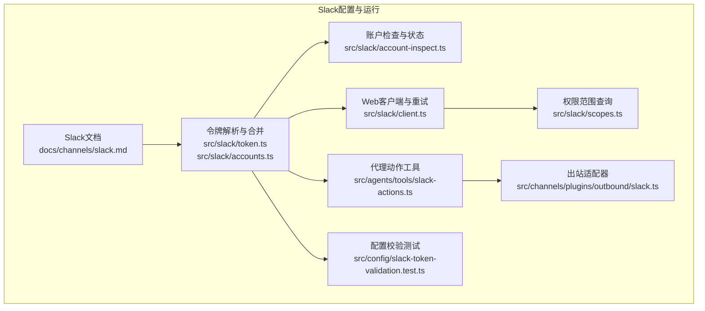
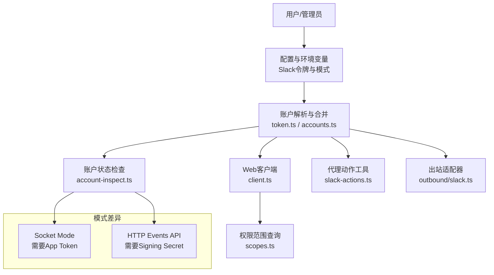
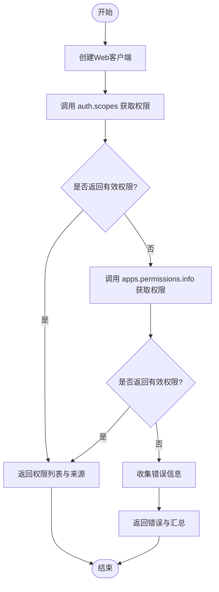
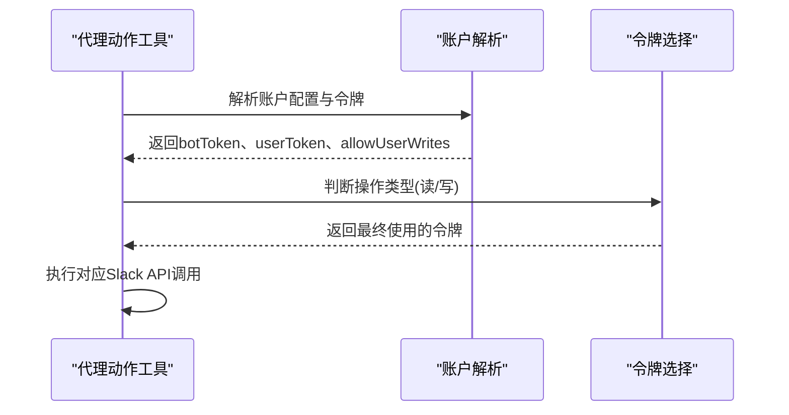
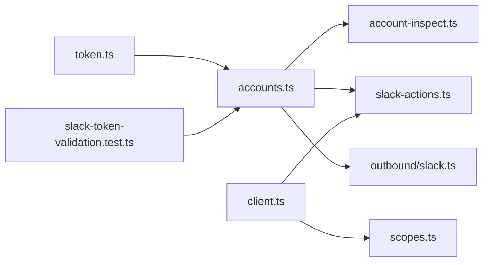

# Slack认证配置

<cite>
**本文档引用的文件**
- [docs/channels/slack.md](file://docs/channels/slack.md)
- [src/slack/scopes.ts](file://src/slack/scopes.ts)
- [src/slack/client.ts](file://src/slack/client.ts)
- [src/slack/accounts.ts](file://src/slack/accounts.ts)
- [src/slack/account-inspect.ts](file://src/slack/account-inspect.ts)
- [src/slack/token.ts](file://src/slack/token.ts)
- [src/agents/tools/slack-actions.ts](file://src/agents/tools/slack-actions.ts)
- [src/channels/plugins/outbound/slack.ts](file://src/channels/plugins/outbound/slack.ts)
- [src/config/slack-token-validation.test.ts](file://src/config/slack-token-validation.test.ts)
</cite>

## 目录

1. [简介](#简介)
2. [项目结构](#项目结构)
3. [核心组件](#核心组件)
4. [架构总览](#架构总览)
5. [详细组件分析](#详细组件分析)
6. [依赖关系分析](#依赖关系分析)
7. [性能考虑](#性能考虑)
8. [故障排除指南](#故障排除指南)
9. [结论](#结论)
10. [附录](#附录)

## 简介

本指南面向在OpenClaw中配置和使用Slack通道进行认证与运行的工程师与运维人员。内容覆盖Slack应用创建、OAuth权限配置、Bot用户设置、Socket Mode与HTTP Events API两种模式的配置要点、事件订阅配置、OAuth认证流程（授权URL构建、回调处理、令牌存储）、Slack特有认证参数（工作区权限、频道访问、用户权限）以及常见问题的故障排除方法。文档同时结合仓库中的实现细节，帮助读者理解OpenClaw如何解析与验证Slack令牌、如何在不同模式下选择合适的令牌来源与作用域。

## 项目结构

围绕Slack认证与运行的相关代码主要分布在以下模块：

- 文档与配置参考：docs/channels/slack.md
- Slack令牌解析与校验：src/slack/token.ts、src/slack/accounts.ts、src/slack/account-inspect.ts
- Slack Web API客户端与重试策略：src/slack/client.ts
- 权限范围查询工具：src/slack/scopes.ts
- 代理工具与消息发送适配器：src/agents/tools/slack-actions.ts、src/channels/plugins/outbound/slack.ts
- 配置字段校验测试：src/config/slack-token-validation.test.ts

图表来源

- [docs/channels/slack.md:1-555](file://docs/channels/slack.md#L1-L555)
- [src/slack/token.ts:1-30](file://src/slack/token.ts#L1-L30)
- [src/slack/accounts.ts:1-123](file://src/slack/accounts.ts#L1-L123)
- [src/slack/account-inspect.ts:1-184](file://src/slack/account-inspect.ts#L1-L184)
- [src/slack/client.ts:1-21](file://src/slack/client.ts#L1-L21)
- [src/slack/scopes.ts:1-117](file://src/slack/scopes.ts#L1-L117)
- [src/agents/tools/slack-actions.ts:1-402](file://src/agents/tools/slack-actions.ts#L1-L402)
- [src/channels/plugins/outbound/slack.ts:1-139](file://src/channels/plugins/outbound/slack.ts#L1-L139)
- [src/config/slack-token-validation.test.ts:1-72](file://src/config/slack-token-validation.test.ts#L1-L72)

章节来源

- [docs/channels/slack.md:1-555](file://docs/channels/slack.md#L1-L555)
- [src/slack/token.ts:1-30](file://src/slack/token.ts#L1-L30)
- [src/slack/accounts.ts:1-123](file://src/slack/accounts.ts#L1-L123)
- [src/slack/account-inspect.ts:1-184](file://src/slack/account-inspect.ts#L1-L184)
- [src/slack/client.ts:1-21](file://src/slack/client.ts#L1-L21)
- [src/slack/scopes.ts:1-117](file://src/slack/scopes.ts#L1-L117)
- [src/agents/tools/slack-actions.ts:1-402](file://src/agents/tools/slack-actions.ts#L1-L402)
- [src/channels/plugins/outbound/slack.ts:1-139](file://src/channels/plugins/outbound/slack.ts#L1-L139)
- [src/config/slack-token-validation.test.ts:1-72](file://src/config/slack-token-validation.test.ts#L1-L72)

## 核心组件

- Slack令牌解析与合并：负责从配置与环境变量中解析并合并账户级与默认级的Slack令牌，支持Bot Token、App Token、User Token与Signing Secret，并标注令牌来源（配置或环境变量）。
- 账户检查与状态：用于检查各令牌可用性、状态（可用/已配置但不可用/缺失），并输出可诊断的配置状态。
- Web客户端与重试：封装Slack Web API客户端，默认启用有限次重试，提升网络波动下的稳定性。
- 权限范围查询：通过多个后端接口尝试获取当前令牌拥有的权限范围，便于诊断权限不足问题。
- 代理动作工具：根据上下文自动选择读写令牌（优先Bot Token，必要时使用User Token），并执行消息发送、编辑、删除、反应、收藏等操作。
- 出站适配器：统一处理文本与媒体消息的发送，支持线程回复、身份定制（用户名/头像/表情）与钩子拦截。
- 配置校验测试：确保配置字段类型正确，特别是User Token与User Token只读标志。

章节来源

- [src/slack/token.ts:1-30](file://src/slack/token.ts#L1-L30)
- [src/slack/accounts.ts:1-123](file://src/slack/accounts.ts#L1-L123)
- [src/slack/account-inspect.ts:1-184](file://src/slack/account-inspect.ts#L1-L184)
- [src/slack/client.ts:1-21](file://src/slack/client.ts#L1-L21)
- [src/slack/scopes.ts:1-117](file://src/slack/scopes.ts#L1-L117)
- [src/agents/tools/slack-actions.ts:1-402](file://src/agents/tools/slack-actions.ts#L1-L402)
- [src/channels/plugins/outbound/slack.ts:1-139](file://src/channels/plugins/outbound/slack.ts#L1-L139)
- [src/config/slack-token-validation.test.ts:1-72](file://src/config/slack-token-validation.test.ts#L1-L72)

## 架构总览

OpenClaw在Slack通道上的认证与运行由“配置解析—令牌选择—API调用—事件处理”构成的闭环驱动。Socket Mode与HTTP Events API两种模式共享同一套令牌解析与权限范围查询能力；不同之处在于事件接收方式与必要的安全凭据（Socket Mode需要App Token，HTTP模式需要Signing Secret）。

图表来源

- [src/slack/token.ts:1-30](file://src/slack/token.ts#L1-L30)
- [src/slack/accounts.ts:1-123](file://src/slack/accounts.ts#L1-L123)
- [src/slack/account-inspect.ts:1-184](file://src/slack/account-inspect.ts#L1-L184)
- [src/slack/client.ts:1-21](file://src/slack/client.ts#L1-L21)
- [src/slack/scopes.ts:1-117](file://src/slack/scopes.ts#L1-L117)
- [src/agents/tools/slack-actions.ts:1-402](file://src/agents/tools/slack-actions.ts#L1-L402)
- [src/channels/plugins/outbound/slack.ts:1-139](file://src/channels/plugins/outbound/slack.ts#L1-L139)

## 详细组件分析

### Slack应用创建与OAuth权限配置

- 应用创建与Bot用户
  - 在Slack开发者平台创建应用，启用Socket Mode（若使用Socket Mode）。
  - 创建App Token（xapp-...）并授予connections:write权限，以便连接到Socket Mode。
  - 安装应用至工作区，复制Bot Token（xoxb-...）。
- OAuth权限范围
  - 文档提供了完整的manifest示例，包含bot作用域集合与事件订阅配置，可作为OAuth权限范围的参考来源。
  - 使用权限范围查询工具可验证当前令牌实际拥有的权限集合，辅助排查权限不足问题。
- Bot用户设置
  - 在应用清单中配置bot_user显示名称与在线状态。
  - 启用App Home的消息标签页以支持DM交互。

章节来源

- [docs/channels/slack.md:24-130](file://docs/channels/slack.md#L24-L130)
- [docs/channels/slack.md:340-431](file://docs/channels/slack.md#L340-L431)
- [src/slack/scopes.ts:92-116](file://src/slack/scopes.ts#L92-L116)

### Socket Mode与HTTP Events API模式配置

- Socket Mode（默认）
  - 需要Bot Token与App Token。
  - 在Slack应用设置中启用Socket Mode，并为App Token授予connections:write。
  - 配置OpenClaw的channels.slack.mode为socket，并提供botToken与appToken。
- HTTP Events API
  - 需要Bot Token与Signing Secret。
  - 设置channels.slack.mode为http，并提供signingSecret与webhookPath。
  - 在Slack应用中设置事件订阅、交互与斜杠命令的请求URL指向同一webhook路径。

章节来源

- [docs/channels/slack.md:26-121](file://docs/channels/slack.md#L26-L121)

### 事件订阅配置

- 事件订阅清单建议包含：app_mention、message.channels、message.groups、message.im、message.mpim、reaction_added、reaction_removed、member_joined_channel、member_left_channel、channel_rename、pin_added、pin_removed。
- App Home消息标签页需启用以支持DM交互。

章节来源

- [docs/channels/slack.md:61-72](file://docs/channels/slack.md#L61-L72)

### OAuth认证流程说明

- 授权URL构建
  - 基于Slack OAuth授权端点，结合工作区安装与所需权限范围生成授权URL。
- 回调处理
  - 处理来自Slack的回调，交换授权码为访问令牌（Bot Token、App Token、User Token）。
- 令牌存储
  - 将令牌保存在OpenClaw配置中（channels.slack.\*.token），或在默认账户场景下使用环境变量（SLACK_BOT_TOKEN、SLACK_APP_TOKEN、SLACK_USER_TOKEN）。
  - 用户令牌不支持环境变量回退，仅支持配置注入。

章节来源

- [docs/channels/slack.md:123-134](file://docs/channels/slack.md#L123-L134)
- [src/slack/token.ts:1-30](file://src/slack/token.ts#L1-L30)
- [src/slack/accounts.ts:56-77](file://src/slack/accounts.ts#L56-L77)

### Slack特有认证参数与权限设置

- 工作区权限
  - Socket Mode需要App Token（xapp-...）+ Bot Token（xoxb-...）。
  - HTTP模式需要Bot Token（xoxb-...）+ Signing Secret。
- 频道访问控制
  - 通过groupPolicy与channels.allowlist控制频道白名单与是否允许提及。
  - 支持按频道设置requireMention、users白名单、技能与系统提示等。
- 用户权限设置
  - userToken（xoxp-...）为可选配置，且默认只读（userTokenReadOnly: true）。
  - 当允许用户写入（userTokenReadOnly: false）且Bot Token不可用时，才使用User Token进行写操作。
  - 可选授予chat:write.customize以使用自定义身份发送消息。

章节来源

- [docs/channels/slack.md:136-205](file://docs/channels/slack.md#L136-L205)
- [src/agents/tools/slack-actions.ts:125-149](file://src/agents/tools/slack-actions.ts#L125-L149)

### 权限范围查询与验证

- 权限范围查询
  - 通过auth.scopes或apps.permissions.info尝试获取权限范围，返回去重后的排序列表。
- 配置字段校验
  - 测试覆盖了userToken与userTokenReadOnly的类型校验，确保配置合法。

图表来源

- [src/slack/scopes.ts:77-116](file://src/slack/scopes.ts#L77-L116)

章节来源

- [src/slack/scopes.ts:1-117](file://src/slack/scopes.ts#L1-L117)
- [src/config/slack-token-validation.test.ts:1-72](file://src/config/slack-token-validation.test.ts#L1-L72)

### 令牌来源与选择策略

- 令牌来源优先级
  - 配置优先于环境变量（仅默认账户支持环境变量回退）。
  - Socket Mode需要Bot Token与App Token；HTTP模式需要Bot Token与Signing Secret。
- 读写令牌选择
  - 读操作优先使用User Token（若配置），否则回退到Bot Token。
  - 写操作优先使用Bot Token；当允许用户写入且Bot Token不可用时，才使用User Token。

图表来源

- [src/agents/tools/slack-actions.ts:125-149](file://src/agents/tools/slack-actions.ts#L125-L149)
- [src/slack/accounts.ts:56-77](file://src/slack/accounts.ts#L56-L77)

章节来源

- [src/agents/tools/slack-actions.ts:1-402](file://src/agents/tools/slack-actions.ts#L1-L402)
- [src/slack/accounts.ts:1-123](file://src/slack/accounts.ts#L1-L123)

### 出站消息发送与身份定制

- 身份定制
  - 支持设置用户名、头像URL或表情符号（以:emoji:格式），用于消息发送时的身份呈现。
- 线程与钩子
  - 自动继承replyToId或threadId作为threadTs，保持通知在原线程内。
  - 支持全局消息发送钩子，可在发送前取消或修改内容。

章节来源

- [src/channels/plugins/outbound/slack.ts:7-19](file://src/channels/plugins/outbound/slack.ts#L7-L19)
- [src/channels/plugins/outbound/slack.ts:50-93](file://src/channels/plugins/outbound/slack.ts#L50-L93)

## 依赖关系分析

- 组件耦合
  - accounts.ts与token.ts紧密协作，负责令牌规范化与合并。
  - account-inspect.ts基于accounts.ts的结果输出可诊断的状态。
  - slack-actions.ts依赖accounts.ts提供的令牌与配置，决定读写令牌的选择。
  - outbound/slack.ts依赖sendMessageSlack实现消息发送，统一处理文本与媒体。
  - scopes.ts依赖client.ts创建Web客户端，用于权限范围查询。
- 外部依赖
  - @slack/web-api WebClient用于与Slack API通信。
  - 配置校验测试确保字段类型正确，避免运行期错误。

图表来源

- [src/slack/token.ts:1-30](file://src/slack/token.ts#L1-L30)
- [src/slack/accounts.ts:1-123](file://src/slack/accounts.ts#L1-L123)
- [src/slack/account-inspect.ts:1-184](file://src/slack/account-inspect.ts#L1-L184)
- [src/agents/tools/slack-actions.ts:1-402](file://src/agents/tools/slack-actions.ts#L1-L402)
- [src/channels/plugins/outbound/slack.ts:1-139](file://src/channels/plugins/outbound/slack.ts#L1-L139)
- [src/slack/client.ts:1-21](file://src/slack/client.ts#L1-L21)
- [src/slack/scopes.ts:1-117](file://src/slack/scopes.ts#L1-L117)
- [src/config/slack-token-validation.test.ts:1-72](file://src/config/slack-token-validation.test.ts#L1-L72)

章节来源

- [src/slack/token.ts:1-30](file://src/slack/token.ts#L1-L30)
- [src/slack/accounts.ts:1-123](file://src/slack/accounts.ts#L1-L123)
- [src/slack/account-inspect.ts:1-184](file://src/slack/account-inspect.ts#L1-L184)
- [src/agents/tools/slack-actions.ts:1-402](file://src/agents/tools/slack-actions.ts#L1-L402)
- [src/channels/plugins/outbound/slack.ts:1-139](file://src/channels/plugins/outbound/slack.ts#L1-L139)
- [src/slack/client.ts:1-21](file://src/slack/client.ts#L1-L21)
- [src/slack/scopes.ts:1-117](file://src/slack/scopes.ts#L1-L117)
- [src/config/slack-token-validation.test.ts:1-72](file://src/config/slack-token-validation.test.ts#L1-L72)

## 性能考虑

- 默认重试策略
  - WebClient启用有限次指数退避重试，有助于在网络抖动时提升成功率。
- 权限范围查询
  - 查询权限范围会发起额外API调用，建议在诊断阶段使用，避免在高频路径重复调用。
- 消息发送
  - 出站适配器支持线程与身份定制，注意避免过度定制导致的API调用次数增加。

章节来源

- [src/slack/client.ts:3-16](file://src/slack/client.ts#L3-L16)
- [src/slack/scopes.ts:92-116](file://src/slack/scopes.ts#L92-L116)
- [src/channels/plugins/outbound/slack.ts:95-139](file://src/channels/plugins/outbound/slack.ts#L95-L139)

## 故障排除指南

- 无回复（频道）
  - 检查groupPolicy、频道白名单、requireMention与频道用户白名单。
  - 使用诊断命令查看通道状态与日志。
- DM被忽略
  - 检查dm.enabled、dmPolicy与配对/白名单。
  - 查看配对列表确认批准状态。
- Socket Mode无法连接
  - 校验Bot Token与App Token、Socket Mode开关。
- HTTP模式未收到事件
  - 校验Signing Secret、webhookPath、Slack请求URL（事件+交互+斜杠命令）、多账户时webhookPath唯一性。
- 原生/斜杠命令未触发
  - 确认是否启用原生命令模式并与Slack注册的斜杠命令匹配。
  - 检查命令访问组与用户/频道白名单。
- 权限不足
  - 使用权限范围查询工具核对当前令牌的实际权限集合，补充缺失的作用域。

章节来源

- [docs/channels/slack.md:433-490](file://docs/channels/slack.md#L433-L490)
- [src/slack/scopes.ts:92-116](file://src/slack/scopes.ts#L92-L116)

## 结论

通过本文档与相关源码分析，可以在OpenClaw中完成从Slack应用创建、权限范围配置到Socket Mode与HTTP Events API两种运行模式的完整落地。OpenClaw提供了完善的令牌解析、状态检查、权限范围查询与消息发送适配能力，配合文档中的配置清单与故障排除步骤，能够快速定位并解决常见的认证与运行问题。

## 附录

- 快速参考
  - Socket Mode：channels.slack.mode=socket，提供botToken与appToken。
  - HTTP Events API：channels.slack.mode=http，提供botToken与signingSecret，设置webhookPath。
  - 用户令牌：channels.slack.userToken（不支持环境变量回退），默认只读；允许写入时需显式配置userTokenReadOnly=false。
  - 权限范围：参考文档中的manifest示例与权限范围查询工具。

章节来源

- [docs/channels/slack.md:24-134](file://docs/channels/slack.md#L24-L134)
- [src/slack/scopes.ts:92-116](file://src/slack/scopes.ts#L92-L116)
