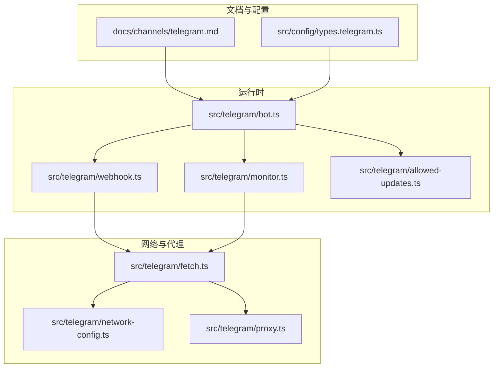
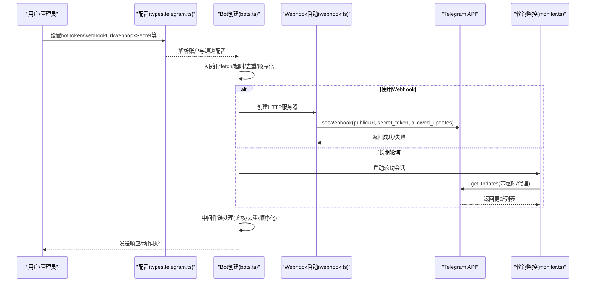
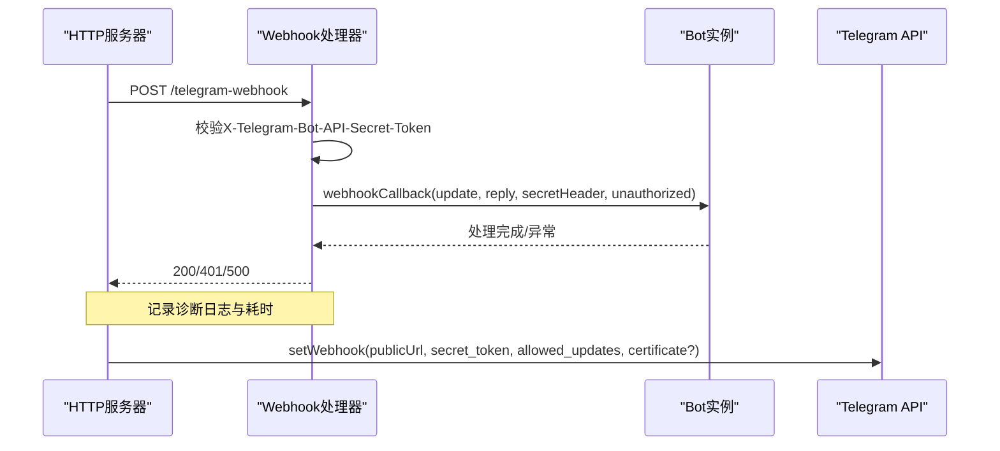
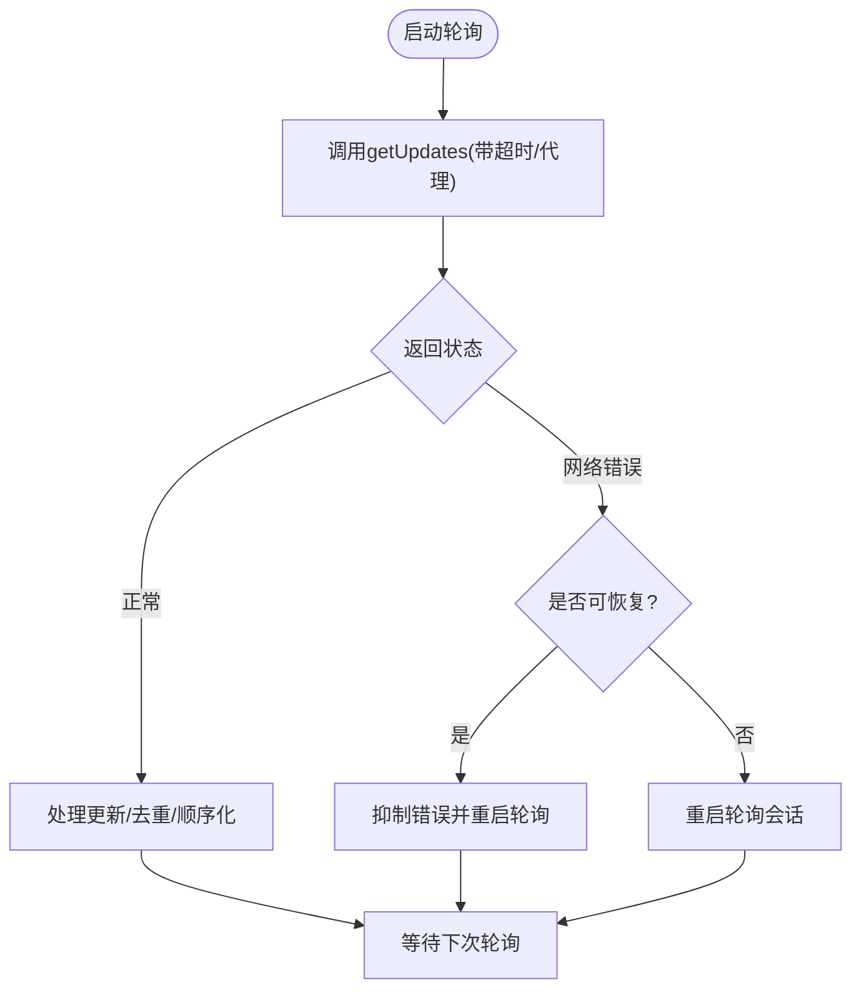
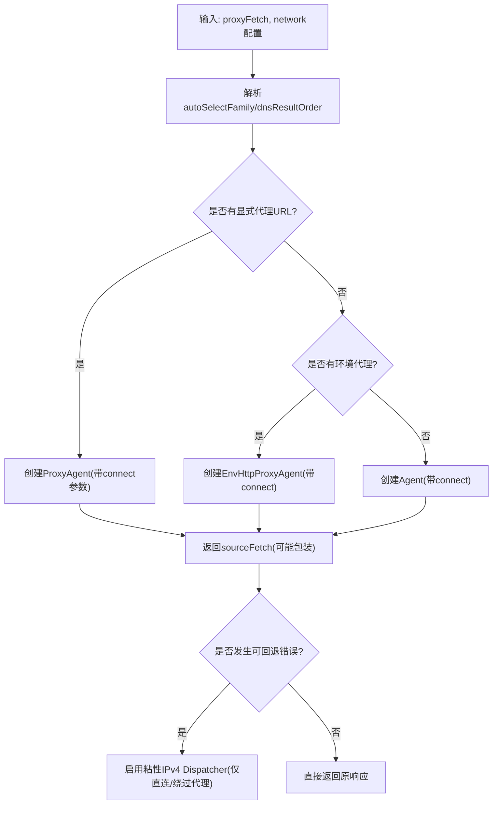
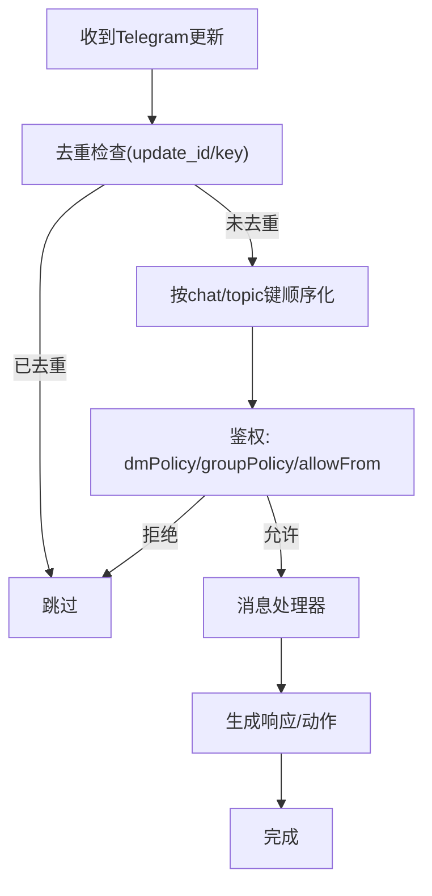
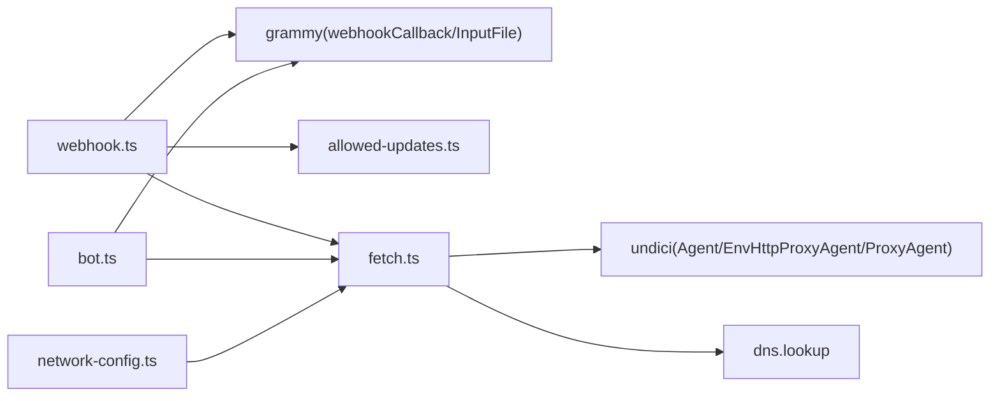

# Telegram认证配置

<cite>
**本文档引用的文件**
- [docs/channels/telegram.md](file://docs/channels/telegram.md)
- [src/telegram/webhook.ts](file://src/telegram/webhook.ts)
- [src/telegram/probe.ts](file://src/telegram/probe.ts)
- [src/telegram/fetch.ts](file://src/telegram/fetch.ts)
- [src/telegram/network-config.ts](file://src/telegram/network-config.ts)
- [src/telegram/bot.ts](file://src/telegram/bot.ts)
- [src/telegram/allowed-updates.ts](file://src/telegram/allowed-updates.ts)
- [src/config/types.telegram.ts](file://src/config/types.telegram.ts)
- [src/telegram/proxy.ts](file://src/telegram/proxy.ts)
- [src/telegram/webhook.test.ts](file://src/telegram/webhook.test.ts)
- [src/telegram/probe.test.ts](file://src/telegram/probe.test.ts)
- [src/telegram/monitor.ts](file://src/telegram/monitor.ts)
- [src/telegram/send.ts](file://src/telegram/send.ts)
</cite>

## 目录

1. [简介](#简介)
2. [项目结构](#项目结构)
3. [核心组件](#核心组件)
4. [架构总览](#架构总览)
5. [详细组件分析](#详细组件分析)
6. [依赖关系分析](#依赖关系分析)
7. [性能考虑](#性能考虑)
8. [故障排除指南](#故障排除指南)
9. [结论](#结论)
10. [附录](#附录)

## 简介

本指南面向在OpenClaw中配置Telegram通道认证与消息接收的工程师与运维人员。内容覆盖Bot API令牌获取、@BotFather使用、Webhook与长期轮询两种接收模式的配置与对比、Telegram特有的认证参数（代理、DNS、网络连接优化）、以及常见问题的诊断与修复方法。文档同时提供可操作的步骤、可视化图示与最佳实践，帮助快速完成生产级部署。

## 项目结构

OpenClaw的Telegram通道实现由“文档指引 + 核心运行时 + 网络与代理层 + 配置类型”四部分组成：

- 文档指引：提供用户可读的配置步骤与最佳实践
- 运行时实现：负责Bot实例创建、Webhook监听、轮询监控、消息处理与去重
- 网络与代理：封装fetch、支持环境代理、显式代理、IPv4优先与自动族选择
- 配置类型：定义Telegram通道的所有可配置项与默认值

**图表来源**

- [docs/channels/telegram.md:1-120](file://docs/channels/telegram.md#L1-L120)
- [src/config/types.telegram.ts:1-120](file://src/config/types.telegram.ts#L1-L120)
- [src/telegram/bot.ts:1-120](file://src/telegram/bot.ts#L1-L120)
- [src/telegram/webhook.ts:1-120](file://src/telegram/webhook.ts#L1-L120)
- [src/telegram/fetch.ts:1-120](file://src/telegram/fetch.ts#L1-L120)
- [src/telegram/network-config.ts:1-107](file://src/telegram/network-config.ts#L1-L107)
- [src/telegram/proxy.ts:1-2](file://src/telegram/proxy.ts#L1-L2)

**章节来源**

- [docs/channels/telegram.md:1-120](file://docs/channels/telegram.md#L1-L120)
- [src/config/types.telegram.ts:1-120](file://src/config/types.telegram.ts#L1-L120)

## 核心组件

- Bot创建与初始化：负责构建grammY Bot实例、注入自定义fetch、超时、去重、顺序化与中间件链
- Webhook启动器：本地HTTP服务器监听、校验secret、调用Telegram setWebhook并记录公开URL
- 轮询监控器：长期轮询模式下的错误恢复、重启与健康检查
- 网络与代理：基于undici的Dispatcher策略，支持环境代理、显式代理、IPv4优先与自动族选择
- 探测器：对Telegram API进行getMe/getWebhookInfo探测，带重试与超时控制
- 配置类型：定义所有Telegram通道参数，包括网络、Webhook、动作开关、流式回复等

**章节来源**

- [src/telegram/bot.ts:71-170](file://src/telegram/bot.ts#L71-L170)
- [src/telegram/webhook.ts:77-120](file://src/telegram/webhook.ts#L77-L120)
- [src/telegram/monitor.ts:100-140](file://src/telegram/monitor.ts#L100-L140)
- [src/telegram/fetch.ts:337-430](file://src/telegram/fetch.ts#L337-L430)
- [src/telegram/probe.ts:93-222](file://src/telegram/probe.ts#L93-L222)
- [src/config/types.telegram.ts:258-264](file://src/config/types.telegram.ts#L258-L264)

## 架构总览

下图展示从配置到消息接收的关键路径：配置解析 → Bot初始化 → Webhook注册或轮询启动 → 消息处理与去重 → 响应发送。

**图表来源**

- [src/config/types.telegram.ts:70-197](file://src/config/types.telegram.ts#L70-L197)
- [src/telegram/bot.ts:101-164](file://src/telegram/bot.ts#L101-L164)
- [src/telegram/webhook.ts:237-255](file://src/telegram/webhook.ts#L237-L255)
- [src/telegram/monitor.ts:100-140](file://src/telegram/monitor.ts#L100-L140)

## 详细组件分析

### 组件A：Webhook配置与启动

- 功能要点
  - 必须提供非空secret；否则抛出错误
  - 默认监听127.0.0.1:8787，可通过host/port/path/publicUrl调整
  - 自动调用Telegram setWebhook，上传证书（可选）与allowed_updates
  - 提供/healthz健康检查端点
  - 支持AbortSignal优雅关闭，删除Webhook并停止Bot
- 关键行为
  - 本地监听与对外URL解析：当未显式publicUrl时，根据server地址与path拼接
  - 请求体限制与超时：最大1MB，请求体读取超时30秒，回调超时10秒
  - 安全校验：通过X-Telegram-Bot-API-Secret-Token头匹配secret
- 典型配置
  - channels.telegram.webhookUrl + webhookSecret为必选项
  - webhookPath默认"/telegram-webhook"，webhookHost默认"127.0.0.1"，webhookPort默认8787
  - 可选webhookCertPath用于自签名证书上传

**图表来源**

- [src/telegram/webhook.ts:127-284](file://src/telegram/webhook.ts#L127-L284)

**章节来源**

- [src/telegram/webhook.ts:77-120](file://src/telegram/webhook.ts#L77-L120)
- [src/telegram/webhook.ts:229-255](file://src/telegram/webhook.ts#L229-L255)
- [src/telegram/webhook.ts:127-219](file://src/telegram/webhook.ts#L127-L219)
- [src/telegram/webhook.test.ts:342-375](file://src/telegram/webhook.test.ts#L342-L375)

### 组件B：长期轮询与监控

- 功能要点
  - 通过grammY长轮询拉取更新，支持超时与代理
  - 对可恢复网络错误进行抑制与重启，避免长时间阻塞
  - 在Bot初始化阶段注入fetch以支持AbortSignal，确保优雅停机
- 错误处理
  - 对getUpdates期间的可恢复网络错误进行抑制与强制重启
  - 未处理的网络错误触发轮询会话重启
- 配置要点
  - channels.telegram.timeoutSeconds可覆盖默认超时
  - 支持代理与网络优化（见下一节）

**图表来源**

- [src/telegram/monitor.ts:79-114](file://src/telegram/monitor.ts#L79-L114)
- [src/telegram/bot.ts:114-149](file://src/telegram/bot.ts#L114-L149)

**章节来源**

- [src/telegram/monitor.ts:79-114](file://src/telegram/monitor.ts#L79-L114)
- [src/telegram/bot.ts:114-149](file://src/telegram/bot.ts#L114-L149)

### 组件C：网络与代理（fetch封装）

- 功能要点
  - 基于undici Dispatcher，支持直接连接、环境代理、显式代理
  - IPv4优先与自动族选择：针对IPv6不稳定场景（如WSL2）自动回退
  - DNS结果排序：支持"ipv4first"或"verbatim"
  - 可插拔fetch：支持外部代理fetch与OpenClaw内部代理封装
- 行为细节
  - 当检测到环境代理且命中NO_PROXY规则时，可绕过代理直连
  - 对特定网络错误启用“粘性IPv4回退”，仅在无代理路由时启用
  - 保留调用方提供的dispatcher，避免覆盖

**图表来源**

- [src/telegram/fetch.ts:337-430](file://src/telegram/fetch.ts#L337-L430)
- [src/telegram/network-config.ts:31-102](file://src/telegram/network-config.ts#L31-L102)
- [src/telegram/proxy.ts:1-2](file://src/telegram/proxy.ts#L1-L2)

**章节来源**

- [src/telegram/fetch.ts:337-430](file://src/telegram/fetch.ts#L337-L430)
- [src/telegram/network-config.ts:31-102](file://src/telegram/network-config.ts#L31-L102)
- [src/telegram/proxy.ts:1-2](file://src/telegram/proxy.ts#L1-L2)

### 组件D：配置类型与参数说明

- 关键配置项
  - botToken/tokenFile：Bot令牌或令牌文件
  - webhookUrl/webhookSecret/webhookPath/webhookHost/webhookPort/webhookCertPath：Webhook相关
  - network.autoSelectFamily/dnsResultOrder：网络优化
  - timeoutSeconds：API客户端超时
  - actions.\*：发送、投票、删除、编辑、贴纸、话题创建等动作开关
  - streaming/blockStreaming/linkPreview/reactionNotifications/reactionLevel：消息体验与通知
  - dmPolicy/groupPolicy/allowFrom/groupAllowFrom：访问控制
- 默认值与继承
  - accounts.<id>覆盖全局配置
  - 未设置时采用默认行为（例如streaming默认partial）

**章节来源**

- [src/config/types.telegram.ts:28-197](file://src/config/types.telegram.ts#L28-L197)

### 组件E：消息接收与处理（去重、顺序化、鉴权）

- 去重：基于update_id与上下文键的去重集合，避免重复处理
- 顺序化：按聊天/主题键串行处理，保证并发安全
- 鉴权：结合dmPolicy、allowFrom、groupPolicy与groupAllowFrom进行准入控制
- 历史与限流：历史长度、文本分片、块流合并、throttler

**图表来源**

- [src/telegram/bot.ts:170-237](file://src/telegram/bot.ts#L170-L237)
- [src/telegram/bot.ts:437-453](file://src/telegram/bot.ts#L437-L453)

**章节来源**

- [src/telegram/bot.ts:170-237](file://src/telegram/bot.ts#L170-L237)
- [src/telegram/bot.ts:437-453](file://src/telegram/bot.ts#L437-L453)

## 依赖关系分析

- 组件耦合
  - webhook.ts依赖grammy的webhookCallback与InputFile，依赖fetch封装与allowed_updates
  - bot.ts依赖grammy Bot与sequentialize/throttler，依赖fetch封装与配置解析
  - fetch.ts依赖undici Agent/EnvHttpProxyAgent/ProxyAgent与dns.lookup
  - network-config.ts提供决策来源（环境变量、配置、默认）
- 外部依赖
  - Telegram Bot API（/getMe、/getWebhookInfo、/setWebhook、/deleteWebhook）
  - Node内置http与dns模块
  - grammY生态（Bot、sequentialize、throttler、transformer-throttler）

**图表来源**

- [src/telegram/webhook.ts:1-20](file://src/telegram/webhook.ts#L1-L20)
- [src/telegram/bot.ts:1-45](file://src/telegram/bot.ts#L1-L45)
- [src/telegram/fetch.ts:1-12](file://src/telegram/fetch.ts#L1-L12)
- [src/telegram/network-config.ts:1-10](file://src/telegram/network-config.ts#L1-L10)

**章节来源**

- [src/telegram/webhook.ts:1-20](file://src/telegram/webhook.ts#L1-L20)
- [src/telegram/bot.ts:1-45](file://src/telegram/bot.ts#L1-L45)
- [src/telegram/fetch.ts:1-12](file://src/telegram/fetch.ts#L1-L12)
- [src/telegram/network-config.ts:1-10](file://src/telegram/network-config.ts#L1-L10)

## 性能考虑

- 超时与重试
  - Telegram API客户端超时可通过timeoutSeconds配置，默认使用grammY默认值
  - 长轮询期间的可恢复网络错误会被抑制并触发轮询重启，减少长时间阻塞
- 并发与顺序化
  - 通过sequentialize按聊天/主题键串行化，避免并发冲突
  - throttler限制API速率，降低429/限流风险
- 网络优化
  - autoSelectFamily与dnsResultOrder在Node 22+默认启用IPv4优先，缓解IPv6不稳定
  - 粘性IPv4回退仅在直连或绕过代理时启用，避免约束代理路由
- 文本与媒体
  - textChunkLimit与chunkMode控制文本分片策略
  - mediaMaxMb限制媒体大小，避免超大负载

**章节来源**

- [src/telegram/bot.ts:151-164](file://src/telegram/bot.ts#L151-L164)
- [src/telegram/monitor.ts:79-98](file://src/telegram/monitor.ts#L79-L98)
- [src/telegram/fetch.ts:322-428](file://src/telegram/fetch.ts#L322-L428)
- [src/config/types.telegram.ts:122-148](file://src/config/types.telegram.ts#L122-L148)

## 故障排除指南

### Webhook验证失败

- 常见原因
  - 缺少webhookSecret或与Telegram侧不一致
  - 本地监听绑定地址/端口不可达或被防火墙拦截
  - publicUrl与实际监听地址不一致
- 诊断步骤
  - 使用probeTelegram对令牌与网络进行探测，确认getMe与getWebhookInfo可用
  - 检查日志中“webhook advertised to telegram on …”与“webhook local listener on …”
  - 确认X-Telegram-Bot-API-Secret-Token头正确传递
- 修复建议
  - 显式设置webhookUrl并确保与publicUrl一致
  - 如需外网访问，将Webhook置于反向代理之后并指向公网URL
  - 若使用自签名证书，提供webhookCertPath并确保PEM格式有效

**章节来源**

- [src/telegram/webhook.ts:97-102](file://src/telegram/webhook.ts#L97-L102)
- [src/telegram/webhook.ts:229-255](file://src/telegram/webhook.ts#L229-L255)
- [src/telegram/webhook.test.ts:356-375](file://src/telegram/webhook.test.ts#L356-L375)
- [src/telegram/probe.ts:93-222](file://src/telegram/probe.ts#L93-L222)

### 消息延迟

- 可能原因
  - 长轮询超时或网络抖动导致getUpdates阻塞
  - 并发更新过多，顺序化队列堆积
  - 代理或DNS解析不稳定
- 诊断与优化
  - 提升timeoutSeconds，观察轮询重启频率
  - 启用IPv4优先与自动族选择，减少IPv6问题
  - 使用代理时确认NO_PROXY规则与绕过逻辑
  - 适当增大textChunkLimit与blockStreamingCoalesce以减少往返

**章节来源**

- [src/telegram/monitor.ts:79-98](file://src/telegram/monitor.ts#L79-L98)
- [src/telegram/fetch.ts:377-395](file://src/telegram/fetch.ts#L377-L395)
- [src/config/types.telegram.ts:141-148](file://src/config/types.telegram.ts#L141-L148)

### 代理与DNS问题

- 症状
  - getMe/getUpdates频繁超时或报网络错误
  - 在WSL2或某些ISP环境下偶发失败
- 处理
  - 设置OPENCLAW_TELEGRAM_DNS_RESULT_ORDER=ipv4first
  - 在Node 22+无需额外配置即可获得IPv4优先
  - 如需显式代理，提供proxyUrl并确保证书与目标主机兼容

**章节来源**

- [src/telegram/network-config.ts:61-102](file://src/telegram/network-config.ts#L61-L102)
- [src/telegram/fetch.ts:367-395](file://src/telegram/fetch.ts#L367-L395)

### 访问控制与权限

- DM策略
  - pairing：默认，未知发送者需配对批准
  - allowlist：仅允许allowFrom中的用户
  - open：允许所有DM（需allowFrom包含"\*"）
  - disabled：禁用所有DM
- 群组策略
  - groupPolicy：open/allowlist/disabled
  - requireMention：群组回复默认需要@bot或配置的提及模式
- 诊断
  - 通过logs查看from.id与chat.id，确认鉴权是否命中allowFrom/groupAllowFrom

**章节来源**

- [docs/channels/telegram.md:105-246](file://docs/channels/telegram.md#L105-L246)
- [src/telegram/bot.ts:289-353](file://src/telegram/bot.ts#L289-L353)

## 结论

通过上述组件与配置，OpenClaw提供了生产级的Telegram通道能力：灵活的Webhook与轮询模式、完善的网络与代理支持、严格的访问控制与消息处理保障。遵循本文档的配置步骤与故障排除建议，可在不同网络环境下稳定运行并获得良好的用户体验。

## 附录

### A. Bot API令牌与@BotFather使用

- 步骤
  - 打开Telegram，与@BotFather对话
  - 输入/newbot，按提示创建并保存返回的Bot Token
  - 将token配置到channels.telegram.botToken或环境变量TELEGRAM_BOT_TOKEN
- 注意
  - 令牌解析顺序：账户级配置 > 环境变量（默认账户）
  - 不使用openclaw channels login telegram，直接在配置中写入token后启动网关

**章节来源**

- [docs/channels/telegram.md:24-73](file://docs/channels/telegram.md#L24-L73)

### B. Webhook与长期轮询对比

- Webhook
  - 优点：低延迟、无需维护长轮询
  - 要求：公网可达URL、正确secret、可选自签名证书
  - 配置：webhookUrl + webhookSecret + 可选webhookPath/host/port/cert
- 长期轮询
  - 优点：部署简单，无需公网暴露
  - 要点：合理设置timeoutSeconds，关注可恢复错误与重启策略
  - 配置：无需webhookUrl，启用轮询模式

**章节来源**

- [docs/channels/telegram.md:731-747](file://docs/channels/telegram.md#L731-L747)
- [src/config/types.telegram.ts:152-161](file://src/config/types.telegram.ts#L152-L161)

### C. Telegram特有的认证参数

- 代理设置
  - 支持环境代理（http_proxy/https_proxy/NO_PROXY）与显式代理URL
  - 代理路由下禁用粘性IPv4回退，避免约束代理连接
- DNS配置
  - OPENCLAW_TELEGRAM_DNS_RESULT_ORDER=ipv4first或verbatim
  - Node 22+默认ipv4first，缓解IPv6不稳定
- 网络连接优化
  - OPENCLAW_TELEGRAM_ENABLE_AUTO_SELECT_FAMILY / DISABLE_AUTO_SELECT_FAMILY
  - autoSelectFamily在WSL2等场景默认禁用，确保IPv4直连

**章节来源**

- [src/telegram/network-config.ts:6-102](file://src/telegram/network-config.ts#L6-L102)
- [src/telegram/fetch.ts:367-395](file://src/telegram/fetch.ts#L367-L395)
- [src/telegram/proxy.ts:1-2](file://src/telegram/proxy.ts#L1-L2)
