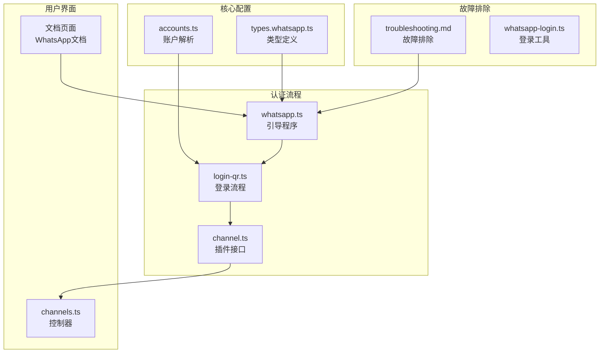
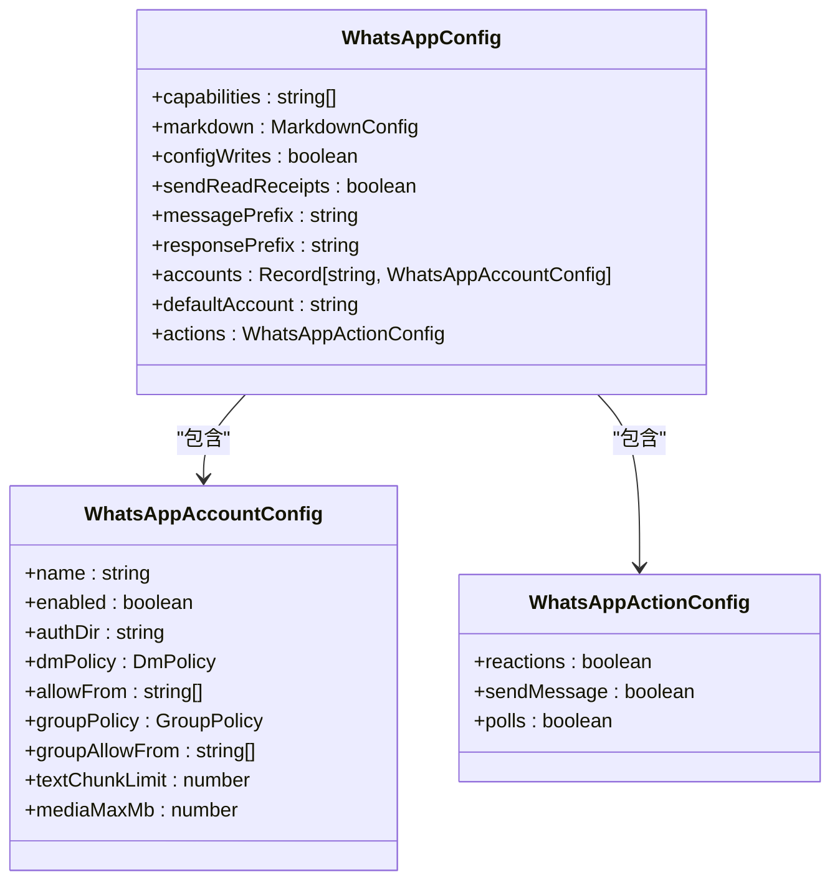
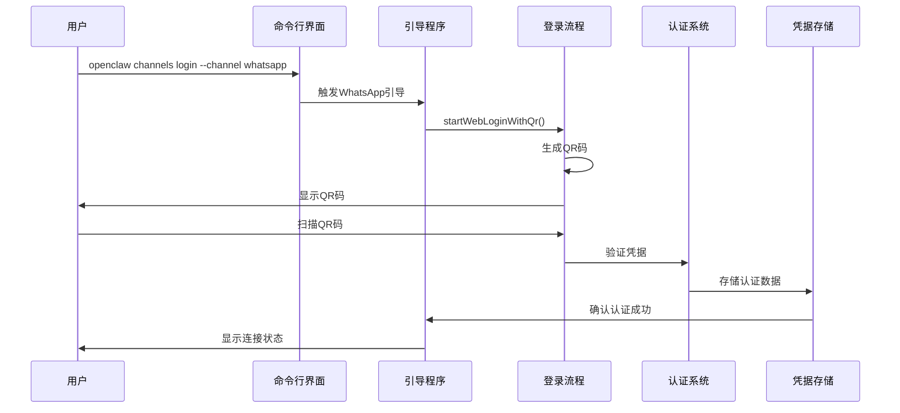
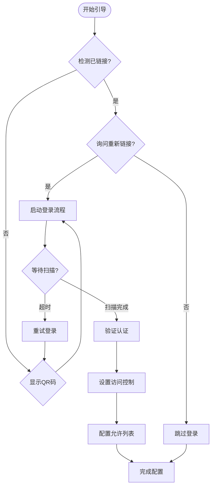
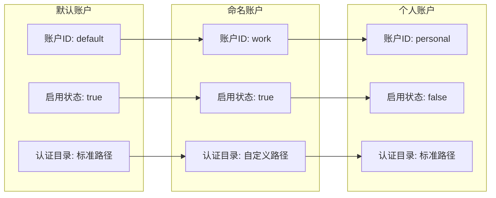
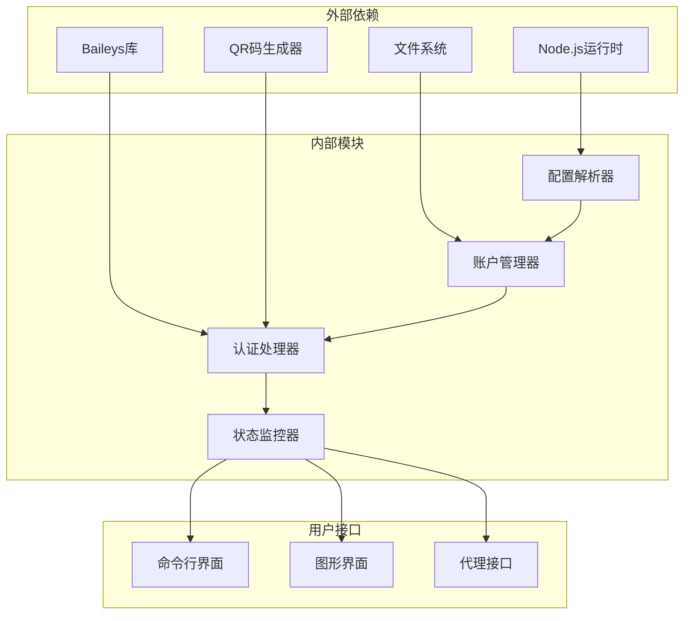
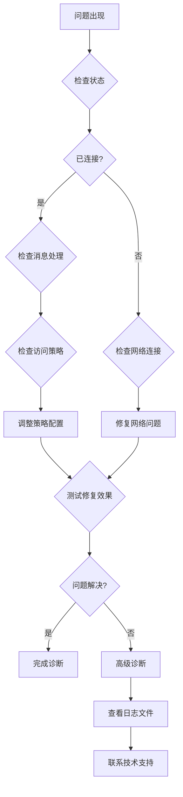

# WhatsApp认证配置

<cite>
**本文档引用的文件**
- [whatsapp.md](file://docs/channels/whatsapp.md)
- [whatsapp.ts](file://src/channels/plugins/onboarding/whatsapp.ts)
- [types.whatsapp.ts](file://src/config/types.whatsapp.ts)
- [accounts.ts](file://src/web/accounts.ts)
- [login-qr.ts](file://src/web/login-qr.ts)
- [channel.ts](file://extensions/whatsapp/src/channel.ts)
- [troubleshooting.md](file://docs/channels/troubleshooting.md)
- [whatsapp-login.ts](file://src/channels/plugins/agent-tools/whatsapp-login.ts)
- [channels.ts](file://ui/src/ui/controllers/channels.ts)
</cite>

## 目录

1. [简介](#简介)
2. [项目结构](#项目结构)
3. [核心组件](#核心组件)
4. [架构概览](#架构概览)
5. [详细组件分析](#详细组件分析)
6. [依赖关系分析](#依赖关系分析)
7. [性能考虑](#性能考虑)
8. [故障排除指南](#故障排除指南)
9. [结论](#结论)

## 简介

本指南专注于OpenClaw系统中WhatsApp通道的认证配置，基于仓库中现有的WhatsApp Web集成实现。需要注意的是，该实现使用的是WhatsApp Web（Baileys）而非传统的WhatsApp Business API。文档将详细说明如何配置WhatsApp认证、管理多账户、处理配对机制以及解决常见问题。

## 项目结构

OpenClaw的WhatsApp集成采用模块化设计，主要组件分布在以下位置：

**图表来源**

- [types.whatsapp.ts:1-117](file://src/config/types.whatsapp.ts#L1-L117)
- [whatsapp.ts:1-355](file://src/channels/plugins/onboarding/whatsapp.ts#L1-L355)
- [login-qr.ts:108-259](file://src/web/login-qr.ts#L108-L259)

**章节来源**

- [whatsapp.md:1-446](file://docs/channels/whatsapp.md#L1-L446)
- [types.whatsapp.ts:1-117](file://src/config/types.whatsapp.ts#L1-L117)

## 核心组件

### 认证配置类型系统

WhatsApp认证配置基于TypeScript类型定义，支持灵活的多账户管理和安全设置：

**图表来源**

- [types.whatsapp.ts:83-116](file://src/config/types.whatsapp.ts#L83-L116)

### 账户管理与认证目录

系统支持多种认证目录配置方式，包括传统和现代路径：

| 配置方式   | 路径模式                                        | 特点             |
| ---------- | ----------------------------------------------- | ---------------- |
| 默认账户   | `~/.openclaw/credentials/whatsapp/default/`     | 标准认证存储位置 |
| 命名账户   | `~/.openclaw/credentials/whatsapp/{accountId}/` | 多账户支持       |
| 自定义路径 | 用户指定绝对或相对路径                          | 灵活的部署选项   |
| 传统兼容   | `~/.openclaw/credentials/`                      | 向后兼容旧版本   |

**章节来源**

- [accounts.ts:94-114](file://src/web/accounts.ts#L94-L114)
- [whatsapp.md:352-364](file://docs/channels/whatsapp.md#L352-L364)

## 架构概览

OpenClaw的WhatsApp认证架构采用分层设计，确保安全性和可维护性：

**图表来源**

- [whatsapp.ts:332-337](file://src/channels/plugins/onboarding/whatsapp.ts#L332-L337)
- [login-qr.ts:108-214](file://src/web/login-qr.ts#L108-L214)

## 详细组件分析

### 引导程序组件

引导程序负责整个认证流程的协调和用户交互：

**图表来源**

- [whatsapp.ts:272-350](file://src/channels/plugins/onboarding/whatsapp.ts#L272-L350)

### 访问控制策略

系统提供三种主要的访问控制模式：

| 模式         | 描述                                       | 使用场景             | 安全级别 |
| ------------ | ------------------------------------------ | -------------------- | -------- |
| **配对模式** | 未知发送者需要配对码，所有者批准后才能通信 | 默认推荐，最高安全性 | 高       |
| **允许列表** | 仅允许白名单中的发送者，阻断其他所有消息   | 企业环境，精确控制   | 中高     |
| **开放模式** | 允许所有发送者，需在允许列表中包含"\*"     | 测试环境，公开服务   | 低       |
| **禁用模式** | 完全忽略WhatsApp直接消息                   | 维护期间，临时禁用   | 最低     |

**章节来源**

- [whatsapp.ts:179-251](file://src/channels/plugins/onboarding/whatsapp.ts#L179-L251)
- [whatsapp.md:134-200](file://docs/channels/whatsapp.md#L134-L200)

### 多账户管理

系统支持多账户配置，每个账户可以独立管理：

**图表来源**

- [types.whatsapp.ts:108-116](file://src/config/types.whatsapp.ts#L108-L116)
- [accounts.ts:162-167](file://src/web/accounts.ts#L162-L167)

**章节来源**

- [whatsapp.ts:291-309](file://src/channels/plugins/onboarding/whatsapp.ts#L291-L309)
- [types.whatsapp.ts:98-106](file://src/config/types.whatsapp.ts#L98-L106)

### 登录工具集成

系统提供了多种登录方式，满足不同使用场景：

| 工具类型       | 功能描述                                     | 使用场景           |
| -------------- | -------------------------------------------- | ------------------ |
| **命令行登录** | `openclaw channels login --channel whatsapp` | 标准安装，桌面环境 |
| **UI登录**     | 图形界面QR码扫描                             | 移动设备，平板电脑 |
| **代理登录**   | 通过代理服务器进行认证                       | 企业网络环境       |
| **批量登录**   | 同时处理多个账户                             | 大型企业部署       |

**章节来源**

- [whatsapp-login.ts:1-72](file://src/channels/plugins/agent-tools/whatsapp-login.ts#L1-L72)
- [channels.ts:54-94](file://ui/src/ui/controllers/channels.ts#L54-L94)

## 依赖关系分析

WhatsApp认证系统的依赖关系呈现清晰的层次结构：

**图表来源**

- [login-qr.ts:153-171](file://src/web/login-qr.ts#L153-L171)
- [channel.ts:43-65](file://extensions/whatsapp/src/channel.ts#L43-L65)

**章节来源**

- [channel.ts:43-473](file://extensions/whatsapp/src/channel.ts#L43-L473)
- [accounts.ts:1-167](file://src/web/accounts.ts#L1-L167)

## 性能考虑

### 连接管理优化

系统实现了智能的连接管理机制，确保资源的有效利用：

- **自动重连机制**：在网络中断后自动尝试恢复连接
- **心跳检测**：定期检查连接状态，及时发现异常
- **资源清理**：空闲连接自动释放，避免内存泄漏
- **并发控制**：限制同时建立的连接数量

### 认证缓存策略

为了提高认证效率，系统采用了多层缓存机制：

- **短期缓存**：最近使用的认证信息缓存在内存中
- **持久缓存**：认证数据存储在本地文件系统
- **失效策略**：根据配置的时间戳自动清理过期数据
- **一致性保证**：确保缓存数据与实际状态同步

## 故障排除指南

### 常见问题诊断

基于仓库中的故障排除文档，以下是主要问题的诊断步骤：

**图表来源**

- [troubleshooting.md:31-41](file://docs/channels/troubleshooting.md#L31-L41)

### 具体问题解决方案

#### 未链接状态

症状：通道状态报告为未链接
解决步骤：

1. 运行 `openclaw channels login --channel whatsapp`
2. 扫描显示的QR码
3. 验证认证目录中的凭据文件

#### 连接循环问题

症状：已链接但反复断开连接
解决步骤：

1. 运行 `openclaw doctor` 检查系统健康状况
2. 查看 `openclaw logs --follow` 获取详细日志
3. 必要时重新登录并验证凭据目录完整性

#### 发送失败问题

症状：无法发送消息
解决步骤：

1. 确保网关正在运行且账户已链接
2. 检查目标账户的认证状态
3. 验证网络连接和防火墙设置

**章节来源**

- [whatsapp.md:374-424](file://docs/channels/whatsapp.md#L374-L424)
- [troubleshooting.md:31-41](file://docs/channels/troubleshooting.md#L31-L41)

### 诊断工具使用

系统提供了丰富的诊断工具来帮助快速定位问题：

| 工具名称     | 功能描述                                       | 使用场景         |
| ------------ | ---------------------------------------------- | ---------------- |
| **状态检查** | `openclaw status` 和 `openclaw gateway status` | 基础系统健康检查 |
| **日志监控** | `openclaw logs --follow`                       | 实时问题追踪     |
| **医生诊断** | `openclaw doctor`                              | 系统全面检查     |
| **通道探测** | `openclaw channels status --probe`             | 通道特定问题诊断 |

**章节来源**

- [troubleshooting.md:13-23](file://docs/channels/troubleshooting.md#L13-L23)

## 结论

OpenClaw的WhatsApp认证配置系统提供了完整的企业级解决方案，具有以下特点：

### 主要优势

- **安全性**：支持多种访问控制模式，从高安全性的配对模式到灵活的开放模式
- **灵活性**：多账户支持，自定义认证目录，适应各种部署需求
- **易用性**：直观的引导程序，完善的错误处理和诊断工具
- **可靠性**：智能连接管理，自动重连机制，资源优化

### 最佳实践建议

1. **生产环境优先使用配对模式**，确保最高的安全性
2. **为不同用途创建独立账户**，便于管理和审计
3. **定期检查认证状态**，预防性维护系统健康
4. **建立完整的备份策略**，保护重要的认证数据

### 未来发展方向

- 增强对WhatsApp Business API的支持
- 提供更详细的合规性报告
- 优化大规模部署的性能表现
- 加强与其他渠道的集成能力

通过遵循本指南的配置和最佳实践，用户可以成功部署和维护一个安全、可靠的WhatsApp认证系统。
