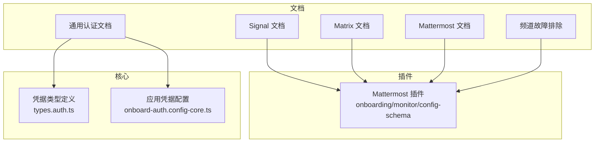
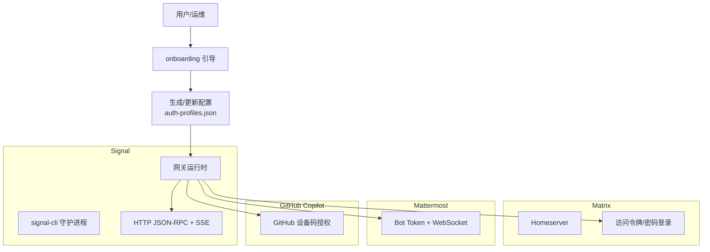
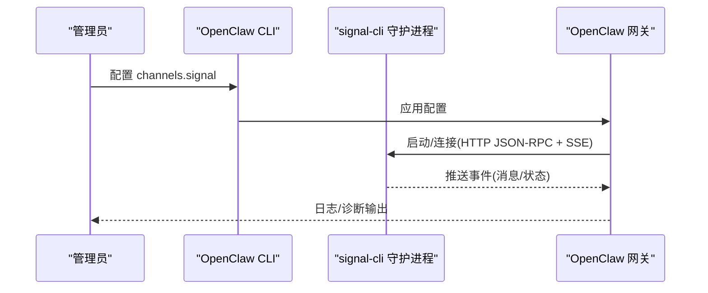
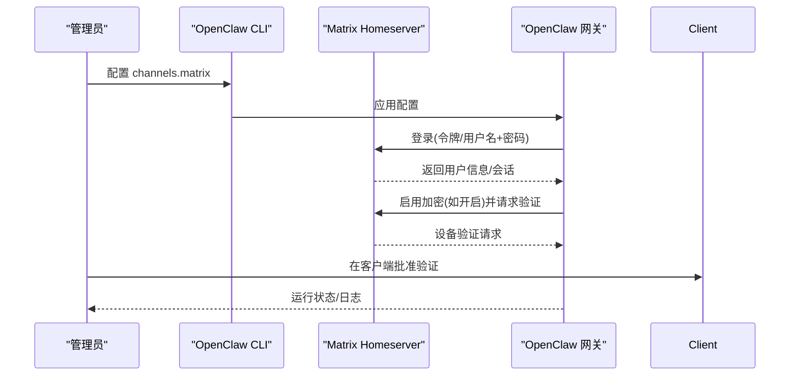
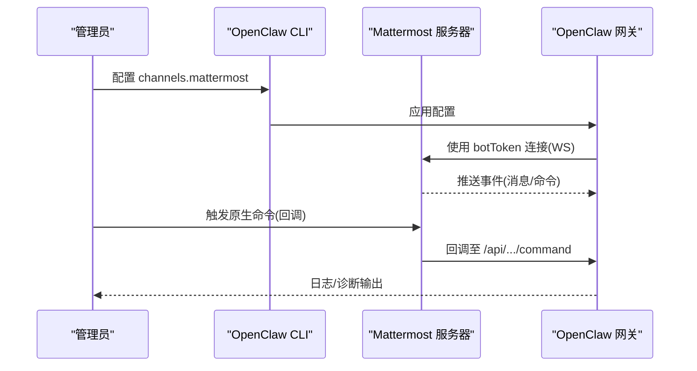
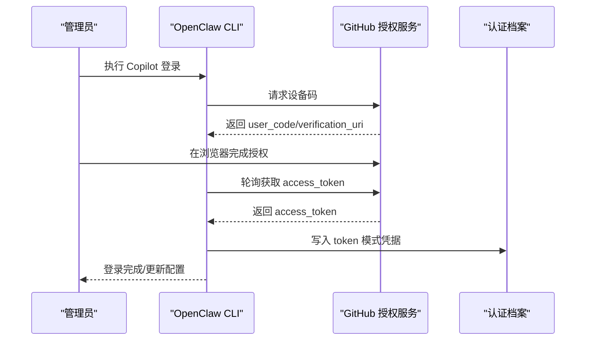
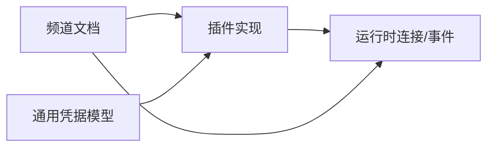

# 其他平台认证

<cite>
**本文引用的文件**
- [docs/channels/troubleshooting.md](file://docs/channels/troubleshooting.md)
- [docs/channels/signal.md](file://docs/channels/signal.md)
- [docs/channels/matrix.md](file://docs/channels/matrix.md)
- [docs/channels/mattermost.md](file://docs/channels/mattermost.md)
- [docs/gateway/authentication.md](file://docs/gateway/authentication.md)
- [src/providers/github-copilot-auth.ts](file://src/providers/github-copilot-auth.ts)
- [src/commands/auth-choice.apply.github-copilot.ts](file://src/commands/auth-choice.apply.github-copilot.ts)
- [extensions/mattermost/src/onboarding.ts](file://extensions/mattermost/src/onboarding.ts)
- [extensions/mattermost/src/mattermost/monitor.ts](file://extensions/mattermost/src/mattermost/monitor.ts)
- [extensions/mattermost/src/config-schema.test.ts](file://extensions/mattermost/src/config-schema.test.ts)
- [extensions/mattermost/src/onboarding.status.test.ts](file://extensions/mattermost/src/onboarding.status.test.ts)
- [src/config/types.auth.ts](file://src/config/types.auth.ts)
- [src/commands/onboard-auth.config-core.ts](file://src/commands/onboard-auth.config-core.ts)
</cite>

## 目录

1. [简介](#简介)
2. [项目结构](#项目结构)
3. [核心组件](#核心组件)
4. [架构总览](#架构总览)
5. [详细组件分析](#详细组件分析)
6. [依赖关系分析](#依赖关系分析)
7. [性能考量](#性能考量)
8. [故障排除指南](#故障排除指南)
9. [结论](#结论)
10. [附录](#附录)

## 简介

本指南面向在 OpenClaw 中为其他消息平台（Signal、Matrix、Mattermost、GitHub Copilot）配置认证与接入的用户与运维人员。内容覆盖：

- 各平台的认证方式与配置要点（API 密钥、访问令牌、设备码登录、WebSocket/HTTP 接入）
- Webhook 与回调端点的安全与可达性要求
- 权限模型差异（DM 策略、群组白名单、提及触发）
- 平台特定挑战与解决方案（API 限制、加密支持、按钮交互校验）
- 通用认证模式与最佳实践（OAuth 设备码、凭据轮换、状态检查）
- 通用诊断方法与排障策略

## 项目结构

OpenClaw 将“频道”（通道）能力以插件形式提供，认证与配置主要分布在：

- 文档层：各频道的官方文档（Signal、Matrix、Mattermost）与通用认证文档
- 插件层：各频道插件的引导、监控与配置校验逻辑（如 Mattermost）
- 核心层：通用凭据类型定义与配置应用逻辑（API Key、OAuth、Token）

图表来源

- [docs/channels/signal.md](file://docs/channels/signal.md)
- [docs/channels/matrix.md](file://docs/channels/matrix.md)
- [docs/channels/mattermost.md](file://docs/channels/mattermost.md)
- [docs/gateway/authentication.md](file://docs/gateway/authentication.md)
- [extensions/mattermost/src/onboarding.ts](file://extensions/mattermost/src/onboarding.ts)
- [extensions/mattermost/src/mattermost/monitor.ts](file://extensions/mattermost/src/mattermost/monitor.ts)
- [extensions/mattermost/src/config-schema.test.ts](file://extensions/mattermost/src/config-schema.test.ts)
- [src/config/types.auth.ts](file://src/config/types.auth.ts)
- [src/commands/onboard-auth.config-core.ts](file://src/commands/onboard-auth.config-core.ts)

章节来源

- [docs/channels/signal.md](file://docs/channels/signal.md)
- [docs/channels/matrix.md](file://docs/channels/matrix.md)
- [docs/channels/mattermost.md](file://docs/channels/mattermost.md)
- [docs/gateway/authentication.md](file://docs/gateway/authentication.md)
- [extensions/mattermost/src/onboarding.ts](file://extensions/mattermost/src/onboarding.ts)
- [extensions/mattermost/src/mattermost/monitor.ts](file://extensions/mattermost/src/mattermost/monitor.ts)
- [extensions/mattermost/src/config-schema.test.ts](file://extensions/mattermost/src/config-schema.test.ts)
- [src/config/types.auth.ts](file://src/config/types.auth.ts)
- [src/commands/onboard-auth.config-core.ts](file://src/commands/onboard-auth.config-core.ts)

## 核心组件

- 凭据类型与配置
  - 支持三种模式：API Key、OAuth（刷新型）、Token（可过期但不刷新）
  - 通过配置文件与 onboarding 流程写入 auth-profiles.json，并与具体 provider 绑定
- Mattermost 认证与运行时
  - 基于 botToken 与 baseUrl 的连接；支持环境变量默认账户；启动前进行状态检查
- GitHub Copilot 登录（设备码）
  - 使用 GitHub 设备码授权流程，获取短期 token 并写入认证档案

章节来源

- [src/config/types.auth.ts](file://src/config/types.auth.ts)
- [src/commands/onboard-auth.config-core.ts](file://src/commands/onboard-auth.config-core.ts)
- [extensions/mattermost/src/mattermost/monitor.ts](file://extensions/mattermost/src/mattermost/monitor.ts)
- [src/providers/github-copilot-auth.ts](file://src/providers/github-copilot-auth.ts)

## 架构总览

下图展示 OpenClaw 在不同平台上的认证与运行时交互模式（概念示意）：

图表来源

- [docs/channels/signal.md](file://docs/channels/signal.md)
- [docs/channels/matrix.md](file://docs/channels/matrix.md)
- [docs/channels/mattermost.md](file://docs/channels/mattermost.md)
- [docs/gateway/authentication.md](file://docs/gateway/authentication.md)
- [src/providers/github-copilot-auth.ts](file://src/providers/github-copilot-auth.ts)

## 详细组件分析

### Signal（基于 signal-cli）

- 认证与接入
  - 通过 signal-cli 链接或短信注册建立账号；OpenClaw 通过 HTTP JSON-RPC + SSE 与守护进程通信
  - 外部守护模式可通过 httpUrl 指向已部署的 signal-cli 实例
- DM 与群组策略
  - DM 默认采用配对（pairing）策略；群组默认允许白名单并支持提及触发
- 配置要点
  - 账号号码、CLI 路径、DM 策略、允许来源列表、文本分片与媒体上限等
- 故障排除
  - 优先执行状态与诊断命令；确认守护进程可达、接收模式正确、配对状态有效

图表来源

- [docs/channels/signal.md](file://docs/channels/signal.md)

章节来源

- [docs/channels/signal.md](file://docs/channels/signal.md)

### Matrix（用户令牌 + 加密）

- 认证与接入
  - 通过访问令牌或用户名+密码登录；支持端到端加密（E2EE），首次连接需在客户端验证设备
- DM 与房间策略
  - DM 默认配对；房间默认白名单并支持提及触发；可按房间细化允许列表
- 配置要点
  - Homeserver、用户 ID、访问令牌、是否启用加密、线程回复与回复模式、自动加入策略等
- 故障排除
  - 登录后房间被忽略：检查房间策略与允许列表；加密失败：确认加密模块可用与设备验证完成

图表来源

- [docs/channels/matrix.md](file://docs/channels/matrix.md)

章节来源

- [docs/channels/matrix.md](file://docs/channels/matrix.md)

### Mattermost（机器人令牌 + WebSocket）

- 认证与接入
  - 使用 botToken 与 baseUrl 连接；支持多账户；启动前进行状态检查与凭据来源解析
- DM 与频道策略
  - DM 默认配对；频道支持 oncall/onmessage/onchar 三类 chatmode；群组默认白名单并支持提及触发
- Webhook 与回调
  - 可启用原生 slash 命令回调；需确保 Mattermost 可达回调端点，并在服务器配置中放行内部地址
- 配置要点
  - botToken、baseUrl、DM 策略、聊天模式、按钮交互回调基地址、命令回调路径与 URL 等
- 故障排除
  - 无回复：确认 bot 已加入频道并被提及或使用 onmessage/onchar；认证错误：核对 botToken 与 baseUrl；按钮点击 404：检查按钮 ID 是否仅含字母数字

图表来源

- [docs/channels/mattermost.md](file://docs/channels/mattermost.md)
- [extensions/mattermost/src/mattermost/monitor.ts](file://extensions/mattermost/src/mattermost/monitor.ts)
- [extensions/mattermost/src/onboarding.ts](file://extensions/mattermost/src/onboarding.ts)

章节来源

- [docs/channels/mattermost.md](file://docs/channels/mattermost.md)
- [extensions/mattermost/src/mattermost/monitor.ts](file://extensions/mattermost/src/mattermost/monitor.ts)
- [extensions/mattermost/src/onboarding.ts](file://extensions/mattermost/src/onboarding.ts)
- [extensions/mattermost/src/config-schema.test.ts](file://extensions/mattermost/src/config-schema.test.ts)
- [extensions/mattermost/src/onboarding.status.test.ts](file://extensions/mattermost/src/onboarding.status.test.ts)

### GitHub Copilot（设备码授权）

- 认证流程
  - 使用 GitHub 设备码授权流程申请短期访问令牌；随后写入认证档案并应用到配置
- 配置与存储
  - 通过 onboarding 或命令行完成登录；凭据以 token 模式写入 auth-profiles.json
- 注意事项
  - 需要交互式终端；登录成功后可直接用于 Copilot 相关能力

图表来源

- [src/providers/github-copilot-auth.ts](file://src/providers/github-copilot-auth.ts)
- [src/commands/auth-choice.apply.github-copilot.ts](file://src/commands/auth-choice.apply.github-copilot.ts)

章节来源

- [src/providers/github-copilot-auth.ts](file://src/providers/github-copilot-auth.ts)
- [src/commands/auth-choice.apply.github-copilot.ts](file://src/commands/auth-choice.apply.github-copilot.ts)

### 通用认证模式与最佳实践

- 凭据类型
  - API Key：适合长期运行的网关主机；便于轮换与多键重试
  - OAuth：支持刷新的令牌，适合订阅/企业账户；注意过期与刷新策略
  - Token：一次性或短期令牌，适合设备码流程；无需刷新但需到期检查
- 凭据来源与优先级
  - 环境变量、配置文件、密钥管理器（SecretRef）；默认账户与多账户区分
- 安全建议
  - 最小权限原则；定期轮换；避免在日志中泄露敏感信息；启用加密（如 Matrix E2EE）
- 状态检查与自动化
  - 使用诊断命令与状态检查脚本；对过期/缺失凭据进行告警与自动处理

章节来源

- [docs/gateway/authentication.md](file://docs/gateway/authentication.md)
- [src/config/types.auth.ts](file://src/config/types.auth.ts)
- [src/commands/onboard-auth.config-core.ts](file://src/commands/onboard-auth.config-core.ts)

## 依赖关系分析

- 文档驱动：各频道文档定义了最小配置、策略与故障排除清单
- 插件驱动：Mattermost 插件负责 onboarding、monitor 与配置校验，确保凭据与运行时一致
- 核心驱动：通用凭据类型与配置应用逻辑贯穿所有平台，保证一致性与可审计性

图表来源

- [docs/channels/signal.md](file://docs/channels/signal.md)
- [docs/channels/matrix.md](file://docs/channels/matrix.md)
- [docs/channels/mattermost.md](file://docs/channels/mattermost.md)
- [extensions/mattermost/src/onboarding.ts](file://extensions/mattermost/src/onboarding.ts)
- [extensions/mattermost/src/mattermost/monitor.ts](file://extensions/mattermost/src/mattermost/monitor.ts)
- [src/config/types.auth.ts](file://src/config/types.auth.ts)

章节来源

- [docs/channels/signal.md](file://docs/channels/signal.md)
- [docs/channels/matrix.md](file://docs/channels/matrix.md)
- [docs/channels/mattermost.md](file://docs/channels/mattermost.md)
- [extensions/mattermost/src/onboarding.ts](file://extensions/mattermost/src/onboarding.ts)
- [extensions/mattermost/src/mattermost/monitor.ts](file://extensions/mattermost/src/mattermost/monitor.ts)
- [src/config/types.auth.ts](file://src/config/types.auth.ts)

## 性能考量

- 连接稳定性：选择合适的回调/监听端口与网络可达性，避免频繁重连
- 事件处理：合理设置文本分片与媒体上限，减少单次传输压力
- 多账户并发：序列化启动以避免模块导入竞争；缓存登录态与加密状态
- 轮询与重试：对设备码轮询设置合理的间隔与超时，避免过度请求

## 故障排除指南

- 通用步骤
  - 检查运行时状态与 RPC 探针；查看网关与频道探针状态
  - 对照各频道的常见症状与修复清单，快速定位问题
- 平台特定
  - Signal：确认守护进程可达、接收模式、配对状态；参考频道故障排除页
  - Matrix：确认加密模块可用、设备已验证；检查房间策略与允许列表
  - Mattermost：确认 botToken/baseUrl、回调可达性与服务器允许列表；按钮点击 404 通常由非字母数字 ID 引起
  - GitHub Copilot：确认交互式终端可用、设备码授权完成、凭据写入成功

章节来源

- [docs/channels/troubleshooting.md](file://docs/channels/troubleshooting.md)
- [docs/channels/signal.md](file://docs/channels/signal.md)
- [docs/channels/matrix.md](file://docs/channels/matrix.md)
- [docs/channels/mattermost.md](file://docs/channels/mattermost.md)

## 结论

通过统一的凭据模型与各平台插件化的实现，OpenClaw 能够在多种消息平台上提供一致的认证体验与可观测性。遵循本文档中的通用模式与最佳实践，结合平台特定的配置与故障排除策略，可显著提升部署与运维效率。

## 附录

- 快速对照
  - Signal：账号模型、配对策略、守护进程可达性
  - Matrix：访问令牌/密码、E2EE 设备验证、房间策略
  - Mattermost：botToken、回调可达性、按钮 ID 限制
  - GitHub Copilot：设备码授权、token 写入与配置应用
