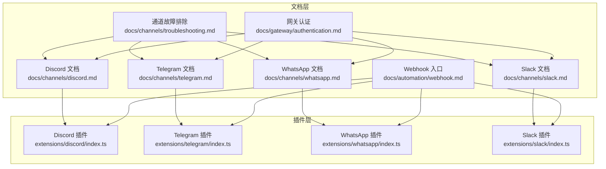
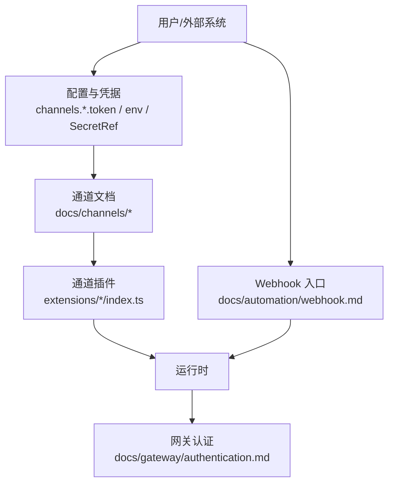
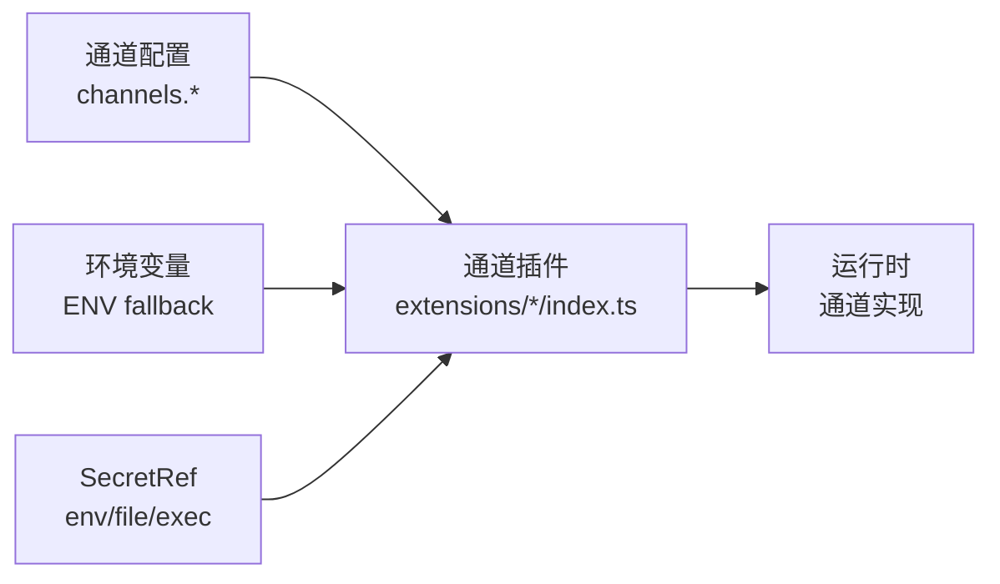

# 通道认证

<cite>
**本文引用的文件**
- [docs/channels/discord.md](file://docs/channels/discord.md)
- [docs/channels/telegram.md](file://docs/channels/telegram.md)
- [docs/channels/whatsapp.md](file://docs/channels/whatsapp.md)
- [docs/channels/slack.md](file://docs/channels/slack.md)
- [docs/channels/troubleshooting.md](file://docs/channels/troubleshooting.md)
- [docs/gateway/authentication.md](file://docs/gateway/authentication.md)
- [docs/automation/webhook.md](file://docs/automation/webhook.md)
- [extensions/discord/index.ts](file://extensions/discord/index.ts)
- [extensions/telegram/index.ts](file://extensions/telegram/index.ts)
- [extensions/whatsapp/index.ts](file://extensions/whatsapp/index.ts)
- [extensions/slack/index.ts](file://extensions/slack/index.ts)
</cite>

## 目录

1. [简介](#简介)
2. [项目结构与认证概览](#项目结构与认证概览)
3. [核心组件与认证模型](#核心组件与认证模型)
4. [架构总览](#架构总览)
5. [详细通道认证指南](#详细通道认证指南)
   - [Discord 认证配置](#discord-认证配置)
   - [Telegram 认证配置](#telegram-认证配置)
   - [WhatsApp 认证配置](#whatsapp-认证配置)
   - [Slack 认证配置](#slack-认证配置)
6. [依赖关系分析](#依赖关系分析)
7. [性能与安全考量](#性能与安全考量)
8. [故障排除与诊断](#故障排除与诊断)
9. [结论](#结论)
10. [附录：通道认证参数速查](#附录通道认证参数速查)

## 简介

本指南聚焦于 OpenClaw 各消息通道（Discord、Telegram、WhatsApp、Slack）的认证配置与运行机制，覆盖 API 密钥/令牌获取、Webhook 配置、机器人权限设置、通道特定认证参数、权限范围与安全配置，并提供常见问题的诊断与修复路径。文档同时解释通道插件注册与运行时集成方式，帮助读者在不同平台快速完成安全、稳定的认证部署。

## 项目结构与认证概览

- 文档层：各通道的认证与配置说明集中在 docs/channels 下，涵盖快速设置、权限清单、访问控制、运行时行为与故障排除。
- 插件层：各通道通过扩展插件注册到 OpenClaw 运行时，统一暴露配置模式与能力边界。
- 网关层：认证状态检查、凭据轮换与模型侧认证由网关与模型认证文档说明。

图表来源

- [docs/channels/discord.md](file://docs/channels/discord.md)
- [docs/channels/telegram.md](file://docs/channels/telegram.md)
- [docs/channels/whatsapp.md](file://docs/channels/whatsapp.md)
- [docs/channels/slack.md](file://docs/channels/slack.md)
- [docs/channels/troubleshooting.md](file://docs/channels/troubleshooting.md)
- [docs/gateway/authentication.md](file://docs/gateway/authentication.md)
- [docs/automation/webhook.md](file://docs/automation/webhook.md)
- [extensions/discord/index.ts](file://extensions/discord/index.ts)
- [extensions/telegram/index.ts](file://extensions/telegram/index.ts)
- [extensions/whatsapp/index.ts](file://extensions/whatsapp/index.ts)
- [extensions/slack/index.ts](file://extensions/slack/index.ts)

章节来源

- [docs/channels/discord.md](file://docs/channels/discord.md)
- [docs/channels/telegram.md](file://docs/channels/telegram.md)
- [docs/channels/whatsapp.md](file://docs/channels/whatsapp.md)
- [docs/channels/slack.md](file://docs/channels/slack.md)
- [docs/channels/troubleshooting.md](file://docs/channels/troubleshooting.md)
- [docs/gateway/authentication.md](file://docs/gateway/authentication.md)
- [docs/automation/webhook.md](file://docs/automation/webhook.md)
- [extensions/discord/index.ts](file://extensions/discord/index.ts)
- [extensions/telegram/index.ts](file://extensions/telegram/index.ts)
- [extensions/whatsapp/index.ts](file://extensions/whatsapp/index.ts)
- [extensions/slack/index.ts](file://extensions/slack/index.ts)

## 核心组件与认证模型

- 通道插件注册：各通道插件在注册时绑定运行时与通道实现，统一暴露配置模式与能力。
- 凭据解析顺序：通道级配置优先于环境回退；部分通道支持 SecretRef 与多账户凭据目录。
- 权限与访问控制：通过 allowlist、requireMention、groupPolicy 等策略控制消息入口与交互范围。
- 安全边界：通道侧鉴权失败会拒绝或提示配对；Webhook 入口需独立令牌保护。

章节来源

- [extensions/discord/index.ts](file://extensions/discord/index.ts)
- [extensions/telegram/index.ts](file://extensions/telegram/index.ts)
- [extensions/whatsapp/index.ts](file://extensions/whatsapp/index.ts)
- [extensions/slack/index.ts](file://extensions/slack/index.ts)
- [docs/channels/discord.md](file://docs/channels/discord.md)
- [docs/channels/telegram.md](file://docs/channels/telegram.md)
- [docs/channels/whatsapp.md](file://docs/channels/whatsapp.md)
- [docs/channels/slack.md](file://docs/channels/slack.md)

## 架构总览

下图展示通道认证在系统中的位置与交互关系：文档定义配置与权限，插件注册到运行时，网关负责模型侧认证与凭据轮换，Webhook 提供外部触发入口。

图表来源

- [docs/channels/discord.md](file://docs/channels/discord.md)
- [docs/channels/telegram.md](file://docs/channels/telegram.md)
- [docs/channels/whatsapp.md](file://docs/channels/whatsapp.md)
- [docs/channels/slack.md](file://docs/channels/slack.md)
- [docs/gateway/authentication.md](file://docs/gateway/authentication.md)
- [docs/automation/webhook.md](file://docs/automation/webhook.md)
- [extensions/discord/index.ts](file://extensions/discord/index.ts)
- [extensions/telegram/index.ts](file://extensions/telegram/index.ts)
- [extensions/whatsapp/index.ts](file://extensions/whatsapp/index.ts)
- [extensions/slack/index.ts](file://extensions/slack/index.ts)

## 详细通道认证指南

### Discord 认证配置

- 平台入口与权限
  - 在 Discord 开发者门户创建应用与机器人，启用“特权网关意图”（消息内容、服务器成员、存在更新可选），生成 Bot Token。
  - 使用 OAuth URL 生成器为机器人添加服务器权限（查看频道、发送消息、读取历史、嵌入链接、附件、添加表情等）。
- 凭据与配置
  - 支持配置项：channels.discord.enabled、channels.discord.token（SecretRef 支持）、多账户凭据目录。
  - 环境回退：默认账户使用 DISCORD_BOT_TOKEN。
- 访问控制
  - DM 策略：pairing（默认）、allowlist、open、disabled；未知用户默认阻断或提示配对。
  - 服务器/频道策略：groupPolicy=open/allowlist/disabled；允许按服务器/频道配置 requireMention、忽略其他提及等。
- 运行时行为
  - DM 默认共享主会话；群组频道隔离会话；论坛频道线程支持自动创建与交互组件。
- Webhook 与事件
  - 文档未提供专用 Webhook 配置示例；可通过网关与外部系统结合使用通用 Webhook 入口进行触发。

章节来源

- [docs/channels/discord.md](file://docs/channels/discord.md)

### Telegram 认证配置

- 平台入口与权限
  - 通过 BotFather 创建机器人并获取 Token；根据需要调整隐私模式与管理员权限以接收群组消息。
- 凭据与配置
  - 支持配置项：channels.telegram.enabled、botToken（SecretRef 支持）、DM 策略与群组策略、群内允许列表。
  - 环境回退：默认账户使用 TELEGRAM_BOT_TOKEN。
- 访问控制
  - DM 策略：pairing（默认）、allowlist、open、disabled；允许使用 numeric ID 或 telegram:/tg: 前缀。
  - 群组策略：groupPolicy=open/allowlist/disabled；群内 sender allowlist 使用 groupAllowFrom。
- 运行时行为
  - 长轮询为默认模式；支持 Webhook 模式（需配置 webhookUrl、webhookSecret、可选 webhookPath/host/port）。
  - 支持实时预览流式回复、内联按钮、论坛话题与线程绑定、贴纸动作等。

章节来源

- [docs/channels/telegram.md](file://docs/channels/telegram.md)

### WhatsApp 认证配置

- 平台入口与权限
  - 通过 QR 登录连接到 WhatsApp Web（Baileys）；建议使用独立号码以降低自聊混淆。
- 凭据与配置
  - 支持配置项：dmPolicy、allowFrom、groupPolicy、groupAllowFrom、多账户凭据目录（~/.openclaw/credentials/whatsapp/<accountId>/creds.json）。
  - 自动配对与允许列表合并；个人号模式下启用 selfChatMode。
- 访问控制
  - DM 策略：pairing（默认）、allowlist、open、disabled；支持多账户覆盖。
  - 群组策略：groupPolicy=open/allowlist/disabled；sender allowlist fallback 到 allowFrom。
- 运行时行为
  - 独立监听器与重连循环；忽略状态/广播聊天；DM 会话规则可折叠为主会话；群组会话隔离。

章节来源

- [docs/channels/whatsapp.md](file://docs/channels/whatsapp.md)

### Slack 认证配置

- 平台入口与权限
  - Socket Mode：启用 Socket Mode，创建 App Token（xapp-...，connections:write）与 Bot Token（xoxb-...）。
  - HTTP Events API：复制 Signing Secret，设置事件订阅与交互请求 URL（默认 /slack/events）。
- 凭据与配置
  - 支持配置项：mode、botToken、appToken（Socket）、signingSecret（HTTP）、webhookPath、多账户配置。
  - 环境回退：默认账户使用 SLACK_APP_TOKEN/SLACK_BOT_TOKEN。
- 访问控制
  - DM 策略：pairing（默认）、allowlist、open、disabled；MPIM 可单独允许。
  - 频道策略：groupPolicy=open/allowlist/disabled；频道允许列表与 requireMention/users 等细粒度控制。
- 运行时行为
  - 支持原生文本流式传输（Agents and AI Apps API）；线程会话与回复标签；反应事件映射为系统事件。
- Webhook 与事件
  - 文档未提供专用 Webhook 配置示例；可通过网关与外部系统结合使用通用 Webhook 入口进行触发。

章节来源

- [docs/channels/slack.md](file://docs/channels/slack.md)

## 依赖关系分析

- 插件注册依赖：各通道插件在注册时绑定运行时与通道实现，确保配置模式一致。
- 凭据解析链：通道配置 > 环境变量（默认账户）> SecretRef；部分通道支持 per-account 覆盖。
- 权限与策略：通道文档定义了严格的 allowlist/mention/policy 控制，运行时严格遵循。

图表来源

- [extensions/discord/index.ts](file://extensions/discord/index.ts)
- [extensions/telegram/index.ts](file://extensions/telegram/index.ts)
- [extensions/whatsapp/index.ts](file://extensions/whatsapp/index.ts)
- [extensions/slack/index.ts](file://extensions/slack/index.ts)
- [docs/channels/discord.md](file://docs/channels/discord.md)
- [docs/channels/telegram.md](file://docs/channels/telegram.md)
- [docs/channels/whatsapp.md](file://docs/channels/whatsapp.md)
- [docs/channels/slack.md](file://docs/channels/slack.md)

章节来源

- [extensions/discord/index.ts](file://extensions/discord/index.ts)
- [extensions/telegram/index.ts](file://extensions/telegram/index.ts)
- [extensions/whatsapp/index.ts](file://extensions/whatsapp/index.ts)
- [extensions/slack/index.ts](file://extensions/slack/index.ts)
- [docs/channels/discord.md](file://docs/channels/discord.md)
- [docs/channels/telegram.md](file://docs/channels/telegram.md)
- [docs/channels/whatsapp.md](file://docs/channels/whatsapp.md)
- [docs/channels/slack.md](file://docs/channels/slack.md)

## 性能与安全考量

- 凭据存储与轮换
  - 通道级凭据优先于环境回退；支持 SecretRef 多源（env/file/exec）。
  - 模型侧凭据轮换与重试策略见网关认证文档。
- 速率限制与重试
  - 通道发送辅助工具对可恢复错误进行重试；具体阈值与行为以各通道文档为准。
- 安全边界
  - 通道鉴权失败即拒绝；Webhook 入口需独立令牌保护，避免与网关令牌混用。
  - 多账户场景中，明确 per-account 覆盖与默认账户差异。

章节来源

- [docs/gateway/authentication.md](file://docs/gateway/authentication.md)
- [docs/channels/discord.md](file://docs/channels/discord.md)
- [docs/channels/telegram.md](file://docs/channels/telegram.md)
- [docs/channels/whatsapp.md](file://docs/channels/whatsapp.md)
- [docs/channels/slack.md](file://docs/channels/slack.md)
- [docs/automation/webhook.md](file://docs/automation/webhook.md)

## 故障排除与诊断

- 快速命令梯子
  - openclaw status、gateway status、logs --follow、doctor、channels status --probe
- 通道级症状与修复
  - WhatsApp：随机断开/重登、无 DM 回复、群消息被忽略。
  - Telegram：/start 后无可用回复、群组保持沉默、发送失败（网络错误）、升级后允许列表阻断。
  - Discord：服务器无回复、群消息被忽略、DM 回复缺失。
  - Slack：Socket 模式已连接但无响应、DM 被阻止、频道消息被忽略。
- 通用检查点
  - 确认通道已连接且探针正常；核对令牌/签名密钥/权限范围；检查 allowlist 与提及策略；验证网络可达性与代理设置。

章节来源

- [docs/channels/troubleshooting.md](file://docs/channels/troubleshooting.md)
- [docs/channels/discord.md](file://docs/channels/discord.md)
- [docs/channels/telegram.md](file://docs/channels/telegram.md)
- [docs/channels/whatsapp.md](file://docs/channels/whatsapp.md)
- [docs/channels/slack.md](file://docs/channels/slack.md)

## 结论

- 各通道均提供清晰的凭据获取与权限配置流程，建议优先采用通道级配置与 SecretRef，确保凭据安全与可维护性。
- 访问控制策略（allowlist、requireMention、groupPolicy）是保障安全的关键，应结合业务场景审慎设置。
- 对于需要外部触发的场景，可结合通用 Webhook 入口进行集成，注意独立令牌与安全边界。

## 附录：通道认证参数速查

- Discord
  - 关键参数：enabled、token（SecretRef 支持）、dmPolicy、groupPolicy、guilds.\*.requireMention、webhook（如需）
  - 环境回退：DISCORD_BOT_TOKEN（默认账户）
- Telegram
  - 关键参数：enabled、botToken（SecretRef 支持）、dmPolicy、groups.\*.requireMention、groupPolicy、webhookUrl/webhookSecret/webhookPath/webhookHost/webhookPort
  - 环境回退：TELEGRAM_BOT_TOKEN（默认账户）
- WhatsApp
  - 关键参数：dmPolicy、allowFrom、groupPolicy、groupAllowFrom、多账户凭据目录（creds.json）
  - 环境回退：无（登录方式为 QR）
- Slack
  - 关键参数：mode（socket/http）、botToken、appToken（Socket）、signingSecret（HTTP）、webhookPath、accounts.\*
  - 环境回退：SLACK_APP_TOKEN/SLACK_BOT_TOKEN（默认账户）

章节来源

- [docs/channels/discord.md](file://docs/channels/discord.md)
- [docs/channels/telegram.md](file://docs/channels/telegram.md)
- [docs/channels/whatsapp.md](file://docs/channels/whatsapp.md)
- [docs/channels/slack.md](file://docs/channels/slack.md)
