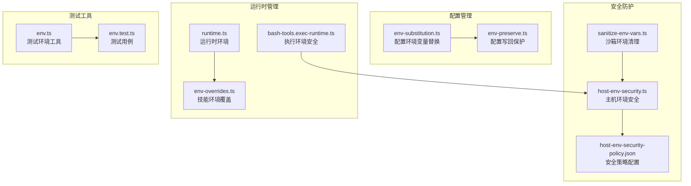
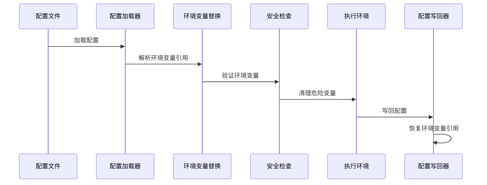
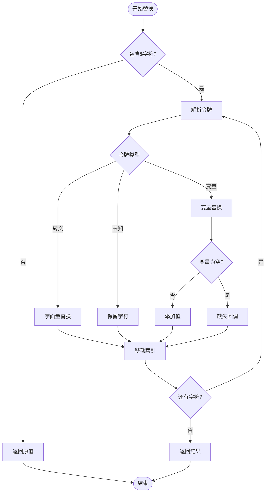
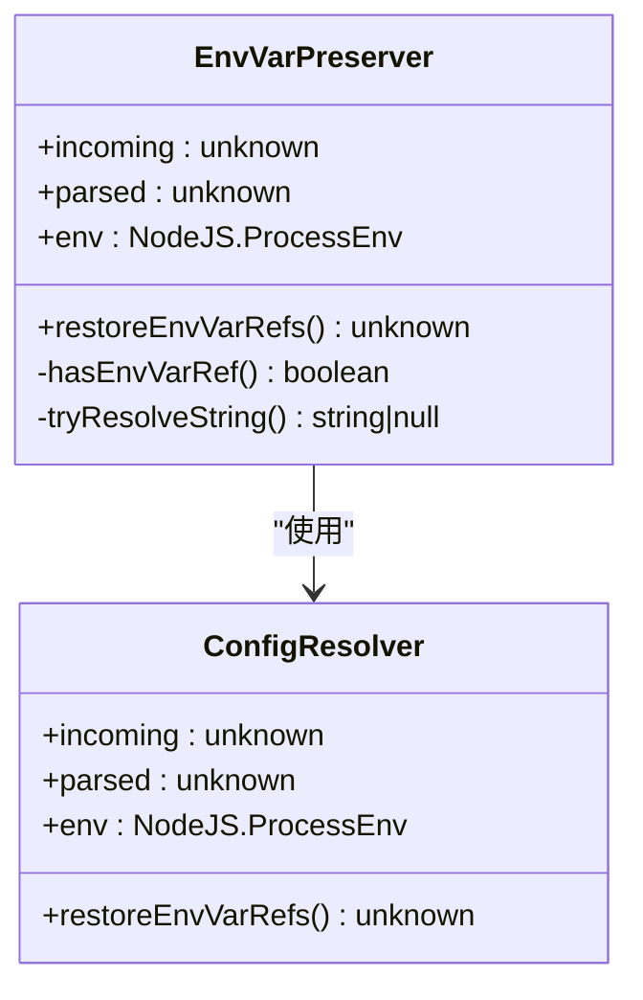
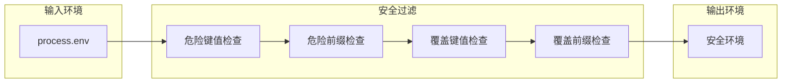
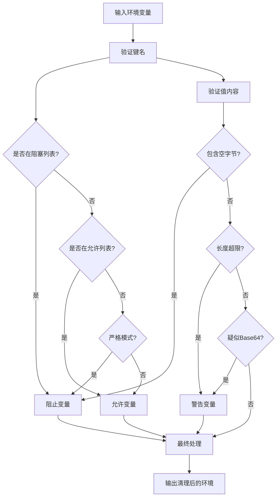
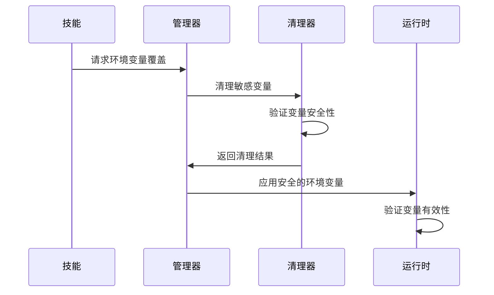
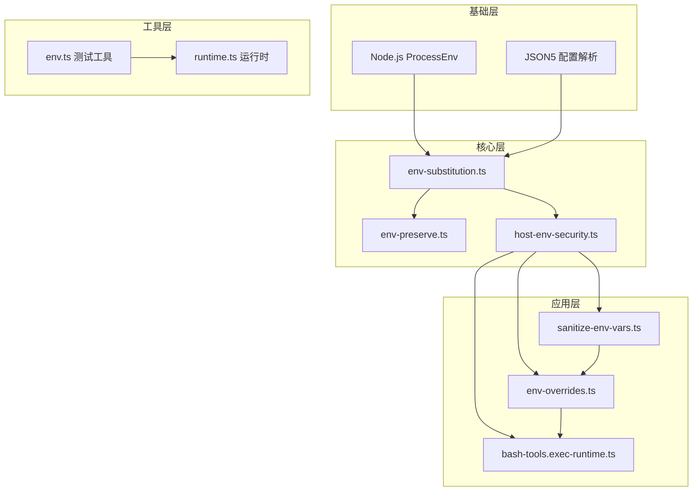

# 环境变量管理

<cite>
**本文档引用的文件**
- [env-substitution.ts](file://src/config/env-substitution.ts)
- [env-preserve.ts](file://src/config/env-preserve.ts)
- [host-env-security.ts](file://src/infra/host-env-security.ts)
- [host-env-security-policy.json](file://src/infra/host-env-security-policy.json)
- [sanitize-env-vars.ts](file://src/agents/sandbox/sanitize-env-vars.ts)
- [env-overrides.ts](file://src/agents/skills/env-overrides.ts)
- [env.ts](file://src/test-utils/env.ts)
- [env.test.ts](file://src/test-utils/env.test.ts)
- [env.ts](file://src/process/supervisor/adapters/env.ts)
- [bash-tools.exec-runtime.ts](file://src/agents/bash-tools.exec-runtime.ts)
- [runtime.ts](file://src/runtime.ts)
- [schtasks.install.test.ts](file://src/daemon/schtasks.install.test.ts)
</cite>

## 目录

1. [简介](#简介)
2. [项目结构](#项目结构)
3. [核心组件](#核心组件)
4. [架构概览](#架构概览)
5. [详细组件分析](#详细组件分析)
6. [依赖关系分析](#依赖关系分析)
7. [性能考虑](#性能考虑)
8. [故障排除指南](#故障排除指南)
9. [结论](#结论)
10. [附录](#附录)

## 简介

OpenClaw 的环境变量管理系统是一个经过精心设计的安全框架，用于在配置加载、运行时执行和测试环境中安全地管理环境变量。该系统提供了完整的环境变量替换机制、敏感信息保护、变量继承规则和最佳实践指导。

本指南将深入分析 OpenClaw 的环境变量管理实现，包括命名规范、作用域和优先级规则、敏感信息处理机制、变量替换算法以及动态注入和运行时修改功能。

## 项目结构

OpenClaw 的环境变量管理分布在多个关键模块中：



**图表来源**

- [env-substitution.ts:1-204](file://src/config/env-substitution.ts#L1-L204)
- [env-preserve.ts:1-135](file://src/config/env-preserve.ts#L1-L135)
- [host-env-security.ts:1-158](file://src/infra/host-env-security.ts#L1-L158)

**章节来源**

- [env-substitution.ts:1-204](file://src/config/env-substitution.ts#L1-L204)
- [env-preserve.ts:1-135](file://src/config/env-preserve.ts#L1-L135)
- [host-env-security.ts:1-158](file://src/infra/host-env-security.ts#L1-L158)

## 核心组件

### 环境变量替换引擎

环境变量替换引擎是 OpenClaw 的核心组件，负责在配置加载时解析 `${VAR_NAME}` 语法并进行安全替换。

**主要特性：**

- 支持标准环境变量语法 `${VAR_NAME}`
- 提供转义机制 `$${VAR_NAME}` 输出字面量
- 实施严格的大小写和格式验证
- 支持嵌套和重复变量引用

### 配置写回保护器

配置写回保护器确保环境变量引用在配置文件的读写循环中保持一致，防止丢失原始的环境变量引用。

**关键机制：**

- 检测字符串值中的环境变量模式
- 验证当前环境变量值的匹配性
- 在类型安全的前提下恢复引用

### 主机环境安全控制器

主机环境安全控制器实施全面的安全策略，阻止危险的环境变量传播到执行环境中。

**安全策略：**

- 阻止已知危险的环境变量键值
- 限制可覆盖的环境变量前缀
- 提供沙箱包装器允许的安全变量列表

**章节来源**

- [env-substitution.ts:1-204](file://src/config/env-substitution.ts#L1-L204)
- [env-preserve.ts:1-135](file://src/config/env-preserve.ts#L1-L135)
- [host-env-security.ts:1-158](file://src/infra/host-env-security.ts#L1-L158)

## 架构概览

OpenClaw 的环境变量管理采用分层架构，每层都有明确的安全职责：



**图表来源**

- [env-substitution.ts:188-203](file://src/config/env-substitution.ts#L188-L203)
- [env-preserve.ts:80-134](file://src/config/env-preserve.ts#L80-L134)
- [host-env-security.ts:83-129](file://src/infra/host-env-security.ts#L83-L129)

## 详细组件分析

### 环境变量替换算法

环境变量替换算法实现了高效的字符串处理和模式匹配：



**图表来源**

- [env-substitution.ts:88-135](file://src/config/env-substitution.ts#L88-L135)

**算法特点：**

- 时间复杂度：O(n)，其中 n 是字符串长度
- 支持递归结构的深度遍历
- 实现了完整的错误处理和警告机制

**章节来源**

- [env-substitution.ts:1-204](file://src/config/env-substitution.ts#L1-L204)

### 配置写回保护机制

配置写回保护机制确保环境变量引用在配置文件的生命周期中保持一致性：



**图表来源**

- [env-preserve.ts:89-134](file://src/config/env-preserve.ts#L89-L134)

**保护机制：**

- 类型安全的深度遍历
- 环境变量值的实时验证
- 防止竞态条件的快照机制

**章节来源**

- [env-preserve.ts:1-135](file://src/config/env-preserve.ts#L1-L135)

### 主机环境安全策略

主机环境安全策略通过多层过滤机制保护系统免受恶意环境变量的影响：



**图表来源**

- [host-env-security.ts:59-81](file://src/infra/host-env-security.ts#L59-L81)
- [host-env-security-policy.json:1-51](file://src/infra/host-env-security-policy.json#L1-L51)

**安全策略：**

- 阻止已知危险的环境变量（如 NODE_OPTIONS、LD_PRELOAD）
- 限制可覆盖的环境变量（如 HOME、ZDOTDIR）
- 提供沙箱包装器允许的安全变量列表

**章节来源**

- [host-env-security.ts:1-158](file://src/infra/host-env-security.ts#L1-L158)
- [host-env-security-policy.json:1-51](file://src/infra/host-env-security-policy.json#L1-L51)

### 沙箱环境变量清理

沙箱环境变量清理机制专门针对插件和技能执行场景，提供更严格的变量控制：



**图表来源**

- [sanitize-env-vars.ts:62-102](file://src/agents/sandbox/sanitize-env-vars.ts#L62-L102)

**清理规则：**

- 阻止 API 密钥和令牌等敏感变量
- 允许基本的运行时变量（PATH、LANG、TZ 等）
- 在严格模式下实施更严格的控制

**章节来源**

- [sanitize-env-vars.ts:1-111](file://src/agents/sandbox/sanitize-env-vars.ts#L1-L111)

### 技能环境变量覆盖管理

技能环境变量覆盖管理提供了细粒度的环境变量控制机制：



**图表来源**

- [env-overrides.ts:92-131](file://src/agents/skills/env-overrides.ts#L92-L131)

**管理特性：**

- 自动检测和阻止危险变量
- 支持白名单机制
- 提供详细的日志和警告信息

**章节来源**

- [env-overrides.ts:1-211](file://src/agents/skills/env-overrides.ts#L1-L211)

## 依赖关系分析

OpenClaw 的环境变量管理系统具有清晰的依赖层次结构：



**图表来源**

- [env-substitution.ts:25-27](file://src/config/env-substitution.ts#L25-L27)
- [host-env-security.ts:1-3](file://src/infra/host-env-security.ts#L1-L3)

**依赖特点：**

- 单向依赖链，避免循环依赖
- 明确的职责分离
- 可测试性和可维护性优化

**章节来源**

- [env-substitution.ts:1-204](file://src/config/env-substitution.ts#L1-L204)
- [host-env-security.ts:1-158](file://src/infra/host-env-security.ts#L1-L158)

## 性能考虑

OpenClaw 的环境变量管理系统在性能方面采用了多项优化措施：

### 时间复杂度优化

- 环境变量替换：O(n) 线性时间复杂度
- 配置写回保护：深度优先遍历，O(d) 空间复杂度
- 安全检查：常数时间检查，批量操作 O(k) 复杂度

### 内存使用优化

- 使用流式处理减少中间对象创建
- 缓存常用的正则表达式模式
- 按需分配内存，避免不必要的复制

### 并发安全

- 不可变数据结构的广泛使用
- 原子操作确保线程安全
- 防止竞态条件的设计模式

## 故障排除指南

### 常见问题诊断

**环境变量未解析**

- 检查变量名称格式是否符合 `[A-Z_][A-Z0-9_]*` 模式
- 验证变量是否存在于当前环境中
- 确认没有空值或空字符串

**安全策略阻止变量**

- 查看 `host-env-security-policy.json` 中的阻塞规则
- 检查变量是否在危险键值或前缀列表中
- 考虑使用允许的替代方案

**配置写回问题**

- 验证环境变量值在写回时是否发生变化
- 检查类型不匹配的情况
- 确认配置文件的权限设置

### 调试技巧

**启用详细日志**

```javascript
// 设置调试环境变量
process.env.OPENCLAW_DEBUG_ENV = "1";
process.env.NODE_ENV = "development";
```

**使用测试工具**

- 利用 `captureEnv` 和 `withEnv` 工具函数
- 在测试环境中模拟不同的环境变量状态
- 验证安全策略的有效性

**章节来源**

- [env.test.ts:1-49](file://src/test-utils/env.test.ts#L1-L49)
- [env.ts:1-49](file://src/test-utils/env.ts#L1-L49)

## 结论

OpenClaw 的环境变量管理系统展现了现代软件架构中安全性和可用性的完美平衡。通过分层设计、严格的验证机制和全面的安全策略，该系统为复杂的分布式应用提供了可靠的环境变量管理解决方案。

**主要优势：**

- 完整的安全防护机制
- 高效的性能表现
- 灵活的配置选项
- 详细的错误处理和日志记录

**最佳实践建议：**

- 始终使用环境变量管理器而不是直接操作 `process.env`
- 在生产环境中启用所有安全检查
- 定期审查和更新安全策略
- 使用测试工具验证配置正确性

## 附录

### 环境变量命名规范

**推荐格式：**

- 使用大写字母和下划线分隔符
- 语义化命名，避免缩写
- 遵循功能域前缀约定

**示例模式：**

- `OPENCLAW_` 基础框架变量
- `OPENCLAW_GATEWAY_` 网关特定变量
- `OPENCLAW_PLUGIN_` 插件专用变量

### 安全配置清单

**必须检查：**

- 危险环境变量的阻塞列表
- 覆盖权限的最小化原则
- 敏感数据的加密存储
- 访问日志的完整性

**定期审计：**

- 环境变量使用情况报告
- 安全策略的有效性评估
- 最小权限原则的执行情况
