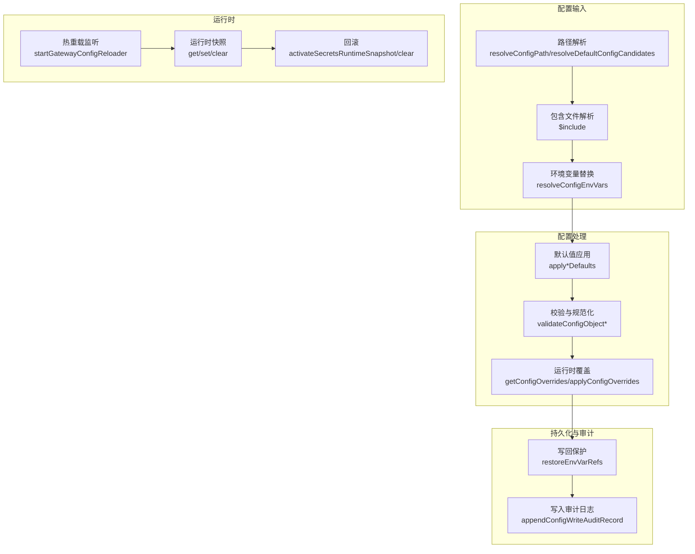
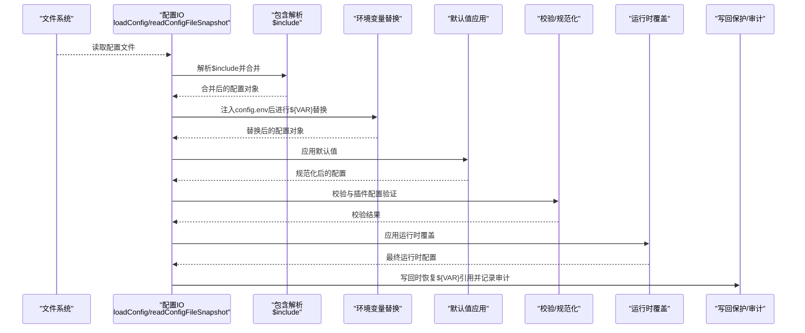
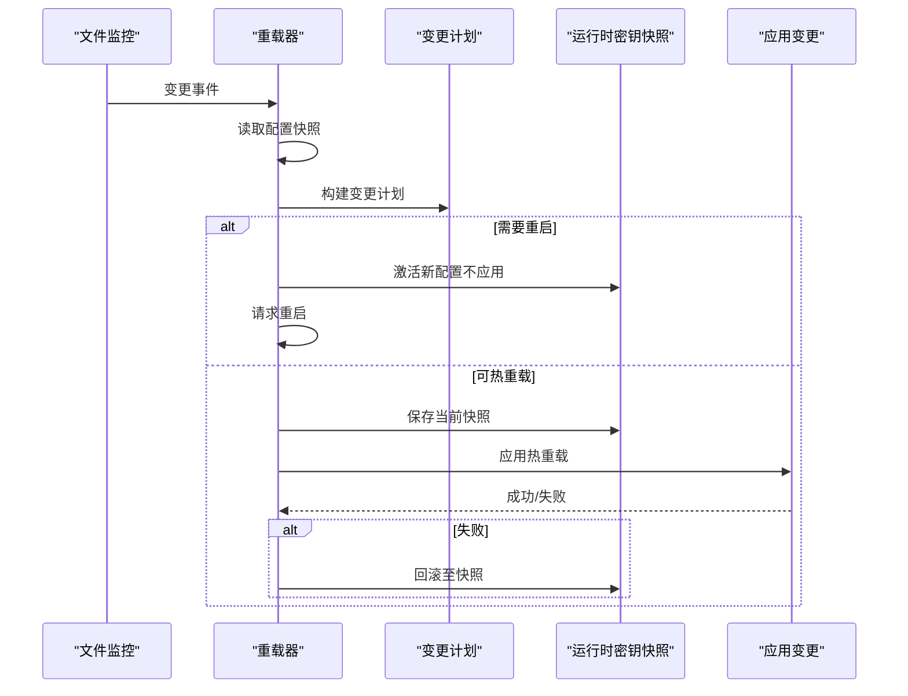
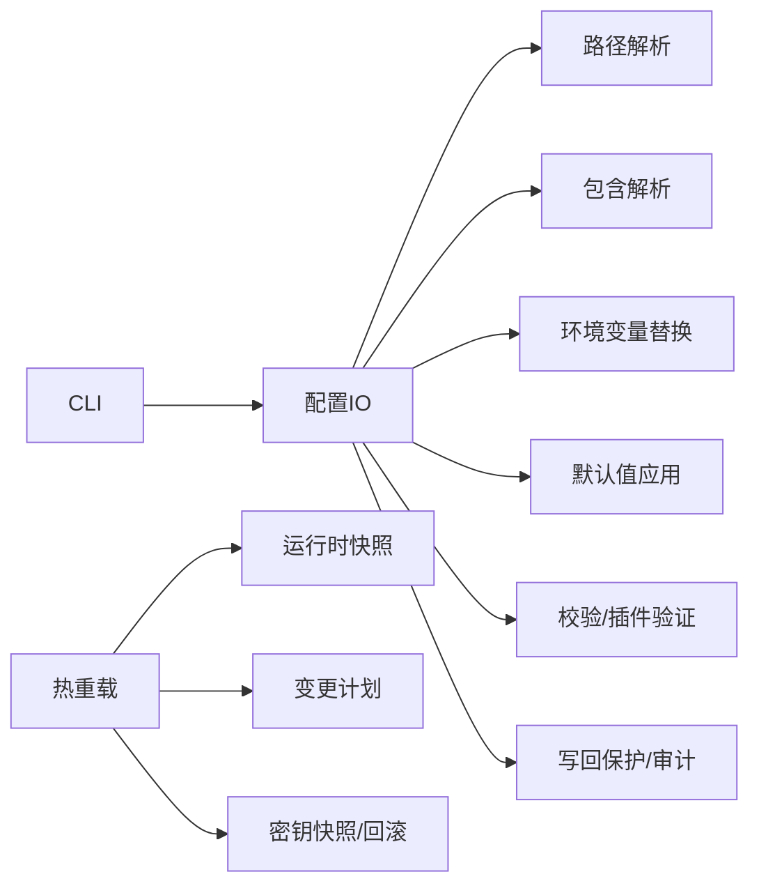

# 运行时配置

<cite>
**本文引用的文件**
- [src/runtime.ts](file://src/runtime.ts)
- [src/config/io.ts](file://src/config/io.ts)
- [src/config/env-substitution.ts](file://src/config/env-substitution.ts)
- [src/config/env-preserve.ts](file://src/config/env-preserve.ts)
- [src/config/includes.ts](file://src/config/includes.ts)
- [src/config/paths.ts](file://src/config/paths.ts)
- [src/config/defaults.ts](file://src/config/defaults.ts)
- [src/config/validation.ts](file://src/config/validation.ts)
- [src/config/runtime-overrides.ts](file://src/config/runtime-overrides.ts)
- [src/config/cache-utils.ts](file://src/config/cache-utils.ts)
- [src/gateway/server.impl.ts](file://src/gateway/server.impl.ts)
- [src/gateway/config-reload.ts](file://src/gateway/config-reload.ts)
- [src/cli/config-cli.ts](file://src/cli/config-cli.ts)
</cite>

## 目录

1. [简介](#简介)
2. [项目结构](#项目结构)
3. [核心组件](#核心组件)
4. [架构总览](#架构总览)
5. [详细组件分析](#详细组件分析)
6. [依赖关系分析](#依赖关系分析)
7. [性能考量](#性能考量)
8. [故障排查指南](#故障排查指南)
9. [结论](#结论)
10. [附录](#附录)

## 简介

本指南聚焦 OpenClaw 的“运行时配置”能力，系统阐述配置加载顺序、优先级规则、合并策略、环境变量注入、热重载、验证与错误处理、运行时更新方法与生效范围、以及配置缓存、快照与回滚机制。目标是帮助开发者与运维人员在不中断服务的前提下安全地管理配置。

## 项目结构

围绕“运行时配置”的关键模块分布如下：

- 配置读取与解析：路径解析、包含文件解析、环境变量替换、默认值应用、校验与规范化
- 运行时注入与覆盖：环境变量注入、运行时覆盖（临时覆盖）、写回保护（保留环境变量引用）
- 热重载与回滚：文件监控、变更检测、重启/热重载决策、运行时快照与回滚
- 缓存与工具：缓存 TTL 解析、文件状态快照

图示来源

- [src/config/paths.ts:118-194](file://src/config/paths.ts#L118-L194)
- [src/config/includes.ts:340-347](file://src/config/includes.ts#L340-L347)
- [src/config/env-substitution.ts:197-203](file://src/config/env-substitution.ts#L197-L203)
- [src/config/defaults.ts:131-532](file://src/config/defaults.ts#L131-L532)
- [src/config/validation.ts:229-286](file://src/config/validation.ts#L229-L286)
- [src/config/runtime-overrides.ts:54-91](file://src/config/runtime-overrides.ts#L54-L91)
- [src/config/env-preserve.ts:89-134](file://src/config/env-preserve.ts#L89-L134)
- [src/gateway/config-reload.ts:141-247](file://src/gateway/config-reload.ts#L141-L247)
- [src/gateway/server.impl.ts:982-1013](file://src/gateway/server.impl.ts#L982-L1013)

章节来源

- [src/config/paths.ts:118-194](file://src/config/paths.ts#L118-L194)
- [src/config/includes.ts:340-347](file://src/config/includes.ts#L340-L347)
- [src/config/env-substitution.ts:197-203](file://src/config/env-substitution.ts#L197-L203)
- [src/config/defaults.ts:131-532](file://src/config/defaults.ts#L131-L532)
- [src/config/validation.ts:229-286](file://src/config/validation.ts#L229-L286)
- [src/config/runtime-overrides.ts:54-91](file://src/config/runtime-overrides.ts#L54-L91)
- [src/config/env-preserve.ts:89-134](file://src/config/env-preserve.ts#L89-L134)
- [src/gateway/config-reload.ts:141-247](file://src/gateway/config-reload.ts#L141-L247)
- [src/gateway/server.impl.ts:982-1013](file://src/gateway/server.impl.ts#L982-L1013)

## 核心组件

- 配置 IO 与缓存
  - 路径解析与候选查找、包含文件解析、环境变量替换、默认值应用、校验、写回保护、写入审计
- 运行时注入与覆盖
  - 环境变量注入、运行时覆盖（临时覆盖）、写回保护（保留环境变量引用）
- 热重载与回滚
  - 文件监控、变更检测、重启/热重载决策、运行时快照与回滚
- CLI 与错误处理
  - CLI 加载与错误输出、退出码控制

章节来源

- [src/config/io.ts:699-800](file://src/config/io.ts#L699-L800)
- [src/config/runtime-overrides.ts:54-91](file://src/config/runtime-overrides.ts#L54-L91)
- [src/gateway/server.impl.ts:982-1013](file://src/gateway/server.impl.ts#L982-L1013)
- [src/cli/config-cli.ts:232-244](file://src/cli/config-cli.ts#L232-L244)

## 架构总览

下图展示从磁盘到运行时配置的整体流程，包括环境变量注入、包含文件合并、默认值与校验、写回保护与审计，以及热重载与回滚。

图示来源

- [src/config/io.ts:708-797](file://src/config/io.ts#L708-L797)
- [src/config/includes.ts:340-347](file://src/config/includes.ts#L340-L347)
- [src/config/env-substitution.ts:197-203](file://src/config/env-substitution.ts#L197-L203)
- [src/config/defaults.ts:131-532](file://src/config/defaults.ts#L131-L532)
- [src/config/validation.ts:229-286](file://src/config/validation.ts#L229-L286)
- [src/config/runtime-overrides.ts:86-91](file://src/config/runtime-overrides.ts#L86-L91)
- [src/config/env-preserve.ts:89-134](file://src/config/env-preserve.ts#L89-L134)

## 详细组件分析

### 配置加载顺序与优先级

- 路径解析优先级
  - 显式路径优先：通过环境变量或参数指定的路径优先
  - 候选路径：按默认候选列表查找已存在的配置文件
  - 回退到规范路径：若无候选存在，则使用规范路径
- 包含文件合并
  - 支持单文件与多文件数组合并，采用深度合并策略；数组拼接、对象递归合并、原始值后者覆盖
- 环境变量注入与替换
  - 先将 config.env 注入进程环境，再对 ${VAR} 进行替换
  - 支持 onMissing 回调收集缺失变量警告而不中断
- 默认值与规范化
  - 按模块顺序应用默认值（消息、会话、模型、代理、日志、上下文修剪、压缩等）
  - 对 Talk 配置进行规范化与 API Key 处理
- 校验与插件验证
  - 使用 Zod Schema 校验基础结构
  - 插件清单加载与配置 schema 校验，兼容未知通道 ID 与心跳目标校验
- 运行时覆盖
  - 在最终配置阶段应用运行时覆盖（临时覆盖），不影响持久化

章节来源

- [src/config/paths.ts:118-194](file://src/config/paths.ts#L118-L194)
- [src/config/includes.ts:69-85](file://src/config/includes.ts#L69-L85)
- [src/config/env-substitution.ts:197-203](file://src/config/env-substitution.ts#L197-L203)
- [src/config/defaults.ts:131-532](file://src/config/defaults.ts#L131-L532)
- [src/config/validation.ts:229-286](file://src/config/validation.ts#L229-L286)
- [src/config/runtime-overrides.ts:86-91](file://src/config/runtime-overrides.ts#L86-L91)

### 环境变量注入与保留

- 注入时机：在解析包含文件之后、替换之前，先应用 config.env 到进程环境
- 替换规则：仅匹配大写格式的环境变量名；支持转义 $${VAR} 输出字面量
- 丢失处理：可选择抛出异常或收集警告并保留占位符
- 写回保护：写回时根据预读取的环境快照，将与当前环境解析一致的值恢复为 ${VAR} 引用，避免凭空写入明文

章节来源

- [src/config/env-substitution.ts:197-203](file://src/config/env-substitution.ts#L197-L203)
- [src/config/env-preserve.ts:89-134](file://src/config/env-preserve.ts#L89-L134)
- [src/config/io.ts:672-692](file://src/config/io.ts#L672-L692)

### 配置合并策略

- 包含文件合并：数组拼接、对象递归合并、原始值后者覆盖
- 运行时覆盖：深合并覆盖，忽略被屏蔽键，避免原型污染
- 写回时剔除路径：支持显式移除某些路径，防止默认化或规范化重新引入

章节来源

- [src/config/includes.ts:69-85](file://src/config/includes.ts#L69-L85)
- [src/config/runtime-overrides.ts:32-44](file://src/config/runtime-overrides.ts#L32-L44)
- [src/config/io.ts:207-294](file://src/config/io.ts#L207-L294)

### 配置验证与错误处理

- 结构校验：基于 Zod Schema 的严格校验，生成带路径与允许值提示的问题
- 插件校验：加载插件清单，校验插件启用/禁用与配置 schema，兼容未知通道与心跳目标
- 错误输出：CLI 中以易读方式输出问题与修复建议，并在失败时退出（非零退出码）

章节来源

- [src/config/validation.ts:229-286](file://src/config/validation.ts#L229-L286)
- [src/config/validation.ts:308-604](file://src/config/validation.ts#L308-L604)
- [src/cli/config-cli.ts:232-244](file://src/cli/config-cli.ts#L232-L244)

### 运行时配置更新与生效范围

- 更新入口
  - CLI：读取快照、格式化问题、必要时退出
  - 网关：文件监控触发，构建变更计划，决定热重载或重启
- 生效范围
  - 热重载：在不中断网关的情况下应用可热重载的变更
  - 重启：当变更要求重启时，先激活新配置但不立即应用，待确认后再请求重启
- 快照与回滚
  - 热重载前保存当前运行时快照，失败时回滚至快照
  - 重启前清理快照，确保干净重启

图示来源

- [src/gateway/config-reload.ts:141-247](file://src/gateway/config-reload.ts#L141-L247)
- [src/gateway/server.impl.ts:982-1013](file://src/gateway/server.impl.ts#L982-L1013)

章节来源

- [src/gateway/config-reload.ts:141-247](file://src/gateway/config-reload.ts#L141-L247)
- [src/gateway/server.impl.ts:982-1013](file://src/gateway/server.impl.ts#L982-L1013)

### 配置缓存、快照与回滚

- 缓存 TTL：支持从环境变量解析缓存 TTL，0 表示禁用
- 文件状态快照：获取文件的 mtime 与大小，用于变更检测
- 运行时快照：保存当前运行时密钥状态，失败时回滚
- 写入审计：记录写入事件、前后哈希、字节变化、可疑行为等，便于审计与排障

章节来源

- [src/config/cache-utils.ts:4-38](file://src/config/cache-utils.ts#L4-L38)
- [src/gateway/server.impl.ts:982-1013](file://src/gateway/server.impl.ts#L982-L1013)

## 依赖关系分析

- 组件耦合
  - 配置 IO 依赖路径解析、包含解析、环境变量替换、默认值、校验与写回保护
  - 热重载依赖配置快照、变更计划、运行时密钥快照与回滚
  - CLI 依赖配置 IO 与错误输出
- 外部依赖
  - 文件系统、JSON5 解析、Chokidar 监控、进程环境变量

图示来源

- [src/config/io.ts:699-800](file://src/config/io.ts#L699-L800)
- [src/gateway/config-reload.ts:141-247](file://src/gateway/config-reload.ts#L141-L247)
- [src/cli/config-cli.ts:232-244](file://src/cli/config-cli.ts#L232-L244)

章节来源

- [src/config/io.ts:699-800](file://src/config/io.ts#L699-L800)
- [src/gateway/config-reload.ts:141-247](file://src/gateway/config-reload.ts#L141-L247)
- [src/cli/config-cli.ts:232-244](file://src/cli/config-cli.ts#L232-L244)

## 性能考量

- 避免不必要的写回：通过写回保护减少明文写入，降低敏感信息泄露风险
- 变更检测：利用变更路径集合与哈希对比，减少无效重载
- 监控抖动：写入完成等待与轮询策略，避免频繁触发重载
- 缓存 TTL：合理设置缓存 TTL，平衡一致性与性能

## 故障排查指南

- 配置无效
  - CLI 会在发现无效配置时打印问题列表与修复建议，并以非零退出码终止
- 环境变量缺失
  - 若未启用 onMissing，缺失变量会直接导致加载失败；可通过 onMissing 收集警告
- 热重载失败
  - 热重载失败时会回滚至快照；检查变更计划与日志，确认是否应改为重启
- 写入审计
  - 查看配置审计日志，定位异常写入、尺寸骤降、元数据缺失、模式移除等问题

章节来源

- [src/cli/config-cli.ts:232-244](file://src/cli/config-cli.ts#L232-L244)
- [src/config/env-substitution.ts:197-203](file://src/config/env-substitution.ts#L197-L203)
- [src/gateway/config-reload.ts:141-247](file://src/gateway/config-reload.ts#L141-L247)
- [src/config/io.ts:541-555](file://src/config/io.ts#L541-L555)

## 结论

OpenClaw 的运行时配置体系以“安全、可控、可观测”为核心设计原则：通过严格的加载顺序与优先级、完善的环境变量注入与保留、稳健的校验与错误处理、灵活的热重载与回滚机制，以及写入审计与缓存工具，实现了在生产环境中安全、高效地管理配置的目标。

## 附录

- 最佳实践
  - 使用 $include 将配置模块化，避免单一文件过大
  - 通过 config.env 注入可变配置，结合运行时覆盖实现临时调整
  - 对敏感字段使用 ${VAR} 引用，写回时自动保留
  - 在变更配置后，优先尝试热重载；若涉及关键子系统，选择重启
  - 定期检查配置审计日志，识别异常写入与潜在风险
