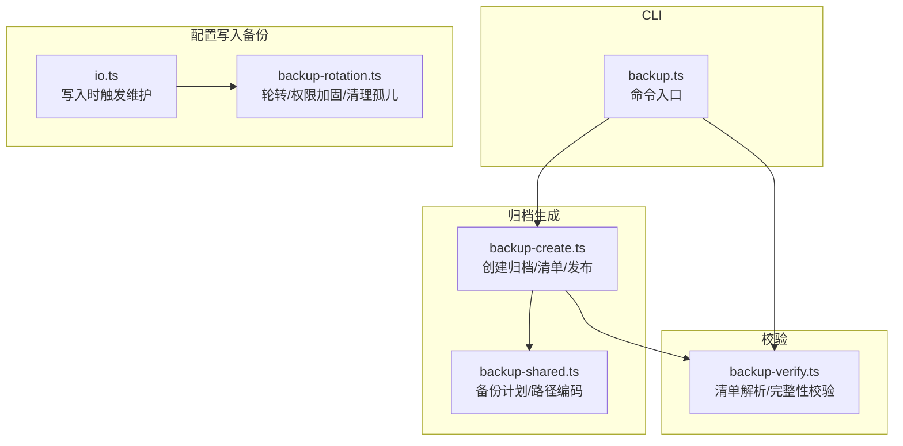
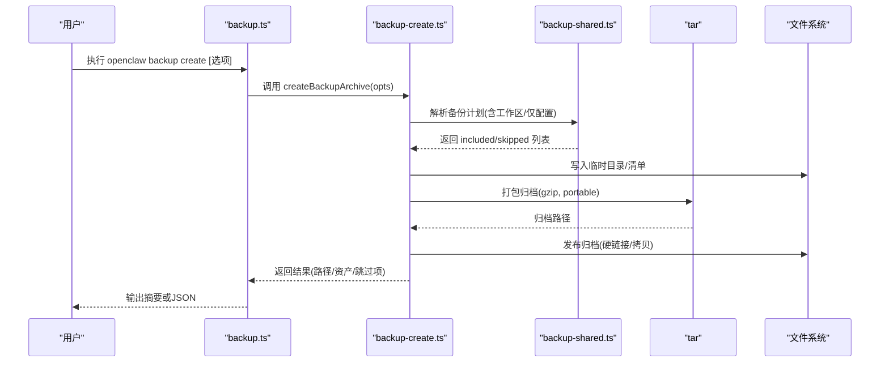
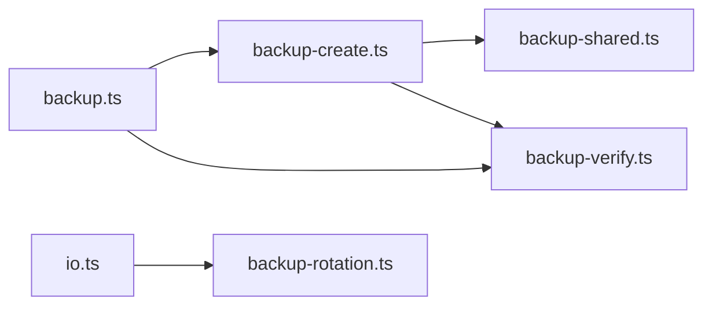

# 配置备份与恢复

<cite>
**本文引用的文件**
- [docs/cli/backup.md](file://docs/cli/backup.md)
- [src/commands/backup.ts](file://src/commands/backup.ts)
- [src/infra/backup-create.ts](file://src/infra/backup-create.ts)
- [src/commands/backup-verify.ts](file://src/commands/backup-verify.ts)
- [src/commands/backup-shared.ts](file://src/commands/backup-shared.ts)
- [src/config/backup-rotation.ts](file://src/config/backup-rotation.ts)
- [src/config/io.ts](file://src/config/io.ts)
- [src/commands/backup.test.ts](file://src/commands/backup.test.ts)
- [src/config/config.backup-rotation.test.ts](file://src/config/config.backup-rotation.test.ts)
</cite>

## 目录

1. [简介](#简介)
2. [项目结构](#项目结构)
3. [核心组件](#核心组件)
4. [架构总览](#架构总览)
5. [详细组件分析](#详细组件分析)
6. [依赖关系分析](#依赖关系分析)
7. [性能考量](#性能考量)
8. [故障排查指南](#故障排查指南)
9. [结论](#结论)
10. [附录](#附录)

## 简介

本指南面向OpenClaw用户与运维人员，系统化阐述配置备份与恢复的策略、流程与最佳实践。内容覆盖：

- 备份策略：范围、频率、存储位置与命名规范
- 备份文件格式：归档结构、清单（manifest）与路径编码
- 完整性校验：验证机制与安全边界
- 恢复流程：从归档提取、版本兼容性与冲突处理
- 迁移与批量：跨环境迁移、批量导入导出与同步建议
- 存储管理与灾难恢复：轮转备份、权限加固与孤儿文件清理

## 项目结构

围绕“备份与恢复”的关键代码分布在以下模块：

- CLI命令层：backup命令入口与参数解析
- 归档生成层：构建归档、清单与输出发布
- 校验层：归档完整性与路径安全检查
- 共享逻辑层：备份资产发现与路径规范化
- 配置写入备份：配置文件写入时的轮转备份与权限加固
- 文档与测试：CLI参考文档、行为测试与轮转备份测试

图表来源

- [src/commands/backup.ts:11-31](file://src/commands/backup.ts#L11-L31)
- [src/infra/backup-create.ts:272-368](file://src/infra/backup-create.ts#L272-L368)
- [src/commands/backup-verify.ts:279-324](file://src/commands/backup-verify.ts#L279-L324)
- [src/commands/backup-shared.ts:106-254](file://src/commands/backup-shared.ts#L106-L254)
- [src/config/backup-rotation.ts:16-125](file://src/config/backup-rotation.ts#L16-L125)
- [src/config/io.ts:1256-1301](file://src/config/io.ts#L1256-L1301)

章节来源

- [docs/cli/backup.md:9-77](file://docs/cli/backup.md#L9-L77)
- [src/commands/backup.ts:11-31](file://src/commands/backup.ts#L11-L31)
- [src/infra/backup-create.ts:272-368](file://src/infra/backup-create.ts#L272-L368)
- [src/commands/backup-verify.ts:279-324](file://src/commands/backup-verify.ts#L279-L324)
- [src/commands/backup-shared.ts:106-254](file://src/commands/backup-shared.ts#L106-L254)
- [src/config/backup-rotation.ts:16-125](file://src/config/backup-rotation.ts#L16-L125)
- [src/config/io.ts:1256-1301](file://src/config/io.ts#L1256-L1301)

## 核心组件

- 备份创建命令：负责解析选项、调用归档生成并可选执行校验
- 归档生成器：构建清单、打包归档、发布到目标路径
- 归档校验器：解析清单、校验路径合法性与完整性
- 备份共享逻辑：发现备份资产、去重、路径规范化与编码
- 配置写入备份：在写入配置文件时自动维护轮转备份、权限加固与孤儿清理
- CLI参考文档：定义默认行为、输出位置、工作区包含策略与验证规则

章节来源

- [src/commands/backup.ts:11-31](file://src/commands/backup.ts#L11-L31)
- [src/infra/backup-create.ts:272-368](file://src/infra/backup-create.ts#L272-L368)
- [src/commands/backup-verify.ts:279-324](file://src/commands/backup-verify.ts#L279-L324)
- [src/commands/backup-shared.ts:106-254](file://src/commands/backup-shared.ts#L106-L254)
- [src/config/backup-rotation.ts:16-125](file://src/config/backup-rotation.ts#L16-L125)
- [docs/cli/backup.md:9-77](file://docs/cli/backup.md#L9-L77)

## 架构总览

下图展示从CLI到归档生成、清单构建与发布的端到端流程，并标注校验环节。

图表来源

- [src/commands/backup.ts:11-31](file://src/commands/backup.ts#L11-L31)
- [src/infra/backup-create.ts:272-368](file://src/infra/backup-create.ts#L272-L368)
- [src/commands/backup-shared.ts:106-254](file://src/commands/backup-shared.ts#L106-L254)

## 详细组件分析

### 备份创建命令与流程

- 命令入口负责解析选项（输出目录、是否仅配置、是否包含工作区、是否验证、是否干跑、是否JSON输出），调用归档生成器并按需执行校验，最后以人类可读或JSON格式输出结果。
- 关键行为：
  - 支持仅备份配置文件（--only-config）
  - 支持不包含工作区（--no-include-workspace）
  - 支持干跑预览（--dry-run）
  - 支持创建后立即验证（--verify）

章节来源

- [src/commands/backup.ts:11-31](file://src/commands/backup.ts#L11-L31)
- [docs/cli/backup.md:13-32](file://docs/cli/backup.md#L13-L32)

### 归档生成器与清单

- 清单字段包括：schemaVersion、createdAt、archiveRoot、runtimeVersion、platform、nodeVersion、选项、路径集合、资产列表、跳过项等。
- 归档布局：
  - 根目录为时间戳命名的归档根
  - payload目录存放所有源路径的编码映射
  - manifest.json位于归档根下，记录完整清单
- 路径编码：
  - 绝对路径在POSIX风格下编码为相对路径；Windows盘符转换为windows/{驱动器}/...；其他相对路径编码为relative/...
- 输出发布：
  - 优先尝试硬链接发布；若平台不支持则回退为排他拷贝；拒绝覆盖已存在文件

章节来源

- [src/infra/backup-create.ts:18-76](file://src/infra/backup-create.ts#L18-L76)
- [src/infra/backup-create.ts:190-231](file://src/infra/backup-create.ts#L190-L231)
- [src/commands/backup-shared.ts:60-84](file://src/commands/backup-shared.ts#L60-L84)
- [src/infra/backup-create.ts:134-168](file://src/infra/backup-create.ts#L134-L168)

### 备份共享逻辑：资产发现与去重

- 资产来源：
  - 状态目录（state）
  - 配置文件（config）
  - 凭据目录（credentials）
  - 工作区目录（workspace，可选）
- 去重与覆盖：
  - 对候选路径进行规范化与去重
  - 若某候选被已包含路径完全覆盖，则标记为“covered”并跳过
- 仅配置模式：
  - 快速返回配置文件资产，忽略工作区与状态/凭据的发现

章节来源

- [src/commands/backup-shared.ts:106-254](file://src/commands/backup-shared.ts#L106-L254)

### 归档校验器

- 校验步骤：
  - 列举归档条目并标准化路径，拒绝空路径、绝对路径、反斜杠、路径遍历与重复条目
  - 精确匹配且仅允许一个根级manifest.json
  - 校验archiveRoot合法性与manifest中声明的资产均存在于归档内
- 输出：
  - 成功时输出归档路径、根目录、创建时间、运行时版本、资产数与扫描条目数

章节来源

- [src/commands/backup-verify.ts:279-324](file://src/commands/backup-verify.ts#L279-L324)
- [src/commands/backup-verify.ts:97-171](file://src/commands/backup-verify.ts#L97-L171)
- [src/commands/backup-verify.ts:223-253](file://src/commands/backup-verify.ts#L223-L253)

### 配置写入时的备份维护

- 维护流程顺序：轮转备份 → 创建新主备份 → 权限加固 → 清理孤儿备份
- 轮转备份：最多保留N个备份（默认5），旧备份依次向更高索引移动
- 权限加固：确保所有.bak与.bak.N文件仅属主可读（0o600）
- 孤儿清理：删除不在轮转范围内的.bak.\*文件
- 触发时机：在写入配置文件成功后，若原配置存在则执行维护

章节来源

- [src/config/backup-rotation.ts:16-125](file://src/config/backup-rotation.ts#L16-L125)
- [src/config/io.ts:1256-1301](file://src/config/io.ts#L1256-L1301)

### 备份文件格式、加密与完整性校验

- 格式：归档为gzip压缩的tar包，包含manifest.json与payload目录
- 完整性校验：通过校验器对清单与归档条目进行严格路径与存在性检查
- 加密：未内置加密；如需加密，请在外部使用加密工具对归档文件进行加密
- 完整性保障：清单记录每个资产的源路径与归档路径，校验器确保二者一一对应且未被篡改

章节来源

- [src/infra/backup-create.ts:345-360](file://src/infra/backup-create.ts#L345-L360)
- [src/commands/backup-verify.ts:223-253](file://src/commands/backup-verify.ts#L223-L253)

### 备份策略、频率与存储位置

- 策略要点：
  - 增量与全量：OpenClaw提供全量归档能力；如需增量，建议结合外部工具实现
  - 仅配置备份：--only-config用于快速备份配置文件，跳过工作区与状态/凭据
  - 包含工作区：默认包含，可通过--no-include-workspace禁用
- 频率建议：
  - 开发/测试：每次重大配置变更后备份
  - 生产：每日/每周全量备份，配合仅配置备份作为高频快照
- 存储位置：
  - 默认输出为当前工作目录下的时间戳归档；若当前目录位于源树内，则回退到用户家目录
  - 不允许输出路径位于任一源路径内部，避免自包含
  - 输出文件永不覆盖，防止意外丢失

章节来源

- [docs/cli/backup.md:13-32](file://docs/cli/backup.md#L13-L32)
- [src/infra/backup-create.ts:78-111](file://src/infra/backup-create.ts#L78-L111)
- [src/infra/backup-create.ts:295-303](file://src/infra/backup-create.ts#L295-L303)

### 配置恢复流程、版本兼容性与冲突处理

- 恢复流程：
  - 使用校验器验证归档完整性
  - 将归档中的payload解压至目标位置
  - 恢复顺序建议：先恢复配置文件，再恢复凭据与工作区，最后恢复状态目录
- 版本兼容性：
  - 归档包含runtimeVersion与nodeVersion，便于对比环境差异
  - 如遇不兼容，优先在兼容环境中恢复，再进行必要的配置调整
- 冲突处理：
  - 若目标路径已存在同名资产，应先备份现有文件，再进行替换
  - 使用校验器确认恢复后的清单一致性

章节来源

- [src/commands/backup-verify.ts:312-320](file://src/commands/backup-verify.ts#L312-L320)
- [docs/cli/backup.md:23-32](file://docs/cli/backup.md#L23-L32)

### 配置迁移、批量导入导出与同步

- 迁移建议：
  - 在新环境中先恢复配置文件，再逐步恢复凭据与工作区
  - 使用--only-config进行快速迁移，随后按需恢复工作区
- 批量导入导出：
  - 通过归档的manifest.json定位资产，批量复制payload中的文件
  - 注意路径编码规则，确保POSIX/Windows路径正确映射
- 同步方法：
  - 将归档作为“快照源”，在多节点间同步payload与配置
  - 结合版本控制工具对配置文件进行变更追踪

章节来源

- [src/commands/backup-shared.ts:68-84](file://src/commands/backup-shared.ts#L68-L84)
- [src/infra/backup-create.ts:190-231](file://src/infra/backup-create.ts#L190-L231)

### 存储管理与灾难恢复

- 存储管理：
  - 使用轮转备份保持最近N次配置快照
  - 权限加固确保备份文件仅属主可读
  - 清理孤儿备份，避免磁盘占用
- 灾难恢复：
  - 优先使用最近一次.bak；若损坏，回退到.bak.1, .bak.2, ...
  - 恢复前先验证归档完整性
  - 恢复后重新应用权限与所有权

章节来源

- [src/config/backup-rotation.ts:16-125](file://src/config/backup-rotation.ts#L16-L125)
- [src/config/config.backup-rotation.test.ts:17-134](file://src/config/config.backup-rotation.test.ts#L17-L134)

## 依赖关系分析

图表来源

- [src/commands/backup.ts:11-31](file://src/commands/backup.ts#L11-L31)
- [src/infra/backup-create.ts:272-368](file://src/infra/backup-create.ts#L272-L368)
- [src/commands/backup-shared.ts:106-254](file://src/commands/backup-shared.ts#L106-L254)
- [src/commands/backup-verify.ts:279-324](file://src/commands/backup-verify.ts#L279-L324)
- [src/config/io.ts:1256-1301](file://src/config/io.ts#L1256-L1301)
- [src/config/backup-rotation.ts:16-125](file://src/config/backup-rotation.ts#L16-L125)

章节来源

- [src/commands/backup.ts:11-31](file://src/commands/backup.ts#L11-L31)
- [src/infra/backup-create.ts:272-368](file://src/infra/backup-create.ts#L272-L368)
- [src/commands/backup-verify.ts:279-324](file://src/commands/backup-verify.ts#L279-L324)
- [src/commands/backup-shared.ts:106-254](file://src/commands/backup-shared.ts#L106-L254)
- [src/config/backup-rotation.ts:16-125](file://src/config/backup-rotation.ts#L16-L125)
- [src/config/io.ts:1256-1301](file://src/config/io.ts#L1256-L1301)

## 性能考量

- 大型工作区是归档体积的主要来源；如需更快/更小的备份，使用--no-include-workspace或--only-config
- 验证会扫描整个归档，建议在CI中按需启用
- 输出发布优先硬链接，不支持硬链接时回退拷贝；在跨设备/网络存储上注意I/O开销

章节来源

- [docs/cli/backup.md:63-77](file://docs/cli/backup.md#L63-L77)

## 故障排查指南

- 归档为空或缺失清单
  - 检查归档是否包含且仅包含一个根级manifest.json
  - 确认archiveRoot合法且资产路径均在payload根之下
- 路径遍历或非法路径
  - 校验器会拒绝绝对路径、反斜杠、..段与解析到根外的路径
- 输出覆盖保护
  - 若目标文件已存在，发布阶段会抛错；请更换输出路径或删除已有文件
- 仅配置备份失败
  - 当配置文件不存在时，仅配置备份会直接跳过；请确认OPENCLAW_CONFIG_PATH或配置路径
- 配置写入后备份异常
  - 检查.bak与.bak.N权限是否为0o600；确认轮转与孤儿清理流程正常执行

章节来源

- [src/commands/backup-verify.ts:279-324](file://src/commands/backup-verify.ts#L279-L324)
- [src/infra/backup-create.ts:113-124](file://src/infra/backup-create.ts#L113-L124)
- [src/commands/backup.test.ts:411-434](file://src/commands/backup.test.ts#L411-L434)
- [src/config/backup-rotation.ts:44-62](file://src/config/backup-rotation.ts#L44-L62)
- [src/config/config.backup-rotation.test.ts:77-107](file://src/config/config.backup-rotation.test.ts#L77-L107)

## 结论

OpenClaw提供了完整的本地备份与恢复能力：全量归档、清单校验、路径安全与权限加固。通过合理的备份策略（仅配置/工作区/全量）、定期轮转与严格的完整性校验，可在大多数场景下实现可靠的配置迁移与灾难恢复。对于高安全性需求，建议在外部对归档文件进行加密处理。

## 附录

- CLI参考：参见文档中的命令示例与行为说明
- 测试参考：包含仅配置备份、轮转备份与孤儿清理的行为测试

章节来源

- [docs/cli/backup.md:9-77](file://docs/cli/backup.md#L9-L77)
- [src/commands/backup.test.ts:411-434](file://src/commands/backup.test.ts#L411-L434)
- [src/config/config.backup-rotation.test.ts:17-134](file://src/config/config.backup-rotation.test.ts#L17-L134)
