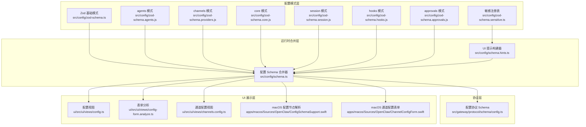
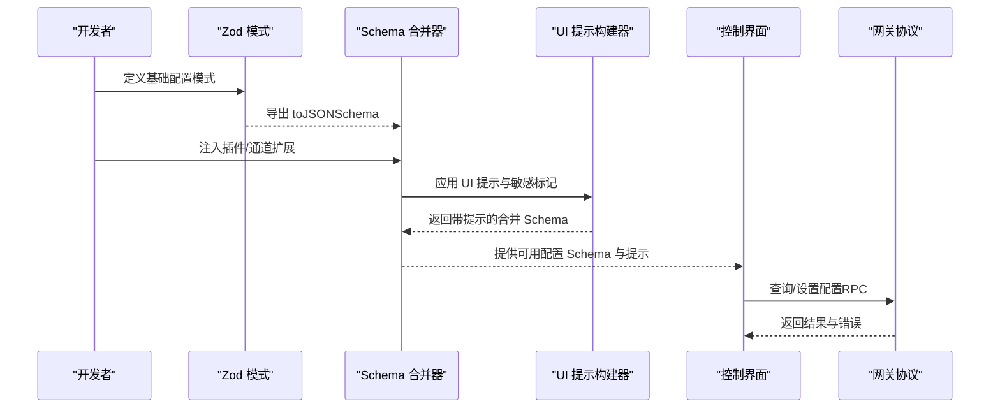
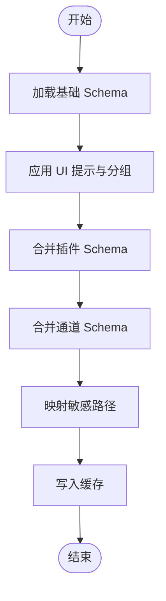
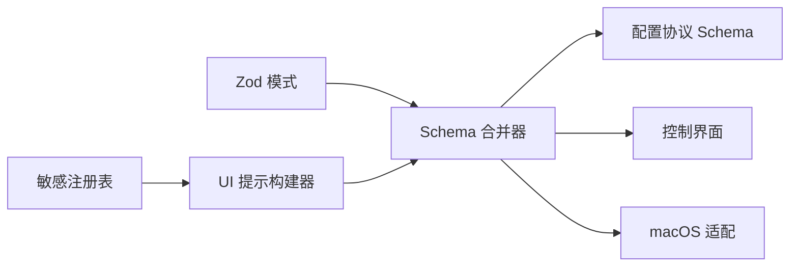

# 配置文件结构

<cite>
**本文档引用的文件**
- [src/config/zod-schema.ts](file://src/config/zod-schema.ts)
- [src/config/schema.ts](file://src/config/schema.ts)
- [src/config/schema.hints.ts](file://src/config/schema.hints.ts)
- [src/gateway/protocol/schema/config.ts](file://src/gateway/protocol/schema/config.ts)
- [src/config/zod-schema.agents.js](file://src/config/zod-schema.agents.js)
- [src/config/zod-schema.providers.js](file://src/config/zod-schema.providers.js)
- [src/config/zod-schema.core.js](file://src/config/zod-schema.core.js)
- [src/config/zod-schema.session.js](file://src/config/zod-schema.session.js)
- [src/config/zod-schema.hooks.js](file://src/config/zod-schema.hooks.js)
- [src/config/zod-schema.approvals.js](file://src/config/zod-schema.approvals.js)
- [src/config/zod-schema.agent-model.ts](file://src/config/zod-schema.agent-model.ts)
- [src/config/zod-schema.sensitive.ts](file://src/config/zod-schema.sensitive.ts)
- [src/commands/configure.gateway-auth.ts](file://src/commands/configure.gateway-auth.ts)
- [src/secrets/runtime-config-collectors-core.ts](file://src/secrets/runtime-config-collectors-core.ts)
- [ui/src/ui/views/config.ts](file://ui/src/ui/views/config.ts)
- [ui/src/ui/views/config-form.analyze.ts](file://ui/src/ui/views/config-form.analyze.ts)
- [ui/src/ui/views/channels.config.ts](file://ui/src/ui/views/channels.config.ts)
- [apps/macos/Sources/OpenClaw/ConfigSchemaSupport.swift](file://apps/macos/Sources/OpenClaw/ConfigSchemaSupport.swift)
- [apps/macos/Sources/OpenClaw/ChannelConfigForm.swift](file://apps/macos/Sources/OpenClaw/ChannelConfigForm.swift)
- [docs/reference/AGENTS.default.md](file://docs/reference/AGENTS.default.md)
</cite>

## 目录

1. [简介](#简介)
2. [项目结构](#项目结构)
3. [核心组件](#核心组件)
4. [架构总览](#架构总览)
5. [详细组件分析](#详细组件分析)
6. [依赖关系分析](#依赖关系分析)
7. [性能考量](#性能考量)
8. [故障排查指南](#故障排查指南)
9. [结论](#结论)
10. [附录](#附录)

## 简介

本文件系统性梳理 OpenClaw 配置文件的结构与规范，覆盖以下方面：

- 配置文件的层级结构、字段定义、数据类型与默认值
- 核心模块（gateway、channels、agents、security 等）的配置格式与约束
- JSON Schema 定义、字段约束与验证规则
- 完整配置示例与注释说明，帮助开发者快速理解每个配置项的作用与取值范围

## 项目结构

OpenClaw 的配置体系由“Zod 模式 + 运行时合并 + UI 提示 + 协议 Schema”构成：

- Zod 模式：定义配置的结构、类型、默认值与校验逻辑
- 运行时合并：将插件与通道扩展的配置 Schema 合并到基础 Schema 中
- UI 提示：为控制界面生成标签、帮助文本、敏感标记与排序
- 协议 Schema：用于网关与客户端之间的配置查询、设置与应用流程

图表来源

- [src/config/zod-schema.ts:1-911](file://src/config/zod-schema.ts#L1-L911)
- [src/config/schema.ts:1-712](file://src/config/schema.ts#L1-L712)
- [src/config/schema.hints.ts:1-239](file://src/config/schema.hints.ts#L1-L239)
- [src/gateway/protocol/schema/config.ts:1-101](file://src/gateway/protocol/schema/config.ts#L1-L101)
- [ui/src/ui/views/config.ts:405-420](file://ui/src/ui/views/config.ts#L405-L420)
- [ui/src/ui/views/config-form.analyze.ts:1-40](file://ui/src/ui/views/config-form.analyze.ts#L1-L40)
- [ui/src/ui/views/channels.config.ts:1-116](file://ui/src/ui/views/channels.config.ts#L1-L116)
- [apps/macos/Sources/OpenClaw/ConfigSchemaSupport.swift:62-102](file://apps/macos/Sources/OpenClaw/ConfigSchemaSupport.swift#L62-L102)
- [apps/macos/Sources/OpenClaw/ChannelConfigForm.swift:348-363](file://apps/macos/Sources/OpenClaw/ChannelConfigForm.swift#L348-L363)

章节来源

- [src/config/zod-schema.ts:1-911](file://src/config/zod-schema.ts#L1-L911)
- [src/config/schema.ts:1-712](file://src/config/schema.ts#L1-L712)
- [src/config/schema.hints.ts:1-239](file://src/config/schema.hints.ts#L1-L239)

## 核心组件

- 基础配置模式（Zod）
  - 定义顶层键：meta、env、wizard、diagnostics、logging、cli、update、browser、ui、secrets、auth、acp、models、nodeHost、agents、tools、bindings、broadcast、audio、media、messages、commands、approvals、session、cron、hooks、web、channels、discovery、canvasHost、talk、gateway 等
  - 通过严格对象与联合类型确保字段存在性、类型一致性与取值范围
- 运行时 Schema 合并
  - 将插件与通道的自定义配置 Schema 合并入基础 Schema，并保留 UI 提示与敏感标记
  - 支持缓存以提升性能
- UI 提示与敏感标记
  - 自动识别敏感路径（如 token、password、secret 等），并为 UI 提供标签、帮助文本、排序与高级/占位符提示
- 协议 Schema
  - 定义配置获取、设置、应用、补丁、Schema 查询等 RPC 参数与返回结构

章节来源

- [src/config/zod-schema.ts:206-800](file://src/config/zod-schema.ts#L206-L800)
- [src/config/schema.ts:449-484](file://src/config/schema.ts#L449-L484)
- [src/config/schema.hints.ts:124-146](file://src/config/schema.hints.ts#L124-L146)
- [src/gateway/protocol/schema/config.ts:10-101](file://src/gateway/protocol/schema/config.ts#L10-L101)

## 架构总览

下图展示从配置模式到运行时合并、UI 展示与协议交互的端到端流程。

图表来源

- [src/config/zod-schema.ts:1-911](file://src/config/zod-schema.ts#L1-L911)
- [src/config/schema.ts:449-484](file://src/config/schema.ts#L449-L484)
- [src/config/schema.hints.ts:124-146](file://src/config/schema.hints.ts#L124-L146)
- [src/gateway/protocol/schema/config.ts:10-101](file://src/gateway/protocol/schema/config.ts#L10-L101)

## 详细组件分析

### 1) 基础配置模式（Zod）

- 顶层键与默认值
  - meta.lastTouchedVersion/lastTouchedAt：记录最后编辑版本与时间戳（支持字符串或数字时间戳）
  - env.shellEnv.enabled/timeoutMs：启用/限制子进程环境变量注入
  - wizard.lastRunAt/lastRunVersion/lastRunCommit/lastRunCommand/lastRunMode：向导运行状态
  - diagnostics.enabled/flags/stuckSessionWarnMs/otel/\*：诊断开关与遥测配置
  - logging.level/file/maxFileBytes/consoleLevel/consoleStyle/redactSensitive/redactPatterns：日志级别与脱敏策略
  - cli.banner.taglineMode：CLI 标语模式
  - update.channel/checkOnStart/auto.\*：更新渠道与自动更新策略
  - browser.\*：浏览器/CDP/SSRF 策略、配置文件、代理绑定等
  - ui.seamColor/assistant.name/avatar：界面配色与助手头像
  - secrets.\*：密钥管理策略
  - auth.profiles[*].provider/mode/email 与 order/cooldowns：认证配置与冷却策略
  - acp.\*：ACp 会话派发、后端、默认代理、并发、流式传输参数
  - models.\*：模型提供者与选择策略
  - nodeHost.browserProxy.\*：节点主机浏览器代理
  - agents.\*：多智能体工作区、身份、心跳、路由等
  - tools.\*：工具清单与运行时
  - bindings.\*：消息路由绑定
  - broadcast.\*：广播策略
  - audio.\*：音频输入输出
  - media.preserveFilenames/ttlHours：媒体文件保留策略
  - messages.\*：消息处理策略
  - commands.\*：命令执行策略
  - approvals.\*：审批策略
  - session.\*：会话生命周期与发送策略
  - cron.\*：定时任务、重试、告警与回传
  - hooks.\*：钩子映射、Gmail、内部钩子
  - web.enabled/heartbeatSeconds/reconnect.\*：Web 心跳与重连
  - channels.\*：各通道配置（见下一节）
  - discovery.wideArea/mdns.mode：发现策略
  - canvasHost.\*：Canvas 主机
  - talk.\*：语音合成提供者与参数
  - gateway.\*：网关端口、绑定、控制 UI、鉴权、远程、TLS、HTTP 端点、节点等

- 关键类型与约束
  - 字段类型：字符串、布尔、数值、数组、对象、联合类型、严格对象
  - 默认值：多数字段使用 optional() 并在运行时赋予默认值
  - 取值范围：枚举、正数/非负数、长度限制、URL 协议限定、IPv4/IPv6 等
  - 自定义校验：超时、大小、时长解析、provider 与 providers 匹配等

章节来源

- [src/config/zod-schema.ts:206-800](file://src/config/zod-schema.ts#L206-L800)

### 2) 插件与通道扩展（Schema 合并与 UI 提示）

- 合并策略
  - 插件 entries.\*：将插件定义的 config 子 Schema 与基础 Schema 合并，支持对象属性合并与 additionalProperties 处理
  - 通道 channels.\*：按通道 ID 合并各自 configSchema，支持对象合并与克隆
  - 缓存：基于插件与通道元数据的哈希缓存合并后的 Schema，避免重复计算
- UI 提示
  - 分组标签与顺序：GROUP_LABELS 与 GROUP_ORDER
  - 字段标签、帮助文本、占位符：FIELD_LABELS、FIELD_HELP、FIELD_PLACEHOLDERS
  - 敏感标记：isSensitiveConfigPath 与 mapSensitivePaths，结合敏感注册表
  - 心跳目标提示：根据已知通道动态生成提示

图表来源

- [src/config/schema.ts:449-484](file://src/config/schema.ts#L449-L484)
- [src/config/schema.hints.ts:124-146](file://src/config/schema.hints.ts#L124-L146)
- [src/config/schema.hints.ts:183-233](file://src/config/schema.hints.ts#L183-L233)

章节来源

- [src/config/schema.ts:285-350](file://src/config/schema.ts#L285-L350)
- [src/config/schema.ts:449-484](file://src/config/schema.ts#L449-L484)
- [src/config/schema.hints.ts:124-146](file://src/config/schema.hints.ts#L124-L146)
- [src/config/schema.hints.ts:183-233](file://src/config/schema.hints.ts#L183-L233)

### 3) 网关配置（gateway）

- 端口与绑定
  - port：正整数，默认按需分配
  - bind：枚举（auto、lan、loopback、custom、tailnet）
  - customBindHost：自定义绑定地址
- 控制 UI
  - basePath/root/allowedOrigins/dangerouslyAllow.../allowInsecureAuth/dangerouslyDisableDeviceAuth
- 鉴权
  - mode：枚举（none、token、password、trusted-proxy）
  - token/password：SecretInput，注册敏感
  - allowTailscale：布尔
  - rateLimit：最大尝试次数、窗口与封禁时长
  - trustedProxy：userHeader 必填；可选 requiredHeaders、allowUsers
- 代理与 IP
  - trustedProxies：允许的代理列表
  - allowRealIpFallback：回退到真实 IP
- 工具策略
  - tools.deny/allow：工具白黑名单
- 健康检查
  - channelHealthCheckMinutes：通道健康检查周期
- Tailscale
  - mode：off、serve、funnel；resetOnExit
- 远程连接
  - url/transport/token/password/tlsFingerprint/sshTarget/sshIdentity
- 重启策略
  - reload.mode：off、restart、hot、hybrid；debounceMs
- TLS
  - enabled/autoGenerate/certPath/keyPath/caPath
- HTTP 端点
  - chatCompletions/responses 的启用、大小限制、图片/文件/URL 获取策略
- 节点
  - browser.mode：auto、manual、off；node

章节来源

- [src/config/zod-schema.ts:621-800](file://src/config/zod-schema.ts#L621-L800)
- [src/commands/configure.gateway-auth.ts:40-76](file://src/commands/configure.gateway-auth.ts#L40-L76)
- [src/secrets/runtime-config-collectors-core.ts:245-276](file://src/secrets/runtime-config-collectors-core.ts#L245-L276)

### 4) 通道配置（channels）

- 结构
  - channels.<channelId>：每个通道拥有独立的配置对象
  - 通道 UI 元数据：id、label、description、configSchema、configUiHints
- 合并机制
  - 将通道提供的 configSchema 与基础 Schema 合并，支持对象属性合并与通配符 schema
- UI 展示
  - 控制界面按通道渲染配置表单，支持额外字段（如 groupPolicy、streamMode、dmPolicy）展示

章节来源

- [src/config/schema.ts:326-350](file://src/config/schema.ts#L326-L350)
- [ui/src/ui/views/channels.config.ts:85-116](file://ui/src/ui/views/channels.config.ts#L85-L116)
- [apps/macos/Sources/OpenClaw/ChannelConfigForm.swift:348-363](file://apps/macos/Sources/OpenClaw/ChannelConfigForm.swift#L348-L363)

### 5) 智能体配置（agents）

- 默认工作区
  - agents.defaults.workspace：默认工作区目录（支持 ~）
- 多智能体与路由
  - agents.list[]：智能体列表，含 id、workspace、heartbeat 等
  - bindings：消息路由绑定，按 agentId 与匹配条件分发
- 示例参考
  - AGENTS.default.md 提供默认个人助理模板与启用建议

章节来源

- [docs/reference/AGENTS.default.md:1-125](file://docs/reference/AGENTS.default.md#L1-L125)
- [src/config/zod-schema.agents.js:1-200](file://src/config/zod-schema.agents.js#L1-L200)

### 6) 安全与鉴权（security）

- 敏感字段识别
  - isSensitiveConfigPath：基于后缀白名单与正则模式识别敏感路径
  - mapSensitivePaths：递归遍历 Zod 模式，为敏感字段打上 sensitive 标记
- 运行时收集
  - runtime-config-collectors-core.ts：对 gateway.remote.token/password 等进行敏感赋值
- 网关鉴权模式
  - token/password/trusted-proxy：分别对应 SecretInput 与受保护的 trustedProxy.userHeader
  - rateLimit：防爆破策略

章节来源

- [src/config/schema.hints.ts:120-122](file://src/config/schema.hints.ts#L120-L122)
- [src/config/schema.hints.ts:183-233](file://src/config/schema.hints.ts#L183-L233)
- [src/secrets/runtime-config-collectors-core.ts:245-276](file://src/secrets/runtime-config-collectors-core.ts#L245-L276)
- [src/commands/configure.gateway-auth.ts:40-76](file://src/commands/configure.gateway-auth.ts#L40-L76)

### 7) 协议与 Schema 查询（Config Protocol）

- 参数与返回
  - ConfigGetParamsSchema、ConfigSetParamsSchema、ConfigApplyParamsSchema、ConfigPatchParamsSchema
  - ConfigSchemaParamsSchema、ConfigSchemaLookupParamsSchema
  - ConfigUiHintSchema、ConfigSchemaResponseSchema、ConfigSchemaLookupChildSchema、ConfigSchemaLookupResultSchema
- 路径解析
  - 支持路径规范化、通配符、数组索引与嵌套属性访问
  - 仅返回受支持的关键字（字符串/数字/布尔/枚举/常量）

章节来源

- [src/gateway/protocol/schema/config.ts:10-101](file://src/gateway/protocol/schema/config.ts#L10-L101)
- [src/config/schema.ts:678-712](file://src/config/schema.ts#L678-L712)

### 8) UI 与平台适配

- Web 控制台
  - config.ts：根据 schema 生成可用分组与额外 section，支持表单不安全检测
  - config-form.analyze.ts：分析 schema 支持度，标准化枚举与元信息
- macOS
  - ConfigSchemaSupport.swift：解析 JSON Schema 的 properties/anyOf/oneOf/literalValue 等
  - ChannelConfigForm.swift：按通道 ID 渲染配置表单

章节来源

- [ui/src/ui/views/config.ts:405-420](file://ui/src/ui/views/config.ts#L405-L420)
- [ui/src/ui/views/config-form.analyze.ts:1-40](file://ui/src/ui/views/config-form.analyze.ts#L1-L40)
- [apps/macos/Sources/OpenClaw/ConfigSchemaSupport.swift:62-102](file://apps/macos/Sources/OpenClaw/ConfigSchemaSupport.swift#L62-L102)
- [apps/macos/Sources/OpenClaw/ChannelConfigForm.swift:348-363](file://apps/macos/Sources/OpenClaw/ChannelConfigForm.swift#L348-L363)

## 依赖关系分析

- 组件耦合
  - Zod 模式是配置的权威来源，被运行时合并器与协议层广泛依赖
  - schema.hints.ts 与 zod-schema.sensitive.ts 协同决定 UI 提示与敏感标记
  - schema.ts 在运行时动态合并插件与通道扩展，形成最终 Schema
- 外部依赖
  - 类型系统：Zod（严格对象、联合、自定义校验）
  - 协议：TypeBox（网关配置协议）
  - 平台：Swift（macOS 配置节点解析）

图表来源

- [src/config/zod-schema.ts:1-911](file://src/config/zod-schema.ts#L1-L911)
- [src/config/schema.ts:449-484](file://src/config/schema.ts#L449-L484)
- [src/config/schema.hints.ts:124-146](file://src/config/schema.hints.ts#L124-L146)
- [src/gateway/protocol/schema/config.ts:10-101](file://src/gateway/protocol/schema/config.ts#L10-L101)

章节来源

- [src/config/zod-schema.ts:1-911](file://src/config/zod-schema.ts#L1-L911)
- [src/config/schema.ts:449-484](file://src/config/schema.ts#L449-L484)
- [src/config/schema.hints.ts:124-146](file://src/config/schema.hints.ts#L124-L146)

## 性能考量

- Schema 合并缓存
  - 使用哈希键缓存合并结果，限制最大缓存条目，避免重复计算
- 路径查找优化
  - 限制最大路径段数，仅提取受支持的 JSON Schema 关键字，减少 UI 渲染负担
- UI 渲染
  - 控制台仅暴露必要字段，隐藏 $schema，避免表单冗余

章节来源

- [src/config/schema.ts:352-406](file://src/config/schema.ts#L352-L406)
- [src/config/schema.ts:486-549](file://src/config/schema.ts#L486-L549)
- [ui/src/ui/views/config.ts:405-420](file://ui/src/ui/views/config.ts#L405-L420)

## 故障排查指南

- 配置不可用
  - 检查 schema 是否为空或路径不合法（normalizeLookupPath 与 MAX_LOOKUP_PATH_SEGMENTS）
  - 确认通道 ID 是否存在于已注册通道列表中
- 敏感字段未脱敏
  - 确认 isSensitiveConfigPath 与 mapSensitivePaths 的匹配逻辑
  - 检查敏感白名单后缀是否覆盖该字段
- 网关鉴权失败
  - 校验 mode 与必填字段（trusted-proxy 的 userHeader）
  - 检查 rateLimit 与 allowTailscale 设置
- 远程连接问题
  - 校验 remote.url/transport/token/password/tlsFingerprint/sshTarget/sshIdentity
- UI 表单异常
  - macOS：确认 ConfigSchemaSupport.swift 的 properties/anyOf/oneOf 解析
  - Web：确认 config-form.analyze.ts 对 schema 的标准化

章节来源

- [src/config/schema.ts:486-549](file://src/config/schema.ts#L486-L549)
- [src/config/schema.hints.ts:120-122](file://src/config/schema.hints.ts#L120-L122)
- [src/config/schema.hints.ts:183-233](file://src/config/schema.hints.ts#L183-L233)
- [src/commands/configure.gateway-auth.ts:40-76](file://src/commands/configure.gateway-auth.ts#L40-L76)
- [src/secrets/runtime-config-collectors-core.ts:245-276](file://src/secrets/runtime-config-collectors-core.ts#L245-L276)
- [apps/macos/Sources/OpenClaw/ConfigSchemaSupport.swift:62-102](file://apps/macos/Sources/OpenClaw/ConfigSchemaSupport.swift#L62-L102)

## 结论

OpenClaw 的配置体系以 Zod 模式为核心，配合运行时合并与 UI 提示，实现了强类型、可扩展、可验证且用户友好的配置体验。通过协议层与多平台 UI 的协同，开发者可以快速定位配置问题并高效完成部署与运维。

## 附录

### A. 配置示例与注释说明（节选）

- agents.defaults.workspace：默认工作区目录（支持 ~）
- gateway.auth.mode：鉴权模式（none/token/password/trusted-proxy）
- gateway.remote.url/transport/token/password/tlsFingerprint/sshTarget/sshIdentity：远程连接参数
- channels.<channelId>.\*：各通道的账户与策略配置（如 telegram 的 botToken、dmPolicy 等）

章节来源

- [docs/reference/AGENTS.default.md:37-41](file://docs/reference/AGENTS.default.md#L37-L41)
- [src/config/zod-schema.ts:621-800](file://src/config/zod-schema.ts#L621-L800)

### B. JSON Schema 定义与验证规则

- 基础 Schema
  - 顶层对象包含所有配置键，部分键为严格对象（.strict()）
  - 数值字段使用 int()/positive()/nonnegative() 等约束
  - 字符串字段使用 url()/ipv4()/ipv6()/regex() 等约束
- 协议 Schema
  - ConfigSetParamsSchema：raw 必填、baseHash 可选
  - ConfigSchemaLookupParamsSchema：path 限定长度与字符集
  - ConfigUiHintSchema：label/help/tags/group/order/advanced/sensitive/placeholder/itemTemplate
- 查找与提示
  - lookupConfigSchema：路径规范化、通配符、数组索引、children 构建
  - stripSchemaForLookup：仅保留受支持关键字

章节来源

- [src/config/zod-schema.ts:1-911](file://src/config/zod-schema.ts#L1-L911)
- [src/gateway/protocol/schema/config.ts:10-101](file://src/gateway/protocol/schema/config.ts#L10-L101)
- [src/config/schema.ts:678-712](file://src/config/schema.ts#L678-L712)
