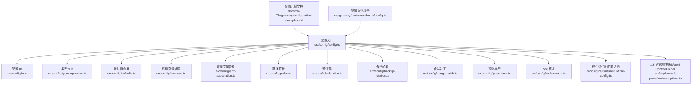
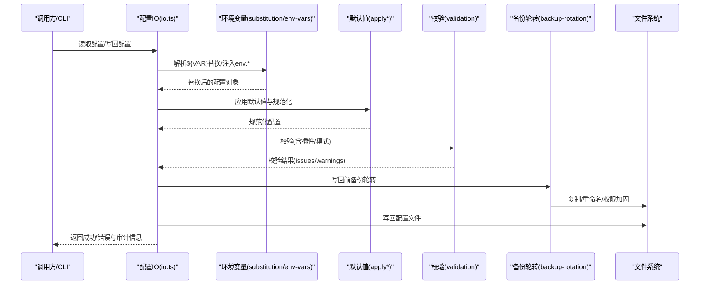
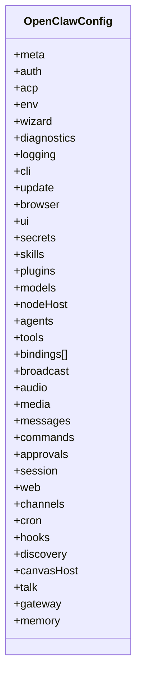
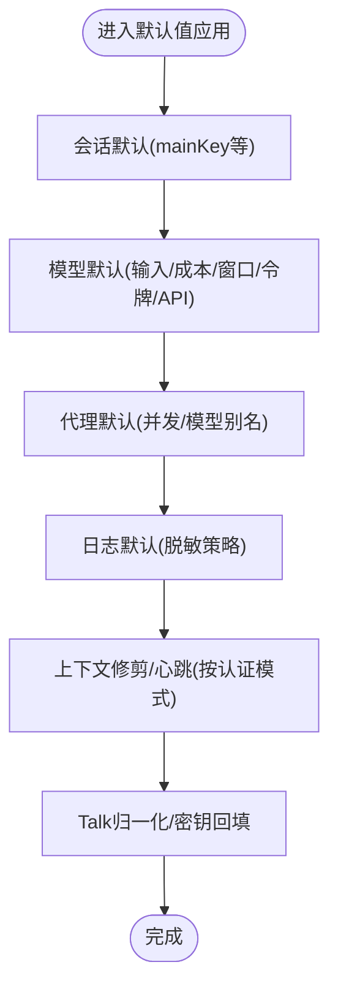
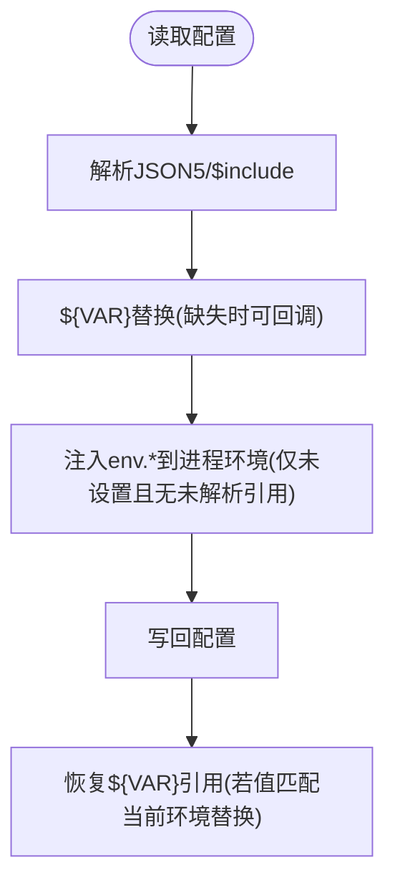
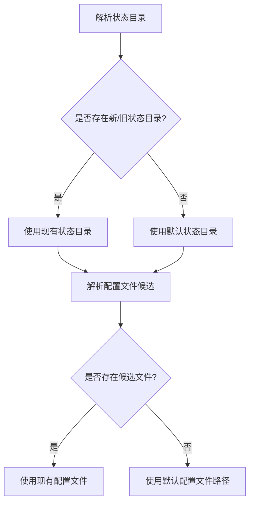
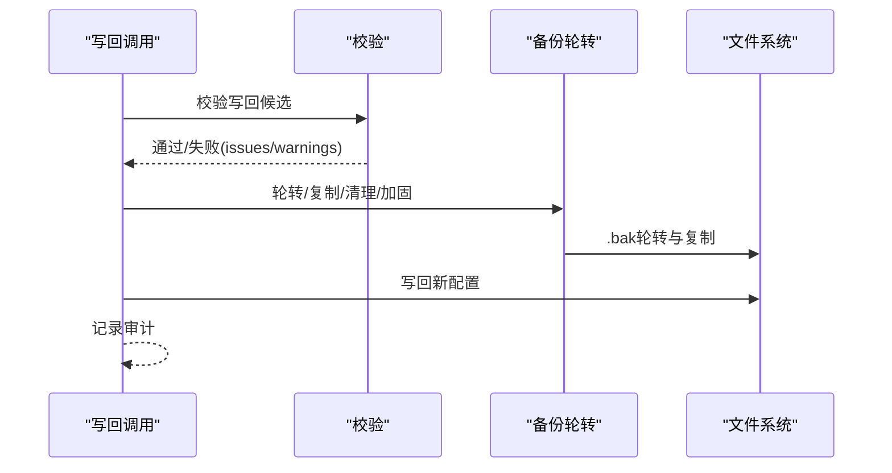
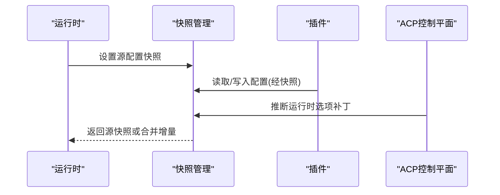
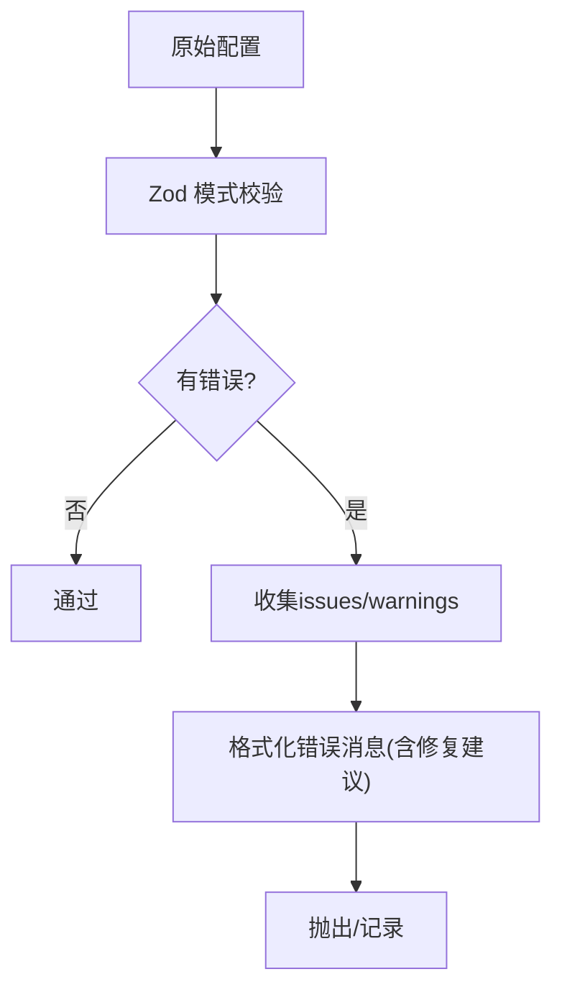
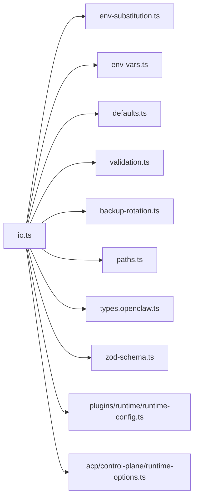

# 配置管理

<cite>
**本文档引用的文件**
- [src/config/config.ts](file://src/config/config.ts)
- [src/config/types.openclaw.ts](file://src/config/types.openclaw.ts)
- [src/config/defaults.ts](file://src/config/defaults.ts)
- [src/config/env-vars.ts](file://src/config/env-vars.ts)
- [src/config/env-substitution.ts](file://src/config/env-substitution.ts)
- [src/config/paths.ts](file://src/config/paths.ts)
- [src/config/io.ts](file://src/config/io.ts)
- [src/config/validation.ts](file://src/config/validation.ts)
- [src/config/backup-rotation.ts](file://src/config/backup-rotation.ts)
- [src/config/merge-patch.ts](file://src/config/merge-patch.ts)
- [src/config/types.base.ts](file://src/config/types.base.ts)
- [src/config/zod-schema.ts](file://src/config/zod-schema.ts)
- [src/plugins/runtime/runtime-config.ts](file://src/plugins/runtime/runtime-config.ts)
- [src/acp/control-plane/runtime-options.ts](file://src/acp/control-plane/runtime-options.ts)
- [docs/zh-CN/gateway/configuration-examples.md](file://docs/zh-CN/gateway/configuration-examples.md)
- [src/gateway/protocol/schema/config.ts](file://src/gateway/protocol/schema/config.ts)
</cite>

## 目录

1. [简介](#简介)
2. [项目结构](#项目结构)
3. [核心组件](#核心组件)
4. [架构总览](#架构总览)
5. [详细组件分析](#详细组件分析)
6. [依赖关系分析](#依赖关系分析)
7. [性能考量](#性能考量)
8. [故障排查指南](#故障排查指南)
9. [结论](#结论)
10. [附录](#附录)

## 简介

本指南系统性阐述 OpenClaw 的配置管理机制，覆盖配置文件结构、配置项语义、默认值与优先级、动态配置更新、配置验证、备份与恢复、环境变量与运行时注入、持久化策略以及最佳实践与常见问题诊断。目标是帮助用户与开发者以一致、可审计的方式管理 OpenClaw 的运行参数。

## 项目结构

OpenClaw 的配置子系统由“类型定义、解析与加载、默认值应用、环境变量处理、校验、写回与备份、运行时快照”等模块组成，并通过统一入口导出对外 API。

**图表来源**

- [src/config/config.ts:1-29](file://src/config/config.ts#L1-L29)
- [src/config/io.ts:1-200](file://src/config/io.ts#L1-L200)
- [src/config/types.openclaw.ts:1-155](file://src/config/types.openclaw.ts#L1-L155)
- [src/config/defaults.ts:1-537](file://src/config/defaults.ts#L1-L537)
- [src/config/env-vars.ts:1-98](file://src/config/env-vars.ts#L1-L98)
- [src/config/env-substitution.ts:1-200](file://src/config/env-substitution.ts#L1-L200)
- [src/config/paths.ts:1-200](file://src/config/paths.ts#L1-L200)
- [src/config/validation.ts:1-200](file://src/config/validation.ts#L1-L200)
- [src/config/backup-rotation.ts:1-125](file://src/config/backup-rotation.ts#L1-L125)
- [src/config/merge-patch.ts:1-98](file://src/config/merge-patch.ts#L1-L98)
- [src/config/types.base.ts:1-200](file://src/config/types.base.ts#L1-L200)
- [src/config/zod-schema.ts:1-200](file://src/config/zod-schema.ts#L1-L200)
- [src/plugins/runtime/runtime-config.ts:1-9](file://src/plugins/runtime/runtime-config.ts#L1-L9)
- [src/acp/control-plane/runtime-options.ts:322-349](file://src/acp/control-plane/runtime-options.ts#L322-L349)
- [docs/zh-CN/gateway/configuration-examples.md:1-59](file://docs/zh-CN/gateway/configuration-examples.md#L1-L59)
- [src/gateway/protocol/schema/config.ts:53-100](file://src/gateway/protocol/schema/config.ts#L53-L100)

**章节来源**

- [src/config/config.ts:1-29](file://src/config/config.ts#L1-L29)
- [src/config/io.ts:1-200](file://src/config/io.ts#L1-L200)
- [src/config/types.openclaw.ts:1-155](file://src/config/types.openclaw.ts#L1-L155)

## 核心组件

- 配置类型与结构：OpenClawConfig 定义顶层键空间，涵盖认证、代理、模型、通道、会话、日志、UI、插件、技能、网关、内存等模块域。
- 默认值应用：在读取后、写回前，按需应用多类默认值与规范化逻辑，确保配置收敛到稳定形态。
- 环境变量：支持在配置中直接引用 ${VAR}；支持将配置中的 env.\* 注入进程环境；支持保留原样写回以保留 ${VAR} 引用。
- 路径解析：自动解析状态目录与配置文件路径，兼容历史遗留位置。
- 写回与备份：写回前进行严格校验；写回后执行备份轮转与权限加固；支持写回审计记录。
- 运行时快照：支持在运行时维护“源配置 + 运行时增量”的快照，实现动态更新与回滚。
- 插件与运行时：插件可通过运行时配置接口读写配置；ACP 控制平面可将运行时选项映射为配置补丁。

**章节来源**

- [src/config/types.openclaw.ts:31-123](file://src/config/types.openclaw.ts#L31-L123)
- [src/config/defaults.ts:146-537](file://src/config/defaults.ts#L146-L537)
- [src/config/env-vars.ts:70-98](file://src/config/env-vars.ts#L70-L98)
- [src/config/env-substitution.ts:88-135](file://src/config/env-substitution.ts#L88-L135)
- [src/config/paths.ts:118-194](file://src/config/paths.ts#L118-L194)
- [src/config/io.ts:121-151](file://src/config/io.ts#L121-L151)
- [src/config/backup-rotation.ts:16-125](file://src/config/backup-rotation.ts#L16-L125)
- [src/plugins/runtime/runtime-config.ts:1-9](file://src/plugins/runtime/runtime-config.ts#L1-L9)
- [src/acp/control-plane/runtime-options.ts:322-349](file://src/acp/control-plane/runtime-options.ts#L322-L349)

## 架构总览

下图展示了从“读取配置”到“写回配置”的端到端流程，包括环境变量替换、默认值应用、校验、备份与审计。

**图表来源**

- [src/config/io.ts:1-200](file://src/config/io.ts#L1-L200)
- [src/config/env-substitution.ts:197-200](file://src/config/env-substitution.ts#L197-L200)
- [src/config/env-vars.ts:70-98](file://src/config/env-vars.ts#L70-L98)
- [src/config/defaults.ts:146-537](file://src/config/defaults.ts#L146-L537)
- [src/config/validation.ts:1-200](file://src/config/validation.ts#L1-L200)
- [src/config/backup-rotation.ts:115-125](file://src/config/backup-rotation.ts#L115-L125)

## 详细组件分析

### 配置文件结构与类型

- 顶层键空间：包含 meta、auth、acp、env、wizard、diagnostics、logging、cli、update、browser、ui、secrets、skills、plugins、models、nodeHost、agents、tools、bindings、broadcast、audio、media、messages、commands、approvals、session、web、channels、cron、hooks、discovery、canvasHost、talk、gateway、memory 等。
- 结构化分层：各模块域通过独立类型定义与 Zod 模式约束，保证配置的可扩展与可演进。

**图表来源**

- [src/config/types.openclaw.ts:31-123](file://src/config/types.openclaw.ts#L31-L123)

**章节来源**

- [src/config/types.openclaw.ts:31-123](file://src/config/types.openclaw.ts#L31-L123)

### 默认值与规范化

- 会话默认：强制主会话键为固定值并发出兼容性警告。
- 模型默认：为模型字段补齐输入类型、成本、上下文窗口、最大输出令牌、API 类型等；为代理默认模型别名补齐。
- 日志默认：敏感信息脱敏策略默认启用。
- 上下文修剪与心跳：基于认证模式自动设定策略。
- Talk 配置归一化与密钥回填：在未显式配置时尝试回填默认提供商密钥。

**图表来源**

- [src/config/defaults.ts:146-537](file://src/config/defaults.ts#L146-L537)

**章节来源**

- [src/config/defaults.ts:146-537](file://src/config/defaults.ts#L146-L537)

### 环境变量与运行时注入

- 环境变量替换：在配置解析阶段对字符串值进行 ${VAR} 替换，支持转义 $${VAR}。
- 进程环境注入：将配置中的 env.vars 与顶层字符串键注入到进程环境，仅在目标键未被设置时生效；避免在替换前注入包含未解析占位符的值。
- 参考保留：写回时检测值是否与当前环境变量替换结果一致，若一致则恢复原 ${VAR} 引用，防止凭空泄漏真实值。

**图表来源**

- [src/config/env-substitution.ts:88-135](file://src/config/env-substitution.ts#L88-L135)
- [src/config/env-vars.ts:70-98](file://src/config/env-vars.ts#L70-L98)
- [src/config/env-preserve.ts:19-38](file://src/config/env-preserve.ts#L19-L38)

**章节来源**

- [src/config/env-substitution.ts:88-135](file://src/config/env-substitution.ts#L88-L135)
- [src/config/env-vars.ts:70-98](file://src/config/env-vars.ts#L70-L98)
- [src/config/env-preserve.ts:19-38](file://src/config/env-preserve.ts#L19-L38)

### 路径解析与优先级

- 状态目录优先：优先选择已存在的旧版或新版状态目录，否则使用默认目录。
- 配置文件路径：支持通过环境变量覆盖；若未覆盖则在状态目录内查找现有配置文件候选，最后回退到默认路径。
- 历史兼容：自动探测历史遗留状态目录与配置文件名。

**图表来源**

- [src/config/paths.ts:60-194](file://src/config/paths.ts#L60-L194)

**章节来源**

- [src/config/paths.ts:60-194](file://src/config/paths.ts#L60-L194)

### 写回与备份恢复

- 写回前校验：对写回候选进行严格校验，失败抛错并输出详细问题列表。
- 备份轮转：写回前执行环形轮转，保留最近若干份 .bak._ 文件；清理孤儿 .bak._；复制当前配置为新的 .bak；必要时加固权限。
- 审计记录：记录写回事件与变更摘要，便于追踪。

**图表来源**

- [src/config/io.ts:1093-1105](file://src/config/io.ts#L1093-L1105)
- [src/config/backup-rotation.ts:16-125](file://src/config/backup-rotation.ts#L16-L125)

**章节来源**

- [src/config/io.ts:1093-1105](file://src/config/io.ts#L1093-L1105)
- [src/config/backup-rotation.ts:16-125](file://src/config/backup-rotation.ts#L16-L125)

### 动态配置更新与运行时快照

- 运行时快照：支持设置“源配置 + 运行时增量”的快照，读取时优先返回源快照；刷新处理器可决定是否接受增量更新。
- 插件运行时配置：插件通过运行时配置接口读写配置，确保与核心配置管理解耦。
- ACP 运行时选项：将运行时选项键值映射为配置补丁，用于即时生效的参数调整。

**图表来源**

- [src/config/io.ts:144-151](file://src/config/io.ts#L144-L151)
- [src/plugins/runtime/runtime-config.ts:1-9](file://src/plugins/runtime/runtime-config.ts#L1-L9)
- [src/acp/control-plane/runtime-options.ts:322-349](file://src/acp/control-plane/runtime-options.ts#L322-L349)

**章节来源**

- [src/config/io.ts:144-151](file://src/config/io.ts#L144-L151)
- [src/plugins/runtime/runtime-config.ts:1-9](file://src/plugins/runtime/runtime-config.ts#L1-L9)
- [src/acp/control-plane/runtime-options.ts:322-349](file://src/acp/control-plane/runtime-options.ts#L322-L349)

### 配置验证与错误格式化

- Zod 模式：为各模块域定义强类型模式，结合敏感字段标记与工具校验。
- 问题收集：将 Zod 校验问题映射为统一的 ConfigValidationIssue，补充允许值提示。
- 特定规则：如开放 DM 策略与 allowFrom 不匹配时，生成可操作的修复建议。

**图表来源**

- [src/config/validation.ts:117-140](file://src/config/validation.ts#L117-L140)
- [src/config/zod-schema.ts:1-200](file://src/config/zod-schema.ts#L1-L200)

**章节来源**

- [src/config/validation.ts:117-140](file://src/config/validation.ts#L117-L140)
- [src/config/zod-schema.ts:1-200](file://src/config/zod-schema.ts#L1-L200)

### 配置模板与最佳实践

- 示例参考：官方提供了“绝对最小配置”和“推荐入门配置”的示例，可直接作为起点。
- 最佳实践要点：
  - 使用 env.\* 注入敏感信息，避免硬编码；写回时保留 ${VAR} 引用。
  - 明确会话与 DM 策略，避免开放策略与 allowFrom 不匹配导致的通信异常。
  - 合理设置模型默认值与上下文窗口，平衡性能与效果。
  - 定期检查备份，确保配置变更可回溯。

**章节来源**

- [docs/zh-CN/gateway/configuration-examples.md:21-59](file://docs/zh-CN/gateway/configuration-examples.md#L21-L59)

## 依赖关系分析

- 模块内聚：配置 IO 作为中枢，串联环境变量、默认值、校验、备份等子系统。
- 外部依赖：JSON5 解析、Zod 模式、Node 文件系统与进程环境。
- 循环依赖：未见直接循环；通过统一入口导出避免横向耦合。

**图表来源**

- [src/config/io.ts:1-200](file://src/config/io.ts#L1-L200)
- [src/config/env-substitution.ts:1-200](file://src/config/env-substitution.ts#L1-L200)
- [src/config/env-vars.ts:1-98](file://src/config/env-vars.ts#L1-L98)
- [src/config/defaults.ts:1-537](file://src/config/defaults.ts#L1-L537)
- [src/config/validation.ts:1-200](file://src/config/validation.ts#L1-L200)
- [src/config/backup-rotation.ts:1-125](file://src/config/backup-rotation.ts#L1-L125)
- [src/config/paths.ts:1-200](file://src/config/paths.ts#L1-L200)
- [src/config/types.openclaw.ts:1-155](file://src/config/types.openclaw.ts#L1-L155)
- [src/config/zod-schema.ts:1-200](file://src/config/zod-schema.ts#L1-L200)
- [src/plugins/runtime/runtime-config.ts:1-9](file://src/plugins/runtime/runtime-config.ts#L1-L9)
- [src/acp/control-plane/runtime-options.ts:322-349](file://src/acp/control-plane/runtime-options.ts#L322-L349)

**章节来源**

- [src/config/io.ts:1-200](file://src/config/io.ts#L1-L200)

## 性能考量

- 解析与替换：对大型配置进行递归字符串替换与数组/对象遍历，注意避免不必要的重复计算。
- 校验成本：Zod 模式校验在写回前执行，建议在 CI 中提前发现模式问题。
- 备份轮转：轮转与复制操作为 O(N) 文件重命名/拷贝，建议在批量写回时合并操作减少 I/O。
- 默认值应用：仅在需要时应用，避免对已完备配置做无意义修改。

## 故障排查指南

- 缺失环境变量：当配置中存在未设置的 ${VAR} 且未提供回调时会抛出错误。请检查环境变量是否正确设置或使用 onMissing 回调收集告警。
- 开放 DM 策略不匹配：当 talk provider 与 allowFrom 不一致时，校验器会给出明确修复建议，包括使用命令行工具修正 allowFrom 或切换策略。
- 写回失败：写回前严格校验，失败时会输出 issues 列表；请根据路径与消息逐项修正。
- 备份异常：若备份轮转失败，系统会尽力回退；请检查磁盘权限与空间。

**章节来源**

- [src/config/env-substitution.ts:29-37](file://src/config/env-substitution.ts#L29-L37)
- [src/config/validation.ts:167-186](file://src/config/validation.ts#L167-L186)
- [src/config/io.ts:1093-1105](file://src/config/io.ts#L1093-L1105)
- [src/config/backup-rotation.ts:16-125](file://src/config/backup-rotation.ts#L16-L125)

## 结论

OpenClaw 的配置管理以类型安全为核心，通过严格的解析、默认值应用、环境变量处理、模式校验与备份轮转，实现了可审计、可回滚、可扩展的配置生命周期管理。配合运行时快照与插件运行时接口，既满足长期稳定运行，也支持动态调整与即刻生效。

## 附录

### 配置项与默认值概览

- 会话与 DM 策略：默认主会话键、DM 作用域、重置策略、线程绑定等。
- 日志与脱敏：默认日志级别、控制台样式、敏感信息脱敏策略。
- 模型与上下文：默认输入类型、成本、上下文窗口、最大输出令牌、API 类型。
- Talk 与密钥：默认提供商、密钥回填、语音与中断策略。
- 通道与路由：各通道的接入策略、白名单与群组规则。

**章节来源**

- [src/config/types.base.ts:105-166](file://src/config/types.base.ts#L105-L166)
- [src/config/defaults.ts:390-405](file://src/config/defaults.ts#L390-L405)
- [src/config/defaults.ts:213-347](file://src/config/defaults.ts#L213-L347)
- [src/config/zod-schema.ts:172-184](file://src/config/zod-schema.ts#L172-L184)

### 优先级规则（最高 → 最低）

- 环境变量注入：仅在进程环境未设置时注入配置中的 env.\*。
- ${VAR} 替换：在写回前进行，若值与当前环境替换结果一致则恢复 ${VAR} 引用。
- 写回候选：写回前严格校验，失败则拒绝写入。
- 运行时快照：读取时优先返回源快照，增量更新由刷新处理器决定。
- 默认值：在写回前应用，避免泄漏到持久化配置。

**章节来源**

- [src/config/env-vars.ts:79-96](file://src/config/env-vars.ts#L79-L96)
- [src/config/env-substitution.ts:197-200](file://src/config/env-substitution.ts#L197-L200)
- [src/config/env-preserve.ts:19-38](file://src/config/env-preserve.ts#L19-L38)
- [src/config/io.ts:1093-1105](file://src/config/io.ts#L1093-L1105)
- [src/config/io.ts:144-151](file://src/config/io.ts#L144-L151)
- [src/config/defaults.ts:146-537](file://src/config/defaults.ts#L146-L537)

### 配置模板与示例

- 绝对最小配置与推荐入门配置示例可参考官方文档示例页面。

**章节来源**

- [docs/zh-CN/gateway/configuration-examples.md:21-59](file://docs/zh-CN/gateway/configuration-examples.md#L21-L59)
