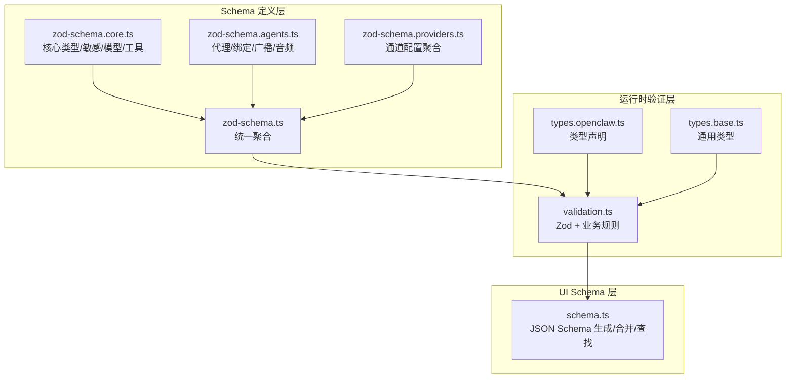
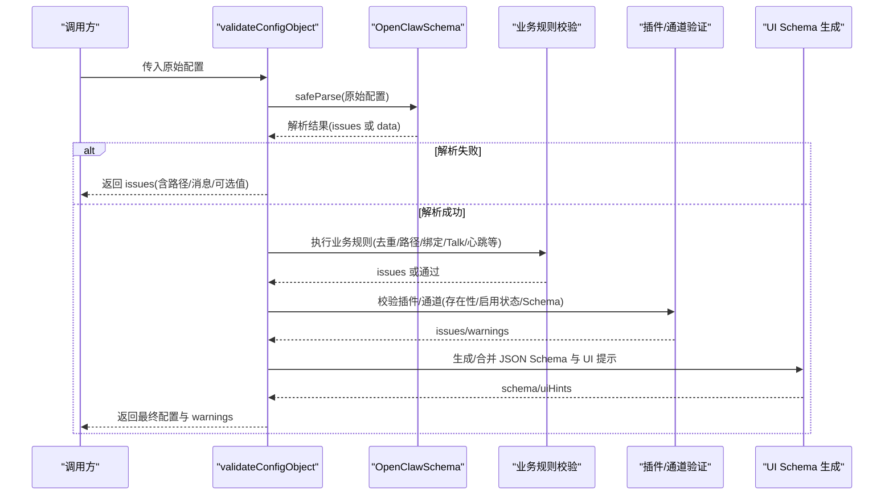
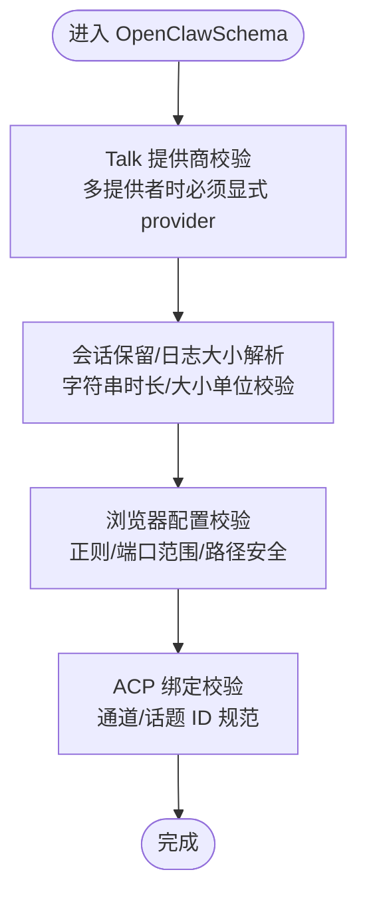
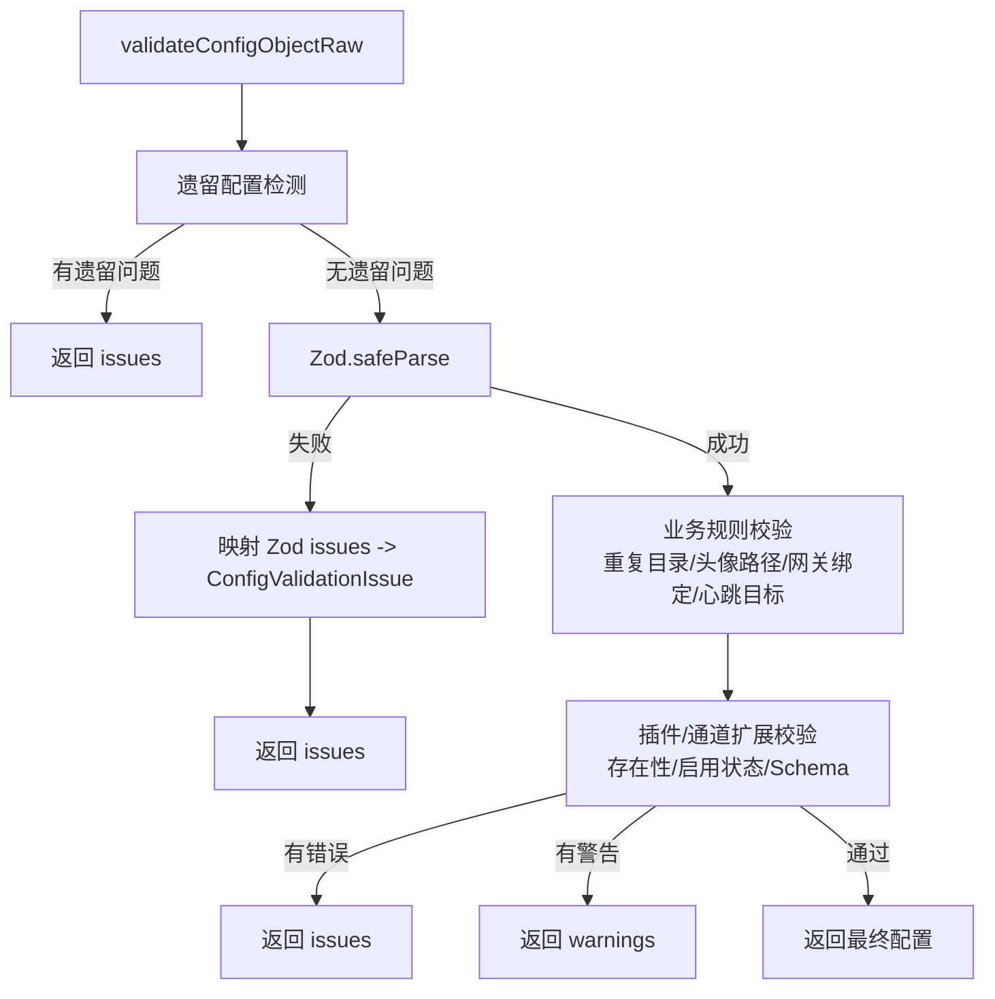
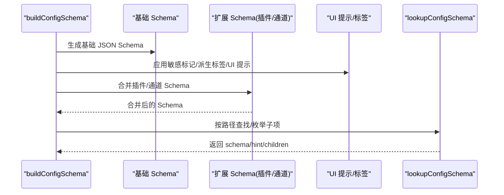
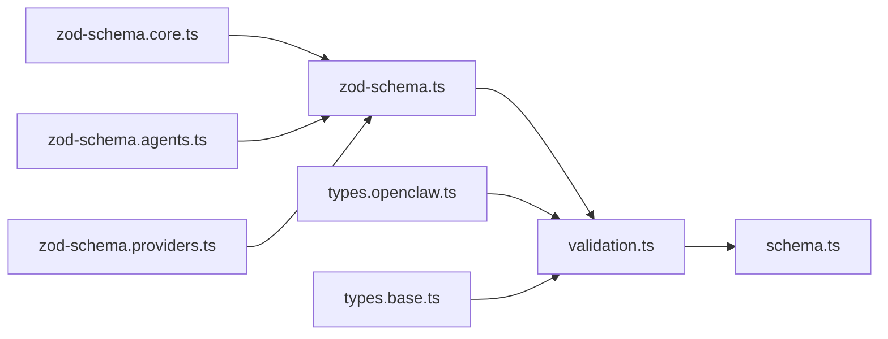

# 配置验证

<cite>
**本文引用的文件**
- [src/config/zod-schema.ts](file://src/config/zod-schema.ts)
- [src/config/validation.ts](file://src/config/validation.ts)
- [src/config/schema.ts](file://src/config/schema.ts)
- [src/config/zod-schema.core.ts](file://src/config/zod-schema.core.ts)
- [src/config/zod-schema.agents.ts](file://src/config/zod-schema.agents.ts)
- [src/config/zod-schema.providers.ts](file://src/config/zod-schema.providers.ts)
- [src/config/types.openclaw.ts](file://src/config/types.openclaw.ts)
- [src/config/types.base.ts](file://src/config/types.base.ts)
- [src/config/config.ts](file://src/config/config.ts)
</cite>

## 目录

1. [简介](#简介)
2. [项目结构](#项目结构)
3. [核心组件](#核心组件)
4. [架构总览](#架构总览)
5. [详细组件分析](#详细组件分析)
6. [依赖分析](#依赖分析)
7. [性能考量](#性能考量)
8. [故障排查指南](#故障排查指南)
9. [结论](#结论)
10. [附录](#附录)

## 简介

本文件系统性阐述 OpenClaw 的配置验证体系，覆盖以下方面：

- 验证规则与错误类型：类型验证、取值范围验证、依赖关系验证、插件与通道扩展验证、遗留配置迁移提示等。
- Zod Schema 使用：分层 Schema 组合、自定义 refine/superRefine、敏感字段标注、跨模块复用。
- 自定义验证器：在 Zod 基础之上，补充业务规则（如 ACP 绑定、网关与 Tailscale 绑定策略、心跳目标校验）。
- 配置约束检查：Talk 提供商一致性、会话保留时长与大小解析、浏览器配置正则限制等。
- 诊断与修复：基于 Zod 错误映射的路径与可选值提示；遗留配置迁移指引；格式化与规范化工具使用建议。
- 配置 Schema 导出与 UI 提示：生成 JSON Schema、合并插件/通道 Schema、UI 提示与标签派生。

## 项目结构

OpenClaw 的配置验证由“Schema 定义 + 运行时验证 + UI Schema 导出”三层组成：

- Schema 定义层：以 Zod 为核心，按功能域拆分为多个模块（核心、代理、通道、提供商、会话等），最终在统一入口聚合。
- 运行时验证层：将原始配置经 Zod 解析后，再执行业务规则校验（去重、路径合法性、插件/通道存在性、心跳目标等）。
- UI Schema 层：将 Zod Schema 转换为 JSON Schema，并注入 UI 提示、敏感标记、插件与通道扩展 Schema。

**图表来源**

- [src/config/zod-schema.ts:1-911](file://src/config/zod-schema.ts#L1-L911)
- [src/config/zod-schema.core.ts:1-730](file://src/config/zod-schema.core.ts#L1-L730)
- [src/config/zod-schema.agents.ts:1-109](file://src/config/zod-schema.agents.ts#L1-L109)
- [src/config/zod-schema.providers.ts:1-48](file://src/config/zod-schema.providers.ts#L1-L48)
- [src/config/validation.ts:1-605](file://src/config/validation.ts#L1-L605)
- [src/config/schema.ts:1-712](file://src/config/schema.ts#L1-L712)
- [src/config/types.openclaw.ts:1-155](file://src/config/types.openclaw.ts#L1-L155)
- [src/config/types.base.ts:1-239](file://src/config/types.base.ts#L1-L239)

**章节来源**

- [src/config/zod-schema.ts:1-911](file://src/config/zod-schema.ts#L1-L911)
- [src/config/validation.ts:1-605](file://src/config/validation.ts#L1-L605)
- [src/config/schema.ts:1-712](file://src/config/schema.ts#L1-L712)
- [src/config/types.openclaw.ts:1-155](file://src/config/types.openclaw.ts#L1-L155)
- [src/config/types.base.ts:1-239](file://src/config/types.base.ts#L1-L239)

## 核心组件

- 统一配置 Schema（OpenClawSchema）
  - 聚合各子模块 Schema，覆盖 meta/env/wizard/diagnostics/logging/cli/update/browser/ui/secrets/auth/acp/models/nodeHost/agents/tools/bindings/broadcast/audio/media/messages/commands/approvals/session/web/channels/cron/hooks/discovery/canvasHost/talk/gateway/memory 等。
  - 内置多种 refine/superRefine：如 Talk 提供商一致性、会话保留时长与日志大小解析、浏览器配置正则校验、节点主机与头像路径安全策略等。
- 运行时验证（validateConfigObject/validateConfigObjectRaw）
  - 先进行遗留配置检测，再通过 Zod 解析；若成功，进一步执行业务规则校验（重复代理目录、身份头像路径、网关与 Tailscale 绑定策略、心跳目标等）。
  - 支持“仅 Zod 校验”和“应用默认后再校验”的两种模式。
- 插件与通道扩展验证
  - 加载插件清单，校验 plugins.entries/allow/deny 中的插件 ID 是否存在；对启用或带配置的插件执行其自定义 JSON Schema 校验。
  - 对 channels 下未知通道 ID 进行提示，并支持动态扩展。
- UI Schema 生成与合并
  - 将 Zod Schema 转换为 JSON Schema，注入敏感标记、派生标签、UI 提示；按插件与通道扩展 Schema 合并，支持按路径查找与子项枚举。

**章节来源**

- [src/config/zod-schema.ts:206-800](file://src/config/zod-schema.ts#L206-L800)
- [src/config/validation.ts:229-286](file://src/config/validation.ts#L229-L286)
- [src/config/schema.ts:429-484](file://src/config/schema.ts#L429-L484)

## 架构总览

下图展示从原始配置到最终可用配置的关键流程：Zod 解析 → 业务规则校验 → 插件/通道扩展验证 → UI Schema 生成。

**图表来源**

- [src/config/validation.ts:229-286](file://src/config/validation.ts#L229-L286)
- [src/config/zod-schema.ts:206-800](file://src/config/zod-schema.ts#L206-L800)
- [src/config/schema.ts:429-484](file://src/config/schema.ts#L429-L484)

## 详细组件分析

### Zod Schema 设计与规则

- 分层聚合
  - 核心类型：SecretInput/SecretRef、模型与提供商、队列/打字/Markdown/TTS 等通用能力。
  - 代理与绑定：代理列表、默认值、路由与 ACP 绑定、广播策略、音频转写。
  - 通道与提供商：Discord/Telegram/Slack/Irc/Signal/MSTeams/WhatsApp 等配置聚合。
  - 统一入口：OpenClawSchema 汇聚上述模块，形成完整配置契约。
- 自定义 refine/superRefine
  - Talk 提供商一致性：当定义多个 providers 时，必须显式指定 provider 且该值需存在于 providers 键集合中。
  - 会话保留与日志大小：通过解析函数校验字符串形式的时长/大小单位（ms/s/m/h/d 与 b/kb/mb/gb/tb）。
  - 浏览器配置：正则限制配置键名与端口范围，确保安全性与兼容性。
  - ACP 绑定：限定通道类型与话题 ID 规范，要求匹配具体对话上下文。
- 敏感字段标注
  - SecretInputSchema 可注册 sensitive 标记，用于 UI Schema 生成时的敏感提示与隐藏策略。

**图表来源**

- [src/config/zod-schema.ts:185-204](file://src/config/zod-schema.ts#L185-L204)
- [src/config/zod-schema.ts:533-556](file://src/config/zod-schema.ts#L533-L556)
- [src/config/zod-schema.ts:341-371](file://src/config/zod-schema.ts#L341-L371)
- [src/config/zod-schema.agents.ts:63-90](file://src/config/zod-schema.agents.ts#L63-L90)

**章节来源**

- [src/config/zod-schema.ts:185-204](file://src/config/zod-schema.ts#L185-L204)
- [src/config/zod-schema.ts:533-556](file://src/config/zod-schema.ts#L533-L556)
- [src/config/zod-schema.ts:341-371](file://src/config/zod-schema.ts#L341-L371)
- [src/config/zod-schema.agents.ts:63-90](file://src/config/zod-schema.agents.ts#L63-L90)

### 运行时验证与错误映射

- 遗留配置检测
  - 发现遗留问题时直接返回，避免后续校验。
- Zod 解析与错误映射
  - 将 Zod issues 映射为统一 ConfigValidationIssue，自动提取允许值集合并附加提示。
- 业务规则校验
  - 重复代理目录：发现 agents.list 中重复工作区目录时报错。
  - 身份头像路径：仅允许工作区内相对路径、http(s) URL 或 data URI；否则报错。
  - 网关与 Tailscale 绑定：当 gateway.tailscale.mode 为 serve/funnel 时，gateway.bind 必须为 loopback 或 custom+127.0.0.1。
  - 心跳目标校验：agents.defaults.heartbeat.target 与 agents.list[*].heartbeat.target 支持 "last"/"none" 或已知通道 ID。
- 插件与通道扩展
  - 加载插件清单，校验 plugins.entries/allow/deny 中的插件 ID 存在性；对启用或带配置的插件执行其 JSON Schema 校验。
  - channels 下未知通道 ID 报告；支持 passthrough 动态扩展。

**图表来源**

- [src/config/validation.ts:229-286](file://src/config/validation.ts#L229-L286)
- [src/config/validation.ts:148-196](file://src/config/validation.ts#L148-L196)
- [src/config/validation.ts:198-223](file://src/config/validation.ts#L198-L223)
- [src/config/validation.ts:308-366](file://src/config/validation.ts#L308-L366)
- [src/config/validation.ts:386-407](file://src/config/validation.ts#L386-L407)

**章节来源**

- [src/config/validation.ts:229-286](file://src/config/validation.ts#L229-L286)
- [src/config/validation.ts:148-196](file://src/config/validation.ts#L148-L196)
- [src/config/validation.ts:198-223](file://src/config/validation.ts#L198-L223)
- [src/config/validation.ts:308-366](file://src/config/validation.ts#L308-L366)
- [src/config/validation.ts:386-407](file://src/config/validation.ts#L386-L407)

### UI Schema 生成与查找

- JSON Schema 生成
  - 基于 OpenClawSchema 生成 JSON Schema，设置版本与生成时间戳。
  - 应用敏感标记与派生标签，剥离 $schema 以便 UI 表单使用。
- 插件与通道 Schema 合并
  - 将插件与通道各自提供的 JSON Schema 合并到根 Schema 上，形成“扩展后的配置 Schema”。
  - 注入 UI 提示（label/help/tags/advanced/sensitive/placeholder 等），并支持按路径查找与子项枚举。
- 路径查找与子项枚举
  - 支持 normalize/lookup/children 构建，便于前端表单按路径动态渲染。

**图表来源**

- [src/config/schema.ts:429-484](file://src/config/schema.ts#L429-L484)
- [src/config/schema.ts:486-536](file://src/config/schema.ts#L486-L536)
- [src/config/schema.ts:562-586](file://src/config/schema.ts#L562-L586)
- [src/config/schema.ts:678-711](file://src/config/schema.ts#L678-L711)

**章节来源**

- [src/config/schema.ts:429-484](file://src/config/schema.ts#L429-L484)
- [src/config/schema.ts:486-536](file://src/config/schema.ts#L486-L536)
- [src/config/schema.ts:562-586](file://src/config/schema.ts#L562-L586)
- [src/config/schema.ts:678-711](file://src/config/schema.ts#L678-L711)

### 类型与数据模型

- OpenClawConfig
  - 定义顶层配置结构，涵盖 auth/acp/env/wizard/diagnostics/logging/cli/update/browser/ui/secrets/skills/plugins/models/nodeHost/agents/tools/bindings/broadcast/audio/media/messages/commands/approvals/session/web/channels/cron/hooks/discovery/canvasHost/talk/gateway/memory 等。
- ConfigValidationIssue
  - 统一错误描述，包含路径、消息、可选值集合与隐藏数量，便于 UI 呈现与自动化修复建议。
- 通用类型
  - Session/Logging/Diagnostics/Web 等通用配置类型，支撑验证与默认值应用。

**章节来源**

- [src/config/types.openclaw.ts:31-155](file://src/config/types.openclaw.ts#L31-L155)
- [src/config/types.base.ts:105-239](file://src/config/types.base.ts#L105-L239)

## 依赖分析

- 模块耦合
  - zod-schema.ts 作为统一入口，依赖各子模块（core/agents/providers 等）的 Schema。
  - validation.ts 依赖 zod-schema.ts 与各类业务规则（去重、路径、绑定、心跳等）。
  - schema.ts 依赖 zod-schema.ts 与 UI 提示/标签模块，负责 JSON Schema 生成与合并。
- 外部依赖
  - Zod 用于强类型与结构化校验。
  - 工具函数（如时长/大小解析、网络地址校验、路径安全校验）贯穿验证流程。

**图表来源**

- [src/config/zod-schema.ts:1-25](file://src/config/zod-schema.ts#L1-L25)
- [src/config/validation.ts:1-25](file://src/config/validation.ts#L1-L25)
- [src/config/schema.ts:1-7](file://src/config/schema.ts#L1-L7)

**章节来源**

- [src/config/zod-schema.ts:1-25](file://src/config/zod-schema.ts#L1-L25)
- [src/config/validation.ts:1-25](file://src/config/validation.ts#L1-L25)
- [src/config/schema.ts:1-7](file://src/config/schema.ts#L1-L7)

## 性能考量

- Zod 解析成本
  - 大型配置文件解析与多层嵌套校验可能带来开销；建议在 CI/本地开发场景中缓存 UI Schema 生成结果（schema.ts 已内置缓存）。
- 插件/通道扩展验证
  - 加载插件清单与执行 JSON Schema 校验会引入额外 IO 与 CPU 开销；建议在启动阶段一次性完成，避免重复加载。
- 字符串解析
  - 会话保留与日志大小解析使用字符串单位转换，建议在配置变更频率较低的场景使用，减少频繁解析。

[本节为通用指导，无需特定文件来源]

## 故障排查指南

- 常见错误类型与定位
  - 类型不匹配：Zod 会报告具体字段与期望类型；结合 allowedValues 提示快速定位。
  - 取值越界/非法：如端口范围、数值正负、枚举值等；根据路径定位到具体字段。
  - 依赖关系缺失：如 Talk.provider 未匹配 providers 键、ACP 绑定缺少必要字段、网关与 Tailscale 绑定策略冲突等。
  - 插件/通道不存在：plugins.entries/allow/deny 中的 ID 未找到；channels 下未知通道 ID。
- 诊断步骤
  - 使用 validateConfigObjectRaw 获取 Zod 原始错误；validateConfigObject 在此基础上应用默认值后再校验。
  - 若涉及插件/通道，使用 validateConfigObjectWithPlugins 或 validateConfigObjectRawWithPlugins 获取更全面的 issues/warnings。
  - 通过 schema.lookupConfigSchema 按路径获取字段的 JSON Schema 片段与 UI 提示，辅助理解字段含义与约束。
- 修复建议
  - 严格遵循 OpenClawSchema 的字段类型与取值范围；对于 Talk 提供商，确保 provider 与 providers 一致。
  - 对于网关与 Tailscale 绑定，遵循 loopback 限制；对于 ACP 绑定，确保通道与话题 ID 规范。
  - 对于插件/通道，确认 ID 存在且启用状态与配置匹配；移除不存在的条目或更新为有效 ID。
  - 使用 UI Schema 生成的 JSON Schema 作为编辑器/表单的参考，避免手写错误。

**章节来源**

- [src/config/validation.ts:229-286](file://src/config/validation.ts#L229-L286)
- [src/config/validation.ts:308-366](file://src/config/validation.ts#L308-L366)
- [src/config/schema.ts:678-711](file://src/config/schema.ts#L678-L711)

## 结论

OpenClaw 的配置验证体系以 Zod 为核心，结合运行时业务规则与 UI Schema 生成，实现了高可读性、可维护性与可观测性的配置治理方案。通过严格的类型与范围约束、丰富的自定义校验逻辑、完善的插件/通道扩展支持，以及友好的错误提示与 Schema 查找能力，显著降低了配置错误率并提升了用户体验。

[本节为总结，无需特定文件来源]

## 附录

- 配置格式化与规范化工具
  - 仓库内提供脚本与工具用于格式化与规范化（例如 SwiftLint/格式化脚本），可在本地开发环境中使用，确保配置文件风格一致。
  - 建议在 CI 中集成格式化与校验步骤，保证提交质量。
- 相关导出与入口
  - 配置验证导出入口位于 config.ts，便于 CLI/服务端统一调用。

**章节来源**

- [src/config/config.ts:1-29](file://src/config/config.ts#L1-L29)
