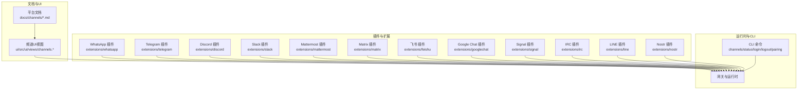
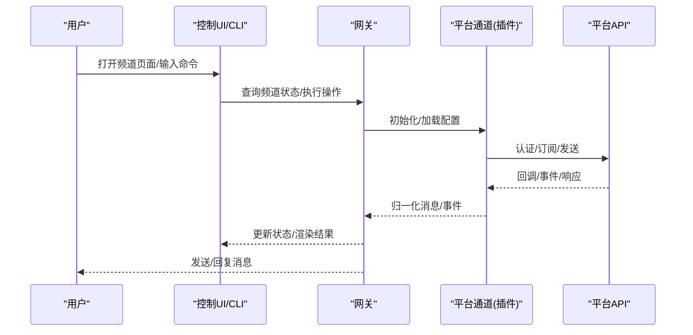
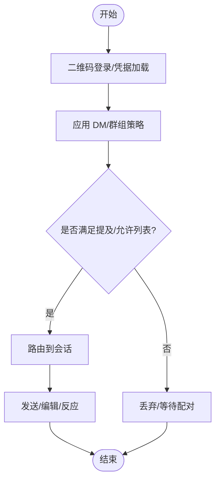
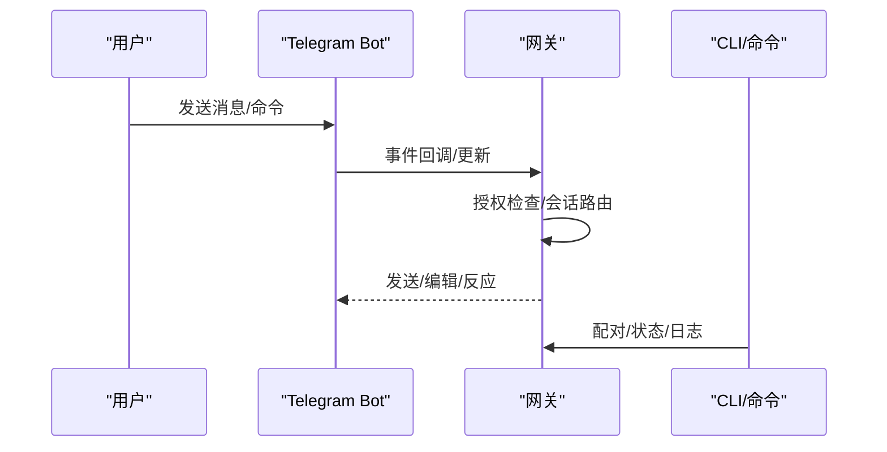
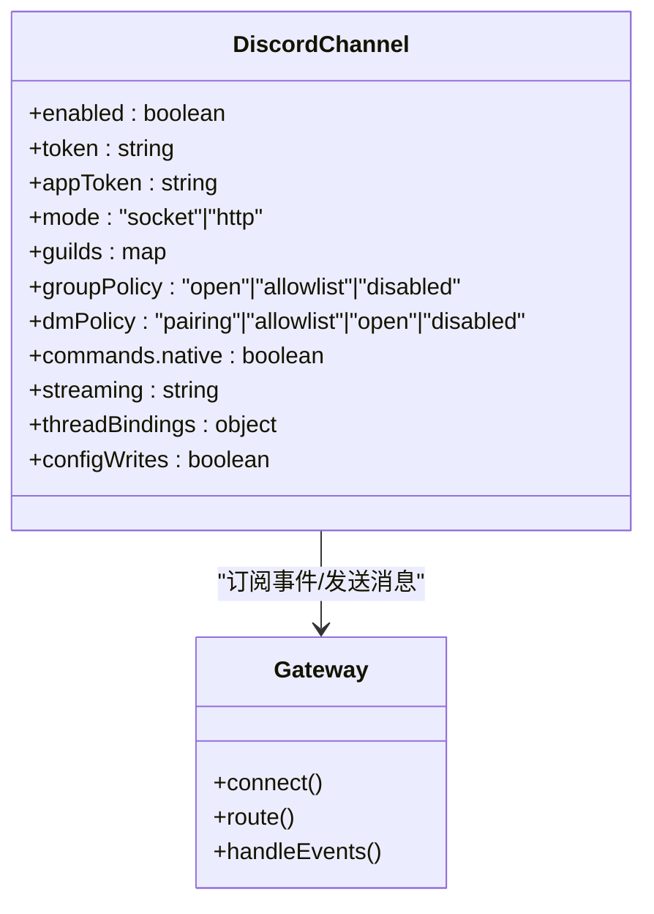
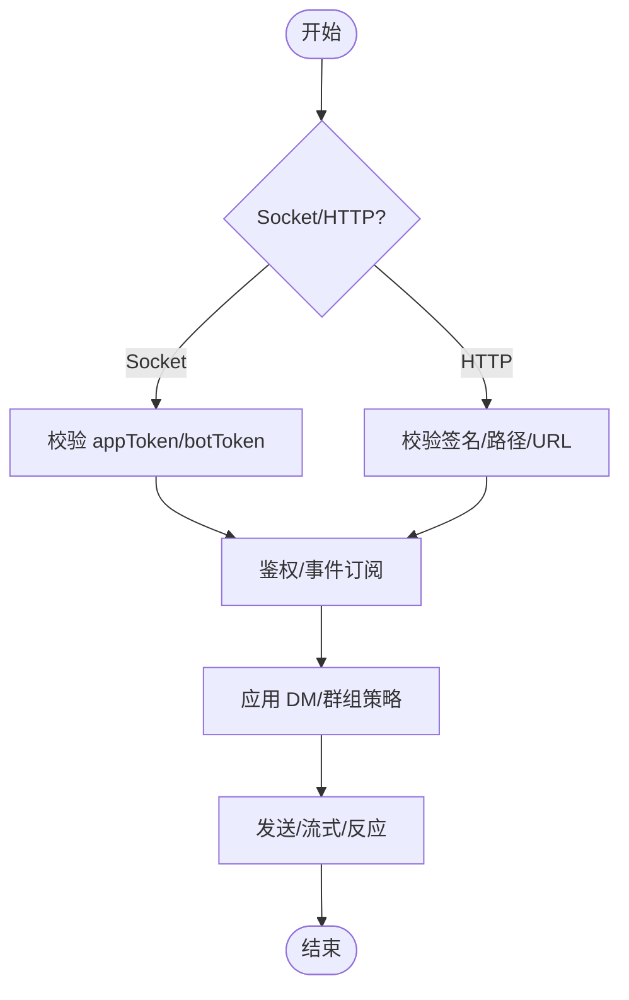
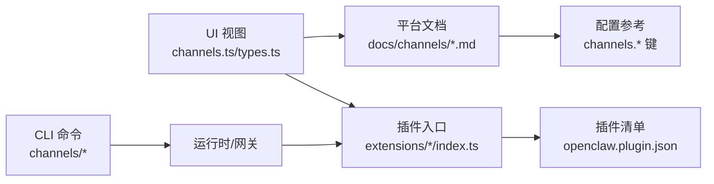

# 平台集成

<cite>
**本文引用的文件**
- [docs/channels/index.md](file://docs/channels/index.md)
- [docs/channels/troubleshooting.md](file://docs/channels/troubleshooting.md)
- [docs/channels/whatsapp.md](file://docs/channels/whatsapp.md)
- [docs/channels/telegram.md](file://docs/channels/telegram.md)
- [docs/channels/discord.md](file://docs/channels/discord.md)
- [docs/channels/slack.md](file://docs/channels/slack.md)
- [docs/channels/feishu.md](file://docs/channels/feishu.md)
- [docs/channels/googlechat.md](file://docs/channels/googlechat.md)
- [docs/channels/signal.md](file://docs/channels/signal.md)
- [docs/channels/matrix.md](file://docs/channels/matrix.md)
- [docs/channels/mattermost.md](file://docs/channels/mattermost.md)
- [docs/channels/irc.md](file://docs/channels/irc.md)
- [docs/channels/line.md](file://docs/channels/line.md)
- [docs/channels/nostr.md](file://docs/channels/nostr.md)
- [extensions/whatsapp/openclaw.plugin.json](file://extensions/whatsapp/openclaw.plugin.json)
- [extensions/discord/index.ts](file://extensions/discord/index.ts)
- [extensions/telegram/index.ts](file://extensions/telegram/index.ts)
- [extensions/slack/index.ts](file://extensions/slack/index.ts)
- [extensions/mattermost/index.ts](file://extensions/mattermost/index.ts)
- [extensions/matrix/index.ts](file://extensions/matrix/index.ts)
- [extensions/feishu/index.ts](file://extensions/feishu/index.ts)
- [extensions/googlechat/index.ts](file://extensions/googlechat/index.ts)
- [extensions/signal/index.ts](file://extensions/signal/index.ts)
- [extensions/irc/index.ts](file://extensions/irc/index.ts)
- [extensions/line/index.ts](file://extensions/line/index.ts)
- [extensions/nostr/index.ts](file://extensions/nostr/index.ts)
- [src/cli/deps-send-whatsapp.runtime.ts](file://src/cli/deps-send-whatsapp.runtime.ts)
- [ui/src/ui/views/channels.ts](file://ui/src/ui/views/channels.ts)
- [ui/src/ui/views/channels.types.ts](file://ui/src/ui/views/channels.types.ts)
- [ui/src/ui/views/channels.whatsapp.ts](file://ui/src/ui/views/channels.whatsapp.ts)
</cite>

## 目录

1. [简介](#简介)
2. [项目结构](#项目结构)
3. [核心组件](#核心组件)
4. [架构总览](#架构总览)
5. [详细组件分析](#详细组件分析)
6. [依赖关系分析](#依赖关系分析)
7. [性能考量](#性能考量)
8. [故障排除指南](#故障排除指南)
9. [结论](#结论)
10. [附录](#附录)

## 简介

本文件系统性梳理 OpenClaw 的平台集成功能，覆盖 20+ 消息平台的接入方式、认证配置、权限设置、高级选项、故障排除与最佳实践，并提供新平台集成的开发指导与 API 参考。目标是帮助用户从零开始完成基础配置，到实现多账号、多通道并行运行与精细化路由控制。

## 项目结构

OpenClaw 将“频道（Channel）”抽象为统一的网关接入层，各平台通过插件或内置模块实现，文档与 UI 均围绕“频道”维度组织。核心结构要点：

- 文档层：在 docs/channels 下按平台拆分独立文档，统一描述接入、配置、权限、特性与排障。
- 插件层：extensions/\* 提供各平台插件入口与清单，声明支持的通道类型与配置模式。
- 运行时层：UI 展示各频道状态卡片，CLI 提供登录/登出、配对、状态探测等命令。
- 配置层：channels.\* 下的键值控制各平台的访问策略、会话行为、媒体限制、流式输出等。

图表来源

- [docs/channels/index.md:1-48](file://docs/channels/index.md#L1-L48)
- [extensions/whatsapp/openclaw.plugin.json:1-9](file://extensions/whatsapp/openclaw.plugin.json#L1-L9)
- [extensions/discord/index.ts](file://extensions/discord/index.ts)
- [extensions/telegram/index.ts](file://extensions/telegram/index.ts)
- [extensions/slack/index.ts](file://extensions/slack/index.ts)
- [extensions/mattermost/index.ts](file://extensions/mattermost/index.ts)
- [extensions/matrix/index.ts](file://extensions/matrix/index.ts)
- [extensions/feishu/index.ts](file://extensions/feishu/index.ts)
- [extensions/googlechat/index.ts](file://extensions/googlechat/index.ts)
- [extensions/signal/index.ts](file://extensions/signal/index.ts)
- [extensions/irc/index.ts](file://extensions/irc/index.ts)
- [extensions/line/index.ts](file://extensions/line/index.ts)
- [extensions/nostr/index.ts](file://extensions/nostr/index.ts)

章节来源

- [docs/channels/index.md:1-48](file://docs/channels/index.md#L1-L48)

## 核心组件

- 频道文档与索引：集中于 docs/channels，提供快速入门、配置参考、特性说明与排障。
- 频道 UI 卡片：ui/views/channels.\* 渲染各平台状态与配置入口。
- 插件清单与入口：extensions/\*/openclaw.plugin.json 与 index.ts 定义通道类型、能力与初始化逻辑。
- CLI 工具链：channels/\* 子命令用于登录、登出、配对、状态探测与日志诊断。
- 配置模型：channels.\* 下的键值控制访问策略、会话隔离、历史上下文、流式输出、动作开关等。

章节来源

- [ui/src/ui/views/channels.ts:102-150](file://ui/src/ui/views/channels.ts#L102-L150)
- [ui/src/ui/views/channels.types.ts:52-62](file://ui/src/ui/views/channels.types.ts#L52-L62)
- [ui/src/ui/views/channels.whatsapp.ts:1-18](file://ui/src/ui/views/channels.whatsapp.ts#L1-L18)
- [extensions/whatsapp/openclaw.plugin.json:1-9](file://extensions/whatsapp/openclaw.plugin.json#L1-L9)

## 架构总览

OpenClaw 的平台集成采用“统一网关 + 多插件通道”的架构。网关负责：

- 统一的入站/出站消息编解码与会话管理
- 访问控制与授权（DM/群组/通道）
- 会话隔离与历史上下文注入
- 动作工具与交互（按钮、反应、投票、富文本）

图表来源

- [docs/channels/index.md:14-48](file://docs/channels/index.md#L14-L48)
- [docs/channels/troubleshooting.md:13-23](file://docs/channels/troubleshooting.md#L13-L23)

## 详细组件分析

### WhatsApp（Web 通道）

- 状态与部署：生产就绪，基于 Baileys 的 Web 通道；推荐专用号码，支持个人号自聊保护。
- 认证与配对：二维码登录，支持多账号；凭据存储于 ~/.openclaw/credentials/whatsapp/<id>/。
- 访问控制：
  - DM 策略：pairing/allowlist/open/disabled；默认 pairing
  - 群组策略：open/allowlist/disabled；支持 mention 要求与 sender 允许列表
  - 自聊保护：当自身号码在 allowFrom 中时，跳过已读回执、避免自触发
- 媒体与分块：文本分块长度与换行优先；媒体大小限制与自动优化；支持音频/视频/图片/文档；可配置已读回执
- 高级特性：ackReaction、历史上下文缓冲、多账号凭据路径、配置写入开关
- 故障排除：未链接、断线重连、无监听器、群组忽略、Bun 兼容性提示

图表来源

- [docs/channels/whatsapp.md:24-76](file://docs/channels/whatsapp.md#L24-L76)
- [docs/channels/whatsapp.md:134-200](file://docs/channels/whatsapp.md#L134-L200)
- [docs/channels/whatsapp.md:292-316](file://docs/channels/whatsapp.md#L292-L316)
- [docs/channels/whatsapp.md:374-424](file://docs/channels/whatsapp.md#L374-L424)

章节来源

- [docs/channels/whatsapp.md:1-446](file://docs/channels/whatsapp.md#L1-L446)
- [extensions/whatsapp/openclaw.plugin.json:1-9](file://extensions/whatsapp/openclaw.plugin.json#L1-L9)
- [src/cli/deps-send-whatsapp.runtime.ts:1-1](file://src/cli/deps-send-whatsapp.runtime.ts#L1-L1)

### Telegram（Bot API）

- 状态与模式：生产就绪，长轮询默认；可选 Webhook；隐私模式与群可见性需手动调整。
- 认证与配对：BotToken 配置；首次 DM 需配对批准；支持用户名解析为数字 ID。
- 访问控制：
  - DM：pairing/allowlist/open/disabled；支持 numeric ID/前缀规范化
  - 群组：groupPolicy + groups 允许列表；groupAllowFrom 控制 sender；mention 默认要求
  - 主题/论坛：topic 级别会话隔离与继承
- 特性：实时预览流式输出、HTML 解析回退、内联按钮、贴纸、反应通知、配置写入、长轮询/HTTP webhook 切换
- 故障排除：/start 无可用回复流、隐私模式、网络错误、升级后 allowlist 不匹配

图表来源

- [docs/channels/telegram.md:24-69](file://docs/channels/telegram.md#L24-L69)
- [docs/channels/telegram.md:105-246](file://docs/channels/telegram.md#L105-L246)
- [docs/channels/telegram.md:258-790](file://docs/channels/telegram.md#L258-L790)
- [docs/channels/telegram.md:791-800](file://docs/channels/telegram.md#L791-L800)

章节来源

- [docs/channels/telegram.md:1-800](file://docs/channels/telegram.md#L1-L800)

### Discord（Bot API）

- 状态与模式：生产就绪；需要启用 Message Content Intent；支持 Socket Mode 与 HTTP 事件。
- 认证与配对：Bot Token + App Token（Socket Mode）；HTTP 模式需签名密钥；支持 per-account token。
- 访问控制：
  - DM：pairing/allowlist/open/disabled；支持 group DM 与用户/角色白名单
  - 群组：guilds 允许列表 + per-channel users/roles；mention 默认要求
  - 交互：原生 slash 命令、组件容器（按钮/选择/模态）、文件上传
- 特性：预览流式、主题/论坛线程绑定、持久化 ACP 绑定、反应通知、ackReaction、配置写入
- 故障排除：Socket/HTTP 模式连接失败、DM 被阻止、群组忽略、权限不足

图表来源

- [docs/channels/discord.md:24-167](file://docs/channels/discord.md#L24-L167)
- [docs/channels/discord.md:369-461](file://docs/channels/discord.md#L369-L461)
- [docs/channels/discord.md:554-752](file://docs/channels/discord.md#L554-L752)

章节来源

- [docs/channels/discord.md:1-800](file://docs/channels/discord.md#L1-L800)

### Slack（Socket Mode + HTTP 事件）

- 状态与模式：生产就绪；默认 Socket Mode；HTTP 事件模式可选；需 app_token + bot_token。
- 认证与配对：Socket Mode 与 HTTP 模式分别需要不同凭据；支持 per-account token 与 userToken。
- 访问控制：
  - DM：dmPolicy + allowFrom；支持 group DM 与 groupChannels
  - 群组：groupPolicy + channels.\* 允许列表；mention 默认要求；支持 per-channel users
  - 会话：DM/channel/MPIM 分类；thread 历史注入
- 特性：原生文本流式（Agents and AI Apps API）、反应/钉住/表情包、打字指示回退、配置写入
- 故障排除：Socket 连接失败、HTTP 事件未接收、DM 忽略、Socket Mode/HTTP 模式配置错误

图表来源

- [docs/channels/slack.md:24-121](file://docs/channels/slack.md#L24-L121)
- [docs/channels/slack.md:136-205](file://docs/channels/slack.md#L136-L205)
- [docs/channels/slack.md:298-340](file://docs/channels/slack.md#L298-L340)

章节来源

- [docs/channels/slack.md:1-555](file://docs/channels/slack.md#L1-L555)

### 飞书（Lark）Bot

- 状态与模式：随版本内置；WebSocket 事件订阅；支持 webhook（需验证令牌）。
- 认证与配对：App ID/Secret；事件订阅；首次 DM 需配对批准。
- 访问控制：DM 策略 + allowFrom；群组策略 + requireMention；支持 per-account 配置。
- 特性：流式卡片输出、块级流式、多账号、多路配额优化（typingIndicator/resolveSenderNames）。
- 故障排除：未发布/未批准、事件订阅缺失、长连接未启用、权限不全、消息发送失败。

章节来源

- [docs/channels/feishu.md:1-652](file://docs/channels/feishu.md#L1-L652)

### Google Chat（Chat API）

- 状态与模式：HTTP Webhook；需要服务账号与公开 HTTPS 网关端点。
- 认证与配对：Bearer Token + Audience 校验；DM 默认配对；群组默认需要 @mention。
- 访问控制：DM 与空间（spaces）会话隔离；支持 allowFrom 与 per-space 用户列表。
- 特性：反应工具、打字指示、附件下载、媒体上限。
- 故障排除：405 方法不允许、插件未启用、网关未重启、Audience 配置缺失、mention gating。

章节来源

- [docs/channels/googlechat.md:1-262](file://docs/channels/googlechat.md#L1-L262)

### Signal（signal-cli）

- 状态与模式：外部 CLI 集成；JSON-RPC + SSE；建议专用号码。
- 认证与配对：QR 链接或短信注册；首次 DM 需配对批准；UUID/号码允许列表。
- 访问控制：DM 策略 + allowFrom；群组策略 + groupAllowFrom。
- 特性：typing indicator、read receipts、反应工具、历史上下文、媒体下载。
- 故障排除：守护进程可达但无回复、DM 被忽略、群组消息被阻、配置校验错误。

章节来源

- [docs/channels/signal.md:1-326](file://docs/channels/signal.md#L1-L326)

### Matrix（插件）

- 状态与模式：插件安装；支持 DM、房间、线程、媒体、E2EE。
- 认证与配对：访问令牌或用户名+密码；E2EE 需要加密模块与设备验证。
- 访问控制：DM 策略 + allowFrom；房间策略 + groups；线程回复控制。
- 特性：原生命令、反应、Polls（文本）、位置、多账号。
- 故障排除：登录但房间被忽略、DM 被阻、加密房间失败。

章节来源

- [docs/channels/matrix.md:1-304](file://docs/channels/matrix.md#L1-L304)

### Mattermost（插件）

- 状态与模式：插件安装；支持 Bot Token + WebSocket；DM、频道、群组。
- 认证与配对：Bot Token；原生 slash 命令可选；回调 URL 可达性要求。
- 访问控制：DM 策略 + allowFrom；群组策略 + groupAllowFrom；chatmode/onchar。
- 特性：内联按钮（含 HMAC 校验）、反应、目录适配器、多账号。
- 故障排除：无回复、认证错误、按钮点击无效、回调不可达。

章节来源

- [docs/channels/mattermost.md:1-370](file://docs/channels/mattermost.md#L1-L370)

### IRC（插件）

- 状态与模式：插件安装；经典 IRC 通道与 DM。
- 认证与配对：NickServ 可选；支持一次性注册。
- 访问控制：DM 策略 + allowFrom；群组策略 + groups；mention 默认要求。
- 特性：工具按发送者差异化、安全建议（公共频道限制工具）。
- 故障排除：连接失败、无回复、TLS 证书问题。

章节来源

- [docs/channels/irc.md:1-242](file://docs/channels/irc.md#L1-L242)

### LINE（插件）

- 状态与模式：插件安装；Webhook 接收；支持 DM、群组、媒体、Flex/模板消息。
- 认证与配对：Channel Access Token + Channel Secret；签名严格预检。
- 访问控制：DM/群组策略 + allowFrom；支持 per-group 允许列表。
- 特性：快速回复、位置、Flex 卡片、模板消息；文本分块与媒体上限。
- 故障排除：Webhook 验证失败、无入站事件、媒体下载错误。

章节来源

- [docs/channels/line.md:1-194](file://docs/channels/line.md#L1-L194)

### Nostr（插件）

- 状态与模式：可选插件；NIP-04 加密 DM。
- 认证与配对：私钥；默认 pairing；支持 relays 与 profile 元数据。
- 访问控制：dmPolicy + allowFrom；pubkey 格式支持 npub/hex。
- 特性：基本事件格式、加密 DM、测试本地 relay。
- 故障排除：未收到消息、无法发送、重复回复、安全建议。

章节来源

- [docs/channels/nostr.md:1-234](file://docs/channels/nostr.md#L1-L234)

## 依赖关系分析

- UI 与频道：ui/views/channels.\* 根据频道键渲染对应卡片与配置区段。
- 插件与清单：extensions/\*/openclaw.plugin.json 声明 channels 类型与配置模式；index.ts 提供运行时入口。
- CLI 与运行时：deps-send-whatsapp.runtime.ts 等导出通道相关运行时函数；channels/\* 子命令驱动登录/登出/配对/状态探测。
- 文档与配置：各平台文档提供配置参考与高信号字段清单，便于从入门到进阶逐步配置。

图表来源

- [ui/src/ui/views/channels.ts:102-150](file://ui/src/ui/views/channels.ts#L102-L150)
- [ui/src/ui/views/channels.types.ts:52-62](file://ui/src/ui/views/channels.types.ts#L52-L62)
- [extensions/whatsapp/openclaw.plugin.json:1-9](file://extensions/whatsapp/openclaw.plugin.json#L1-L9)
- [src/cli/deps-send-whatsapp.runtime.ts:1-1](file://src/cli/deps-send-whatsapp.runtime.ts#L1-L1)

章节来源

- [ui/src/ui/views/channels.ts:102-150](file://ui/src/ui/views/channels.ts#L102-L150)
- [ui/src/ui/views/channels.types.ts:52-62](file://ui/src/ui/views/channels.types.ts#L52-L62)
- [extensions/whatsapp/openclaw.plugin.json:1-9](file://extensions/whatsapp/openclaw.plugin.json#L1-L9)
- [src/cli/deps-send-whatsapp.runtime.ts:1-1](file://src/cli/deps-send-whatsapp.runtime.ts#L1-L1)

## 性能考量

- 传输模式选择：Telegram/Slack 支持长轮询与 Webhook/Socket Mode，合理选择以降低延迟与资源占用。
- 流式输出：Telegram/Discord/Slack 的预览流式可提升交互体验，但需注意平台限制与回退策略。
- 媒体处理：各平台均有限制与自动优化（缩放/压缩），建议在配置中明确 mediaMaxMb 与 chunkMode。
- 多账号与并发：各平台支持 per-account 配置与并发控制，注意资源竞争与限流。
- 日志与监控：使用 openclaw logs --follow 与 channels status --probe 快速定位瓶颈。

## 故障排除指南

- 通用排查步骤：status/gateway status/logs --follow/doctor/channels status --probe
- 平台特定症状与修复：
  - WhatsApp：未链接/断线循环/无活动监听/群组忽略/Bun 兼容性
  - Telegram：/start 无回复/隐私模式/网络错误/升级后 allowlist
  - Discord：Socket/HTTP 模式连接失败/DM 被阻止/群组忽略
  - Slack：Socket/HTTP 模式配置错误/DM 被阻止/群组忽略/原生命令未触发
  - Google Chat：405/插件未启用/网关未重启/Audience 缺失
  - Signal：守护进程可达但无回复/DM 被忽略/群组消息被阻
  - Matrix：登录但房间被忽略/DM 被阻/加密房间失败
  - Mattermost：无回复/认证错误/按钮点击无效/回调不可达
  - IRC：连接失败/无回复/TLS 证书问题
  - LINE：Webhook 验证失败/无入站事件/媒体下载错误
  - Nostr：未收到消息/无法发送/重复回复

章节来源

- [docs/channels/troubleshooting.md:1-118](file://docs/channels/troubleshooting.md#L1-L118)
- [docs/channels/whatsapp.md:374-424](file://docs/channels/whatsapp.md#L374-L424)
- [docs/channels/telegram.md:433-490](file://docs/channels/telegram.md#L433-L490)
- [docs/channels/discord.md:433-538](file://docs/channels/discord.md#L433-L538)
- [docs/channels/slack.md:433-490](file://docs/channels/slack.md#L433-L490)
- [docs/channels/googlechat.md:209-256](file://docs/channels/googlechat.md#L209-L256)
- [docs/channels/signal.md:251-286](file://docs/channels/signal.md#L251-L286)
- [docs/channels/matrix.md:248-273](file://docs/channels/matrix.md#L248-L273)
- [docs/channels/mattermost.md:358-370](file://docs/channels/mattermost.md#L358-L370)
- [docs/channels/irc.md:237-242](file://docs/channels/irc.md#L237-L242)
- [docs/channels/line.md:186-194](file://docs/channels/line.md#L186-L194)
- [docs/channels/nostr.md:203-234](file://docs/channels/nostr.md#L203-L234)

## 结论

OpenClaw 的平台集成功能以“统一网关 + 多插件通道”为核心，覆盖主流即时通讯平台与去中心化协议。通过清晰的文档、UI 卡片、CLI 工具与丰富的配置项，用户可以快速完成从基础配置到高级定制的全链路集成。建议在生产环境优先采用专用号码/账号、严格的 allowlist 与最小权限原则，并结合流式输出与媒体限制优化用户体验与资源消耗。

## 附录

- 新平台集成开发指引（概要）
  - 插件清单：在 extensions/<platform>/openclaw.plugin.json 中声明 channels 类型与配置模式
  - 插件入口：实现 index.ts，定义初始化、事件处理、动作工具与配置写入
  - 文档补充：在 docs/channels/<platform>.md 中完善快速设置、认证、权限、特性与排障
  - UI 卡片：在 ui/views/channels.ts 中新增渲染逻辑，映射到对应状态与配置区段
  - CLI 对接：必要时扩展 CLI 子命令以支持登录/登出/配对/状态探测
  - 测试与验证：提供最小化配置样例与常见故障场景的排障清单

章节来源

- [extensions/whatsapp/openclaw.plugin.json:1-9](file://extensions/whatsapp/openclaw.plugin.json#L1-L9)
- [extensions/discord/index.ts](file://extensions/discord/index.ts)
- [extensions/telegram/index.ts](file://extensions/telegram/index.ts)
- [extensions/slack/index.ts](file://extensions/slack/index.ts)
- [extensions/mattermost/index.ts](file://extensions/mattermost/index.ts)
- [extensions/matrix/index.ts](file://extensions/matrix/index.ts)
- [extensions/feishu/index.ts](file://extensions/feishu/index.ts)
- [extensions/googlechat/index.ts](file://extensions/googlechat/index.ts)
- [extensions/signal/index.ts](file://extensions/signal/index.ts)
- [extensions/irc/index.ts](file://extensions/irc/index.ts)
- [extensions/line/index.ts](file://extensions/line/index.ts)
- [extensions/nostr/index.ts](file://extensions/nostr/index.ts)
- [ui/src/ui/views/channels.ts:102-150](file://ui/src/ui/views/channels.ts#L102-L150)
- [ui/src/ui/views/channels.types.ts:52-62](file://ui/src/ui/views/channels.types.ts#L52-L62)
