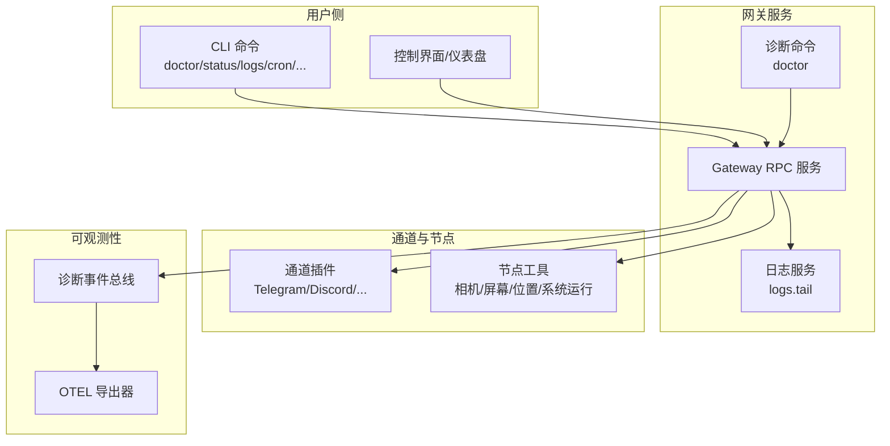
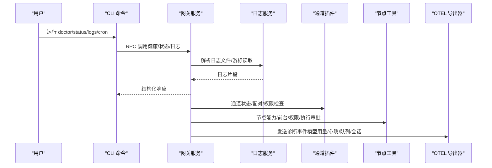
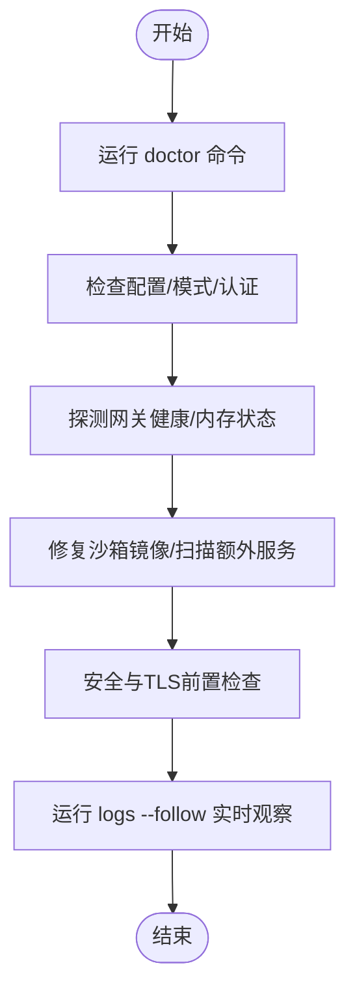
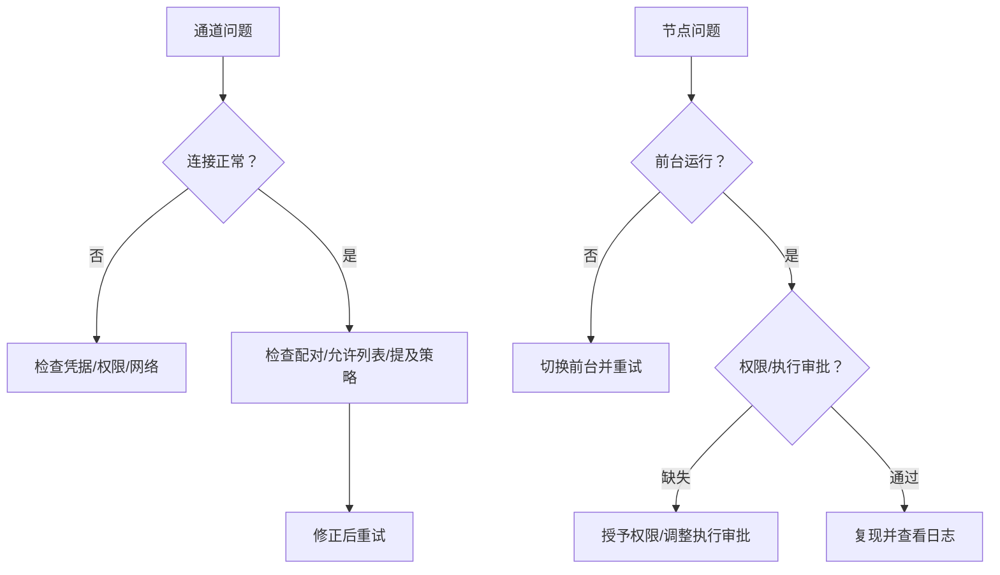
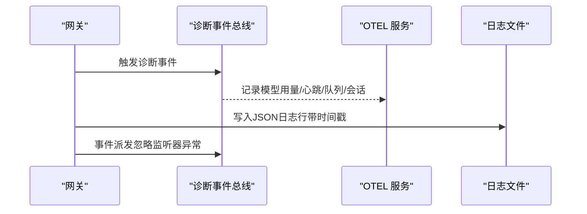
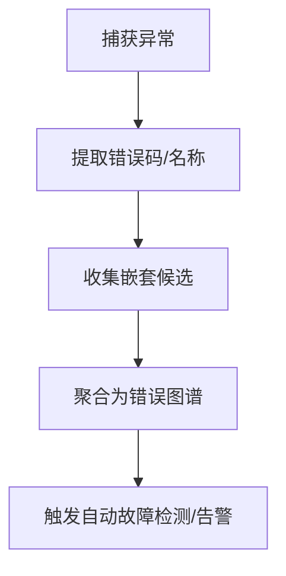
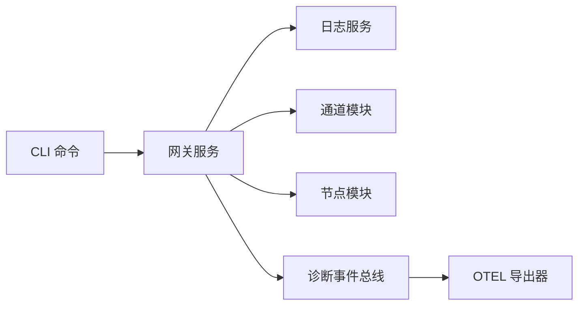

# 故障排除指南

<cite>
**本文引用的文件**
- [docs/help/troubleshooting.md](file://docs/help/troubleshooting.md)
- [docs/gateway/troubleshooting.md](file://docs/gateway/troubleshooting.md)
- [docs/channels/troubleshooting.md](file://docs/channels/troubleshooting.md)
- [docs/nodes/troubleshooting.md](file://docs/nodes/troubleshooting.md)
- [src/commands/doctor.ts](file://src/commands/doctor.ts)
- [src/gateway/server-methods/logs.ts](file://src/gateway/server-methods/logs.ts)
- [src/logging/logger.ts](file://src/logging/logger.ts)
- [src/infra/errors.ts](file://src/infra/errors.ts)
- [src/infra/diagnostic-events.ts](file://src/infra/diagnostic-events.ts)
- [src/logging/diagnostic.ts](file://src/logging/diagnostic.ts)
- [extensions/diagnostics-otel/src/service.ts](file://extensions/diagnostics-otel/src/service.ts)
- [docs/gateway/authentication.md](file://docs/gateway/authentication.md)
- [docs/automation/cron-vs-heartbeat.md](file://docs/automation/cron-vs-heartbeat.md)
</cite>

## 目录

1. [简介](#简介)
2. [项目结构](#项目结构)
3. [核心组件](#核心组件)
4. [架构总览](#架构总览)
5. [详细组件分析](#详细组件分析)
6. [依赖关系分析](#依赖关系分析)
7. [性能考量](#性能考量)
8. [故障排除指南](#故障排除指南)
9. [结论](#结论)
10. [附录](#附录)

## 简介

本指南面向OpenClaw平台集成场景，聚焦“连接问题、认证失败、消息延迟与性能问题”的系统化诊断与修复路径。内容覆盖：

- 快速三分钟排障流程（状态检查、探针、日志跟踪）
- 分层诊断：网关、通道、自动化、节点、浏览器工具
- 日志采集与分析、错误码解释、自动故障检测与可观测性扩展
- 平台差异与通用策略，帮助一线工程师快速定位根因并闭环修复

## 项目结构

OpenClaw通过CLI命令、网关服务、通道插件、节点工具与可观测性扩展协同工作。故障排除围绕以下关键路径展开：

- CLI诊断命令：doctor/status/logs等
- 网关RPC与日志服务：提供日志尾随、健康检查能力
- 通道与节点：按平台特性进行配对、权限与前台执行约束
- 可观测性：诊断事件、指标与日志导出到OTEL

图示来源

- [src/commands/doctor.ts](file://src/commands/doctor.ts)
- [src/gateway/server-methods/logs.ts](file://src/gateway/server-methods/logs.ts)
- [src/logging/diagnostic.ts](file://src/logging/diagnostic.ts)
- [extensions/diagnostics-otel/src/service.ts](file://extensions/diagnostics-otel/src/service.ts)

章节来源

- [docs/help/troubleshooting.md](file://docs/help/troubleshooting.md)
- [docs/gateway/troubleshooting.md](file://docs/gateway/troubleshooting.md)

## 核心组件

- CLI诊断命令：提供状态检查、网关健康、通道连通性、自动化调度与节点工具状态的统一入口
- 网关日志服务：支持滚动日志文件解析、游标分页读取与安全截断，便于实时尾随
- 诊断事件与可观测性：统一事件总线，支持模型用量、Webhook、消息队列、会话状态、心跳等事件记录，并可导出至OTEL
- 错误提取与归类：从异常对象中抽取错误码、名称与嵌套候选，辅助自动诊断与告警

章节来源

- [src/commands/doctor.ts](file://src/commands/doctor.ts)
- [src/gateway/server-methods/logs.ts](file://src/gateway/server-methods/logs.ts)
- [src/logging/diagnostic.ts](file://src/logging/diagnostic.ts)
- [src/infra/diagnostic-events.ts](file://src/infra/diagnostic-events.ts)
- [extensions/diagnostics-otel/src/service.ts](file://extensions/diagnostics-otel/src/service.ts)
- [src/infra/errors.ts](file://src/infra/errors.ts)

## 架构总览

下图展示从CLI到网关、通道与节点的关键交互，以及日志与诊断事件在系统中的流转。

图示来源

- [src/commands/doctor.ts](file://src/commands/doctor.ts)
- [src/gateway/server-methods/logs.ts](file://src/gateway/server-methods/logs.ts)
- [extensions/diagnostics-otel/src/service.ts](file://extensions/diagnostics-otel/src/service.ts)

## 详细组件分析

### 组件A：CLI诊断与健康检查

- 功能要点
  - doctor命令：版本提示、配置迁移、网关健康探测、内存搜索健康、沙箱镜像修复、安全与TLS前置检查、工作区建议等
  - logs命令：日志尾随、游标与字节限制、滚动日志解析
- 典型排障步骤
  - 使用doctor快速发现配置漂移、认证模式冲突、服务安装与守护进程问题
  - 使用logs --follow持续观察系统活动与重复致命错误

图示来源

- [src/commands/doctor.ts](file://src/commands/doctor.ts)
- [src/gateway/server-methods/logs.ts](file://src/gateway/server-methods/logs.ts)

章节来源

- [src/commands/doctor.ts](file://src/commands/doctor.ts)
- [src/gateway/server-methods/logs.ts](file://src/gateway/server-methods/logs.ts)

### 组件B：通道与节点排障

- 通道层面
  - 连接正常但消息不流动：检查配对状态、提及策略、允许列表、权限范围
  - 不同平台（Telegram/Discord/Slack/iMessage/Signal/Matrix）有差异化签名与修复清单
- 节点层面
  - 前台要求：iOS/Android上的相机/画布/屏幕录制需前台运行
  - 权限矩阵：相机/屏幕/位置/系统运行均需对应OS授权与执行审批
  - 配对与执行审批是两道不同闸门

图示来源

- [docs/channels/troubleshooting.md](file://docs/channels/troubleshooting.md)
- [docs/nodes/troubleshooting.md](file://docs/nodes/troubleshooting.md)

章节来源

- [docs/channels/troubleshooting.md](file://docs/channels/troubleshooting.md)
- [docs/nodes/troubleshooting.md](file://docs/nodes/troubleshooting.md)

### 组件C：日志系统与可观测性

- 日志系统
  - 滚动日志文件命名与清理、大小上限与抑制写入保护、外部传输注册
  - 网关日志服务支持游标分页、最大字节数与行数限制、文件不存在回退
- 诊断事件与OTEL导出
  - 诊断事件总线：统一事件类型（模型用量、Webhook、消息队列、会话、心跳等），监听器失败不影响主流程
  - OTEL导出：支持协议校验、端点规范化、采样率、服务名、指标与日志记录

图示来源

- [src/logging/diagnostic.ts](file://src/logging/diagnostic.ts)
- [src/infra/diagnostic-events.ts](file://src/infra/diagnostic-events.ts)
- [extensions/diagnostics-otel/src/service.ts](file://extensions/diagnostics-otel/src/service.ts)
- [src/logging/logger.ts](file://src/logging/logger.ts)
- [src/gateway/server-methods/logs.ts](file://src/gateway/server-methods/logs.ts)

章节来源

- [src/logging/logger.ts](file://src/logging/logger.ts)
- [src/gateway/server-methods/logs.ts](file://src/gateway/server-methods/logs.ts)
- [src/logging/diagnostic.ts](file://src/logging/diagnostic.ts)
- [src/infra/diagnostic-events.ts](file://src/infra/diagnostic-events.ts)
- [extensions/diagnostics-otel/src/service.ts](file://extensions/diagnostics-otel/src/service.ts)

### 组件D：错误码与自动故障检测

- 错误提取
  - 从异常对象中提取错误码（字符串/数字）、错误名称，支持收集嵌套候选以构建错误图谱
- 自动故障检测
  - 诊断事件总线对事件监听器异常进行吞吐处理，避免单个监听器失败影响整体可观测性
  - OTEL服务对事件处理器失败进行日志记录，保证可观测性链路健壮

图示来源

- [src/infra/errors.ts](file://src/infra/errors.ts)
- [src/infra/diagnostic-events.ts](file://src/infra/diagnostic-events.ts)
- [extensions/diagnostics-otel/src/service.ts](file://extensions/diagnostics-otel/src/service.ts)

章节来源

- [src/infra/errors.ts](file://src/infra/errors.ts)
- [src/infra/diagnostic-events.ts](file://src/infra/diagnostic-events.ts)
- [extensions/diagnostics-otel/src/service.ts](file://extensions/diagnostics-otel/src/service.ts)

## 依赖关系分析

- CLI命令依赖网关RPC与日志服务；网关依赖通道与节点模块；诊断事件与OTEL导出相互独立但共同增强可观测性
- 诊断事件总线对监听器异常进行隔离，确保系统稳定性
- OTEL导出器仅在启用且协议合法时启动，避免无效导出造成资源浪费

图示来源

- [src/commands/doctor.ts](file://src/commands/doctor.ts)
- [src/gateway/server-methods/logs.ts](file://src/gateway/server-methods/logs.ts)
- [src/logging/diagnostic.ts](file://src/logging/diagnostic.ts)
- [extensions/diagnostics-otel/src/service.ts](file://extensions/diagnostics-otel/src/service.ts)

章节来源

- [src/commands/doctor.ts](file://src/commands/doctor.ts)
- [src/gateway/server-methods/logs.ts](file://src/gateway/server-methods/logs.ts)
- [src/logging/diagnostic.ts](file://src/logging/diagnostic.ts)
- [extensions/diagnostics-otel/src/service.ts](file://extensions/diagnostics-otel/src/service.ts)

## 性能考量

- 日志滚动与截断：避免大文件导致I/O阻塞；通过游标与最大字节限制控制响应体积
- 诊断事件派发深度控制：防止递归过深导致栈溢出
- OTEL导出采样率与协议校验：在保证可观测性的同时降低带宽与CPU开销
- 自动化调度：优先使用心跳批量检查，减少高频轮询带来的API压力

## 故障排除指南

### 快速三分钟排障流程

- 执行顺序与预期信号
  - openclaw status：显示已配置通道，无明显认证错误
  - openclaw status --all：完整报告可分享
  - openclaw gateway probe：目标可达
  - openclaw gateway status：运行中且RPC探针正常
  - openclaw doctor：无阻塞性配置/服务问题
  - openclaw channels status --probe：通道显示已连接或就绪
  - openclaw logs --follow：活动稳定，无重复致命错误

章节来源

- [docs/help/troubleshooting.md](file://docs/help/troubleshooting.md)

### 连接问题

- 症状与排查
  - 网关无法启动或服务未运行：检查本地模式、绑定地址与认证配置是否匹配
  - 控制界面/仪表盘无法连接：确认URL、认证模式与安全上下文；识别设备身份/令牌不匹配与nonce相关错误
  - 通道连接但消息不流动：检查提及策略、允许列表与权限范围
- 常见日志签名
  - 设备身份/令牌不匹配、nonce不一致、签名无效或过期
  - mention required、pairing/pending、not_in_channel/missing_scope/Forbidden/401/403

章节来源

- [docs/gateway/troubleshooting.md](file://docs/gateway/troubleshooting.md)
- [docs/channels/troubleshooting.md](file://docs/channels/troubleshooting.md)

### 认证失败

- 常见原因
  - 认证模式冲突：同时配置了token与password且未显式指定模式
  - 设备令牌过期/撤销：需要重新批准或轮换设备令牌
  - 令牌漂移：共享令牌与设备令牌不同步
- 处理建议
  - 显式设置gateway.auth.mode，生成并配置网关token
  - 使用devices CLI列出/批准请求，必要时轮换设备令牌
  - 参考认证文档中的模型凭证管理与轮换行为

章节来源

- [src/commands/doctor.ts](file://src/commands/doctor.ts)
- [docs/gateway/troubleshooting.md](file://docs/gateway/troubleshooting.md)
- [docs/gateway/authentication.md](file://docs/gateway/authentication.md)

### 消息延迟与自动化问题

- 症状与排查
  - Cron未触发或心跳未送达：检查调度器状态、活跃时段与并发占用
  - 心跳被跳过：静默时段、请求在飞/告警禁用、DM策略阻断
- 建议
  - 使用cron status/list/runs查看最近执行结果
  - 合理配置心跳间隔与活跃时段，避免高负载时段密集触发

章节来源

- [docs/gateway/troubleshooting.md](file://docs/gateway/troubleshooting.md)
- [docs/automation/cron-vs-heartbeat.md](file://docs/automation/cron-vs-heartbeat.md)

### 节点与浏览器工具问题

- 节点工具
  - 前台要求：iOS/Android相机/画布/屏幕录制需前台运行
  - 权限缺失：相机/屏幕/位置权限未授予
  - 执行审批：系统运行被拒绝（需要审批或白名单不匹配）
- 浏览器工具
  - 本地浏览器启动失败、可执行路径错误、扩展中继未连接、attach-only配置不可达
- 处理建议
  - 重新批准设备配对、前台运行应用、授予OS权限、调整执行审批与允许列表
  - 检查浏览器可执行路径、CDP目标可达性与扩展中继状态

章节来源

- [docs/nodes/troubleshooting.md](file://docs/nodes/troubleshooting.md)
- [docs/gateway/troubleshooting.md](file://docs/gateway/troubleshooting.md)

### 日志分析与自动故障检测

- 日志采集
  - 使用logs --follow持续观察；结合doctor输出定位配置与服务问题
  - 网关日志服务支持游标分页与最大字节限制，适合生产环境实时监控
- 错误码解释
  - 从异常对象中提取错误码与名称，用于自动告警与根因定位
- 自动故障检测
  - 诊断事件总线对监听器异常进行吞吐处理，OTEL导出器记录事件处理器失败
  - 通过诊断事件统计Webhook接收/处理/错误、消息队列、会话状态与心跳，辅助自动检测

章节来源

- [src/gateway/server-methods/logs.ts](file://src/gateway/server-methods/logs.ts)
- [src/logging/logger.ts](file://src/logging/logger.ts)
- [src/infra/errors.ts](file://src/infra/errors.ts)
- [src/infra/diagnostic-events.ts](file://src/infra/diagnostic-events.ts)
- [extensions/diagnostics-otel/src/service.ts](file://extensions/diagnostics-otel/src/service.ts)

## 结论

本指南提供了从CLI到网关、通道、节点与可观测性的全链路故障排除方法。通过标准化的三分钟排障流程、分层诊断清单与日志/事件驱动的自动检测机制，可显著缩短平均修复时间并提升系统稳定性。建议在生产环境中启用诊断事件与OTEL导出，并结合doctor命令定期巡检配置与服务健康状态。

## 附录

- 平台特定注意事项
  - Linux守护进程：确保systemd用户linger开启，避免会话挂起导致网关停止
  - macOS隐私权限：iMessage/BlueBubbles需TCC授权与Webhook可达性
  - 移动端前台限制：相机/画布/屏幕录制需前台运行
- 通用策略
  - 优先使用心跳替代多任务轮询，降低API调用频率
  - 明确认证模式与令牌生命周期管理，避免模式冲突与令牌漂移
  - 定期运行doctor并关注安全与TLS前置检查提示
