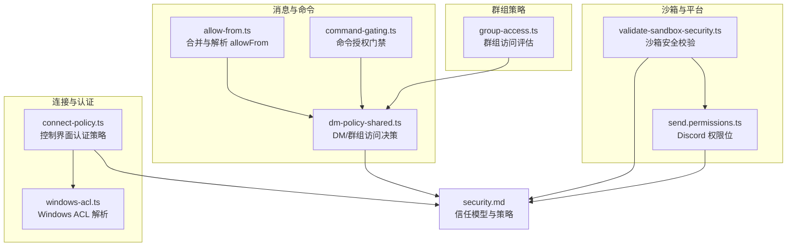
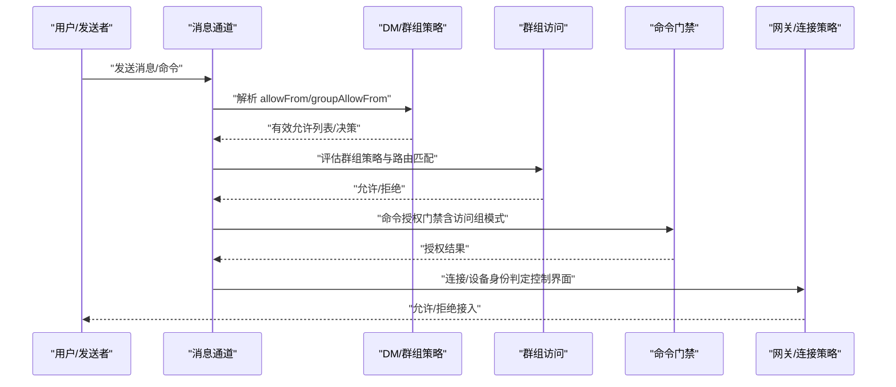
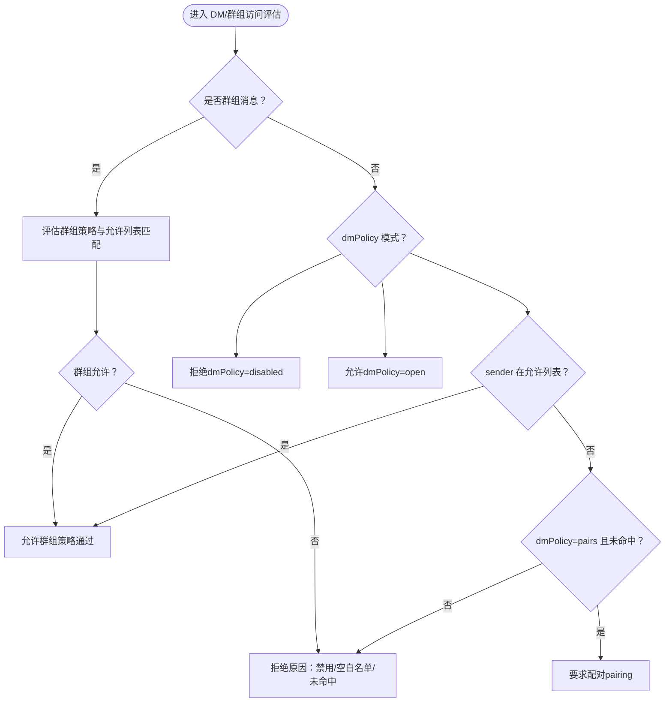
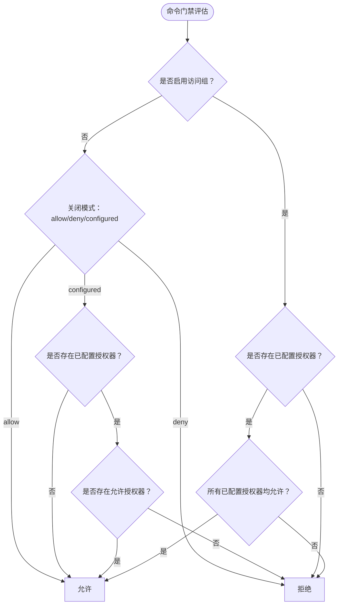
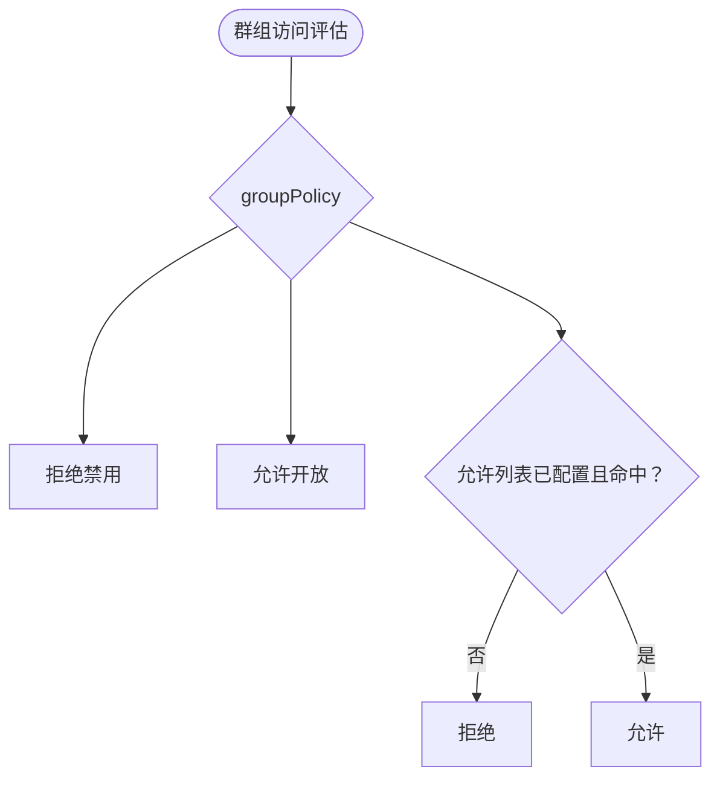
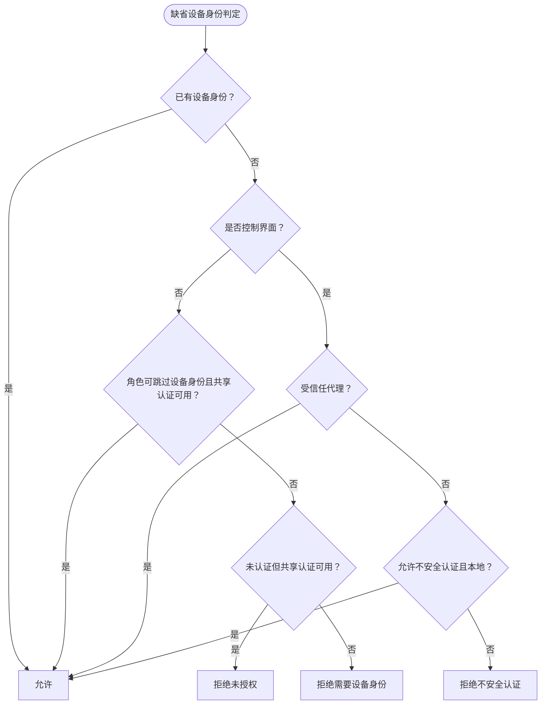
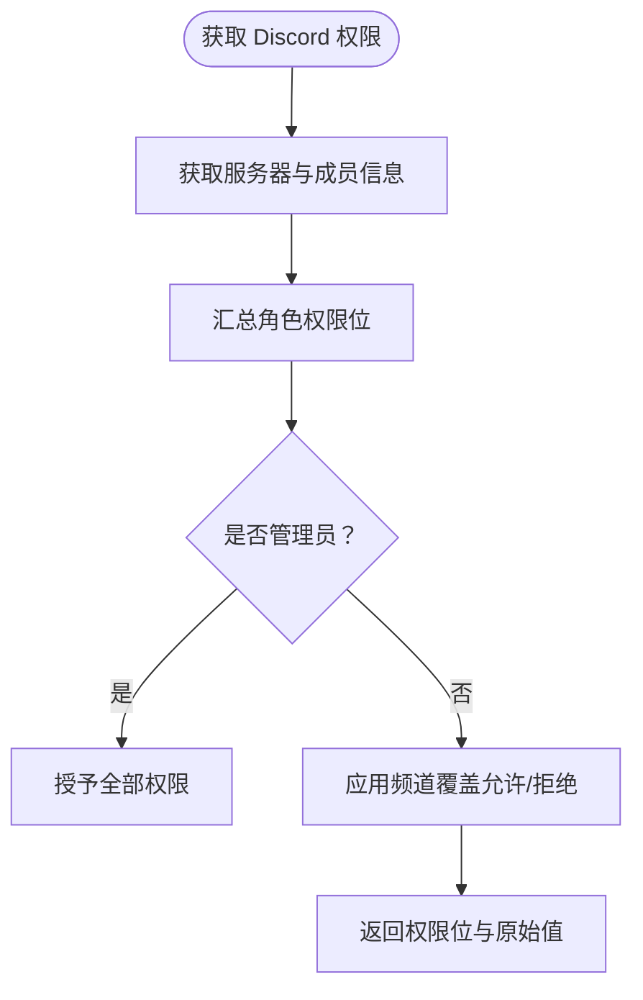
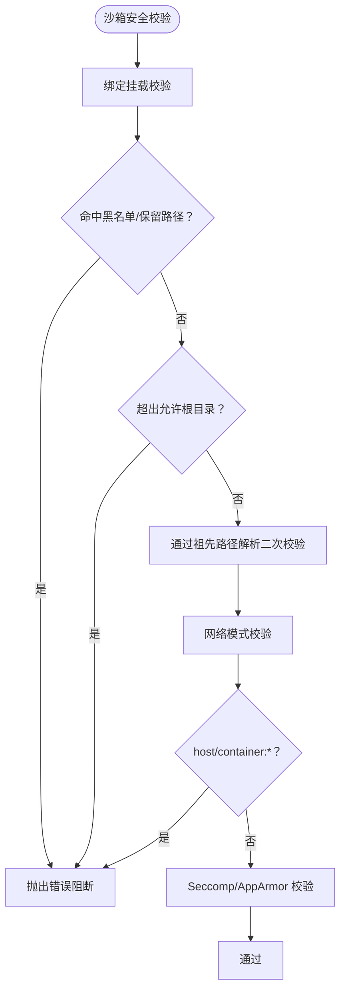
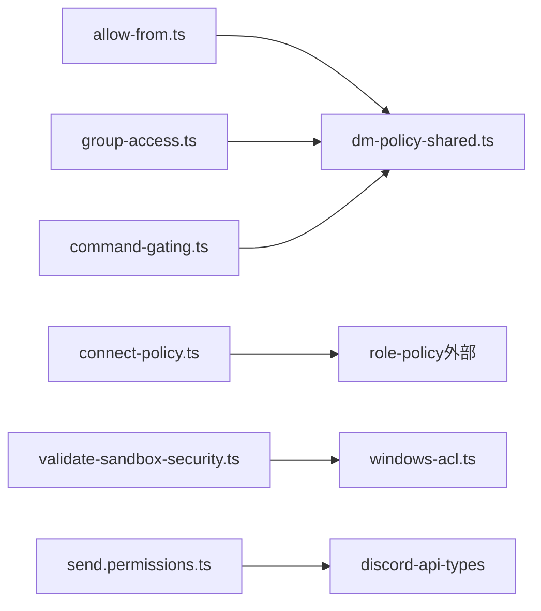

# 权限管理

<cite>
**本文引用的文件**
- [dm-policy-shared.ts](file://src/security/dm-policy-shared.ts)
- [command-gating.ts](file://src/channels/command-gating.ts)
- [group-access.ts](file://src/plugin-sdk/group-access.ts)
- [allow-from.ts](file://src/channels/allow-from.ts)
- [connect-policy.ts](file://src/gateway/server/ws-connection/connect-policy.ts)
- [windows-acl.ts](file://src/security/windows-acl.ts)
- [validate-sandbox-security.ts](file://src/agents/sandbox/validate-sandbox-security.ts)
- [send.permissions.ts](file://src/discord/send.permissions.ts)
- [security.md](file://SECURITY.md)
- [security.md（CLI）](file://docs/cli/security.md)
</cite>

## 目录

1. [简介](#简介)
2. [项目结构](#项目结构)
3. [核心组件](#核心组件)
4. [架构总览](#架构总览)
5. [详细组件分析](#详细组件分析)
6. [依赖关系分析](#依赖关系分析)
7. [性能考量](#性能考量)
8. [故障排除指南](#故障排除指南)
9. [结论](#结论)
10. [附录](#附录)

## 简介

本文件系统化梳理 OpenClaw 的权限管理机制，覆盖用户权限、群组权限、消息通道操作权限与访问控制列表（ACL）。内容包括：

- 权限模型与策略：DM（私信/群聊）策略、群组策略、命令授权门禁、连接认证策略
- 配置方法与继承规则：allowFrom、groupAllowFrom、存储来源、回退策略
- 动态权限调整：运行时策略解析、命令授权门禁模式、Web 控制界面配对豁免
- 安全边界与最佳实践：信任模型、沙箱安全校验、平台特定权限检查（如 Discord）
- 故障排除与调试：常见问题定位、日志与审计建议

## 项目结构

OpenClaw 将权限相关逻辑分布在多个子模块中：

- 消息通道与 DM 策略：合并允许列表、评估 DM/群组访问决策、命令授权门禁
- 群组访问控制：基于策略的允许/拒绝判定、路由级匹配
- 连接与设备身份：控制界面认证策略、缺省设备身份判定
- 平台特定权限：Discord 等渠道的权限位计算与覆盖
- 沙箱与主机 ACL：容器绑定挂载限制、网络模式阻断、Windows ACL 解析与摘要
- 安全策略与信任模型：整体安全策略、CLI 审计工具

图表来源

- [allow-from.ts:1-54](file://src/channels/allow-from.ts#L1-L54)
- [dm-policy-shared.ts:31-60](file://src/security/dm-policy-shared.ts#L31-L60)
- [command-gating.ts:31-46](file://src/channels/command-gating.ts#L31-L46)
- [group-access.ts:99-143](file://src/plugin-sdk/group-access.ts#L99-L143)
- [connect-policy.ts:12-33](file://src/gateway/server/ws-connection/connect-policy.ts#L12-L33)
- [windows-acl.ts:249-268](file://src/security/windows-acl.ts#L249-L268)
- [validate-sandbox-security.ts:18-37](file://src/agents/sandbox/validate-sandbox-security.ts#L18-L37)
- [send.permissions.ts:1-233](file://src/discord/send.permissions.ts#L1-L233)
- [security.md:88-171](file://SECURITY.md#L88-L171)

章节来源

- [dm-policy-shared.ts:31-60](file://src/security/dm-policy-shared.ts#L31-L60)
- [allow-from.ts:1-54](file://src/channels/allow-from.ts#L1-L54)
- [command-gating.ts:31-46](file://src/channels/command-gating.ts#L31-L46)
- [group-access.ts:99-143](file://src/plugin-sdk/group-access.ts#L99-L143)
- [connect-policy.ts:12-33](file://src/gateway/server/ws-connection/connect-policy.ts#L12-L33)
- [windows-acl.ts:249-268](file://src/security/windows-acl.ts#L249-L268)
- [validate-sandbox-security.ts:18-37](file://src/agents/sandbox/validate-sandbox-security.ts#L18-L37)
- [send.permissions.ts:1-233](file://src/discord/send.permissions.ts#L1-L233)
- [security.md:88-171](file://SECURITY.md#L88-L171)

## 核心组件

- 允许列表与来源合并
  - 合并 DM 允许列表来源（配置、存储、策略），并进行规范化处理
  - 计算群组允许列表（显式 groupAllowFrom 或回退到 allowFrom）
- DM/群组访问决策
  - 基于 dmPolicy（disabled/open/pairing/allowlist）与 groupPolicy（disabled/open/allowlist）综合判定
  - 支持多源有效允许列表与原因码输出
- 命令授权门禁
  - 在启用“访问组”模式下，仅当至少一个授权器被配置且允许时才放行
  - 支持在关闭访问组模式下的多种行为（允许/拒绝/取决于是否已配置）
- 群组路由与发送者访问
  - 路由级允许列表匹配、启用状态检查
  - 发送者级允许列表匹配、空白名单与缺失匹配输入的处理
- 连接与设备身份
  - 控制界面认证策略（允许不安全认证、危险地禁用设备认证）
  - 缺省设备身份判定（本地/远程、代理、共享认证等）
- 平台特定权限
  - Discord：基于角色与覆盖的权限位计算，支持管理员位快速放行
- 沙箱与主机 ACL
  - 绑定挂载黑名单、保留目标路径、网络模式阻断
  - Windows ACL 解析与摘要（可信/世界/组别分类）

章节来源

- [dm-policy-shared.ts:31-60](file://src/security/dm-policy-shared.ts#L31-L60)
- [dm-policy-shared.ts:105-196](file://src/security/dm-policy-shared.ts#L105-L196)
- [command-gating.ts:8-29](file://src/channels/command-gating.ts#L8-L29)
- [command-gating.ts:31-46](file://src/channels/command-gating.ts#L31-L46)
- [group-access.ts:99-143](file://src/plugin-sdk/group-access.ts#L99-L143)
- [group-access.ts:145-209](file://src/plugin-sdk/group-access.ts#L145-L209)
- [connect-policy.ts:12-33](file://src/gateway/server/ws-connection/connect-policy.ts#L12-L33)
- [connect-policy.ts:68-102](file://src/gateway/server/ws-connection/connect-policy.ts#L68-L102)
- [send.permissions.ts:57-233](file://src/discord/send.permissions.ts#L57-L233)
- [validate-sandbox-security.ts:18-37](file://src/agents/sandbox/validate-sandbox-security.ts#L18-L37)
- [windows-acl.ts:249-268](file://src/security/windows-acl.ts#L249-L268)

## 架构总览

OpenClaw 的权限体系以“策略 + 允许列表 + 授权门禁 + 平台适配 + 边界加固”为核心，形成从消息入口到执行层的多层防护。

图表来源

- [dm-policy-shared.ts:204-225](file://src/security/dm-policy-shared.ts#L204-L225)
- [group-access.ts:99-143](file://src/plugin-sdk/group-access.ts#L99-L143)
- [command-gating.ts:31-46](file://src/channels/command-gating.ts#L31-L46)
- [connect-policy.ts:68-102](file://src/gateway/server/ws-connection/connect-policy.ts#L68-L102)

## 详细组件分析

### DM 与群组访问控制

- 允许列表来源与合并
  - DM：允许列表可来自配置、存储（按策略决定是否读取）、以及规范化后的集合
  - 群组：优先使用显式 groupAllowFrom；若未配置且允许回退，则回退到 allowFrom
- 决策流程
  - 若为群组消息：先评估群组策略（disabled/open/allowlist），再根据是否命中允许列表决定放行或阻断
  - 若为私信/普通消息：依据 dmPolicy（disabled/open/pairing/allowlist）与 sender 是否在允许列表内判定
  - 支持返回详细原因码，便于审计与排错
- 命令授权集成
  - 当启用命令门禁时，结合 DM 与群组允许列表分别评估命令授权，并在群组场景下避免继承 DM 存储批准

图表来源

- [dm-policy-shared.ts:105-196](file://src/security/dm-policy-shared.ts#L105-L196)
- [dm-policy-shared.ts:227-292](file://src/security/dm-policy-shared.ts#L227-L292)

章节来源

- [dm-policy-shared.ts:31-60](file://src/security/dm-policy-shared.ts#L31-L60)
- [dm-policy-shared.ts:105-196](file://src/security/dm-policy-shared.ts#L105-L196)
- [dm-policy-shared.ts:227-292](file://src/security/dm-policy-shared.ts#L227-L292)
- [allow-from.ts:1-27](file://src/channels/allow-from.ts#L1-L27)

### 命令授权门禁

- 授权器（authorizer）由两部分组成：DM 允许列表与群组允许列表
- 门禁规则
  - 启用访问组模式：只有当至少一个授权器被配置且允许时才放行
  - 关闭访问组模式：默认允许；也可配置为“拒绝”或“取决于是否已配置”
- 控制命令拦截
  - 当存在控制类命令且未授权时，可选择拦截该命令

图表来源

- [command-gating.ts:8-29](file://src/channels/command-gating.ts#L8-L29)
- [command-gating.ts:31-46](file://src/channels/command-gating.ts#L31-L46)

章节来源

- [command-gating.ts:8-29](file://src/channels/command-gating.ts#L8-L29)
- [command-gating.ts:31-46](file://src/channels/command-gating.ts#L31-L46)

### 群组访问与路由匹配

- 发送者级评估
  - 禁用模式直接拒绝
  - 允许列表为空或未命中则拒绝
  - 允许列表命中则通过
- 路由级评估
  - 路由未启用则拒绝
  - 允许列表未配置或未命中则拒绝
  - 允许列表命中则通过

图表来源

- [group-access.ts:99-143](file://src/plugin-sdk/group-access.ts#L99-L143)
- [group-access.ts:145-209](file://src/plugin-sdk/group-access.ts#L145-L209)

章节来源

- [group-access.ts:99-143](file://src/plugin-sdk/group-access.ts#L99-L143)
- [group-access.ts:145-209](file://src/plugin-sdk/group-access.ts#L145-L209)

### 连接与设备身份（控制界面）

- 控制界面认证策略
  - 可配置允许不安全认证（localhost 场景），但不允许绕过安全上下文与设备认证
  - 危险地禁用设备认证可作为 break-glass 使用
- 缺省设备身份判定
  - 已有设备身份：允许
  - 控制界面且受信任代理：允许
  - 控制界面且未配置允许不安全认证或非本地：拒绝（不安全认证）
  - 角色可跳过设备身份且共享认证可用：允许
  - 未认证但具备共享认证：拒绝（未授权）
  - 其他情况：拒绝（需要设备身份）

图表来源

- [connect-policy.ts:68-102](file://src/gateway/server/ws-connection/connect-policy.ts#L68-L102)

章节来源

- [connect-policy.ts:12-33](file://src/gateway/server/ws-connection/connect-policy.ts#L12-L33)
- [connect-policy.ts:68-102](file://src/gateway/server/ws-connection/connect-policy.ts#L68-L102)

### 平台特定权限（Discord）

- 计算成员在服务器中的基础权限位，叠加角色权限
- 支持管理员位快速放行
- 应用频道级权限覆盖（允许/拒绝）
- 返回权限位集合与原始位字段，便于审计

图表来源

- [send.permissions.ts:57-233](file://src/discord/send.permissions.ts#L57-L233)

章节来源

- [send.permissions.ts:57-233](file://src/discord/send.permissions.ts#L57-L233)

### 沙箱与主机 ACL

- 绑定挂载安全
  - 黑名单路径（系统目录、Docker 套接字等）禁止挂载
  - 保留目标路径（工作区等）禁止覆盖
  - 非绝对源路径、超出允许根目录、覆盖系统根等均被阻断
- 网络模式阻断
  - host 模式与容器命名空间加入模式默认阻断
- Windows ACL
  - 解析icacls输出，分类可信/世界/组别条目
  - 提供重置命令生成与摘要格式化

图表来源

- [validate-sandbox-security.ts:96-117](file://src/agents/sandbox/validate-sandbox-security.ts#L96-L117)
- [validate-sandbox-security.ts:234-281](file://src/agents/sandbox/validate-sandbox-security.ts#L234-L281)
- [validate-sandbox-security.ts:283-306](file://src/agents/sandbox/validate-sandbox-security.ts#L283-L306)
- [windows-acl.ts:213-247](file://src/security/windows-acl.ts#L213-L247)

章节来源

- [validate-sandbox-security.ts:96-117](file://src/agents/sandbox/validate-sandbox-security.ts#L96-L117)
- [validate-sandbox-security.ts:234-281](file://src/agents/sandbox/validate-sandbox-security.ts#L234-L281)
- [validate-sandbox-security.ts:283-306](file://src/agents/sandbox/validate-sandbox-security.ts#L283-L306)
- [windows-acl.ts:213-247](file://src/security/windows-acl.ts#L213-L247)

## 依赖关系分析

- 模块耦合
  - dm-policy-shared.ts 依赖 allow-from.ts 与 group-access.ts，用于合并允许列表与评估群组策略
  - command-gating.ts 与 dm-policy-shared.ts 协作，实现命令授权门禁
  - connect-policy.ts 依赖 role-policy（外部模块）以判断角色是否可跳过设备身份
  - validate-sandbox-security.ts 与 windows-acl.ts 分别负责容器与主机侧安全
- 外部依赖
  - Discord 权限计算依赖 discord-api-types 的权限位常量
  - Windows ACL 依赖系统命令icacls与进程执行接口

图表来源

- [dm-policy-shared.ts:1-7](file://src/security/dm-policy-shared.ts#L1-L7)
- [allow-from.ts:1-10](file://src/channels/allow-from.ts#L1-L10)
- [command-gating.ts:1-4](file://src/channels/command-gating.ts#L1-L4)
- [connect-policy.ts:1-3](file://src/gateway/server/ws-connection/connect-policy.ts#L1-L3)
- [validate-sandbox-security.ts:1-15](file://src/agents/sandbox/validate-sandbox-security.ts#L1-L15)
- [windows-acl.ts:1-2](file://src/security/windows-acl.ts#L1-L2)
- [send.permissions.ts:1-5](file://src/discord/send.permissions.ts#L1-L5)

章节来源

- [dm-policy-shared.ts:1-7](file://src/security/dm-policy-shared.ts#L1-L7)
- [allow-from.ts:1-10](file://src/channels/allow-from.ts#L1-L10)
- [command-gating.ts:1-4](file://src/channels/command-gating.ts#L1-L4)
- [connect-policy.ts:1-3](file://src/gateway/server/ws-connection/connect-policy.ts#L1-L3)
- [validate-sandbox-security.ts:1-15](file://src/agents/sandbox/validate-sandbox-security.ts#L1-L15)
- [windows-acl.ts:1-2](file://src/security/windows-acl.ts#L1-L2)
- [send.permissions.ts:1-5](file://src/discord/send.permissions.ts#L1-L5)

## 性能考量

- 允许列表合并与规范化
  - 合并过程采用去重与标准化，避免重复匹配开销
- 命令门禁短路
  - 在关闭访问组模式下，优先短路允许/拒绝，减少后续授权器遍历
- 群组访问评估
  - 禁用与开放模式直接返回，避免不必要的允许列表匹配
- 沙箱校验
  - 字符串层面的快速检查先行，再进行路径解析与二次校验，平衡准确性与性能

[本节为通用指导，无需列出具体文件来源]

## 故障排除指南

- 常见问题与定位
  - DM/群组访问被拒绝
    - 检查 dmPolicy 与 groupPolicy 设置，确认允许列表是否为空或未命中
    - 使用原因码辅助定位（禁用、空白名单、未命中）
  - 命令未被授权
    - 确认访问组模式与授权器配置，检查是否有已配置且允许的授权器
    - 对于群组命令，避免误用 DM 存储批准
  - 控制界面无法接入
    - 检查是否启用了允许不安全认证且为本地客户端
    - 确认共享认证与角色是否允许跳过设备身份
  - Discord 权限异常
    - 核对服务器与成员权限位、管理员位、频道覆盖设置
- 审计与修复
  - 使用 CLI 审计工具进行安全扫描与修复建议
  - 针对沙箱配置、网络模式、绑定挂载进行修正
  - Windows 主机 ACL 异常可通过 ACL 摘要与重置命令排查

章节来源

- [dm-policy-shared.ts:62-75](file://src/security/dm-policy-shared.ts#L62-L75)
- [command-gating.ts:31-46](file://src/channels/command-gating.ts#L31-L46)
- [connect-policy.ts:68-102](file://src/gateway/server/ws-connection/connect-policy.ts#L68-L102)
- [send.permissions.ts:57-233](file://src/discord/send.permissions.ts#L57-L233)
- [security.md（CLI）:17-72](file://docs/cli/security.md#L17-L72)
- [validate-sandbox-security.ts:234-281](file://src/agents/sandbox/validate-sandbox-security.ts#L234-L281)
- [windows-acl.ts:249-268](file://src/security/windows-acl.ts#L249-L268)

## 结论

OpenClaw 的权限管理以“策略 + 允许列表 + 门禁 + 平台适配 + 边界加固”为主线，既满足个人助理的信任模型，又提供可配置的多层保护。通过合理的策略组合与运行时评估，可在保证易用性的同时提升安全性。建议在共享或多用户场景下启用沙箱、严格工具策略与最小权限原则，并定期使用 CLI 审计工具进行安全巡检。

[本节为总结性内容，无需列出具体文件来源]

## 附录

### 权限配置方法与继承规则

- 配置入口
  - allowFrom：顶层或通道/账户级 DM 允许列表
  - groupAllowFrom：群组级允许列表（优先于回退）
  - dmPolicy：DM 策略（disabled/open/pairing/allowlist）
  - groupPolicy：群组策略（disabled/open/allowlist）
- 继承与回退
  - 群组允许列表优先使用显式 groupAllowFrom；若未配置且允许回退，则回退到 allowFrom
  - DM 允许列表在 allowlist 策略下会忽略存储来源，其他策略下合并存储来源
- 命令授权
  - 在启用访问组模式下，需至少一个授权器被配置且允许
  - 关闭访问组模式时，可选择允许/拒绝/取决于是否已配置

章节来源

- [allow-from.ts:1-27](file://src/channels/allow-from.ts#L1-L27)
- [dm-policy-shared.ts:31-60](file://src/security/dm-policy-shared.ts#L31-L60)
- [dm-policy-shared.ts:227-292](file://src/security/dm-policy-shared.ts#L227-L292)
- [command-gating.ts:8-29](file://src/channels/command-gating.ts#L8-L29)

### 动态权限调整

- 运行时策略解析
  - 基于 provider 配置与默认策略，动态确定最终群组策略
- 命令门禁模式
  - 支持在关闭访问组模式下灵活选择允许/拒绝/取决于是否已配置
- 控制界面配对豁免
  - 受信任代理或危险地禁用设备认证可作为临时豁免手段

章节来源

- [group-access.ts:43-51](file://src/plugin-sdk/group-access.ts#L43-L51)
- [command-gating.ts:6-12](file://src/channels/command-gating.ts#L6-L12)
- [connect-policy.ts:35-44](file://src/gateway/server/ws-connection/connect-policy.ts#L35-L44)

### 最佳实践与安全建议

- 信任模型
  - 默认为个人助理模型，不假设多租户隔离
  - Session 标识为路由控制而非授权边界
- 沙箱与工具策略
  - 优先启用沙箱，严格限制工具与文件系统范围
  - 对弱模型与浏览器工具启用额外保护
- 审计与修复
  - 使用 CLI 审计工具定期扫描并应用安全修复
  - 关注危险参数与不安全配置项

章节来源

- [security.md:88-171](file://SECURITY.md#L88-L171)
- [security.md（CLI）:17-72](file://docs/cli/security.md#L17-L72)
