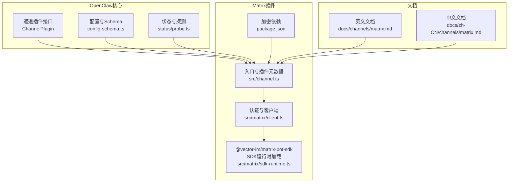
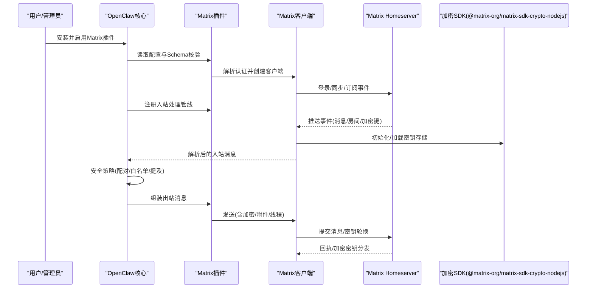
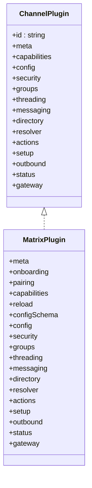
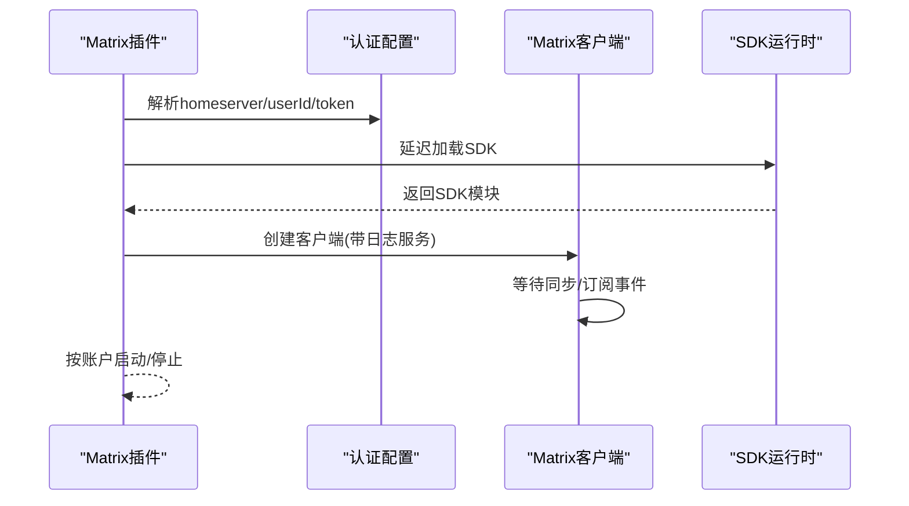
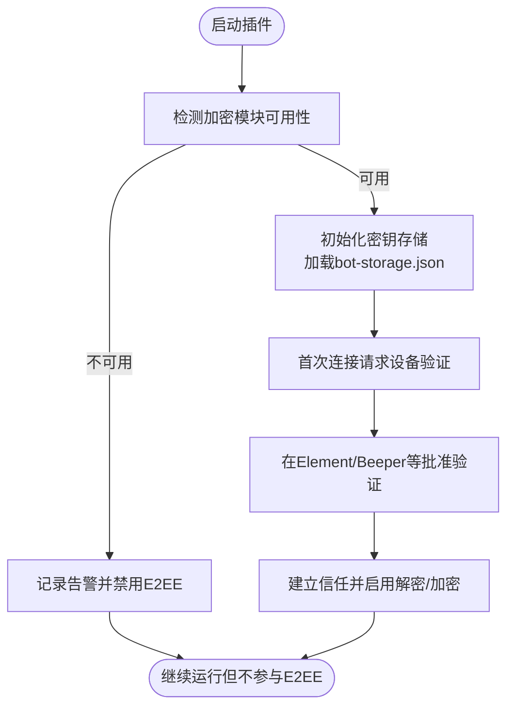
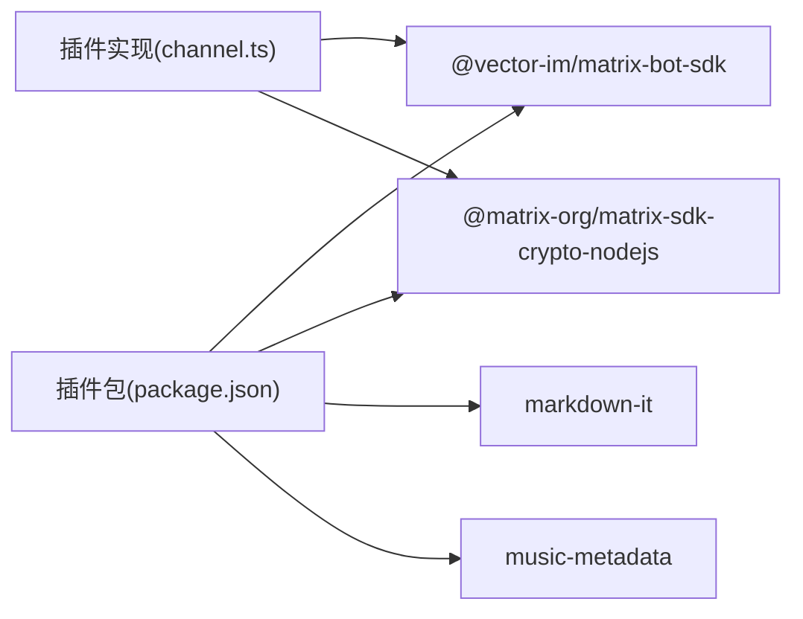

# Matrix网络平台

<cite>
**本文引用的文件**
- [docs/channels/matrix.md](file://docs/channels/matrix.md)
- [extensions/matrix/package.json](file://extensions/matrix/package.json)
- [extensions/matrix/src/channel.ts](file://extensions/matrix/src/channel.ts)
- [extensions/matrix/src/matrix/client.ts](file://extensions/matrix/src/matrix/client.ts)
- [extensions/matrix/src/matrix/sdk-runtime.ts](file://extensions/matrix/src/matrix/sdk-runtime.ts)
- [docs/zh-CN/channels/matrix.md](file://docs/zh-CN/channels/matrix.md)
</cite>

## 目录

1. [简介](#简介)
2. [项目结构](#项目结构)
3. [核心组件](#核心组件)
4. [架构总览](#架构总览)
5. [详细组件分析](#详细组件分析)
6. [依赖关系分析](#依赖关系分析)
7. [性能考量](#性能考量)
8. [故障排查指南](#故障排查指南)
9. [结论](#结论)
10. [附录](#附录)

## 简介

本文件面向在OpenClaw矩阵网络平台集成场景，系统化介绍Matrix去中心化消息协议的接入方式，覆盖以下主题：

- Homeserver配置与认证流程
- 房间管理与权限控制策略
- 端到端加密（E2EE）的启用与设备验证
- 分布式消息网络中的同步、加密与身份验证协同
- Matrix生态客户端兼容性（Element、Beeper等）
- 安全模型与隐私保护机制

目标是帮助开发者与运维人员快速完成从安装、配置到运行、排障的全链路实践。

## 项目结构

OpenClaw通过“插件化通道”扩展Matrix能力，核心由三部分组成：

- 文档与配置参考：位于docs目录，提供安装、配置、加密、多账号、路由与故障排查等说明
- 插件包定义：位于extensions/matrix，声明依赖、插件元数据与安装指引
- 核心通道实现：位于extensions/matrix/src，封装认证解析、客户端生命周期、入站处理、出站发送、目录与路由解析、状态探测等

图表来源

- [extensions/matrix/src/channel.ts:132-462](file://extensions/matrix/src/channel.ts#L132-L462)
- [extensions/matrix/src/matrix/client.ts:1-15](file://extensions/matrix/src/matrix/client.ts#L1-L15)
- [extensions/matrix/src/matrix/sdk-runtime.ts:1-19](file://extensions/matrix/src/matrix/sdk-runtime.ts#L1-L19)
- [extensions/matrix/package.json:1-42](file://extensions/matrix/package.json#L1-L42)
- [docs/channels/matrix.md:1-304](file://docs/channels/matrix.md#L1-L304)
- [docs/zh-CN/channels/matrix.md:78-132](file://docs/zh-CN/channels/matrix.md#L78-L132)

章节来源

- [extensions/matrix/src/channel.ts:132-462](file://extensions/matrix/src/channel.ts#L132-L462)
- [extensions/matrix/package.json:1-42](file://extensions/matrix/package.json#L1-L42)
- [docs/channels/matrix.md:1-304](file://docs/channels/matrix.md#L1-L304)
- [docs/zh-CN/channels/matrix.md:78-132](file://docs/zh-CN/channels/matrix.md#L78-L132)

## 核心组件

- 插件元数据与能力声明：定义通道ID、标签、文档路径、顺序、快速开始支持等
- 配置与Schema：集中校验与规范化Matrix配置项（homeserver、access token、密码、设备名、初始同步限制、线程回复模式、文本分片策略、DM/群组策略、自动加入、媒体上限、多账号等）
- 认证与客户端：解析账户认证信息、创建共享客户端、等待同步、停止客户端
- 状态与探测：账户级运行状态、探针结果汇总、单账户健康检查
- 出站发送与入站处理：统一的出站发送器、入站事件解析与安全策略执行
- 目录与路由：用户/房间目录查询、目标解析与路由

章节来源

- [extensions/matrix/src/channel.ts:45-54](file://extensions/matrix/src/channel.ts#L45-L54)
- [extensions/matrix/src/channel.ts:151-152](file://extensions/matrix/src/channel.ts#L151-L152)
- [extensions/matrix/src/channel.ts:308-368](file://extensions/matrix/src/channel.ts#L308-L368)
- [extensions/matrix/src/channel.ts:370-416](file://extensions/matrix/src/channel.ts#L370-L416)
- [extensions/matrix/src/channel.ts:417-461](file://extensions/matrix/src/channel.ts#L417-L461)
- [extensions/matrix/src/matrix/client.ts:1-15](file://extensions/matrix/src/matrix/client.ts#L1-L15)

## 架构总览

下图展示OpenClaw与Matrix Homeserver之间的交互，以及E2EE相关的关键节点：

图表来源

- [extensions/matrix/src/channel.ts:417-461](file://extensions/matrix/src/channel.ts#L417-L461)
- [extensions/matrix/src/matrix/client.ts:1-15](file://extensions/matrix/src/matrix/client.ts#L1-L15)
- [extensions/matrix/src/matrix/sdk-runtime.ts:1-19](file://extensions/matrix/src/matrix/sdk-runtime.ts#L1-L19)
- [docs/channels/matrix.md:111-132](file://docs/channels/matrix.md#L111-L132)

## 详细组件分析

### 插件入口与通道能力

- 入口导出ChannelPlugin实例，声明能力（聊天类型、投票、反应、线程、媒体）
- 配置Schema基于Zod构建，覆盖所有可配置项
- 安全策略：DM配对策略与群组策略警告收集
- 目录与路由：支持用户/房间目录查询与目标解析
- 状态与探测：账户快照、探针、运行时状态

图表来源

- [extensions/matrix/src/channel.ts:132-462](file://extensions/matrix/src/channel.ts#L132-L462)

章节来源

- [extensions/matrix/src/channel.ts:132-462](file://extensions/matrix/src/channel.ts#L132-L462)

### 认证与客户端生命周期

- 认证解析：支持access token与用户名+密码两种方式；token可持久化
- 客户端创建：共享客户端、等待同步、按账户停止
- SDK运行时：延迟加载@vector-im/matrix-bot-sdk，避免初始化循环

图表来源

- [extensions/matrix/src/matrix/client.ts:1-15](file://extensions/matrix/src/matrix/client.ts#L1-L15)
- [extensions/matrix/src/matrix/sdk-runtime.ts:1-19](file://extensions/matrix/src/matrix/sdk-runtime.ts#L1-L19)

章节来源

- [extensions/matrix/src/matrix/client.ts:1-15](file://extensions/matrix/src/matrix/client.ts#L1-L15)
- [extensions/matrix/src/matrix/sdk-runtime.ts:1-19](file://extensions/matrix/src/matrix/sdk-runtime.ts#L1-L19)

### 加密与设备验证流程

- 启用E2EE：通过配置开启，依赖Rust加密SDK
- 密钥存储：按账户+令牌哈希隔离存储于本地
- 设备验证：首次连接向其他会话请求验证，Element等客户端批准后建立信任与密钥共享
- 失败回退：若加密模块不可用，E2EE禁用并记录告警

图表来源

- [docs/channels/matrix.md:111-132](file://docs/channels/matrix.md#L111-L132)
- [docs/zh-CN/channels/matrix.md:111-132](file://docs/zh-CN/channels/matrix.md#L111-L132)

章节来源

- [docs/channels/matrix.md:111-132](file://docs/channels/matrix.md#L111-L132)
- [docs/zh-CN/channels/matrix.md:111-132](file://docs/zh-CN/channels/matrix.md#L111-L132)

### 房间管理与权限控制

- 默认策略：群组默认“允许白名单+提及触发”，可通过全局或账户级配置覆盖
- 房间白名单：支持房间ID/别名/名称（精确唯一匹配时解析为ID）
- 发送者限制：groupAllowFrom与每房间users进一步收窄
- 自动加入：always/allowlist/off三种策略，配合autoJoinAllowlist
- 公开房间：groupPolicy=open需显式allowFrom=“\*”

章节来源

- [docs/channels/matrix.md:195-224](file://docs/channels/matrix.md#L195-L224)
- [docs/zh-CN/channels/matrix.md:195-224](file://docs/zh-CN/channels/matrix.md#L195-L224)

### 多账号与路由模型

- 多账号：accounts数组，继承顶层配置并可逐账户覆盖
- 路由模型：私聊共享主会话，群组映射至群组会话；线程回复模式与回复上下文构建
- 目标解析：支持matrix:、room:、channel:、user:前缀与“@user:server”格式

章节来源

- [docs/channels/matrix.md:180-188](file://docs/channels/matrix.md#L180-L188)
- [extensions/matrix/src/channel.ts:189-201](file://extensions/matrix/src/channel.ts#L189-L201)
- [extensions/matrix/src/channel.ts:202-217](file://extensions/matrix/src/channel.ts#L202-L217)

### 客户端兼容性与生态

- 官方客户端：Element、Beeper等
- Beeper要求启用E2EE；Element用于批准设备验证
- 插件文档明确列出支持特性（私聊、群组、线程、媒体、E2EE、反应、投票、位置、原生命令）

章节来源

- [docs/channels/matrix.md:10-16](file://docs/channels/matrix.md#L10-L16)
- [docs/channels/matrix.md:76-78](file://docs/channels/matrix.md#L76-L78)

## 依赖关系分析

- 运行时SDK：@vector-im/matrix-bot-sdk（延迟加载）
- 加密SDK：@matrix-org/matrix-sdk-crypto-nodejs（E2EE功能）
- 工具库：markdown-it、music-metadata（媒体解析）
- 插件元数据：openclaw字段定义安装源、文档路径、选择标签等

图表来源

- [extensions/matrix/package.json:6-13](file://extensions/matrix/package.json#L6-L13)
- [extensions/matrix/src/channel.ts:132-462](file://extensions/matrix/src/channel.ts#L132-L462)

章节来源

- [extensions/matrix/package.json:1-42](file://extensions/matrix/package.json#L1-L42)
- [extensions/matrix/src/channel.ts:132-462](file://extensions/matrix/src/channel.ts#L132-L462)

## 性能考量

- 初始同步限制：通过initialSyncLimit控制初次拉取量，平衡启动速度与历史覆盖
- 文本分片：textChunkLimit与chunkMode（长度/按换行）减少超长消息失败率
- 媒体上限：mediaMaxMb限制入站/出站媒体大小，避免资源占用过高
- 启动串行化：多账号启动序列化，避免并发动态导入导致的初始化竞争

章节来源

- [extensions/matrix/src/channel.ts:287-290](file://extensions/matrix/src/channel.ts#L287-L290)
- [extensions/matrix/src/channel.ts:426-438](file://extensions/matrix/src/channel.ts#L426-L438)

## 故障排查指南

- 基础检查：状态、网关状态、日志跟踪、医生诊断、通道探测
- 配对状态：查看并批准Matrix配对码
- 常见问题：
  - 房间消息被忽略：群组策略或房间白名单未放行
  - 私聊被忽略：发送者处于配对待审批状态
  - 加密房间异常：加密模块缺失或配置不一致

章节来源

- [docs/channels/matrix.md:248-273](file://docs/channels/matrix.md#L248-L273)

## 结论

OpenClaw通过插件化通道将Matrix深度集成至分布式消息网络，提供：

- 灵活的Homeserver与认证配置
- 可控的房间与发送者白名单策略
- 可选的端到端加密与设备验证
- 多账号与线程化的消息路由
- 完整的文档与故障排查路径

建议在生产环境优先启用E2EE并严格配置白名单，结合多账号与线程策略实现高可用、可审计的消息网络。

## 附录

### 快速开始清单

- 安装插件并启用
- 准备Matrix账号与访问令牌（或用户名+密码）
- 配置homeserver与可选的设备名、初始同步限制
- 启用E2EE并完成设备验证
- 配置DM/群组策略与自动加入规则
- 启动并进行通道探测

章节来源

- [docs/channels/matrix.md:39-78](file://docs/channels/matrix.md#L39-L78)
- [docs/channels/matrix.md:80-109](file://docs/channels/matrix.md#L80-L109)
