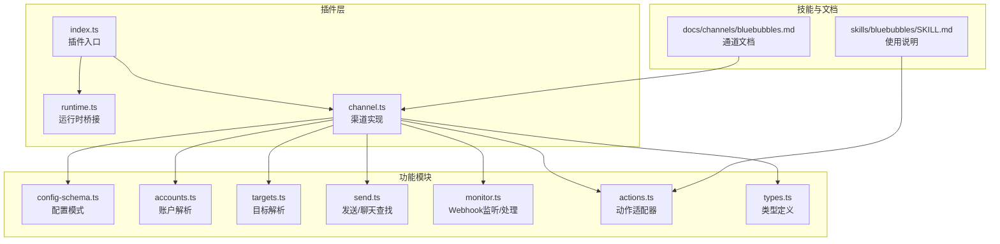
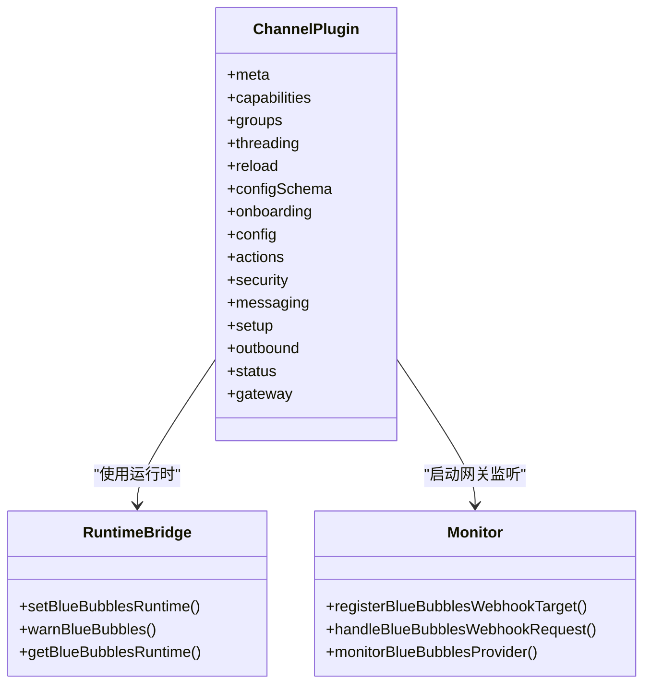
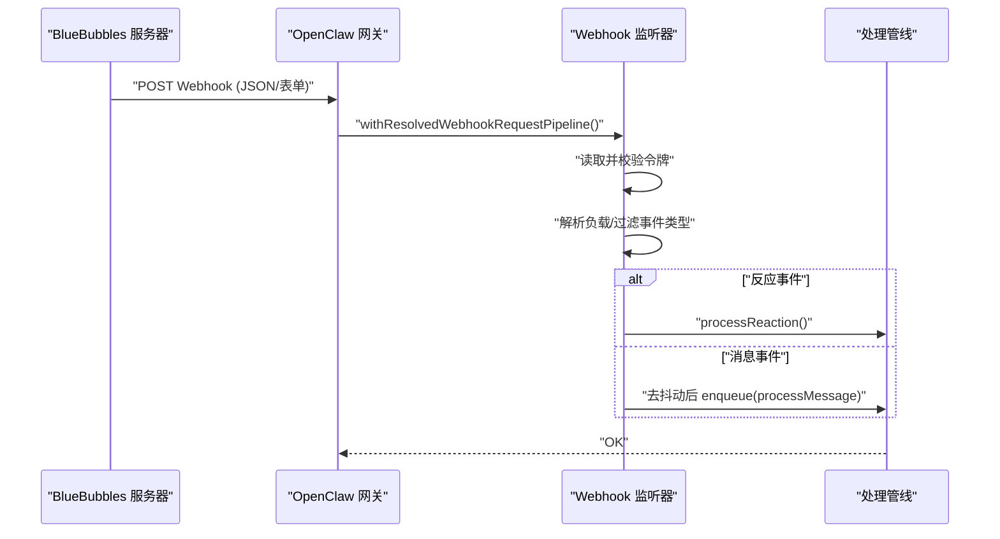
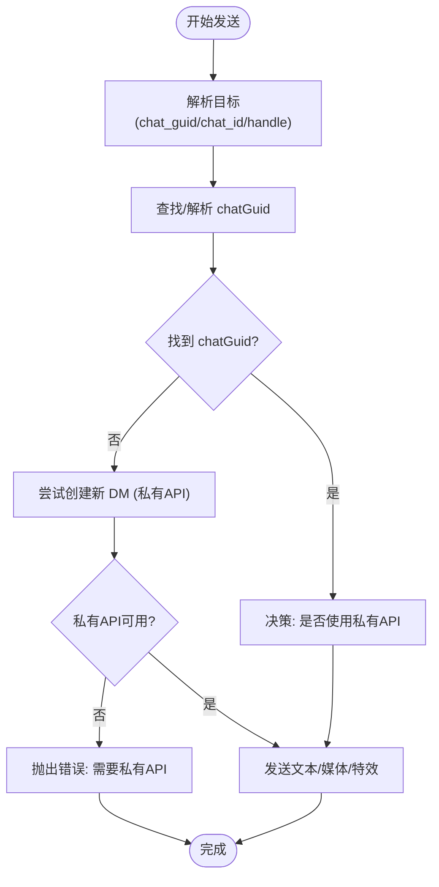
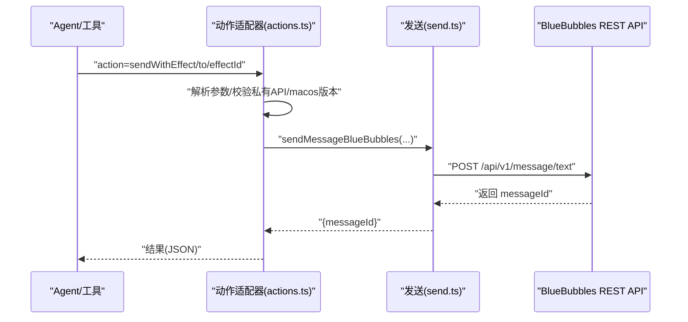
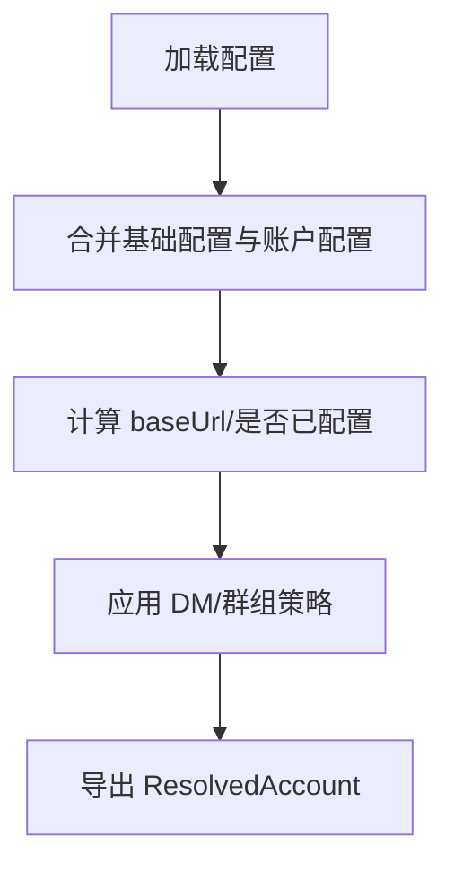
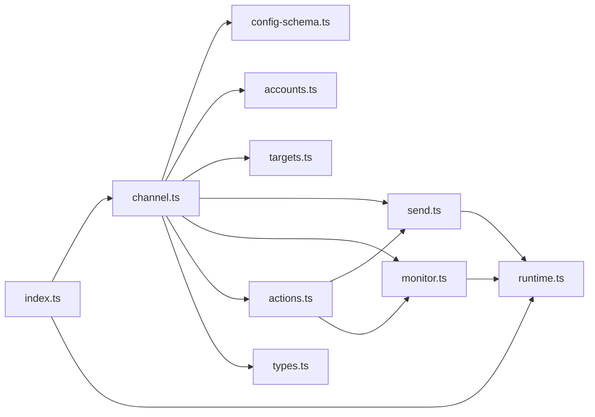

# BlueBubbles企业版集成

<cite>
**本文档引用的文件**
- [extensions/bluebubbles/README.md](file://extensions/bluebubbles/README.md)
- [extensions/bluebubbles/index.ts](file://extensions/bluebubbles/index.ts)
- [extensions/bluebubbles/src/channel.ts](file://extensions/bluebubbles/src/channel.ts)
- [extensions/bluebubbles/src/config-schema.ts](file://extensions/bluebubbles/src/config-schema.ts)
- [extensions/bluebubbles/src/send.ts](file://extensions/bluebubbles/src/send.ts)
- [extensions/bluebubbles/src/monitor.ts](file://extensions/bluebubbles/src/monitor.ts)
- [extensions/bluebubbles/src/runtime.ts](file://extensions/bluebubbles/src/runtime.ts)
- [extensions/bluebubbles/src/actions.ts](file://extensions/bluebubbles/src/actions.ts)
- [extensions/bluebubbles/src/accounts.ts](file://extensions/bluebubbles/src/accounts.ts)
- [extensions/bluebubbles/src/targets.ts](file://extensions/bluebubbles/src/targets.ts)
- [extensions/bluebubbles/src/types.ts](file://extensions/bluebubbles/src/types.ts)
- [skills/bluebubbles/SKILL.md](file://skills/bluebubbles/SKILL.md)
- [docs/channels/bluebubbles.md](file://docs/channels/bluebubbles.md)
</cite>

## 目录

1. [简介](#简介)
2. [项目结构](#项目结构)
3. [核心组件](#核心组件)
4. [架构总览](#架构总览)
5. [详细组件分析](#详细组件分析)
6. [依赖关系分析](#依赖关系分析)
7. [性能考虑](#性能考虑)
8. [故障排除指南](#故障排除指南)
9. [结论](#结论)
10. [附录](#附录)

## 简介

本指南面向企业级部署与运维团队，系统性阐述如何在企业环境中集成 BlueBubbles（macOS 上的 iMessage 服务）作为 OpenClaw 的外部通道插件。文档覆盖以下关键主题：

- BlueBubbles 服务器配置与网关对接
- iOS 设备与 BlueBubbles 的连接与配对
- 消息路由机制与 Webhook 处理
- 企业部署架构与多账户管理
- 用户管理与权限控制（DM/群组）
- BlueBubbles API 集成与设备配对流程
- 消息同步处理与媒体附件
- 企业环境中的部署策略、安全配置与监控方案

## 项目结构

BlueBubbles 插件位于扩展目录中，采用“插件入口 + 渠道实现 + Webhook 监听 + 运行时桥接”的分层设计。核心文件职责如下：

- 扩展入口：注册插件、设置运行时、注册渠道
- 渠道实现：能力声明、配置模式、消息发送/接收、安全策略
- Webhook 监听：认证、去抖动、消息/反应处理
- 运行时桥接：全局运行时存储与日志输出
- 配置与目标解析：多账户配置、目标地址解析、类型定义
- 动作适配器：工具动作到 BlueBubbles API 的映射



**图表来源**

- [extensions/bluebubbles/index.ts:1-18](file://extensions/bluebubbles/index.ts#L1-L18)
- [extensions/bluebubbles/src/channel.ts:1-392](file://extensions/bluebubbles/src/channel.ts#L1-L392)
- [extensions/bluebubbles/src/config-schema.ts:1-72](file://extensions/bluebubbles/src/config-schema.ts#L1-L72)
- [extensions/bluebubbles/src/accounts.ts:1-73](file://extensions/bluebubbles/src/accounts.ts#L1-L73)
- [extensions/bluebubbles/src/targets.ts:1-368](file://extensions/bluebubbles/src/targets.ts#L1-L368)
- [extensions/bluebubbles/src/send.ts:1-473](file://extensions/bluebubbles/src/send.ts#L1-L473)
- [extensions/bluebubbles/src/monitor.ts:1-316](file://extensions/bluebubbles/src/monitor.ts#L1-L316)
- [extensions/bluebubbles/src/actions.ts:1-446](file://extensions/bluebubbles/src/actions.ts#L1-L446)
- [extensions/bluebubbles/src/types.ts:1-138](file://extensions/bluebubbles/src/types.ts#L1-L138)
- [skills/bluebubbles/SKILL.md:1-132](file://skills/bluebubbles/SKILL.md#L1-L132)
- [docs/channels/bluebubbles.md:1-348](file://docs/channels/bluebubbles.md#L1-L348)

**章节来源**

- [extensions/bluebubbles/README.md:1-46](file://extensions/bluebubbles/README.md#L1-L46)
- [extensions/bluebubbles/index.ts:1-18](file://extensions/bluebubbles/index.ts#L1-L18)
- [extensions/bluebubbles/src/channel.ts:1-392](file://extensions/bluebubbles/src/channel.ts#L1-L392)

## 核心组件

- 插件入口与注册
  - 负责设置运行时、注册 BlueBubbles 渠道，并导出插件元数据。
- 渠道实现（ChannelPlugin）
  - 声明支持的聊天类型（个人/群组）、能力（媒体/反应/编辑/撤回/回复/特效/群组管理）
  - 提供配置模式、账户管理、安全策略、消息目标解析、配对流程、出站发送等能力
- Webhook 监听器（monitor）
  - 注册受保护的 webhook 路由，进行令牌认证、负载解析、事件去抖动与路由
- 发送与目标解析（send + targets）
  - 解析目标（chat_guid/chat_id/chat_identifier/handle），查找聊天 GUID，发送文本/媒体/特效，处理新 DM 创建
- 动作适配器（actions）
  - 将通用工具动作映射到 BlueBubbles API，包括 react/edit/unsend/reply/sendWithEffect/renameGroup/setGroupIcon/addParticipant/removeParticipant/leaveGroup/sendAttachment 等
- 配置与账户（config-schema + accounts）
  - 定义多账户配置模式、默认账户解析、密码/URL/路径等字段校验
- 类型与运行时（types + runtime）
  - 统一类型定义（URL 构造、超时请求、账户配置、动作配置等），运行时桥接用于日志与警告输出

**章节来源**

- [extensions/bluebubbles/src/channel.ts:65-392](file://extensions/bluebubbles/src/channel.ts#L65-L392)
- [extensions/bluebubbles/src/monitor.ts:27-316](file://extensions/bluebubbles/src/monitor.ts#L27-L316)
- [extensions/bluebubbles/src/send.ts:361-473](file://extensions/bluebubbles/src/send.ts#L361-L473)
- [extensions/bluebubbles/src/actions.ts:72-446](file://extensions/bluebubbles/src/actions.ts#L72-L446)
- [extensions/bluebubbles/src/config-schema.ts:32-72](file://extensions/bluebubbles/src/config-schema.ts#L32-L72)
- [extensions/bluebubbles/src/accounts.ts:46-73](file://extensions/bluebubbles/src/accounts.ts#L46-L73)
- [extensions/bluebubbles/src/types.ts:103-138](file://extensions/bluebubbles/src/types.ts#L103-L138)
- [extensions/bluebubbles/src/runtime.ts:1-30](file://extensions/bluebubbles/src/runtime.ts#L1-L30)

## 架构总览

下图展示 BlueBubbles 在企业环境中的端到端集成架构：OpenClaw 网关通过 BlueBubbles REST API 发送/接收消息，Webhook 接收来自 BlueBubbles 的入站事件；配对与权限控制贯穿 DM 与群组场景。

```mermaid
graph TB
subgraph "企业网关"
GW["OpenClaw 网关"]
RT["运行时桥接(runtime.ts)"]
CH["渠道(channel.ts)"]
MON["Webhook 监听(monitor.ts)"]
ACT["动作适配器(actions.ts)"]
SEND["发送(send.ts)"]
TGT["目标解析(targets.ts)"]
end
subgraph "BlueBubbles 服务器"
BB["BlueBubbles macOS 应用"]
API["REST API (/api/v1/*)"]
WH["Webhook 回调"]
end
subgraph "企业网络"
SEC["防火墙/代理/HTTPS"]
TRUST["可信代理配置"]
end
GW --> CH
CH --> RT
CH --> MON
CH --> ACT
CH --> SEND
CH --> TGT
GW <- --> BB
BB --> API
BB --> WH
SEC --> GW
TRUST --> GW
```

**图表来源**

- [extensions/bluebubbles/src/channel.ts:369-391](file://extensions/bluebubbles/src/channel.ts#L369-L391)
- [extensions/bluebubbles/src/monitor.ts:265-316](file://extensions/bluebubbles/src/monitor.ts#L265-L316)
- [extensions/bluebubbles/src/send.ts:453-472](file://extensions/bluebubbles/src/send.ts#L453-L472)
- [docs/channels/bluebubbles.md:1-348](file://docs/channels/bluebubbles.md#L1-L348)

## 详细组件分析

### 渠道插件（ChannelPlugin）分析

- 能力与特性
  - 支持聊天类型：direct/group
  - 支持能力：media、reactions、edit、unsend、reply、effects、groupManagement
- 配置与账户
  - 使用构建好的配置模式，支持多账户、默认账户、启用/删除账户、描述账户快照
  - 允许按账户覆盖 DM/群组策略与允许列表
- 安全策略
  - DM 策略：基于账户作用域的安全策略构建，支持 allowlist/open/disabled
  - 群组策略：支持 requireMention 与工具策略覆盖
- 目标解析与显示
  - 支持多种目标格式（chat_guid/chat_id/chat_identifier/handle），并提供显示名格式化
- 出站发送
  - 文本/媒体发送，支持回复线程与消息特效
  - 自动创建 DM（需要 BlueBubbles 私有 API）
- 状态与健康检查
  - 健康探测、运行状态汇总、账户快照构建



**图表来源**

- [extensions/bluebubbles/src/channel.ts:65-392](file://extensions/bluebubbles/src/channel.ts#L65-L392)
- [extensions/bluebubbles/src/runtime.ts:1-30](file://extensions/bluebubbles/src/runtime.ts#L1-L30)
- [extensions/bluebubbles/src/monitor.ts:31-316](file://extensions/bluebubbles/src/monitor.ts#L31-L316)

**章节来源**

- [extensions/bluebubbles/src/channel.ts:65-392](file://extensions/bluebubbles/src/channel.ts#L65-L392)
- [extensions/bluebubbles/src/runtime.ts:1-30](file://extensions/bluebubbles/src/runtime.ts#L1-L30)

### Webhook 流程（入站消息与反应）

- 认证与路由
  - 通过插件路由注册受保护的 webhook，使用密码或 GUID 进行令牌比较
  - 支持多种头部与查询参数（x-password/x-guid/authorization/password/guid）
- 负载解析与事件过滤
  - 解析 JSON 或表单 payload，过滤非允许事件类型
  - 反应事件需包含有效反应信息
- 去抖动与处理
  - 对消息事件进行去抖动合并，避免重复/乱序事件
  - 反应事件直接进入处理流程
- 状态更新
  - 更新最后入站时间，记录 verbose 日志



**图表来源**

- [extensions/bluebubbles/src/monitor.ts:120-263](file://extensions/bluebubbles/src/monitor.ts#L120-L263)

**章节来源**

- [extensions/bluebubbles/src/monitor.ts:1-316](file://extensions/bluebubbles/src/monitor.ts#L1-L316)

### 发送流程（出站消息与媒体）

- 目标解析
  - 支持 chat_guid/chat_id/chat_identifier/handle，自动查找 chatGuid
  - 若目标为 handle 且无现有 DM，可尝试创建新 DM（需要私有 API）
- 私有 API 决策
  - 根据是否需要回复线程/特效决定是否使用私有 API
  - 若私有 API 禁用但需要私有功能，抛出错误
- 文本发送
  - 支持回复线程与消息特效（通过 effectId 映射）
- 媒体发送
  - 支持 buffer/filename/contentType/caption/asVoice（语音备忘）



**图表来源**

- [extensions/bluebubbles/src/send.ts:224-473](file://extensions/bluebubbles/src/send.ts#L224-L473)

**章节来源**

- [extensions/bluebubbles/src/send.ts:1-473](file://extensions/bluebubbles/src/send.ts#L1-L473)

### 动作适配器（工具动作到 BlueBubbles API）

- 支持动作集合
  - react、edit、unsend、reply、sendWithEffect、renameGroup、setGroupIcon、addParticipant、removeParticipant、leaveGroup、sendAttachment
- 行为约束
  - 私有 API 动作在私有 API 禁用时被禁用
  - macOS 26+ 上 edit 不再支持
- 参数解析与上下文
  - 支持从参数或会话上下文解析 chatGuid/to
  - 支持短消息 ID 到完整 GUID 的解析



**图表来源**

- [extensions/bluebubbles/src/actions.ts:101-322](file://extensions/bluebubbles/src/actions.ts#L101-L322)
- [extensions/bluebubbles/src/send.ts:453-472](file://extensions/bluebubbles/src/send.ts#L453-L472)

**章节来源**

- [extensions/bluebubbles/src/actions.ts:1-446](file://extensions/bluebubbles/src/actions.ts#L1-L446)

### 配置与多账户管理

- 配置模式
  - 支持多账户、默认账户、启用/删除账户、密码/URL/路径/策略/历史限制/文本分块/媒体限制等
  - 支持 per-group 配置（requireMention/tools）
- 账户解析
  - 合并基础配置与账户级配置，计算 baseUrl/是否已配置
- 安全策略
  - DM 策略与群组策略，支持 allowlist/open/disabled
  - per-group 策略覆盖



**图表来源**

- [extensions/bluebubbles/src/config-schema.ts:32-72](file://extensions/bluebubbles/src/config-schema.ts#L32-L72)
- [extensions/bluebubbles/src/accounts.ts:46-73](file://extensions/bluebubbles/src/accounts.ts#L46-L73)

**章节来源**

- [extensions/bluebubbles/src/config-schema.ts:1-72](file://extensions/bluebubbles/src/config-schema.ts#L1-L72)
- [extensions/bluebubbles/src/accounts.ts:1-73](file://extensions/bluebubbles/src/accounts.ts#L1-L73)

### 目标解析与显示

- 支持多种前缀与格式：chat_id/chat_guid/chat_identifier/service 前缀、group:、原始 chat_guid、邮箱/电话号码
- 规范化 handle，提取 DM chat_guid 中的 handle 以简化匹配
- 格式化显示名：优先从 display 或 target 中提取干净的显示名

**章节来源**

- [extensions/bluebubbles/src/targets.ts:1-368](file://extensions/bluebubbles/src/targets.ts#L1-L368)

## 依赖关系分析

- 插件入口依赖渠道实现与运行时桥接
- 渠道实现依赖配置模式、账户解析、目标解析、发送模块、Webhook 监听、动作适配器、类型定义
- Webhook 监听依赖运行时与插件 SDK 的 webhook 工具
- 发送模块依赖运行时、目标解析、类型定义与探针（私有 API 状态）
- 动作适配器依赖发送模块、目标解析、探针与监控模块（消息 ID 解析）



**图表来源**

- [extensions/bluebubbles/index.ts:1-18](file://extensions/bluebubbles/index.ts#L1-L18)
- [extensions/bluebubbles/src/channel.ts:1-392](file://extensions/bluebubbles/src/channel.ts#L1-L392)
- [extensions/bluebubbles/src/monitor.ts:1-316](file://extensions/bluebubbles/src/monitor.ts#L1-L316)
- [extensions/bluebubbles/src/send.ts:1-473](file://extensions/bluebubbles/src/send.ts#L1-L473)
- [extensions/bluebubbles/src/actions.ts:1-446](file://extensions/bluebubbles/src/actions.ts#L1-L446)
- [extensions/bluebubbles/src/runtime.ts:1-30](file://extensions/bluebubbles/src/runtime.ts#L1-L30)
- [extensions/bluebubbles/src/config-schema.ts:1-72](file://extensions/bluebubbles/src/config-schema.ts#L1-L72)
- [extensions/bluebubbles/src/accounts.ts:1-73](file://extensions/bluebubbles/src/accounts.ts#L1-L73)
- [extensions/bluebubbles/src/targets.ts:1-368](file://extensions/bluebubbles/src/targets.ts#L1-L368)
- [extensions/bluebubbles/src/types.ts:1-138](file://extensions/bluebubbles/src/types.ts#L1-L138)

**章节来源**

- [extensions/bluebubbles/index.ts:1-18](file://extensions/bluebubbles/index.ts#L1-L18)
- [extensions/bluebubbles/src/channel.ts:1-392](file://extensions/bluebubbles/src/channel.ts#L1-L392)

## 性能考虑

- Webhook 去抖动：对快速到达的消息事件进行合并，减少重复处理
- 负载解析与认证前置：先验证令牌再读取完整 body，降低无效请求开销
- 私有 API 决策缓存：根据服务器信息与私有 API 状态决定是否启用高级功能，避免不必要的 API 调用
- 文本分块与媒体限制：通过配置限制文本长度与媒体大小，避免大流量冲击
- 历史限制：合理设置 group/DM 历史上限，控制上下文规模

[本节为通用指导，无需特定文件引用]

## 故障排除指南

- Webhook 认证失败
  - 确认 webhook 密码与 BlueBubbles 配置一致，检查查询参数或头部
- 私有 API 功能不可用
  - 确认 BlueBubbles 服务器启用了私有 API；在 macOS 26+ 上 edit 不再支持
- 群组图标更新不生效
  - 在 macOS 26+ 上存在已知问题，API 返回成功但图标不同步
- 配对码过期
  - 使用命令查看与批准配对码
- typing/read 事件停止
  - 检查 webhook 路径与网关日志，确认路径与配置一致
- 媒体发送失败
  - 检查媒体大小限制与本地路径白名单配置

**章节来源**

- [extensions/bluebubbles/src/monitor.ts:120-263](file://extensions/bluebubbles/src/monitor.ts#L120-L263)
- [docs/channels/bluebubbles.md:337-348](file://docs/channels/bluebubbles.md#L337-L348)

## 结论

BlueBubbles 企业版集成通过 OpenClaw 插件体系实现了 iMessage 的企业级自动化：具备完善的 Webhook 入站处理、丰富的出站动作能力、灵活的多账户与权限控制、以及稳健的运行时与配置模型。结合本文档的企业部署策略与安全配置建议，可在保证安全与稳定性的前提下，高效地实现消息路由、设备配对与企业工作流集成。

[本节为总结，无需特定文件引用]

## 附录

### 企业部署策略

- 网络与安全
  - BlueBubbles 服务器建议仅在内网暴露，必要时启用 HTTPS 并配置防火墙
  - 通过可信代理转发时，确保在代理层强制认证并正确配置信任代理
- 多账户与多租户
  - 使用多账户配置隔离不同业务域或租户，分别设置 webhookPath 与策略
- 监控与告警
  - 开启 verbose 日志，定期检查 webhook 认证与处理成功率
  - 关注 macOS 版本变化对功能的影响（如 edit 在 macOS 26+ 不再支持）

**章节来源**

- [docs/channels/bluebubbles.md:330-348](file://docs/channels/bluebubbles.md#L330-L348)
- [extensions/bluebubbles/src/config-schema.ts:67-72](file://extensions/bluebubbles/src/config-schema.ts#L67-L72)

### iOS 设备连接与配对

- 在 BlueBubbles 服务器上启用 Web API 并设置密码
- 在 OpenClaw 网关中配置 serverUrl/password/webhookPath
- 将 BlueBubbles webhook 地址指向网关对应路径（包含密码参数）
- 使用配对码授权未知发送者，或配置 allowFrom 白名单

**章节来源**

- [docs/channels/bluebubbles.md:25-52](file://docs/channels/bluebubbles.md#L25-L52)
- [skills/bluebubbles/SKILL.md:1-132](file://skills/bluebubbles/SKILL.md#L1-L132)

### 消息同步与媒体处理

- 入站消息通过 Webhook 接收，支持去抖动与反应事件
- 媒体下载与缓存，支持 inbound/outbound 媒体大小限制
- 文本分块与换行分段策略，满足不同企业消息规范

**章节来源**

- [extensions/bluebubbles/src/monitor.ts:230-259](file://extensions/bluebubbles/src/monitor.ts#L230-L259)
- [docs/channels/bluebubbles.md:283-288](file://docs/channels/bluebubbles.md#L283-L288)
