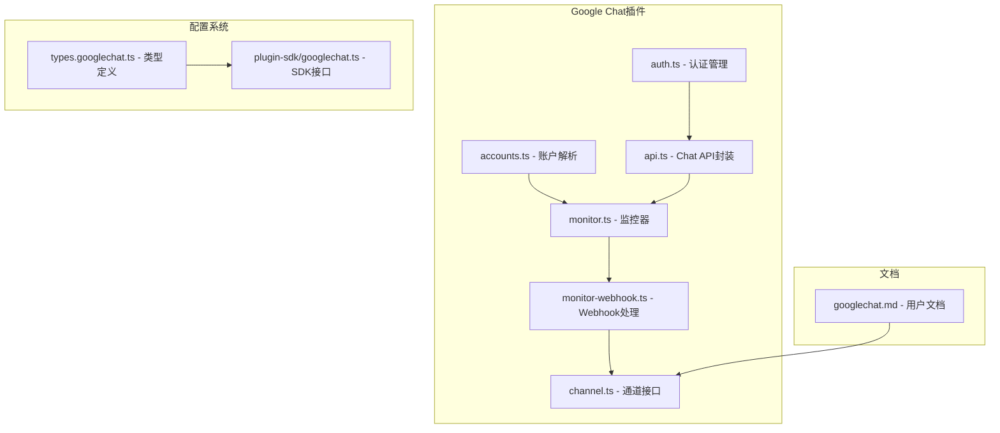
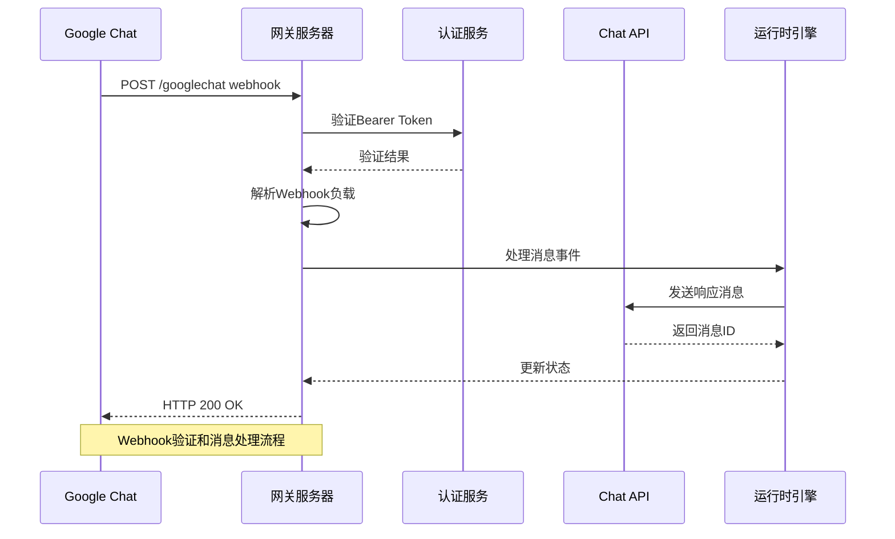
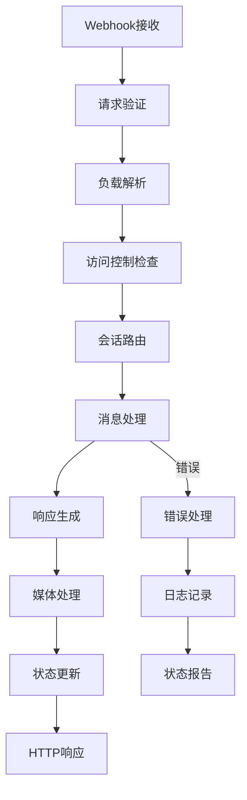
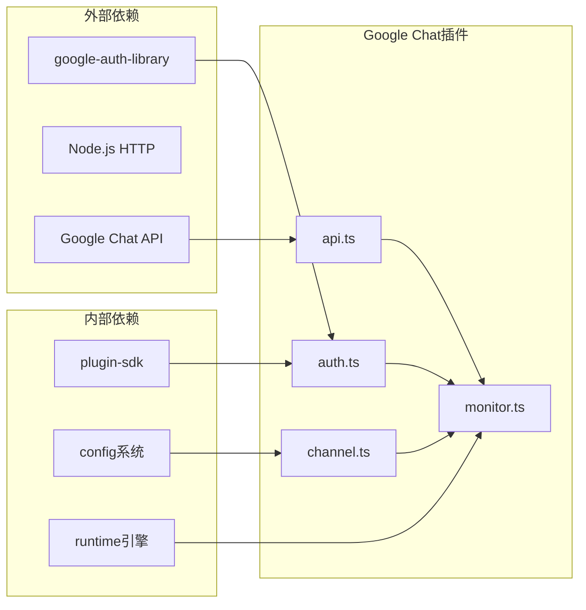

# Google Chat集成

<cite>
**本文档引用的文件**
- [docs/channels/googlechat.md](file://docs/channels/googlechat.md)
- [extensions/googlechat/package.json](file://extensions/googlechat/package.json)
- [extensions/googlechat/src/auth.ts](file://extensions/googlechat/src/auth.ts)
- [extensions/googlechat/src/accounts.ts](file://extensions/googlechat/src/accounts.ts)
- [extensions/googlechat/src/api.ts](file://extensions/googlechat/src/api.ts)
- [extensions/googlechat/src/monitor.ts](file://extensions/googlechat/src/monitor.ts)
- [extensions/googlechat/src/monitor-webhook.ts](file://extensions/googlechat/src/monitor-webhook.ts)
- [extensions/googlechat/src/channel.ts](file://extensions/googlechat/src/channel.ts)
- [src/config/types.googlechat.ts](file://src/config/types.googlechat.ts)
- [src/plugin-sdk/googlechat.ts](file://src/plugin-sdk/googlechat.ts)
</cite>

## 目录

1. [简介](#简介)
2. [项目结构](#项目结构)
3. [核心组件](#核心组件)
4. [架构概览](#架构概览)
5. [详细组件分析](#详细组件分析)
6. [依赖关系分析](#依赖关系分析)
7. [性能考虑](#性能考虑)
8. [故障排除指南](#故障排除指南)
9. [结论](#结论)

## 简介

OpenClaw的Google Chat集成提供了完整的Google Workspace Chat应用支持，包括空间聊天、直接消息和群组管理功能。该集成通过HTTP Webhook实现，支持服务账户认证和Google Workspace Add-ons兼容性。

本集成支持以下核心功能：

- Google Chat API Webhook接收和验证
- 空间聊天和直接消息处理
- 群组管理和@提及检测
- 媒体附件下载和上传
- 打字指示器和反应支持
- 多账户配置和动态路由

## 项目结构

Google Chat集成采用模块化架构，主要包含以下组件：

**图表来源**

- [extensions/googlechat/src/auth.ts:1-106](file://extensions/googlechat/src/auth.ts#L1-L106)
- [extensions/googlechat/src/accounts.ts:1-156](file://extensions/googlechat/src/accounts.ts#L1-L156)
- [extensions/googlechat/src/api.ts:1-320](file://extensions/googlechat/src/api.ts#L1-L320)
- [extensions/googlechat/src/monitor.ts:1-549](file://extensions/googlechat/src/monitor.ts#L1-L549)
- [extensions/googlechat/src/monitor-webhook.ts:1-200](file://extensions/googlechat/src/monitor-webhook.ts#L1-L200)
- [extensions/googlechat/src/channel.ts:1-551](file://extensions/googlechat/src/channel.ts#L1-L551)

**章节来源**

- [extensions/googlechat/package.json:1-51](file://extensions/googlechat/package.json#L1-L51)
- [docs/channels/googlechat.md:1-262](file://docs/channels/googlechat.md#L1-L262)

## 核心组件

### 认证管理系统

Google Chat集成使用Google Auth Library进行服务账户认证，支持多种凭证来源：

- **服务账户文件**: 支持从JSON文件加载凭证
- **内联凭证**: 支持在配置中直接指定凭证
- **环境变量**: 支持通过环境变量传递凭证
- **缓存机制**: 实现了智能缓存以避免重复认证

认证流程包括访问令牌获取、证书验证和请求签名验证。

### 账户配置管理

系统支持多账户配置，提供灵活的凭证来源选择：

- **默认账户**: 适用于单账户场景
- **多账户**: 支持为不同Google Workspace域配置独立账户
- **凭证继承**: 支持账户级和全局级配置继承
- **动态解析**: 运行时解析和验证配置

### API封装层

提供对Google Chat API的完整封装，包括：

- **消息发送**: 支持文本和媒体消息
- **附件处理**: 支持上传和下载附件
- **反应管理**: 支持创建和删除反应
- **空间查询**: 支持查找直接消息空间
- **错误处理**: 统一的API错误处理机制

**章节来源**

- [extensions/googlechat/src/auth.ts:1-106](file://extensions/googlechat/src/auth.ts#L1-L106)
- [extensions/googlechat/src/accounts.ts:1-156](file://extensions/googlechat/src/accounts.ts#L1-L156)
- [extensions/googlechat/src/api.ts:1-320](file://extensions/googlechat/src/api.ts#L1-L320)

## 架构概览

Google Chat集成采用分层架构设计，确保高可用性和可扩展性：

**图表来源**

- [extensions/googlechat/src/monitor-webhook.ts:91-199](file://extensions/googlechat/src/monitor-webhook.ts#L91-L199)
- [extensions/googlechat/src/monitor.ts:85-110](file://extensions/googlechat/src/monitor.ts#L85-L110)

### 数据流架构

消息处理遵循严格的生命周期管理：

**图表来源**

- [extensions/googlechat/src/monitor.ts:134-342](file://extensions/googlechat/src/monitor.ts#L134-L342)

## 详细组件分析

### Webhook处理管道

Webhook处理实现了完整的请求生命周期管理：

#### 请求验证阶段

- **Bearer Token验证**: 验证Authorization头部
- **Google Workspace Add-ons兼容**: 支持systemIdToken验证
- **目标匹配**: 基于audience类型和值匹配正确的处理目标

#### 负载解析阶段

- **格式标准化**: 将Google Workspace Add-ons格式转换为标准Chat API格式
- **事件类型识别**: 支持MESSAGE等事件类型
- **数据完整性检查**: 验证必需字段的存在性

#### 处理执行阶段

- **访问策略应用**: 基于配置应用DM和群组访问策略
- **会话路由**: 根据空间类型和ID建立会话键
- **内容预处理**: 处理@提及检测和系统提示

**章节来源**

- [extensions/googlechat/src/monitor-webhook.ts:1-200](file://extensions/googlechat/src/monitor-webhook.ts#L1-L200)
- [extensions/googlechat/src/monitor.ts:92-110](file://extensions/googlechat/src/monitor.ts#L92-L110)

### 消息处理流水线

消息处理实现了完整的端到端流程：

#### 输入处理

- **内容提取**: 从消息对象中提取文本和附件
- **元数据收集**: 收集发送者信息、时间戳等元数据
- **类型判断**: 区分直接消息和群组消息

#### 访问控制

- **DM策略**: 基于配对或允许列表策略
- **群组规则**: 基于@提及要求和用户允许列表
- **系统提示**: 支持每空间的系统提示配置

#### 输出生成

- **响应构建**: 支持文本和媒体响应
- **线程管理**: 维护消息线程关系
- **状态跟踪**: 记录最后入站和出站时间

**章节来源**

- [extensions/googlechat/src/monitor.ts:134-342](file://extensions/googlechat/src/monitor.ts#L134-L342)

### 媒体处理系统

媒体处理支持完整的上传和下载生命周期：

#### 下载流程

- **资源验证**: 验证附件资源名称
- **大小限制**: 应用媒体大小限制
- **缓冲存储**: 将媒体存储到内存缓冲区

#### 上传流程

- **多部分上传**: 使用multipart/related格式
- **令牌管理**: 处理附件上传令牌
- **内容类型**: 保持原始媒体内容类型

#### 错误处理

- **超时处理**: 实现合理的超时机制
- **大小验证**: 防止超出配置限制
- **回退策略**: 在失败时提供回退选项

**章节来源**

- [extensions/googlechat/src/api.ts:241-287](file://extensions/googlechat/src/api.ts#L241-L287)
- [extensions/googlechat/src/monitor.ts:344-364](file://extensions/googlechat/src/monitor.ts#L344-L364)

### 配置管理系统

配置系统支持灵活的多账户和多环境配置：

#### 账户层次结构

- **默认账户**: 全局默认配置
- **特定账户**: 针对特定Google Workspace域的配置
- **继承机制**: 支持配置继承和覆盖

#### 凭证来源

- **文件路径**: 从文件系统加载凭证
- **内联配置**: 在配置文件中直接指定
- **密钥管理**: 支持SecretRef引用

#### 运行时配置

- **动态更新**: 支持运行时配置更新
- **状态监控**: 实时监控配置状态
- **验证机制**: 启动时验证配置完整性

**章节来源**

- [extensions/googlechat/src/accounts.ts:1-156](file://extensions/googlechat/src/accounts.ts#L1-L156)
- [src/config/types.googlechat.ts:1-121](file://src/config/types.googlechat.ts#L1-L121)

## 依赖关系分析

Google Chat集成的依赖关系体现了清晰的关注点分离：

**图表来源**

- [extensions/googlechat/package.json:7-9](file://extensions/googlechat/package.json#L7-L9)
- [extensions/googlechat/src/auth.ts:1-106](file://extensions/googlechat/src/auth.ts#L1-L106)
- [extensions/googlechat/src/api.ts:1-320](file://extensions/googlechat/src/api.ts#L1-L320)

### 关键依赖特性

#### 认证依赖

- **google-auth-library**: 提供OAuth2客户端和JWT支持
- **服务账户管理**: 自动处理服务账户凭证
- **令牌刷新**: 透明的令牌刷新机制

#### 运行时依赖

- **fetch包装器**: 提供安全的HTTP请求封装
- **错误审计**: 记录所有API调用的审计信息
- **资源管理**: 确保网络资源正确释放

#### 配置依赖

- **Zod模式**: 提供类型安全的配置验证
- **动态解析**: 运行时解析配置变更
- **状态同步**: 保持配置状态与实际运行状态一致

**章节来源**

- [extensions/googlechat/package.json:1-51](file://extensions/googlechat/package.json#L1-L51)
- [src/plugin-sdk/googlechat.ts:1-96](file://src/plugin-sdk/googlechat.ts#L1-L96)

## 性能考虑

Google Chat集成在设计时充分考虑了性能优化：

### 缓存策略

- **认证缓存**: 最大32个条目的认证实例缓存
- **证书缓存**: 10分钟缓存Google Chat证书
- **会话复用**: 复用API连接以减少延迟

### 内存管理

- **大小限制**: 默认20MB媒体大小限制
- **流式处理**: 大文件使用流式下载避免内存峰值
- **垃圾回收**: 及时清理临时对象和缓冲区

### 并发控制

- **飞行请求限制**: 控制并发Webhook请求数量
- **队列管理**: 有序处理消息事件
- **超时机制**: 合理的请求超时设置

## 故障排除指南

### 常见问题诊断

#### Webhook验证失败

**症状**: Google Cloud Logs显示401未授权错误
**解决方案**:

1. 验证Google Chat应用的Webhook URL配置
2. 检查audienceType和audience配置
3. 确认服务账户凭证有效
4. 验证防火墙和网络访问权限

#### 消息不接收

**症状**: Google Chat中无响应
**解决方案**:

1. 检查网关状态: `openclaw channels status`
2. 验证Webhook路径配置
3. 确认Google Chat应用可见性设置
4. 查看网关日志: `openclaw logs --follow`

#### 媒体上传失败

**症状**: 附件无法发送或下载
**解决方案**:

1. 检查媒体大小限制配置
2. 验证网络连接和代理设置
3. 确认Google Chat API权限
4. 查看具体的错误消息和HTTP状态码

#### 认证问题

**症状**: "缺少Google Chat访问令牌"错误
**解决方案**:

1. 验证服务账户JSON文件完整性
2. 检查Google Chat API启用状态
3. 确认服务账户具有适当权限
4. 重新生成和部署服务账户密钥

**章节来源**

- [docs/channels/googlechat.md:209-262](file://docs/channels/googlechat.md#L209-L262)

### 监控和调试

#### 状态检查

使用以下命令监控集成状态：

- `openclaw channels status --probe`
- `openclaw status`
- `openclaw plugins list | grep googlechat`

#### 日志分析

- **Webhook日志**: 监听Webhook请求和响应
- **认证日志**: 跟踪令牌获取和验证过程
- **API调用日志**: 分析Chat API交互

#### 性能监控

- **响应时间**: 监控消息处理延迟
- **错误率**: 跟踪API调用成功率
- **资源使用**: 监控内存和CPU使用情况

## 结论

OpenClaw的Google Chat集成为Google Workspace提供了企业级的消息机器人解决方案。该集成具有以下优势：

### 技术优势

- **企业级安全性**: 完整的服务账户认证和访问控制
- **高可用性**: 冗余设计和错误恢复机制
- **可扩展性**: 支持多账户和大规模部署
- **合规性**: 符合Google Workspace安全要求

### 功能完整性

- **全面的消息支持**: 文本、媒体、反应和线程
- **灵活的配置**: 多账户和动态配置支持
- **强大的API封装**: 简化的Chat API使用体验
- **完善的监控**: 全面的状态监控和故障诊断

### 部署友好性

- **简化的配置**: 直观的配置界面和向导
- **文档完善**: 详细的安装和配置指南
- **故障排除**: 完善的问题诊断和解决工具
- **持续支持**: 定期更新和安全补丁

该集成适合需要在Google Workspace环境中部署企业级AI助手的组织，提供了可靠、安全且易于使用的解决方案。
