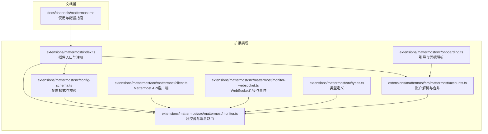
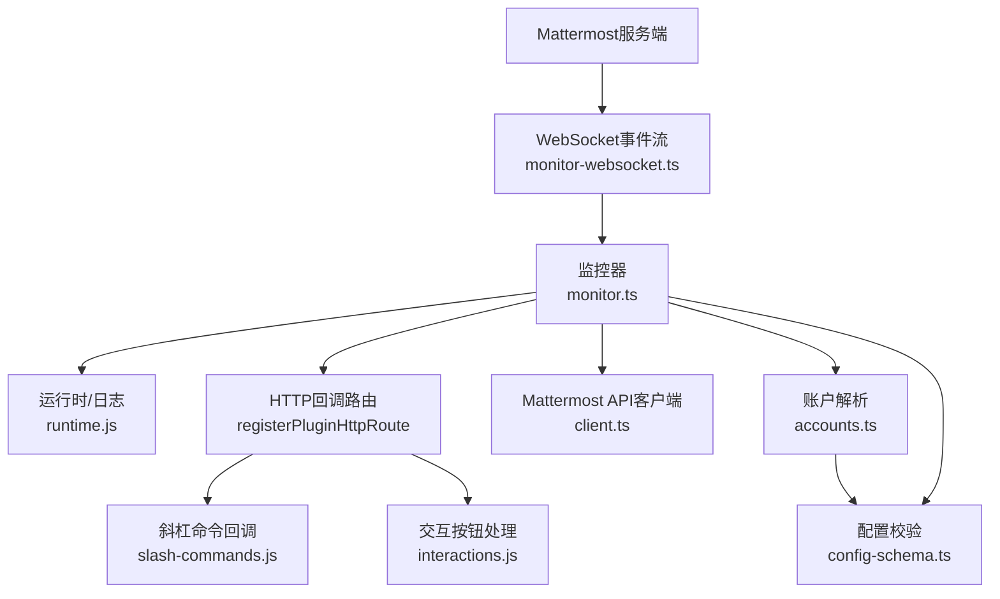
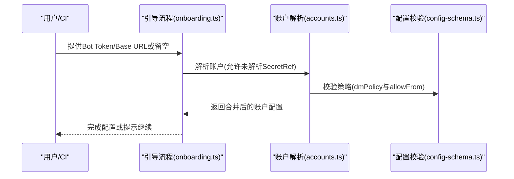
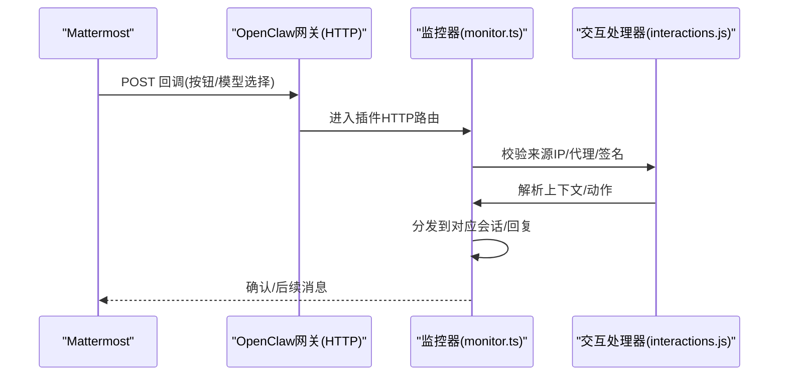
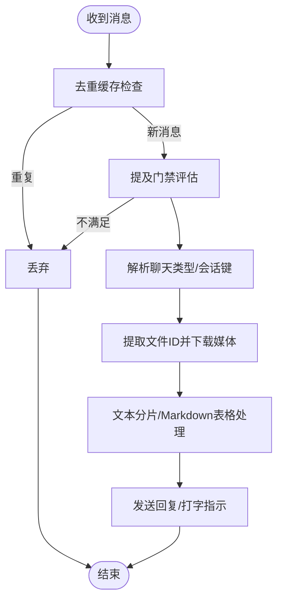
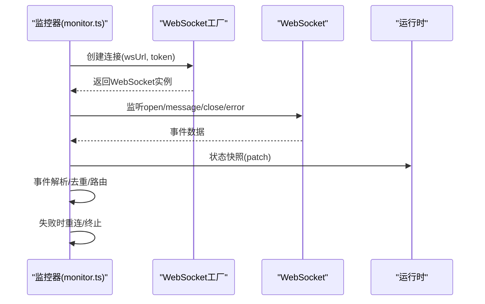
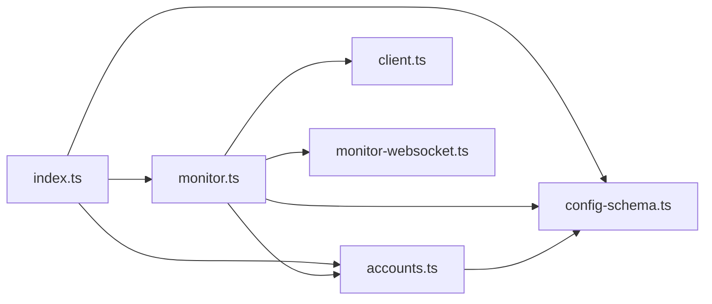

# Mattermost企业版集成

<cite>
**本文档引用的文件**
- [mattermost.md](file://docs/channels/mattermost.md)
- [index.ts](file://extensions/mattermost/index.ts)
- [config-schema.ts](file://extensions/mattermost/src/config-schema.ts)
- [accounts.ts](file://extensions/mattermost/src/mattermost/accounts.ts)
- [client.ts](file://extensions/mattermost/src/mattermost/client.ts)
- [monitor.ts](file://extensions/mattermost/src/mattermost/monitor.ts)
- [monitor-websocket.ts](file://extensions/mattermost/src/mattermost/monitor-websocket.ts)
- [onboarding.ts](file://extensions/mattermost/src/onboarding.ts)
- [onboarding.status.test.ts](file://extensions/mattermost/src/onboarding.status.test.ts)
- [types.ts](file://extensions/mattermost/src/types.ts)
</cite>

## 目录

1. [简介](#简介)
2. [项目结构](#项目结构)
3. [核心组件](#核心组件)
4. [架构概览](#架构概览)
5. [详细组件分析](#详细组件分析)
6. [依赖关系分析](#依赖关系分析)
7. [性能考虑](#性能考虑)
8. [故障排除指南](#故障排除指南)
9. [结论](#结论)

## 简介

本文件面向企业级部署场景，系统性阐述OpenClaw与Mattermost企业版的深度集成方案。内容覆盖认证配置（Bot Token与环境变量）、Webhook与交互按钮回调、API集成与消息路由、频道与用户权限策略、实时WebSocket连接处理，以及企业环境下的安全加固（反向代理可达性、SSRF防护、来源IP白名单）与运维最佳实践。

## 项目结构

Mattermost集成由两部分构成：

- 文档与配置：位于docs/channels/mattermost.md，提供安装、配置、命令与按钮交互、多账户等使用说明
- 扩展实现：位于extensions/mattermost，包含插件注册、配置校验、客户端封装、监控器（含WebSocket与HTTP回调）、账户解析等

**图表来源**

- [index.ts:1-24](file://extensions/mattermost/index.ts#L1-L24)
- [config-schema.ts:1-86](file://extensions/mattermost/src/config-schema.ts#L1-L86)
- [accounts.ts:1-138](file://extensions/mattermost/src/mattermost/accounts.ts#L1-L138)
- [client.ts:1-279](file://extensions/mattermost/src/mattermost/client.ts#L1-L279)
- [monitor.ts:1-800](file://extensions/mattermost/src/mattermost/monitor.ts#L1-L800)
- [monitor-websocket.ts:1-86](file://extensions/mattermost/src/mattermost/monitor-websocket.ts#L1-L86)
- [onboarding.ts:80-144](file://extensions/mattermost/src/onboarding.ts#L80-L144)
- [types.ts:69-89](file://extensions/mattermost/src/types.ts#L69-L89)

**章节来源**

- [mattermost.md:1-370](file://docs/channels/mattermost.md#L1-L370)
- [index.ts:1-24](file://extensions/mattermost/index.ts#L1-L24)

## 核心组件

- 插件入口与注册：负责注册通道、挂载HTTP路由（斜杠命令回调）、初始化运行时
- 配置模式与校验：定义支持的配置键、默认值、策略约束（如开放DM需允许通配）
- 账户解析与合并：支持多账户、默认账户、环境变量回退、命令覆盖合并
- Mattermost API客户端：统一请求封装、错误解析、上传下载、用户/频道查询
- 监控器：负责连接建立、消息去重、提及门禁、线程会话、媒体处理、按钮交互、打字指示、文本分片
- WebSocket监控：事件解析、重连策略、连接状态上报
- 引导流程：在首次配置或onboarding中提示并解析Bot Token与Base URL

**章节来源**

- [index.ts:7-21](file://extensions/mattermost/index.ts#L7-L21)
- [config-schema.ts:25-85](file://extensions/mattermost/src/config-schema.ts#L25-L85)
- [accounts.ts:87-131](file://extensions/mattermost/src/mattermost/accounts.ts#L87-L131)
- [client.ts:73-114](file://extensions/mattermost/src/mattermost/client.ts#L73-L114)
- [monitor.ts:307-338](file://extensions/mattermost/src/mattermost/monitor.ts#L307-L338)
- [monitor-websocket.ts:47-86](file://extensions/mattermost/src/mattermost/monitor-websocket.ts#L47-L86)
- [onboarding.ts:80-144](file://extensions/mattermost/src/onboarding.ts#L80-L144)

## 架构概览

下图展示从Mattermost到OpenClaw网关的关键路径：WebSocket接收消息、HTTP回调处理按钮点击、API调用发送消息与媒体、权限与策略控制贯穿始终。

**图表来源**

- [monitor-websocket.ts:1-86](file://extensions/mattermost/src/mattermost/monitor-websocket.ts#L1-L86)
- [monitor.ts:307-520](file://extensions/mattermost/src/mattermost/monitor.ts#L307-L520)
- [client.ts:73-114](file://extensions/mattermost/src/mattermost/client.ts#L73-L114)
- [accounts.ts:87-131](file://extensions/mattermost/src/mattermost/accounts.ts#L87-L131)
- [config-schema.ts:25-85](file://extensions/mattermost/src/config-schema.ts#L25-L85)

## 详细组件分析

### 认证与凭据管理

- Bot Token与Base URL来源优先级：显式参数 > 配置 > 环境变量（仅默认账户）
- 环境变量：默认账户支持通过环境变量注入；多账户需在配置中指定
- 引导检查：当检测到环境变量时，引导流程可直接标记为已配置

**图表来源**

- [onboarding.ts:80-144](file://extensions/mattermost/src/onboarding.ts#L80-L144)
- [accounts.ts:87-131](file://extensions/mattermost/src/mattermost/accounts.ts#L87-L131)
- [config-schema.ts:62-85](file://extensions/mattermost/src/config-schema.ts#L62-L85)

**章节来源**

- [mattermost.md:97-104](file://docs/channels/mattermost.md#L97-L104)
- [onboarding.ts:80-144](file://extensions/mattermost/src/onboarding.ts#L80-L144)
- [accounts.ts:87-131](file://extensions/mattermost/src/mattermost/accounts.ts#L87-L131)
- [config-schema.ts:62-85](file://extensions/mattermost/src/config-schema.ts#L62-L85)

### Webhook与交互按钮回调

- 斜杠命令回调：根据网关端口与绑定主机推导回调URL，支持显式callbackUrl
- 交互按钮回调：基于账户ID派生稳定回调路径，支持callbackBaseUrl与来源IP白名单
- HMAC验证：按钮回调上下文签名由Bot Token派生的密钥生成，确保完整性

**图表来源**

- [monitor.ts:474-680](file://extensions/mattermost/src/mattermost/monitor.ts#L474-L680)
- [types.ts:69-89](file://extensions/mattermost/src/types.ts#L69-L89)

**章节来源**

- [mattermost.md:58-96](file://docs/channels/mattermost.md#L58-L96)
- [monitor.ts:474-680](file://extensions/mattermost/src/mattermost/monitor.ts#L474-L680)
- [types.ts:69-89](file://extensions/mattermost/src/types.ts#L69-L89)

### API集成与消息路由

- 发送消息：支持文本分片、Markdown表格转换、媒体URL直传、打字指示
- 媒体处理：远程文件下载(SSRF白名单限定Mattermost主机)、本地保存、按类型分类
- 线程与会话：根据频道类型(D/G/O/P)映射聊天类型，解析会话键，支持历史记录与去重
- 权限与策略：提及门禁、DM/群组策略、触发前缀(onchar)、名称匹配开关

**图表来源**

- [monitor.ts:130-276](file://extensions/mattermost/src/mattermost/monitor.ts#L130-L276)
- [monitor.ts:715-756](file://extensions/mattermost/src/mattermost/monitor.ts#L715-L756)
- [monitor.ts:617-672](file://extensions/mattermost/src/mattermost/monitor.ts#L617-L672)

**章节来源**

- [monitor.ts:130-276](file://extensions/mattermost/src/mattermost/monitor.ts#L130-L276)
- [monitor.ts:617-672](file://extensions/mattermost/src/mattermost/monitor.ts#L617-L672)

### 实时连接处理（WebSocket）

- 连接工厂与事件解析：支持自定义WebSocket工厂，解析posted事件
- 错误与重连：对“打开前关闭”等错误进行包装与重试；状态变更通过快照回调上报
- 心跳与稳定性：结合重连策略与序列号管理，保证事件顺序与可靠性

**图表来源**

- [monitor-websocket.ts:47-86](file://extensions/mattermost/src/mattermost/monitor-websocket.ts#L47-L86)
- [monitor.ts:307-338](file://extensions/mattermost/src/mattermost/monitor.ts#L307-L338)

**章节来源**

- [monitor-websocket.ts:1-86](file://extensions/mattermost/src/mattermost/monitor-websocket.ts#L1-L86)
- [monitor.ts:307-338](file://extensions/mattermost/src/mattermost/monitor.ts#L307-L338)

### 频道管理与用户权限映射

- 频道类型映射：D/G/P映射为direct/group/channel，便于策略区分
- DM策略：支持配对码、公开DM、来源白名单
- 群组策略：允许通配来源、名称匹配开关、默认策略回退
- 用户解析：带缓存的用户信息查询，降低API压力

**章节来源**

- [mattermost.md:132-147](file://docs/channels/mattermost.md#L132-L147)
- [monitor.ts:152-181](file://extensions/mattermost/src/mattermost/monitor.ts#L152-L181)
- [monitor.ts:784-800](file://extensions/mattermost/src/mattermost/monitor.ts#L784-L800)

## 依赖关系分析

- 插件入口依赖监控器与运行时，注册HTTP路由与通道
- 监控器依赖账户解析、配置校验、API客户端、WebSocket监控、交互处理
- 账户解析依赖配置模式与环境变量，支持多账户与命令覆盖
- 客户端封装统一的HTTP请求与错误处理，媒体下载受SSRF策略限制

**图表来源**

- [index.ts:1-24](file://extensions/mattermost/index.ts#L1-L24)
- [monitor.ts:1-96](file://extensions/mattermost/src/mattermost/monitor.ts#L1-L96)
- [accounts.ts:1-72](file://extensions/mattermost/src/mattermost/accounts.ts#L1-L72)
- [config-schema.ts:1-86](file://extensions/mattermost/src/config-schema.ts#L1-L86)
- [client.ts:1-60](file://extensions/mattermost/src/mattermost/client.ts#L1-L60)
- [monitor-websocket.ts:1-35](file://extensions/mattermost/src/mattermost/monitor-websocket.ts#L1-L35)

**章节来源**

- [index.ts:1-24](file://extensions/mattermost/index.ts#L1-L24)
- [monitor.ts:1-96](file://extensions/mattermost/src/mattermost/monitor.ts#L1-L96)

## 性能考虑

- 消息去重与缓存：近期消息去重缓存与频道/用户信息缓存，减少重复请求
- 文本分片与Markdown：按配置分片与表格渲染，避免超长消息导致的API失败
- 媒体下载SSRF白名单：仅允许从Mattermost主机下载，避免横向SSRF风险
- 打字指示与人类延迟：合理设置人类延迟与打字指示，提升用户体验
- 重连与序列号：稳定的重连策略与序列号管理，降低消息丢失概率

**章节来源**

- [monitor.ts:130-133](file://extensions/mattermost/src/mattermost/monitor.ts#L130-L133)
- [monitor.ts:690-700](file://extensions/mattermost/src/mattermost/monitor.ts#L690-L700)
- [monitor.ts:715-756](file://extensions/mattermost/src/mattermost/monitor.ts#L715-L756)
- [monitor-websocket.ts:47-57](file://extensions/mattermost/src/mattermost/monitor-websocket.ts#L47-L57)

## 故障排除指南

常见问题与定位要点：

- 无回复：检查机器人是否在频道内、是否被@提及、触发前缀(onchar)、或设置为onmessage
- 认证错误：核对Bot Token与Base URL，确认账户启用状态
- 多账户问题：环境变量仅适用于默认账户，其他账户需在配置中指定
- 按钮显示为白块：检查按钮字段完整性（text/callback_data）
- 按钮点击无效：确认Mattermost允许内部连接与启用Post Action Integration；按钮ID仅允许字母数字
- 回调签名失败：确保签名包含所有上下文字段、使用紧凑JSON与排序键
- 回调不可达：检查callbackUrl是否对Mattermost可达；必要时配置反向代理域名

**章节来源**

- [mattermost.md:358-370](file://docs/channels/mattermost.md#L358-L370)

## 结论

通过上述组件与流程，OpenClaw实现了对Mattermost企业版的完整集成：从认证、Webhook与按钮回调、API消息发送，到实时事件处理、权限策略与媒体安全下载。企业部署应重点关注回调可达性、来源IP白名单与签名一致性，并结合配置模式与多账户能力，实现灵活且安全的跨团队协作与自动化工作流。
