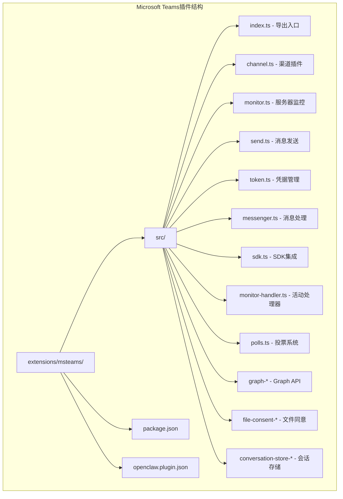
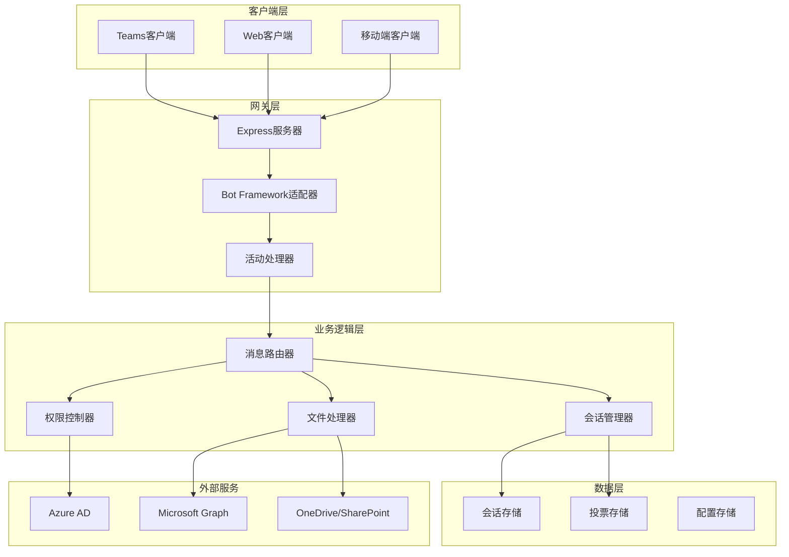
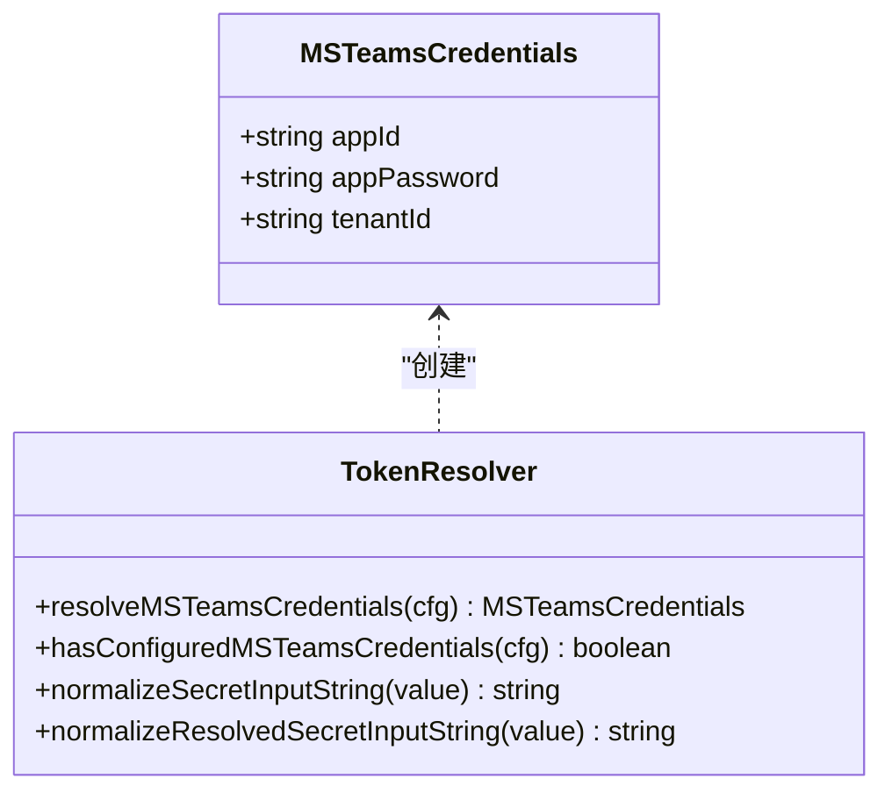
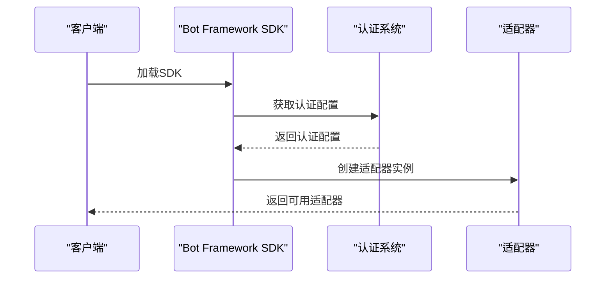
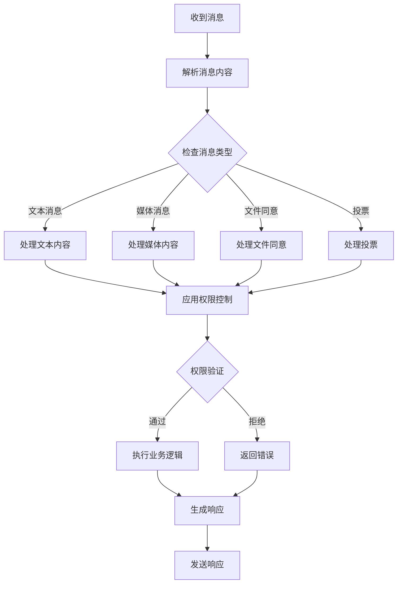
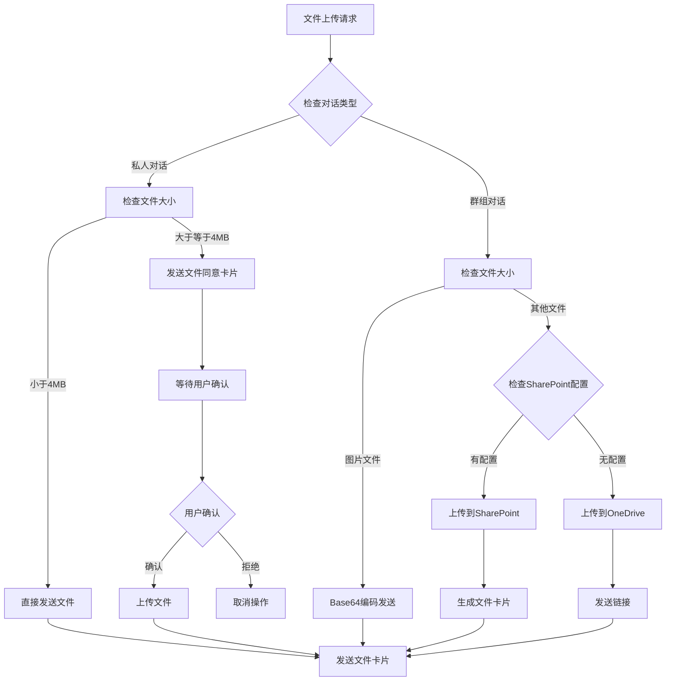
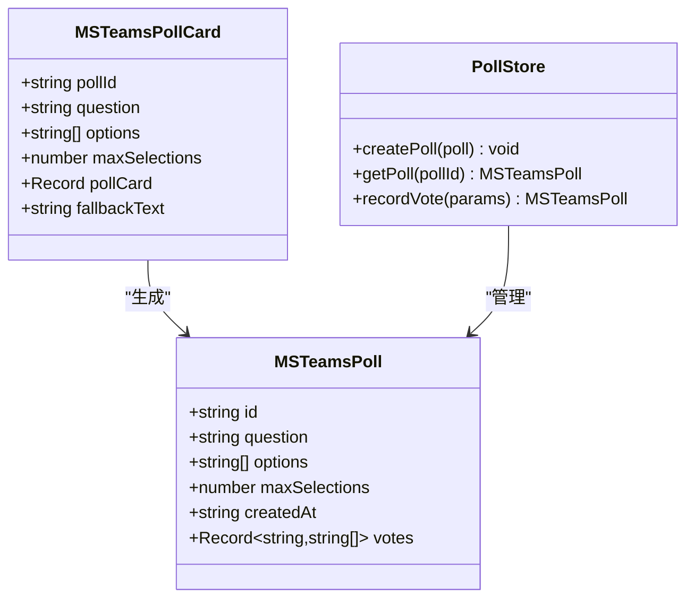

# Microsoft Teams集成

<cite>
**本文档引用的文件**
- [extensions/msteams/src/index.ts](file://extensions/msteams/src/index.ts)
- [extensions/msteams/package.json](file://extensions/msteams/package.json)
- [extensions/msteams/openclaw.plugin.json](file://extensions/msteams/openclaw.plugin.json)
- [docs/channels/msteams.md](file://docs/channels/msteams.md)
- [extensions/msteams/src/monitor.ts](file://extensions/msteams/src/monitor.ts)
- [extensions/msteams/src/probe.ts](file://extensions/msteams/src/probe.ts)
- [extensions/msteams/src/send.ts](file://extensions/msteams/src/send.ts)
- [extensions/msteams/src/token.ts](file://extensions/msteams/src/token.ts)
- [extensions/msteams/src/channel.ts](file://extensions/msteams/src/channel.ts)
- [extensions/msteams/src/sdk.ts](file://extensions/msteams/src/sdk.ts)
- [extensions/msteams/src/messenger.ts](file://extensions/msteams/src/messenger.ts)
- [extensions/msteams/src/monitor-handler.ts](file://extensions/msteams/src/monitor-handler.ts)
- [extensions/msteams/src/polls.ts](file://extensions/msteams/src/polls.ts)
- [extensions/msteams/src/resolve-allowlist.ts](file://extensions/msteams/src/resolve-allowlist.ts)
</cite>

## 目录

1. [简介](#简介)
2. [项目结构](#项目结构)
3. [核心组件](#核心组件)
4. [架构概览](#架构概览)
5. [详细组件分析](#详细组件分析)
6. [依赖关系分析](#依赖关系分析)
7. [性能考虑](#性能考虑)
8. [故障排除指南](#故障排除指南)
9. [结论](#结论)
10. [附录](#附录)

## 简介

Microsoft Teams集成是OpenClaw项目中的一个专用插件，提供了完整的Microsoft Teams机器人支持。该集成基于Bot Framework构建，支持团队聊天、频道消息和私人消息处理，包含Azure AD认证、Bot Framework配置和Teams API集成。

本集成文档涵盖了从基础配置到高级功能的完整实现，包括：

- Azure AD认证和Bot Framework配置
- Teams API集成和消息路由
- 团队聊天、频道消息和私人消息处理
- Microsoft 365应用注册和权限配置
- Webhook设置和安全认证
- Teams Bot开发指南
- 消息卡片和交互式功能实现

## 项目结构

OpenClaw的Microsoft Teams集成采用模块化设计，主要组件分布在以下目录结构中：



**图表来源**

- [extensions/msteams/src/index.ts:1-5](file://extensions/msteams/src/index.ts#L1-L5)
- [extensions/msteams/package.json:1-38](file://extensions/msteams/package.json#L1-L38)

**章节来源**

- [extensions/msteams/src/index.ts:1-5](file://extensions/msteams/src/index.ts#L1-L5)
- [extensions/msteams/package.json:1-38](file://extensions/msteams/package.json#L1-L38)
- [extensions/msteams/openclaw.plugin.json:1-10](file://extensions/msteams/openclaw.plugin.json#L1-L10)

## 核心组件

Microsoft Teams集成的核心组件包括：

### 1. 插件入口和导出

插件通过统一的入口文件导出所有核心功能：

- `monitorMSTeamsProvider` - 主要的服务器监控器
- `probeMSTeams` - 配置探测器
- `sendMessageMSTeams` - 消息发送器
- `sendPollMSTeams` - 投票发送器
- `MSTeamsCredentials` - 凭据类型定义

### 2. 渠道插件接口

实现了完整的ChannelPlugin接口，支持：

- 配对（Pairing）功能
- 安全策略管理
- 目标解析和验证
- 目录服务集成
- 状态监控和探测

### 3. 凭据管理系统

提供安全的凭据管理机制：

- Azure Bot凭据（App ID、App Password、Tenant ID）
- 环境变量支持
- 凭据验证和标准化

**章节来源**

- [extensions/msteams/src/index.ts:1-5](file://extensions/msteams/src/index.ts#L1-L5)
- [extensions/msteams/src/channel.ts:52-455](file://extensions/msteams/src/channel.ts#L52-L455)
- [extensions/msteams/src/token.ts:1-41](file://extensions/msteams/src/token.ts#L1-L41)

## 架构概览

Microsoft Teams集成为分布式架构，包含多个相互协作的组件：



**图表来源**

- [extensions/msteams/src/monitor.ts:65-346](file://extensions/msteams/src/monitor.ts#L65-L346)
- [extensions/msteams/src/messenger.ts:38-525](file://extensions/msteams/src/messenger.ts#L38-L525)

### 核心工作流程

1. **启动流程**：插件加载配置，初始化Bot Framework SDK，启动HTTP服务器
2. **认证流程**：使用Azure AD凭据进行JWT认证和令牌管理
3. **消息处理**：接收Teams消息，解析内容，执行业务逻辑
4. **响应生成**：构建适当的响应格式（文本、媒体、卡片）
5. **状态持久化**：保存会话信息和配置状态

**章节来源**

- [extensions/msteams/src/monitor.ts:247-346](file://extensions/msteams/src/monitor.ts#L247-L346)
- [extensions/msteams/src/messenger.ts:384-525](file://extensions/msteams/src/messenger.ts#L384-L525)

## 详细组件分析

### 1. 凭据管理系统

凭据管理系统负责处理Azure Bot的认证信息：



**图表来源**

- [extensions/msteams/src/token.ts:8-41](file://extensions/msteams/src/token.ts#L8-L41)

凭据管理特性：

- 支持配置文件和环境变量两种输入方式
- 自动验证凭据完整性
- 提供凭据标准化处理

**章节来源**

- [extensions/msteams/src/token.ts:14-41](file://extensions/msteams/src/token.ts#L14-L41)

### 2. SDK集成层

SDK集成层负责与Bot Framework和Microsoft Graph的交互：



**图表来源**

- [extensions/msteams/src/sdk.ts:29-34](file://extensions/msteams/src/sdk.ts#L29-L34)

**章节来源**

- [extensions/msteams/src/sdk.ts:1-34](file://extensions/msteams/src/sdk.ts#L1-L34)

### 3. 消息处理引擎

消息处理引擎是核心业务逻辑组件：



**图表来源**

- [extensions/msteams/src/monitor-handler.ts:134-191](file://extensions/msteams/src/monitor-handler.ts#L134-L191)

**章节来源**

- [extensions/msteams/src/monitor-handler.ts:1-191](file://extensions/msteams/src/monitor-handler.ts#L1-L191)

### 4. 文件处理系统

文件处理系统支持多种文件传输场景：



**图表来源**

- [extensions/msteams/src/send.ts:94-304](file://extensions/msteams/src/send.ts#L94-L304)

**章节来源**

- [extensions/msteams/src/send.ts:1-530](file://extensions/msteams/src/send.ts#L1-L530)

### 5. 投票系统

投票系统基于Adaptive Cards实现：



**图表来源**

- [extensions/msteams/src/polls.ts:5-316](file://extensions/msteams/src/polls.ts#L5-L316)

**章节来源**

- [extensions/msteams/src/polls.ts:1-316](file://extensions/msteams/src/polls.ts#L1-L316)

## 依赖关系分析

Microsoft Teams集成的依赖关系如下：

```mermaid
graph TB
subgraph "内部依赖"
A[extensions/msteams/src/] --> B[channel.ts]
A --> C[monitor.ts]
A --> D[send.ts]
A --> E[token.ts]
A --> F[messenger.ts]
A --> G[sdk.ts]
A --> H[monitor-handler.ts]
A --> I[polls.ts]
A --> J[resolve-allowlist.ts]
end
subgraph "外部依赖"
K[@microsoft/agents-hosting] --> L[Bot Framework SDK]
M[express] --> N[HTTP服务器]
O[node:http] --> P[Node.js内置模块]
end
subgraph "配置依赖"
Q[openclaw.plugin.json] --> R[插件配置]
S[package.json] --> T[包依赖]
end
B --> L
C --> N
D --> L
F --> L
G --> L
H --> L
```

**图表来源**

- [extensions/msteams/package.json:6-9](file://extensions/msteams/package.json#L6-L9)
- [extensions/msteams/src/index.ts:1-5](file://extensions/msteams/src/index.ts#L1-L5)

**章节来源**

- [extensions/msteams/package.json:1-38](file://extensions/msteams/package.json#L1-L38)
- [extensions/msteams/src/index.ts:1-5](file://extensions/msteams/src/index.ts#L1-L5)

## 性能考虑

Microsoft Teams集成在性能方面采用了多项优化策略：

### 1. 异步处理

- 使用Promise和async/await模式
- 非阻塞I/O操作
- 并发处理多个请求

### 2. 缓存策略

- 会话信息缓存
- 用户和团队信息解析缓存
- 文件上传状态跟踪

### 3. 超时管理

- Webhook超时配置（默认30秒）
- 请求超时限制
- 连接保持策略

### 4. 内存管理

- 及时清理临时文件
- 限制投票存储大小
- 合理的JSON文件锁机制

## 故障排除指南

### 常见问题及解决方案

#### 1. 认证失败

**症状**：401 Unauthorized错误
**原因**：Azure AD凭据不正确或过期
**解决**：

- 验证App ID、App Password、Tenant ID
- 检查Azure Bot资源状态
- 重新生成客户端密钥

#### 2. Webhook无法访问

**症状**：Teams无法连接到网关
**原因**：本地开发环境无法被外部访问
**解决**：

- 使用ngrok或类似的隧道服务
- 配置正确的端口转发
- 检查防火墙设置

#### 3. 文件上传失败

**症状**：大文件无法上传或显示错误
**原因**：文件大小超过限制或权限不足
**解决**：

- 检查SharePoint站点ID配置
- 验证Graph API权限
- 确认文件大小限制

#### 4. 投票功能异常

**症状**：投票无法记录或显示错误
**原因**：投票存储文件损坏或权限问题
**解决**：

- 检查msteams-polls.json文件
- 验证文件权限
- 重启网关服务

**章节来源**

- [docs/channels/msteams.md:745-777](file://docs/channels/msteams.md#L745-L777)

## 结论

Microsoft Teams集成为OpenClaw提供了完整的企业级消息平台集成方案。通过模块化设计和清晰的架构分离，该集成能够：

1. **提供完整的Teams支持**：支持私人消息、团队聊天和频道消息
2. **确保安全性**：基于Azure AD的强认证机制
3. **支持丰富的交互**：文本、媒体、Adaptive Cards和投票功能
4. **具备可扩展性**：模块化设计便于功能扩展和维护
5. **保证可靠性**：完善的错误处理和重试机制

该集成特别适合需要企业级通信解决方案的组织，提供了与Microsoft生态系统深度集成的能力。

## 附录

### 配置参数参考

| 参数名称       | 类型    | 默认值        | 描述                   |
| -------------- | ------- | ------------- | ---------------------- |
| `enabled`      | boolean | true          | 是否启用Teams渠道      |
| `appId`        | string  | -             | Azure Bot App ID       |
| `appPassword`  | string  | -             | Azure Bot App Password |
| `tenantId`     | string  | -             | Azure AD租户ID         |
| `webhook.port` | number  | 3978          | Webhook监听端口        |
| `webhook.path` | string  | /api/messages | Webhook路径            |
| `dmPolicy`     | string  | pairing       | 私人消息策略           |
| `groupPolicy`  | string  | allowlist     | 群组消息策略           |

### 支持的消息类型

- **文本消息**：标准的纯文本消息
- **媒体消息**：图片、视频、文件等多媒体内容
- **Adaptive Cards**：丰富的交互式卡片界面
- **投票**：基于Adaptive Cards的投票功能
- **文件同意**：用于大文件传输的同意流程

### 权限要求

- **RSC权限**：用于实时消息收发
- **Graph API权限**：用于历史消息查询和文件管理
- **应用权限**：管理员同意和令牌管理
