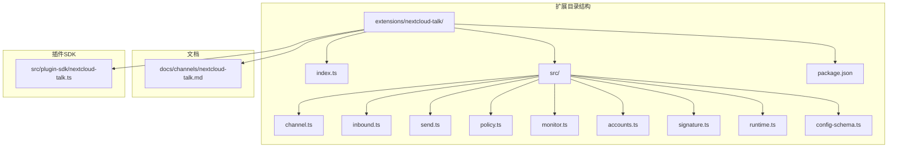
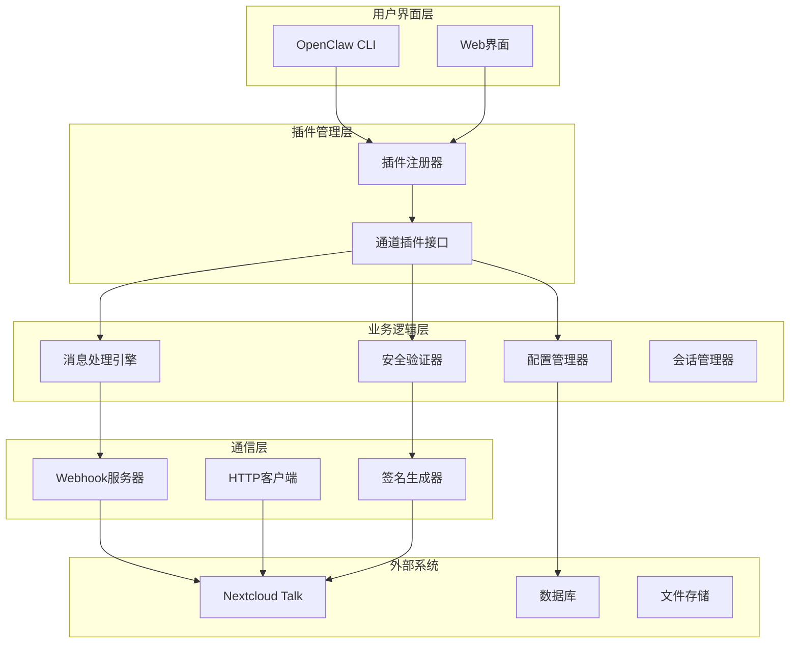
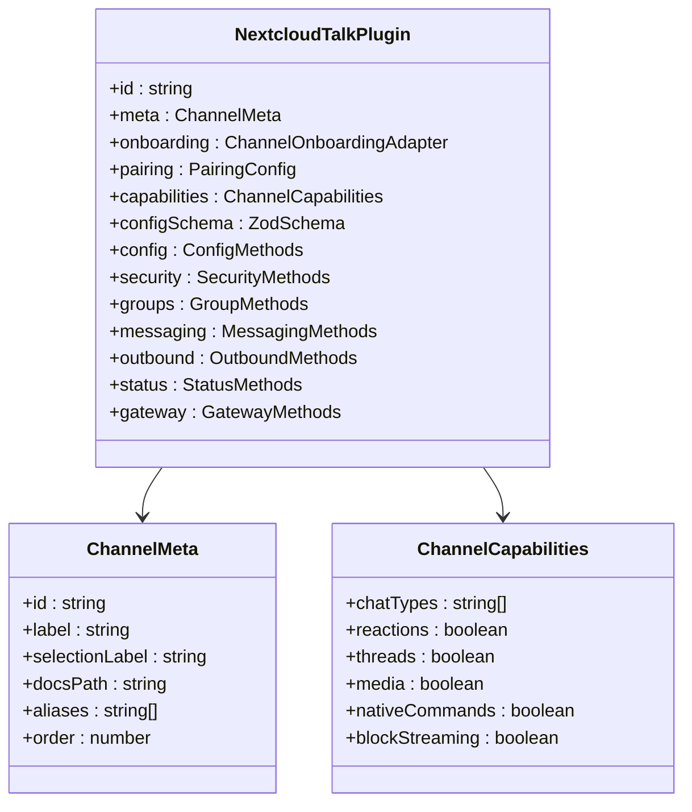
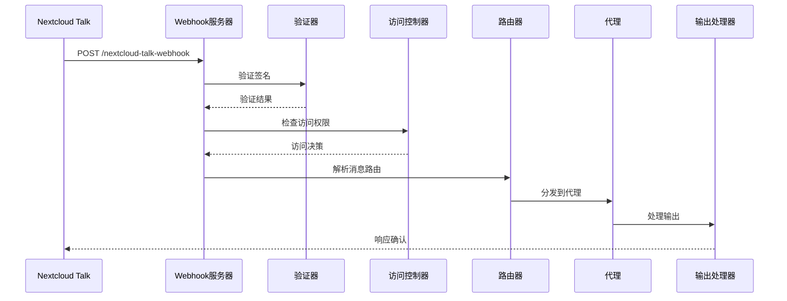
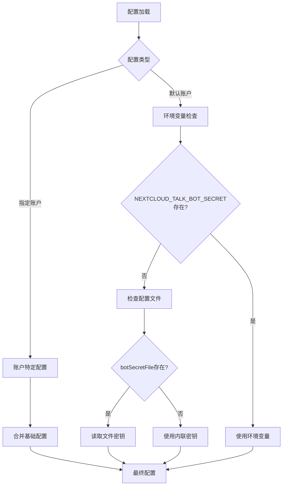
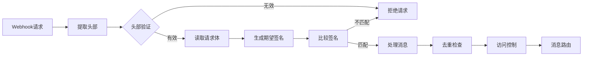
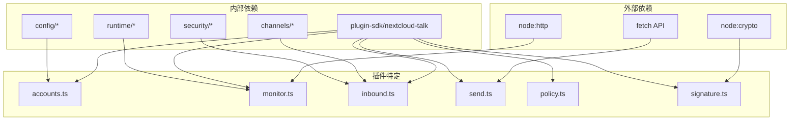

# Nextcloud Talk集成

<cite>
**本文档引用的文件**
- [docs/channels/nextcloud-talk.md](file://docs/channels/nextcloud-talk.md)
- [extensions/nextcloud-talk/index.ts](file://extensions/nextcloud-talk/index.ts)
- [extensions/nextcloud-talk/package.json](file://extensions/nextcloud-talk/package.json)
- [extensions/nextcloud-talk/src/channel.ts](file://extensions/nextcloud-talk/src/channel.ts)
- [extensions/nextcloud-talk/src/config-schema.ts](file://extensions/nextcloud-talk/src/config-schema.ts)
- [extensions/nextcloud-talk/src/inbound.ts](file://extensions/nextcloud-talk/src/inbound.ts)
- [extensions/nextcloud-talk/src/send.ts](file://extensions/nextcloud-talk/src/send.ts)
- [extensions/nextcloud-talk/src/policy.ts](file://extensions/nextcloud-talk/src/policy.ts)
- [extensions/nextcloud-talk/src/accounts.ts](file://extensions/nextcloud-talk/src/accounts.ts)
- [extensions/nextcloud-talk/src/runtime.ts](file://extensions/nextcloud-talk/src/runtime.ts)
- [extensions/nextcloud-talk/src/monitor.ts](file://extensions/nextcloud-talk/src/monitor.ts)
- [extensions/nextcloud-talk/src/signature.ts](file://extensions/nextcloud-talk/src/signature.ts)
- [src/plugin-sdk/nextcloud-talk.ts](file://src/plugin-sdk/nextcloud-talk.ts)
</cite>

## 目录

1. [简介](#简介)
2. [项目结构](#项目结构)
3. [核心组件](#核心组件)
4. [架构概览](#架构概览)
5. [详细组件分析](#详细组件分析)
6. [依赖关系分析](#依赖关系分析)
7. [性能考虑](#性能考虑)
8. [故障排除指南](#故障排除指南)
9. [结论](#结论)
10. [附录](#附录)

## 简介

Nextcloud Talk集成是OpenClaw项目中的一个重要功能模块，允许用户通过Webhook机器人与Nextcloud Talk进行交互。该集成支持直接消息、房间聊天、反应表情和Markdown消息等功能。

本集成采用插件化架构设计，提供了完整的配置管理、安全控制和实时通信处理能力。系统支持多种认证方式，包括环境变量、配置文件和内联密钥，并提供了灵活的访问控制策略。

## 项目结构

Nextcloud Talk集成位于扩展目录中，采用标准的插件架构：



**图表来源**

- [extensions/nextcloud-talk/index.ts:1-18](file://extensions/nextcloud-talk/index.ts#L1-L18)
- [extensions/nextcloud-talk/package.json:1-34](file://extensions/nextcloud-talk/package.json#L1-L34)

**章节来源**

- [extensions/nextcloud-talk/index.ts:1-18](file://extensions/nextcloud-talk/index.ts#L1-L18)
- [extensions/nextcloud-talk/package.json:1-34](file://extensions/nextcloud-talk/package.json#L1-L34)

## 核心组件

Nextcloud Talk集成包含以下核心组件：

### 插件入口点

插件通过index.ts文件注册到OpenClaw系统中，定义了插件的基本信息和注册流程。

### 通道插件实现

channel.ts文件实现了完整的通道插件接口，包括配置管理、安全策略、消息路由等功能。

### 配置架构

config-schema.ts定义了完整的配置模式，支持多账户管理和灵活的策略配置。

### 安全验证

signature.ts提供了基于HMAC-SHA256的签名验证机制，确保消息传输的安全性。

**章节来源**

- [extensions/nextcloud-talk/src/channel.ts:61-426](file://extensions/nextcloud-talk/src/channel.ts#L61-L426)
- [extensions/nextcloud-talk/src/config-schema.ts:14-75](file://extensions/nextcloud-talk/src/config-schema.ts#L14-L75)
- [extensions/nextcloud-talk/src/signature.ts:1-73](file://extensions/nextcloud-talk/src/signature.ts#L1-L73)

## 架构概览

Nextcloud Talk集成采用分层架构设计，实现了从底层通信到上层业务逻辑的完整抽象：



**图表来源**

- [extensions/nextcloud-talk/src/channel.ts:31-426](file://extensions/nextcloud-talk/src/channel.ts#L31-L426)
- [extensions/nextcloud-talk/src/monitor.ts:312-416](file://extensions/nextcloud-talk/src/monitor.ts#L312-L416)

## 详细组件分析

### 通道插件架构



**图表来源**

- [extensions/nextcloud-talk/src/channel.ts:42-82](file://extensions/nextcloud-talk/src/channel.ts#L42-L82)

### 消息处理流程



**图表来源**

- [extensions/nextcloud-talk/src/monitor.ts:195-271](file://extensions/nextcloud-talk/src/monitor.ts#L195-L271)
- [extensions/nextcloud-talk/src/inbound.ts:53-319](file://extensions/nextcloud-talk/src/inbound.ts#L53-L319)

### 配置管理架构



**图表来源**

- [extensions/nextcloud-talk/src/accounts.ts:79-110](file://extensions/nextcloud-talk/src/accounts.ts#L79-L110)

### 安全验证机制



**图表来源**

- [extensions/nextcloud-talk/src/monitor.ts:94-130](file://extensions/nextcloud-talk/src/monitor.ts#L94-L130)
- [extensions/nextcloud-talk/src/signature.ts:12-35](file://extensions/nextcloud-talk/src/signature.ts#L12-L35)

**章节来源**

- [extensions/nextcloud-talk/src/channel.ts:61-426](file://extensions/nextcloud-talk/src/channel.ts#L61-L426)
- [extensions/nextcloud-talk/src/inbound.ts:53-319](file://extensions/nextcloud-talk/src/inbound.ts#L53-L319)
- [extensions/nextcloud-talk/src/accounts.ts:79-157](file://extensions/nextcloud-talk/src/accounts.ts#L79-L157)

## 依赖关系分析

Nextcloud Talk集成的依赖关系体现了清晰的分层架构：



**图表来源**

- [extensions/nextcloud-talk/src/monitor.ts:1-14](file://extensions/nextcloud-talk/src/monitor.ts#L1-L14)
- [extensions/nextcloud-talk/src/signature.ts:1-73](file://extensions/nextcloud-talk/src/signature.ts#L1-L73)

**章节来源**

- [src/plugin-sdk/nextcloud-talk.ts:1-112](file://src/plugin-sdk/nextcloud-talk.ts#L1-L112)

## 性能考虑

### Webhook服务器优化

- 默认监听端口8788，支持自定义主机和路径配置
- 请求体大小限制为1MB，默认超时时间为30秒
- 内置请求体读取限制和错误处理机制

### 消息处理优化

- 支持消息去重，防止重复处理
- 实现了流式处理和块聚合配置
- 提供媒体文件大小限制和处理

### 安全性能

- 使用常量时间比较算法防止时序攻击
- HMAC签名验证采用安全的随机数生成
- 支持后端来源验证，防止跨域攻击

## 故障排除指南

### 常见配置问题

**Bot密钥配置错误**

- 检查NEXTCLOUD_TALK_BOT_SECRET环境变量
- 验证botSecretFile路径是否正确
- 确认内联密钥格式是否正确

**Webhook URL不可达**

- 确认webhookPublicUrl配置正确
- 检查防火墙和网络连接
- 验证反向代理配置

**房间访问被拒绝**

- 检查房间令牌格式
- 验证房间权限设置
- 确认机器人在房间中的权限

### 调试技巧

启用调试日志：

```bash
OPENCLAW_DEBUG_NEXTCLOUD_TALK_ACCOUNTS=true openclaw start
```

检查状态信息：

```bash
openclaw status nextcloud-talk
```

监控运行时错误：

```bash
tail -f ~/.local/share/openclaw/logs/*.log
```

**章节来源**

- [extensions/nextcloud-talk/src/accounts.ts:16-20](file://extensions/nextcloud-talk/src/accounts.ts#L16-L20)
- [extensions/nextcloud-talk/src/monitor.ts:38-43](file://extensions/nextcloud-talk/src/monitor.ts#L38-L43)

## 结论

Nextcloud Talk集成为OpenClaw提供了完整的自托管聊天解决方案。该集成具有以下优势：

1. **模块化设计**：采用插件架构，易于维护和扩展
2. **安全性强**：实现了完整的签名验证和访问控制机制
3. **灵活性高**：支持多种配置方式和访问策略
4. **性能优化**：内置去重、流式处理等优化措施
5. **易用性强**：提供完整的CLI工具和文档支持

该集成适合需要自托管聊天解决方案的企业和组织，提供了可靠的消息传递和安全保证。

## 附录

### 配置示例

最小配置要求：

```json
{
  "channels": {
    "nextcloud-talk": {
      "enabled": true,
      "baseUrl": "https://cloud.example.com",
      "botSecret": "shared-secret",
      "dmPolicy": "pairing"
    }
  }
}
```

### 支持的功能特性

| 功能     | 状态       | 说明                    |
| -------- | ---------- | ----------------------- |
| 直接消息 | ✅ 支持    | 机器人无法主动发起DM    |
| 房间聊天 | ✅ 支持    | 支持群组和房间          |
| 反应表情 | ✅ 支持    | 完整的表情反应支持      |
| Markdown | ✅ 支持    | 完整的Markdown渲染      |
| 媒体文件 | ⚠️ URL链接 | 不支持直接上传，发送URL |
| 线程回复 | ❌ 不支持  | 不支持线程功能          |

### 安全最佳实践

1. **密钥管理**：使用botSecretFile存储敏感信息
2. **网络隔离**：确保Webhook服务器可访问性
3. **访问控制**：合理配置DM和房间访问策略
4. **监控告警**：启用日志记录和错误监控
5. **定期更新**：保持Nextcloud Talk和OpenClaw版本更新
