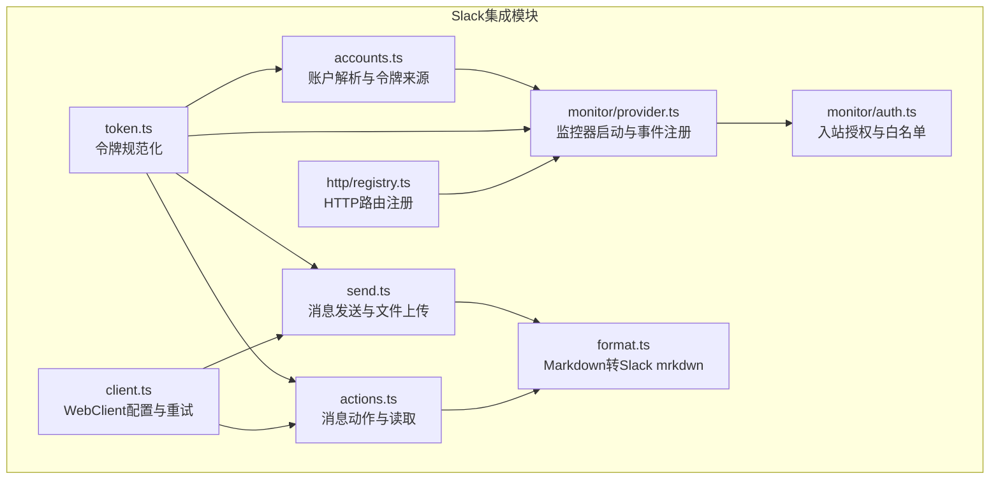
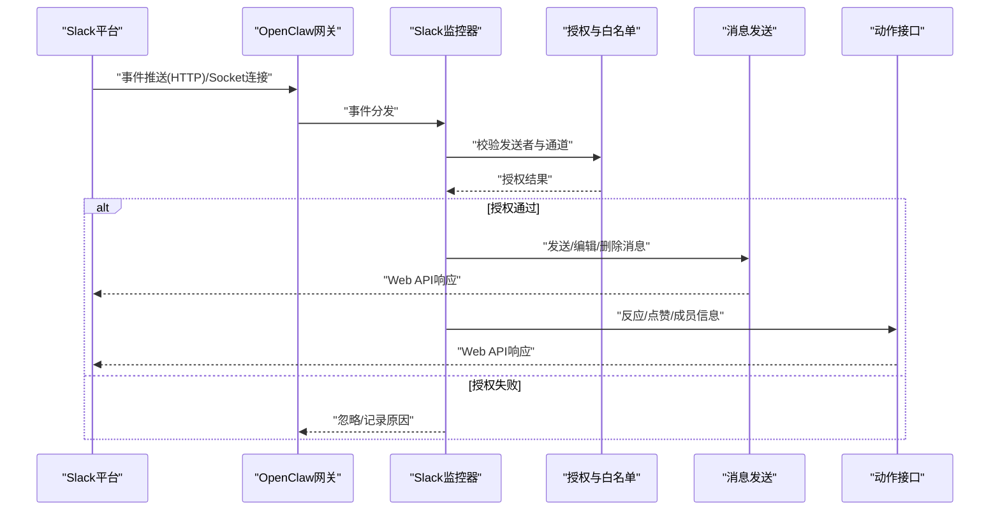
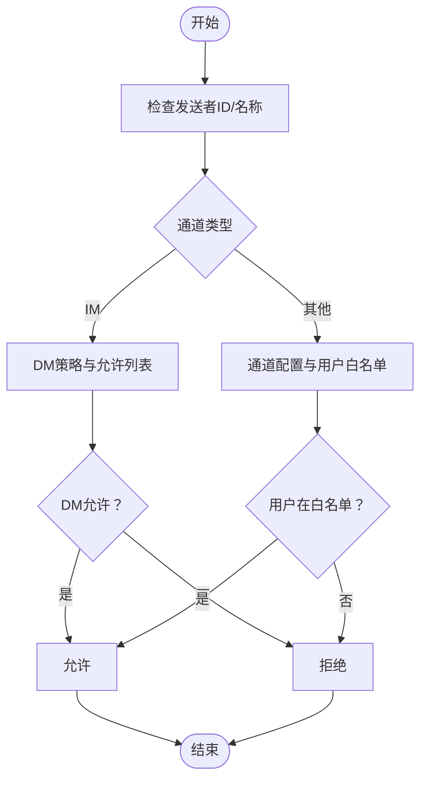
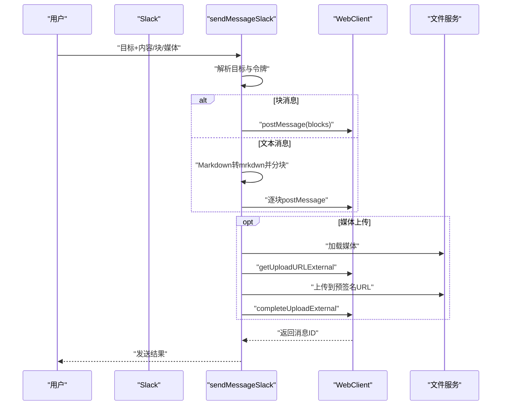
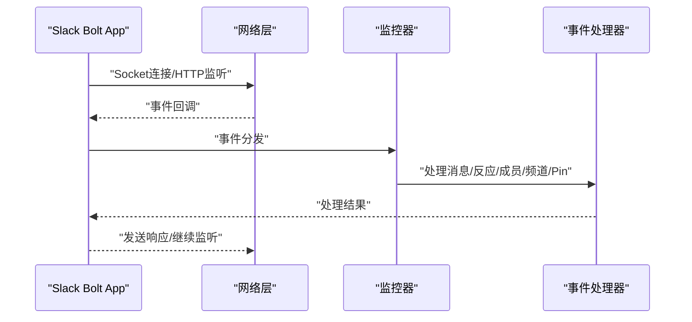
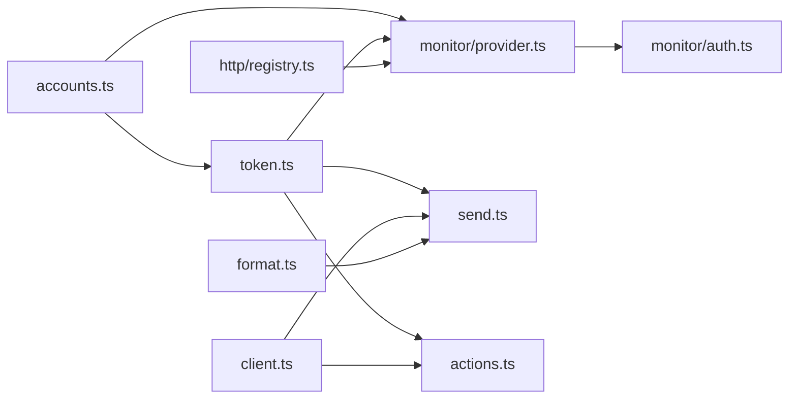

# Slack企业版集成

<cite>
**本文档引用的文件**
- [src/slack/index.ts](file://src/slack/index.ts)
- [docs/channels/slack.md](file://docs/channels/slack.md)
- [src/slack/monitor.ts](file://src/slack/monitor.ts)
- [src/slack/token.ts](file://src/slack/token.ts)
- [src/slack/accounts.ts](file://src/slack/accounts.ts)
- [src/slack/monitor/auth.ts](file://src/slack/monitor/auth.ts)
- [src/slack/http/index.ts](file://src/slack/http/index.ts)
- [src/slack/http/registry.ts](file://src/slack/http/registry.ts)
- [src/slack/client.ts](file://src/slack/client.ts)
- [src/slack/actions.ts](file://src/slack/actions.ts)
- [src/slack/monitor/provider.ts](file://src/slack/monitor/provider.ts)
- [src/slack/send.ts](file://src/slack/send.ts)
- [src/slack/format.ts](file://src/slack/format.ts)
</cite>

## 目录

1. [简介](#简介)
2. [项目结构](#项目结构)
3. [核心组件](#核心组件)
4. [架构总览](#架构总览)
5. [详细组件分析](#详细组件分析)
6. [依赖关系分析](#依赖关系分析)
7. [性能考量](#性能考量)
8. [故障排除指南](#故障排除指南)
9. [结论](#结论)
10. [附录](#附录)

## 简介

本指南面向在Slack企业版（含Enterprise Grid）环境中部署与运维OpenClaw的工程团队，系统性阐述Slack App配置、OAuth认证流程、Workspace权限管理、频道路由、用户身份验证、消息转发与实时事件处理等关键主题。文档同时覆盖多账户配置、HTTP事件API与Socket Mode两种接入模式、API速率限制与错误恢复策略，并提供最佳实践建议。

## 项目结构

OpenClaw的Slack集成采用模块化设计，围绕“账户解析”“令牌管理”“HTTP路由”“消息发送/动作”“监控器（事件处理）”五大模块协同工作，形成从入站事件到出站消息的完整闭环。

**图表来源**

- [src/slack/accounts.ts:1-123](file://src/slack/accounts.ts#L1-123)
- [src/slack/token.ts:1-30](file://src/slack/token.ts#L1-30)
- [src/slack/http/registry.ts:1-50](file://src/slack/http/registry.ts#L1-50)
- [src/slack/client.ts:1-21](file://src/slack/client.ts#L1-21)
- [src/slack/send.ts:1-361](file://src/slack/send.ts#L1-361)
- [src/slack/actions.ts:1-447](file://src/slack/actions.ts#L1-447)
- [src/slack/monitor/provider.ts:1-521](file://src/slack/monitor/provider.ts#L1-521)
- [src/slack/monitor/auth.ts:1-286](file://src/slack/monitor/auth.ts#L1-286)
- [src/slack/format.ts:1-151](file://src/slack/format.ts#L1-151)

**章节来源**

- [src/slack/index.ts:1-26](file://src/slack/index.ts#L1-26)
- [docs/channels/slack.md:1-555](file://docs/channels/slack.md#L1-L555)

## 核心组件

- 账户与令牌
  - 账户解析：支持默认账户与命名账户，合并全局与账户级配置，解析环境变量回退。
  - 令牌规范化：统一处理bot/app/user令牌，确保安全输入。
- HTTP路由
  - 注册/注销Webhook路径，标准化路径格式，避免冲突。
- WebClient与重试
  - 默认重试策略，可按需扩展；统一客户端选项。
- 消息发送
  - 文本分块、Markdown转Slack mrkdwn、文件三步上传流程、线程回复、自定义身份（用户名/头像）。
- 动作接口
  - 反应、点赞、成员信息、消息读取、文件下载等。
- 监控器
  - Socket Mode与HTTP Events API双模式，事件注册、命令注册、健康状态上报、断线重连策略。
- 授权与白名单
  - DM策略、通道允许列表、用户允许列表、名称匹配开关、配对存储缓存。

**章节来源**

- [src/slack/accounts.ts:1-123](file://src/slack/accounts.ts#L1-123)
- [src/slack/token.ts:1-30](file://src/slack/token.ts#L1-30)
- [src/slack/http/registry.ts:1-50](file://src/slack/http/registry.ts#L1-50)
- [src/slack/client.ts:1-21](file://src/slack/client.ts#L1-21)
- [src/slack/send.ts:1-361](file://src/slack/send.ts#L1-361)
- [src/slack/actions.ts:1-447](file://src/slack/actions.ts#L1-447)
- [src/slack/monitor/provider.ts:1-521](file://src/slack/monitor/provider.ts#L1-521)
- [src/slack/monitor/auth.ts:1-286](file://src/slack/monitor/auth.ts#L1-286)

## 架构总览

下图展示Slack企业版集成的关键交互：Gateway通过Socket Mode或HTTP Events API接收事件，经监控器进行授权与路由，再调用发送/动作模块完成消息转发与系统操作。

**图表来源**

- [src/slack/monitor/provider.ts:97-509](file://src/slack/monitor/provider.ts#L97-L509)
- [src/slack/monitor/auth.ts:165-285](file://src/slack/monitor/auth.ts#L165-L285)
- [src/slack/send.ts:252-361](file://src/slack/send.ts#L252-L361)
- [src/slack/actions.ts:157-447](file://src/slack/actions.ts#L157-L447)

## 详细组件分析

### Slack App配置与OAuth认证

- App类型与权限
  - 支持Socket Mode与HTTP Events API两种接入方式。
  - 建议启用“App Home Messages Tab”，以便DM场景使用。
  - Bot作用域包含聊天写入、历史读取、反应/点赞/表情、文件读写等。
- OAuth与令牌
  - Socket Mode：需要bot token与app token（connections:write）。
  - HTTP Events API：需要bot token与signing secret，设置事件订阅与交互请求URL。
  - 用户令牌（userToken）用于只读场景，可选是否允许写入。
- 多账户配置
  - 支持默认账户与命名账户，账户级配置优先于全局配置。
  - 环境变量仅对默认账户生效，命名账户需显式配置。

**章节来源**

- [docs/channels/slack.md:24-135](file://docs/channels/slack.md#L24-L135)
- [src/slack/accounts.ts:47-102](file://src/slack/accounts.ts#L47-L102)
- [src/slack/token.ts:10-30](file://src/slack/token.ts#L10-L30)

### Workspace权限管理

- DM策略
  - 支持配对（pairing，默认）、允许列表（allowlist）、开放（open，需allowFrom包含通配符）、禁用（disabled）。
  - 支持组播DM（MPIM）开关与允许列表。
- 通道策略
  - 支持开放、允许列表、禁用；未配置时运行时回退至允许列表并告警。
  - 名称/ID解析：默认ID优先，开启危险名称匹配后支持名称匹配。
- 用户允许列表
  - 通道级用户白名单、全局allowFrom、配对存储缓存（带TTL），减少重复查询。
- 授权判定流程
  - 发送者ID/名称校验、通道类型与名称解析、通道用户白名单、无通道上下文时的全局allowFrom约束。

**图表来源**

- [src/slack/monitor/auth.ts:165-285](file://src/slack/monitor/auth.ts#L165-L285)

**章节来源**

- [docs/channels/slack.md:136-205](file://docs/channels/slack.md#L136-L205)
- [src/slack/monitor/auth.ts:58-128](file://src/slack/monitor/auth.ts#L58-L128)

### 频道路由与会话管理

- 会话键规则
  - DM：direct；频道：channel；群组：group。
  - 主会话与线程会话后缀（thread:threadTs）。
- 线程与回复
  - replyToMode控制“关闭/首次/全部”；支持按聊天类型（direct/group/channel）分别配置。
  - 手动回复标签：当前回复与指定ID回复。
- 历史与分页
  - 线程初始历史拉取数量可配置；频道/群组默认历史限制可调整。

**章节来源**

- [docs/channels/slack.md:234-255](file://docs/channels/slack.md#L234-L255)

### 用户身份验证与消息转发

- 发送身份定制
  - 支持自定义用户名与头像（URL或表情），若缺少chat:write.customize作用域则自动降级。
- 文本与块消息
  - Markdown转Slack mrkdwn，按行/段落切分，块消息生成回退文本。
- 文件上传
  - 三步上传流程（获取预签名URL→上传→完成），支持线程回复与大小限制。
- 速率限制与错误处理
  - WebClient默认重试策略；发送前检查静默回复标记；媒体下载时进行范围与作用域校验。

**图表来源**

- [src/slack/send.ts:252-361](file://src/slack/send.ts#L252-L361)
- [src/slack/format.ts:117-151](file://src/slack/format.ts#L117-L151)

**章节来源**

- [src/slack/send.ts:89-160](file://src/slack/send.ts#L89-L160)
- [src/slack/format.ts:1-151](file://src/slack/format.ts#L1-L151)

### 实时事件处理（Socket Mode与HTTP）

- Socket Mode
  - 启动时进行鉴权测试，校验bot与app token对应的应用ID一致性。
  - 断线重连：指数退避与最大尝试次数控制；非可恢复认证错误直接失败。
  - 运行时状态：连接成功/断开事件上报，lastEventAt/lastInboundAt用于健康检测。
- HTTP Events API
  - 注册Webhook路径，安装请求体大小与超时保护，签名校验。
  - 支持每账户独立webhookPath，避免注册冲突。
- 事件与命令
  - 注册消息、反应、成员加入/离开、频道重命名、Pin等事件处理器。
  - Slash命令注册与匹配，支持原生命令与单命令模式。

**图表来源**

- [src/slack/monitor/provider.ts:196-309](file://src/slack/monitor/provider.ts#L196-L309)
- [src/slack/http/registry.ts:25-49](file://src/slack/http/registry.ts#L25-L49)

**章节来源**

- [src/slack/monitor/provider.ts:97-509](file://src/slack/monitor/provider.ts#L97-L509)
- [src/slack/http/registry.ts:1-50](file://src/slack/http/registry.ts#L1-L50)

### 动作接口与系统事件映射

- 动作能力
  - 消息：发送、编辑、删除、读取历史/回复。
  - 反应：添加/移除/移除自身反应、列出反应。
  - 成员与表情：成员信息、表情列表。
  - Pin：添加/移除/列出。
  - 文件：下载（含作用域校验与大小限制）。
- 系统事件映射
  - 编辑/删除/线程广播、反应增删、成员进出、频道重命名/Pin增删等均映射为系统事件，便于上层处理。

**章节来源**

- [src/slack/actions.ts:80-447](file://src/slack/actions.ts#L80-L447)
- [docs/channels/slack.md:298-310](file://docs/channels/slack.md#L298-L310)

### Enterprise Grid部署要点

- 多账户与多租户
  - 使用命名账户隔离不同Workspace/Team的令牌与配置。
  - 每个账户可独立选择Socket Mode或HTTP Events API，并设置独立webhookPath。
- 权限与作用域
  - 在每个Workspace中为App授予必要Bot作用域；如需自定义身份，需chat:write.customize。
  - 用户令牌仅在需要读取场景使用，写入优先使用Bot令牌。
- 安全与合规
  - 使用签名密钥（HTTP模式）与受信代理策略（文件上传）降低SSRF风险。
  - 严格控制allowFrom与通道用户白名单，避免越权访问。

**章节来源**

- [docs/channels/slack.md:123-135](file://docs/channels/slack.md#L123-L135)
- [src/slack/http/registry.ts:17-23](file://src/slack/http/registry.ts#L17-L23)
- [src/slack/send.ts:26-29](file://src/slack/send.ts#L26-L29)

## 依赖关系分析

**图表来源**

- [src/slack/accounts.ts:1-123](file://src/slack/accounts.ts#L1-L123)
- [src/slack/token.ts:1-30](file://src/slack/token.ts#L1-L30)
- [src/slack/monitor/provider.ts:1-521](file://src/slack/monitor/provider.ts#L1-L521)
- [src/slack/http/registry.ts:1-50](file://src/slack/http/registry.ts#L1-L50)
- [src/slack/client.ts:1-21](file://src/slack/client.ts#L1-L21)
- [src/slack/send.ts:1-361](file://src/slack/send.ts#L1-L361)
- [src/slack/actions.ts:1-447](file://src/slack/actions.ts#L1-L447)
- [src/slack/format.ts:1-151](file://src/slack/format.ts#L1-L151)
- [src/slack/monitor/auth.ts:1-286](file://src/slack/monitor/auth.ts#L1-L286)

**章节来源**

- [src/slack/index.ts:1-26](file://src/slack/index.ts#L1-26)

## 性能考量

- 重试与退避
  - WebClient默认重试配置可平衡瞬时失败与资源占用；Socket Mode断线重连采用指数退避。
- 文本分块与Markdown渲染
  - 分块长度与模式（按换行/整体）影响API调用次数；Markdown转Slack mrkdwn避免HTML注入。
- 文件上传
  - 三步上传避免旧端点限制；媒体大小限制与SSRF策略保障稳定性与安全性。
- 允许列表解析
  - 启动阶段解析通道与用户白名单，后续使用缓存（含配对存储）降低查询成本。

[本节为通用指导，无需特定文件来源]

## 故障排除指南

- 无回复/消息被忽略
  - 检查通道策略（groupPolicy）、通道允许列表、是否需要提及（requireMention）、通道用户白名单。
- DM被忽略
  - 检查DM开关、DM策略、配对/允许列表。
- Socket模式无法连接
  - 校验bot与app token、Slack App设置中Socket Mode已启用。
- HTTP模式不接收事件
  - 校验signing secret、webhook路径、Request URL配置、每账户唯一webhookPath。
- 原生/单命令未触发
  - 确认是否启用原生命令模式与Slack侧命令注册，或使用单命令模式。

**章节来源**

- [docs/channels/slack.md:433-490](file://docs/channels/slack.md#L433-L490)

## 结论

OpenClaw在Slack企业版上的集成以模块化架构实现高可用、可扩展的消息编排与事件处理。通过严格的令牌管理、灵活的多账户配置、完善的授权与白名单机制、稳健的发送与动作接口，以及Socket Mode与HTTP Events API双模式支持，能够满足企业级部署的复杂需求。配合速率限制与错误恢复策略，可在生产环境中稳定运行。

[本节为总结，无需特定文件来源]

## 附录

### 配置参考要点

- 认证与模式
  - mode、botToken、appToken、signingSecret、webhookPath、accounts.\*
- DM访问
  - dm.enabled、dmPolicy、allowFrom、dm.groupEnabled、dm.groupChannels
- 通道与线程
  - groupPolicy、channels._、requireMention、replyToMode、thread._
- 交付与特性
  - textChunkLimit、chunkMode、mediaMaxMb、streaming、nativeStreaming、commands.native、slashCommand.\*

**章节来源**

- [docs/channels/slack.md:533-555](file://docs/channels/slack.md#L533-L555)
