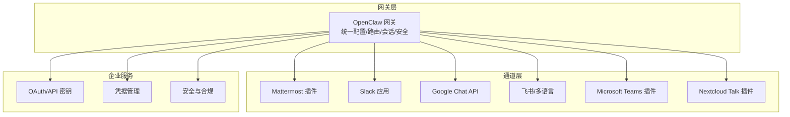
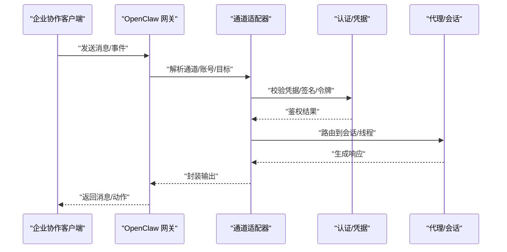
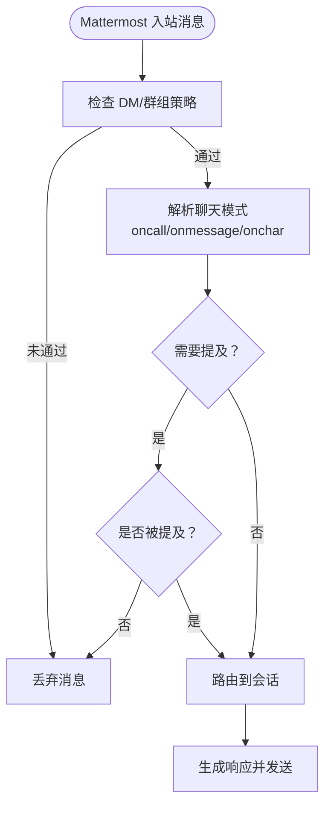
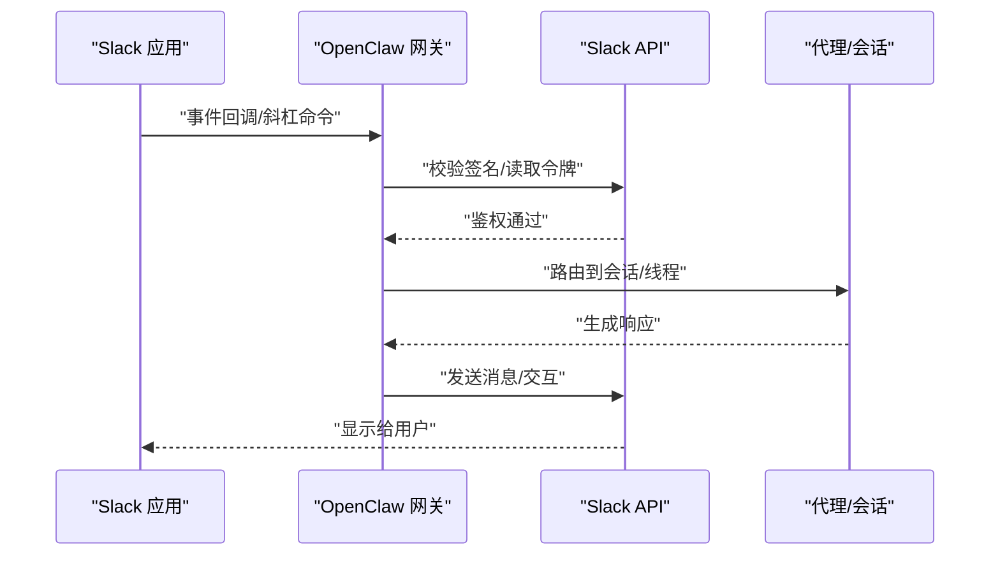
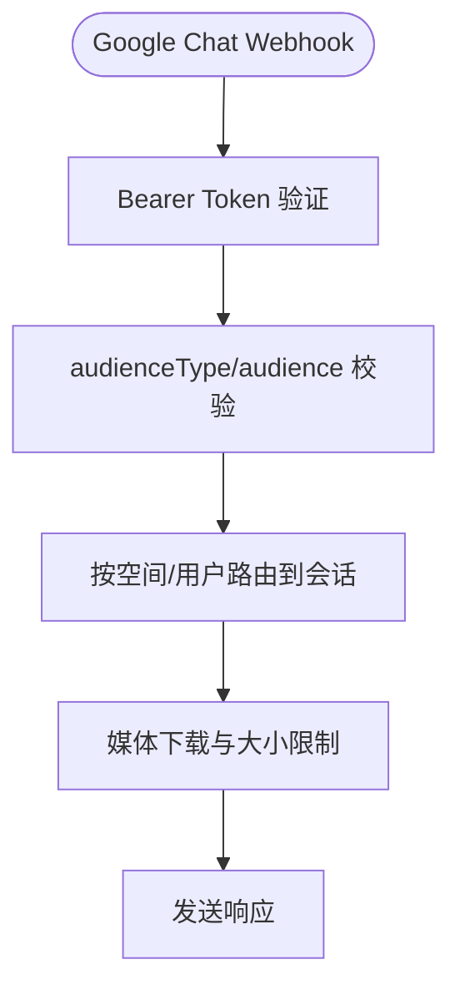
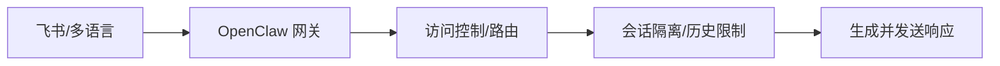
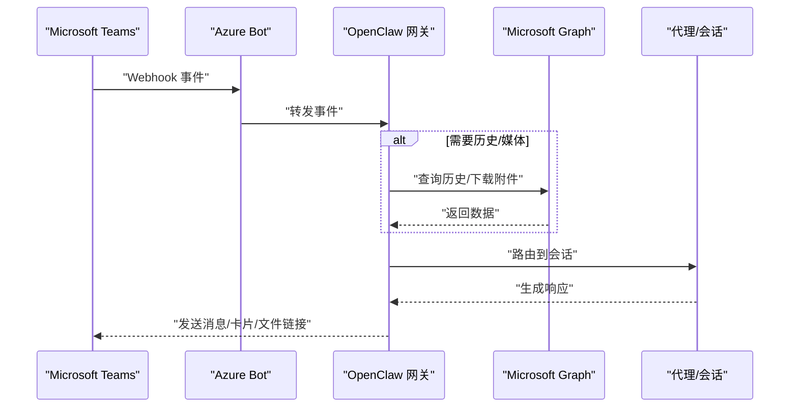
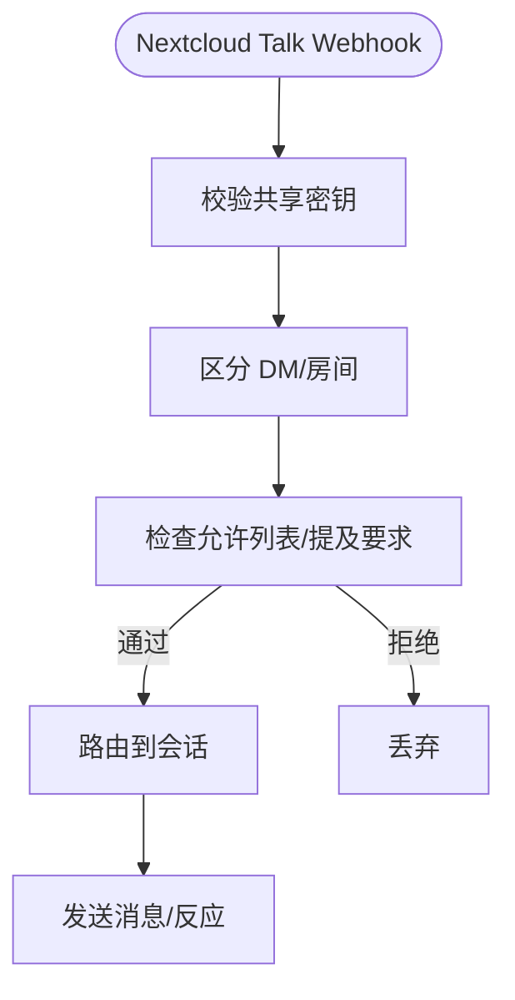
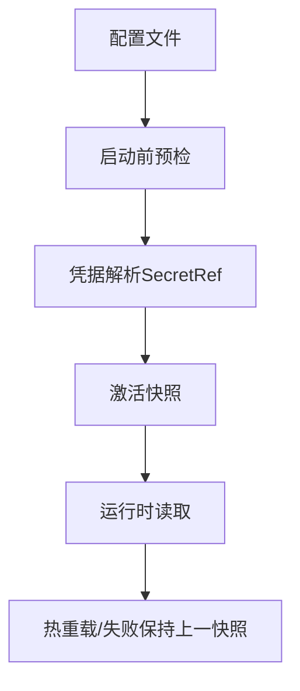
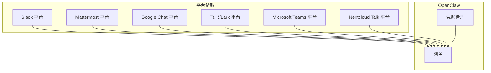

# 企业级消息平台

<cite>
**本文档引用的文件**
- [mattermost.md](file://docs/channels/mattermost.md)
- [slack.md](file://docs/channels/slack.md)
- [googlechat.md](file://docs/channels/googlechat.md)
- [feishu.md](file://docs/channels/feishu.md)
- [msteams.md](file://docs/channels/msteams.md)
- [nextcloud-talk.md](file://docs/channels/nextcloud-talk.md)
- [configuration.md](file://docs/gateway/configuration.md)
- [configuration-reference.md](file://docs/gateway/configuration-reference.md)
- [authentication.md](file://docs/gateway/authentication.md)
- [secrets.md](file://docs/gateway/secrets.md)
- [index.md](file://docs/install/index.md)
- [troubleshooting.md](file://docs/gateway/troubleshooting.md)
- [README.md](file://docs/security/README.md)
</cite>

## 目录

1. [简介](#简介)
2. [项目结构](#项目结构)
3. [核心组件](#核心组件)
4. [架构总览](#架构总览)
5. [详细组件分析](#详细组件分析)
6. [依赖关系分析](#依赖关系分析)
7. [性能考虑](#性能考虑)
8. [故障排除指南](#故障排除指南)
9. [结论](#结论)
10. [附录](#附录)

## 简介

本文件面向企业用户，系统化梳理 OpenClaw 在企业级消息平台中的集成能力与最佳实践，覆盖 Mattermost、Slack、Google Chat、飞书（Feishu）、Microsoft Teams、Nextcloud Talk 等主流协作平台。内容包括：认证与授权、权限控制、群组路由、管理员配置、企业部署与安全策略、合规要求、常见集成挑战与性能优化方案。

## 项目结构

OpenClaw 通过“网关 + 插件/扩展”的方式支持多通道接入。各企业协作平台以独立文档与配置块呈现，统一由网关进行会话、路由、权限与安全控制。

图示来源

- [configuration-reference.md:18-654](file://docs/gateway/configuration-reference.md#L18-L654)
- [mattermost.md:1-370](file://docs/channels/mattermost.md#L1-L370)
- [slack.md:1-555](file://docs/channels/slack.md#L1-L555)
- [googlechat.md:1-262](file://docs/channels/googlechat.md#L1-L262)
- [feishu.md:1-652](file://docs/channels/feishu.md#L1-L652)
- [msteams.md:1-777](file://docs/channels/msteams.md#L1-L777)
- [nextcloud-talk.md:1-139](file://docs/channels/nextcloud-talk.md#L1-L139)

章节来源

- [configuration-reference.md:18-654](file://docs/gateway/configuration-reference.md#L18-L654)

## 核心组件

- 通道配置与访问控制：各通道均支持 DM 策略（配对/白名单/开放/禁用）与群组策略（允许/开放/禁用），并可按通道/账号/群组细化。
- 会话与路由：基于会话键隔离不同聊天类型（DM/群组/频道），支持线程绑定、历史上下文限制等。
- 认证与凭据：支持 API Key、订阅型 setup-token、SecretRef（环境变量/文件/执行器）等多种凭据模式。
- 安全与合规：凭据安全存储、启动失败快速检测、凭据变更原子替换、审计与清理策略。
- 运维与可观测性：健康检查、日志流、诊断命令、远程连接与设备身份验证。

章节来源

- [configuration.md:14-547](file://docs/gateway/configuration.md#L14-L547)
- [configuration-reference.md:18-800](file://docs/gateway/configuration-reference.md#L18-L800)
- [authentication.md:1-180](file://docs/gateway/authentication.md#L1-L180)
- [secrets.md:1-455](file://docs/gateway/secrets.md#L1-L455)

## 架构总览

下图展示企业消息平台在 OpenClaw 中的总体交互：客户端应用（Slack/Teams/飞书等）通过各自 API 或 Webhook 连接 OpenClaw 网关；网关根据配置进行鉴权、路由与会话管理，并调用模型与工具完成回复。

图示来源

- [configuration-reference.md:18-654](file://docs/gateway/configuration-reference.md#L18-L654)
- [slack.md:284-310](file://docs/channels/slack.md#L284-L310)
- [msteams.md:142-150](file://docs/channels/msteams.md#L142-L150)
- [googlechat.md:139-153](file://docs/channels/googlechat.md#L139-L153)

## 详细组件分析

### Mattermost 集成

- 支持模式：插件安装，使用机器人令牌 + WebSocket 事件，支持频道、群组与私信。
- 关键配置要点：
  - 基础配置：启用、机器人令牌、基础 URL、DM 策略。
  - 原生斜杠命令：可注册 oc\_\* 命令并通过回调路径回传；需确保回调端点可达且允许内网地址。
  - 聊天模式：oncall（仅提及）、onmessage（全部消息）、onchar（前缀触发）。
  - 访问控制：DM 默认配对；群组默认允许列表且需提及；可通过 allowFrom 与 groupAllowFrom 细化。
  - 按钮交互：支持内联按钮，回调使用 HMAC-SHA256 校验；注意 Mattermost 对 action id 的限制。
  - 多账户：支持 accounts 下多账号配置。
- 故障排除：无回复检查 mention/allowlist；按钮点击 404 多因非字母数字 id；HMAC 不匹配检查签名流程与密钥派生。

图示来源

- [mattermost.md:106-131](file://docs/channels/mattermost.md#L106-L131)
- [mattermost.md:132-147](file://docs/channels/mattermost.md#L132-L147)
- [mattermost.md:442-482](file://docs/channels/mattermost.md#L442-L482)

章节来源

- [mattermost.md:1-370](file://docs/channels/mattermost.md#L1-L370)

### Slack 集成

- 支持模式：Socket Mode（推荐）与 HTTP Events API；支持原生斜杠命令与交互式块。
- 关键配置要点：
  - 认证模型：Socket Mode 需 botToken + appToken；HTTP 模式需 botToken + signingSecret。
  - 访问控制：DM 策略（pairing/allowlist/open/disabled）；群组策略（open/allowlist/disabled）；通道 allowlist 与 per-channel 控制。
  - 线程与会话：DM 默认主会话合并；频道/群组会话键隔离；支持线程历史继承与历史条数限制。
  - 媒体与分片：入站文件下载与大小限制；出站文本按 textChunkLimit 分片，支持换行优先切分。
  - 动作与门控：消息/反应/置顶/成员信息/表情包列表等动作组可控。
- 故障排除：无回复优先检查 groupPolicy/allowlist/mention；Socket/HTTP 模式分别核对令牌与回调 URL；原生命令需在 Slack 注册对应 /command。

图示来源

- [slack.md:284-310](file://docs/channels/slack.md#L284-L310)
- [slack.md:340-431](file://docs/channels/slack.md#L340-L431)
- [slack.md:492-532](file://docs/channels/slack.md#L492-L532)

章节来源

- [slack.md:1-555](file://docs/channels/slack.md#L1-L555)

### Google Chat 集成

- 支持模式：HTTP Webhook（仅 HTTP），需公网 HTTPS 端点；支持 DM 与空间（群组）。
- 关键配置要点：
  - 凭据：服务账号 JSON 文件或内联；支持 SecretRef；配置 audienceType 与 audience。
  - 会话键：DM 使用 agent:<agentId>:googlechat:dm:<spaceId>；空间使用 agent:<agentId>:googlechat:group:<spaceId>。
  - 访问控制：DM 默认配对；群组默认提及要求；可通过 allowFrom 与 groups.<space>.requireMention 控制。
  - 媒体与大小：附件经 Chat API 下载并写入媒体存储，受 mediaMaxMb 限制。
- 故障排除：405 可能为通道未配置或未重启；核对 webhook URL 与事件订阅；mention gating 阻止回复时设置 botUser。

图示来源

- [googlechat.md:139-153](file://docs/channels/googlechat.md#L139-L153)
- [googlechat.md:163-206](file://docs/channels/googlechat.md#L163-L206)

章节来源

- [googlechat.md:1-262](file://docs/channels/googlechat.md#L1-L262)

### 飞书（含 Lark 国际版）集成

- 支持模式：插件内置，推荐 WebSocket 长连接（无需公网 URL）；也支持 webhook 模式。
- 关键配置要点：
  - 凭据：App ID/App Secret；可设置 domain 为 feishu 或 lark。
  - 访问控制：DM 默认配对；群组默认开放但需提及；可通过 groupPolicy 与 groupAllowFrom 控制。
  - 会话与路由：DM 共享主会话；群组隔离；支持 sender allowlist。
  - 优化：typingIndicator 与 resolveSenderNames 可按需关闭以降低 API 调用。
- 故障排除：Bot 不回复检查 mention 与 groupPolicy；事件订阅需启用长连接；发布审批后生效。

图示来源

- [feishu.md:289-326](file://docs/channels/feishu.md#L289-L326)
- [feishu.md:481-531](file://docs/channels/feishu.md#L481-L531)

章节来源

- [feishu.md:1-652](file://docs/channels/feishu.md#L1-L652)

### Microsoft Teams 集成

- 支持模式：插件安装，需 Azure Bot（App ID/密码/租户 ID）+ 公网 Webhook；支持个人/团队/群聊。
- 关键配置要点：
  - 凭据与端点：appId/appPassword/tenantId；webhook.port/path。
  - 访问控制：DM 默认配对；群组默认允许列表且提及要求；可按团队/频道细化。
  - 历史与媒体：RSC 权限仅实现实时监听；Graph 权限用于历史与附件下载；文件上传需 SharePoint Site ID。
  - 会话与回复样式：支持 Posts/Threads 两种 UI 风格，需按频道配置 replyStyle。
  - 交互：Adaptive Cards 发送投票与任意卡片；文件发送在群组中需 Graph + SharePoint。
- 故障排除：图片不显示通常为缺少 Graph 权限；401 为端点可达但鉴权失败；Manifest 上传错误参考清单。

图示来源

- [msteams.md:142-150](file://docs/channels/msteams.md#L142-L150)
- [msteams.md:417-449](file://docs/channels/msteams.md#L417-L449)
- [msteams.md:520-597](file://docs/channels/msteams.md#L520-L597)

章节来源

- [msteams.md:1-777](file://docs/channels/msteams.md#L1-L777)

### Nextcloud Talk 集成

- 支持模式：插件安装，Webhook 机器人；支持 DM、房间、反应与 Markdown。
- 关键配置要点：
  - 凭据：baseUrl + botSecret；可选 webhookPublicUrl。
  - 访问控制：DM 默认配对；群组默认允许列表且提及要求；rooms.<token> 可细化。
  - 限制：机器人无法发起 DM；媒体上传不支持，以 URL 形式发送。
- 故障排除：Webhook 不可达需设置 webhookPublicUrl；DM 识别需 apiUser/apiPassword。

图示来源

- [nextcloud-talk.md:33-139](file://docs/channels/nextcloud-talk.md#L33-L139)

章节来源

- [nextcloud-talk.md:1-139](file://docs/channels/nextcloud-talk.md#L1-L139)

### 企业认证机制与凭据管理

- 认证方式：API Key（推荐）、订阅型 setup-token（Anthropic）、OAuth。
- 凭据存储：支持明文与 SecretRef（env/file/exec），启动失败快速检测，重载原子替换。
- 运行时行为：凭据解析在激活阶段完成，热重载采用“全成功或保留上次已知良好快照”。

图示来源

- [authentication.md:21-139](file://docs/gateway/authentication.md#L21-L139)
- [secrets.md:16-65](file://docs/gateway/secrets.md#L16-L65)

章节来源

- [authentication.md:1-180](file://docs/gateway/authentication.md#L1-L180)
- [secrets.md:1-455](file://docs/gateway/secrets.md#L1-L455)

### 权限管理与群组路由

- DM 策略：pairing（默认，需批准）、allowlist、open（需 allowFrom: ["*"]）、disabled。
- 群组策略：open（默认允许列表）、allowlist、disabled。
- 通道级控制：各通道支持 per-channel/per-account 细粒度 allowlist、requireMention、mentionPatterns。
- 会话隔离：按通道/群组/用户维度隔离，支持线程绑定与历史限制。

章节来源

- [configuration-reference.md:22-91](file://docs/gateway/configuration-reference.md#L22-L91)
- [slack.md:136-205](file://docs/channels/slack.md#L136-L205)
- [mattermost.md:132-147](file://docs/channels/mattermost.md#L132-L147)
- [googlechat.md:154-206](file://docs/channels/googlechat.md#L154-L206)
- [feishu.md:299-391](file://docs/channels/feishu.md#L299-L391)
- [msteams.md:85-141](file://docs/channels/msteams.md#L85-L141)
- [nextcloud-talk.md:70-97](file://docs/channels/nextcloud-talk.md#L70-L97)

### 管理员配置与运维

- 配置方式：交互向导、CLI、控制 UI、直接编辑；支持 JSON5 与 $include。
- 热重载：大部分字段即时生效；网关/基础设施类变更需重启。
- 远程与设备身份：支持设备身份验证、一次性挑战/签名流程与轮换。
- 健康检查：doctor/status/logs/channels status --probe。

章节来源

- [configuration.md:349-447](file://docs/gateway/configuration.md#L349-L447)
- [troubleshooting.md:14-380](file://docs/gateway/troubleshooting.md#L14-L380)

## 依赖关系分析

- 通道与网关：通道通过统一配置块接入，网关负责鉴权、路由、会话与安全。
- 平台依赖：各通道依赖平台 API/SDK/Webhook；Teams 额外依赖 Graph 权限。
- 凭据依赖：SecretRef 提供统一凭据抽象，避免明文存储。

图示来源

- [slack.md:340-431](file://docs/channels/slack.md#L340-L431)
- [msteams.md:293-416](file://docs/channels/msteams.md#L293-L416)
- [googlechat.md:139-153](file://docs/channels/googlechat.md#L139-L153)
- [mattermost.md:15-35](file://docs/channels/mattermost.md#L15-L35)
- [feishu.md:15-27](file://docs/channels/feishu.md#L15-L27)
- [nextcloud-talk.md:12-32](file://docs/channels/nextcloud-talk.md#L12-L32)

## 性能考虑

- 通道选择：
  - Slack/Teams：Socket Mode（低延迟）优先于 HTTP；Teams RSC 仅实时监听，Graph 权限用于历史与媒体。
  - Mattermost：WebSocket 事件；按钮交互需注意 Mattermost 对 action id 的限制。
  - Google Chat：仅 HTTP，建议使用 Tailscale Funnel 仅暴露 webhook 路径。
  - 飞书：WebSocket 优先；可关闭 typingIndicator 与 resolveSenderNames 降低 API 调用。
- 媒体与分片：合理设置 mediaMaxMb 与 textChunkLimit，避免超大附件与长文本阻塞。
- 会话与历史：按需设置 historyLimit，避免过长历史导致上下文膨胀与成本上升。
- 重试与退避：通道层提供重试策略，结合网关限速与模型降级策略。

章节来源

- [slack.md:492-532](file://docs/channels/slack.md#L492-L532)
- [msteams.md:417-449](file://docs/channels/msteams.md#L417-L449)
- [googlechat.md:64-138](file://docs/channels/googlechat.md#L64-L138)
- [feishu.md:236-263](file://docs/channels/feishu.md#L236-L263)

## 故障排除指南

- 通用步骤：status/gateway status/logs --follow/doctor/channels status --probe。
- 常见问题：
  - 无回复：检查 groupPolicy/allowlist/mention；核对 per-channel 配置。
  - 认证失败：核对 botToken/appToken/signingSecret/服务账号文件；确认回调/端点可达。
  - 按钮/交互异常：HMAC 签名顺序/密钥派生；Mattermost action id 仅允许字母数字。
  - Teams 图片/文件：确认 Graph 权限与 SharePoint Site ID；私有频道行为差异。
  - 控制 UI 连接：设备身份/一次性挑战/签名流程；共享令牌漂移需轮换。
- 升级后异常：检查 gateway.mode/remote.url/auth.mode；严格绑定与鉴权规则；重新安装服务元数据。

章节来源

- [troubleshooting.md:14-380](file://docs/gateway/troubleshooting.md#L14-L380)
- [mattermost.md:358-370](file://docs/channels/mattermost.md#L358-L370)
- [msteams.md:745-777](file://docs/channels/msteams.md#L745-L777)
- [googlechat.md:209-256](file://docs/channels/googlechat.md#L209-L256)

## 结论

OpenClaw 通过统一网关与模块化通道设计，为企业用户提供一致的认证、权限、路由与安全体验。针对不同企业协作平台，应结合其 API 特性与企业网络边界，选择合适的接入模式（WebSocket/HTTP/RSC/Graph），并以 SecretRef 实现凭据安全存储与变更管理。通过精细化的 DM/群组策略、会话隔离与历史限制，可在保障合规与安全的前提下实现高可用的消息平台集成。

## 附录

### 企业部署最佳实践

- 环境准备：Node 22+，推荐使用安装脚本或容器化部署；云主机首选干净系统镜像。
- 网络边界：仅暴露必要路径（如 Google Chat 的 /googlechat），其余端点保持内网；使用 Tailscale Funnel/Funnel 与 Serve 组合。
- 凭据与安全：优先 SecretRef；定期轮换；审计明文残留与过期令牌。
- 监控与告警：doctor/status/logs/channels status --probe；心跳与 Cron 运行状态检查。

章节来源

- [index.md:14-219](file://docs/install/index.md#L14-L219)
- [googlechat.md:64-138](file://docs/channels/googlechat.md#L64-L138)
- [secrets.md:425-455](file://docs/gateway/secrets.md#L425-L455)

### 安全与合规

- 安全信任页与威胁模型：参阅安全文档索引页。
- 凭据安全：启动失败快速检测、原子替换、审计与清理策略。
- 合规提示：最小权限原则（Graph/RSC 权限）、凭据生命周期管理、日志与审计留痕。

章节来源

- [README.md:1-18](file://docs/security/README.md#L1-L18)
- [secrets.md:16-65](file://docs/gateway/secrets.md#L16-L65)
