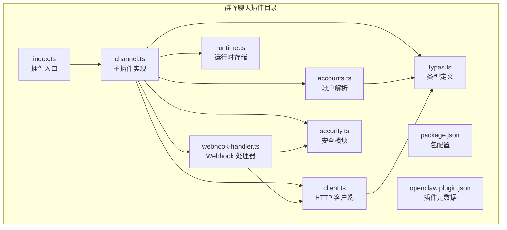
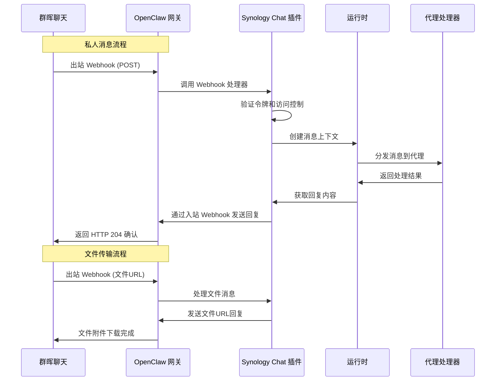
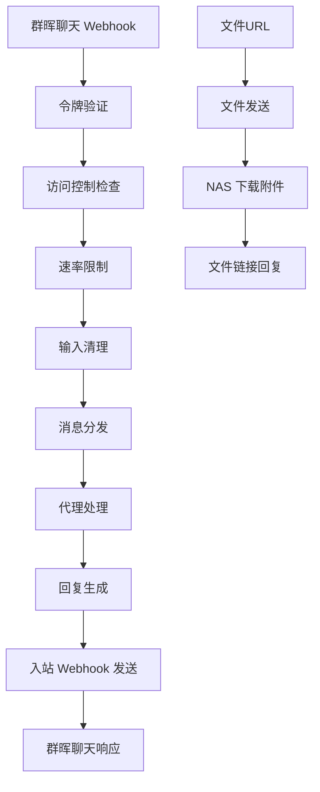
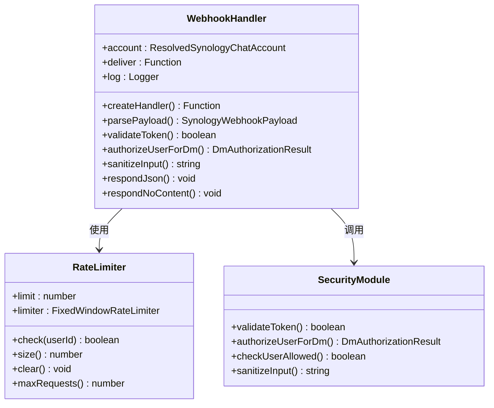
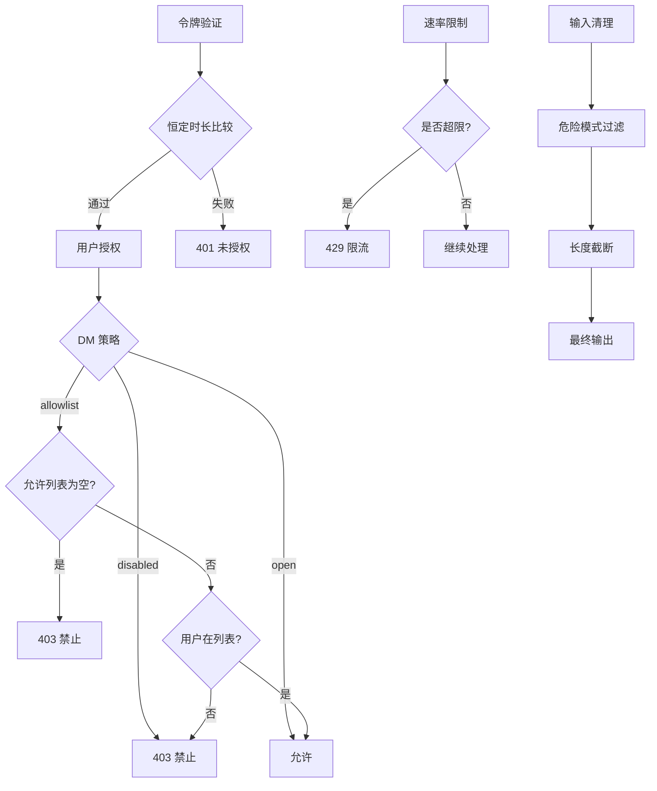
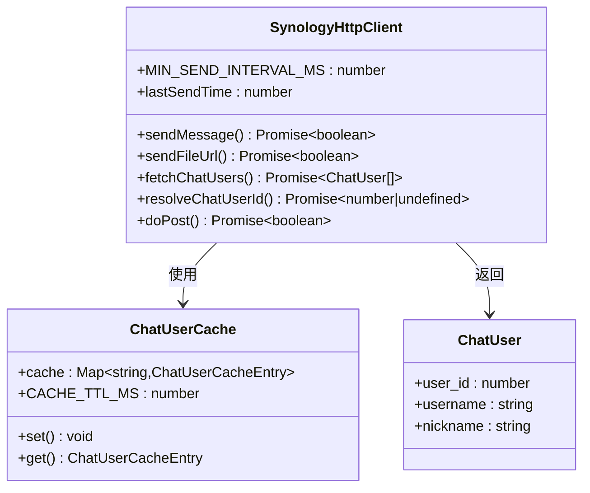
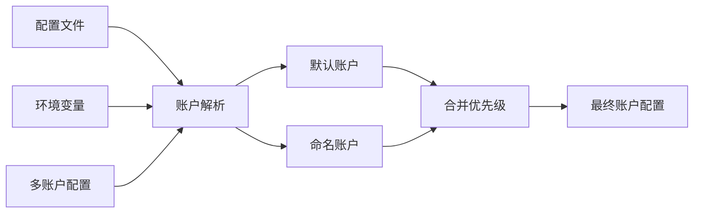
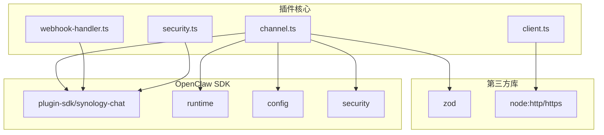

# 群晖聊天集成

<cite>
**本文档引用的文件**
- [extensions/synology-chat/index.ts](file://extensions/synology-chat/index.ts)
- [extensions/synology-chat/src/channel.ts](file://extensions/synology-chat/src/channel.ts)
- [extensions/synology-chat/src/client.ts](file://extensions/synology-chat/src/client.ts)
- [extensions/synology-chat/src/accounts.ts](file://extensions/synology-chat/src/accounts.ts)
- [extensions/synology-chat/src/types.ts](file://extensions/synology-chat/src/types.ts)
- [extensions/synology-chat/src/webhook-handler.ts](file://extensions/synology-chat/src/webhook-handler.ts)
- [extensions/synology-chat/src/security.ts](file://extensions/synology-chat/src/security.ts)
- [extensions/synology-chat/src/runtime.ts](file://extensions/synology-chat/src/runtime.ts)
- [extensions/synology-chat/package.json](file://extensions/synology-chat/package.json)
- [extensions/synology-chat/openclaw.plugin.json](file://extensions/synology-chat/openclaw.plugin.json)
- [docs/channels/synology-chat.md](file://docs/channels/synology-chat.md)
</cite>

## 目录

1. [简介](#简介)
2. [项目结构](#项目结构)
3. [核心组件](#核心组件)
4. [架构概览](#架构概览)
5. [详细组件分析](#详细组件分析)
6. [依赖关系分析](#依赖关系分析)
7. [性能考虑](#性能考虑)
8. [故障排除指南](#故障排除指南)
9. [结论](#结论)
10. [附录](#附录)

## 简介

本文件为群晖聊天（Synology Chat）与 OpenClaw 的集成文档，详细说明了如何在群晖 NAS 上配置群晖聊天应用，并通过 OpenClaw 实现与聊天机器人的完整集成。该集成支持私有消息（Direct Message）和文件传输，采用 Webhook 方式实现双向通信，并提供了强大的安全控制、速率限制和多账户管理能力。

本集成基于 OpenClaw 的插件架构，使用群晖聊天的外部集成 Webhook 功能，实现以下核心功能：

- 接收来自群晖聊天的出站 Webhook 消息
- 验证令牌并进行访问控制
- 将消息路由到 OpenClaw 代理进行处理
- 通过入站 Webhook 发送回复和文件
- 支持多账户配置和运行时动态启停

## 项目结构

群晖聊天插件位于 `extensions/synology-chat` 目录下，采用模块化设计，包含以下关键文件：



**图表来源**

- [extensions/synology-chat/index.ts:1-18](file://extensions/synology-chat/index.ts#L1-L18)
- [extensions/synology-chat/src/channel.ts:1-50](file://extensions/synology-chat/src/channel.ts#L1-L50)

**章节来源**

- [extensions/synology-chat/index.ts:1-18](file://extensions/synology-chat/index.ts#L1-L18)
- [extensions/synology-chat/package.json:1-29](file://extensions/synology-chat/package.json#L1-L29)

## 核心组件

### 插件注册与初始化

插件通过 `index.ts` 进行注册，主要职责包括：

- 定义插件元数据（ID、名称、描述）
- 注册通道插件实例
- 设置运行时环境

### 主插件实现（channel.ts）

主插件实现了完整的通道接口，包含以下核心功能：

- **元数据定义**：插件标识、标签、文档路径
- **能力声明**：支持直接消息、媒体发送、不支持线程等
- **配置管理**：账户列表、账户解析、默认账户ID
- **安全策略**：DM 策略解析、警告收集
- **消息处理**：目标标准化、ID 判断、目录服务
- **出站发送**：文本消息和媒体文件发送
- **网关集成**：HTTP 路由注册、生命周期管理
- **代理提示**：格式化指导和最佳实践

### HTTP 客户端（client.ts）

提供与群晖聊天 API 交互的核心功能：

- 文本消息发送（带重试机制）
- 文件 URL 发送
- 用户 ID 解析（解决 Webhook 用户ID与聊天API用户ID差异）
- 用户列表缓存（避免频繁API调用）
- 内部速率限制（最小500ms间隔）

### 账户解析（accounts.ts）

负责从配置和环境变量中解析账户信息：

- 支持基础配置和多账户配置
- 环境变量回退机制
- 允许用户ID解析和速率限制解析
- 账户ID列表生成

### 类型定义（types.ts）

定义所有必要的 TypeScript 类型：

- 渠道配置接口
- 账户配置接口
- 已解析账户接口
- Webhook 负载接口

**章节来源**

- [extensions/synology-chat/src/channel.ts:42-380](file://extensions/synology-chat/src/channel.ts#L42-L380)
- [extensions/synology-chat/src/client.ts:1-266](file://extensions/synology-chat/src/client.ts#L1-L266)
- [extensions/synology-chat/src/accounts.ts:1-97](file://extensions/synology-chat/src/accounts.ts#L1-L97)
- [extensions/synology-chat/src/types.ts:1-61](file://extensions/synology-chat/src/types.ts#L1-L61)

## 架构概览

群晖聊天集成采用双向 Webhook 架构，实现消息的接收和发送：



**图表来源**

- [extensions/synology-chat/src/webhook-handler.ts:251-396](file://extensions/synology-chat/src/webhook-handler.ts#L251-L396)
- [extensions/synology-chat/src/channel.ts:230-351](file://extensions/synology-chat/src/channel.ts#L230-L351)

### 数据流图



**图表来源**

- [extensions/synology-chat/src/webhook-handler.ts:284-394](file://extensions/synology-chat/src/webhook-handler.ts#L284-L394)
- [extensions/synology-chat/src/client.ts:92-115](file://extensions/synology-chat/src/client.ts#L92-L115)

## 详细组件分析

### Webhook 处理器

Webhook 处理器是消息处理的核心组件，负责完整的请求处理流程：



**图表来源**

- [extensions/synology-chat/src/webhook-handler.ts:218-237](file://extensions/synology-chat/src/webhook-handler.ts#L218-L237)
- [extensions/synology-chat/src/security.ts:92-124](file://extensions/synology-chat/src/security.ts#L92-L124)

#### 请求处理流程

Webhook 处理器遵循严格的处理顺序：

1. **方法验证**：仅接受 POST 请求
2. **请求体读取**：限制最大1MB，超时30秒
3. **负载解析**：支持 JSON 和表单编码，自动检测内容类型
4. **令牌验证**：使用恒定时长比较防止时序攻击
5. **用户授权**：根据 DM 策略检查用户权限
6. **速率限制**：固定窗口限流器按用户ID跟踪
7. **输入清理**：过滤危险模式和过长内容
8. **立即确认**：返回 204 No Content 避免重复投递
9. **异步处理**：交给代理处理器生成回复
10. **错误处理**：捕获异常并发送友好错误消息

**章节来源**

- [extensions/synology-chat/src/webhook-handler.ts:251-396](file://extensions/synology-chat/src/webhook-handler.ts#L251-L396)
- [extensions/synology-chat/src/security.ts:1-125](file://extensions/synology-chat/src/security.ts#L1-L125)

### 安全模块

安全模块提供了多层次的安全保护：



**图表来源**

- [extensions/synology-chat/src/security.ts:19-87](file://extensions/synology-chat/src/security.ts#L19-L87)

#### 安全特性

- **恒定时长令牌比较**：防止时序攻击泄露令牌信息
- **多层授权策略**：
  - `disabled`：完全禁止私人消息
  - `open`：允许任何用户
  - `allowlist`：仅允许指定用户列表
- **速率限制**：固定窗口算法，可配置每分钟请求数
- **输入清理**：过滤系统提示注入、角色扮演等危险模式
- **用户ID解析**：解决 Webhook 用户ID与聊天API用户ID的差异

**章节来源**

- [extensions/synology-chat/src/security.ts:1-125](file://extensions/synology-chat/src/security.ts#L1-L125)

### HTTP 客户端

HTTP 客户端负责与群晖聊天 API 的通信：



**图表来源**

- [extensions/synology-chat/src/client.ts:42-266](file://extensions/synology-chat/src/client.ts#L42-L266)

#### 发送机制

- **重试策略**：指数退避（最多3次，基础延迟300ms）
- **内部速率限制**：确保最少500ms间隔
- **TLS 配置**：可选择跳过证书验证（仅本地自签名证书）
- **错误处理**：捕获网络错误并返回失败状态

**章节来源**

- [extensions/synology-chat/src/client.ts:1-266](file://extensions/synology-chat/src/client.ts#L1-L266)

### 账户管理系统

支持基础配置和多账户配置，提供灵活的部署选项：



**图表来源**

- [extensions/synology-chat/src/accounts.ts:64-97](file://extensions/synology-chat/src/accounts.ts#L64-L97)

#### 配置优先级

1. **账户特定覆盖**：命名账户的配置
2. **基础渠道配置**：通用配置
3. **环境变量**：默认回退值

**章节来源**

- [extensions/synology-chat/src/accounts.ts:1-97](file://extensions/synology-chat/src/accounts.ts#L1-L97)

## 依赖关系分析

### 外部依赖

群晖聊天插件的主要依赖关系：



**图表来源**

- [extensions/synology-chat/package.json:6-8](file://extensions/synology-chat/package.json#L6-L8)
- [extensions/synology-chat/src/channel.ts:7-18](file://extensions/synology-chat/src/channel.ts#L7-L18)

### 内部耦合

插件内部组件之间的依赖关系：

- **channel.ts** 是核心协调者，依赖所有其他模块
- **webhook-handler.ts** 依赖 security.ts 和 client.ts
- **accounts.ts** 依赖 types.ts
- **client.ts** 依赖 types.ts
- **runtime.ts** 提供全局运行时存储

**章节来源**

- [extensions/synology-chat/package.json:1-29](file://extensions/synology-chat/package.json#L1-L29)
- [extensions/synology-chat/src/channel.ts:1-50](file://extensions/synology-chat/src/channel.ts#L1-L50)

## 性能考虑

### 速率限制策略

插件实现了多层次的速率限制以确保系统稳定性：

1. **内部速率限制**：消息发送间隔至少500ms
2. **用户级速率限制**：固定窗口算法，可配置每分钟请求数
3. **请求体大小限制**：最大1MB，防止内存溢出
4. **代理处理超时**：120秒超时，匹配nginx代理超时

### 缓存优化

- **用户列表缓存**：5分钟TTL，避免频繁调用 user_list API
- **运行时状态缓存**：避免跨账户数据污染
- **请求体读取缓存**：防止重复解析

### 网络优化

- **连接复用**：使用 Node.js 内置 HTTP/HTTPS 模块
- **超时配置**：30秒请求超时，防止连接挂起
- **TLS 配置**：可选择性跳过证书验证用于本地开发

## 故障排除指南

### 常见问题诊断

#### Webhook 无法接收

1. **检查令牌配置**：确保 `token` 字段正确配置
2. **验证 Webhook URL**：确认群晖聊天出站 Webhook 指向正确的网关地址
3. **检查防火墙设置**：确保网关端口可从群晖 NAS 访问
4. **查看日志**：检查网关启动时的路由注册信息

#### 消息无法发送

1. **验证入站 Webhook URL**：确认 `incomingUrl` 正确且可访问
2. **检查 SSL 配置**：如使用自签名证书，设置 `allowInsecureSsl=true`
3. **测试网络连通性**：确保网关可以访问群晖 NAS
4. **查看发送日志**：检查重试机制和错误信息

#### 用户授权失败

1. **检查 DM 策略**：
   - `disabled`：完全禁止私人消息
   - `open`：允许任何用户
   - `allowlist`：需要配置允许的用户ID列表
2. **验证用户ID格式**：群晖聊天用户ID必须为纯数字
3. **检查允许列表**：确保用户ID在允许列表中

#### 速率限制问题

1. **调整速率限制**：根据实际需求调整 `rateLimitPerMinute`
2. **监控用户活动**：检查是否有异常的高频率请求
3. **查看限流状态**：使用测试工具检查限流器状态

### 调试工具

插件提供了专门的调试工具：

- **警告收集**：自动检测配置问题并生成警告信息
- **测试用例**：完整的单元测试覆盖核心功能
- **日志记录**：详细的请求处理日志
- **状态查询**：运行时状态检查工具

**章节来源**

- [extensions/synology-chat/src/channel.ts:139-167](file://extensions/synology-chat/src/channel.ts#L139-L167)
- [extensions/synology-chat/src/webhook-handler.ts:30-39](file://extensions/synology-chat/src/webhook-handler.ts#L30-L39)

## 结论

群晖聊天集成提供了完整的 Webhook 基础设施，支持：

- 安全的消息接收和发送
- 多层次的访问控制
- 灵活的多账户配置
- 强大的安全防护机制
- 优化的性能表现

该集成适用于生产环境，提供了企业级的安全性和可靠性保障。通过合理的配置和监控，可以实现稳定可靠的群晖聊天机器人服务。

## 附录

### 配置示例

#### 基础配置

```json
{
  "channels": {
    "synology-chat": {
      "enabled": true,
      "token": "your-outgoing-token",
      "incomingUrl": "https://nas.example.com/webapi/entry.cgi?api=SYNO.Chat.External&method=incoming&version=2&token=...",
      "webhookPath": "/webhook/synology",
      "dmPolicy": "allowlist",
      "allowedUserIds": ["123456"],
      "rateLimitPerMinute": 30,
      "allowInsecureSsl": false
    }
  }
}
```

#### 多账户配置

```json
{
  "channels": {
    "synology-chat": {
      "enabled": true,
      "accounts": {
        "default": {
          "token": "token-a",
          "incomingUrl": "https://nas-a.example.com/...token=..."
        },
        "alerts": {
          "token": "token-b",
          "incomingUrl": "https://nas-b.example.com/...token=...",
          "webhookPath": "/webhook/synology-alerts",
          "dmPolicy": "allowlist",
          "allowedUserIds": ["987654"]
        }
      }
    }
  }
}
```

### 环境变量

- `SYNOLOGY_CHAT_TOKEN`：出站 Webhook 令牌
- `SYNOLOGY_CHAT_INCOMING_URL`：入站 Webhook URL
- `SYNOLOGY_NAS_HOST`：NAS 主机名（默认 localhost）
- `SYNOLOGY_ALLOWED_USER_IDS`：允许的用户ID列表（逗号分隔）
- `SYNOLOGY_RATE_LIMIT`：每分钟速率限制（默认 30）
- `OPENCLAW_BOT_NAME`：机器人名称（默认 OpenClaw）

### 群晖聊天应用设置

1. **创建入站 Webhook**：
   - 在群晖聊天应用中创建入站 Webhook
   - 复制生成的 URL 并配置到 `incomingUrl`

2. **创建出站 Webhook**：
   - 创建出站 Webhook 并设置安全令牌
   - 配置回调 URL 指向 OpenClaw 网关
   - 设置触发词（可选）

3. **配置机器人权限**：
   - 确保机器人具有发送消息的权限
   - 配置适当的频道访问权限

### 网络配置建议

1. **端口开放**：确保网关服务器的 Webhook 端口对外可访问
2. **SSL 证书**：生产环境建议使用有效的 SSL 证书
3. **防火墙规则**：配置适当的防火墙规则允许群晖 NAS 访问
4. **反向代理**：如使用 Nginx 或 Apache，确保正确配置超时参数

### 性能调优

1. **速率限制调整**：根据实际用户数量调整 `rateLimitPerMinute`
2. **缓存配置**：合理设置用户列表缓存 TTL
3. **网络优化**：优化 DNS 解析和连接池配置
4. **监控设置**：建立完善的日志和指标监控体系
