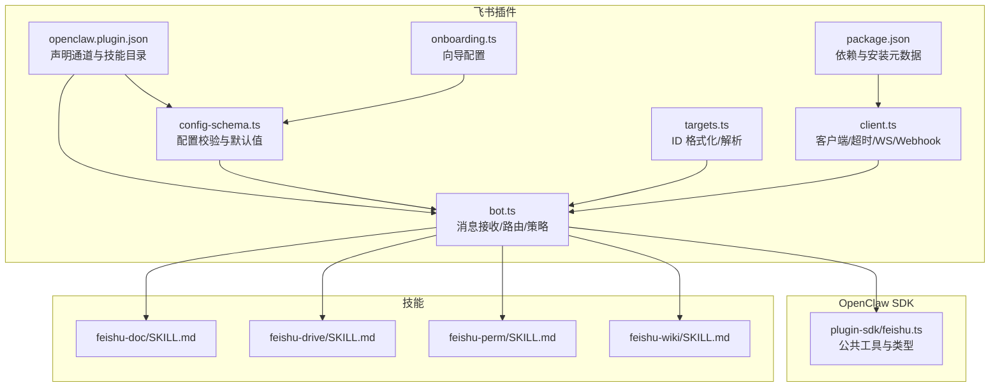
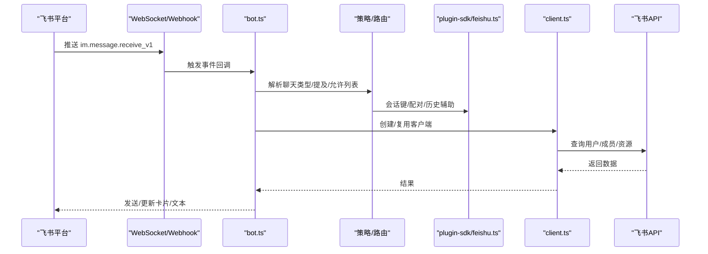
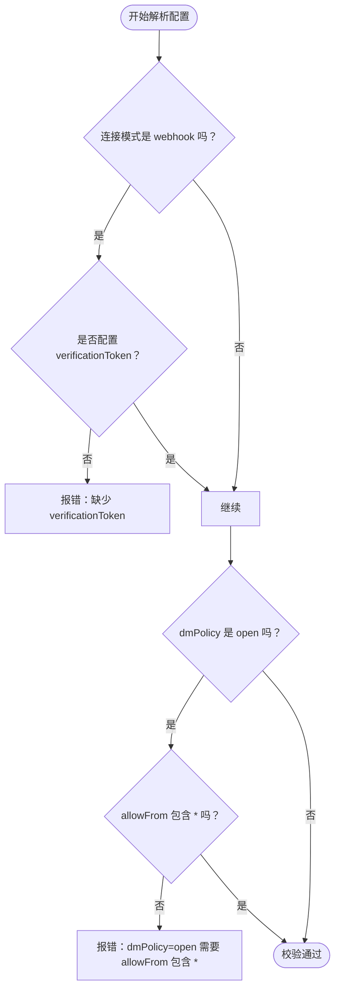
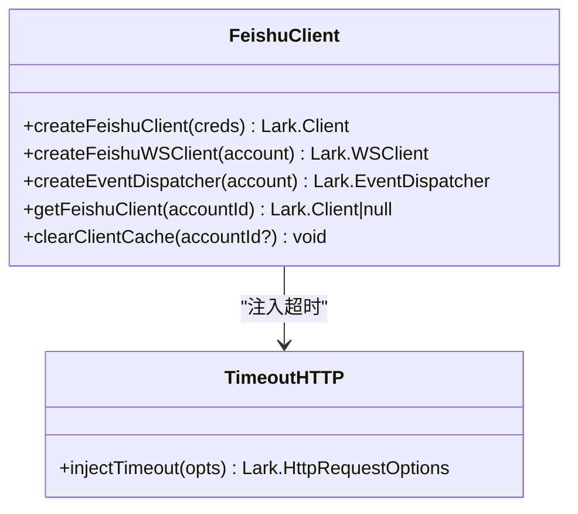
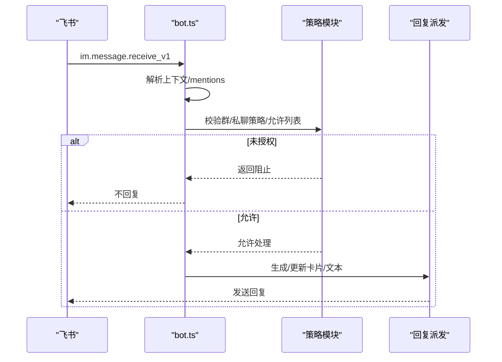
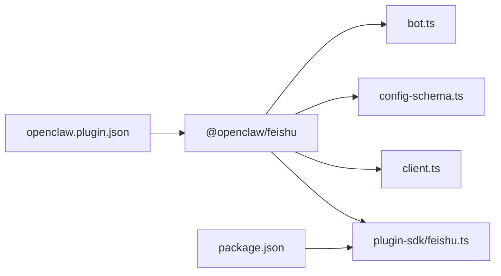

# 飞书企业版集成

<cite>
**本文引用的文件**
- [docs/channels/feishu.md](file://docs/channels/feishu.md)
- [extensions/feishu/package.json](file://extensions/feishu/package.json)
- [extensions/feishu/openclaw.plugin.json](file://extensions/feishu/openclaw.plugin.json)
- [extensions/feishu/src/config-schema.ts](file://extensions/feishu/src/config-schema.ts)
- [extensions/feishu/src/bot.ts](file://extensions/feishu/src/bot.ts)
- [extensions/feishu/src/targets.ts](file://extensions/feishu/src/targets.ts)
- [extensions/feishu/src/client.ts](file://extensions/feishu/src/client.ts)
- [extensions/feishu/src/onboarding.ts](file://extensions/feishu/src/onboarding.ts)
- [src/plugin-sdk/feishu.ts](file://src/plugin-sdk/feishu.ts)
- [extensions/feishu/skills/feishu-doc/SKILL.md](file://extensions/feishu/skills/feishu-doc/SKILL.md)
- [extensions/feishu/skills/feishu-drive/SKILL.md](file://extensions/feishu/skills/feishu-drive/SKILL.md)
- [extensions/feishu/skills/feishu-perm/SKILL.md](file://extensions/feishu/skills/feishu-perm/SKILL.md)
- [extensions/feishu/skills/feishu-wiki/SKILL.md](file://extensions/feishu/skills/feishu-wiki/SKILL.md)
</cite>

## 目录

1. [简介](#简介)
2. [项目结构](#项目结构)
3. [核心组件](#核心组件)
4. [架构总览](#架构总览)
5. [详细组件分析](#详细组件分析)
6. [依赖关系分析](#依赖关系分析)
7. [性能考量](#性能考量)
8. [故障排查指南](#故障排查指南)
9. [结论](#结论)
10. [附录](#附录)

## 简介

本指南面向在飞书（Lark）企业版中集成 OpenClaw 的工程团队，系统性说明飞书应用配置、认证与授权、消息路由机制、群聊管理、用户权限映射、消息类型处理、飞书开放平台配置、Webhook 设置与事件订阅、技能开发、API 调用限制与本地化支持等关键环节。文档基于仓库中的飞书插件实现与官方文档，确保可操作性与一致性。

## 项目结构

飞书通道以“插件”形式提供，核心位于 extensions/feishu，并通过 openclaw.plugin.json 声明通道能力与技能目录；配置校验由 config-schema.ts 提供；运行时行为由 bot.ts 实现；SDK 辅助函数位于 src/plugin-sdk/feishu.ts。

**图表来源**

- [extensions/feishu/openclaw.plugin.json:1-11](file://extensions/feishu/openclaw.plugin.json#L1-L11)
- [extensions/feishu/package.json:1-36](file://extensions/feishu/package.json#L1-L36)
- [extensions/feishu/src/config-schema.ts:1-286](file://extensions/feishu/src/config-schema.ts#L1-L286)
- [extensions/feishu/src/bot.ts:1-200](file://extensions/feishu/src/bot.ts#L1-L200)
- [extensions/feishu/src/targets.ts:52-107](file://extensions/feishu/src/targets.ts#L52-L107)
- [extensions/feishu/src/client.ts:1-197](file://extensions/feishu/src/client.ts#L1-L197)
- [extensions/feishu/src/onboarding.ts:368-391](file://extensions/feishu/src/onboarding.ts#L368-L391)
- [src/plugin-sdk/feishu.ts:1-83](file://src/plugin-sdk/feishu.ts#L1-L83)
- [extensions/feishu/skills/feishu-doc/SKILL.md](file://extensions/feishu/skills/feishu-doc/SKILL.md)
- [extensions/feishu/skills/feishu-drive/SKILL.md](file://extensions/feishu/skills/feishu-drive/SKILL.md)
- [extensions/feishu/skills/feishu-perm/SKILL.md](file://extensions/feishu/skills/feishu-perm/SKILL.md)
- [extensions/feishu/skills/feishu-wiki/SKILL.md](file://extensions/feishu/skills/feishu-wiki/SKILL.md)

**章节来源**

- [extensions/feishu/package.json:1-36](file://extensions/feishu/package.json#L1-L36)
- [extensions/feishu/openclaw.plugin.json:1-11](file://extensions/feishu/openclaw.plugin.json#L1-L11)
- [extensions/feishu/src/config-schema.ts:1-286](file://extensions/feishu/src/config-schema.ts#L1-L286)
- [extensions/feishu/src/bot.ts:1-200](file://extensions/feishu/src/bot.ts#L1-L200)
- [extensions/feishu/src/targets.ts:52-107](file://extensions/feishu/src/targets.ts#L52-L107)
- [extensions/feishu/src/client.ts:1-197](file://extensions/feishu/src/client.ts#L1-L197)
- [extensions/feishu/src/onboarding.ts:368-391](file://extensions/feishu/src/onboarding.ts#L368-L391)
- [src/plugin-sdk/feishu.ts:1-83](file://src/plugin-sdk/feishu.ts#L1-L83)

## 核心组件

- 配置与校验：提供飞书通道的配置项、默认值、策略校验（如 webhook 模式必须配置 verificationToken），以及多账户支持。
- 客户端与连接：封装 Lark SDK 客户端，支持 HTTP 超时注入、WebSocket 连接、Webhook 校验与解密。
- 消息路由与策略：解析消息上下文、识别群聊/私聊、@提及要求、分组策略、发送者白名单、动态代理配对等。
- 技能与工具：文档、知识库、云盘、权限管理等技能，按需启用。
- 向导与文档：提供快速上手、权限清单、事件订阅、Webhook 配置等步骤化指引。

**章节来源**

- [extensions/feishu/src/config-schema.ts:1-286](file://extensions/feishu/src/config-schema.ts#L1-L286)
- [extensions/feishu/src/client.ts:1-197](file://extensions/feishu/src/client.ts#L1-L197)
- [extensions/feishu/src/bot.ts:1-200](file://extensions/feishu/src/bot.ts#L1-L200)
- [docs/channels/feishu.md:1-652](file://docs/channels/feishu.md#L1-L652)

## 架构总览

飞书通道通过两种事件传输模式接入：

- WebSocket：长连接直连飞书事件流，无需公网暴露 Webhook。
- Webhook：监听指定路径的 HTTP 回调，需配置 verificationToken 并绑定本地地址。

消息从飞书进入后，经由 bot.ts 的策略与路由逻辑，结合 SDK 工具完成会话构建、历史记录、配对挑战、媒体下载、富文本解析与回复派发。

**图表来源**

- [extensions/feishu/src/bot.ts:931-1134](file://extensions/feishu/src/bot.ts#L931-L1134)
- [extensions/feishu/src/client.ts:111-147](file://extensions/feishu/src/client.ts#L111-L147)
- [src/plugin-sdk/feishu.ts:1-83](file://src/plugin-sdk/feishu.ts#L1-L83)

## 详细组件分析

### 配置与校验（config-schema）

- 支持的连接模式：websocket、webhook；默认 websocket。
- 默认策略：dmPolicy 默认 pairing；groupPolicy 默认 allowlist；requireMention 默认 true。
- 多账户：defaultAccount 必须指向 accounts 中存在的键；账户级 connectionMode/webhook 需要 verificationToken。
- 顶层与账户级字段继承与覆盖；部分敏感字段使用 SecretInput。
- 允许列表：dmPolicy=open 时，allowFrom 必须包含通配符“\*”。

**图表来源**

- [extensions/feishu/src/config-schema.ts:228-285](file://extensions/feishu/src/config-schema.ts#L228-L285)

**章节来源**

- [extensions/feishu/src/config-schema.ts:1-286](file://extensions/feishu/src/config-schema.ts#L1-L286)

### 客户端与连接（client）

- HTTP 超时：统一注入默认 30 秒超时，支持环境变量与配置项调整，最大不超过 300 秒。
- WebSocket：支持代理环境变量透传，按账户创建 WS 客户端。
- Webhook 校验：基于 verificationToken 与 encryptKey 初始化事件分发器。
- 客户端缓存：按账户缓存 Lark.Client，避免重复初始化。

**图表来源**

- [extensions/feishu/src/client.ts:111-197](file://extensions/feishu/src/client.ts#L111-L197)

**章节来源**

- [extensions/feishu/src/client.ts:1-197](file://extensions/feishu/src/client.ts#L1-L197)

### 消息接收与路由（bot）

- 事件入口：接收 im.message.receive_v1，解析 senderOpenId、chatId、chatType、messageType、content、mentions 等。
- 名称解析：可选解析发送者显示名，用于区分群聊说话人；失败时记录权限错误但不阻断消息处理。
- 策略执行：
  - 群聊：groupPolicy、groupAllowFrom、每群 allowFrom、requireMention。
  - 私聊：dmPolicy（pairing/allowlist/open/disabled）、allowFrom。
  - 动态配对：未知发送者触发配对挑战，批准后方可对话。
- 会话隔离：DM 使用主会话；群聊按 groupPolicy 与群 ID 隔离；支持按发送者或主题线程进一步细分。
- 回复派发：根据策略选择直接回复或主题线程回复；支持流式卡片输出与块级流式合并。

**图表来源**

- [extensions/feishu/src/bot.ts:931-1134](file://extensions/feishu/src/bot.ts#L931-L1134)

**章节来源**

- [extensions/feishu/src/bot.ts:1-200](file://extensions/feishu/src/bot.ts#L1-L200)
- [extensions/feishu/src/bot.ts:931-1134](file://extensions/feishu/src/bot.ts#L931-L1134)

### ID 格式化与目标解析（targets）

- 统一格式：chat:oc_xxx（群）、user:ou_xxx（私聊）、open_id:ou_xxx（显式 open_id）。
- 类型判定：自动识别 chat_id、open_id、user_id，支持前缀与缩写。
- 便捷函数：格式化、解析、判断是否飞书 ID。

**章节来源**

- [extensions/feishu/src/targets.ts:52-107](file://extensions/feishu/src/targets.ts#L52-L107)

### 向导与安装（onboarding）

- 在向导中提示 webhookPath，默认 /feishu/events；当选择 webhook 模式时强制要求 verificationToken。
- 支持多账户与默认账户配置。

**章节来源**

- [extensions/feishu/src/onboarding.ts:368-391](file://extensions/feishu/src/onboarding.ts#L368-L391)

### 技能开发与工具

- 文档（doc）：支持文档类操作（需 doc 权限）。
- 知识库（wiki）：基于 wiki 的知识管理（依赖 doc）。
- 云盘（drive）：文件存储与检索。
- 权限（perm）：权限管理（敏感功能，谨慎启用）。
- 技能清单与说明：各技能目录下提供 SKILL.md 作为开发与配置参考。

**章节来源**

- [extensions/feishu/skills/feishu-doc/SKILL.md](file://extensions/feishu/skills/feishu-doc/SKILL.md)
- [extensions/feishu/skills/feishu-drive/SKILL.md](file://extensions/feishu/skills/feishu-drive/SKILL.md)
- [extensions/feishu/skills/feishu-perm/SKILL.md](file://extensions/feishu/skills/feishu-perm/SKILL.md)
- [extensions/feishu/skills/feishu-wiki/SKILL.md](file://extensions/feishu/skills/feishu-wiki/SKILL.md)

## 依赖关系分析

- 插件声明：openclaw.plugin.json 声明通道 id 为 feishu，技能目录 ./skills，别名为 lark。
- 依赖：@larksuiteoapi/node-sdk、类型校验与代理工具。
- SDK 辅助：plugin-sdk/feishu.ts 暴露会话、配对、历史、速率限制、Webhook 守卫等通用能力。

**图表来源**

- [extensions/feishu/openclaw.plugin.json:1-11](file://extensions/feishu/openclaw.plugin.json#L1-L11)
- [extensions/feishu/package.json:1-36](file://extensions/feishu/package.json#L1-L36)
- [src/plugin-sdk/feishu.ts:1-83](file://src/plugin-sdk/feishu.ts#L1-L83)

**章节来源**

- [extensions/feishu/openclaw.plugin.json:1-11](file://extensions/feishu/openclaw.plugin.json#L1-L11)
- [extensions/feishu/package.json:1-36](file://extensions/feishu/package.json#L1-L36)
- [src/plugin-sdk/feishu.ts:1-83](file://src/plugin-sdk/feishu.ts#L1-L83)

## 性能考量

- API 调用优化：
  - resolveSenderNames 与 typingIndicator 可关闭以减少 API 调用。
  - 名称解析结果带 TTL 缓存，降低重复查询成本。
- 超时控制：HTTP 请求默认 30 秒，可通过环境变量或配置项调整，上限 300 秒。
- 流式输出：支持卡片增量渲染与块级流式合并，改善响应体验。
- 速率限制：内置回退检测与异常追踪，避免在限流时造成阻塞。

**章节来源**

- [extensions/feishu/src/config-schema.ts:221-224](file://extensions/feishu/src/config-schema.ts#L221-L224)
- [extensions/feishu/src/client.ts:76-105](file://extensions/feishu/src/client.ts#L76-L105)
- [extensions/feishu/src/bot.ts:931-953](file://extensions/feishu/src/bot.ts#L931-L953)

## 故障排查指南

- 无法接收消息：
  - 确认应用已发布并审批；事件订阅包含 im.message.receive_v1；启用长连接；权限完整；网关运行中。
- 群聊不回复：
  - 检查 groupPolicy 是否为 disabled；确认 requireMention 与 @提及；核对 groupAllowFrom 与 sender allowFrom。
- 私聊被阻止：
  - dmPolicy 为 pairing 时需先配对；open 模式需 allowFrom 包含“\*”。
- 发送失败：
  - 确认具备 im:message:send_as_bot 权限；应用已发布；查看日志定位具体错误。
- Webhook 模式：
  - 必须配置 verificationToken；确保 webhookPath 正确且网关可绑定到指定 host/port。

**章节来源**

- [docs/channels/feishu.md:450-480](file://docs/channels/feishu.md#L450-L480)

## 结论

通过飞书插件，OpenClaw 能够在企业内部安全地接入飞书/Lark，利用 WebSocket 或 Webhook 获取消息事件，结合灵活的策略与路由机制，实现群聊与私聊的精细化管控、动态配对与会话隔离、富文本与媒体内容处理，以及可扩展的技能体系。建议优先采用 WebSocket 以简化网络暴露面，并根据业务需要启用工具与流式输出，同时合理配置策略与配额优化参数。

## 附录

### 飞书开放平台配置要点

- 创建企业自建应用，复制 App ID 与 App Secret。
- 批量导入权限清单，包含消息读写、联系人、事件 IP 列表、卡片读写等。
- 开启 Bot 能力并设置机器人名称。
- 配置事件订阅：使用长连接（WebSocket），添加 im.message.receive_v1。
- 发布版本并等待审批。

**章节来源**

- [docs/channels/feishu.md:70-162](file://docs/channels/feishu.md#L70-L162)

### Webhook 设置与事件订阅

- 连接模式为 webhook 时，必须配置 verificationToken。
- 默认 webhook 路径为 /feishu/events，可按需修改。
- 绑定地址与端口可通过 webhookHost/webhookPort 调整。

**章节来源**

- [extensions/feishu/src/config-schema.ts:242-250](file://extensions/feishu/src/config-schema.ts#L242-L250)
- [extensions/feishu/src/onboarding.ts:374-380](file://extensions/feishu/src/onboarding.ts#L374-L380)
- [docs/channels/feishu.md:196-207](file://docs/channels/feishu.md#L196-L207)

### 用户权限映射与消息类型

- 用户 ID：open_id（ou_xxx）；群组 ID：chat_id（oc_xxx）。
- 支持的消息类型：文本、富文本（post）、图片、文件、音频、视频、贴图。
- 发送能力：文本、图片、文件、音频、部分富文本支持。

**章节来源**

- [extensions/feishu/src/targets.ts:66-90](file://extensions/feishu/src/targets.ts#L66-L90)
- [docs/channels/feishu.md:633-652](file://docs/channels/feishu.md#L633-L652)

### API 调用限制与本地化

- HTTP 超时默认 30 秒，最大 300 秒；可通过环境变量 OPENCLAW_FEISHU_HTTP_TIMEOUT_MS 调整。
- 本地化：插件别名为 lark，可在配置中按需设置 domain 为 lark 或自定义域名。

**章节来源**

- [extensions/feishu/src/client.ts:5-105](file://extensions/feishu/src/client.ts#L5-L105)
- [extensions/feishu/openclaw.plugin.json:23-26](file://extensions/feishu/openclaw.plugin.json#L23-L26)
