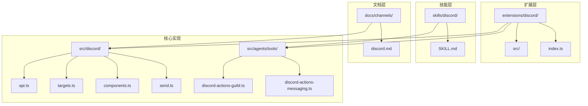
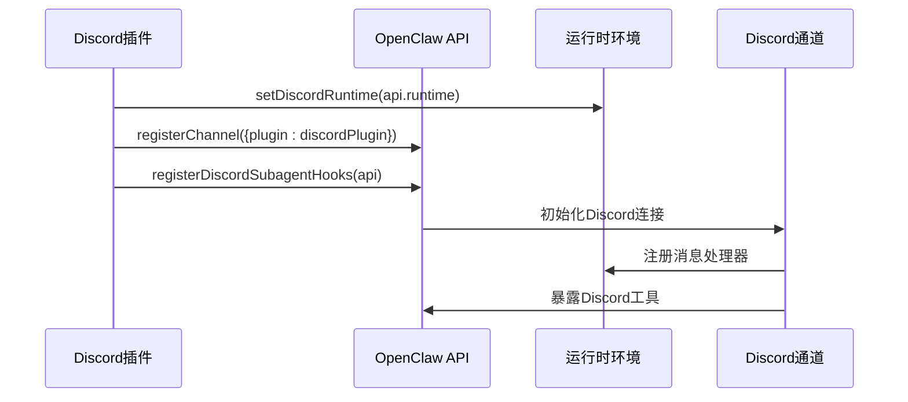
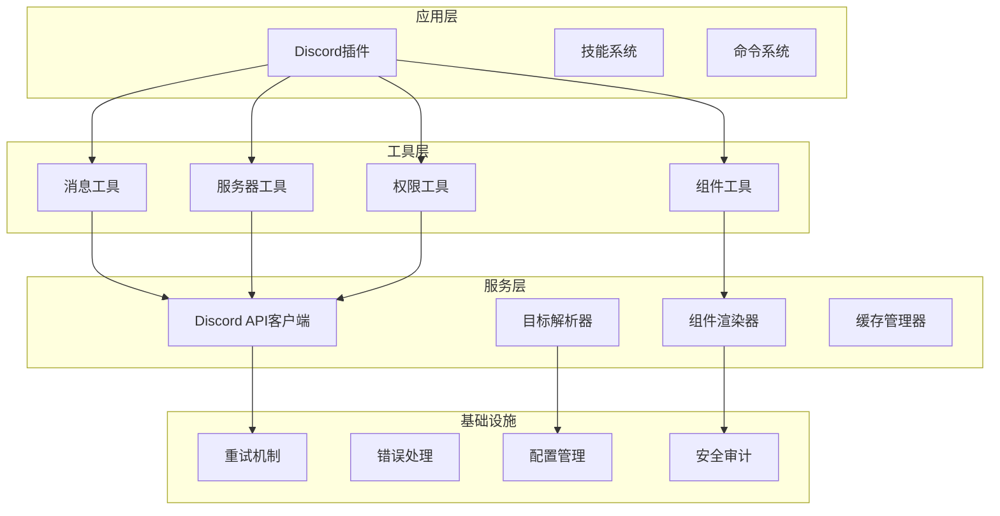
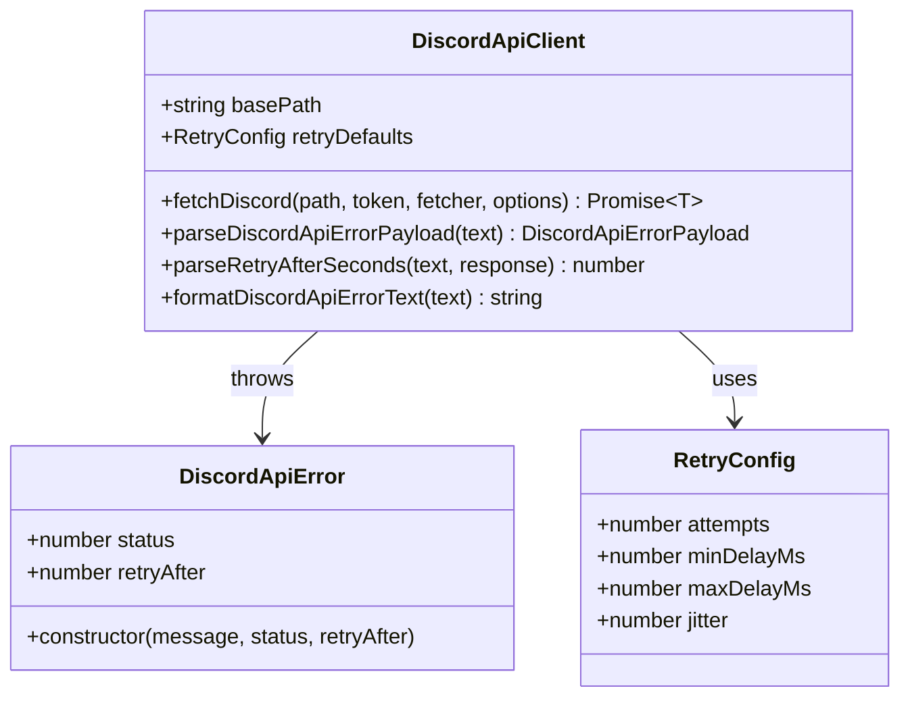
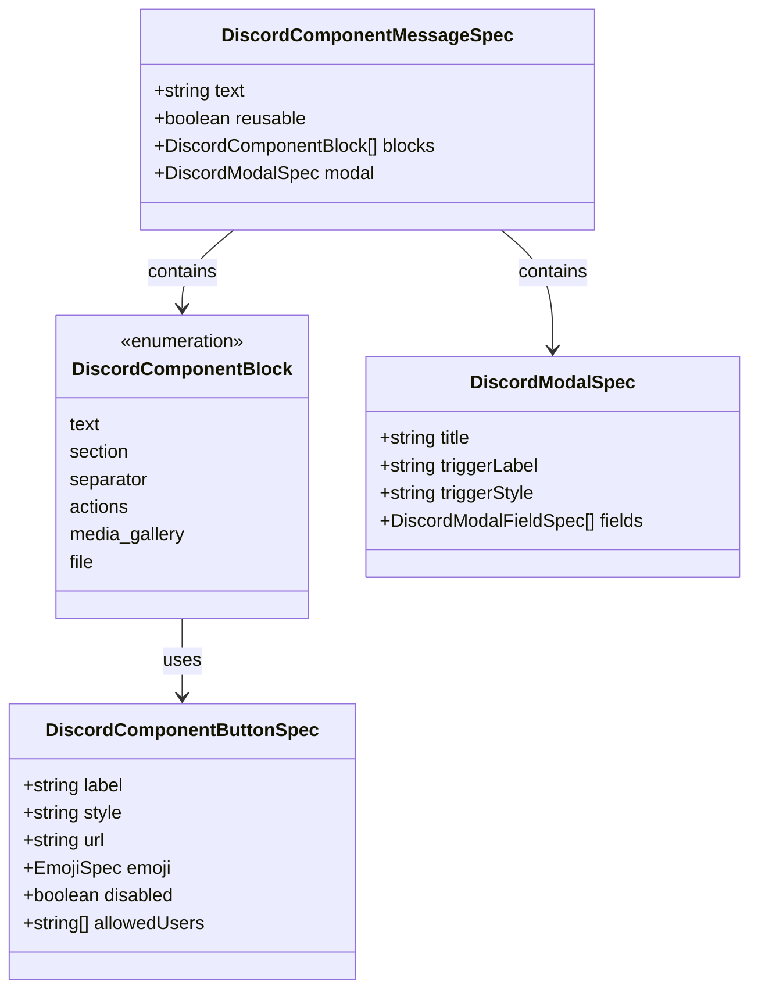
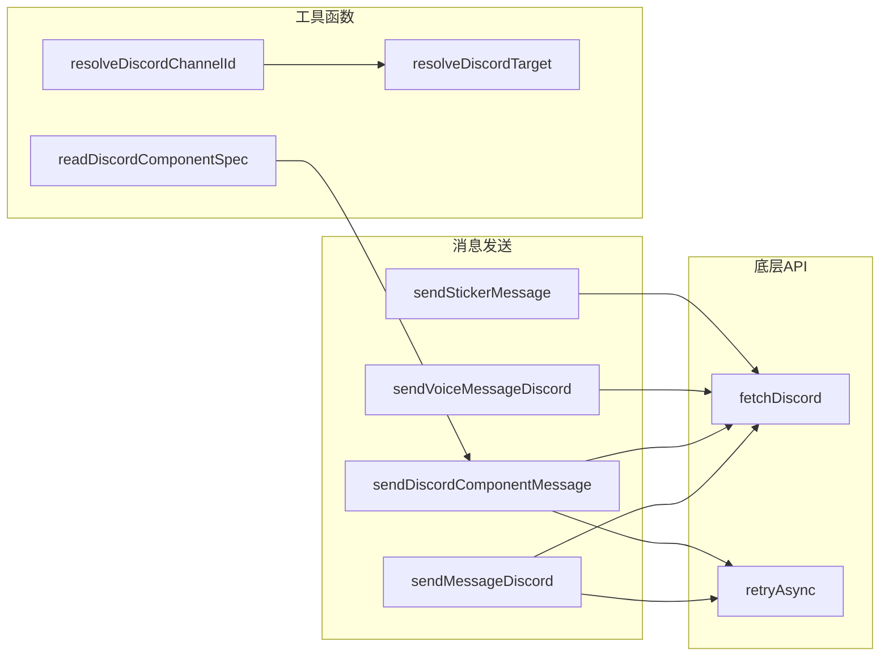
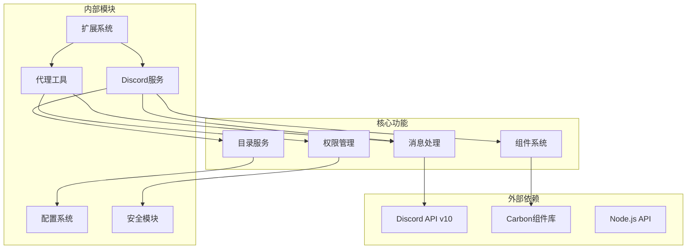

# Discord集成

<cite>
**本文档引用的文件**
- [extensions/discord/index.ts](file://extensions/discord/index.ts)
- [skills/discord/SKILL.md](file://skills/discord/SKILL.md)
- [docs/channels/discord.md](file://docs/channels/discord.md)
- [src/agents/tools/discord-actions-messaging.ts](file://src/agents/tools/discord-actions-messaging.ts)
- [src/agents/tools/discord-actions-guild.ts](file://src/agents/tools/discord-actions-guild.ts)
- [src/discord/send.ts](file://src/discord/send.ts)
- [src/discord/components.ts](file://src/discord/components.ts)
- [src/discord/targets.ts](file://src/discord/targets.ts)
- [src/discord/api.ts](file://src/discord/api.ts)
</cite>

## 目录

1. [简介](#简介)
2. [项目结构](#项目结构)
3. [核心组件](#核心组件)
4. [架构概览](#架构概览)
5. [详细组件分析](#详细组件分析)
6. [依赖关系分析](#依赖关系分析)
7. [性能考虑](#性能考虑)
8. [故障排除指南](#故障排除指南)
9. [结论](#结论)

## 简介

本文件为OpenClaw项目中的Discord平台集成提供完整的技术文档。OpenClaw是一个多通道AI代理平台，支持通过Discord机器人进行消息通信、频道管理、权限控制和交互式组件等功能。

该集成涵盖了从机器人创建、OAuth认证配置到频道权限设置和消息路由规则的完整流程。文档详细说明了Discord API的使用方法、Webhook配置、消息处理流程和错误处理机制，并包含了Discord特有的功能如嵌入消息、附件上传、角色权限管理和服务器配置。

## 项目结构

OpenClaw的Discord集成为模块化设计，主要分布在以下目录结构中：



**图表来源**

- [extensions/discord/index.ts:1-20](file://extensions/discord/index.ts#L1-L20)
- [skills/discord/SKILL.md:1-198](file://skills/discord/SKILL.md#L1-L198)
- [docs/channels/discord.md:1-800](file://docs/channels/discord.md#L1-L800)

**章节来源**

- [extensions/discord/index.ts:1-20](file://extensions/discord/index.ts#L1-L20)
- [docs/channels/discord.md:24-167](file://docs/channels/discord.md#L24-L167)

## 核心组件

### 插件注册与初始化

OpenClaw的Discord插件通过标准插件接口进行注册，实现了自动化的运行时配置和通道注册。



**图表来源**

- [extensions/discord/index.ts:7-17](file://extensions/discord/index.ts#L7-L17)

### 消息处理工具

系统提供了完整的Discord消息处理工具集，支持发送、编辑、删除、反应等操作：

- **消息发送**: 支持文本、媒体、组件消息
- **消息管理**: 编辑、删除、搜索、历史读取
- **线程管理**: 创建、列表、回复
- **权限管理**: 获取权限、检查权限
- **反应管理**: 添加、移除、查询反应

**章节来源**

- [src/agents/tools/discord-actions-messaging.ts:59-530](file://src/agents/tools/discord-actions-messaging.ts#L59-L530)

### 服务器管理工具

提供Discord服务器级别的管理功能：

- **成员信息**: 获取用户详细信息和状态
- **角色管理**: 添加、移除服务器角色
- **频道管理**: 创建、编辑、删除频道
- **表情包管理**: 上传自定义表情包和贴纸
- **事件管理**: 列表和创建计划活动

**章节来源**

- [src/agents/tools/discord-actions-guild.ts:63-507](file://src/agents/tools/discord-actions-guild.ts#L63-L507)

## 架构概览

OpenClaw的Discord集成采用分层架构设计，确保了功能的模块化和可扩展性：



**图表来源**

- [src/discord/api.ts:1-137](file://src/discord/api.ts#L1-L137)
- [src/discord/targets.ts:1-158](file://src/discord/targets.ts#L1-L158)
- [src/discord/components.ts:1-800](file://src/discord/components.ts#L1-L800)

## 详细组件分析

### Discord API客户端

Discord API客户端实现了robust的错误处理和重试机制：



**图表来源**

- [src/discord/api.ts:80-137](file://src/discord/api.ts#L80-L137)

#### 错误处理机制

API客户端实现了智能的错误分类和处理：

- **HTTP状态码处理**: 429限流、401认证失败、403权限不足等
- **重试策略**: 指数退避、抖动、最大重试次数
- **速率限制**: 自动解析Retry-After头和JSON负载
- **错误格式化**: 统一的错误消息格式化

**章节来源**

- [src/discord/api.ts:96-137](file://src/discord/api.ts#L96-L137)

### 目标解析系统

目标解析系统支持多种Discord目标格式：

```mermaid
flowchart TD
Start([开始解析]) --> CheckEmpty{输入是否为空}
CheckEmpty --> |是| ReturnUndefined[返回undefined]
CheckEmpty --> |否| CheckUserTarget{检查用户目标}
CheckUserTarget --> UserMatch{匹配@提及或user:前缀}
UserMatch --> |是| ReturnUserTarget[返回用户目标]
UserMatch --> |否| CheckNumeric{检查纯数字}
CheckNumeric --> IsNumeric{是否为纯数字}
IsNumeric --> |是| CheckDefaultKind{是否有默认类型}
CheckDefaultKind --> |有| BuildTarget[构建目标对象]
CheckDefaultKind --> |无| ThrowError[抛出歧义错误]
IsNumeric --> |否| BuildChannelTarget[构建频道目标]
BuildTarget --> End([结束])
BuildChannelTarget --> End
ThrowError --> End
ReturnUserTarget --> End
ReturnUndefined --> End
```

**图表来源**

- [src/discord/targets.ts:19-51](file://src/discord/targets.ts#L19-L51)

#### 目标类型支持

系统支持以下Discord目标格式：

- **用户目标**: `user:123456789012345678` 或 `<@123456789012345678>`
- **频道目标**: `channel:123456789012345678`
- **简写形式**: `123456789012345678`（需要默认类型）
- **用户名解析**: 通过目录查找解析用户名到用户ID

**章节来源**

- [src/discord/targets.ts:67-158](file://src/discord/targets.ts#L67-L158)

### 组件系统

OpenClaw的Discord组件系统提供了丰富的交互式UI组件：



**图表来源**

- [src/discord/components.ts:144-153](file://src/discord/components.ts#L144-L153)

#### 支持的组件类型

系统支持以下组件类型：

- **基础组件**: 文本、分隔符、媒体画廊
- **交互组件**: 按钮、选择菜单、模态框
- **高级组件**: 文件上传、用户/角色选择
- **容器组件**: 容器、行、部分

**章节来源**

- [src/discord/components.ts:91-121](file://src/discord/components.ts#L91-L121)

### 发送模块

发送模块提供了统一的消息发送接口：



**图表来源**

- [src/discord/send.ts:1-82](file://src/discord/send.ts#L1-L82)

**章节来源**

- [src/discord/send.ts:28-47](file://src/discord/send.ts#L28-L47)

## 依赖关系分析

OpenClaw的Discord集成具有清晰的依赖层次结构：



**图表来源**

- [extensions/discord/index.ts:1-6](file://extensions/discord/index.ts#L1-L6)
- [src/agents/tools/discord-actions-messaging.ts:1-41](file://src/agents/tools/discord-actions-messaging.ts#L1-L41)

### 关键依赖关系

1. **扩展系统依赖**: 所有Discord功能都通过扩展系统注册
2. **代理工具依赖**: 提供标准化的消息处理接口
3. **Discord服务依赖**: 封装底层API调用和错误处理
4. **组件系统依赖**: 提供富文本和交互式UI支持

**章节来源**

- [src/discord/api.ts:1-137](file://src/discord/api.ts#L1-L137)
- [src/discord/components.ts:1-800](file://src/discord/components.ts#L1-L800)

## 性能考虑

### 重试机制优化

Discord API客户端实现了智能的重试策略：

- **指数退避**: 基础延迟500ms，最大30秒
- **抖动**: 10%抖动避免同步重试
- **条件重试**: 仅对429状态码进行重试
- **自动退避**: 解析Retry-After头进行精确等待

### 缓存策略

系统实现了多层次的缓存机制：

- **目录缓存**: 用户名到ID的映射缓存
- **权限缓存**: 频道权限查询结果缓存
- **组件缓存**: 交互式组件状态缓存

### 并发控制

- **请求限流**: 自动处理Discord的速率限制
- **批量操作**: 支持批量消息发送和权限更新
- **异步处理**: 非阻塞的消息处理和响应

## 故障排除指南

### 常见问题诊断

#### 机器人无法启动

**症状**: 启动时出现认证错误

**可能原因**:

- Bot Token无效或过期
- 权限不足
- 网络连接问题

**解决方案**:

1. 验证Bot Token格式正确
2. 检查OAuth2权限配置
3. 确认网络访问权限

#### 消息发送失败

**症状**: 消息发送返回错误

**可能原因**:

- 权限不足
- 速率限制触发
- 目标ID无效

**解决方案**:

1. 检查频道权限设置
2. 实现重试逻辑
3. 验证目标ID格式

#### 组件交互异常

**症状**: 交互式组件无法正常工作

**可能原因**:

- Custom ID格式错误
- 组件规格不匹配
- 用户权限不足

**解决方案**:

1. 验证Custom ID生成逻辑
2. 检查组件规格验证
3. 实施用户权限检查

### 调试工具

系统提供了完善的调试和监控功能：

- **API调用日志**: 记录所有Discord API调用
- **错误追踪**: 详细的错误堆栈信息
- **性能指标**: 请求延迟和成功率统计
- **配置审计**: 实时配置变更记录

**章节来源**

- [src/discord/api.ts:19-78](file://src/discord/api.ts#L19-L78)
- [src/discord/targets.ts:119-158](file://src/discord/targets.ts#L119-L158)

## 结论

OpenClaw的Discord集成为AI代理平台提供了完整、可靠且功能丰富的Discord集成方案。通过模块化的设计、强大的错误处理机制和丰富的功能特性，该集成能够满足各种Discord应用场景的需求。

### 主要优势

1. **完整的功能覆盖**: 从基础消息发送到高级权限管理
2. **健壮的错误处理**: 智能的重试机制和错误恢复
3. **灵活的配置选项**: 支持多种部署模式和配置方式
4. **优秀的用户体验**: 交互式组件和富文本支持
5. **安全的权限控制**: 细粒度的权限管理和审计功能

### 未来发展方向

- **性能优化**: 进一步提升并发处理能力和响应速度
- **功能扩展**: 支持更多Discord高级功能
- **监控增强**: 提供更详细的性能监控和分析工具
- **文档完善**: 持续改进技术文档和示例代码

该集成文档为开发者提供了全面的技术参考，有助于快速理解和使用OpenClaw的Discord功能。
