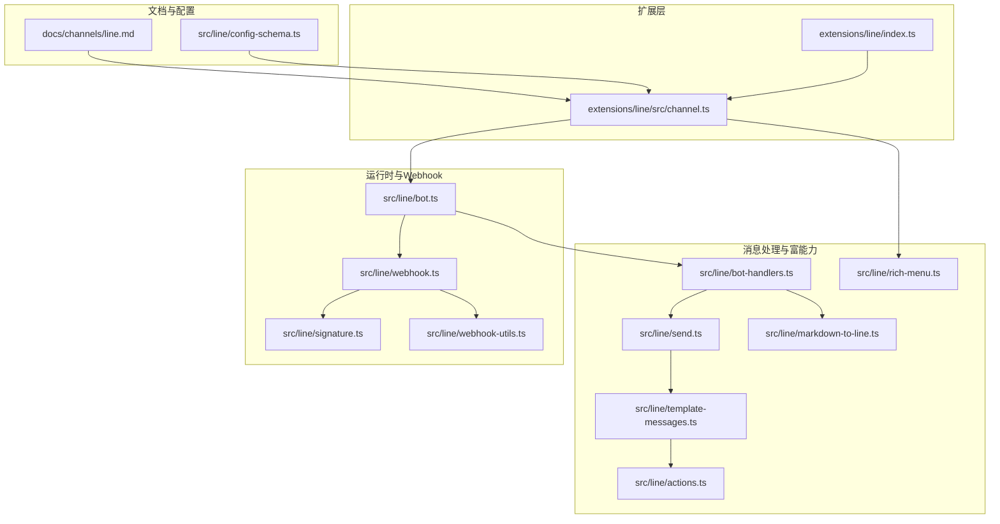
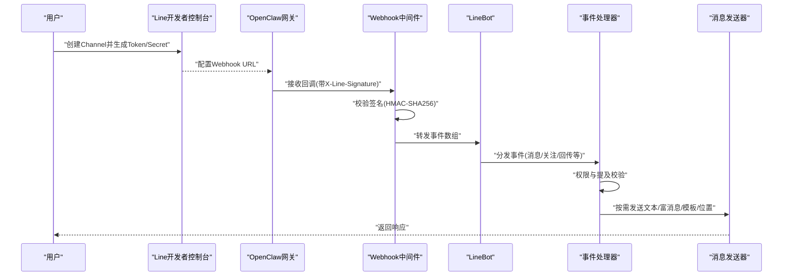
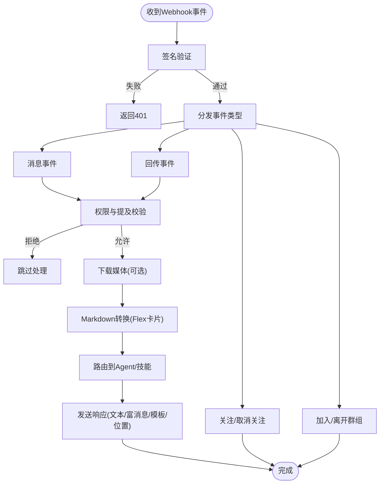
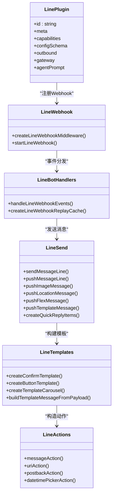

# Line集成

<cite>
**本文引用的文件**
- [docs/channels/line.md](file://docs/channels/line.md)
- [extensions/line/index.ts](file://extensions/line/index.ts)
- [extensions/line/src/channel.ts](file://extensions/line/src/channel.ts)
- [src/line/webhook.ts](file://src/line/webhook.ts)
- [src/line/bot.ts](file://src/line/bot.ts)
- [src/line/template-messages.ts](file://src/line/template-messages.ts)
- [src/line/rich-menu.ts](file://src/line/rich-menu.ts)
- [src/line/markdown-to-line.ts](file://src/line/markdown-to-line.ts)
- [src/line/send.ts](file://src/line/send.ts)
- [src/line/config-schema.ts](file://src/line/config-schema.ts)
- [src/line/actions.ts](file://src/line/actions.ts)
- [src/line/bot-handlers.ts](file://src/line/bot-handlers.ts)
- [src/line/signature.ts](file://src/line/signature.ts)
- [src/line/webhook-utils.ts](file://src/line/webhook-utils.ts)
</cite>

## 目录

1. [简介](#简介)
2. [项目结构](#项目结构)
3. [核心组件](#核心组件)
4. [架构总览](#架构总览)
5. [详细组件分析](#详细组件分析)
6. [依赖关系分析](#依赖关系分析)
7. [性能考量](#性能考量)
8. [故障排查指南](#故障排查指南)
9. [结论](#结论)
10. [附录](#附录)

## 简介

本文件面向在OpenClaw中集成Line（LINE Messaging API）的工程师与运维人员，系统性说明从Line Developer Console配置、Channel Access Token与Channel Secret设置、Webhook部署与签名验证，到消息处理流程、OAuth与权限控制、以及Line特有能力（Quick Reply、Carousel Template、Location消息、富菜单与友邻管理）的完整实践路径。同时提供日语环境下的配置要点与最佳实践。

## 项目结构

OpenClaw通过“插件 + 运行时”的方式集成Line通道。核心由以下部分组成：

- 文档层：官方文档描述了安装、配置、最小化示例、多账号、访问控制策略与常见问题。
- 扩展层：Line插件注册入口，负责将Line通道接入OpenClaw运行时。
- 核心实现层：Webhook中间件、事件处理器、消息发送器、富消息模板与工具集等。

图表来源

- [docs/channels/line.md:1-194](file://docs/channels/line.md#L1-L194)
- [extensions/line/index.ts:1-20](file://extensions/line/index.ts#L1-L20)
- [extensions/line/src/channel.ts:1-746](file://extensions/line/src/channel.ts#L1-L746)
- [src/line/webhook.ts:1-117](file://src/line/webhook.ts#L1-L117)
- [src/line/bot.ts:1-84](file://src/line/bot.ts#L1-L84)
- [src/line/bot-handlers.ts:1-715](file://src/line/bot-handlers.ts#L1-L715)
- [src/line/send.ts:1-475](file://src/line/send.ts#L1-L475)
- [src/line/markdown-to-line.ts:1-452](file://src/line/markdown-to-line.ts#L1-L452)
- [src/line/template-messages.ts:1-356](file://src/line/template-messages.ts#L1-L356)
- [src/line/actions.ts:1-62](file://src/line/actions.ts#L1-L62)
- [src/line/rich-menu.ts:1-394](file://src/line/rich-menu.ts#L1-L394)
- [src/line/signature.ts:1-19](file://src/line/signature.ts#L1-L19)
- [src/line/webhook-utils.ts:1-16](file://src/line/webhook-utils.ts#L1-L16)

章节来源

- [docs/channels/line.md:10-194](file://docs/channels/line.md#L10-L194)
- [extensions/line/index.ts:1-20](file://extensions/line/index.ts#L1-L20)
- [extensions/line/src/channel.ts:1-746](file://extensions/line/src/channel.ts#L1-L746)

## 核心组件

- 插件注册与通道元数据：定义Line通道的元信息、能力、配置模式、安全策略与消息发送接口。
- Webhook中间件与签名验证：接收来自Line的回调，进行签名校验与负载解析。
- 事件处理器：根据事件类型分发处理逻辑，含消息、关注/取消关注、加入/离开群组、回传事件等。
- 富消息与模板：支持Quick Reply、Confirm/Buttons/Carousel/图片轮播模板、Location消息、Flex卡片等。
- 媒体下载与Markdown转换：自动识别并下载媒体，将Markdown表格/代码块转为Flex卡片。
- 友邻管理与富菜单：支持默认富菜单、用户级富菜单绑定、别名与批量操作。

章节来源

- [extensions/line/src/channel.ts:101-746](file://extensions/line/src/channel.ts#L101-L746)
- [src/line/webhook.ts:34-117](file://src/line/webhook.ts#L34-L117)
- [src/line/bot-handlers.ts:484-715](file://src/line/bot-handlers.ts#L484-L715)
- [src/line/template-messages.ts:12-356](file://src/line/template-messages.ts#L12-L356)
- [src/line/markdown-to-line.ts:9-452](file://src/line/markdown-to-line.ts#L9-L452)
- [src/line/send.ts:98-475](file://src/line/send.ts#L98-L475)
- [src/line/rich-menu.ts:82-394](file://src/line/rich-menu.ts#L82-L394)

## 架构总览

下图展示了从Line开发者控制台到OpenClaw网关、再到消息处理与富消息发送的端到端流程。

图表来源

- [src/line/webhook.ts:34-117](file://src/line/webhook.ts#L34-L117)
- [src/line/bot.ts:29-84](file://src/line/bot.ts#L29-L84)
- [src/line/bot-handlers.ts:652-715](file://src/line/bot-handlers.ts#L652-L715)
- [src/line/send.ts:151-475](file://src/line/send.ts#L151-L475)

## 详细组件分析

### 配置与安装

- 安装插件：通过CLI安装或本地开发安装。
- 最小化配置：启用通道、设置Channel Access Token与Channel Secret；可选dmPolicy。
- 多账号：支持多账户配置，每账户可独立设置webhookPath。
- 环境变量与文件：支持环境变量或tokenFile/secretFile两种注入方式。
- 访问控制：dmPolicy/groupPolicy/allowFrom/groupAllowFrom/分组覆盖策略。

章节来源

- [docs/channels/line.md:20-134](file://docs/channels/line.md#L20-L134)
- [src/line/config-schema.ts:1-43](file://src/line/config-schema.ts#L1-L43)
- [extensions/line/src/channel.ts:134-161](file://extensions/line/src/channel.ts#L134-L161)

### Line Developer Console与Webhook设置

- 在Line开发者控制台创建Provider与Messaging API Channel，复制Channel Access Token与Channel Secret。
- 启用Webhook并设置URL为网关的/webhook路径（可自定义）。
- 网关会处理验证请求（空事件数组且无签名），并通过签名验证后处理入站事件。

章节来源

- [docs/channels/line.md:34-54](file://docs/channels/line.md#L34-L54)
- [src/line/webhook.ts:48-87](file://src/line/webhook.ts#L48-L87)
- [src/line/webhook-utils.ts:11-16](file://src/line/webhook-utils.ts#L11-L16)

### 签名验证与安全

- 使用Channel Secret对原始请求体进行HMAC-SHA256计算，与X-Line-Signature比较。
- 采用常量时间比较以防止时序攻击。
- 对于验证请求（空事件数组），直接返回成功。

章节来源

- [src/line/signature.ts:3-19](file://src/line/signature.ts#L3-L19)
- [src/line/webhook.ts:63-67](file://src/line/webhook.ts#L63-L67)

### 消息处理流程

- 事件分发：消息、关注、取消关注、加入、离开、回传事件分别处理。
- 权限与提及：DM与群组分别依据dmPolicy/groupPolicy与requireMention策略判定是否放行。
- 媒体下载：对image/video/audio/file类型消息进行下载，受mediaMaxMb限制。
- Markdown转换：表格与代码块自动转为Flex卡片；链接保留文本形式或可转为按钮（当前策略为保留文本）。
- 历史记录：群组未提及消息可暂存为待处理历史，避免重复处理。

图表来源

- [src/line/webhook.ts:34-117](file://src/line/webhook.ts#L34-L117)
- [src/line/bot-handlers.ts:484-715](file://src/line/bot-handlers.ts#L484-L715)
- [src/line/markdown-to-line.ts:384-452](file://src/line/markdown-to-line.ts#L384-L452)

### Line特有能力详解

#### Quick Reply

- 支持在文本消息末尾附加最多13个按钮，按钮标签最大长度受限。
- 当存在Quick Reply且无文本分片时，可将富消息、位置、媒体与Quick Reply组合为一次批量发送。

章节来源

- [src/line/send.ts:379-403](file://src/line/send.ts#L379-L403)
- [extensions/line/src/channel.ts:314-471](file://extensions/line/src/channel.ts#L314-L471)

#### Carousel Template（图文轮播）

- 支持Confirm、Buttons、Carousel、Image Carousel四种模板。
- Carousel列数上限为10，每列动作数上限为3；Buttons动作数上限为4。
- 提供便捷构建器：createYesNoConfirm、createButtonMenu、createLinkMenu、createProductCarousel。

章节来源

- [src/line/template-messages.ts:12-356](file://src/line/template-messages.ts#L12-L356)
- [src/line/actions.ts:8-62](file://src/line/actions.ts#L8-L62)

#### Location消息

- 发送位置消息时，标题与地址长度受限，经纬度数值有效。
- 可与Quick Reply组合发送。

章节来源

- [src/line/send.ts:311-324](file://src/line/send.ts#L311-L324)
- [extensions/line/src/channel.ts:373-379](file://extensions/line/src/channel.ts#L373-L379)

#### Flex卡片

- 将Markdown表格/代码块自动转换为Flex Bubble卡片。
- 支持自定义altText与contents，发送时截断至LINE限制。

章节来源

- [src/line/markdown-to-line.ts:96-269](file://src/line/markdown-to-line.ts#L96-L269)
- [src/line/send.ts:329-345](file://src/line/send.ts#L329-L345)

#### 友邻管理与富菜单

- 支持创建富菜单、上传图片、设为默认、取消默认、查询默认、用户绑定/解绑、批量绑定/解绑、别名管理。
- 提供标准网格布局与默认菜单配置辅助函数。

章节来源

- [src/line/rich-menu.ts:82-394](file://src/line/rich-menu.ts#L82-L394)

### OAuth与权限控制

- OAuth：通过Channel Access Token与Channel Secret进行API调用鉴权。
- 权限模型：DM支持open/allowlist/pairing/disabled；群组支持allowlist/open/disabled。
- 允许列表：支持全局与分组覆盖，支持提及要求（requireMention）。
- Pairing：当dmPolicy为pairing时，未知发送者会被挑战配对，批准后方可继续。

章节来源

- [docs/channels/line.md:110-134](file://docs/channels/line.md#L110-L134)
- [extensions/line/src/channel.ts:147-161](file://extensions/line/src/channel.ts#L147-L161)
- [src/line/bot-handlers.ts:286-419](file://src/line/bot-handlers.ts#L286-L419)

### 日语环境下的特殊配置

- ID格式：用户ID为U开头32位十六进制；群组ID为C开头；房间ID为R开头。大小写敏感。
- 分组覆盖：支持按群组/房间ID或通配符(\*)进行分组策略覆盖。
- 语言与字符：富消息与模板均受LINE字符长度限制，发送前已做截断处理。

章节来源

- [docs/channels/line.md:129-134](file://docs/channels/line.md#L129-L134)
- [extensions/line/src/channel.ts:162-175](file://extensions/line/src/channel.ts#L162-L175)

## 依赖关系分析

图表来源

- [extensions/line/src/channel.ts:101-746](file://extensions/line/src/channel.ts#L101-L746)
- [src/line/webhook.ts:34-117](file://src/line/webhook.ts#L34-L117)
- [src/line/bot-handlers.ts:652-715](file://src/line/bot-handlers.ts#L652-L715)
- [src/line/send.ts:151-475](file://src/line/send.ts#L151-L475)
- [src/line/template-messages.ts:289-356](file://src/line/template-messages.ts#L289-L356)
- [src/line/actions.ts:8-62](file://src/line/actions.ts#L8-L62)

章节来源

- [extensions/line/src/channel.ts:101-746](file://extensions/line/src/channel.ts#L101-L746)
- [src/line/webhook.ts:34-117](file://src/line/webhook.ts#L34-L117)
- [src/line/bot-handlers.ts:652-715](file://src/line/bot-handlers.ts#L652-L715)
- [src/line/send.ts:151-475](file://src/line/send.ts#L151-L475)
- [src/line/template-messages.ts:289-356](file://src/line/template-messages.ts#L289-L356)
- [src/line/actions.ts:8-62](file://src/line/actions.ts#L8-L62)

## 性能考量

- 媒体下载限制：默认最大10MB，可通过配置调整；超限时忽略该媒体并继续处理。
- 文本分片：LINE单条文本上限5000字符，超过将被分片发送。
- 批量发送：富消息、模板、位置与图片可批量发送，但每次最多5条消息。
- 重放防护：Webhook事件缓存窗口与去重机制，避免重复处理与内存膨胀。
- 加载动画：支持显示加载动画，提升交互体验。

章节来源

- [docs/channels/line.md:142-143](file://docs/channels/line.md#L142-L143)
- [extensions/line/src/channel.ts:298-301](file://extensions/line/src/channel.ts#L298-L301)
- [src/line/bot-handlers.ts:83-120](file://src/line/bot-handlers.ts#L83-L120)
- [src/line/send.ts:408-424](file://src/line/send.ts#L408-L424)

## 故障排查指南

- Webhook验证失败：确认URL为HTTPS、Channel Secret正确、签名头存在且匹配。
- 无入站事件：检查webhookPath与网关可达性。
- 媒体下载错误：提高mediaMaxMb或检查媒体URL有效性。
- 权限被拒：检查dmPolicy/groupPolicy/allowFrom与分组覆盖配置。
- Pairing：未知发送者会被挑战配对，需在CLI中批准。

章节来源

- [docs/channels/line.md:186-194](file://docs/channels/line.md#L186-L194)
- [src/line/webhook.ts:48-87](file://src/line/webhook.ts#L48-L87)
- [src/line/bot-handlers.ts:286-419](file://src/line/bot-handlers.ts#L286-L419)

## 结论

通过上述组件与流程，OpenClaw实现了对Line Messaging API的完整集成：从Console配置、Webhook签名验证、到消息处理、富消息模板与富菜单管理，均可在生产环境中稳定运行。配合灵活的权限策略与Pairing机制，可在日语市场（以及全球）安全地提供高质量的Bot服务。

## 附录

- 插件注册入口：负责将Line通道注册到OpenClaw运行时，并提供命令与运行时能力。
- 配置模式：Zod Schema定义了所有可配置项，确保配置一致性与可诊断性。

章节来源

- [extensions/line/index.ts:7-20](file://extensions/line/index.ts#L7-L20)
- [src/line/config-schema.ts:1-43](file://src/line/config-schema.ts#L1-L43)
