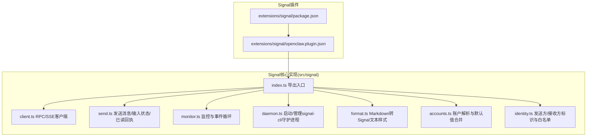
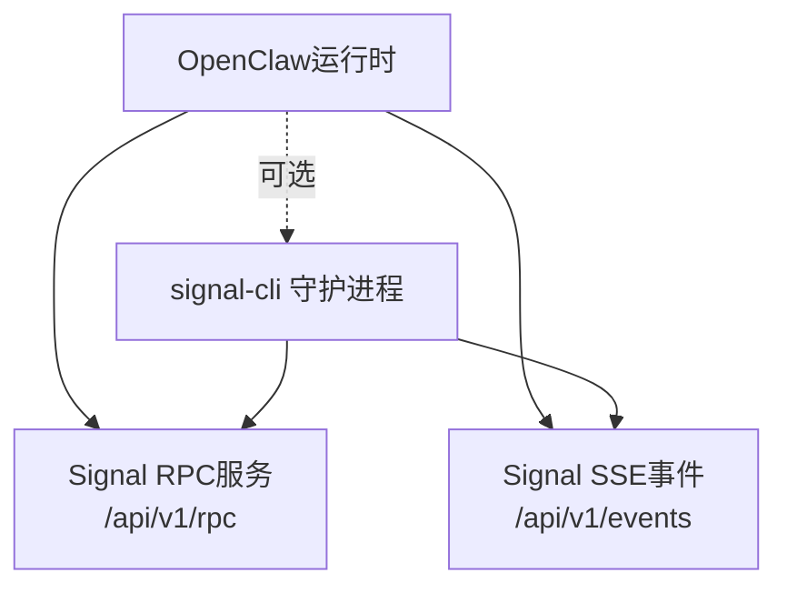
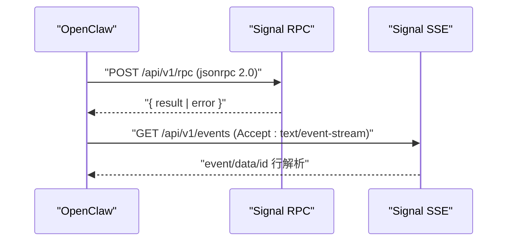
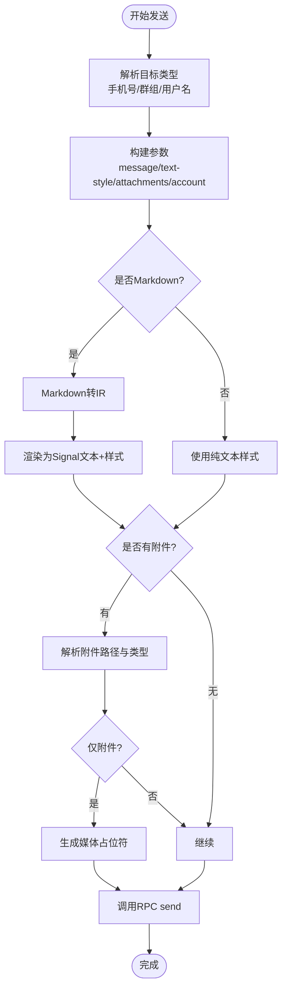
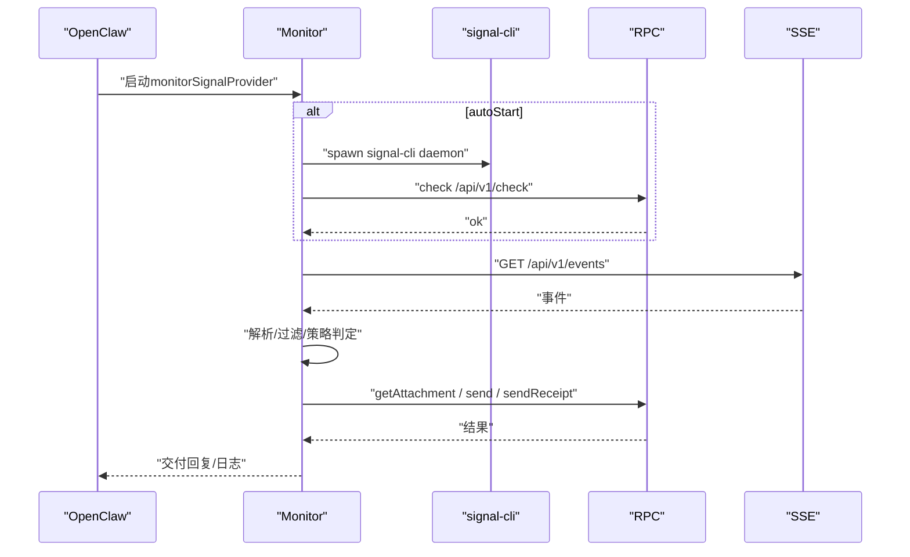
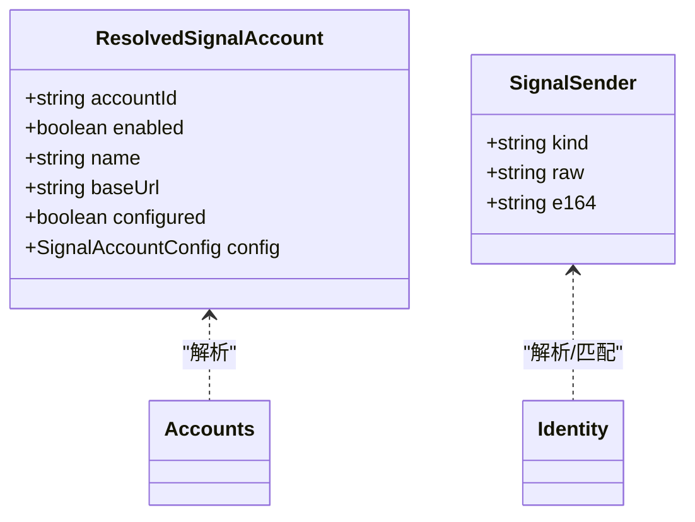
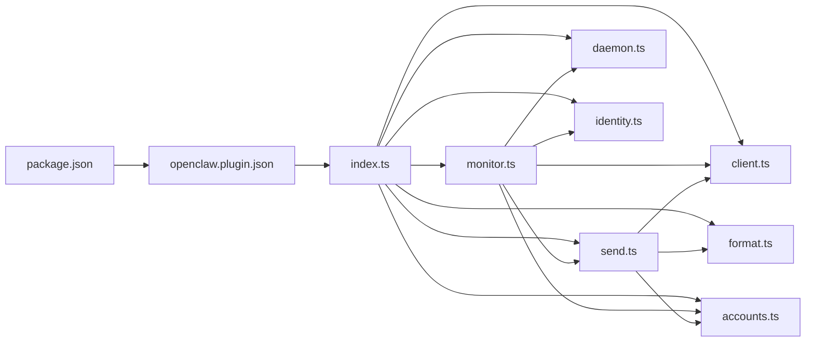

# Signal集成

<cite>
**本文引用的文件**
- [src/signal/index.ts](file://src/signal/index.ts)
- [src/signal/client.ts](file://src/signal/client.ts)
- [src/signal/send.ts](file://src/signal/send.ts)
- [src/signal/monitor.ts](file://src/signal/monitor.ts)
- [src/signal/daemon.ts](file://src/signal/daemon.ts)
- [src/signal/format.ts](file://src/signal/format.ts)
- [src/signal/accounts.ts](file://src/signal/accounts.ts)
- [src/signal/identity.ts](file://src/signal/identity.ts)
- [extensions/signal/package.json](file://extensions/signal/package.json)
- [extensions/signal/openclaw.plugin.json](file://extensions/signal/openclaw.plugin.json)
</cite>

## 目录

1. [简介](#简介)
2. [项目结构](#项目结构)
3. [核心组件](#核心组件)
4. [架构总览](#架构总览)
5. [详细组件分析](#详细组件分析)
6. [依赖关系分析](#依赖关系分析)
7. [性能考量](#性能考量)
8. [故障排查指南](#故障排查指南)
9. [结论](#结论)
10. [附录](#附录)

## 简介

本文件面向在OpenClaw平台上集成Signal（桌面版）的工程团队，提供从安装配置、API认证、消息格式转换到端到端加密与安全传输的完整指南。文档覆盖Signal特有的功能：加密聊天、自毁消息（通过客户端能力）、联系人/群组管理（基于允许白名单策略），以及与Signal Desktop的RPC与SSE事件流对接方式。同时给出安全最佳实践与隐私保护建议，帮助在生产环境中稳定、安全地运行Signal通道。

## 项目结构

OpenClaw通过插件化扩展支持Signal通道。核心实现位于src/signal目录，包含RPC客户端、消息发送、监控与事件处理、Markdown到Signal文本格式转换、账户解析与身份识别等模块；插件元数据位于extensions/signal目录。

**图表来源**

- [extensions/signal/package.json:1-13](file://extensions/signal/package.json#L1-L13)
- [extensions/signal/openclaw.plugin.json:1-10](file://extensions/signal/openclaw.plugin.json#L1-L10)
- [src/signal/index.ts:1-6](file://src/signal/index.ts#L1-L6)

**章节来源**

- [extensions/signal/package.json:1-13](file://extensions/signal/package.json#L1-L13)
- [extensions/signal/openclaw.plugin.json:1-10](file://extensions/signal/openclaw.plugin.json#L1-L10)
- [src/signal/index.ts:1-6](file://src/signal/index.ts#L1-L6)

## 核心组件

- RPC与SSE客户端：封装Signal Desktop提供的JSON-RPC与Server-Sent Events接口，负责请求构建、超时控制、错误解析与SSE事件流读取。
- 消息发送：支持纯文本或Markdown，自动将Markdown转换为Signal可识别的样式范围；支持附件上传与媒体占位符；支持输入中/停止输入状态与已读回执。
- 监控与事件处理：启动/等待Signal Desktop就绪，建立SSE连接，解析事件，按策略过滤与分发消息，拉取附件，触发回复。
- 守护进程管理：以子进程方式启动signal-cli守护进程，绑定输出日志，处理退出事件，支持优雅停止。
- 文本格式化：将Markdown转换为Signal文本与样式数组，支持链接、粗体、斜体、删除线、等宽、剧透等样式，并进行断行与样式裁剪。
- 账户与身份：解析账户配置、默认值合并与URL构造；解析发送方/接收方标识，支持手机号与UUID；提供白名单与群组访问策略判断。

**章节来源**

- [src/signal/client.ts:1-216](file://src/signal/client.ts#L1-L216)
- [src/signal/send.ts:1-250](file://src/signal/send.ts#L1-L250)
- [src/signal/monitor.ts:1-478](file://src/signal/monitor.ts#L1-L478)
- [src/signal/daemon.ts:1-148](file://src/signal/daemon.ts#L1-L148)
- [src/signal/format.ts:1-398](file://src/signal/format.ts#L1-L398)
- [src/signal/accounts.ts:1-70](file://src/signal/accounts.ts#L1-L70)
- [src/signal/identity.ts:1-140](file://src/signal/identity.ts#L1-L140)

## 架构总览

下图展示Signal集成的整体架构：OpenClaw通过RPC与SSE与Signal Desktop交互；当启用自动启动时，OpenClaw会启动signal-cli守护进程；消息发送前进行格式转换与附件处理；监控流程负责接收事件、解析消息与触发回复。

**图表来源**

- [src/signal/client.ts:83-106](file://src/signal/client.ts#L83-L106)
- [src/signal/client.ts:140-154](file://src/signal/client.ts#L140-L154)
- [src/signal/monitor.ts:382-398](file://src/signal/monitor.ts#L382-L398)
- [src/signal/daemon.ts:91-147](file://src/signal/daemon.ts#L91-L147)

## 详细组件分析

### 组件A：Signal RPC与SSE客户端

- 功能要点
  - 请求构建：统一JSON-RPC 2.0格式，生成随机ID，支持超时。
  - 响应解析：校验响应包结构，提取result或错误信息。
  - 健康检查：对/api/v1/check进行GET探测。
  - SSE事件流：解析Server-Sent Events，逐行解析字段，聚合为事件对象。
- 错误处理
  - 非法JSON、空响应、缺少result字段、HTTP错误码、SSE失败等均抛出明确错误。
- 性能与可靠性
  - 默认超时10秒，可按需调整；SSE使用流式读取，避免一次性缓冲大块数据。

**图表来源**

- [src/signal/client.ts:70-107](file://src/signal/client.ts#L70-L107)
- [src/signal/client.ts:109-132](file://src/signal/client.ts#L109-L132)
- [src/signal/client.ts:134-215](file://src/signal/client.ts#L134-L215)

**章节来源**

- [src/signal/client.ts:1-216](file://src/signal/client.ts#L1-L216)

### 组件B：消息发送与格式转换

- 发送流程
  - 解析目标：支持手机号、群组ID、用户名三种形式；构建对应参数。
  - 文本处理：支持纯文本与Markdown；Markdown转换为Signal文本与样式数组；根据表格模式决定渲染策略。
  - 附件处理：从URL解析本地路径，限制大小，必要时生成媒体占位符。
  - 参数组装：附加account、attachments、text-style等；调用RPC方法send。
- 输入状态与已读回执
  - sendTyping：支持开始/停止输入状态。
  - sendReceipt：发送已读/查看回执，校验时间戳有效性。
- 复杂度与边界
  - 文本样式范围合并与裁剪，确保不越界。
  - Markdown转Signal文本后可能超出长度限制，需进一步分片。

**图表来源**

- [src/signal/send.ts:99-193](file://src/signal/send.ts#L99-L193)
- [src/signal/format.ts:234-246](file://src/signal/format.ts#L234-L246)

**章节来源**

- [src/signal/send.ts:1-250](file://src/signal/send.ts#L1-L250)
- [src/signal/format.ts:1-398](file://src/signal/format.ts#L1-L398)

### 组件C：监控与事件处理

- 生命周期
  - 自动启动：根据配置决定是否启动signal-cli守护进程；等待daemon健康检查通过。
  - 事件循环：建立SSE连接，逐条事件交由处理器处理。
  - 附件拉取：按最大字节限制下载附件，保存到本地缓存。
  - 回复投递：按文本分片策略与媒体列表逐条发送。
- 策略与白名单
  - 发送方白名单/群组策略：支持“任何”、“允许列表”、“禁用”等模式。
  - 反应通知：支持关闭、仅自己、允许列表、全部模式。
- 错误与终止
  - 支持AbortSignal中断；daemon异常退出时记录并上报。

**图表来源**

- [src/signal/monitor.ts:327-477](file://src/signal/monitor.ts#L327-L477)
- [src/signal/daemon.ts:91-147](file://src/signal/daemon.ts#L91-L147)
- [src/signal/client.ts:134-215](file://src/signal/client.ts#L134-L215)

**章节来源**

- [src/signal/monitor.ts:1-478](file://src/signal/monitor.ts#L1-L478)
- [src/signal/daemon.ts:1-148](file://src/signal/daemon.ts#L1-L148)

### 组件D：账户解析与身份识别

- 账户解析
  - 合并全局与账户级配置，计算默认值（主机、端口、基础URL）。
  - 判断是否启用与已配置。
- 身份识别
  - 解析发送方：手机号（标准化为E.164）或UUID。
  - 白名单匹配：支持通配、手机号（E.164）与UUID三类条目。
  - 群组访问：结合策略与allowFrom判断是否允许。

**图表来源**

- [src/signal/accounts.ts:7-14](file://src/signal/accounts.ts#L7-L14)
- [src/signal/accounts.ts:35-62](file://src/signal/accounts.ts#L35-L62)
- [src/signal/identity.ts:4-7](file://src/signal/identity.ts#L4-L7)

**章节来源**

- [src/signal/accounts.ts:1-70](file://src/signal/accounts.ts#L1-L70)
- [src/signal/identity.ts:1-140](file://src/signal/identity.ts#L1-L140)

## 依赖关系分析

- 插件元数据
  - package.json声明扩展入口，openclaw.plugin.json定义channel为signal，配置schema为空对象（表示当前无需额外配置项）。
- 内部依赖
  - index.ts导出monitor、probe、send、reaction、reaction级别解析等API。
  - monitor依赖client、daemon、send、identity、accounts等模块。
  - send依赖client、format、accounts、rpc-context等。
  - format依赖markdown IR与工具函数。
  - identity与accounts分别负责发送方/接收方标识与账户配置解析。

**图表来源**

- [extensions/signal/package.json:1-13](file://extensions/signal/package.json#L1-L13)
- [extensions/signal/openclaw.plugin.json:1-10](file://extensions/signal/openclaw.plugin.json#L1-L10)
- [src/signal/index.ts:1-6](file://src/signal/index.ts#L1-L6)

**章节来源**

- [extensions/signal/package.json:1-13](file://extensions/signal/package.json#L1-L13)
- [extensions/signal/openclaw.plugin.json:1-10](file://extensions/signal/openclaw.plugin.json#L1-L10)
- [src/signal/index.ts:1-6](file://src/signal/index.ts#L1-L6)

## 性能考量

- RPC超时与重试
  - 默认10秒超时，可根据网络状况与目标服务器延迟调整；对幂等操作可考虑指数退避重试。
- SSE事件流
  - 使用流式读取，避免内存峰值；建议在事件处理中尽快异步化，避免阻塞事件循环。
- 文本与附件
  - Markdown转Signal文本后若超长，采用分片策略；附件大小受maxBytes限制，避免单次传输过大。
- 守护进程
  - 启动时等待健康检查，合理设置startupTimeoutMs；异常退出时及时记录并上报，便于快速恢复。

[本节为通用指导，无需特定文件引用]

## 故障排查指南

- RPC错误
  - 检查Signal Desktop基础URL与端口；确认/api/v1/rpc可达；关注错误码与消息内容。
- SSE连接失败
  - 确认/api/v1/events可访问；检查网络代理与防火墙；观察事件流是否产生心跳与事件。
- 附件下载失败
  - 校验附件ID与大小限制；确认groupId或recipient参数正确；检查返回的base64数据是否为空。
- 守护进程问题
  - 查看stderr/stdout日志；关注spawn错误与退出码；确认signal-cli可执行文件路径与权限。
- 白名单与群组策略
  - 核对allowFrom条目格式（手机号/E.164、UUID、\*）；确认群组策略与allowFrom组合是否允许该发送方。

**章节来源**

- [src/signal/client.ts:109-132](file://src/signal/client.ts#L109-L132)
- [src/signal/client.ts:134-215](file://src/signal/client.ts#L134-L215)
- [src/signal/monitor.ts:241-279](file://src/signal/monitor.ts#L241-L279)
- [src/signal/daemon.ts:91-147](file://src/signal/daemon.ts#L91-L147)
- [src/signal/identity.ts:107-139](file://src/signal/identity.ts#L107-L139)

## 结论

OpenClaw对Signal的集成通过清晰的模块划分实现了RPC/SSE通信、消息格式转换、监控与事件处理、账户与身份管理等功能。借助可选的signal-cli守护进程，系统可在本地自动接收与发送消息，并通过白名单与群组策略保障接入安全。配合合理的超时与分片策略，可在保证性能的同时提升稳定性与可维护性。

[本节为总结，无需特定文件引用]

## 附录

### 安装与配置步骤

- 安装Signal Desktop
  - 在目标主机安装Signal Desktop，并确保其HTTP API可用（默认监听127.0.0.1:8080）。
- 配置OpenClaw
  - 在OpenClaw配置中添加signal通道账户，设置httpHost、httpPort或直接提供httpUrl。
  - 如需自动启动，设置autoStart为true，并指定signal-cli可执行文件路径。
- 认证与访问
  - 若Signal Desktop需要认证，请在OpenClaw侧通过环境变量或配置注入相应凭据（具体取决于Signal Desktop版本与部署方式）。
- 运行与验证
  - 启动OpenClaw，观察monitor初始化日志；确认/api/v1/check与/api/v1/events均可正常访问。

[本节为操作指引，无需特定文件引用]

### API与消息格式

- RPC方法
  - send：发送消息，支持text-style、attachments、account等参数。
  - sendTyping：发送输入状态，支持stop参数。
  - sendReceipt：发送已读/查看回执，需提供targetTimestamp。
  - getAttachment：按ID拉取附件，支持groupId或recipient限定。
- SSE事件
  - 接收消息、反应、输入状态等事件；事件字段包括event、data、id。
- 文本样式
  - 支持BOLD、ITALIC、STRIKETHROUGH、MONOSPACE、SPOILER等样式范围。

**章节来源**

- [src/signal/send.ts:184-193](file://src/signal/send.ts#L184-L193)
- [src/signal/send.ts:214-218](file://src/signal/send.ts#L214-L218)
- [src/signal/send.ts:244-249](file://src/signal/send.ts#L244-L249)
- [src/signal/client.ts:134-215](file://src/signal/client.ts#L134-L215)
- [src/signal/format.ts:9-20](file://src/signal/format.ts#L9-L20)

### 安全最佳实践与隐私保护

- 网络安全
  - 优先使用localhost或内网地址；如需外网访问，务必启用TLS与强认证。
  - 限制Signal Desktop监听地址与端口，避免暴露至公网。
- 数据最小化
  - 仅在必要时下载附件；设置合理的mediaMaxMb限制。
  - 使用白名单与群组策略，减少无关消息进入。
- 日志与审计
  - 记录关键事件（如反应通知、输入状态）但避免记录敏感正文。
  - 对守护进程输出进行分类（日志/错误），便于快速定位问题。
- 传输安全
  - 通过HTTPS与SSE over HTTPS传输；避免明文传输。
  - 对RPC请求进行超时与重试控制，防止长时间占用连接。

[本节为通用指导，无需特定文件引用]
