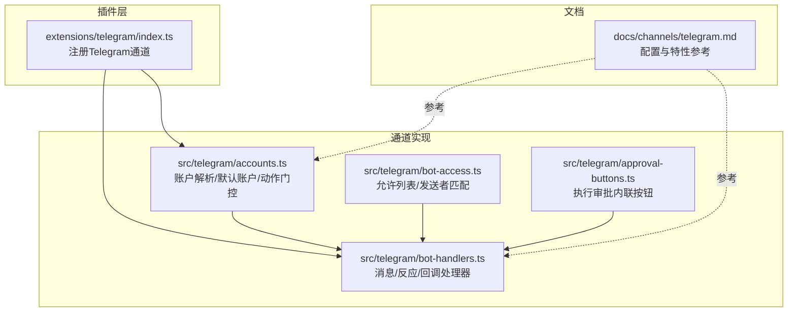
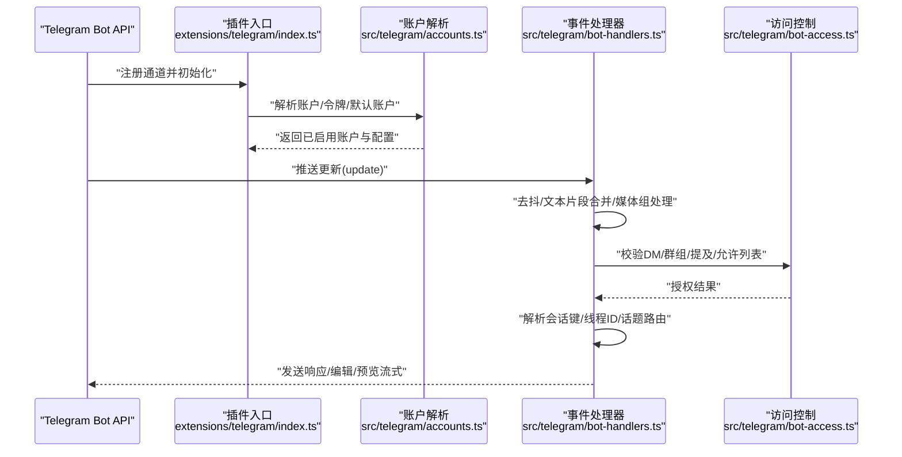
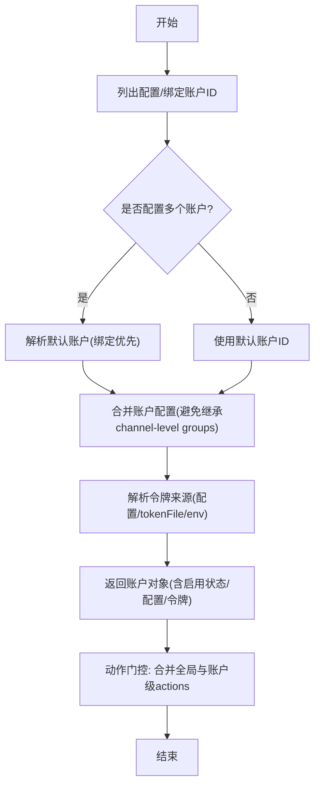
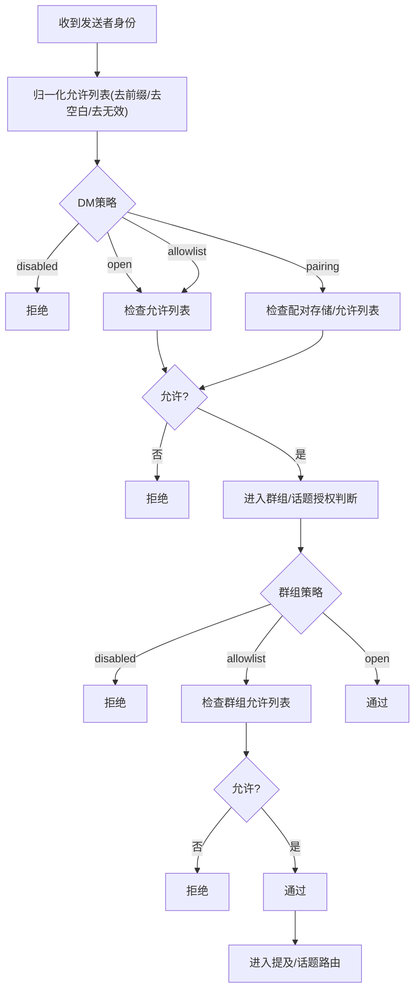
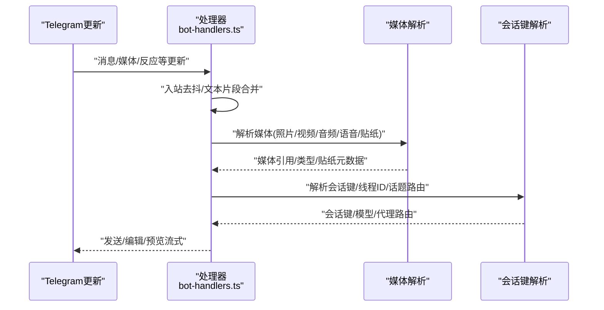
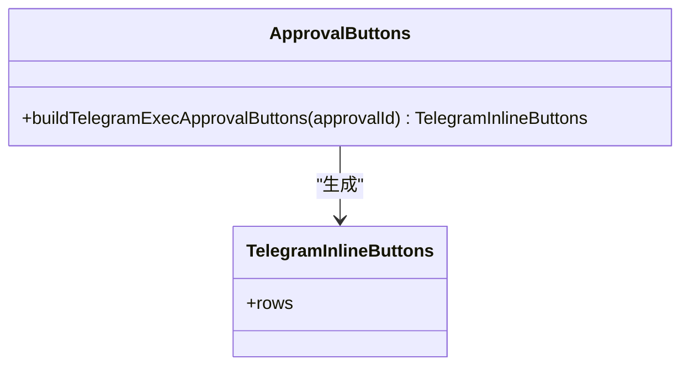
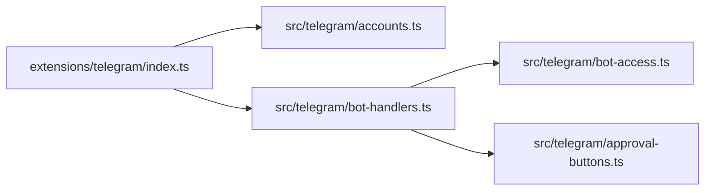

# Telegram集成

<cite>
**本文档引用的文件**
- [docs/channels/telegram.md](file://docs/channels/telegram.md)
- [extensions/telegram/index.ts](file://extensions/telegram/index.ts)
- [src/telegram/accounts.ts](file://src/telegram/accounts.ts)
- [src/telegram/bot-access.ts](file://src/telegram/bot-access.ts)
- [src/telegram/approval-buttons.ts](file://src/telegram/approval-buttons.ts)
- [src/telegram/bot-handlers.ts](file://src/telegram/bot-handlers.ts)
</cite>

## 目录

1. [简介](#简介)
2. [项目结构](#项目结构)
3. [核心组件](#核心组件)
4. [架构总览](#架构总览)
5. [详细组件分析](#详细组件分析)
6. [依赖关系分析](#依赖关系分析)
7. [性能考量](#性能考量)
8. [故障排除指南](#故障排除指南)
9. [结论](#结论)
10. [附录](#附录)

## 简介

本文件面向在OpenClaw平台上集成Telegram机器人的工程与运维人员，系统性阐述Bot API配置、Webhook设置、消息处理与用户权限管理等关键能力。内容覆盖：

- BotFather令牌获取与配置
- 长轮询与Webhook两种运行模式
- DM与群组访问控制、提及策略与话题路由
- 内联键盘、媒体文件处理、音频/视频/贴纸
- 反应通知、预览流式回复、命令菜单注册
- 执行审批（exec approvals）在Telegram中的交互
- 常见问题定位与网络/代理配置建议

## 项目结构

OpenClaw通过插件化扩展支持Telegram通道。核心位置如下：

- 文档：Telegram通道的使用说明与配置参考位于docs目录
- 插件入口：extensions/telegram/index.ts注册Telegram通道插件
- 运行时与通道实现：src/telegram 下包含账户解析、访问控制、事件处理、内联按钮、执行审批等模块

图表来源

- [extensions/telegram/index.ts:1-18](file://extensions/telegram/index.ts#L1-L18)
- [src/telegram/accounts.ts:1-209](file://src/telegram/accounts.ts#L1-L209)
- [src/telegram/bot-access.ts:1-95](file://src/telegram/bot-access.ts#L1-L95)
- [src/telegram/approval-buttons.ts:1-43](file://src/telegram/approval-buttons.ts#L1-L43)
- [src/telegram/bot-handlers.ts:1-800](file://src/telegram/bot-handlers.ts#L1-L800)
- [docs/channels/telegram.md:1-975](file://docs/channels/telegram.md#L1-L975)

章节来源

- [extensions/telegram/index.ts:1-18](file://extensions/telegram/index.ts#L1-L18)
- [docs/channels/telegram.md:1-975](file://docs/channels/telegram.md#L1-L975)

## 核心组件

- 账户与令牌解析：负责多账户、默认账户选择、令牌来源优先级与动作门控
- 访问控制：统一的允许列表归一化与匹配逻辑，支持DM与群组策略
- 事件处理器：长轮询/Webhook事件分发、去抖/文本片段合并、媒体组处理、会话键解析
- 内联按钮与执行审批：生成内联按钮、回调数据长度校验、审批决策按钮
- 文档参考：提供全面的配置项、行为与排障指引

章节来源

- [src/telegram/accounts.ts:100-209](file://src/telegram/accounts.ts#L100-L209)
- [src/telegram/bot-access.ts:42-95](file://src/telegram/bot-access.ts#L42-L95)
- [src/telegram/bot-handlers.ts:121-800](file://src/telegram/bot-handlers.ts#L121-L800)
- [src/telegram/approval-buttons.ts:10-43](file://src/telegram/approval-buttons.ts#L10-L43)
- [docs/channels/telegram.md:890-975](file://docs/channels/telegram.md#L890-L975)

## 架构总览

下图展示从Telegram更新到消息处理与会话路由的关键流程。

图表来源

- [extensions/telegram/index.ts:11-14](file://extensions/telegram/index.ts#L11-L14)
- [src/telegram/accounts.ts:166-209](file://src/telegram/accounts.ts#L166-L209)
- [src/telegram/bot-handlers.ts:121-800](file://src/telegram/bot-handlers.ts#L121-L800)
- [src/telegram/bot-access.ts:42-95](file://src/telegram/bot-access.ts#L42-L95)

## 详细组件分析

### 账户与令牌解析（多账户/默认账户/动作门控）

- 多账户枚举与默认账户选择：支持绑定账户优先、显式defaultAccount、回退到首个账户并发出警告
- 令牌来源优先级：配置 > tokenFile > 环境变量；环境变量仅对默认账户生效
- 动作门控：基于账户级与全局级actions配置进行组合，用于限制工具动作（如发送、删除、反应、贴纸）

图表来源

- [src/telegram/accounts.ts:49-135](file://src/telegram/accounts.ts#L49-L135)
- [src/telegram/accounts.ts:166-209](file://src/telegram/accounts.ts#L166-L209)
- [src/telegram/accounts.ts:137-146](file://src/telegram/accounts.ts#L137-L146)

章节来源

- [src/telegram/accounts.ts:49-135](file://src/telegram/accounts.ts#L49-L135)
- [src/telegram/accounts.ts:166-209](file://src/telegram/accounts.ts#L166-L209)

### 访问控制（DM/群组/允许列表）

- 允许列表归一化：支持通配符“\*”、去除前缀“telegram:/tg:”，过滤非数字ID并告警无效条目
- DM策略：pairing/allowlist/open/disabled；当策略非open时需提供有效允许列表
- 群组策略：open/allowlist/disabled；支持按群组与话题覆盖
- 提及要求：默认群组回复需要提及机器人用户名或自定义提及模式

图表来源

- [src/telegram/bot-access.ts:42-95](file://src/telegram/bot-access.ts#L42-L95)
- [docs/channels/telegram.md:105-246](file://docs/channels/telegram.md#L105-L246)

章节来源

- [src/telegram/bot-access.ts:42-95](file://src/telegram/bot-access.ts#L42-L95)
- [docs/channels/telegram.md:105-246](file://docs/channels/telegram.md#L105-L246)

### 事件处理与消息编排（去抖/文本片段/媒体组）

- 去抖与文本片段：根据输入文本与转发特征合并相邻更新，避免重复处理
- 媒体组：按消息ID排序，逐个解析媒体，跳过不可恢复错误，最终合成一条消息
- 会话键与线程：DM话题线程、群组话题、论坛主题均纳入会话键与回复目标

图表来源

- [src/telegram/bot-handlers.ts:121-800](file://src/telegram/bot-handlers.ts#L121-L800)

章节来源

- [src/telegram/bot-handlers.ts:121-800](file://src/telegram/bot-handlers.ts#L121-L800)

### 内联按钮与执行审批

- 内联按钮作用域：off/dm/group/all/allowlist，默认allowlist；支持按账户覆盖
- 执行审批按钮：生成“允许一次/允许总是/拒绝”三态按钮，自动校验回调数据长度上限
- 审批提示投递：可选择仅DM、回原聊天/话题或两者皆有；依赖内联按钮作用域与授权

图表来源

- [src/telegram/approval-buttons.ts:10-43](file://src/telegram/approval-buttons.ts#L10-L43)

章节来源

- [src/telegram/approval-buttons.ts:10-43](file://src/telegram/approval-buttons.ts#L10-L43)
- [docs/channels/telegram.md:354-817](file://docs/channels/telegram.md#L354-L817)

### Webhook与长轮询

- 默认：长轮询（grammy runner），支持按会话/线程顺序化
- Webhook：需配置webhookUrl与webhookSecret，可选host/port/path；本地默认监听127.0.0.1:8787
- 代理与网络：支持proxy与DNS/IPv4/IPv6行为调整，以应对不稳定出口TLS

章节来源

- [docs/channels/telegram.md:731-749](file://docs/channels/telegram.md#L731-L749)
- [docs/channels/telegram.md:850-884](file://docs/channels/telegram.md#L850-L884)

## 依赖关系分析

- 插件入口依赖通道实现：注册通道插件并注入运行时
- 事件处理器依赖账户解析与访问控制：在处理前先做授权判定
- 内联按钮依赖执行审批模块：生成符合Telegram回调长度限制的按钮

图表来源

- [extensions/telegram/index.ts:11-14](file://extensions/telegram/index.ts#L11-L14)
- [src/telegram/accounts.ts:166-209](file://src/telegram/accounts.ts#L166-L209)
- [src/telegram/bot-handlers.ts:121-800](file://src/telegram/bot-handlers.ts#L121-L800)
- [src/telegram/bot-access.ts:42-95](file://src/telegram/bot-access.ts#L42-L95)
- [src/telegram/approval-buttons.ts:10-43](file://src/telegram/approval-buttons.ts#L10-L43)

章节来源

- [extensions/telegram/index.ts:11-14](file://extensions/telegram/index.ts#L11-L14)
- [src/telegram/bot-handlers.ts:121-800](file://src/telegram/bot-handlers.ts#L121-L800)

## 性能考量

- 长轮询并发：整体runner吞吐由agents.defaults.maxConcurrent控制
- 文本分片与链接预览：textChunkLimit与chunkMode控制输出大小与换行偏好；linkPreview可关闭以减少渲染开销
- 媒体上限：mediaMaxMb限制收发媒体体积；超限将被拒绝
- 预览流式：streaming支持partial/progress映射，复杂媒体回退为最终交付并清理预览
- 去抖与合并：文本片段与媒体组处理降低重复处理成本

章节来源

- [docs/channels/telegram.md:258-289](file://docs/channels/telegram.md#L258-L289)
- [docs/channels/telegram.md:749-790](file://docs/channels/telegram.md#L749-L790)

## 故障排除指南

- 非提及群组消息无响应
  - 若requireMention=false，需在BotFather关闭隐私模式并重新加群
  - 使用openclaw channels status与probe验证预期群组ID
- 群组消息完全不接收
  - 检查channels.telegram.groups是否包含该群或“\*”
  - 确认机器人在群组中且日志显示跳过原因
- 命令部分或全部失效
  - 授权发送者身份（配对/允许列表）
  - setMyCommands失败通常为到api.telegram.org的DNS/HTTPS受限
- 轮询/网络不稳定
  - Node 22+可能因IPv6/主机解析导致间歇失败
  - 通过channels.telegram.proxy走SOCKS/HTTP代理
  - 调整network.autoSelectFamily与dnsResultOrder，或使用环境变量临时覆盖
- 命令菜单与自定义命令
  - setMyCommands失败通常意味着出站网络受限
  - 自定义命令需命名规范化，不可覆盖内置命令

章节来源

- [docs/channels/telegram.md:820-884](file://docs/channels/telegram.md#L820-L884)

## 结论

OpenClaw对Telegram的支持以插件形式集成，具备完善的多账户、访问控制、消息编排与工具动作能力。通过清晰的配置项与详尽的排障指引，可在生产环境中稳定运行长轮询或Webhook模式，并灵活运用内联按钮、媒体处理、话题路由与执行审批等高级特性。

## 附录

### 配置要点速查

- 令牌与账户
  - channels.telegram.enabled、botToken、tokenFile
  - channels.telegram.defaultAccount、accounts.<id>.\*
- 访问控制
  - dmPolicy、allowFrom；groupPolicy、groupAllowFrom；groups._.topics._、bindings[]
- 命令与菜单
  - commands.native、commands.nativeSkills、customCommands
- 回复与流式
  - replyToMode、streaming、linkPreview
- 媒体与网络
  - mediaMaxMb、textChunkLimit、chunkMode、proxy、network.autoSelectFamily
- Webhook
  - webhookUrl、webhookSecret、webhookPath、webhookHost、webhookPort
- 工具动作与能力
  - capabilities.inlineButtons、actions.\*、reactionNotifications、reactionLevel

章节来源

- [docs/channels/telegram.md:890-975](file://docs/channels/telegram.md#L890-L975)
