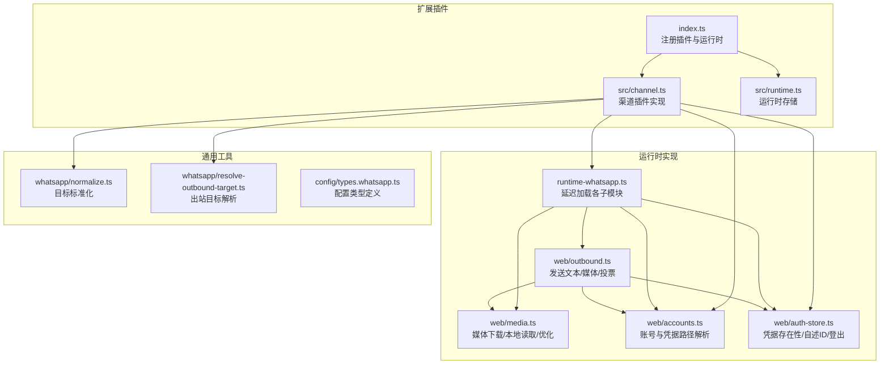
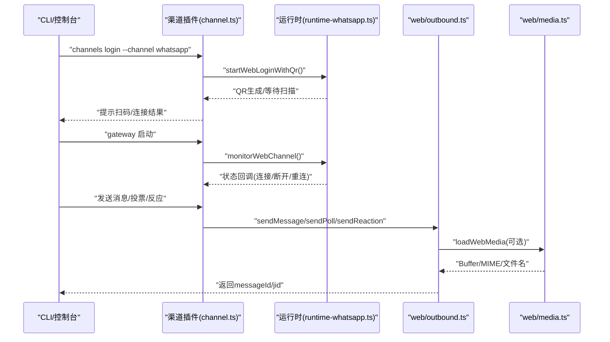
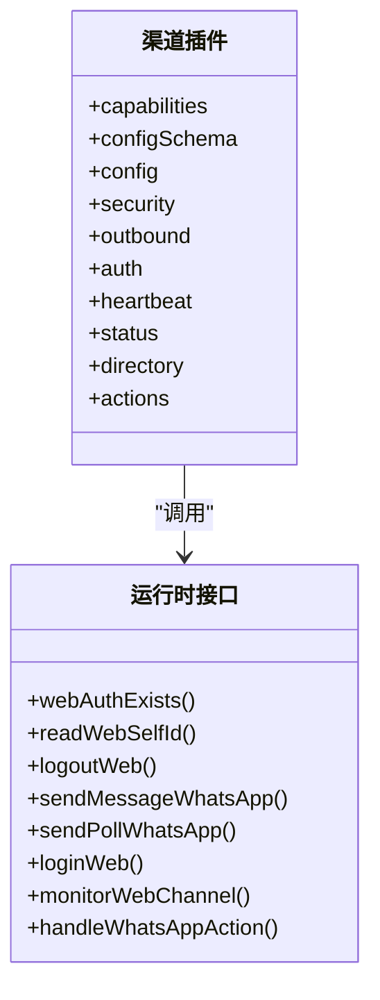
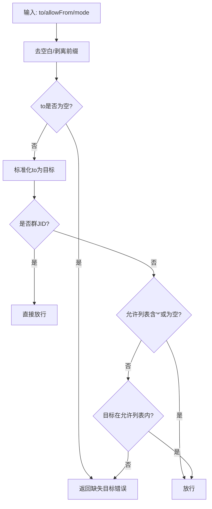
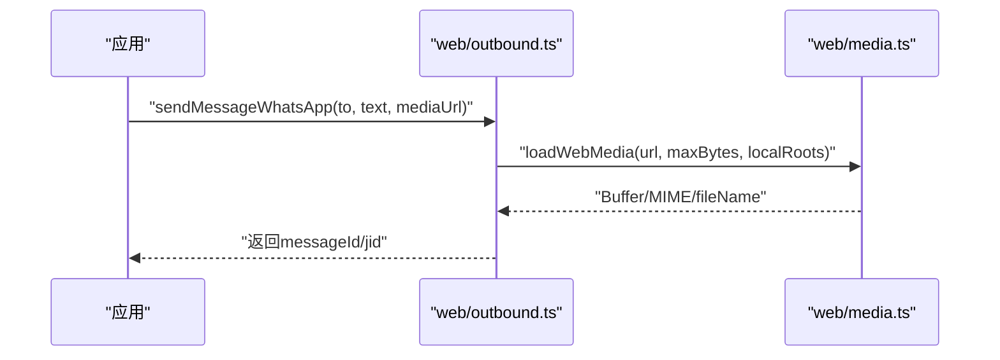
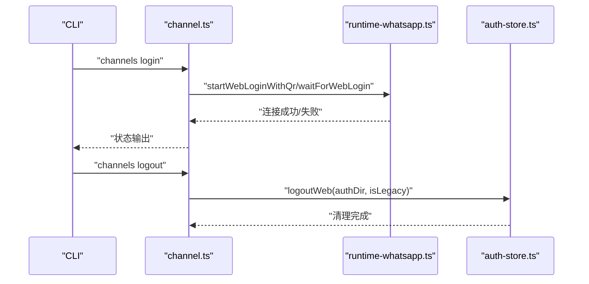
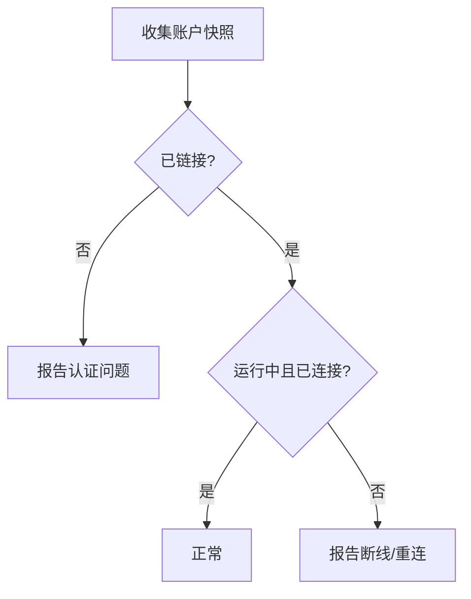
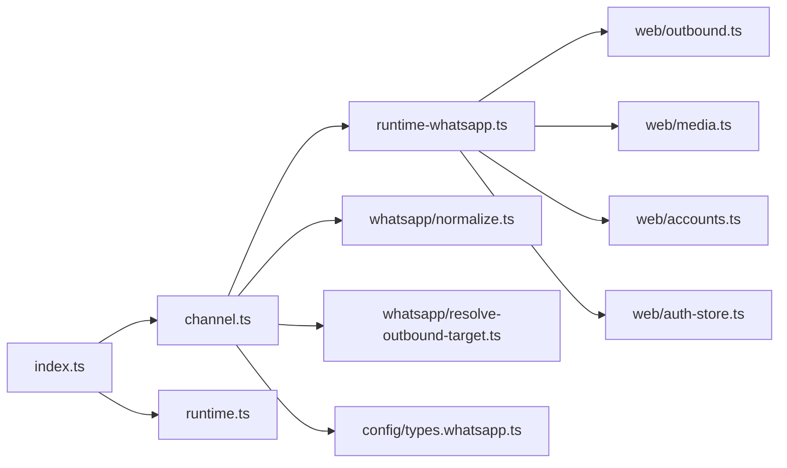

# WhatsApp集成

<cite>
**本文引用的文件**
- [docs/channels/whatsapp.md](file://docs/channels/whatsapp.md)
- [extensions/whatsapp/index.ts](file://extensions/whatsapp/index.ts)
- [extensions/whatsapp/src/channel.ts](file://extensions/whatsapp/src/channel.ts)
- [extensions/whatsapp/src/runtime.ts](file://extensions/whatsapp/src/runtime.ts)
- [src/whatsapp/normalize.ts](file://src/whatsapp/normalize.ts)
- [src/whatsapp/resolve-outbound-target.ts](file://src/whatsapp/resolve-outbound-target.ts)
- [src/web/accounts.ts](file://src/web/accounts.ts)
- [src/web/auth-store.ts](file://src/web/auth-store.ts)
- [src/web/media.ts](file://src/web/media.ts)
- [src/web/outbound.ts](file://src/web/outbound.ts)
- [src/plugins/runtime/runtime-whatsapp.ts](file://src/plugins/runtime/runtime-whatsapp.ts)
- [src/channels/plugins/onboarding/whatsapp.ts](file://src/channels/plugins/onboarding/whatsapp.ts)
- [src/channels/plugins/status-issues/whatsapp.ts](file://src/channels/plugins/status-issues/whatsapp.ts)
- [src/channels/plugins/status-issues/whatsapp.test.ts](file://src/channels/plugins/status-issues/whatsapp.test.ts)
- [src/config/types.whatsapp.ts](file://src/config/types.whatsapp.ts)
- [src/channel-web.ts](file://src/channel-web.ts)
</cite>

## 目录

1. [简介](#简介)
2. [项目结构](#项目结构)
3. [核心组件](#核心组件)
4. [架构总览](#架构总览)
5. [详细组件分析](#详细组件分析)
6. [依赖关系分析](#依赖关系分析)
7. [性能考量](#性能考量)
8. [故障排除指南](#故障排除指南)
9. [结论](#结论)
10. [附录](#附录)

## 简介

本文件面向在OpenClaw平台上集成WhatsApp（Web通道）的工程团队，提供从配置、认证到消息路由的完整指南，并覆盖多媒体消息、位置共享、语音消息（PTT）、投票等特性。文档同时给出企业级部署建议与常见问题排查方法，帮助您在生产环境中稳定运行。

## 项目结构

WhatsApp集成由“扩展插件”和“运行时实现”两部分组成：

- 扩展插件层：负责注册渠道、暴露能力、配置模式、心跳与状态收集、登录流程等。
- 运行时层：封装Web会话、媒体加载与优化、发送逻辑、动作处理（反应、投票）等。

**图表来源**

- [extensions/whatsapp/index.ts:1-18](file://extensions/whatsapp/index.ts#L1-L18)
- [extensions/whatsapp/src/channel.ts:1-474](file://extensions/whatsapp/src/channel.ts#L1-L474)
- [extensions/whatsapp/src/runtime.ts:1-7](file://extensions/whatsapp/src/runtime.ts#L1-L7)
- [src/plugins/runtime/runtime-whatsapp.ts:1-109](file://src/plugins/runtime/runtime-whatsapp.ts#L1-L109)
- [src/web/outbound.ts:1-195](file://src/web/outbound.ts#L1-L195)
- [src/web/media.ts:1-494](file://src/web/media.ts#L1-L494)
- [src/web/accounts.ts:41-84](file://src/web/accounts.ts#L41-L84)
- [src/web/auth-store.ts:131-167](file://src/web/auth-store.ts#L131-L167)
- [src/whatsapp/normalize.ts:1-81](file://src/whatsapp/normalize.ts#L1-L81)
- [src/whatsapp/resolve-outbound-target.ts:1-53](file://src/whatsapp/resolve-outbound-target.ts#L1-L53)
- [src/config/types.whatsapp.ts:83-116](file://src/config/types.whatsapp.ts#L83-L116)

**章节来源**

- [extensions/whatsapp/index.ts:1-18](file://extensions/whatsapp/index.ts#L1-L18)
- [extensions/whatsapp/src/channel.ts:1-474](file://extensions/whatsapp/src/channel.ts#L1-L474)
- [extensions/whatsapp/src/runtime.ts:1-7](file://extensions/whatsapp/src/runtime.ts#L1-L7)
- [src/plugins/runtime/runtime-whatsapp.ts:1-109](file://src/plugins/runtime/runtime-whatsapp.ts#L1-L109)

## 核心组件

- 渠道插件（ChannelPlugin）
  - 能力声明：支持直聊/群聊、多媒体、投票、反应。
  - 配置模式：基于Schema构建，支持多账号、默认账号、动作门控。
  - 登录与心跳：提供QR登录、监听器存活检查、状态汇总。
  - 安全策略：基于允许列表的DM策略、群组策略与提及要求。
  - 消息出站：文本分块、媒体发送、投票发送、动作处理（反应）。
- 运行时（WhatsApp Runtime）
  - 延迟加载：登录、会话监控、发送、动作处理按需加载，降低启动成本。
  - 凭据管理：检测凭据存在、读取自述ID、登出清理。
  - 媒体处理：远程下载、本地读取、SSRF策略、图片优化与大小限制。
- 工具与规范
  - 目标标准化：统一用户/JID/号码输入，支持前缀剥离与E.164归一化。
  - 出站目标解析：校验允许列表、群组/JID合法性、错误提示。
  - 配置类型：明确字段含义与默认行为，支持全局与账户级覆盖。

**章节来源**

- [extensions/whatsapp/src/channel.ts:43-119](file://extensions/whatsapp/src/channel.ts#L43-L119)
- [extensions/whatsapp/src/channel.ts:220-331](file://extensions/whatsapp/src/channel.ts#L220-L331)
- [src/plugins/runtime/runtime-whatsapp.ts:92-109](file://src/plugins/runtime/runtime-whatsapp.ts#L92-L109)
- [src/web/outbound.ts:17-112](file://src/web/outbound.ts#L17-L112)
- [src/web/media.ts:233-424](file://src/web/media.ts#L233-L424)
- [src/whatsapp/normalize.ts:55-80](file://src/whatsapp/normalize.ts#L55-L80)
- [src/whatsapp/resolve-outbound-target.ts:8-52](file://src/whatsapp/resolve-outbound-target.ts#L8-L52)
- [src/config/types.whatsapp.ts:83-116](file://src/config/types.whatsapp.ts#L83-L116)

## 架构总览

WhatsApp Web通道采用“网关拥有会话”的设计：网关负责登录、监听、重连与状态上报；应用侧通过网关进行消息发送与动作操作。运行时以模块化方式延迟加载，确保启动性能与资源占用可控。

**图表来源**

- [extensions/whatsapp/src/channel.ts:332-342](file://extensions/whatsapp/src/channel.ts#L332-L342)
- [extensions/whatsapp/src/channel.ts:436-472](file://extensions/whatsapp/src/channel.ts#L436-L472)
- [src/plugins/runtime/runtime-whatsapp.ts:26-56](file://src/plugins/runtime/runtime-whatsapp.ts#L26-L56)
- [src/web/outbound.ts:17-112](file://src/web/outbound.ts#L17-L112)
- [src/web/media.ts:404-424](file://src/web/media.ts#L404-L424)

## 详细组件分析

### 渠道插件（ChannelPlugin）

- 能力与配置
  - 能力：直聊/群聊、多媒体、投票、反应。
  - 配置：Schema驱动，支持多账号、默认账号、动作门控、读回执、ACK反应等。
- 安全与路由
  - DM策略：支持配对、白名单、开放、禁用；允许列表条目归一化为E.164。
  - 群组策略：成员白名单与发送者白名单双层控制；提及要求可配置。
  - 目标解析：支持JID/号码/带前缀标识，自动标准化。
- 出站发送
  - 文本：Markdown表格转换、长度分块（默认4000字符），按换行或长度模式。
  - 媒体：图片/视频/音频/文档；PTT强制编码；GIF播放可选；首项失败自动降级为文本。
  - 投票：最多12个选项；发送前标准化。
  - 动作：反应（emoji）支持移除、指定参与者、fromMe标记。
- 心跳与状态
  - 就绪检查：网关启用、已链接、监听器活跃。
  - 状态汇总：连接/断开时间、重连次数、最后事件/消息时间、错误信息。
  - 自述ID：读取并记录当前账号身份。

**图表来源**

- [extensions/whatsapp/src/channel.ts:43-119](file://extensions/whatsapp/src/channel.ts#L43-L119)
- [extensions/whatsapp/src/channel.ts:220-331](file://extensions/whatsapp/src/channel.ts#L220-L331)
- [extensions/whatsapp/src/channel.ts:343-472](file://extensions/whatsapp/src/channel.ts#L343-L472)
- [src/plugins/runtime/runtime-whatsapp.ts:92-109](file://src/plugins/runtime/runtime-whatsapp.ts#L92-L109)

**章节来源**

- [extensions/whatsapp/src/channel.ts:43-119](file://extensions/whatsapp/src/channel.ts#L43-L119)
- [extensions/whatsapp/src/channel.ts:220-331](file://extensions/whatsapp/src/channel.ts#L220-L331)
- [extensions/whatsapp/src/channel.ts:343-472](file://extensions/whatsapp/src/channel.ts#L343-L472)

### 目标标准化与出站解析

- 标准化
  - 支持前缀剥离（如whatsapp:）、JID规范化（群/JID）、号码E.164归一化。
- 出站目标解析
  - 校验群JID合法性；直聊目标受允许列表约束；通配符“\*”放行。
  - 错误统一为缺失目标错误，提示期望格式。

**图表来源**

- [src/whatsapp/normalize.ts:55-80](file://src/whatsapp/normalize.ts#L55-L80)
- [src/whatsapp/resolve-outbound-target.ts:8-52](file://src/whatsapp/resolve-outbound-target.ts#L8-L52)

**章节来源**

- [src/whatsapp/normalize.ts:1-81](file://src/whatsapp/normalize.ts#L1-L81)
- [src/whatsapp/resolve-outbound-target.ts:1-53](file://src/whatsapp/resolve-outbound-target.ts#L1-L53)

### 媒体处理与发送

- 媒体加载
  - 支持HTTP(S)/file:///本地路径；SSRF策略与根目录白名单；HEIC转JPEG；GIF保持。
  - 图片优化：按尺寸/质量网格压缩，PNG保留透明通道；超限抛错。
- 发送流程
  - 文本预处理：Markdown表格与WhatsApp格式转换；长文本按配置分块。
  - 媒体发送：根据类型设置MIME（PTT强制opus编码）；视频/图片自动去除正文；文档保留文件名。
  - 反应/投票：分别走对应通道，携带必要上下文与超时控制。

**图表来源**

- [src/web/outbound.ts:17-112](file://src/web/outbound.ts#L17-L112)
- [src/web/media.ts:404-424](file://src/web/media.ts#L404-L424)

**章节来源**

- [src/web/outbound.ts:17-112](file://src/web/outbound.ts#L17-L112)
- [src/web/media.ts:233-424](file://src/web/media.ts#L233-L424)

### 认证与凭据管理

- 凭据位置
  - 默认路径：用户态凭据目录下的账号子目录；支持迁移与兼容旧版目录。
- 登录流程
  - 通过渠道插件触发QR登录，等待扫描完成；支持强制刷新与超时控制。
- 登出与清理
  - 清理凭据（兼容旧版目录保留OAuth文件）；日志提示。

**图表来源**

- [extensions/whatsapp/src/channel.ts:332-342](file://extensions/whatsapp/src/channel.ts#L332-L342)
- [extensions/whatsapp/src/channel.ts:455-463](file://extensions/whatsapp/src/channel.ts#L455-L463)
- [src/web/auth-store.ts:131-167](file://src/web/auth-store.ts#L131-L167)
- [src/web/accounts.ts:41-84](file://src/web/accounts.ts#L41-L84)

**章节来源**

- [src/web/auth-store.ts:131-167](file://src/web/auth-store.ts#L131-L167)
- [src/web/accounts.ts:41-84](file://src/web/accounts.ts#L41-L84)
- [src/channels/plugins/onboarding/whatsapp.ts:254-315](file://src/channels/plugins/onboarding/whatsapp.ts#L254-L315)

### 状态与问题收集

- 状态快照
  - 包含链接状态、运行/连接状态、重连次数、最近事件/消息时间、错误信息。
- 问题收集
  - 已启用但未链接：认证问题。
  - 已链接但断线/重连：网络/会话异常。
  - 测试覆盖：验证不同场景的报告行为。

**图表来源**

- [extensions/whatsapp/src/channel.ts:407-426](file://extensions/whatsapp/src/channel.ts#L407-L426)
- [src/channels/plugins/status-issues/whatsapp.ts:30-42](file://src/channels/plugins/status-issues/whatsapp.ts#L30-L42)
- [src/channels/plugins/status-issues/whatsapp.test.ts:1-56](file://src/channels/plugins/status-issues/whatsapp.test.ts#L1-L56)

**章节来源**

- [src/channels/plugins/status-issues/whatsapp.ts:1-42](file://src/channels/plugins/status-issues/whatsapp.ts#L1-L42)
- [src/channels/plugins/status-issues/whatsapp.test.ts:1-56](file://src/channels/plugins/status-issues/whatsapp.test.ts#L1-L56)

## 依赖关系分析

- 插件注册与运行时绑定
  - 插件入口注册渠道与运行时；运行时以store形式提供给插件使用。
- 延迟加载策略
  - 登录、会话监控、发送、动作处理均按需导入，避免一次性加载全部模块。
- 外部依赖
  - Web通道基于会话管理与监听器；媒体处理依赖网络与文件系统；配置类型定义来自核心配置模块。

**图表来源**

- [extensions/whatsapp/index.ts:1-18](file://extensions/whatsapp/index.ts#L1-L18)
- [extensions/whatsapp/src/runtime.ts:1-7](file://extensions/whatsapp/src/runtime.ts#L1-L7)
- [src/plugins/runtime/runtime-whatsapp.ts:67-90](file://src/plugins/runtime/runtime-whatsapp.ts#L67-L90)
- [src/web/outbound.ts:1-195](file://src/web/outbound.ts#L1-L195)
- [src/web/media.ts:1-494](file://src/web/media.ts#L1-L494)
- [src/web/accounts.ts:41-84](file://src/web/accounts.ts#L41-L84)
- [src/web/auth-store.ts:131-167](file://src/web/auth-store.ts#L131-L167)
- [src/whatsapp/normalize.ts:1-81](file://src/whatsapp/normalize.ts#L1-L81)
- [src/whatsapp/resolve-outbound-target.ts:1-53](file://src/whatsapp/resolve-outbound-target.ts#L1-L53)
- [src/config/types.whatsapp.ts:83-116](file://src/config/types.whatsapp.ts#L83-L116)

**章节来源**

- [extensions/whatsapp/index.ts:1-18](file://extensions/whatsapp/index.ts#L1-L18)
- [extensions/whatsapp/src/runtime.ts:1-7](file://extensions/whatsapp/src/runtime.ts#L1-L7)
- [src/plugins/runtime/runtime-whatsapp.ts:67-90](file://src/plugins/runtime/runtime-whatsapp.ts#L67-L90)

## 性能考量

- 延迟加载：登录、会话监控、发送、动作处理模块按需加载，减少启动时内存占用。
- 媒体优化：图片自动压缩与尺寸调整，PNG保留透明通道；HEIC转JPEG提升兼容性。
- 分块发送：文本按长度或换行分块，避免单次超长消息导致失败。
- 并发与超时：发送前设置“正在输入”提示，合理设置超时与重试策略。

## 故障排除指南

- 未链接（需要QR）
  - 现象：状态显示未链接。
  - 处理：执行登录命令并确认状态。
- 已链接但断线/重连循环
  - 现象：反复断开/重连。
  - 处理：运行诊断命令与日志跟踪；必要时重新登录。
- 发送时无活动监听器
  - 现象：出站发送失败。
  - 处理：确保网关运行且账号已链接。
- 群消息被忽略
  - 现象：群消息未触发。
  - 处理：检查群策略、发送者白名单、群成员白名单、提及要求；避免JSON5重复键覆盖。
- Bun运行时警告
  - 现象：提示Bun不兼容。
  - 处理：使用Node运行WhatsApp网关。

**章节来源**

- [docs/channels/whatsapp.md:374-424](file://docs/channels/whatsapp.md#L374-L424)

## 结论

本集成方案以“网关拥有会话”为核心，结合延迟加载与严格的媒体/安全策略，提供稳定可靠的WhatsApp Web通道能力。通过清晰的配置模型、完善的认证与状态管理、以及详尽的故障排除指引，可在企业环境中实现高可用的消息自动化与交互体验。

## 附录

### 配置参考要点

- 访问控制：dmPolicy、allowFrom、groupPolicy、groupAllowFrom、groups
- 交付行为：textChunkLimit、chunkMode、mediaMaxMb、sendReadReceipts、ackReaction
- 多账号：accounts.<id>.enabled、accounts.<id>.authDir、账户级覆盖
- 运维参数：configWrites、debounceMs、web.enabled、web.heartbeatSeconds、web.reconnect.\*
- 会话行为：session.dmScope、historyLimit、dmHistoryLimit、dms.<id>.historyLimit

**章节来源**

- [docs/channels/whatsapp.md:426-439](file://docs/channels/whatsapp.md#L426-L439)
