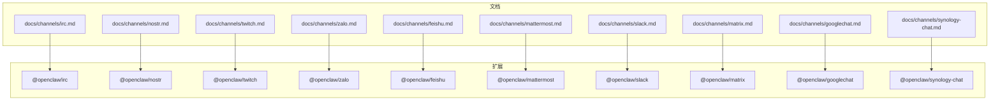
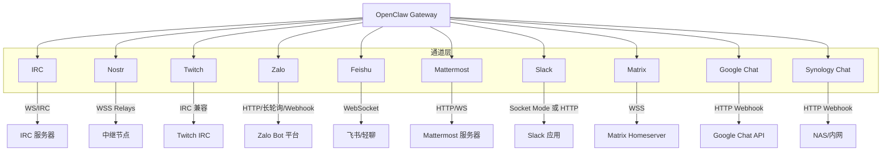
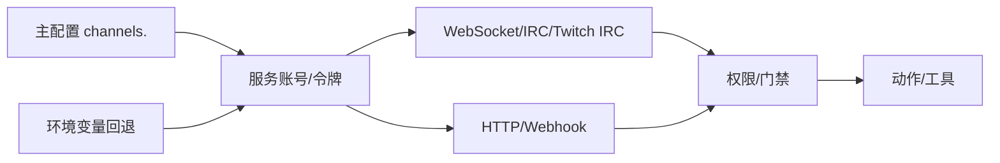

# 其他IM平台

<cite>
**本文引用的文件**
- [irc.md](file://docs/channels/irc.md)
- [nostr.md](file://docs/channels/nostr.md)
- [twitch.md](file://docs/channels/twitch.md)
- [zalo.md](file://docs/channels/zalo.md)
- [feishu.md](file://docs/channels/feishu.md)
- [mattermost.md](file://docs/channels/mattermost.md)
- [slack.md](file://docs/channels/slack.md)
- [matrix.md](file://docs/channels/matrix.md)
- [googlechat.md](file://docs/channels/googlechat.md)
- [synology-chat.md](file://docs/channels/synology-chat.md)
</cite>

## 目录

1. [简介](#简介)
2. [项目结构](#项目结构)
3. [核心组件](#核心组件)
4. [架构总览](#架构总览)
5. [详细组件分析](#详细组件分析)
6. [依赖关系分析](#依赖关系分析)
7. [性能考量](#性能考量)
8. [故障排查指南](#故障排查指南)
9. [结论](#结论)
10. [附录](#附录)

## 简介

本文件面向需要在 OpenClaw 中集成多种即时通讯（IM）平台的工程师与运维人员，覆盖 IRC、Nostr、Twitch、Zalo、飞书（Feishu）、Mattermost、Slack、Matrix、Google Chat、Synology Chat 等平台。内容包括：

- 认证配置与密钥管理
- 消息路由与会话模型
- 平台特定能力与限制
- 权限控制与安全建议
- 常见问题定位与解决
- 新平台集成的通用模板与开发指南

## 项目结构

OpenClaw 将各 IM 平台以“通道（Channel）”形式组织，文档位于 docs/channels 下，每种平台有独立的配置与行为说明；扩展插件位于 extensions/ 目录下，按平台拆分。

图表来源

- [irc.md](file://docs/channels/irc.md)
- [nostr.md](file://docs/channels/nostr.md)
- [twitch.md](file://docs/channels/twitch.md)
- [zalo.md](file://docs/channels/zalo.md)
- [feishu.md](file://docs/channels/feishu.md)
- [mattermost.md](file://docs/channels/mattermost.md)
- [slack.md](file://docs/channels/slack.md)
- [matrix.md](file://docs/channels/matrix.md)
- [googlechat.md](file://docs/channels/googlechat.md)
- [synology-chat.md](file://docs/channels/synology-chat.md)

章节来源

- [irc.md](file://docs/channels/irc.md)
- [nostr.md](file://docs/channels/nostr.md)
- [twitch.md](file://docs/channels/twitch.md)
- [zalo.md](file://docs/channels/zalo.md)
- [feishu.md](file://docs/channels/feishu.md)
- [mattermost.md](file://docs/channels/mattermost.md)
- [slack.md](file://docs/channels/slack.md)
- [matrix.md](file://docs/channels/matrix.md)
- [googlechat.md](file://docs/channels/googlechat.md)
- [synology-chat.md](file://docs/channels/synology-chat.md)

## 核心组件

- 通道（Channel）：每种 IM 平台通过独立通道实现接入，支持 DM、群组、房间等场景。
- 认证与令牌：多数平台采用访问令牌或服务账号凭据，部分支持自动刷新或轮换。
- 路由与会话：通道负责将入站消息标准化到统一信封，并决定出站回复的目标通道。
- 权限与门禁：支持 DM/群组策略、发送者白名单、提及要求、角色/用户ID匹配等。
- 工具与动作：通道可暴露工具动作（如反应、按钮、媒体发送），并受动作门控与配额限制。
- 多账户与多租户：支持 per-account 配置、多租户域、多实例运行。

章节来源

- [irc.md](file://docs/channels/irc.md)
- [nostr.md](file://docs/channels/nostr.md)
- [twitch.md](file://docs/channels/twitch.md)
- [zalo.md](file://docs/channels/zalo.md)
- [feishu.md](file://docs/channels/feishu.md)
- [mattermost.md](file://docs/channels/mattermost.md)
- [slack.md](file://docs/channels/slack.md)
- [matrix.md](file://docs/channels/matrix.md)
- [googlechat.md](file://docs/channels/googlechat.md)
- [synology-chat.md](file://docs/channels/synology-chat.md)

## 架构总览

下图展示 OpenClaw 与各 IM 平台的交互模式：通道负责认证、事件订阅/轮询、消息解析与回发；权限系统在入口处进行门禁；工具动作在通道侧受控。

图表来源

- [irc.md](file://docs/channels/irc.md)
- [nostr.md](file://docs/channels/nostr.md)
- [twitch.md](file://docs/channels/twitch.md)
- [zalo.md](file://docs/channels/zalo.md)
- [feishu.md](file://docs/channels/feishu.md)
- [mattermost.md](file://docs/channels/mattermost.md)
- [slack.md](file://docs/channels/slack.md)
- [matrix.md](file://docs/channels/matrix.md)
- [googlechat.md](file://docs/channels/googlechat.md)
- [synology-chat.md](file://docs/channels/synology-chat.md)

## 详细组件分析

### IRC

- 认证与连接
  - 支持明文/SSL 连接，TLS 默认开启。
  - 支持登录后通过 NickServ 身份识别与一次性注册。
- 访问控制
  - 分为 DM 与群组两类门禁：组策略（open/allowlist/disabled）与发送者允许列表。
  - 提及门控默认开启，可通过 requireMention 关闭。
- 消息路由
  - 统一归一化消息信封，支持 DM 与频道消息。
- 安全建议
  - 使用 allowFrom 限定发送者；对公共频道建议限制工具集。
- 环境变量
  - IRC_HOST、IRC_PORT、IRC_TLS、IRC_NICK、IRC_USERNAME、IRC_REALNAME、IRC_PASSWORD、IRC_CHANNELS、IRC_NICKSERV_PASSWORD、IRC_NICKSERV_REGISTER_EMAIL。

章节来源

- [irc.md](file://docs/channels/irc.md)

### Nostr

- 认证与连接
  - 私钥格式支持 nsec 或 64 字节十六进制；默认连接多个中继提升可用性。
- 访问控制
  - DM 策略：pairing（默认）、allowlist、open、disabled。
  - 公钥允许列表支持 npub 或十六进制格式。
- 协议支持
  - 已支持 NIP-01（资料）、NIP-04（加密私信）；计划支持 NIP-17、NIP-44。
- 安全与限制
  - 不支持群组聊天、媒体附件；建议生产环境使用 allowlist。

章节来源

- [nostr.md](file://docs/channels/nostr.md)

### Twitch

- 认证与连接
  - 支持 Bot Token 与 Client ID；可配置 Client Secret 与 Refresh Token 实现自动刷新。
  - 支持多账户，每账户独立令牌与频道。
- 访问控制
  - 推荐基于用户 ID 的硬白名单；也支持角色级访问（moderator/vip/subscriber/all）。
  - 可关闭 @mention 要求以响应所有消息。
- 速率与限制
  - 单条消息最大 500 字符，自动按词边界切片；无内置速率限制。
- 安全建议
  - 令牌视为密码；最小化授权范围；启用自动刷新。

章节来源

- [twitch.md](file://docs/channels/twitch.md)

### Zalo

- 认证与连接
  - 使用 Bot Token；支持长轮询与 Webhook（HTTPS、带签名头）。
- 访问控制
  - DM 默认 pairing；支持 allowlist/open/disabled。
  - 群组默认 fail-closed allowlist，支持 groupAllowFrom 与 groupPolicy。
- 速率与限制
  - 出站文本按 2000 字符切片；媒体下载/上传默认上限 5MB；流式输出默认禁用。
- 安全建议
  - Webhook 必须 HTTPS，Secret 长度 8–256；建议使用 pairing/allowlist。

章节来源

- [zalo.md](file://docs/channels/zalo.md)

### 飞书（Feishu）

- 认证与连接
  - 企业应用（App ID/App Secret）+ 事件订阅（WebSocket）；支持 Webhook 模式（需验证 Token）。
  - 支持 Lark（国际版）域名切换。
- 访问控制
  - DM 默认 pairing；群组策略 open/allowlist/disabled；支持 mention 要求与 per-group sender allowlist。
- 功能特性
  - 支持富文本、图片、文件、音频、视频、贴纸；支持卡片交互与流式输出。
- 安全建议
  - 严格管理 App Secret；启用 WebSocket 事件订阅；合理设置 typingIndicator 与名称解析以降低 API 开销。

章节来源

- [feishu.md](file://docs/channels/feishu.md)

### Mattermost

- 认证与连接
  - Bot Token + 基础 URL；支持 WebSocket 事件；可选原生斜杠命令与回调路径。
- 访问控制
  - DM 默认 pairing；群组默认 allowlist；支持 oncall/onmessage/onchar 三种聊天模式。
- 工具与动作
  - 支持反应、内联按钮（含 HMAC 校验）；目标支持 user:/channel: 前缀。
- 安全建议
  - 回调可达性必须从 Mattermost 服务器可达；必要时配置 AllowedUntrustedInternalConnections。

章节来源

- [mattermost.md](file://docs/channels/mattermost.md)

### Slack

- 认证与连接
  - Socket Mode（默认）或 HTTP Events API；Socket Mode 需要 App Token + Bot Token；HTTP 需 Bot Token + Signing Secret。
- 访问控制
  - DM 策略：pairing/allowlist/open/disabled；群组策略：open/allowlist/disabled；默认提及门控。
- 功能特性
  - 支持线程、回复标签、反应、钉图、成员信息、表情包列表；支持原生流式输出（Assistant API）。
- 安全建议
  - 严格校验签名；为多账户设置唯一 webhookPath；最小化 scope。

章节来源

- [slack.md](file://docs/channels/slack.md)

### Matrix

- 认证与连接
  - 用户登录（用户名/密码或访问令牌）；支持端到端加密（E2EE）。
- 访问控制
  - DM 默认 pairing；群组默认 allowlist；支持房间别名/ID 与用户全 ID 匹配。
- 功能特性
  - 支持 DM、房间、线程、媒体、反应、投票、位置、原生命令；支持设备验证与密钥存储。
- 安全建议
  - 启用 E2EE 并完成设备验证；注意密钥存储路径与变更处理。

章节来源

- [matrix.md](file://docs/channels/matrix.md)

### Google Chat

- 认证与连接
  - 服务账号（JSON Key）+ Webhook；需配置 Audience 类型与值（URL 或项目号）。
- 认证与路由
  - Webhook 请求携带 Authorization: Bearer；按空间区分会话键；DM 默认 pairing。
- 功能特性
  - 支持 DM 与空间；支持反应工具；Typing Indicator 支持 message/reaction。
- 安全建议
  - 仅暴露 /googlechat 路径；使用 Tailscale Funnel 或反向代理；严格校验 Audience。

章节来源

- [googlechat.md](file://docs/channels/googlechat.md)

### Synology Chat

- 认证与连接
  - Webhook 模式：出站 Webhook（带密钥）+ 入站 Webhook（URL）。
- 访问控制
  - DM 默认 allowlist；支持 allowedUserIds；支持 pairing 列表批准。
- 功能特性
  - 支持媒体 URL 发送；支持 per-account 配置与限速。
- 安全建议
  - 保持 token 秘密；allowInsecureSsl 关闭；优先 allowlist。

章节来源

- [synology-chat.md](file://docs/channels/synology-chat.md)

## 依赖关系分析

- 插件与通道
  - 各平台以独立插件形式存在，通道配置在主配置 channels.<platform> 下生效。
- 认证与密钥
  - 多数平台支持环境变量回退（默认账户），也可直接写入配置文件或密钥引用。
- 事件与回调
  - WebSocket/IRC/Twitch IRC 等采用长连接或轮询；HTTP 平台采用 Webhook，需公网可达或内网穿透。
- 权限与动作
  - 通道侧统一提供动作门控（actions.\*），结合 per-account 配置实现细粒度管控。

图表来源

- [irc.md](file://docs/channels/irc.md)
- [twitch.md](file://docs/channels/twitch.md)
- [zalo.md](file://docs/channels/zalo.md)
- [feishu.md](file://docs/channels/feishu.md)
- [mattermost.md](file://docs/channels/mattermost.md)
- [slack.md](file://docs/channels/slack.md)
- [matrix.md](file://docs/channels/matrix.md)
- [googlechat.md](file://docs/channels/googlechat.md)
- [synology-chat.md](file://docs/channels/synology-chat.md)

## 性能考量

- 事件订阅与轮询
  - WebSocket/IRC/Twitch IRC 通常低延迟；HTTP/Webhook 需考虑网络抖动与重试。
- API 调用频率
  - 飞书/Slack/Mattermost 等平台建议减少 typingIndicator 与名称解析调用以节省配额。
- 媒体与传输
  - 合理设置 mediaMaxMb；对大文件采用直链或分块策略。
- 流式输出
  - Slack/Matrix 等支持原生流式输出，可改善用户体验；需确保线程/上下文可用。

## 故障排查指南

- 通用步骤
  - 使用诊断命令检查通道状态与日志：openclaw channels status --probe、openclaw logs --follow、openclaw doctor。
- 常见问题定位
  - 无回复：核对 groupPolicy/allowFrom/mention 要求；确认机器人已加入频道/房间。
  - 认证失败：核对令牌/密钥/签名；确认平台 scope/权限完整。
  - Webhook 不通：核对 HTTPS、路径、签名/密钥、可达性与限流。
  - E2EE 无法解密：确认设备验证流程与密钥存储路径。
- 平台特定
  - IRC：检查 TLS、NickServ 注册、提及门控。
  - Nostr：检查私钥格式、中继连通性、重复消息去重。
  - Twitch：核对 Bot Token 作用域与刷新配置。
  - Zalo：核对 Webhook HTTPS、Secret 长度与并发互斥。
  - Feishu：核对事件订阅、WebSocket/长连接、App Secret。
  - Mattermost：核对回调可达性、AllowedUntrustedInternalConnections。
  - Slack：核对 Socket Mode/HTTP 配置、签名、唯一 webhookPath。
  - Matrix：核对 E2EE 设备验证、密钥存储、房间加入策略。
  - Google Chat：核对 Audience 类型/值、Bearer 校验、路径暴露。
  - Synology Chat：核对 token、incomingUrl、rateLimit。

章节来源

- [irc.md](file://docs/channels/irc.md)
- [nostr.md](file://docs/channels/nostr.md)
- [twitch.md](file://docs/channels/twitch.md)
- [zalo.md](file://docs/channels/zalo.md)
- [feishu.md](file://docs/channels/feishu.md)
- [mattermost.md](file://docs/channels/mattermost.md)
- [slack.md](file://docs/channels/slack.md)
- [matrix.md](file://docs/channels/matrix.md)
- [googlechat.md](file://docs/channels/googlechat.md)
- [synology-chat.md](file://docs/channels/synology-chat.md)

## 结论

OpenClaw 对多平台 IM 的抽象清晰，通道层统一了认证、路由与权限控制，同时保留平台特性与限制。部署时应优先关注：

- 正确的认证与密钥管理
- 明确的访问控制策略
- 合理的路由与会话模型
- 安全的 Webhook/回调可达性
- 平台特定的速率与功能限制

## 附录

### 新平台集成通用模板与开发指南

- 插件结构
  - 在 extensions/ 下创建 @openclaw/<platform> 插件，导出 index.ts 与 openclaw.plugin.json。
  - 在 docs/channels/ 下新增 <platform>.md，参考现有平台文档的结构与要点。
- 配置入口
  - 在主配置 channels.<platform> 下定义关键字段：启用开关、认证参数、路由策略、动作门控、多账户等。
- 认证与令牌
  - 优先支持环境变量回退（默认账户），并允许配置文件与密钥引用。
- 事件与回调
  - 选择 WebSocket/IRC/Twitch IRC 或 HTTP/Webhook；确保签名/鉴权与幂等处理。
- 权限与动作
  - 提供 DM/群组策略、提及要求、发送者白名单、per-sender 工具门控。
- 文档与测试
  - 补充安装、快速开始、配置参考、故障排查与能力矩阵；提供最小化示例与环境变量清单。
- 安全与合规
  - 强制 HTTPS（Webhook/回调）、最小权限原则、密钥轮换与审计日志。
