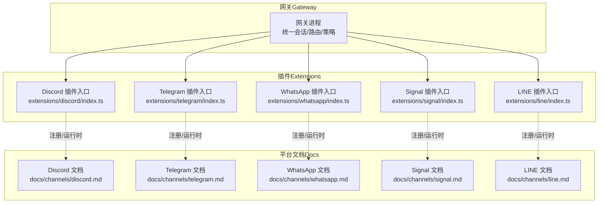
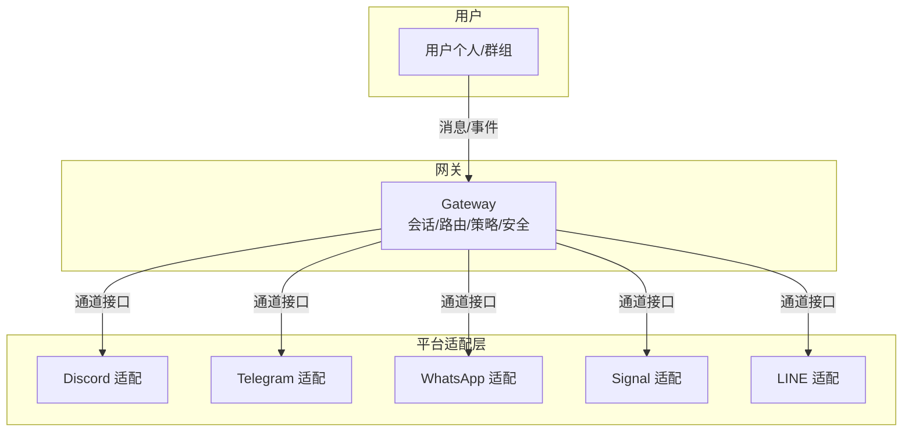
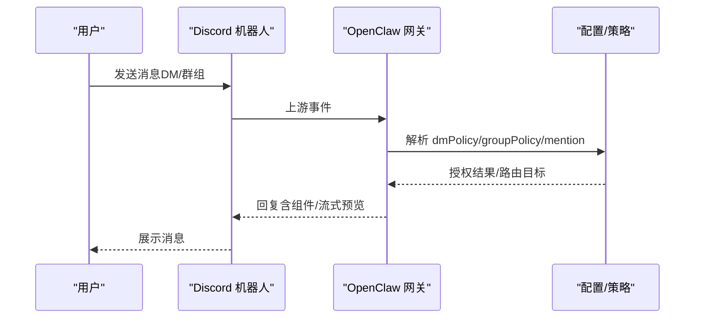
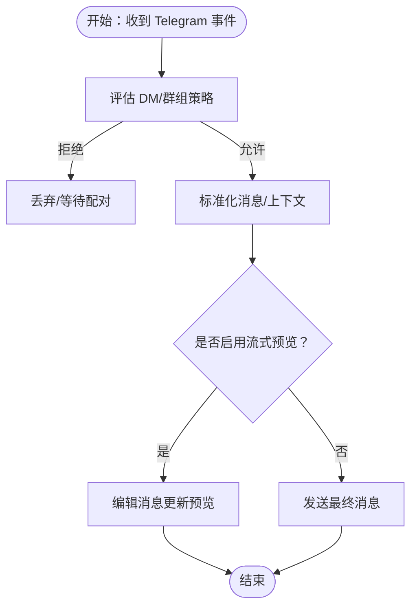
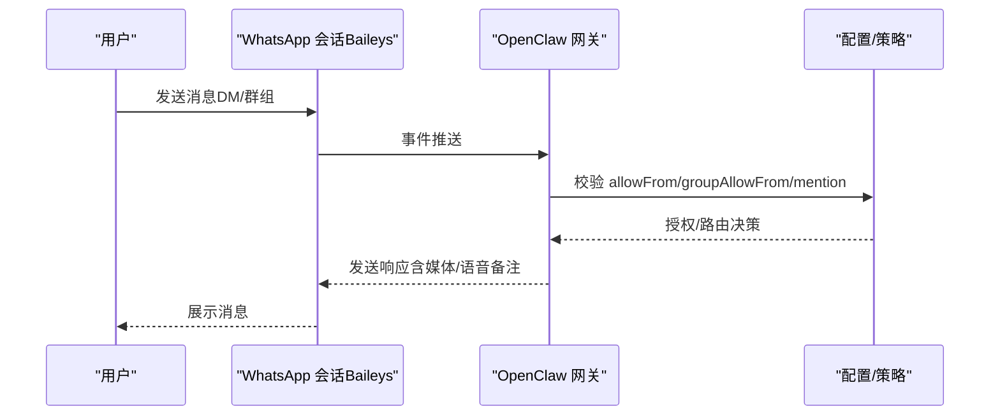
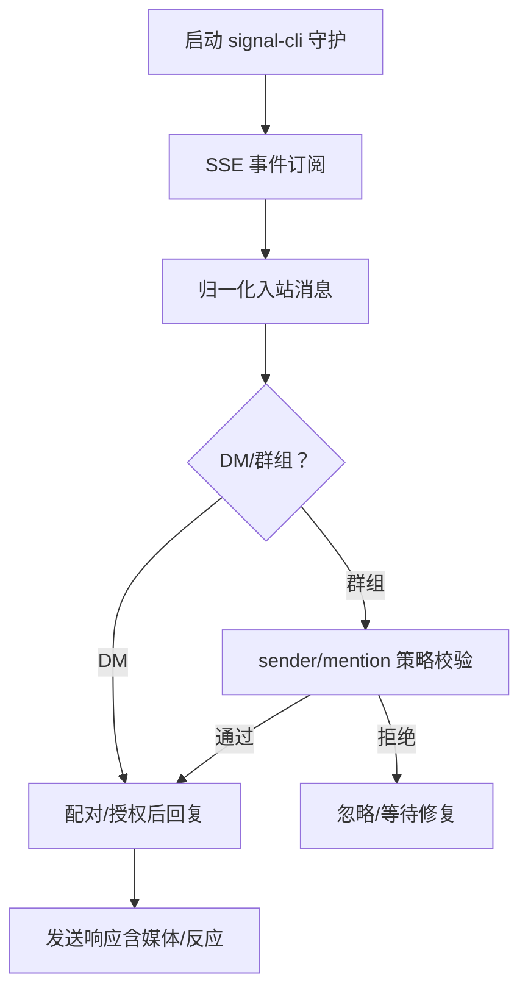
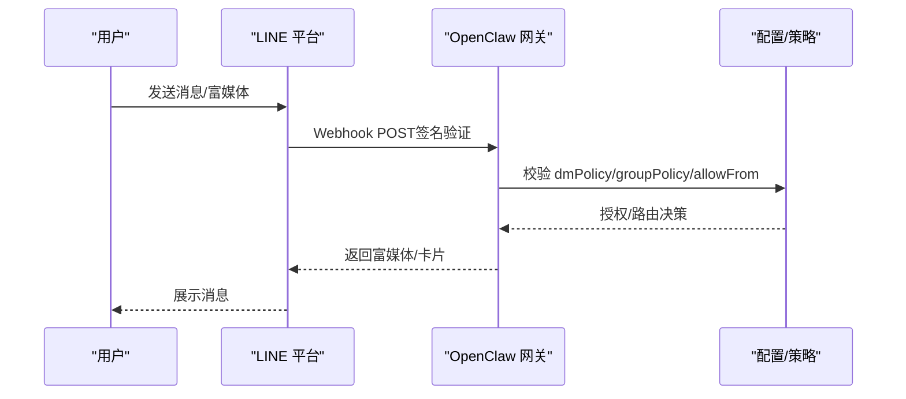
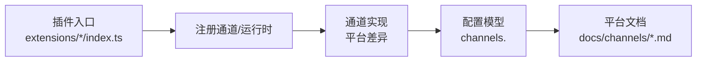

# 即时通讯平台

<cite>
**本文引用的文件**
- [docs/channels/discord.md](file://docs/channels/discord.md)
- [docs/channels/telegram.md](file://docs/channels/telegram.md)
- [docs/channels/whatsapp.md](file://docs/channels/whatsapp.md)
- [docs/channels/signal.md](file://docs/channels/signal.md)
- [docs/channels/line.md](file://docs/channels/line.md)
- [extensions/discord/index.ts](file://extensions/discord/index.ts)
- [extensions/telegram/index.ts](file://extensions/telegram/index.ts)
- [extensions/whatsapp/index.ts](file://extensions/whatsapp/index.ts)
- [extensions/signal/index.ts](file://extensions/signal/index.ts)
- [extensions/line/index.ts](file://extensions/line/index.ts)
- [docs/gateway/configuration.md](file://docs/gateway/configuration.md)
- [docs/channels/index.md](file://docs/channels/index.md)
</cite>

## 目录

1. [简介](#简介)
2. [项目结构](#项目结构)
3. [核心组件](#核心组件)
4. [架构总览](#架构总览)
5. [详细组件分析](#详细组件分析)
6. [依赖关系分析](#依赖关系分析)
7. [性能考量](#性能考量)
8. [故障排除指南](#故障排除指南)
9. [结论](#结论)
10. [附录](#附录)

## 简介

本文件面向在 OpenClaw 中集成即时通讯（IM）平台的工程师与运维人员，覆盖 Discord、Telegram、WhatsApp、Signal、LINE 等主流 IM 平台的完整配置步骤、认证与权限设置、消息路由规则、平台特性差异与限制、最佳实践以及新平台集成的开发模板与 API 参考。内容基于仓库内官方文档与插件入口实现，确保可操作性与一致性。

## 项目结构

OpenClaw 将各 IM 平台以“插件”形式注册到网关（Gateway），通过统一的通道（Channel）接口与平台交互。每个平台的文档位于 docs/channels 下，插件入口位于 extensions/<platform>/index.ts；配置与运行时行为由网关统一管理。

图表来源

- [extensions/discord/index.ts:1-20](file://extensions/discord/index.ts#L1-L20)
- [extensions/telegram/index.ts:1-18](file://extensions/telegram/index.ts#L1-L18)
- [extensions/whatsapp/index.ts:1-18](file://extensions/whatsapp/index.ts#L1-L18)
- [extensions/signal/index.ts:1-18](file://extensions/signal/index.ts#L1-L18)
- [extensions/line/index.ts:1-20](file://extensions/line/index.ts#L1-L20)
- [docs/channels/discord.md:1-1224](file://docs/channels/discord.md#L1-L1224)
- [docs/channels/telegram.md:1-975](file://docs/channels/telegram.md#L1-L975)
- [docs/channels/whatsapp.md:1-446](file://docs/channels/whatsapp.md#L1-L446)
- [docs/channels/signal.md:1-326](file://docs/channels/signal.md#L1-L326)
- [docs/channels/line.md:1-194](file://docs/channels/line.md#L1-L194)

章节来源

- [docs/channels/index.md:1-48](file://docs/channels/index.md#L1-L48)
- [docs/gateway/configuration.md:1-200](file://docs/gateway/configuration.md#L1-L200)

## 核心组件

- 插件注册：各平台插件在入口文件中注册通道与运行时，供网关加载。
- 配置模型：通过 channels.<platform> 统一声明接入参数、访问控制、会话与流式输出策略。
- 认证与令牌：不同平台采用不同凭据（如 Discord Bot Token、Telegram Bot Token、Signal 账号、LINE 令牌与密钥、WhatsApp 登录二维码）。
- 权限与路由：通过 dmPolicy/groupPolicy/allowFrom/groupAllowFrom 等字段控制 DM 与群组访问，并结合 mention 模式与线程绑定实现精细路由。
- 运行时特性：包括预览流式回复、媒体处理、反应通知、读回执、投票与富媒体卡片等。

章节来源

- [extensions/discord/index.ts:1-20](file://extensions/discord/index.ts#L1-L20)
- [extensions/telegram/index.ts:1-18](file://extensions/telegram/index.ts#L1-L18)
- [extensions/whatsapp/index.ts:1-18](file://extensions/whatsapp/index.ts#L1-L18)
- [extensions/signal/index.ts:1-18](file://extensions/signal/index.ts#L1-L18)
- [extensions/line/index.ts:1-20](file://extensions/line/index.ts#L1-L20)
- [docs/gateway/configuration.md:74-200](file://docs/gateway/configuration.md#L74-L200)

## 架构总览

下图展示 OpenClaw 在 IM 平台上的整体架构：网关负责连接、会话与策略，插件封装平台差异，文档定义配置与行为。

图表来源

- [docs/channels/discord.md:255-263](file://docs/channels/discord.md#L255-L263)
- [docs/channels/telegram.md:248-257](file://docs/channels/telegram.md#L248-L257)
- [docs/channels/whatsapp.md:126-133](file://docs/channels/whatsapp.md#L126-L133)
- [docs/channels/signal.md:55-60](file://docs/channels/signal.md#L55-L60)
- [docs/channels/line.md:10-19](file://docs/channels/line.md#L10-L19)

## 详细组件分析

### Discord 集成

- 认证与权限
  - 通过 Discord 开发者门户创建应用与机器人，启用“消息内容意图”“服务器成员意图”，生成 Bot Token。
  - 使用邀请 URL 添加机器人至服务器，授予必要权限（查看频道、发送消息、读取历史、嵌入链接、附件等）。
  - 启用开发者模式复制服务器/用户 ID，用于允许列表与配对。
  - DM 默认配对模式；可通过 allowFrom 限定来源；群组默认需要 @ 提及，可通过 requireMention 控制。
- 配置要点
  - channels.discord.enabled/token/groupPolicy/guilds.allowFrom/users/roles 等。
  - 支持 Slash 命令、组件容器（按钮/选择/模态）、文件上传与媒体画廊。
  - 流式预览支持 partial/block，文本块大小与断句策略可调。
- 路由与会话
  - DM 共享主会话或按通道/用户隔离；群组通道独立会话键；论坛主题自动创建线程。
  - 线程绑定支持持久化 ACP 会话与临时聚焦。
- 故障排除
  - 未启用消息内容意图导致无法解析消息；未授予 bot 权限导致无法读取历史或发送；未开启 DM 允许导致配对失败。
  - 使用 openclaw pairing list/approve 完成首次配对；检查 intents 与权限。

图表来源

- [docs/channels/discord.md:36-106](file://docs/channels/discord.md#L36-L106)
- [docs/channels/discord.md:369-461](file://docs/channels/discord.md#L369-L461)
- [docs/channels/discord.md:554-800](file://docs/channels/discord.md#L554-L800)

章节来源

- [docs/channels/discord.md:1-1224](file://docs/channels/discord.md#L1-L1224)
- [extensions/discord/index.ts:1-20](file://extensions/discord/index.ts#L1-L20)

### Telegram 集成

- 认证与权限
  - 通过 BotFather 创建机器人并获取 Token；默认 DM 策略为配对；可切换 allowlist/open/disabled。
  - 群组可见性受隐私模式影响，需在 BotFather 中关闭隐私或赋予管理员权限。
  - 支持自定义命令菜单；长轮询为默认模式，可选 webhook（需设置 webhookUrl/secret/path/host/port）。
- 配置要点
  - channels.telegram.botToken/dmPolicy/groups.requireMention/customCommands 等。
  - 流式预览支持 partial；HTML 解析与链接预览可配置；支持富文本与 inline 键盘。
  - 群组话题（Forum）支持独立会话键与持久化 ACP 绑定。
- 路由与会话
  - DM 与群组隔离会话；带 thread_id 的 DM 保持线程感知；群组话题继承配置。
- 故障排除
  - setMyCommands 失败通常因出站 DNS/HTTPS 被阻断；确认 webhook URL 与 secret 匹配；检查群组权限与隐私模式。

图表来源

- [docs/channels/telegram.md:105-246](file://docs/channels/telegram.md#L105-L246)
- [docs/channels/telegram.md:258-352](file://docs/channels/telegram.md#L258-L352)
- [docs/channels/telegram.md:420-568](file://docs/channels/telegram.md#L420-L568)

章节来源

- [docs/channels/telegram.md:1-975](file://docs/channels/telegram.md#L1-L975)
- [extensions/telegram/index.ts:1-18](file://extensions/telegram/index.ts#L1-L18)

### WhatsApp 集成

- 认证与权限
  - 通过 QR 登录与 Baileys 建立会话；推荐使用独立号码；支持个人号回退模式与 self-chat 保护。
  - DM 默认配对；群组默认 allowlist；mention 检测支持正则与回复引用。
- 配置要点
  - channels.whatsapp.dmPolicy/groupPolicy/groupAllowFrom/historyLimit/mediaMaxMb 等。
  - 支持语音备注、GIF 播放、多媒体分段与首图标题；自适应图片优化。
  - ackReaction 支持直接/群组提及策略；读回执默认开启。
- 路由与会话
  - DM 与群组隔离；群组未触发前的消息缓冲注入上下文；状态/广播聊天忽略。
- 故障排除
  - 未登录/断连：执行 openclaw channels login/status；重连循环：doctor 日志排查；无活动监听：确保网关运行且账户已登录。

图表来源

- [docs/channels/whatsapp.md:134-200](file://docs/channels/whatsapp.md#L134-L200)
- [docs/channels/whatsapp.md:292-316](file://docs/channels/whatsapp.md#L292-L316)
- [docs/channels/whatsapp.md:366-373](file://docs/channels/whatsapp.md#L366-L373)

章节来源

- [docs/channels/whatsapp.md:1-446](file://docs/channels/whatsapp.md#L1-L446)
- [extensions/whatsapp/index.ts:1-18](file://extensions/whatsapp/index.ts#L1-L18)

### Signal 集成

- 认证与权限
  - 通过 signal-cli 与本地守护进程通信；支持 QR 链接现有账号或短信注册专用号码。
  - DM 默认配对；群组默认 allowlist；支持 UUID/号码白名单。
- 配置要点
  - channels.signal.account/cliPath/httpUrl/autoStart/startupTimeoutMs/receiveMode 等。
  - 文本分片与换行优先；媒体上限可配置；支持忽略附件下载；读回执仅 DM。
  - 反应工具支持；群组反应需指定作者；支持 typing 指示刷新。
- 路由与会话
  - DM 共享主会话；群组隔离；群组历史上下文可配置。
- 故障排除
  - 守护不可达/无回复：核对 account/httpUrl 与接收模式；DM 被忽略：待批准配对；群组被拒：检查 sender/mention 策略。

图表来源

- [docs/channels/signal.md:165-181](file://docs/channels/signal.md#L165-L181)
- [docs/channels/signal.md:182-227](file://docs/channels/signal.md#L182-L227)
- [docs/channels/signal.md:200-221](file://docs/channels/signal.md#L200-L221)

章节来源

- [docs/channels/signal.md:1-326](file://docs/channels/signal.md#L1-L326)
- [extensions/signal/index.ts:1-18](file://extensions/signal/index.ts#L1-L18)

### LINE 集成

- 认证与权限
  - 通过 LINE Developers 控制台创建 Messaging API 渠道，获取 Channel Access Token 与 Channel Secret。
  - 启用 Webhook，设置 HTTPS 回调地址；签名验证依赖请求体（HMAC）。
- 配置要点
  - channels.line.enabled/channelAccessToken/channelSecret/dmPolicy/webhookPath 等。
  - 支持快速回复、位置、Flex 卡片、模板消息；文本分片 5000 字符；媒体上限 10MB。
  - 多账户支持；ID 区分大小写（U/C/R 32 十六进制）。
- 路由与会话
  - DM 默认配对；群组/房间允许列表；不支持反应与线程。
- 故障排除
  - Webhook 验证失败：确认 HTTPS 与 Channel Secret；媒体下载错误：提高 mediaMaxMb。

图表来源

- [docs/channels/line.md:34-76](file://docs/channels/line.md#L34-L76)
- [docs/channels/line.md:110-128](file://docs/channels/line.md#L110-L128)
- [docs/channels/line.md:135-178](file://docs/channels/line.md#L135-L178)

章节来源

- [docs/channels/line.md:1-194](file://docs/channels/line.md#L1-L194)
- [extensions/line/index.ts:1-20](file://extensions/line/index.ts#L1-L20)

## 依赖关系分析

- 插件与网关：各平台插件在入口文件中注册通道与运行时，依赖网关提供的插件 SDK。
- 配置与策略：所有平台共享 channels.<platform> 配置命名空间，遵循统一的 DM/群组策略与会话模型。
- 文档与实现：平台文档详细说明了认证流程、权限要求、路由规则与故障排除，与插件实现一一对应。

图表来源

- [extensions/discord/index.ts:1-20](file://extensions/discord/index.ts#L1-L20)
- [extensions/telegram/index.ts:1-18](file://extensions/telegram/index.ts#L1-L18)
- [extensions/whatsapp/index.ts:1-18](file://extensions/whatsapp/index.ts#L1-L18)
- [extensions/signal/index.ts:1-18](file://extensions/signal/index.ts#L1-L18)
- [extensions/line/index.ts:1-20](file://extensions/line/index.ts#L1-L20)
- [docs/channels/discord.md:1-1224](file://docs/channels/discord.md#L1-L1224)
- [docs/channels/telegram.md:1-975](file://docs/channels/telegram.md#L1-L975)
- [docs/channels/whatsapp.md:1-446](file://docs/channels/whatsapp.md#L1-L446)
- [docs/channels/signal.md:1-326](file://docs/channels/signal.md#L1-L326)
- [docs/channels/line.md:1-194](file://docs/channels/line.md#L1-L194)

章节来源

- [docs/gateway/configuration.md:74-200](file://docs/gateway/configuration.md#L74-L200)
- [docs/channels/index.md:1-48](file://docs/channels/index.md#L1-L48)

## 性能考量

- 流式预览：Discord/Telegram 支持实时编辑消息以降低往返延迟；Signal/WhatsApp/LINE 采用缓冲与分片策略。
- 媒体处理：各平台对媒体大小与格式有限制，建议启用自动优化与分片；忽略附件可减少资源消耗。
- 会话隔离：群组/话题/线程隔离提升并发能力，但需注意历史上下文注入的成本。
- 网络与超时：合理设置超时与重试（如 Telegram 的 timeoutSeconds、Signal 的 startupTimeoutMs），避免阻塞。

## 故障排除指南

- 通用诊断
  - openclaw status/gateway status/logs --follow/doctor/channels status --probe
  - 配置校验失败：openclaw doctor --fix
- 平台特定
  - Discord：未启用消息内容意图/权限不足；未开启 DM 允许；配对码过期。
  - Telegram：setMyCommands 失败（DNS/HTTPS 被阻）；隐私模式导致群组消息不可见；webhook URL/secret 不匹配。
  - WhatsApp：未登录/断连；无活动监听；群组策略/mention 未满足；Bun 运行时不兼容。
  - Signal：守护不可达；DM 被忽略（待配对）；群组被拒；注册/验证码流程失败。
  - LINE：Webhook 验证失败；媒体下载错误；ID 大小写不一致。

章节来源

- [docs/channels/discord.md:169-172](file://docs/channels/discord.md#L169-L172)
- [docs/channels/telegram.md:338-341](file://docs/channels/telegram.md#L338-L341)
- [docs/channels/whatsapp.md:374-424](file://docs/channels/whatsapp.md#L374-L424)
- [docs/channels/signal.md:251-286](file://docs/channels/signal.md#L251-L286)
- [docs/channels/line.md:186-194](file://docs/channels/line.md#L186-L194)

## 结论

OpenClaw 对主流 IM 平台提供了统一的通道抽象与一致的配置体验。通过插件化架构与详尽的平台文档，用户可以快速完成认证、权限与路由配置，并根据平台特性选择合适的流式预览、富媒体与线程绑定策略。建议在生产环境优先采用配对/allowlist 策略，结合会话隔离与历史上下文注入，平衡安全性与可用性。

## 附录

### 新 IM 平台集成开发模板与 API 参考

- 插件入口模板
  - 在 extensions/<platform>/index.ts 中导出插件对象，注册通道与运行时。
  - 参考现有平台入口文件结构与类型约束。
- 通道接口
  - 通道插件需实现注册函数，向网关暴露通道能力与运行时配置。
- 配置参考
  - 所有平台共享 channels.<platform> 命名空间；常见字段包括 enabled、dmPolicy、groupPolicy、allowFrom、groupAllowFrom、流式与媒体限制等。
  - 参考“配置”文档中的通用任务与通道页面中的平台特定字段说明。

章节来源

- [extensions/discord/index.ts:1-20](file://extensions/discord/index.ts#L1-L20)
- [extensions/telegram/index.ts:1-18](file://extensions/telegram/index.ts#L1-L18)
- [extensions/whatsapp/index.ts:1-18](file://extensions/whatsapp/index.ts#L1-L18)
- [extensions/signal/index.ts:1-18](file://extensions/signal/index.ts#L1-L18)
- [extensions/line/index.ts:1-20](file://extensions/line/index.ts#L1-L20)
- [docs/gateway/configuration.md:74-200](file://docs/gateway/configuration.md#L74-L200)
