# 平台集成开发指南

<cite>
**本文档引用的文件**
- [README.md](file://README.md)
- [index.ts](file://src/plugin-sdk/index.ts)
- [types.plugin.ts](file://src/channels/plugins/types.plugin.ts)
- [types.ts](file://src/channels/plugins/types.ts)
- [types.adapters.ts](file://src/channels/plugins/types.adapters.ts)
- [types.core.ts](file://src/channels/plugins/types.core.ts)
- [openclaw.plugin.json](file://extensions/discord/openclaw.plugin.json)
- [index.ts](file://extensions/discord/index.ts)
- [channel.ts](file://extensions/discord/src/channel.ts)
- [types.ts](file://src/plugins/types.ts)
</cite>

## 目录

1. [简介](#简介)
2. [项目结构](#项目结构)
3. [核心组件](#核心组件)
4. [架构概览](#架构概览)
5. [详细组件分析](#详细组件分析)
6. [依赖关系分析](#依赖关系分析)
7. [性能考虑](#性能考虑)
8. [故障排除指南](#故障排除指南)
9. [结论](#结论)

## 简介

OpenClaw是一个个人AI助手平台，支持多种消息平台集成。本指南专注于为开发者提供完整的平台集成开发指南，详细介绍如何开发新的消息平台插件，包括插件架构设计、接口实现和测试方法。

OpenClaw平台的核心特点：

- 支持多种消息平台：WhatsApp、Telegram、Slack、Discord、Google Chat、Signal等
- 基于WebSocket的网关控制平面
- 模块化的插件架构
- 完整的安全模型和权限管理
- 多代理路由和会话管理

## 项目结构

OpenClaw项目的整体架构采用模块化设计，主要分为以下几个核心部分：

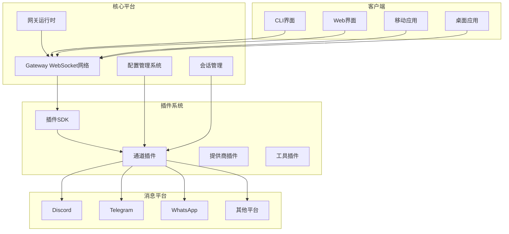

**图表来源**

- [README.md:185-202](file://README.md#L185-L202)
- [index.ts:1-800](file://src/plugin-sdk/index.ts#L1-L800)

**章节来源**

- [README.md:1-545](file://README.md#L1-L545)

## 核心组件

### 插件SDK架构

OpenClaw的插件系统基于统一的SDK架构，提供了完整的插件开发框架：

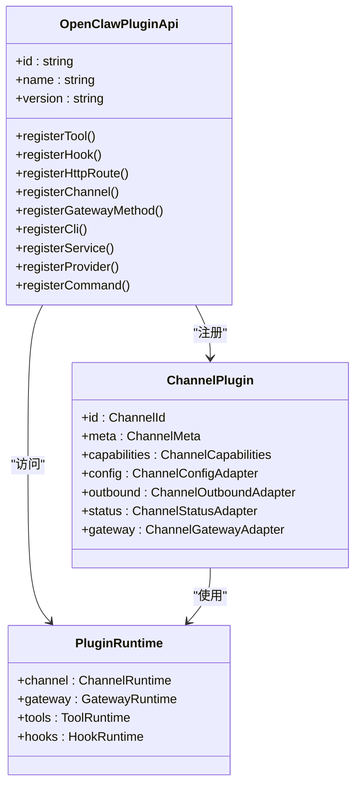

**图表来源**

- [types.plugin.ts:49-85](file://src/channels/plugins/types.plugin.ts#L49-L85)
- [types.ts:263-306](file://src/plugins/types.ts#L263-L306)
- [index.ts:113-124](file://src/plugin-sdk/index.ts#L113-L124)

### 通道插件接口

通道插件是OpenClaw中最核心的组件，定义了与不同消息平台交互的标准接口：

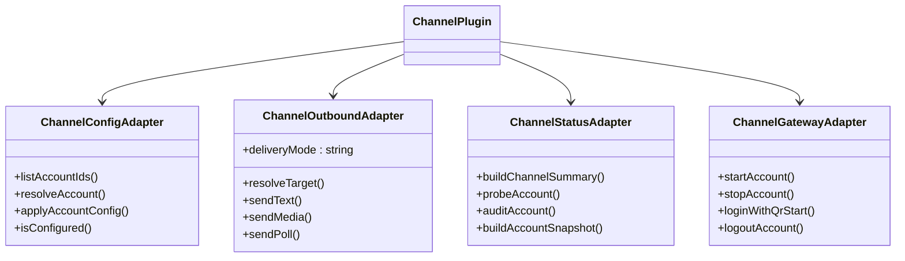

**图表来源**

- [types.adapters.ts:52-166](file://src/channels/plugins/types.adapters.ts#L52-L166)
- [types.adapters.ts:275-289](file://src/channels/plugins/types.adapters.ts#L275-L289)

**章节来源**

- [types.plugin.ts:1-86](file://src/channels/plugins/types.plugin.ts#L1-L86)
- [types.adapters.ts:1-384](file://src/channels/plugins/types.adapters.ts#L1-L384)
- [types.core.ts:1-403](file://src/channels/plugins/types.core.ts#L1-L403)

## 架构概览

OpenClaw平台采用分层架构设计，确保了良好的可扩展性和维护性：

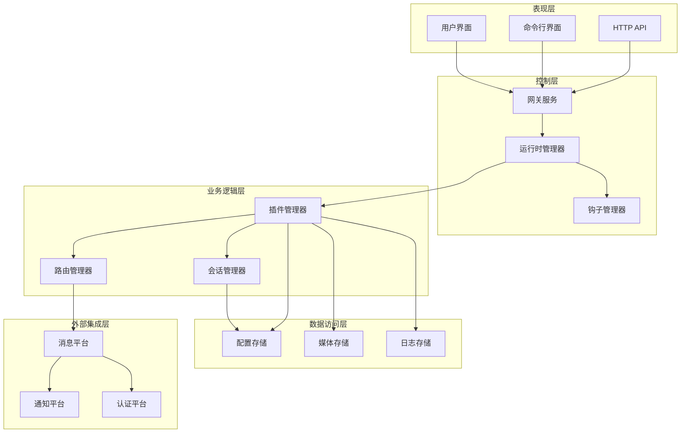

**图表来源**

- [README.md:185-202](file://README.md#L185-L202)

## 详细组件分析

### Discord插件实现分析

以Discord插件为例，展示完整的插件开发流程：

#### 插件注册流程

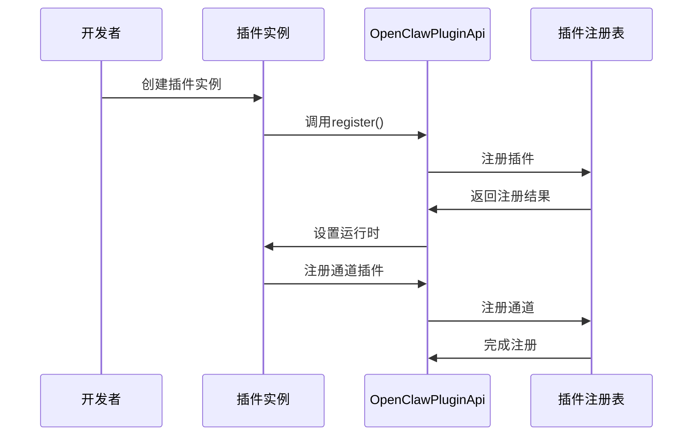

**图表来源**

- [index.ts:12-16](file://extensions/discord/index.ts#L12-L16)

#### 插件配置架构

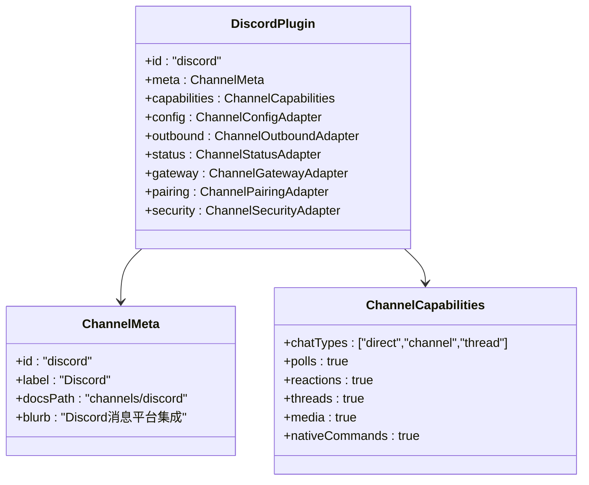

**图表来源**

- [channel.ts:74-101](file://extensions/discord/src/channel.ts#L74-L101)

#### 配置管理实现

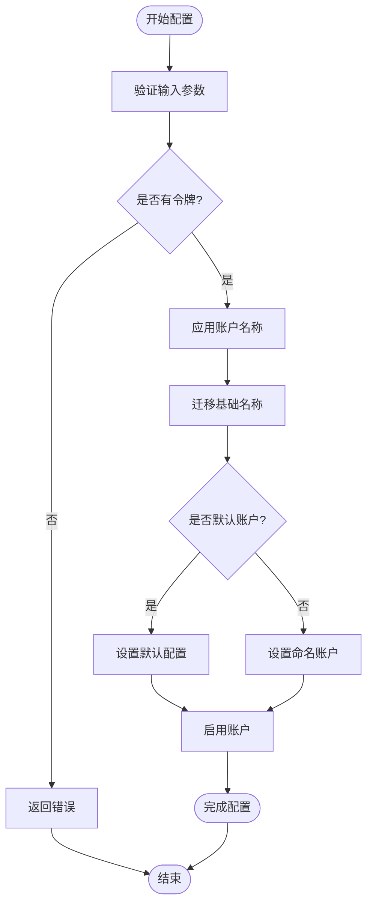

**图表来源**

- [channel.ts:231-295](file://extensions/discord/src/channel.ts#L231-L295)

**章节来源**

- [index.ts:1-800](file://src/plugin-sdk/index.ts#L1-L800)
- [openclaw.plugin.json:1-10](file://extensions/discord/openclaw.plugin.json#L1-L10)
- [index.ts:1-20](file://extensions/discord/index.ts#L1-L20)
- [channel.ts:1-463](file://extensions/discord/src/channel.ts#L1-L463)

### 插件开发标准模板

#### 基础插件模板

```typescript
// 基础插件结构
const basePlugin: ChannelPlugin = {
  id: "your-platform",
  meta: {
    id: "your-platform",
    label: "Your Platform",
    docsPath: "channels/your-platform",
    blurb: "Your platform integration",
  },
  capabilities: {
    chatTypes: ["direct", "channel"],
    media: true,
    threads: false,
  },
  config: {
    // 配置适配器实现
  },
  outbound: {
    // 出站消息适配器实现
  },
  status: {
    // 状态适配器实现
  },
  gateway: {
    // 网关适配器实现
  },
};
```

#### 认证流程实现

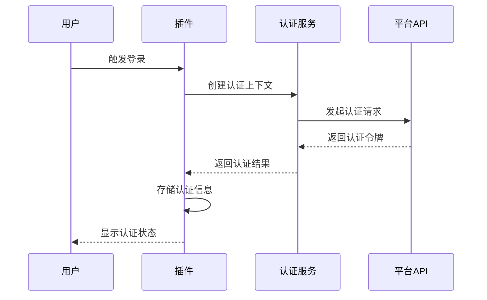

**图表来源**

- [types.adapters.ts:291-299](file://src/channels/plugins/types.adapters.ts#L291-L299)

#### 消息路由机制

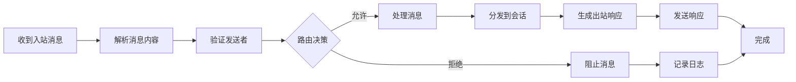

**图表来源**

- [types.core.ts:168-179](file://src/channels/plugins/types.core.ts#L168-L179)

**章节来源**

- [types.adapters.ts:1-384](file://src/channels/plugins/types.adapters.ts#L1-L384)
- [types.core.ts:1-403](file://src/channels/plugins/types.core.ts#L1-L403)

## 依赖关系分析

### 插件系统依赖图

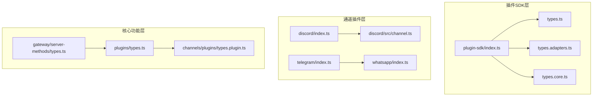

**图表来源**

- [index.ts:1-800](file://src/plugin-sdk/index.ts#L1-L800)
- [types.ts:1-800](file://src/plugins/types.ts#L1-L800)

### 组件耦合度分析

OpenClaw插件系统具有以下特点：

1. **低耦合设计**：每个插件独立运行，通过标准化接口通信
2. **高内聚特性**：插件内部功能紧密相关，职责单一明确
3. **可扩展性**：新插件可以无缝集成到现有系统中
4. **可维护性**：清晰的接口定义便于维护和升级

**章节来源**

- [index.ts:1-800](file://src/plugin-sdk/index.ts#L1-L800)
- [types.plugin.ts:1-86](file://src/channels/plugins/types.plugin.ts#L1-L86)

## 性能考虑

### 插件性能优化策略

1. **异步处理**：所有插件操作应使用异步模式，避免阻塞主线程
2. **连接池管理**：合理管理第三方API连接，复用连接减少开销
3. **缓存机制**：实现适当的缓存策略，减少重复查询
4. **批量处理**：支持批量操作，提高处理效率

### 内存管理最佳实践

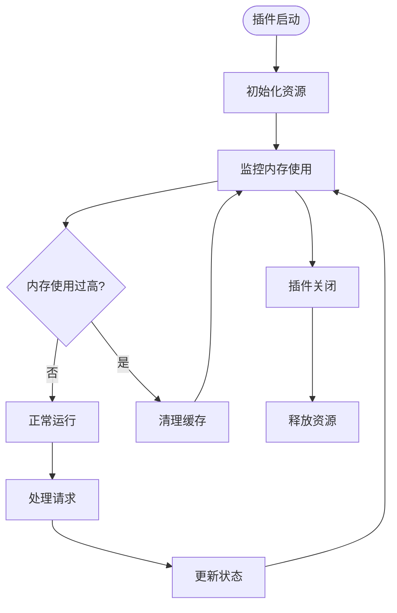

## 故障排除指南

### 常见问题诊断

1. **插件注册失败**
   - 检查插件ID唯一性
   - 验证接口实现完整性
   - 确认依赖项正确安装

2. **认证问题**
   - 验证凭据格式正确
   - 检查网络连接状态
   - 确认API权限配置

3. **消息路由错误**
   - 检查目标ID格式
   - 验证权限配置
   - 确认会话状态

### 调试工具使用

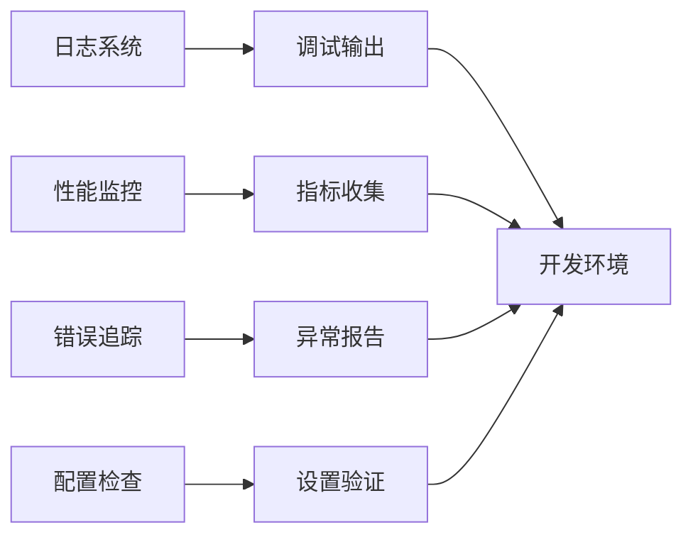

**章节来源**

- [README.md:442-448](file://README.md#L442-L448)

## 结论

OpenClaw平台为开发者提供了完整的消息平台插件开发框架。通过遵循本文档的指导原则和最佳实践，开发者可以快速构建稳定、高效的插件集成。

关键成功因素：

- 严格遵循插件接口规范
- 实现完善的错误处理机制
- 重视性能优化和资源管理
- 提供清晰的文档和示例
- 进行充分的测试验证

随着OpenClaw生态系统的不断发展，这些开发指南将帮助构建更加丰富和强大的消息平台集成解决方案。
