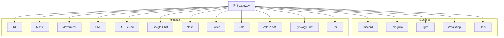
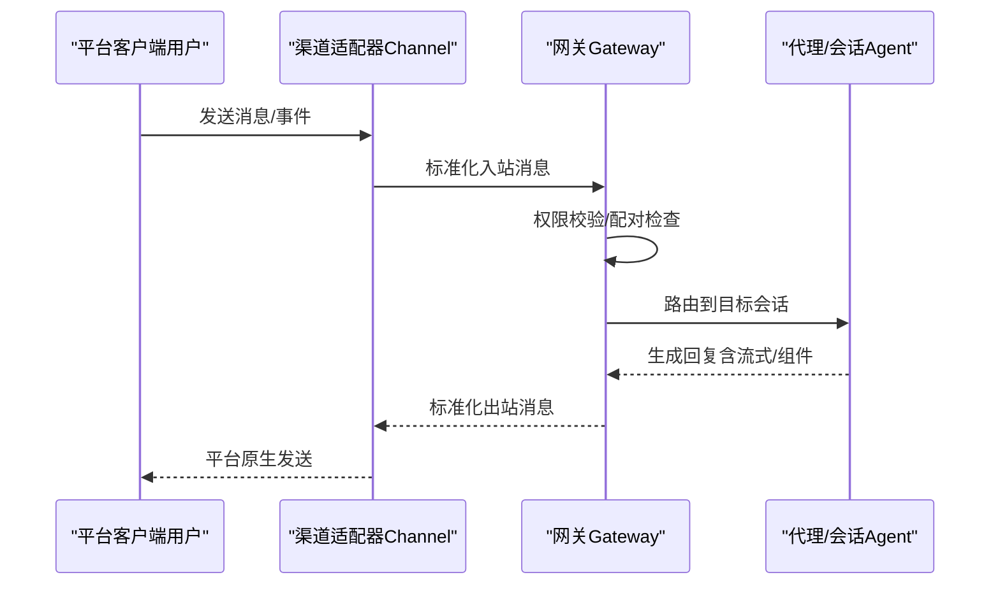
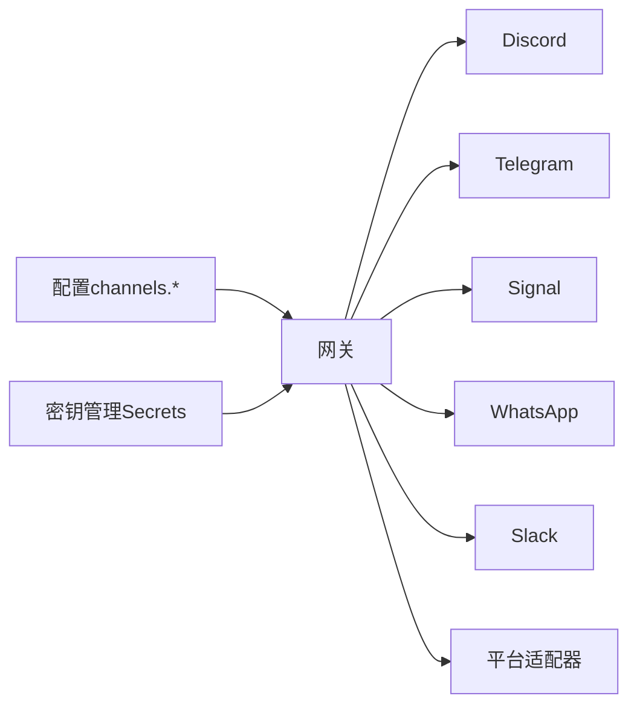

# 消息平台集成

<cite>
**本文档引用的文件**
- [docs/channels/index.md](file://docs/channels/index.md)
- [docs/channels/discord.md](file://docs/channels/discord.md)
- [docs/channels/telegram.md](file://docs/channels/telegram.md)
- [docs/channels/signal.md](file://docs/channels/signal.md)
- [docs/channels/whatsapp.md](file://docs/channels/whatsapp.md)
- [docs/channels/slack.md](file://docs/channels/slack.md)
- [docs/channels/irc.md](file://docs/channels/irc.md)
- [docs/channels/matrix.md](file://docs/channels/matrix.md)
- [docs/channels/mattermost.md](file://docs/channels/mattermost.md)
- [docs/channels/line.md](file://docs/channels/line.md)
- [docs/channels/feishu.md](file://docs/channels/feishu.md)
- [docs/channels/googlechat.md](file://docs/channels/googlechat.md)
- [docs/channels/nostr.md](file://docs/channels/nostr.md)
- [docs/channels/twitch.md](file://docs/channels/twitch.md)
- [docs/channels/zalo.md](file://docs/channels/zalo.md)
- [docs/channels/zalouser.md](file://docs/channels/zalouser.md)
- [docs/channels/synology-chat.md](file://docs/channels/synology-chat.md)
- [docs/channels/tlon.md](file://docs/channels/tlon.md)
</cite>

## 目录

1. [简介](#简介)
2. [项目结构](#项目结构)
3. [核心组件](#核心组件)
4. [架构总览](#架构总览)
5. [详细组件分析](#详细组件分析)
6. [依赖关系分析](#依赖关系分析)
7. [性能考量](#性能考量)
8. [故障排除指南](#故障排除指南)
9. [结论](#结论)
10. [附录](#附录)

## 简介

本文件面向OpenClaw支持的各类消息平台，提供端到端的集成指南与最佳实践。内容覆盖20+平台（Discord、Telegram、WhatsApp、Slack、Signal、IRC、Matrix、Mattermost、LINE、飞书（Feishu）、Google Chat、Nostr、Twitch、Zalo、Zalo个人版、Synology Chat、Tlon），涵盖认证配置、权限与访问控制、高级选项、故障排除、功能差异与限制，并给出新平台接入的开发模板与API参考。

## 项目结构

OpenClaw通过“网关（Gateway）+ 渠道（Channel）”架构实现多平台消息集成。各平台以插件或内置通道形式存在，统一由网关负责连接、路由与会话管理。渠道文档集中于docs/channels目录，每种平台有独立的说明页，包含快速设置、认证、访问控制、特性与限制、排障等。

图表来源

- [docs/channels/index.md:14-37](file://docs/channels/index.md#L14-L37)

章节来源

- [docs/channels/index.md:1-48](file://docs/channels/index.md#L1-L48)

## 核心组件

- 网关（Gateway）
  - 统一持有各平台连接，负责消息收发、会话路由、权限校验与安全策略执行。
  - 支持多账户、多账号模式，按平台特性提供令牌解析、环境变量回退与密钥管理。
- 渠道（Channel）
  - 各平台适配器，封装平台API、事件订阅、消息格式化与限流策略。
  - 提供统一的配置模型：dmPolicy/groupPolicy、allowFrom/groupAllowFrom、历史上下文、流式预览、动作工具等。
- 访问控制与配对（Pairing）
  - 大多数平台默认DM采用“配对”模式，首次交互生成一次性配对码，批准后方可通信。
  - 部分平台支持“允许清单”（allowlist）或“开放”模式，需显式配置。
- 会话与路由
  - DM会话通常共享主会话；群组/频道会话隔离，支持线程绑定、持久化会话与跨平台一致的会话键命名规则。

章节来源

- [docs/channels/discord.md:255-262](file://docs/channels/discord.md#L255-L262)
- [docs/channels/telegram.md:248-257](file://docs/channels/telegram.md#L248-L257)
- [docs/channels/signal.md:59-60](file://docs/channels/signal.md#L59-L60)
- [docs/channels/whatsapp.md:126-133](file://docs/channels/whatsapp.md#L126-L133)
- [docs/channels/slack.md:234-241](file://docs/channels/slack.md#L234-L241)

## 架构总览

下图展示OpenClaw在多平台上的通用集成路径：从平台侧触发事件（Webhook/长连接/CLI），经网关认证与鉴权，再路由到对应会话与代理，最终返回响应。

图表来源

- [docs/channels/discord.md:255-262](file://docs/channels/discord.md#L255-L262)
- [docs/channels/telegram.md:248-257](file://docs/channels/telegram.md#L248-L257)
- [docs/channels/signal.md:200-205](file://docs/channels/signal.md#L200-L205)
- [docs/channels/whatsapp.md:126-133](file://docs/channels/whatsapp.md#L126-L133)
- [docs/channels/slack.md:234-241](file://docs/channels/slack.md#L234-L241)

## 详细组件分析

### Discord（官方Bot API）

- 快速开始
  - 在开发者门户创建应用与机器人，启用“特权网关意图”（消息内容、服务器成员、在线状态），生成Bot Token。
  - 通过OAuth URL生成器添加机器人至服务器，授予必要权限。
  - 开启开发者模式复制服务器/用户ID，完成配对与允许列表配置。
- 认证与令牌
  - 支持配置文件与环境变量回退；默认账户使用DISCORD_BOT_TOKEN。
  - 高级调用可使用显式令牌覆盖默认账户策略。
- 访问控制
  - DM策略：pairing（默认）、allowlist、open、disabled。
  - 群组策略：open、allowlist、disabled；支持按服务器/频道粒度配置requireMention、角色/用户白名单。
- 会话与线程
  - DM共享主会话；群组频道隔离；论坛主题自动创建线程。
  - 支持交互式组件（按钮/选择/模态）与“回复标签”。
- 流式预览与媒体
  - 支持partial/block流式预览；媒体附件通过上传API处理。
- 故障排除
  - 关注意图未启用、权限不足、配对码过期、群组策略阻断等问题。

章节来源

- [docs/channels/discord.md:24-172](file://docs/channels/discord.md#L24-L172)
- [docs/channels/discord.md:174-251](file://docs/channels/discord.md#L174-L251)
- [docs/channels/discord.md:255-367](file://docs/channels/discord.md#L255-L367)
- [docs/channels/discord.md:369-487](file://docs/channels/discord.md#L369-L487)
- [docs/channels/discord.md:489-554](file://docs/channels/discord.md#L489-L554)

### Telegram（Bot API + grammY）

- 快速开始
  - 通过@BotFather创建机器人，获取Token；在配置中启用并设置DM策略与群组策略。
  - 通过配对流程批准首个DM；如需群组，添加机器人并配置groupAllowFrom。
- 认证与令牌
  - 支持配置文件与TELEGRAM_BOT_TOKEN环境变量（仅默认账户）。
- 访问控制
  - DM策略：pairing（默认）、allowlist、open、disabled。
  - 群组策略：open、allowlist（默认）、disabled；支持按群组粒度requireMention与允许用户列表。
- 功能特性
  - 实时流式预览（partial）；HTML解析与链接预览；内联按钮与自定义命令菜单。
  - 论坛主题与话题隔离；视频/语音消息；贴纸缓存与搜索。
  - 反应通知与确认反应；配置写入开关。
- 长轮询与Webhook
  - 默认长轮询；可选Webhook，需设置URL、密钥与监听地址。
- 故障排除
  - 常见问题：隐私模式导致消息不可见、Webhook失败、长轮询DNS受限。

章节来源

- [docs/channels/telegram.md:24-73](file://docs/channels/telegram.md#L24-L73)
- [docs/channels/telegram.md:75-103](file://docs/channels/telegram.md#L75-L103)
- [docs/channels/telegram.md:105-246](file://docs/channels/telegram.md#L105-L246)
- [docs/channels/telegram.md:248-329](file://docs/channels/telegram.md#L248-L329)
- [docs/channels/telegram.md:331-418](file://docs/channels/telegram.md#L331-L418)
- [docs/channels/telegram.md:420-568](file://docs/channels/telegram.md#L420-L568)
- [docs/channels/telegram.md:570-707](file://docs/channels/telegram.md#L570-L707)
- [docs/channels/telegram.md:709-747](file://docs/channels/telegram.md#L709-L747)
- [docs/channels/telegram.md:749-790](file://docs/channels/telegram.md#L749-L790)

### Signal（signal-cli JSON-RPC + SSE）

- 快速开始
  - 使用独立号码或二维码链接现有账户；安装signal-cli并完成注册/链接；配置账户、CLI路径与DM策略。
- 数号模型
  - 网关连接的是“设备”（signal-cli账户）；建议使用独立机器人号码避免自对话环保护。
- 认证与令牌
  - 支持账户字段与外部HTTP服务模式（httpUrl）；可禁用自动启动与设置超时。
- 访问控制
  - DM策略：pairing（默认）、allowlist、open、disabled；支持UUID来源识别。
  - 群组策略：open、allowlist（默认）、disabled。
- 功能特性
  - 文本分片与换行优先；媒体下载与大小限制；读取回执转发；反应动作。
- 故障排除
  - 守护进程可达但无回复、DM被忽略、群组消息被阻断、配置验证错误。

章节来源

- [docs/channels/signal.md:20-44](file://docs/channels/signal.md#L20-L44)
- [docs/channels/signal.md:73-103](file://docs/channels/signal.md#L73-L103)
- [docs/channels/signal.md:182-243](file://docs/channels/signal.md#L182-L243)
- [docs/channels/signal.md:244-286](file://docs/channels/signal.md#L244-L286)
- [docs/channels/signal.md:287-326](file://docs/channels/signal.md#L287-L326)

### WhatsApp（Web通道 Baileys）

- 快速开始
  - 配置DM策略与群组策略；通过QR登录；启动网关并批准首次配对请求。
- 认证与令牌
  - 多账户凭据存储于~/.openclaw/credentials/whatsapp/<accountId>/；支持登出清理。
- 访问控制
  - DM策略：pairing（默认）、allowlist、open、disabled；支持自聊天保护（selfChatMode）。
  - 群组策略：open、allowlist（默认）、disabled；支持提及要求与发送者白名单。
- 功能特性
  - 文本分片与换行优先；媒体优化与首项回退；读取回执；确认反应。
- 故障排除
  - 未链接（需QR）、已链接但断连、发送时无活动监听、群组消息意外忽略。

章节来源

- [docs/channels/whatsapp.md:24-80](file://docs/channels/whatsapp.md#L24-L80)
- [docs/channels/whatsapp.md:82-124](file://docs/channels/whatsapp.md#L82-L124)
- [docs/channels/whatsapp.md:126-133](file://docs/channels/whatsapp.md#L126-L133)
- [docs/channels/whatsapp.md:134-200](file://docs/channels/whatsapp.md#L134-L200)
- [docs/channels/whatsapp.md:202-290](file://docs/channels/whatsapp.md#L202-L290)
- [docs/channels/whatsapp.md:292-316](file://docs/channels/whatsapp.md#L292-L316)
- [docs/channels/whatsapp.md:318-342](file://docs/channels/whatsapp.md#L318-L342)
- [docs/channels/whatsapp.md:343-364](file://docs/channels/whatsapp.md#L343-L364)
- [docs/channels/whatsapp.md:366-424](file://docs/channels/whatsapp.md#L366-L424)
- [docs/channels/whatsapp.md:426-446](file://docs/channels/whatsapp.md#L426-L446)

### Slack（Socket Mode + HTTP事件）

- 快速开始
  - Socket Mode：启用Socket Mode，创建App Token与Bot Token，订阅事件，启动网关。
  - HTTP事件：配置签名密钥与Webhook路径，确保唯一路径与可达性。
- 认证与令牌
  - 支持botToken + appToken（Socket）或botToken + signingSecret（HTTP）；环境变量回退仅默认账户。
  - 用户令牌（xoxp-...）可选，用于读取场景，默认只读。
- 访问控制
  - DM策略：pairing（默认）、allowlist、open、disabled；支持MPIM与群组DM。
  - 频道策略：open、allowlist（默认）、disabled；支持按频道requireMention与用户白名单。
- 功能特性
  - 原生Slash命令；线程会话与回复标签；块级动作与模态交互；打字指示与反应确认。
  - 文本分片与文件上传；媒体大小限制；事件迁移与配置写入。
- 故障排除
  - 无回复、DM被忽略、Socket未连接、HTTP未接收事件、原生命令未触发。

章节来源

- [docs/channels/slack.md:24-121](file://docs/channels/slack.md#L24-L121)
- [docs/channels/slack.md:123-134](file://docs/channels/slack.md#L123-L134)
- [docs/channels/slack.md:136-205](file://docs/channels/slack.md#L136-L205)
- [docs/channels/slack.md:207-232](file://docs/channels/slack.md#L207-L232)
- [docs/channels/slack.md:234-254](file://docs/channels/slack.md#L234-L254)
- [docs/channels/slack.md:256-282](file://docs/channels/slack.md#L256-L282)
- [docs/channels/slack.md:284-325](file://docs/channels/slack.md#L284-L325)
- [docs/channels/slack.md:326-338](file://docs/channels/slack.md#L326-L338)
- [docs/channels/slack.md:340-431](file://docs/channels/slack.md#L340-L431)
- [docs/channels/slack.md:433-489](file://docs/channels/slack.md#L433-L489)
- [docs/channels/slack.md:492-555](file://docs/channels/slack.md#L492-L555)

### IRC（经典IRC）

- 快速开始
  - 在配置中启用IRC，设置host/port/tls/nick与channels；启动网关。
- 访问控制
  - DM策略：pairing（默认）；群组策略：open、allowlist（默认）。
  - 允许发送者：全局groupAllowFrom或按频道groups["#channel"].allowFrom。
- 功能特性
  - 通道允许与发送者允许双门控；提及要求（requireMention）默认开启。
  - 支持工具按发送者差异化授权（toolsBySender）。
- 故障排除
  - 未回复：检查groupPolicy与mention gating；登录失败：核对昵称可用性与服务器密码。

章节来源

- [docs/channels/irc.md:13-37](file://docs/channels/irc.md#L13-L37)
- [docs/channels/irc.md:39-61](file://docs/channels/irc.md#L39-L61)
- [docs/channels/irc.md:63-111](file://docs/channels/irc.md#L63-L111)
- [docs/channels/irc.md:112-185](file://docs/channels/irc.md#L112-L185)
- [docs/channels/irc.md:187-242](file://docs/channels/irc.md#L187-L242)

### Matrix（插件）

- 快速开始
  - 安装Matrix插件；创建Matrix账户并获取访问令牌；配置homeserver与DM策略。
- 认证与令牌
  - 支持accessToken或userId/password；支持E2EE（需要加密模块）。
- 访问控制
  - DM策略：pairing（默认）；群组策略：open、allowlist（默认）。
  - 支持房间自动加入与邀请白名单；名称解析为ID（精确匹配）。
- 功能特性
  - 支持线程回复、富文本、媒体、贴纸、原生命令；E2EE加密与设备验证。
- 故障排除
  - 登录但房间被拒、DM被忽略、加密房间失败。

章节来源

- [docs/channels/matrix.md:18-37](file://docs/channels/matrix.md#L18-L37)
- [docs/channels/matrix.md:39-79](file://docs/channels/matrix.md#L39-L79)
- [docs/channels/matrix.md:111-137](file://docs/channels/matrix.md#L111-L137)
- [docs/channels/matrix.md:139-178](file://docs/channels/matrix.md#L139-L178)
- [docs/channels/matrix.md:180-233](file://docs/channels/matrix.md#L180-L233)
- [docs/channels/matrix.md:234-304](file://docs/channels/matrix.md#L234-L304)

### Mattermost（插件）

- 快速开始
  - 安装插件；创建Bot账户并复制Bot Token与Base URL；配置网关。
- 认证与令牌
  - 支持环境变量（默认账户）；多账户支持。
- 认证与令牌
  - DM策略：pairing（默认）；群组策略：open、allowlist（默认）。
  - 支持聊天模式（oncall/onmessage/onchar）与前缀触发。
- 功能特性
  - 原生命令（可选）；内联按钮（HMAC校验）；反应动作；目录适配器。
- 故障排除
  - 无回复、认证错误、多账户问题、按钮点击无效、HMAC校验失败。

章节来源

- [docs/channels/mattermost.md:15-34](file://docs/channels/mattermost.md#L15-L34)
- [docs/channels/mattermost.md:36-56](file://docs/channels/mattermost.md#L36-L56)
- [docs/channels/mattermost.md:58-96](file://docs/channels/mattermost.md#L58-L96)
- [docs/channels/mattermost.md:106-131](file://docs/channels/mattermost.md#L106-L131)
- [docs/channels/mattermost.md:132-146](file://docs/channels/mattermost.md#L132-L146)
- [docs/channels/mattermost.md:148-163](file://docs/channels/mattermost.md#L148-L163)
- [docs/channels/mattermost.md:165-183](file://docs/channels/mattermost.md#L165-L183)
- [docs/channels/mattermost.md:185-242](file://docs/channels/mattermost.md#L185-L242)
- [docs/channels/mattermost.md:243-370](file://docs/channels/mattermost.md#L243-L370)

### LINE（插件）

- 快速开始
  - 安装插件；在LINE开发者控制台创建Messaging API渠道，复制Channel Access Token与Channel Secret；配置Webhook URL。
- 认证与令牌
  - 支持环境变量与文件；多账户支持。
- 访问控制
  - DM策略：pairing（默认）；群组策略：open、allowlist（默认）。
- 功能特性
  - 文本分片（5000字符）；Markdown转Flex卡片；媒体下载上限；Rich消息（Quick Reply/Location/Flex/Template）。
- 故障排除
  - Webhook验证失败、无入站事件、媒体下载错误。

章节来源

- [docs/channels/line.md:20-33](file://docs/channels/line.md#L20-L33)
- [docs/channels/line.md:34-50](file://docs/channels/line.md#L34-L50)
- [docs/channels/line.md:55-70](file://docs/channels/line.md#L55-L70)
- [docs/channels/line.md:72-91](file://docs/channels/line.md#L72-L91)
- [docs/channels/line.md:110-127](file://docs/channels/line.md#L110-L127)
- [docs/channels/line.md:135-143](file://docs/channels/line.md#L135-L143)
- [docs/channels/line.md:144-185](file://docs/channels/line.md#L144-L185)
- [docs/channels/line.md:186-194](file://docs/channels/line.md#L186-L194)

### 飞书（Feishu，插件）

- 快速开始
  - 通过向导或CLI添加；创建企业应用，配置权限与事件订阅（im.message.receive_v1）；配置App ID/Secret与域名。
- 认证与令牌
  - 支持环境变量与多账户；支持WebSocket与Webhook两种事件传输模式。
- 访问控制
  - DM策略：pairing（默认）；群组策略：open（默认）、allowlist；支持@提及要求。
- 功能特性
  - 交互式卡片流式输出；消息分片与媒体大小限制；多代理路由绑定。
- 故障排除
  - 机器人不回复、未收到消息、App Secret泄露、消息发送失败。

章节来源

- [docs/channels/feishu.md:29-67](file://docs/channels/feishu.md#L29-L67)
- [docs/channels/feishu.md:70-154](file://docs/channels/feishu.md#L70-L154)
- [docs/channels/feishu.md:164-262](file://docs/channels/feishu.md#L164-L262)
- [docs/channels/feishu.md:299-326](file://docs/channels/feishu.md#L299-L326)
- [docs/channels/feishu.md:328-391](file://docs/channels/feishu.md#L328-L391)
- [docs/channels/feishu.md:394-426](file://docs/channels/feishu.md#L394-L426)
- [docs/channels/feishu.md:428-447](file://docs/channels/feishu.md#L428-L447)
- [docs/channels/feishu.md:450-480](file://docs/channels/feishu.md#L450-L480)
- [docs/channels/feishu.md:482-587](file://docs/channels/feishu.md#L482-L587)
- [docs/channels/feishu.md:590-630](file://docs/channels/feishu.md#L590-L630)
- [docs/channels/feishu.md:633-652](file://docs/channels/feishu.md#L633-L652)

### Google Chat（Chat API）

- 快速开始
  - 创建Google Cloud项目与服务账号；启用Chat API；创建Chat应用并配置HTTP端点URL；设置Webhook受众类型与值。
- 认证与令牌
  - 服务账号文件或SecretRef；Bearer Token鉴权；支持Audience校验。
- 访问控制
  - DM策略：pairing（默认）；群组策略：allowlist（默认）；支持@提及检测与botUser。
- 功能特性
  - 空间路由与会话隔离；反应动作；打字指示；媒体下载。
- 故障排除
  - 405方法不允许、插件未启用、网关未重启、受众配置缺失。

章节来源

- [docs/channels/googlechat.md:12-51](file://docs/channels/googlechat.md#L12-L51)
- [docs/channels/googlechat.md:64-118](file://docs/channels/googlechat.md#L64-L118)
- [docs/channels/googlechat.md:139-153](file://docs/channels/googlechat.md#L139-L153)
- [docs/channels/googlechat.md:154-207](file://docs/channels/googlechat.md#L154-L207)
- [docs/channels/googlechat.md:209-262](file://docs/channels/googlechat.md#L209-L262)

### Nostr（插件）

- 快速开始
  - 安装插件；生成或导入私钥；配置Relays与DM策略。
- 认证与令牌
  - 私钥支持nsec或hex格式；默认两个Relay。
- 访问控制
  - DM策略：pairing（默认）、allowlist、open、disabled。
- 功能特性
  - NIP-01/NIP-04支持；Profile元数据发布；去重与限流。
- 故障排除
  - 未接收消息、未发送响应、重复回复。

章节来源

- [docs/channels/nostr.md:15-42](file://docs/channels/nostr.md#L15-L42)
- [docs/channels/nostr.md:43-71](file://docs/channels/nostr.md#L43-L71)
- [docs/channels/nostr.md:72-114](file://docs/channels/nostr.md#L72-L114)
- [docs/channels/nostr.md:115-137](file://docs/channels/nostr.md#L115-L137)
- [docs/channels/nostr.md:138-166](file://docs/channels/nostr.md#L138-L166)
- [docs/channels/nostr.md:167-234](file://docs/channels/nostr.md#L167-L234)

### Twitch（IRC）

- 快速开始
  - 生成Bot Token与Client ID；获取用户ID；配置channel与访问控制。
- 认证与令牌
  - 支持环境变量（默认账户）；多账户支持；可配置自动刷新。
- 访问控制
  - 角色级（moderator/vip/subscriber/all）或用户ID白名单；默认requireMention。
- 功能特性
  - 工具动作（发送消息）；限流与字符限制（500字符/条）。
- 故障排除
  - 未回复、令牌问题、刷新失败。

章节来源

- [docs/channels/twitch.md:30-61](file://docs/channels/twitch.md#L30-L61)
- [docs/channels/twitch.md:70-111](file://docs/channels/twitch.md#L70-L111)
- [docs/channels/twitch.md:112-146](file://docs/channels/twitch.md#L112-L146)
- [docs/channels/twitch.md:147-177](file://docs/channels/twitch.md#L147-L177)
- [docs/channels/twitch.md:178-247](file://docs/channels/twitch.md#L178-L247)
- [docs/channels/twitch.md:249-380](file://docs/channels/twitch.md#L249-L380)

### Zalo（Bot API）

- 快速开始
  - 安装插件；在Zalo Bot Platform创建Bot并复制Token；配置DM策略。
- 认证与令牌
  - 支持环境变量与文件；多账户支持。
- 访问控制
  - DM策略：pairing（默认）；群组策略：open、allowlist（默认）。
- 功能特性
  - 文本分片（2000字符）；图片下载与发送；Webhook与长轮询互斥。
- 故障排除
  - 未回复、Webhook未接收事件。

章节来源

- [docs/channels/zalo.md:20-44](file://docs/channels/zalo.md#L20-L44)
- [docs/channels/zalo.md:56-85](file://docs/channels/zalo.md#L56-L85)
- [docs/channels/zalo.md:87-97](file://docs/channels/zalo.md#L87-L97)
- [docs/channels/zalo.md:99-118](file://docs/channels/zalo.md#L99-L118)
- [docs/channels/zalo.md:120-133](file://docs/channels/zalo.md#L120-L133)
- [docs/channels/zalo.md:134-153](file://docs/channels/zalo.md#L134-L153)
- [docs/channels/zalo.md:154-207](file://docs/channels/zalo.md#L154-L207)

### Zalo个人版（插件）

- 快速开始
  - 安装插件；在网关机器上扫码登录；启用通道并配置DM策略。
- 认证与令牌
  - 通过zca-js原生事件监听；支持多账户配置。
- 访问控制
  - DM策略：pairing（默认）；群组策略：open（默认）；支持按群组requireMention。
- 功能特性
  - 打字事件、反应动作、消息送达/已读确认；群组历史注入。
- 故障排除
  - 登录不生效、允许列表/群组名未解析。

章节来源

- [docs/channels/zalouser.md:25-46](file://docs/channels/zalouser.md#L25-L46)
- [docs/channels/zalouser.md:47-56](file://docs/channels/zalouser.md#L47-L56)
- [docs/channels/zalouser.md:58-67](file://docs/channels/zalouser.md#L58-L67)
- [docs/channels/zalouser.md:68-72](file://docs/channels/zalouser.md#L68-L72)
- [docs/channels/zalouser.md:73-83](file://docs/channels/zalouser.md#L73-L83)
- [docs/channels/zalouser.md:84-122](file://docs/channels/zalouser.md#L84-L122)
- [docs/channels/zalouser.md:123-137](file://docs/channels/zalouser.md#L123-L137)
- [docs/channels/zalouser.md:139-156](file://docs/channels/zalouser.md#L139-L156)
- [docs/channels/zalouser.md:157-180](file://docs/channels/zalouser.md#L157-L180)

### Synology Chat（插件）

- 快速开始
  - 安装插件；在Synology Chat创建Incoming/Outgoing Webhook；配置OpenClaw通道。
- 认证与令牌
  - 出站令牌与入站URL；支持环境变量与多账户。
- 访问控制
  - DM策略：allowlist（推荐）、open、disabled；支持用户ID白名单。
- 功能特性
  - 数字化用户ID作为目标；URL型媒体发送；速率限制与安全校验。
- 故障排除
  - 令牌泄露、SSL不安全信任、入站速率限制。

章节来源

- [docs/channels/synology-chat.md:15-26](file://docs/channels/synology-chat.md#L15-L26)
- [docs/channels/synology-chat.md:27-56](file://docs/channels/synology-chat.md#L27-L56)
- [docs/channels/synology-chat.md:58-69](file://docs/channels/synology-chat.md#L58-L69)
- [docs/channels/synology-chat.md:71-81](file://docs/channels/synology-chat.md#L71-L81)
- [docs/channels/synology-chat.md:82-94](file://docs/channels/synology-chat.md#L82-L94)
- [docs/channels/synology-chat.md:95-129](file://docs/channels/synology-chat.md#L95-L129)

### Tlon（插件）

- 快速开始
  - 安装插件；收集Ship URL与登录码；配置Owner Ship与允许列表。
- 认证与令牌
  - 支持私有网络URL（SSRF绕过）；多账户支持。
- 访问控制
  - DM允许列表；群组授权规则（按频道）；自动接受邀请。
- 功能特性
  - DM/群组/线程；富文本转换；图片上传；原生命令（默认所有者）。
- 故障排除
  - DM被忽略、群组消息被忽略、连接错误、认证错误。

章节来源

- [docs/channels/tlon.md:17-34](file://docs/channels/tlon.md#L17-L34)
- [docs/channels/tlon.md:35-57](file://docs/channels/tlon.md#L35-L57)
- [docs/channels/tlon.md:59-84](file://docs/channels/tlon.md#L59-L84)
- [docs/channels/tlon.md:85-110](file://docs/channels/tlon.md#L85-L110)
- [docs/channels/tlon.md:111-147](file://docs/channels/tlon.md#L111-L147)
- [docs/channels/tlon.md:148-197](file://docs/channels/tlon.md#L148-L197)
- [docs/channels/tlon.md:198-218](file://docs/channels/tlon.md#L198-L218)
- [docs/channels/tlon.md:219-277](file://docs/channels/tlon.md#L219-L277)

## 依赖关系分析

- 通用依赖
  - 网关统一负责令牌解析、鉴权、会话路由与安全策略；各平台适配器遵循统一配置模型。
  - 多账户支持：channels.<platform>.accounts.<id>，继承顶层默认值。
- 平台特定依赖
  - Discord：Bot Token + 权限；Slack：Socket Mode或HTTP事件；Telegram：Bot Token + grammY；Signal：signal-cli守护进程；Matrix：访问令牌+E2EE模块；LINE：Channel Access Token/Secret；飞书：App ID/Secret + WebSocket；Google Chat：服务账号；Nostr：私钥+Relays；Twitch：Bot Token/Client ID；Zalo/Zalo个人版：Token/登录；Synology Chat：Incoming/Outgoing Webhook；Tlon：Ship URL/登录码。
- 事件与路由
  - Webhook/长连接/本地CLI驱动事件；网关进行标准化与鉴权后路由到会话；平台原生发送。

图表来源

- [docs/channels/discord.md:169-172](file://docs/channels/discord.md#L169-L172)
- [docs/channels/telegram.md:70-73](file://docs/channels/telegram.md#L70-L73)
- [docs/channels/signal.md:165-181](file://docs/channels/signal.md#L165-L181)
- [docs/channels/whatsapp.md:343-364](file://docs/channels/whatsapp.md#L343-L364)
- [docs/channels/slack.md:123-134](file://docs/channels/slack.md#L123-L134)

章节来源

- [docs/channels/discord.md:169-172](file://docs/channels/discord.md#L169-L172)
- [docs/channels/telegram.md:70-73](file://docs/channels/telegram.md#L70-L73)
- [docs/channels/signal.md:165-181](file://docs/channels/signal.md#L165-L181)
- [docs/channels/whatsapp.md:343-364](file://docs/channels/whatsapp.md#L343-L364)
- [docs/channels/slack.md:123-134](file://docs/channels/slack.md#L123-L134)

## 性能考量

- 连接与重连
  - 多数平台采用长连接或轮询模式，注意TLS握手、网络延迟与重连退避策略。
- 限流与背压
  - 各平台API限流不同（如Twitch 500字符/条、LINE 5000字符、Signal 4000字符），应结合chunkMode与分片策略。
- 媒体处理
  - 图片/视频/音频需压缩与分片，避免超限；媒体下载/上传受带宽与并发限制影响。
- 会话与历史
  - 群组历史上下文限制（historyLimit）与消息注入缓冲（pending group history）需平衡性能与上下文完整性。
- 流式预览
  - 部分平台支持partial/block流式预览，减少往返时间；需注意平台能力差异与回退策略。

## 故障排除指南

- 通用步骤
  - 运行诊断命令：status、gateway status、logs --follow、doctor、channels status --probe。
  - 检查配置是否完整（令牌、URL、受众、路径）与账户选择是否正确。
- 平台特定
  - Discord：意图未启用、权限不足、配对码过期。
  - Telegram：隐私模式、Webhook失败、长轮询DNS受限。
  - Signal：守护进程可达但无回复、DM被忽略、群组消息被阻断。
  - WhatsApp：未链接（QR）、已链接但断连、发送时无活动监听。
  - Slack：Socket未连接、HTTP未接收事件、原生命令未触发。
  - IRC：通道未允许、提及要求阻断。
  - Matrix：加密模块缺失、E2EE未验证。
  - Mattermost：按钮点击404、HMAC校验失败。
  - LINE：Webhook验证失败、媒体下载超限。
  - 飞书：应用未发布、事件订阅缺失、长连接未启用。
  - Google Chat：405方法不允许、受众配置缺失。
  - Nostr：Relay不可达、私钥无效。
  - Twitch：令牌过期、角色/用户ID白名单未配置。
  - Zalo/Zalo个人版：Webhook未接收、登录不生效。
  - Synology Chat：令牌泄露、SSL不安全信任。
  - Tlon：连接错误、认证错误、私有网络未允许。

章节来源

- [docs/channels/discord.md:169-172](file://docs/channels/discord.md#L169-L172)
- [docs/channels/telegram.md:251-286](file://docs/channels/telegram.md#L251-L286)
- [docs/channels/signal.md:251-286](file://docs/channels/signal.md#L251-L286)
- [docs/channels/whatsapp.md:374-424](file://docs/channels/whatsapp.md#L374-L424)
- [docs/channels/slack.md:433-490](file://docs/channels/slack.md#L433-L490)
- [docs/channels/irc.md:237-242](file://docs/channels/irc.md#L237-L242)
- [docs/channels/matrix.md:248-273](file://docs/channels/matrix.md#L248-L273)
- [docs/channels/mattermost.md:358-370](file://docs/channels/mattermost.md#L358-L370)
- [docs/channels/line.md:186-194](file://docs/channels/line.md#L186-L194)
- [docs/channels/feishu.md:450-480](file://docs/channels/feishu.md#L450-L480)
- [docs/channels/googlechat.md:209-262](file://docs/channels/googlechat.md#L209-L262)
- [docs/channels/nostr.md:203-234](file://docs/channels/nostr.md#L203-L234)
- [docs/channels/twitch.md:249-380](file://docs/channels/twitch.md#L249-L380)
- [docs/channels/zalo.md:159-207](file://docs/channels/zalo.md#L159-L207)
- [docs/channels/zalouser.md:165-180](file://docs/channels/zalouser.md#L165-L180)
- [docs/channels/synology-chat.md:123-129](file://docs/channels/synology-chat.md#L123-L129)
- [docs/channels/tlon.md:232-277](file://docs/channels/tlon.md#L232-L277)

## 结论

OpenClaw通过统一的网关与多平台适配器，实现了从Discord、Telegram、WhatsApp、Slack到IRC、Matrix、Mattermost、LINE、飞书、Google Chat、Nostr、Twitch、Zalo、Synology Chat、Tlon等20+平台的一致化集成。平台间在认证、访问控制、会话路由、流式预览与媒体处理等方面存在差异，但均遵循相同的配置模型与安全策略。建议在生产环境中优先采用“配对/允许清单”模式，合理设置历史上下文与限流策略，并结合平台特性选择合适的事件接收方式（Webhook/长连接/轮询）。

## 附录

- 新平台接入开发模板
  - 插件结构
    - 安装入口：openclaw plugins install <pkg>
    - 配置入口：channels.<platform>（支持accounts多账户）
    - 认证方式：令牌/密钥/证书/用户名密码等
    - 事件接收：Webhook/长连接/本地CLI
    - 会话路由：DM/群组/线程键命名规范
    - 功能开关：流式预览、媒体、反应、按钮等
  - API参考
    - 令牌解析顺序：配置 > 环境变量（默认账户）> SecretRef
    - 会话键命名：agent:<agentId>:<platform>[:<scope>:<id>]
    - 动作工具：send/react/delete/edit/sticker等（按平台支持）
    - 配置写入：configWrites开关与命令启用（commands.config）
  - 最佳实践
    - 令牌最小权限原则；多账户隔离；明确DM/群组策略；启用配对或允许清单；合理设置历史上下文与分片策略；监控日志与告警；定期更新SDK与依赖。
