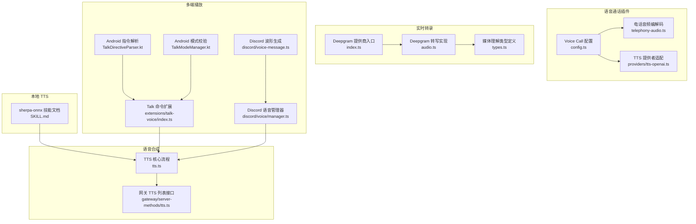
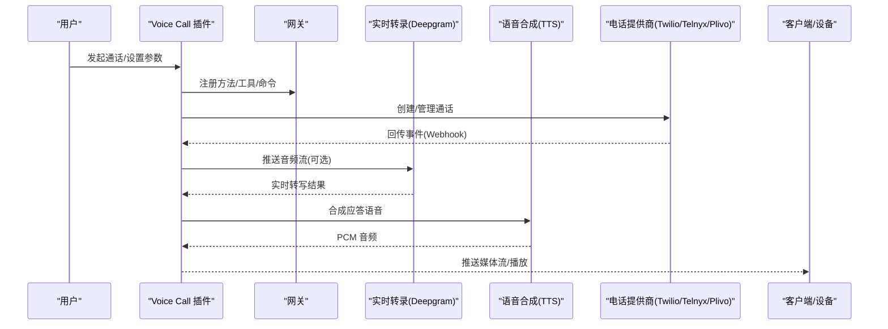
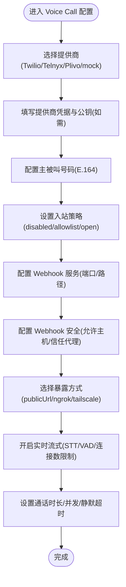
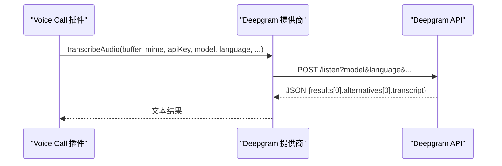
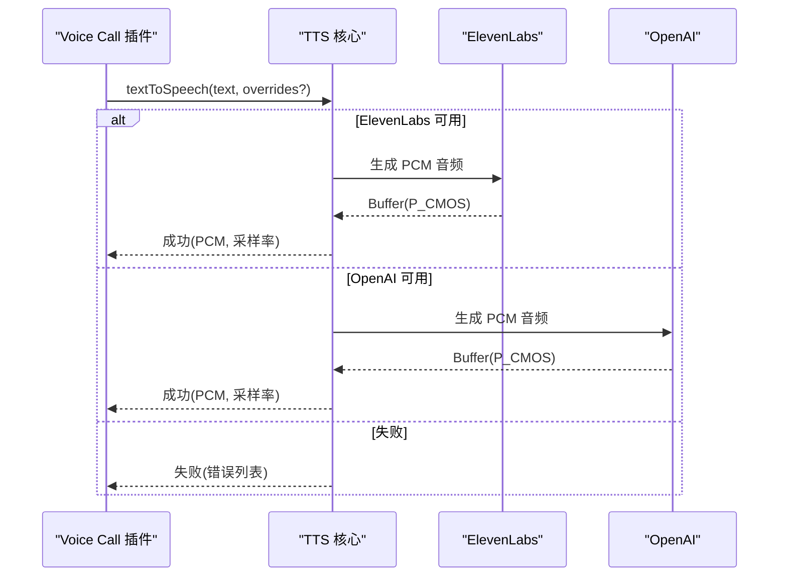
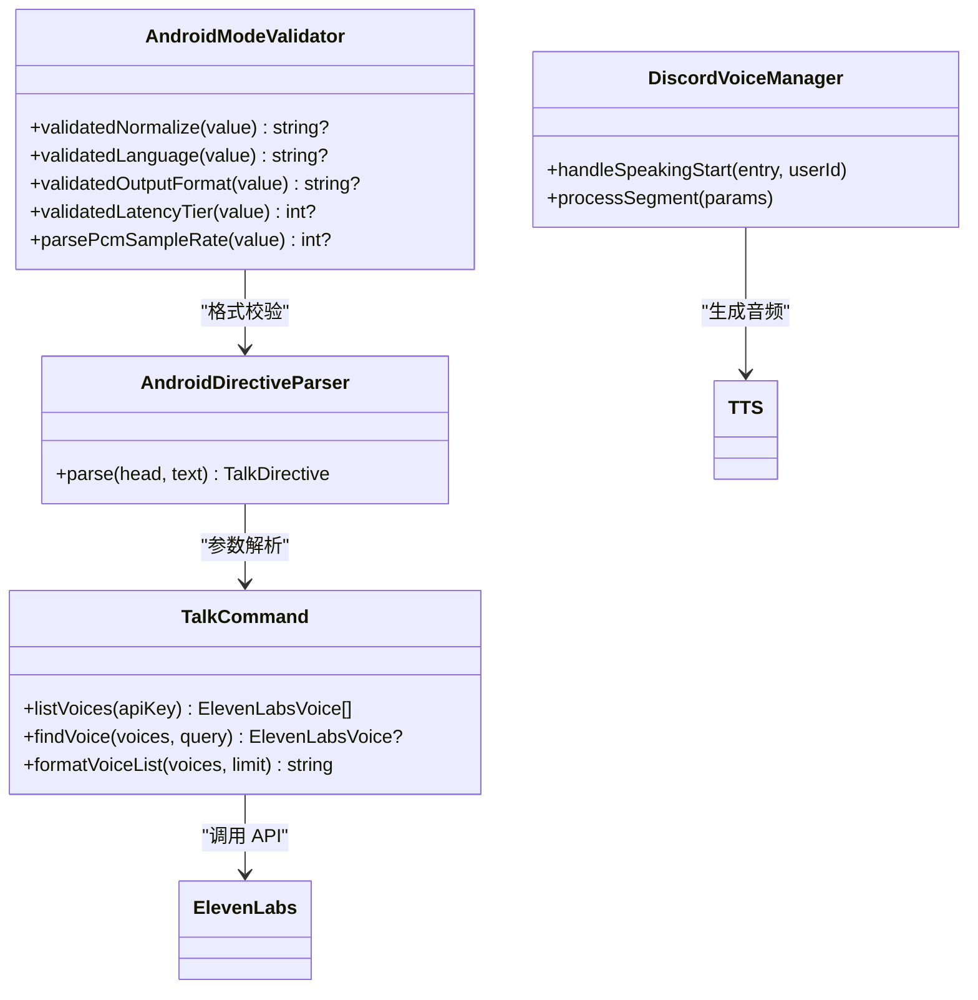
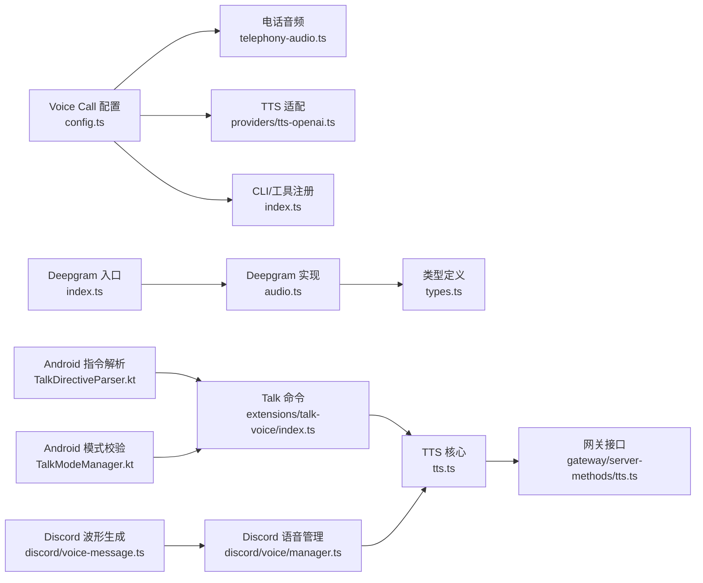

# 语音视频平台

<cite>
**本文引用的文件**
- [extensions/voice-call/src/config.ts](file://extensions/voice-call/src/config.ts)
- [extensions/voice-call/src/telephony-audio.ts](file://extensions/voice-call/src/telephony-audio.ts)
- [extensions/voice-call/src/providers/tts-openai.ts](file://extensions/voice-call/src/providers/tts-openai.ts)
- [extensions/voice-call/index.ts](file://extensions/voice-call/index.ts)
- [docs/zh-CN/plugins/voice-call.md](file://docs/zh-CN/plugins/voice-call.md)
- [docs/cli/voicecall.md](file://docs/cli/voicecall.md)
- [src/media-understanding/providers/deepgram/index.ts](file://src/media-understanding/providers/deepgram/index.ts)
- [src/media-understanding/providers/deepgram/audio.ts](file://src/media-understanding/providers/deepgram/audio.ts)
- [src/media-understanding/types.ts](file://src/media-understanding/types.ts)
- [src/tts/tts.ts](file://src/tts/tts.ts)
- [src/gateway/server-methods/tts.ts](file://src/gateway/server-methods/tts.ts)
- [extensions/talk-voice/index.ts](file://extensions/talk-voice/index.ts)
- [apps/android/app/src/main/java/ai/openclaw/app/voice/TalkDirectiveParser.kt](file://apps/android/app/src/main/java/ai/openclaw/app/voice/TalkDirectiveParser.kt)
- [apps/android/app/src/main/java/ai/openclaw/app/voice/TalkModeManager.kt](file://apps/android/app/src/main/java/ai/openclaw/app/voice/TalkModeManager.kt)
- [src/discord/voice/manager.ts](file://src/discord/voice/manager.ts)
- [src/discord/voice-message.ts](file://src/discord/voice-message.ts)
- [skills/sherpa-onnx-tts/SKILL.md](file://skills/sherpa-onnx-tts/SKILL.md)
</cite>

## 目录

1. [简介](#简介)
2. [项目结构](#项目结构)
3. [核心组件](#核心组件)
4. [架构总览](#架构总览)
5. [详细组件分析](#详细组件分析)
6. [依赖关系分析](#依赖关系分析)
7. [性能考量](#性能考量)
8. [故障排查指南](#故障排查指南)
9. [结论](#结论)
10. [附录](#附录)

## 简介

本文件面向在 OpenClaw 中集成语音视频能力的工程师与产品人员，系统化说明语音通话、实时转录与语音合成的配置与使用方法，并给出音频质量优化、延迟优化与带宽管理的最佳实践。内容覆盖以下能力：

- 语音通话：Twilio/Telnyx/Plivo 出站与入站通话，Webhook 安全与隧道暴露
- 实时转录：Deepgram 等提供商的音频理解与转写
- 语音合成：ElevenLabs/OpenAI/Edge 等 TTS 适配与电话场景输出格式
- 本地 TTS：sherpa-onnx 离线推理
- 多平台播放：iOS Talk、Android、Discord 语音消息与波形生成

## 项目结构

围绕语音视频的关键目录与文件：

- 语音通话插件：extensions/voice-call
- 实时转录：src/media-understanding/providers/deepgram
- 语音合成：src/tts、src/gateway/server-methods/tts
- 本地 TTS 技能：skills/sherpa-onnx-tts
- 多端播放与指令解析：apps/android、extensions/talk-voice、src/discord

**图表来源**

- [extensions/voice-call/src/config.ts:254-351](file://extensions/voice-call/src/config.ts#L254-L351)
- [extensions/voice-call/src/telephony-audio.ts:46-90](file://extensions/voice-call/src/telephony-audio.ts#L46-L90)
- [extensions/voice-call/src/providers/tts-openai.ts:180-218](file://extensions/voice-call/src/providers/tts-openai.ts#L180-L218)
- [src/media-understanding/providers/deepgram/index.ts:1-8](file://src/media-understanding/providers/deepgram/index.ts#L1-L8)
- [src/media-understanding/providers/deepgram/audio.ts:27-80](file://src/media-understanding/providers/deepgram/audio.ts#L27-L80)
- [src/media-understanding/types.ts:51-116](file://src/media-understanding/types.ts#L51-L116)
- [src/tts/tts.ts:557-783](file://src/tts/tts.ts#L557-L783)
- [src/gateway/server-methods/tts.ts:129-157](file://src/gateway/server-methods/tts.ts#L129-L157)
- [skills/sherpa-onnx-tts/SKILL.md:60-103](file://skills/sherpa-onnx-tts/SKILL.md#L60-L103)
- [extensions/talk-voice/index.ts:84-163](file://extensions/talk-voice/index.ts#L84-L163)
- [apps/android/app/src/main/java/ai/openclaw/app/voice/TalkDirectiveParser.kt:47-68](file://apps/android/app/src/main/java/ai/openclaw/app/voice/TalkDirectiveParser.kt#L47-L68)
- [apps/android/app/src/main/java/ai/openclaw/app/voice/TalkModeManager.kt:1664-1696](file://apps/android/app/src/main/java/ai/openclaw/app/voice/TalkModeManager.kt#L1664-L1696)
- [src/discord/voice/manager.ts:563-614](file://src/discord/voice/manager.ts#L563-L614)
- [src/discord/voice-message.ts:108-144](file://src/discord/voice-message.ts#L108-L144)

**章节来源**

- [extensions/voice-call/src/config.ts:1-526](file://extensions/voice-call/src/config.ts#L1-L526)
- [src/media-understanding/providers/deepgram/index.ts:1-8](file://src/media-understanding/providers/deepgram/index.ts#L1-L8)
- [src/media-understanding/providers/deepgram/audio.ts:1-80](file://src/media-understanding/providers/deepgram/audio.ts#L1-L80)
- [src/media-understanding/types.ts:1-116](file://src/media-understanding/types.ts#L1-L116)
- [src/tts/tts.ts:1-200](file://src/tts/tts.ts#L1-L200)

## 核心组件

- 语音通话插件（Voice Call）
  - 支持提供商：Twilio、Telnyx、Plivo、mock
  - 关键配置项：提供商凭据、主被叫号码、入/出站策略、Webhook 服务与安全、隧道暴露、实时流式 STT、最大时长与并发数等
  - 音频编解码：mu-law 与 PCM 的转换、8kHz 采样率适配、20ms 帧切分
  - TTS 集成：与核心 TTS 配置深度合并，电话场景强制 PCM 输出
- 实时转录（Deepgram）
  - 提供音频转写能力，支持模型选择、语言参数、超时控制与私有网络访问
- 语音合成（TTS）
  - 支持 OpenAI、ElevenLabs、Edge；电话场景输出格式统一为 PCM
  - 提供 TTS 列表查询与偏好路径解析
- 本地 TTS（sherpa-onnx）
  - 本地离线推理，技能文档提供安装与运行指引
- 多端播放与指令
  - Talk 命令扩展（ElevenLabs），Android 指令解析与模式校验，Discord 语音消息与波形生成

**章节来源**

- [extensions/voice-call/src/config.ts:254-526](file://extensions/voice-call/src/config.ts#L254-L526)
- [extensions/voice-call/src/telephony-audio.ts:46-90](file://extensions/voice-call/src/telephony-audio.ts#L46-L90)
- [src/media-understanding/providers/deepgram/audio.ts:27-80](file://src/media-understanding/providers/deepgram/audio.ts#L27-L80)
- [src/tts/tts.ts:557-783](file://src/tts/tts.ts#L557-L783)
- [src/gateway/server-methods/tts.ts:129-157](file://src/gateway/server-methods/tts.ts#L129-L157)
- [skills/sherpa-onnx-tts/SKILL.md:60-103](file://skills/sherpa-onnx-tts/SKILL.md#L60-L103)
- [extensions/talk-voice/index.ts:84-163](file://extensions/talk-voice/index.ts#L84-L163)
- [apps/android/app/src/main/java/ai/openclaw/app/voice/TalkDirectiveParser.kt:47-68](file://apps/android/app/src/main/java/ai/openclaw/app/voice/TalkDirectiveParser.kt#L47-L68)
- [apps/android/app/src/main/java/ai/openclaw/app/voice/TalkModeManager.kt:1664-1696](file://apps/android/app/src/main/java/ai/openclaw/app/voice/TalkModeManager.kt#L1664-L1696)
- [src/discord/voice/manager.ts:563-614](file://src/discord/voice/manager.ts#L563-L614)
- [src/discord/voice-message.ts:108-144](file://src/discord/voice-message.ts#L108-L144)

## 架构总览

OpenClaw 的语音视频能力由“插件层（Voice Call）+ 提供商适配层（Deepgram/ElevenLabs/OpenAI）+ 本地推理（sherpa-onnx）+ 多端播放（Talk/Android/Discord）”构成，数据流如下：

**图表来源**

- [extensions/voice-call/src/config.ts:254-351](file://extensions/voice-call/src/config.ts#L254-L351)
- [src/media-understanding/providers/deepgram/audio.ts:27-80](file://src/media-understanding/providers/deepgram/audio.ts#L27-L80)
- [src/tts/tts.ts:557-783](file://src/tts/tts.ts#L557-L783)
- [extensions/voice-call/src/providers/tts-openai.ts:180-218](file://extensions/voice-call/src/providers/tts-openai.ts#L180-L218)

## 详细组件分析

### 语音通话插件（Voice Call）

- 配置要点
  - 提供商凭据：Telnyx（API Key/Connection ID/Public Key）、Twilio（Account SID/Auth Token）、Plivo（Auth ID/Auth Token）
  - 主被叫号码：E.164 格式；入站策略（disabled/allowlist/pairing/open）
  - Webhook 与安全：serve（端口/绑定/路径）、webhookSecurity（允许主机/信任转发头/受信代理 IP）
  - 隧道暴露：tunnel（ngrok/tailscale-serve/funnel）与 publicUrl
  - 实时流式：streaming（OpenAI Realtime STT，VAD 参数、连接上限、预启动超时）
  - 通话参数：最大时长、静默超时、并发数、响应模型与提示词
- 音频处理
  - PCM 与 mu-law 转换、8kHz 重采样、20ms 帧切分，适配电话网络
- CLI 与工具
  - CLI：status/call/continue/end/tail/expose
  - 工具：voice_call（initiate_call/continue_call/speak_to_user/end_call/get_status）

**图表来源**

- [extensions/voice-call/src/config.ts:254-526](file://extensions/voice-call/src/config.ts#L254-L526)
- [docs/zh-CN/plugins/voice-call.md:59-154](file://docs/zh-CN/plugins/voice-call.md#L59-L154)

**章节来源**

- [extensions/voice-call/src/config.ts:254-526](file://extensions/voice-call/src/config.ts#L254-L526)
- [extensions/voice-call/index.ts:30-62](file://extensions/voice-call/index.ts#L30-L62)
- [docs/zh-CN/plugins/voice-call.md:1-251](file://docs/zh-CN/plugins/voice-call.md#L1-L251)
- [docs/cli/voicecall.md:1-35](file://docs/cli/voicecall.md#L1-L35)

### 实时转录（Deepgram）

- 能力与接口
  - 提供音频转写能力，支持模型选择、语言参数、超时控制与私有网络访问
  - 请求参数：URL 查询参数、Authorization 头、Content-Type、请求体（音频字节）
  - 返回：转写文本与所用模型
- 配置建议
  - 通过 tools.media.audio 配置启用与模型列表
  - 使用 DEEPGRAM_API_KEY 或自定义 baseUrl/headers

**图表来源**

- [src/media-understanding/providers/deepgram/index.ts:1-8](file://src/media-understanding/providers/deepgram/index.ts#L1-L8)
- [src/media-understanding/providers/deepgram/audio.ts:27-80](file://src/media-understanding/providers/deepgram/audio.ts#L27-L80)
- [src/media-understanding/types.ts:51-116](file://src/media-understanding/types.ts#L51-L116)

**章节来源**

- [src/media-understanding/providers/deepgram/index.ts:1-8](file://src/media-understanding/providers/deepgram/index.ts#L1-L8)
- [src/media-understanding/providers/deepgram/audio.ts:1-80](file://src/media-understanding/providers/deepgram/audio.ts#L1-L80)
- [src/media-understanding/types.ts:1-116](file://src/media-understanding/types.ts#L1-L116)

### 语音合成（TTS）

- 支持提供商与输出
  - OpenAI：mp3/op3_48k 等
  - ElevenLabs：opus/mp3_44100_128 等
  - Edge：本地 TTS（电话场景不适用）
  - 电话场景强制 PCM 输出（采样率与格式）
- 核心流程
  - 解析用户首选与覆盖、按顺序尝试各提供商、返回音频缓冲与元信息
- 网关接口
  - 列出可用提供商、是否已配置、支持模型与声音

**图表来源**

- [src/tts/tts.ts:557-783](file://src/tts/tts.ts#L557-L783)
- [src/gateway/server-methods/tts.ts:129-157](file://src/gateway/server-methods/tts.ts#L129-L157)

**章节来源**

- [src/tts/tts.ts:557-783](file://src/tts/tts.ts#L557-L783)
- [src/gateway/server-methods/tts.ts:129-157](file://src/gateway/server-methods/tts.ts#L129-L157)

### 本地 TTS（sherpa-onnx）

- 能力概述
  - 本地离线推理，适合隐私敏感与弱网场景
- 安装与运行
  - 下载对应平台运行时与声学模型，设置环境变量后直接调用技能脚本

**章节来源**

- [skills/sherpa-onnx-tts/SKILL.md:60-103](file://skills/sherpa-onnx-tts/SKILL.md#L60-L103)

### 多端播放与指令

- Talk 命令扩展（ElevenLabs）
  - 列举/设置声音，写回配置，影响 iOS Talk 播放
- Android 指令解析与模式校验
  - 解析 talk 指令参数（voice/model/speed/rate/stability/similarity/style/speakerBoost/seed/language/outputFormat/latencyTier/once）
  - 校验输出格式（PCM 采样率、MP3 前缀）与语言代码
- Discord 语音消息与波形生成
  - 语音接收订阅、OPUS 解码、WAV 写入、短片段丢弃、波形 Base64 生成

**图表来源**

- [extensions/talk-voice/index.ts:84-163](file://extensions/talk-voice/index.ts#L84-L163)
- [apps/android/app/src/main/java/ai/openclaw/app/voice/TalkDirectiveParser.kt:47-68](file://apps/android/app/src/main/java/ai/openclaw/app/voice/TalkDirectiveParser.kt#L47-L68)
- [apps/android/app/src/main/java/ai/openclaw/app/voice/TalkModeManager.kt:1664-1696](file://apps/android/app/src/main/java/ai/openclaw/app/voice/TalkModeManager.kt#L1664-L1696)
- [src/discord/voice/manager.ts:563-614](file://src/discord/voice/manager.ts#L563-L614)

**章节来源**

- [extensions/talk-voice/index.ts:84-163](file://extensions/talk-voice/index.ts#L84-L163)
- [apps/android/app/src/main/java/ai/openclaw/app/voice/TalkDirectiveParser.kt:47-68](file://apps/android/app/src/main/java/ai/openclaw/app/voice/TalkDirectiveParser.kt#L47-L68)
- [apps/android/app/src/main/java/ai/openclaw/app/voice/TalkModeManager.kt:1664-1696](file://apps/android/app/src/main/java/ai/openclaw/app/voice/TalkModeManager.kt#L1664-L1696)
- [src/discord/voice/manager.ts:563-614](file://src/discord/voice/manager.ts#L563-L614)
- [src/discord/voice-message.ts:108-144](file://src/discord/voice-message.ts#L108-L144)

## 依赖关系分析

- Voice Call 插件依赖
  - 配置解析与校验（config.ts）
  - 音频编解码（telephony-audio.ts）
  - TTS 提供商适配（providers/tts-openai.ts）
  - CLI 与工具注册（index.ts）
- 实时转录依赖
  - Deepgram 提供商入口与实现（index.ts/audio.ts）
  - 类型定义（types.ts）
- TTS 依赖
  - 核心流程（tts.ts）
  - 网关接口（gateway/server-methods/tts.ts）
- 多端播放依赖
  - Talk 命令扩展（extensions/talk-voice/index.ts）
  - Android 指令解析与模式校验（Android 源码）
  - Discord 语音管理器与波形生成（discord/voice/manager.ts、discord/voice-message.ts）

**图表来源**

- [extensions/voice-call/src/config.ts:254-526](file://extensions/voice-call/src/config.ts#L254-L526)
- [extensions/voice-call/src/telephony-audio.ts:46-90](file://extensions/voice-call/src/telephony-audio.ts#L46-L90)
- [extensions/voice-call/src/providers/tts-openai.ts:180-218](file://extensions/voice-call/src/providers/tts-openai.ts#L180-L218)
- [extensions/voice-call/index.ts:30-62](file://extensions/voice-call/index.ts#L30-L62)
- [src/media-understanding/providers/deepgram/index.ts:1-8](file://src/media-understanding/providers/deepgram/index.ts#L1-L8)
- [src/media-understanding/providers/deepgram/audio.ts:27-80](file://src/media-understanding/providers/deepgram/audio.ts#L27-L80)
- [src/media-understanding/types.ts:51-116](file://src/media-understanding/types.ts#L51-L116)
- [src/tts/tts.ts:557-783](file://src/tts/tts.ts#L557-L783)
- [src/gateway/server-methods/tts.ts:129-157](file://src/gateway/server-methods/tts.ts#L129-L157)
- [extensions/talk-voice/index.ts:84-163](file://extensions/talk-voice/index.ts#L84-L163)
- [apps/android/app/src/main/java/ai/openclaw/app/voice/TalkDirectiveParser.kt:47-68](file://apps/android/app/src/main/java/ai/openclaw/app/voice/TalkDirectiveParser.kt#L47-L68)
- [apps/android/app/src/main/java/ai/openclaw/app/voice/TalkModeManager.kt:1664-1696](file://apps/android/app/src/main/java/ai/openclaw/app/voice/TalkModeManager.kt#L1664-L1696)
- [src/discord/voice/manager.ts:563-614](file://src/discord/voice/manager.ts#L563-L614)
- [src/discord/voice-message.ts:108-144](file://src/discord/voice-message.ts#L108-L144)

**章节来源**

- [extensions/voice-call/src/config.ts:254-526](file://extensions/voice-call/src/config.ts#L254-L526)
- [src/media-understanding/providers/deepgram/index.ts:1-8](file://src/media-understanding/providers/deepgram/index.ts#L1-L8)
- [src/media-understanding/providers/deepgram/audio.ts:1-80](file://src/media-understanding/providers/deepgram/audio.ts#L1-L80)
- [src/media-understanding/types.ts:1-116](file://src/media-understanding/types.ts#L1-L116)
- [src/tts/tts.ts:557-783](file://src/tts/tts.ts#L557-L783)
- [src/gateway/server-methods/tts.ts:129-157](file://src/gateway/server-methods/tts.ts#L129-L157)
- [extensions/talk-voice/index.ts:84-163](file://extensions/talk-voice/index.ts#L84-L163)
- [apps/android/app/src/main/java/ai/openclaw/app/voice/TalkDirectiveParser.kt:47-68](file://apps/android/app/src/main/java/ai/openclaw/app/voice/TalkDirectiveParser.kt#L47-L68)
- [apps/android/app/src/main/java/ai/openclaw/app/voice/TalkModeManager.kt:1664-1696](file://apps/android/app/src/main/java/ai/openclaw/app/voice/TalkModeManager.kt#L1664-L1696)
- [src/discord/voice/manager.ts:563-614](file://src/discord/voice/manager.ts#L563-L614)
- [src/discord/voice-message.ts:108-144](file://src/discord/voice-message.ts#L108-L144)

## 性能考量

- 音频质量优化
  - 电话场景统一 PCM 输出，采样率与格式需满足提供商要求
  - 使用 8kHz 采样率与 20ms 帧切分，降低带宽占用
- 实时转录
  - 合理设置 VAD 阈值与静默时长，平衡延迟与误判
  - 控制预启动超时与连接上限，防止资源耗尽
- 带宽管理
  - 限制最大并发通话与每 IP 并发，避免风暴
  - 对于公网暴露，优先使用稳定域名或 Tailscale funnel
- 延迟优化
  - 本地 TTS（sherpa-onnx）适合低延迟与离线场景
  - 云端 TTS 通过缓存与预热减少首包延迟

[本节为通用指导，无需特定文件引用]

## 故障排查指南

- Webhook 安全与签名
  - 使用 allowedHosts/trustForwardingHeaders/trustedProxyIPs 精确控制转发头可信范围
  - 生产环境禁止跳过签名验证
- 隧道与暴露
  - ngrok 免费版 URL 可能变化，导致签名失败；建议使用稳定域名或 Tailscale funnel
  - 仅向可信网络暴露 webhook
- 电话音频
  - 确保 PCM 与 mu-law 转换正确，采样率一致
  - 检查帧大小（20ms）与切分逻辑
- TTS 与提供商
  - 核对 API Key 与模型配置；电话场景禁用 Edge TTS
  - 若失败，查看错误聚合信息与超时原因
- Discord 语音
  - 检查解密状态与片段时长；短片段将被丢弃
  - 波形生成异常时检查临时文件清理与权限

**章节来源**

- [extensions/voice-call/src/config.ts:158-178](file://extensions/voice-call/src/config.ts#L158-L178)
- [extensions/voice-call/src/config.ts:406-457](file://extensions/voice-call/src/config.ts#L406-L457)
- [extensions/voice-call/src/telephony-audio.ts:46-90](file://extensions/voice-call/src/telephony-audio.ts#L46-L90)
- [src/tts/tts.ts:542-555](file://src/tts/tts.ts#L542-L555)
- [src/discord/voice/manager.ts:563-614](file://src/discord/voice/manager.ts#L563-L614)
- [src/discord/voice-message.ts:108-144](file://src/discord/voice-message.ts#L108-L144)

## 结论

OpenClaw 的语音视频平台通过插件化架构实现了从提供商接入、实时转录、语音合成到多端播放的完整链路。结合严格的配置校验、Webhook 安全与隧道暴露策略，可在保证安全性的同时获得良好的实时性与可维护性。针对不同场景（云端/本地、公网/内网、高并发/低延迟），建议按本指南的性能与故障排查建议进行优化与落地。

[本节为总结，无需特定文件引用]

## 附录

- 快速参考
  - 语音通话插件配置与 CLI：参见 Voice Call 插件文档与 CLI 文档
  - 实时转录 Deepgram 配置示例：参见 Deepgram 提供商文档
  - TTS 列表与提供商信息：参见网关 TTS 接口
  - 本地 TTS 安装与运行：参见 sherpa-onnx 技能文档

**章节来源**

- [docs/zh-CN/plugins/voice-call.md:59-154](file://docs/zh-CN/plugins/voice-call.md#L59-L154)
- [docs/cli/voicecall.md:1-35](file://docs/cli/voicecall.md#L1-L35)
- [src/media-understanding/providers/deepgram/audio.ts:71-98](file://src/media-understanding/providers/deepgram/audio.ts#L71-L98)
- [src/gateway/server-methods/tts.ts:129-157](file://src/gateway/server-methods/tts.ts#L129-L157)
- [skills/sherpa-onnx-tts/SKILL.md:60-103](file://skills/sherpa-onnx-tts/SKILL.md#L60-L103)
