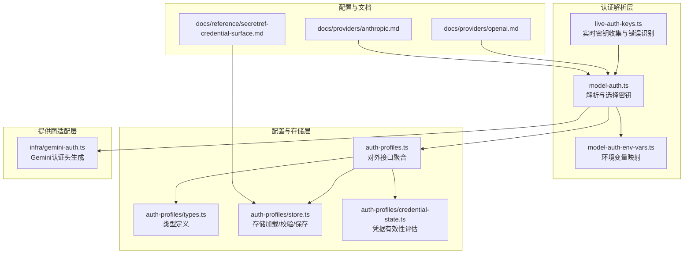
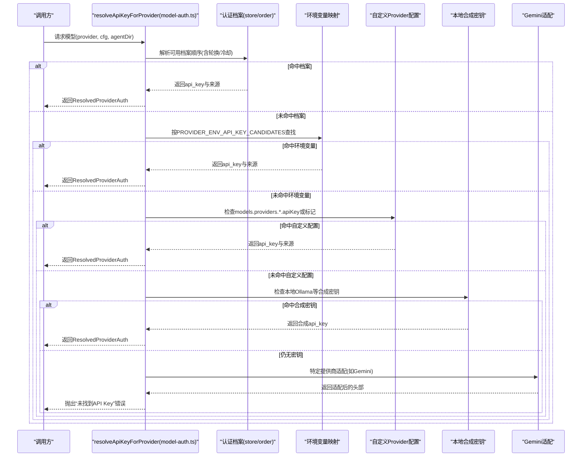
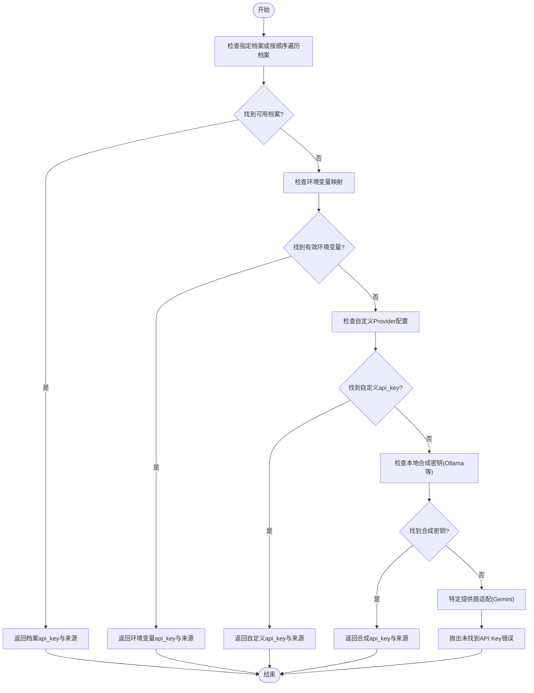
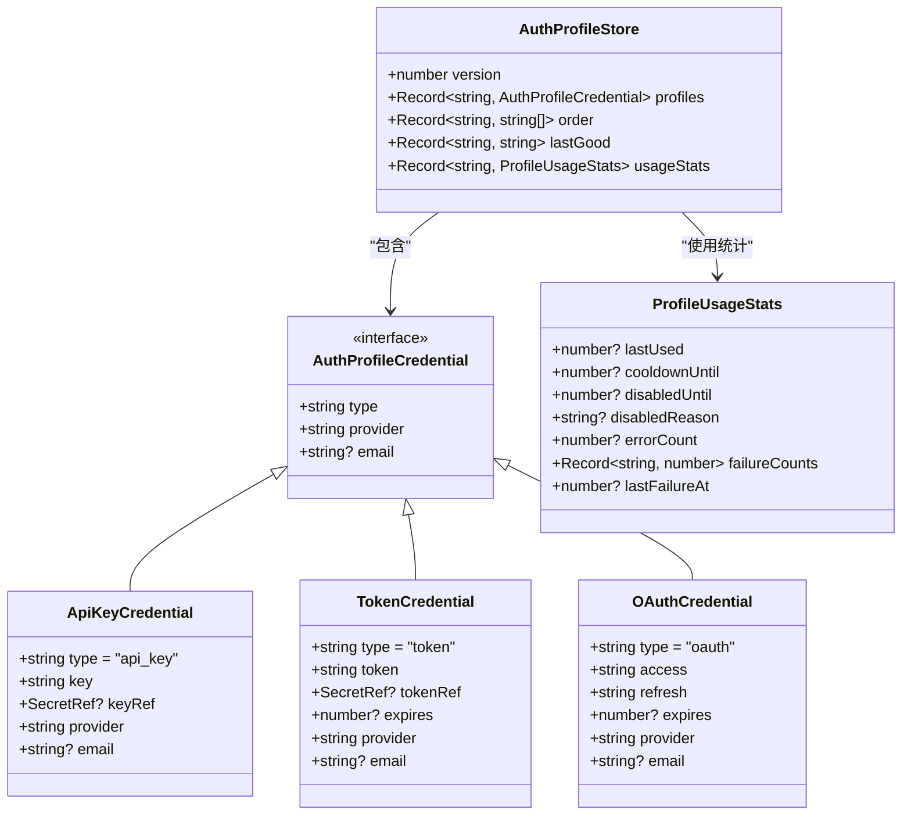
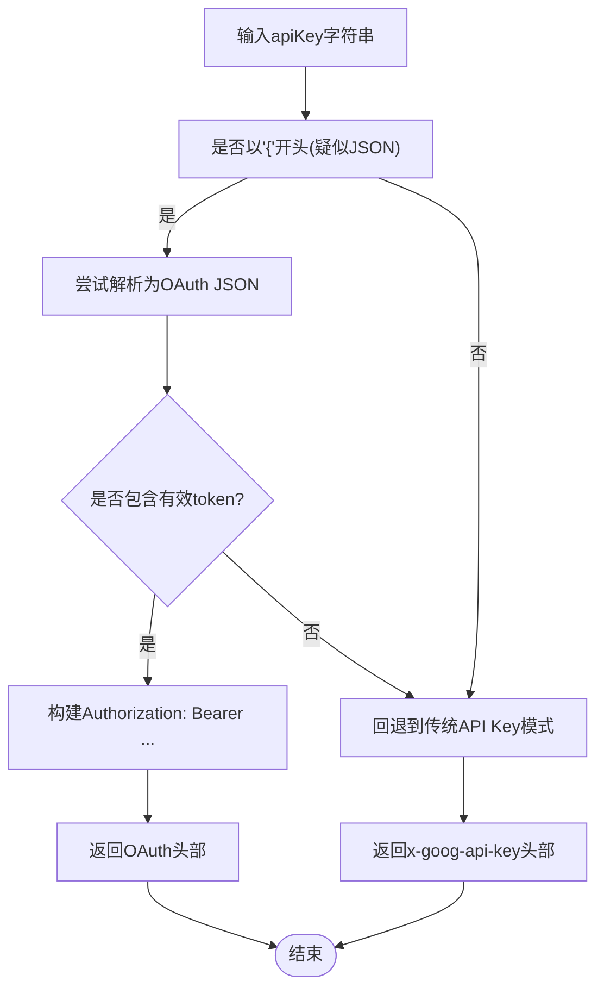
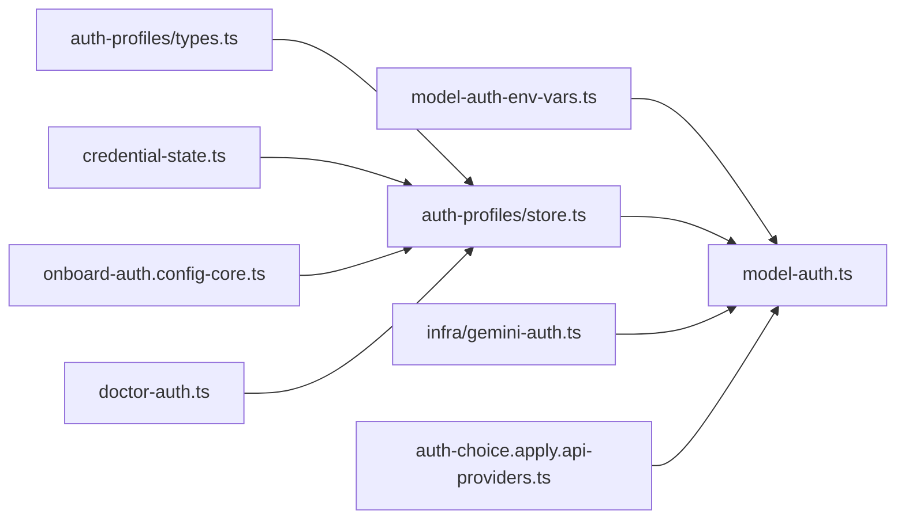

# API密钥认证

<cite>
**本文档引用的文件**
- [src/agents/model-auth.ts](file://src/agents/model-auth.ts)
- [src/agents/model-auth-env-vars.ts](file://src/agents/model-auth-env-vars.ts)
- [src/agents/auth-profiles.ts](file://src/agents/auth-profiles.ts)
- [src/agents/auth-profiles/types.ts](file://src/agents/auth-profiles/types.ts)
- [src/agents/auth-profiles/store.ts](file://src/agents/auth-profiles/store.ts)
- [src/agents/auth-profiles/credential-state.ts](file://src/agents/auth-profiles/credential-state.ts)
- [src/agents/live-auth-keys.ts](file://src/agents/live-auth-keys.ts)
- [src/infra/gemini-auth.ts](file://src/infra/gemini-auth.ts)
- [src/config/types.auth.ts](file://src/config/types.auth.ts)
- [docs/providers/openai.md](file://docs/providers/openai.md)
- [docs/providers/anthropic.md](file://docs/providers/anthropic.md)
- [docs/reference/secretref-credential-surface.md](file://docs/reference/secretref-credential-surface.md)
- [src/commands/auth-choice.apply.api-providers.ts](file://src/commands/auth-choice.apply.api-providers.ts)
- [src/commands/onboard-auth.config-core.ts](file://src/commands/onboard-auth.config-core.ts)
- [src/commands/doctor-auth.ts](file://src/commands/doctor-auth.ts)
</cite>

## 目录

1. [简介](#简介)
2. [项目结构](#项目结构)
3. [核心组件](#核心组件)
4. [架构总览](#架构总览)
5. [详细组件分析](#详细组件分析)
6. [依赖关系分析](#依赖关系分析)
7. [性能考虑](#性能考虑)
8. [故障排除指南](#故障排除指南)
9. [结论](#结论)
10. [附录](#附录)

## 简介

本文件面向OpenClaw的API密钥认证系统，系统性阐述如何配置与管理各类AI模型提供商（如OpenAI、Anthropic、Google Gemini等）的API密钥，覆盖获取流程、配置方法、安全存储、作用域与权限管理、轮换策略、验证与错误处理以及故障排除。文档同时给出不同提供商的认证配置示例与最佳实践，帮助开发者在保证安全的前提下高效使用多提供商模型服务。

## 项目结构

OpenClaw的API密钥认证体系由以下关键模块构成：

- 认证解析与模式判定：负责从多种来源解析API密钥或令牌，识别认证模式（API Key、OAuth、Token、AWS SDK等）
- 认证配置与存储：通过auth-profiles.json维护多个认证档案，支持轮换、冷却与优先级排序
- 环境变量映射：为各提供商定义标准环境变量名，便于一键注入
- 提供商特定适配：如Google Gemini对传统API Key与OAuth JSON格式的支持
- CLI与向导：提供交互式与非交互式配置流程，简化密钥设置
- 安全面单：明确哪些凭据可被“secrets configure/apply”管理，确保最小暴露面

**图表来源**

- [src/agents/model-auth.ts:1-442](file://src/agents/model-auth.ts#L1-L442)
- [src/agents/model-auth-env-vars.ts:1-45](file://src/agents/model-auth-env-vars.ts#L1-L45)
- [src/agents/auth-profiles.ts:1-55](file://src/agents/auth-profiles.ts#L1-L55)
- [src/agents/auth-profiles/types.ts:61-81](file://src/agents/auth-profiles/types.ts#L61-L81)
- [src/agents/auth-profiles/store.ts:188-227](file://src/agents/auth-profiles/store.ts#L188-L227)
- [src/agents/auth-profiles/credential-state.ts:34-75](file://src/agents/auth-profiles/credential-state.ts#L34-L75)
- [src/infra/gemini-auth.ts:1-41](file://src/infra/gemini-auth.ts#L1-L41)
- [docs/providers/openai.md:1-246](file://docs/providers/openai.md#L1-L246)
- [docs/providers/anthropic.md:1-232](file://docs/providers/anthropic.md#L1-L232)
- [docs/reference/secretref-credential-surface.md:1-89](file://docs/reference/secretref-credential-surface.md#L1-L89)

**章节来源**

- [src/agents/model-auth.ts:1-442](file://src/agents/model-auth.ts#L1-L442)
- [src/agents/model-auth-env-vars.ts:1-45](file://src/agents/model-auth-env-vars.ts#L1-L45)
- [src/agents/auth-profiles.ts:1-55](file://src/agents/auth-profiles.ts#L1-L55)
- [src/agents/auth-profiles/types.ts:61-81](file://src/agents/auth-profiles/types.ts#L61-L81)
- [src/agents/auth-profiles/store.ts:188-227](file://src/agents/auth-profiles/store.ts#L188-L227)
- [src/agents/auth-profiles/credential-state.ts:34-75](file://src/agents/auth-profiles/credential-state.ts#L34-L75)
- [src/infra/gemini-auth.ts:1-41](file://src/infra/gemini-auth.ts#L1-L41)
- [docs/providers/openai.md:1-246](file://docs/providers/openai.md#L1-L246)
- [docs/providers/anthropic.md:1-232](file://docs/providers/anthropic.md#L1-L232)
- [docs/reference/secretref-credential-surface.md:1-89](file://docs/reference/secretref-credential-surface.md#L1-L89)

## 核心组件

- 认证解析器：从配置、环境变量、认证档案、本地标记等多源解析API密钥；识别认证模式并返回标准化结果
- 认证档案存储：以auth-profiles.json为核心，记录每个档案的类型（api_key/oauth/token）、所属提供商、邮箱等元信息，支持轮换与冷却
- 环境变量映射：为各提供商定义候选环境变量名，提升自动化与运维效率
- 提供商特定适配：如Gemini支持传统API Key与OAuth JSON两种格式，自动选择合适头部
- 实时密钥与错误识别：收集实时可用密钥列表，识别速率限制与账单相关错误，辅助轮换与降级
- 配置与文档：提供OpenAI、Anthropic等提供商的配置示例与最佳实践

**章节来源**

- [src/agents/model-auth.ts:216-321](file://src/agents/model-auth.ts#L216-L321)
- [src/agents/auth-profiles/types.ts:61-81](file://src/agents/auth-profiles/types.ts#L61-L81)
- [src/agents/auth-profiles/store.ts:188-227](file://src/agents/auth-profiles/store.ts#L188-L227)
- [src/agents/model-auth-env-vars.ts:1-45](file://src/agents/model-auth-env-vars.ts#L1-L45)
- [src/infra/gemini-auth.ts:15-40](file://src/infra/gemini-auth.ts#L15-L40)
- [src/agents/live-auth-keys.ts:1-202](file://src/agents/live-auth-keys.ts#L1-L202)

## 架构总览

下图展示OpenClaw在调用模型前的认证决策流：按优先级从档案、环境变量、自定义配置到本地合成密钥，最终确定认证模式与密钥来源。

**图表来源**

- [src/agents/model-auth.ts:216-321](file://src/agents/model-auth.ts#L216-L321)
- [src/agents/model-auth-env-vars.ts:1-45](file://src/agents/model-auth-env-vars.ts#L1-L45)
- [src/infra/gemini-auth.ts:15-40](file://src/infra/gemini-auth.ts#L15-L40)

**章节来源**

- [src/agents/model-auth.ts:216-321](file://src/agents/model-auth.ts#L216-L321)

## 详细组件分析

### 组件A：认证解析与模式判定（model-auth.ts）

- 多源解析：支持档案、环境变量、自定义Provider配置、本地合成密钥
- 模式识别：根据来源与内容判断为api-key、oauth、token或aws-sdk
- 错误提示：当无法解析时，提供清晰的错误信息与修复建议（如添加agent认证或复制主agent的auth-profiles.json）

**图表来源**

- [src/agents/model-auth.ts:216-321](file://src/agents/model-auth.ts#L216-L321)

**章节来源**

- [src/agents/model-auth.ts:216-321](file://src/agents/model-auth.ts#L216-L321)

### 组件B：认证档案存储与轮换（auth-profiles）

- 存储结构：包含版本、档案字典、按提供商的优先顺序、最后良好使用记录、使用统计（轮换/冷却）
- 凭据有效性评估：区分api_key/token/oauth三类，校验是否存在、是否过期（token）或引用是否可解析
- 轮换与冷却：基于使用统计与失败计数计算冷却时间，避免频繁切换导致的抖动

**图表来源**

- [src/agents/auth-profiles/types.ts:61-81](file://src/agents/auth-profiles/types.ts#L61-L81)
- [src/agents/auth-profiles/store.ts:188-227](file://src/agents/auth-profiles/store.ts#L188-L227)
- [src/agents/auth-profiles/credential-state.ts:34-75](file://src/agents/auth-profiles/credential-state.ts#L34-L75)

**章节来源**

- [src/agents/auth-profiles/types.ts:61-81](file://src/agents/auth-profiles/types.ts#L61-L81)
- [src/agents/auth-profiles/store.ts:188-227](file://src/agents/auth-profiles/store.ts#L188-L227)
- [src/agents/auth-profiles/credential-state.ts:34-75](file://src/agents/auth-profiles/credential-state.ts#L34-L75)

### 组件C：环境变量映射（model-auth-env-vars.ts）

- 为各提供商定义候选环境变量名，如OPENAI_API_KEY、ANTHROPIC_API_KEY、GEMINI_API_KEY等
- 支持多候选变量，提升兼容性与自动化部署便利性

**章节来源**

- [src/agents/model-auth-env-vars.ts:1-45](file://src/agents/model-auth-env-vars.ts#L1-L45)

### 组件D：提供商特定适配（以Google Gemini为例）

- 支持两种格式：传统API Key与OAuth JSON（包含token与projectId）
- 自动选择合适的Authorization头：OAuth使用Bearer，传统API Key使用x-goog-api-key

**图表来源**

- [src/infra/gemini-auth.ts:15-40](file://src/infra/gemini-auth.ts#L15-L40)

**章节来源**

- [src/infra/gemini-auth.ts:15-40](file://src/infra/gemini-auth.ts#L15-L40)

### 组件E：实时密钥与错误识别（live-auth-keys.ts）

- 收集实时可用密钥：支持单值、列表、前缀等多种来源变量
- 错误识别：识别速率限制、配额耗尽、账单相关错误，辅助自动轮换与降级

**章节来源**

- [src/agents/live-auth-keys.ts:1-202](file://src/agents/live-auth-keys.ts#L1-L202)

### 组件F：CLI与向导（auth-choice.apply.api-providers.ts、onboard-auth.config-core.ts）

- 提供交互式与非交互式配置流程，针对不同提供商（如OpenAI、Anthropic、Gemini）设置默认模型与密钥
- 自动生成auth-profiles.json条目，维护provider order，支持混合模式下的优先级控制

**章节来源**

- [src/commands/auth-choice.apply.api-providers.ts:618-653](file://src/commands/auth-choice.apply.api-providers.ts#L618-L653)
- [src/commands/onboard-auth.config-core.ts:473-528](file://src/commands/onboard-auth.config-core.ts#L473-L528)

## 依赖关系分析

- 认证解析依赖环境变量映射与认证档案存储
- 认证档案存储依赖凭据有效性评估与类型定义
- 提供商特定适配独立于通用解析逻辑，但可被解析器调用
- CLI与向导依赖认证解析与存储，用于生成与更新配置

**图表来源**

- [src/agents/model-auth-env-vars.ts:1-45](file://src/agents/model-auth-env-vars.ts#L1-L45)
- [src/agents/model-auth.ts:1-442](file://src/agents/model-auth.ts#L1-L442)
- [src/agents/auth-profiles/store.ts:188-227](file://src/agents/auth-profiles/store.ts#L188-L227)
- [src/agents/auth-profiles/types.ts:61-81](file://src/agents/auth-profiles/types.ts#L61-L81)
- [src/agents/auth-profiles/credential-state.ts:34-75](file://src/agents/auth-profiles/credential-state.ts#L34-L75)
- [src/infra/gemini-auth.ts:1-41](file://src/infra/gemini-auth.ts#L1-L41)
- [src/commands/auth-choice.apply.api-providers.ts:618-653](file://src/commands/auth-choice.apply.api-providers.ts#L618-L653)
- [src/commands/onboard-auth.config-core.ts:473-528](file://src/commands/onboard-auth.config-core.ts#L473-L528)
- [src/commands/doctor-auth.ts:47-93](file://src/commands/doctor-auth.ts#L47-L93)

**章节来源**

- [src/agents/model-auth.ts:1-442](file://src/agents/model-auth.ts#L1-L442)
- [src/agents/auth-profiles/store.ts:188-227](file://src/agents/auth-profiles/store.ts#L188-L227)
- [src/commands/auth-choice.apply.api-providers.ts:618-653](file://src/commands/auth-choice.apply.api-providers.ts#L618-L653)
- [src/commands/doctor-auth.ts:47-93](file://src/commands/doctor-auth.ts#L47-L93)

## 性能考虑

- 轮换与冷却：通过usageStats与失败计数控制切换频率，避免频繁切换导致的抖动与成本上升
- 优先级顺序：按provider order与lastGood策略减少无效尝试
- 实时密钥收集：在高并发场景下，优先使用已知有效的密钥，降低首请求延迟
- 头部适配：针对Gemini等提供商采用合适的认证头，减少不必要的重试

[本节为通用指导，无需具体文件分析]

## 故障排除指南

常见问题与解决步骤：

- 未找到API Key
  - 检查agent目录的auth-profiles.json是否存在且包含目标提供商档案
  - 使用命令为agent添加认证或从主agent复制auth-profiles.json
  - 参考错误消息中的auth store路径进行定位
- OAuth刷新失败（Anthropic）
  - 使用setup-token重新认证，或在网关主机上粘贴token
- 所有认证档案均不可用（全部处于冷却/不可用）
  - 查看models状态输出中的unusableProfiles，等待冷却结束或新增档案
- 速率限制/配额耗尽
  - 识别错误类型并触发轮换，使用实时密钥收集功能切换至其他可用密钥
  - 对账单相关错误（如402），检查账户余额与限额设置

**章节来源**

- [src/agents/model-auth.ts:312-321](file://src/agents/model-auth.ts#L312-L321)
- [docs/providers/anthropic.md:206-231](file://docs/providers/anthropic.md#L206-L231)
- [src/agents/live-auth-keys.ts:150-202](file://src/agents/live-auth-keys.ts#L150-L202)

## 结论

OpenClaw的API密钥认证体系通过多源解析、档案化管理、环境变量映射、提供商特定适配与CLI向导，实现了灵活、安全、可扩展的认证能力。结合轮换与冷却机制，可在保障稳定性的同时最大化资源利用率。建议在生产环境中遵循最小暴露面原则，仅将必需凭据纳入可管理范围，并定期轮换与审计。

[本节为总结，无需具体文件分析]

## 附录

### 不同提供商的认证配置示例与最佳实践

- OpenAI
  - API Key：通过环境变量或向导配置，设置默认模型与传输参数
  - Codex订阅：使用setup-token或OAuth，适合订阅用户
  - 参考：[OpenAI文档:15-101](file://docs/providers/openai.md#L15-L101)
- Anthropic
  - API Key：适用于API访问与按量计费
  - Setup-token：适用于订阅用户，支持自动生成与粘贴
  - 提示缓存：API Key模式下默认短缓存，可按需调整
  - 参考：[Anthropic文档:14-100](file://docs/providers/anthropic.md#L14-L100)
- Google Gemini
  - 支持传统API Key与OAuth JSON格式，自动选择合适头部
  - 参考：[Gemini认证工具:15-40](file://src/infra/gemini-auth.ts#L15-L40)

**章节来源**

- [docs/providers/openai.md:15-101](file://docs/providers/openai.md#L15-L101)
- [docs/providers/anthropic.md:14-100](file://docs/providers/anthropic.md#L14-L100)
- [src/infra/gemini-auth.ts:15-40](file://src/infra/gemini-auth.ts#L15-L40)

### API密钥的作用域限制与权限管理

- 作用域：凭据通常绑定到特定提供商与档案ID，可通过auth.order控制优先级
- 权限：支持api_key/oauth/token三种模式，OAuth与token具备过期与刷新特性
- 最小暴露面：仅将用户提供的静态凭据纳入可管理范围，避免运行时生成或轮换的凭据进入管理面

**章节来源**

- [src/config/types.auth.ts:1-30](file://src/config/types.auth.ts#L1-L30)
- [docs/reference/secretref-credential-surface.md:19-89](file://docs/reference/secretref-credential-surface.md#L19-L89)

### API密钥验证与安全存储

- 验证：通过凭据有效性评估，检查是否存在、是否过期（token）或引用是否可解析
- 存储：auth-profiles.json集中管理，支持版本化与校验，拒绝不合规条目
- 安全：结合轮换与冷却，避免单一密钥长期暴露；CLI向导提供交互式安全输入

**章节来源**

- [src/agents/auth-profiles/credential-state.ts:34-75](file://src/agents/auth-profiles/credential-state.ts#L34-L75)
- [src/agents/auth-profiles/store.ts:188-227](file://src/agents/auth-profiles/store.ts#L188-L227)

### 轮换策略与错误处理

- 轮换：基于usageStats与失败计数动态调整，支持按提供商差异化冷却
- 错误处理：识别速率限制、配额耗尽、账单相关错误，触发切换与降级
- CLI：提供doctor命令清理无效档案与order，保持配置整洁

**章节来源**

- [src/agents/auth-profiles/store.ts:188-227](file://src/agents/auth-profiles/store.ts#L188-L227)
- [src/agents/live-auth-keys.ts:150-202](file://src/agents/live-auth-keys.ts#L150-L202)
- [src/commands/doctor-auth.ts:47-93](file://src/commands/doctor-auth.ts#L47-L93)
