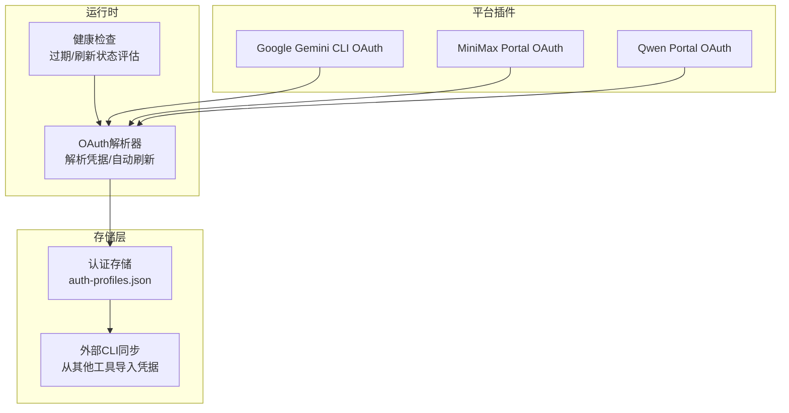
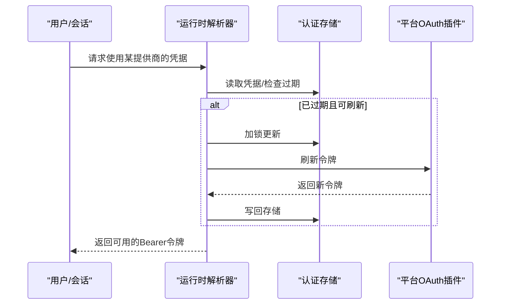
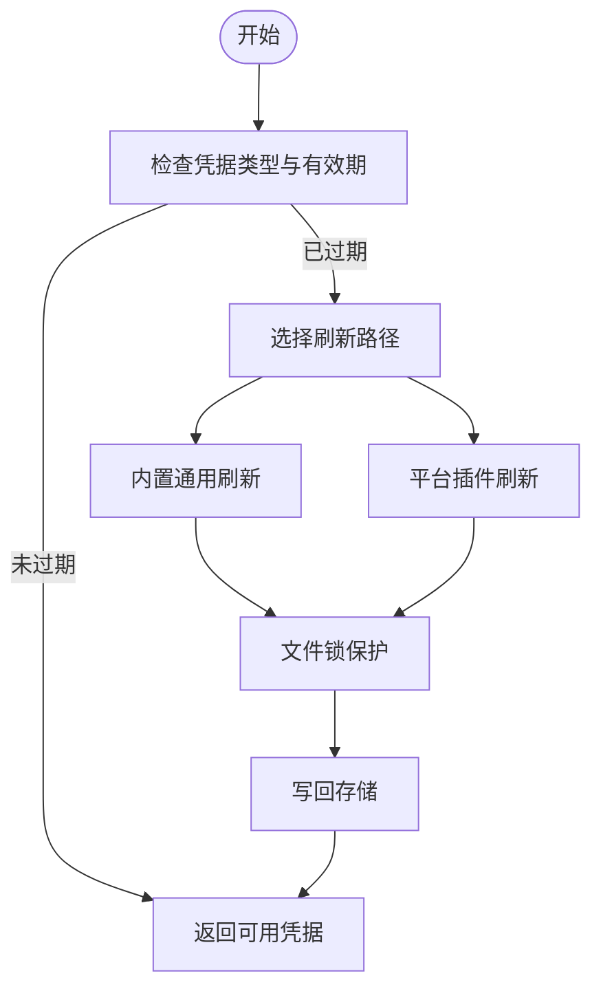
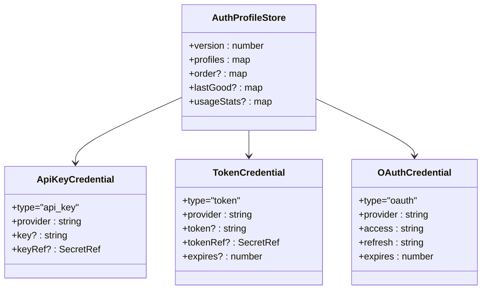
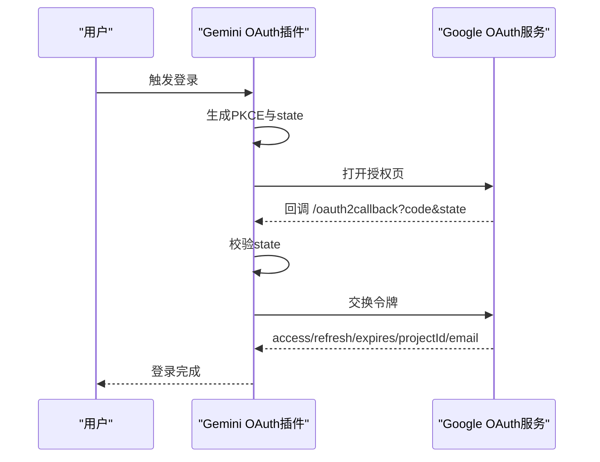
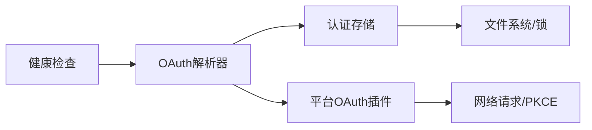

# OAuth认证

<cite>
**本文引用的文件**
- [oauth.md](file://docs/concepts/oauth.md)
- [oauth.ts](file://src/agents/auth-profiles/oauth.ts)
- [store.ts](file://src/agents/auth-profiles/store.ts)
- [types.ts](file://src/agents/auth-profiles/types.ts)
- [auth-health.ts](file://src/agents/auth-health.ts)
- [oauth.ts](file://extensions/google-gemini-cli-auth/oauth.ts)
- [oauth.ts](file://extensions/minimax-portal-auth/oauth.ts)
- [oauth.ts](file://extensions/qwen-portal-auth/oauth.ts)
- [client.ts](file://src/discord/client.ts)
- [account-inspect.ts](file://src/discord/account-inspect.ts)
- [types.slack.ts](file://src/config/types.slack.ts)
- [slack.account-inspect.ts](file://src/slack/account-inspect.ts)
- [types.telegram.ts](file://src/config/types.telegram.ts)
- [telegram.account-inspect.ts](file://src/telegram/account-inspect.ts)
</cite>

## 目录

1. [简介](#简介)
2. [项目结构](#项目结构)
3. [核心组件](#核心组件)
4. [架构总览](#架构总览)
5. [详细组件分析](#详细组件分析)
6. [依赖关系分析](#依赖关系分析)
7. [性能考量](#性能考量)
8. [故障排查指南](#故障排查指南)
9. [结论](#结论)
10. [附录](#附录)

## 简介

本指南面向OpenClaw的OAuth认证系统，覆盖以下主题：

- OAuth 2.0授权流程在OpenClaw中的实现与使用：重点是PKCE授权码流程；同时说明静态令牌与客户端凭证流程在其他通道中的应用方式。
- 多平台OAuth适配：Google Gemini CLI、MiniMax门户、Qwen门户等。
- 令牌生命周期管理：获取、自动刷新、过期处理与健康检查。
- 平台集成要点：Discord、Telegram、Slack等通道的令牌来源与配置差异。
- 常见失败场景与解决方案。

## 项目结构

OpenClaw的OAuth能力由“认证存储层 + 运行时解析器 + 各平台插件”三层构成：

- 认证存储层：统一管理OAuth/静态令牌/API Key，持久化到每个Agent目录下的auth-profiles.json，并支持主Agent与子Agent之间的继承与合并。
- 运行时解析器：在每次调用模型或通道前，解析当前会话使用的凭据，自动刷新过期令牌。
- 平台插件：针对不同提供商（如Google、MiniMax、Qwen）实现各自的PKCE授权码或设备码流程。

图表来源

- [oauth.ts:305-487](file://src/agents/auth-profiles/oauth.ts#L305-L487)
- [store.ts:443-460](file://src/agents/auth-profiles/store.ts#L443-L460)
- [auth-health.ts:80-185](file://src/agents/auth-health.ts#L80-L185)
- [oauth.ts:659-735](file://extensions/google-gemini-cli-auth/oauth.ts#L659-L735)
- [oauth.ts:184-245](file://extensions/minimax-portal-auth/oauth.ts#L184-L245)
- [oauth.ts:132-183](file://extensions/qwen-portal-auth/oauth.ts#L132-L183)

章节来源

- [oauth.md:1-159](file://docs/concepts/oauth.md#L1-L159)
- [store.ts:346-441](file://src/agents/auth-profiles/store.ts#L346-L441)

## 核心组件

- 凭据类型与存储
  - 支持三种凭据类型：api_key、token（静态Bearer）、oauth（可刷新）。
  - 存储于每个Agent的auth-profiles.json，支持多账户与按提供商排序。
- 运行时解析与刷新
  - 在访问API前解析当前会话使用的凭据；若过期则加锁刷新并写回存储。
  - 对具备刷新令牌的OAuth凭据，首次调用即可自动续期。
- 健康检查
  - 统计各提供商下凭据的过期状态与剩余时间，支持“即将过期/已过期/正常/缺失/静态”等状态。

章节来源

- [types.ts:5-36](file://src/agents/auth-profiles/types.ts#L5-L36)
- [store.ts:484-509](file://src/agents/auth-profiles/store.ts#L484-L509)
- [oauth.ts:154-211](file://src/agents/auth-profiles/oauth.ts#L154-L211)
- [auth-health.ts:165-185](file://src/agents/auth-health.ts#L165-L185)

## 架构总览

OpenClaw的OAuth认证采用“集中存储 + 按需刷新”的模式，确保跨进程/多Agent的一致性与可靠性。

图表来源

- [oauth.ts:213-252](file://src/agents/auth-profiles/oauth.ts#L213-L252)
- [oauth.ts:154-211](file://src/agents/auth-profiles/oauth.ts#L154-L211)
- [store.ts:80-99](file://src/agents/auth-profiles/store.ts#L80-L99)

## 详细组件分析

### 1) OAuth解析与刷新（运行时）

- 解析逻辑
  - 兼容api_key/token/oauth三类凭据；对token与oauth类型互操作兼容。
  - 若凭据未过期，直接返回；否则尝试刷新。
- 刷新策略
  - 针对不同提供商选择对应刷新路径（内置通用刷新或特定插件刷新）。
  - 使用文件锁保证并发安全，避免多个进程同时刷新导致冲突。
- 回退与继承
  - 若当前Agent无有效凭据，尝试从主Agent继承最新凭据。
  - 对OpenAI Codex存在特殊回退：当刷新失败但仍持有旧access token时，允许临时继续使用以保障可用性。

图表来源

- [oauth.ts:213-252](file://src/agents/auth-profiles/oauth.ts#L213-L252)
- [oauth.ts:154-211](file://src/agents/auth-profiles/oauth.ts#L154-L211)

章节来源

- [oauth.ts:29-55](file://src/agents/auth-profiles/oauth.ts#L29-L55)
- [oauth.ts:305-487](file://src/agents/auth-profiles/oauth.ts#L305-L487)

### 2) 认证存储与多账户

- 存储位置
  - 每个Agent目录下独立存储，便于隔离与迁移。
- 多账户与继承
  - 支持同一提供商的多个profile ID；可通过全局或会话级配置切换。
  - 子Agent可继承主Agent的凭据，减少重复配置。
- 外部CLI同步
  - 自动从其他工具导入OAuth凭据，避免凭据丢失。

图表来源

- [types.ts:5-36](file://src/agents/auth-profiles/types.ts#L5-L36)
- [store.ts:484-509](file://src/agents/auth-profiles/store.ts#L484-L509)

章节来源

- [store.ts:346-441](file://src/agents/auth-profiles/store.ts#L346-L441)
- [store.ts:443-460](file://src/agents/auth-profiles/store.ts#L443-L460)

### 3) 平台OAuth实现

#### Google Gemini CLI OAuth（PKCE授权码）

- 流程概要
  - 生成PKCE verifier/challenge与state，打开浏览器授权。
  - 本地监听回调端口接收code与state，校验后换取令牌。
  - 若无法绑定本地端口，则切换为手动粘贴回调URL。
- 关键点
  - 自动发现Gemini CLI安装位置提取客户端ID/密钥，或通过环境变量覆盖。
  - 获取用户邮箱与项目ID，用于后续API调用与合规要求。

图表来源

- [oauth.ts:659-735](file://extensions/google-gemini-cli-auth/oauth.ts#L659-L735)
- [oauth.ts:305-396](file://extensions/google-gemini-cli-auth/oauth.ts#L305-L396)

章节来源

- [oauth.ts:1-735](file://extensions/google-gemini-cli-auth/oauth.ts#L1-L735)

#### MiniMax门户OAuth（用户码授权）

- 流程概要
  - 请求一次性user_code与verification_uri。
  - 轮询等待授权，收到授权后使用code_verifier兑换令牌。
- 关键点
  - 支持中/国际区不同网关，使用固定客户端ID。
  - 轮询间隔动态增长，超时或错误有明确提示。

章节来源

- [oauth.ts:1-245](file://extensions/minimax-portal-auth/oauth.ts#L1-L245)

#### Qwen门户OAuth（设备码授权）

- 流程概要
  - 请求设备码与用户码，引导用户在浏览器输入用户码完成授权。
  - 轮询获取令牌，支持慢速降级与超时控制。
- 关键点
  - 使用固定客户端ID与标准设备码grant type。
  - 自动计算过期时间并记录资源URL。

章节来源

- [oauth.ts:1-183](file://extensions/qwen-portal-auth/oauth.ts#L1-L183)

### 4) 平台集成要点（Discord/Telegram/Slack）

#### Discord

- 令牌来源
  - 支持显式传入、配置文件、环境变量等多种来源；优先级按顺序解析。
  - 未配置时会提示缺少令牌。
- 配置要点
  - 可配置多账户与默认账户ID；启用/禁用开关与重试参数可调。

章节来源

- [client.ts:32-71](file://src/discord/client.ts#L32-L71)
- [account-inspect.ts:88-129](file://src/discord/account-inspect.ts#L88-L129)

#### Telegram

- 配置要点
  - 支持webhookUrl/webhookSecret等参数；可按账户维度配置。
  - 多账户场景下可分别设置不同webhook参数。

章节来源

- [types.telegram.ts:1-41](file://src/config/types.telegram.ts#L1-L41)
- [telegram.account-inspect.ts:1-200](file://src/telegram/account-inspect.ts#L1-L200)

#### Slack

- 配置要点
  - 支持HTTP模式与Bot/User App Token；可配置signingSecret等。
  - 多账户与模式切换，健康检查可识别不同令牌状态。

章节来源

- [types.slack.ts:1-200](file://src/config/types.slack.ts#L1-L200)
- [slack.account-inspect.ts:122-168](file://src/slack/account-inspect.ts#L122-L168)

## 依赖关系分析

- 运行时解析器依赖认证存储与平台插件；认证存储依赖文件锁与JSON序列化。
- 平台插件依赖网络请求与PKCE工具；部分插件还涉及项目ID/用户信息查询。
- 健康检查依赖解析器输出的状态与过期时间。

图表来源

- [oauth.ts:1-20](file://src/agents/auth-profiles/oauth.ts#L1-L20)
- [store.ts:1-10](file://src/agents/auth-profiles/store.ts#L1-L10)
- [auth-health.ts:1-12](file://src/agents/auth-health.ts#L1-L12)

章节来源

- [oauth.ts:1-20](file://src/agents/auth-profiles/oauth.ts#L1-L20)
- [store.ts:1-10](file://src/agents/auth-profiles/store.ts#L1-L10)

## 性能考量

- 文件锁与并发
  - 刷新过程使用文件锁，避免竞态；建议在高并发场景下合理安排调用节奏。
- 轮询策略
  - 设备码/用户码轮询间隔动态增长，降低无效请求；超时阈值可按网络状况调整。
- 存储读写
  - 存储采用按需写回策略，仅在凭据变更时保存，减少IO压力。

## 故障排查指南

- 常见问题与定位
  - 令牌过期/即将过期：通过健康检查输出查看剩余时间与状态。
  - 刷新失败：检查网络连通性、提供商限制与回调端口占用情况。
  - 多实例/多Agent冲突：确认文件锁是否生效，避免并行刷新。
  - 平台令牌缺失：核对配置文件、环境变量与多账户默认值。
- 具体场景
  - Google Gemini CLI：若本地回调端口被占用，切换为手动粘贴回调URL；确保项目ID正确。
  - MiniMax/Qwen：若轮询超时，检查user_code是否正确输入与授权页面是否完成。
  - Discord/Telegram/Slack：核对webhook/signingSecret/bot token等配置项是否齐全。

章节来源

- [auth-health.ts:80-185](file://src/agents/auth-health.ts#L80-L185)
- [oauth.ts:704-733](file://extensions/google-gemini-cli-auth/oauth.ts#L704-L733)
- [oauth.ts:208-241](file://extensions/minimax-portal-auth/oauth.ts#L208-L241)
- [oauth.ts:155-179](file://extensions/qwen-portal-auth/oauth.ts#L155-L179)

## 结论

OpenClaw的OAuth体系以“集中存储 + 按需刷新 + 健康监控”为核心，既满足多平台、多账户的复杂场景，又通过文件锁与回退策略保障稳定性。结合平台插件的PKCE/设备码流程，用户可在不同环境下完成安全、便捷的认证。

## 附录

### OAuth 2.0流程与OpenClaw实践对照

- 授权码流程（PKCE）
  - OpenClaw通过平台插件实现，典型为Google Gemini CLI、MiniMax门户、Qwen门户。
- 隐式流程
  - OpenClaw未直接实现隐式流程；如需使用，请在目标平台侧自行配置并以静态令牌形式接入。
- 客户端凭证流程
  - OpenClaw未直接实现客户端凭证流程；如需使用，请在目标平台侧自行配置并以静态令牌形式接入。

章节来源

- [oauth.md:83-111](file://docs/concepts/oauth.md#L83-L111)
- [oauth.ts:261-275](file://extensions/google-gemini-cli-auth/oauth.ts#L261-L275)
- [oauth.ts:56-60](file://extensions/minimax-portal-auth/oauth.ts#L56-L60)
- [oauth.ts:132-136](file://extensions/qwen-portal-auth/oauth.ts#L132-L136)

### 平台OAuth应用注册与回调配置要点

- Google Gemini CLI
  - 通过环境变量或Gemini CLI安装目录自动发现客户端ID/密钥；无需额外注册。
- MiniMax门户
  - 固定客户端ID，按地区选择网关；无需自建应用。
- Qwen门户
  - 固定客户端ID；无需自建应用。
- Discord/Telegram/Slack
  - 需在各平台创建应用/机器人并配置回调URL与权限范围；OpenClaw侧通过配置文件注入令牌与签名密钥。

章节来源

- [oauth.ts:197-215](file://extensions/google-gemini-cli-auth/oauth.ts#L197-L215)
- [oauth.ts:9-18](file://extensions/minimax-portal-auth/oauth.ts#L9-L18)
- [oauth.ts:7-12](file://extensions/qwen-portal-auth/oauth.ts#L7-L12)
- [client.ts:32-71](file://src/discord/client.ts#L32-L71)
- [types.slack.ts:1-200](file://src/config/types.slack.ts#L1-L200)
- [types.telegram.ts:1-41](file://src/config/types.telegram.ts#L1-L41)
