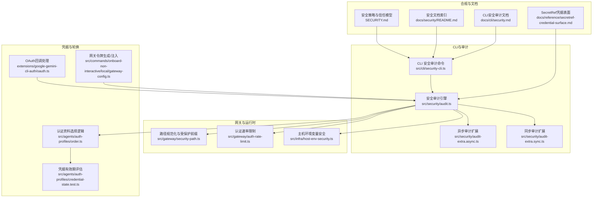
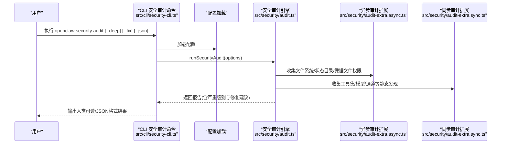
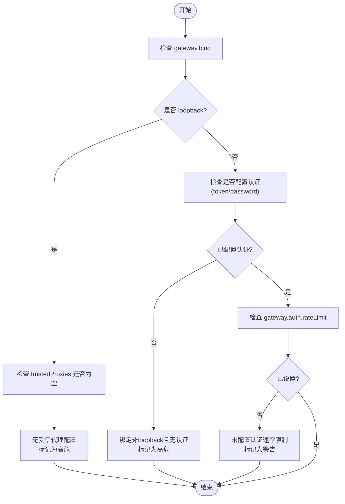
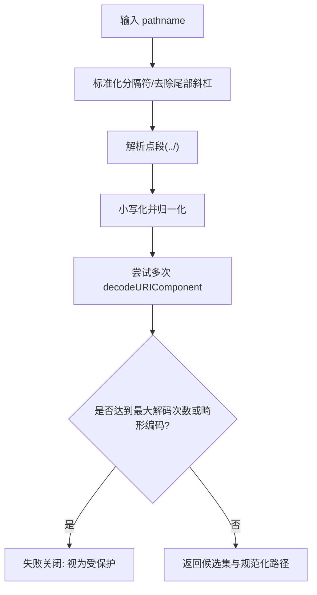
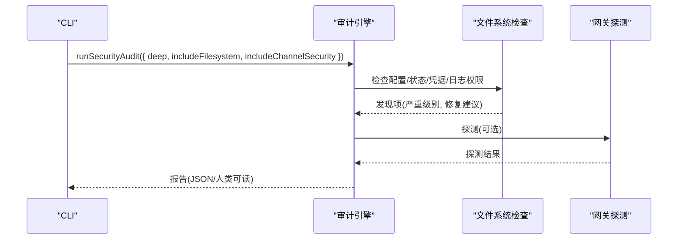
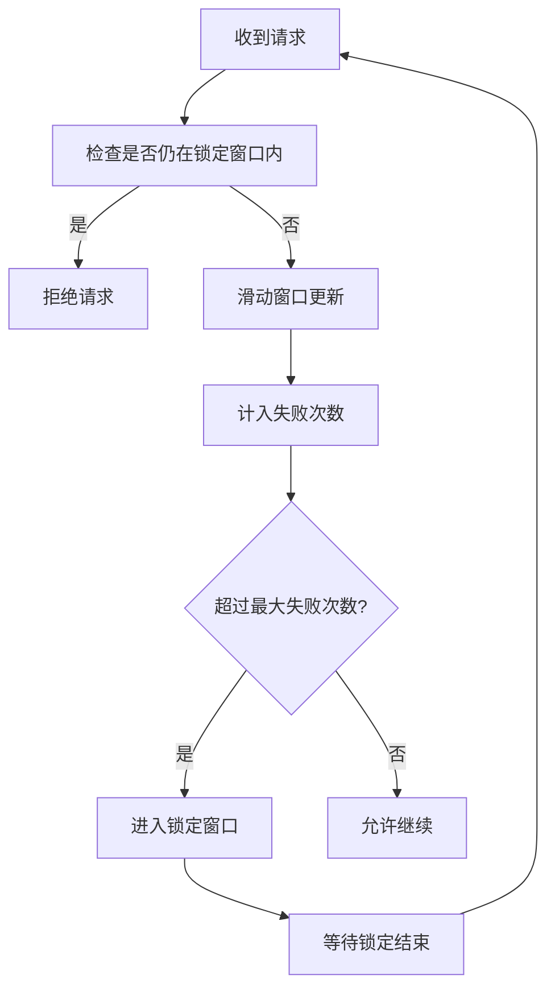
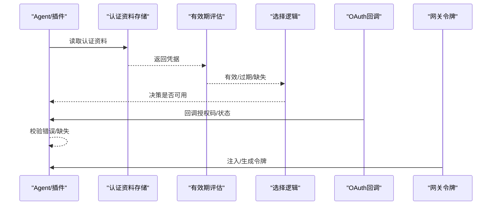
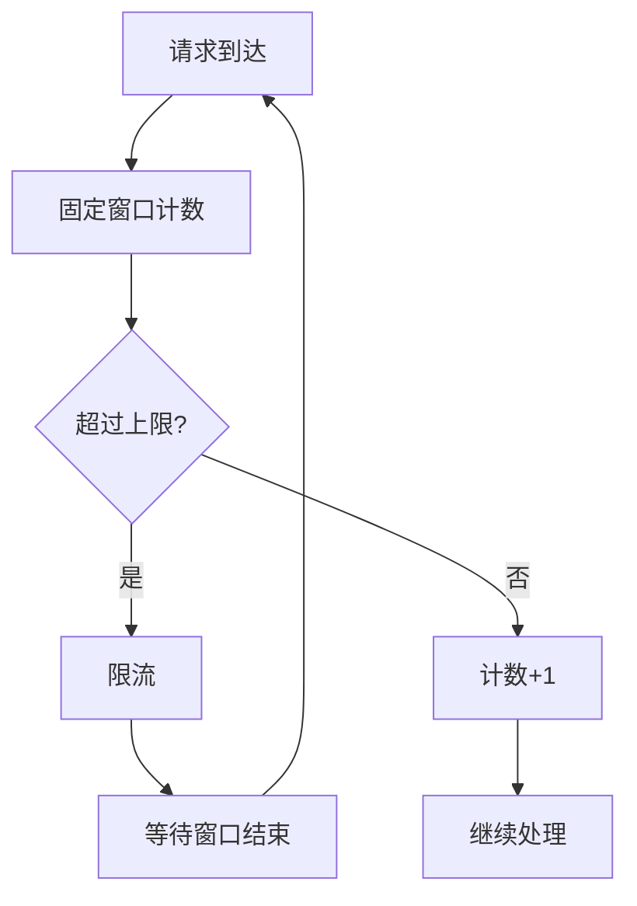
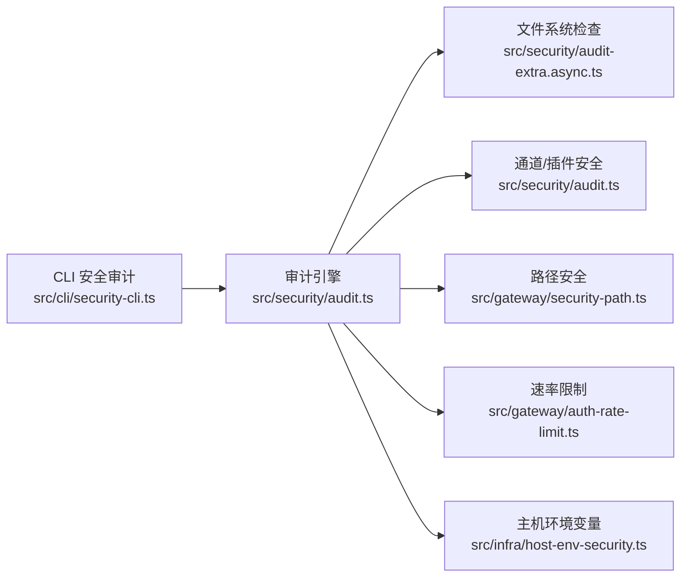

# 安全策略

<cite>
**本文引用的文件**
- [SECURITY.md](file://SECURITY.md)
- [docs/security/README.md](file://docs/security/README.md)
- [src/cli/security-cli.ts](file://src/cli/security-cli.ts)
- [src/security/audit.ts](file://src/security/audit.ts)
- [src/security/audit-extra.async.ts](file://src/security/audit-extra.async.ts)
- [src/security/audit-extra.sync.ts](file://src/security/audit-extra.sync.ts)
- [src/gateway/security-path.ts](file://src/gateway/security-path.ts)
- [src/gateway/auth-rate-limit.ts](file://src/gateway/auth-rate-limit.ts)
- [src/infra/host-env-security.ts](file://src/infra/host-env-security.ts)
- [src/agents/auth-profiles/credential-state.test.ts](file://src/agents/auth-profiles/credential-state.test.ts)
- [src/agents/auth-profiles/order.ts](file://src/agents/auth-profiles/order.ts)
- [extensions/google-gemini-cli-auth/oauth.ts](file://extensions/google-gemini-cli-auth/oauth.ts)
- [src/commands/onboard-non-interactive/local/gateway-config.ts](file://src/commands/onboard-non-interactive/local/gateway-config.ts)
- [docs/cli/security.md](file://docs/cli/security.md)
- [docs/reference/secretref-credential-surface.md](file://docs/reference/secretref-credential-surface.md)
- [extensions/open-prose/skills/prose/lib/error-forensics.prose](file://extensions/open-prose/skills/prose/lib/error-forensics.prose)
- [extensions/open-prose/skills/prose/primitives/session.md](file://extensions/open-prose/skills/prose/primitives/session.md)
- [src/plugin-sdk/webhook-memory-guards.test.ts](file://src/plugin-sdk/webhook-memory-guards.test.ts)
</cite>

## 目录

1. [简介](#简介)
2. [项目结构](#项目结构)
3. [核心组件](#核心组件)
4. [架构总览](#架构总览)
5. [详细组件分析](#详细组件分析)
6. [依赖关系分析](#依赖关系分析)
7. [性能考量](#性能考量)
8. [故障排查指南](#故障排查指南)
9. [结论](#结论)
10. [附录](#附录)

## 简介

本指南面向OpenClaw的安全策略体系，聚焦认证与会话安全、访问控制、审计与合规、速率限制与暴力破解防护、异常行为检测、凭据管理与轮换、安全配置最佳实践以及安全事件监控与响应取证流程。文档以仓库内现有实现与文档为依据，结合可操作的CLI命令与内置安全检查能力，帮助运营者建立可落地的安全基线。

## 项目结构

OpenClaw在多处模块中内置了安全能力：

- CLI层：提供“安全审计”子命令，支持本地配置与状态检查、深度探测、自动修复建议输出。
- 安全审计引擎：集中收集配置权限、网关暴露面、浏览器控制、通道安全、插件信任边界等发现项。
- 网关安全：路径规范化与受保护前缀校验、认证速率限制、受信代理认证模式。
- 运行时安全：主机环境变量过滤与标记、执行上下文隔离。
- 凭据与轮换：认证资料存储与有效期评估、OAuth回调处理、令牌生成与注入。
- 异常检测：固定窗口限流器、Webhook异常追踪（内存守卫）。

**图表来源**

- [src/cli/security-cli.ts:1-165](file://src/cli/security-cli.ts#L1-L165)
- [src/security/audit.ts:1-800](file://src/security/audit.ts#L1-L800)
- [src/security/audit-extra.async.ts:915-981](file://src/security/audit-extra.async.ts#L915-L981)
- [src/security/audit-extra.sync.ts:1070-1105](file://src/security/audit-extra.sync.ts#L1070-L1105)
- [src/gateway/security-path.ts:1-162](file://src/gateway/security-path.ts#L1-L162)
- [src/gateway/auth-rate-limit.ts:169-232](file://src/gateway/auth-rate-limit.ts#L169-L232)
- [src/infra/host-env-security.ts:1-158](file://src/infra/host-env-security.ts#L1-L158)
- [src/agents/auth-profiles/credential-state.test.ts:1-31](file://src/agents/auth-profiles/credential-state.test.ts#L1-L31)
- [src/agents/auth-profiles/order.ts:25-65](file://src/agents/auth-profiles/order.ts#L25-L65)
- [extensions/google-gemini-cli-auth/oauth.ts:305-344](file://extensions/google-gemini-cli-auth/oauth.ts#L305-L344)
- [src/commands/onboard-non-interactive/local/gateway-config.ts:59-113](file://src/commands/onboard-non-interactive/local/gateway-config.ts#L59-L113)
- [SECURITY.md:1-288](file://SECURITY.md#L1-L288)
- [docs/security/README.md:1-18](file://docs/security/README.md#L1-L18)
- [docs/cli/security.md:43-72](file://docs/cli/security.md#L43-L72)
- [docs/reference/secretref-credential-surface.md:1-24](file://docs/reference/secretref-credential-surface.md#L1-L24)

**章节来源**

- [src/cli/security-cli.ts:1-165](file://src/cli/security-cli.ts#L1-L165)
- [src/security/audit.ts:1-800](file://src/security/audit.ts#L1-L800)
- [SECURITY.md:1-288](file://SECURITY.md#L1-L288)

## 核心组件

- 安全审计CLI：提供“openclaw security audit”命令，支持本地审计、深度探测、自动修复、JSON输出，便于CI与策略检查。
- 审计引擎：统一收集配置文件/状态目录权限、网关绑定与认证、浏览器控制端点、通道安全、插件信任、工具集风险、日志与凭据文件权限等。
- 路径安全与受保护前缀：对HTTP路径进行规范化、解码、归一化与候选集生成，确保受保护路由不被绕过。
- 认证速率限制：基于滑动窗口与锁定窗口的失败尝试统计，支持按IP或作用域重试时间计算。
- 主机环境变量安全：阻断危险键值与前缀，仅允许白名单覆盖，避免命令解析与执行边界被破坏。
- 凭据与轮换：凭据有效期评估、认证资料优先级与兼容性判断、OAuth回调处理、网关令牌生成与注入。
- 异常行为检测：固定窗口限流器与Webhook异常追踪，防止滥用与资源耗尽。

**章节来源**

- [src/cli/security-cli.ts:30-165](file://src/cli/security-cli.ts#L30-L165)
- [src/security/audit.ts:208-337](file://src/security/audit.ts#L208-L337)
- [src/gateway/security-path.ts:45-162](file://src/gateway/security-path.ts#L45-L162)
- [src/gateway/auth-rate-limit.ts:169-232](file://src/gateway/auth-rate-limit.ts#L169-L232)
- [src/infra/host-env-security.ts:83-158](file://src/infra/host-env-security.ts#L83-L158)
- [src/agents/auth-profiles/credential-state.test.ts:7-28](file://src/agents/auth-profiles/credential-state.test.ts#L7-L28)
- [src/agents/auth-profiles/order.ts:30-65](file://src/agents/auth-profiles/order.ts#L30-L65)
- [src/plugin-sdk/webhook-memory-guards.test.ts:10-48](file://src/plugin-sdk/webhook-memory-guards.test.ts#L10-L48)

## 架构总览

下图展示从CLI到审计引擎、再到各安全子系统的调用链路与数据流。

**图表来源**

- [src/cli/security-cli.ts:50-165](file://src/cli/security-cli.ts#L50-L165)
- [src/security/audit.ts:115-132](file://src/security/audit.ts#L115-L132)
- [src/security/audit-extra.async.ts:915-981](file://src/security/audit-extra.async.ts#L915-L981)
- [src/security/audit-extra.sync.ts:1070-1105](file://src/security/audit-extra.sync.ts#L1070-L1105)

## 详细组件分析

### 认证与会话安全

- 认证模式与密钥强度
  - 网关支持共享密钥(token)、密码(password)、受信代理(trusted-proxy)、无认证(None)等模式；当非回环绑定且未启用受信代理时，若未配置认证，将被标记为高危。
  - 当使用token模式且长度较短时，将给出警告提示。
- 速率限制
  - 在非回环绑定且未采用受信代理时，若未配置认证速率限制，将给出警告；审计引擎提供默认阈值建议。
- 会话与设备身份
  - 控制UI允许Origin白名单与Host头回退开关；禁用设备身份校验将被标记为高危。
- 浏览器控制端点
  - 启用浏览器控制HTTP路由时，若未配置网关认证，将被标记为高危。

**图表来源**

- [src/security/audit.ts:340-687](file://src/security/audit.ts#L340-L687)

**章节来源**

- [src/security/audit.ts:340-687](file://src/security/audit.ts#L340-L687)
- [src/gateway/auth-rate-limit.ts:169-232](file://src/gateway/auth-rate-limit.ts#L169-L232)

### 访问控制与路径安全

- 受保护前缀与路径规范化
  - 对HTTP路径进行多轮解码、规范化与候选集生成，确保受保护路由（如插件通道API）不被绕过。
  - 若路径存在畸形编码或解码上限到达，将采取“失败关闭”策略。
- 网关受保护路由
  - 预定义受保护前缀集合，用于判定请求路径是否命中受保护范围。

**图表来源**

- [src/gateway/security-path.ts:45-162](file://src/gateway/security-path.ts#L45-L162)

**章节来源**

- [src/gateway/security-path.ts:45-162](file://src/gateway/security-path.ts#L45-L162)

### 审计与合规

- 文件系统与敏感文件权限
  - 配置文件、状态目录、凭据文件、会话文件等的可写/可读权限检查，发现后给出修复建议（如chmod 600）。
- 深度探测
  - 在启用深度模式时，对网关进行探测，记录尝试、URL、成功与否、错误信息等。
- 自动修复
  - 将常见不安全配置转换为更严格默认值，并收紧权限；但不旋转令牌/禁用工具/改变网络暴露。

**图表来源**

- [src/cli/security-cli.ts:50-165](file://src/cli/security-cli.ts#L50-L165)
- [src/security/audit.ts:208-337](file://src/security/audit.ts#L208-L337)
- [src/security/audit-extra.async.ts:915-981](file://src/security/audit-extra.async.ts#L915-L981)
- [docs/cli/security.md:43-72](file://docs/cli/security.md#L43-L72)

**章节来源**

- [src/security/audit.ts:208-337](file://src/security/audit.ts#L208-L337)
- [src/security/audit-extra.async.ts:915-981](file://src/security/audit-extra.async.ts#L915-L981)
- [docs/cli/security.md:43-72](file://docs/cli/security.md#L43-L72)

### 速率限制与暴力破解防护

- 认证速率限制
  - 基于滑动窗口统计失败次数，超过阈值进入锁定窗口；支持按IP或作用域重试时间计算。
- 固定窗口限流器
  - 用于Webhook等入口的固定窗口限流，限制每窗口请求数量并限制跟踪键数量，防止资源耗尽。

**图表来源**

- [src/gateway/auth-rate-limit.ts:169-232](file://src/gateway/auth-rate-limit.ts#L169-L232)
- [src/plugin-sdk/webhook-memory-guards.test.ts:10-48](file://src/plugin-sdk/webhook-memory-guards.test.ts#L10-L48)

**章节来源**

- [src/gateway/auth-rate-limit.ts:169-232](file://src/gateway/auth-rate-limit.ts#L169-L232)
- [src/plugin-sdk/webhook-memory-guards.test.ts:10-48](file://src/plugin-sdk/webhook-memory-guards.test.ts#L10-L48)

### 凭据管理与轮换策略

- 凭据有效期评估
  - 对凭据的过期时间进行评估，识别缺失、无效、过期等状态，指导轮换。
- 认证资料选择逻辑
  - 根据配置与存储中的资料，判断资料提供方、类型兼容性与有效性，决定是否可用。
- OAuth回调处理
  - 本地OAuth回调服务器接收授权码与状态参数，校验错误与缺失字段，确保回调安全。
- 网关令牌生成与注入
  - 在非交互安装流程中，支持从环境变量注入或随机生成网关令牌，并写入配置。

**图表来源**

- [src/agents/auth-profiles/credential-state.test.ts:7-28](file://src/agents/auth-profiles/credential-state.test.ts#L7-L28)
- [src/agents/auth-profiles/order.ts:30-65](file://src/agents/auth-profiles/order.ts#L30-L65)
- [extensions/google-gemini-cli-auth/oauth.ts:305-344](file://extensions/google-gemini-cli-auth/oauth.ts#L305-L344)
- [src/commands/onboard-non-interactive/local/gateway-config.ts:59-113](file://src/commands/onboard-non-interactive/local/gateway-config.ts#L59-L113)

**章节来源**

- [src/agents/auth-profiles/credential-state.test.ts:7-28](file://src/agents/auth-profiles/credential-state.test.ts#L7-L28)
- [src/agents/auth-profiles/order.ts:30-65](file://src/agents/auth-profiles/order.ts#L30-L65)
- [extensions/google-gemini-cli-auth/oauth.ts:305-344](file://extensions/google-gemini-cli-auth/oauth.ts#L305-L344)
- [src/commands/onboard-non-interactive/local/gateway-config.ts:59-113](file://src/commands/onboard-non-interactive/local/gateway-config.ts#L59-L113)

### 异常行为检测与监控

- 固定窗口限流器
  - 限制每窗口请求数量，超限即触发限流，窗口到期后重置。
- Webhook异常追踪
  - 维护计数器与异常阈值，辅助识别异常流量与潜在滥用。
- 安全事件响应与取证
  - 提供Forensics工作流，要求具体定位、证据与修复方案，形成可复用的取证模板。

**图表来源**

- [src/plugin-sdk/webhook-memory-guards.test.ts:10-48](file://src/plugin-sdk/webhook-memory-guards.test.ts#L10-L48)
- [extensions/open-prose/skills/prose/lib/error-forensics.prose:199-250](file://extensions/open-prose/skills/prose/lib/error-forensics.prose#L199-L250)

**章节来源**

- [src/plugin-sdk/webhook-memory-guards.test.ts:10-48](file://src/plugin-sdk/webhook-memory-guards.test.ts#L10-L48)
- [extensions/open-prose/skills/prose/lib/error-forensics.prose:199-250](file://extensions/open-prose/skills/prose/lib/error-forensics.prose#L199-L250)

### 安全配置最佳实践与合规要求

- 信任模型与部署假设
  - OpenClaw不假设多租户对抗场景，推荐单用户/单网关/单VPS或OS用户隔离；会话标识仅为路由控制，不构成多用户授权边界。
- 网关与控制UI
  - 默认仅本地回环绑定；若需远程访问，建议SSH隧道或Tailscale，配合强认证与防火墙。
- 工具与沙箱
  - 工具文件系统硬核：限制工具写入范围；子代理委派需严格限制与沙箱要求。
- 运行时要求
  - 使用Node.js 22.12.0+，并遵循Docker只读与能力降权建议。
- 凭据表面
  - SecretRef支持范围明确，不包含运行时自生/轮换凭据、OAuth刷新材料与会话类产物。

**章节来源**

- [SECURITY.md:88-172](file://SECURITY.md#L88-L172)
- [SECURITY.md:207-288](file://SECURITY.md#L207-L288)
- [docs/reference/secretref-credential-surface.md:14-24](file://docs/reference/secretref-credential-surface.md#L14-L24)

## 依赖关系分析

- CLI依赖配置加载与审计引擎；审计引擎依赖文件系统检查、网关探测、通道与插件安全模块。
- 路径安全与速率限制分别作为独立模块被审计引擎调用。
- 主机环境变量安全在执行边界上提供额外保护，避免危险环境变量影响命令解析。

**图表来源**

- [src/cli/security-cli.ts:50-165](file://src/cli/security-cli.ts#L50-L165)
- [src/security/audit.ts:115-132](file://src/security/audit.ts#L115-L132)
- [src/security/audit-extra.async.ts:915-981](file://src/security/audit-extra.async.ts#L915-L981)
- [src/gateway/security-path.ts:45-162](file://src/gateway/security-path.ts#L45-L162)
- [src/gateway/auth-rate-limit.ts:169-232](file://src/gateway/auth-rate-limit.ts#L169-L232)
- [src/infra/host-env-security.ts:83-158](file://src/infra/host-env-security.ts#L83-L158)

**章节来源**

- [src/cli/security-cli.ts:50-165](file://src/cli/security-cli.ts#L50-L165)
- [src/security/audit.ts:115-132](file://src/security/audit.ts#L115-L132)

## 性能考量

- 审计引擎在深度模式下进行网关探测，应设置合理超时；文件系统权限检查与容器标签检查可能产生额外开销。
- 速率限制与限流器维护键空间大小，需根据并发与流量峰值调整窗口与上限，避免误伤正常请求。
- 主机环境变量过滤在执行前进行，避免频繁遍历与正则匹配带来的CPU消耗。

## 故障排查指南

- 审计报告解读
  - 关注严重级别：critical/warn/info；critical项优先处理；warn项通常涉及权限与暴露面；info项为建议性改进。
- 自动修复
  - 使用“--fix”应用安全修复（收紧权限、调整默认策略），并结合“--json”在CI中进行策略比对。
- 常见问题定位
  - 非回环绑定且无认证：检查gateway.bind与gateway.auth配置。
  - 控制UI跨域与设备身份：检查allowedOrigins与dangerouslyDisableDeviceAuth。
  - 浏览器控制端点未鉴权：检查gateway.auth是否配置token或password。
  - 文件权限问题：针对config/state/credentials/sessions等敏感文件执行chmod 600。

**章节来源**

- [docs/cli/security.md:43-72](file://docs/cli/security.md#L43-L72)
- [src/cli/security-cli.ts:50-165](file://src/cli/security-cli.ts#L50-L165)
- [src/security/audit.ts:208-337](file://src/security/audit.ts#L208-L337)

## 结论

OpenClaw通过CLI驱动的安全审计、路径规范化、认证速率限制、主机环境变量过滤与凭据生命周期管理，构建了覆盖配置、网络、运行时与数据层面的安全基线。结合信任模型与合规文档，运营者可在本地与远程部署中建立稳健的安全部署与运维流程。建议将“openclaw security audit --deep --fix --json”纳入CI与上线检查流程，持续保持安全基线稳定。

## 附录

- 安全策略与信任模型：参见[SECURITY.md:1-288](file://SECURITY.md#L1-L288)
- 安全文档索引：参见[docs/security/README.md:1-18](file://docs/security/README.md#L1-L18)
- CLI安全审计文档：参见[docs/cli/security.md:43-72](file://docs/cli/security.md#L43-L72)
- SecretRef凭据表面：参见[docs/reference/secretref-credential-surface.md:1-24](file://docs/reference/secretref-credential-surface.md#L1-L24)
- 认证资料与轮换示例：参见[extensions/open-prose/skills/prose/primitives/session.md:174-187](file://extensions/open-prose/skills/prose/primitives/session.md#L174-L187)
