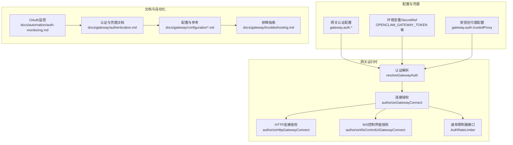
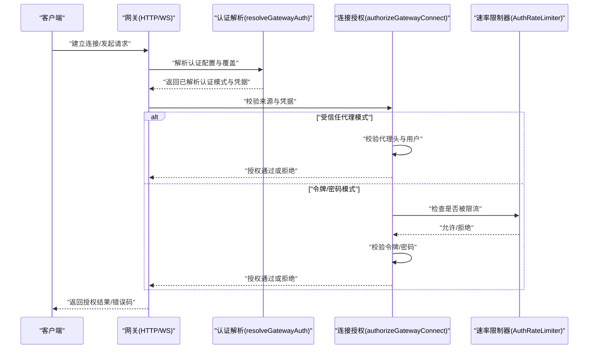
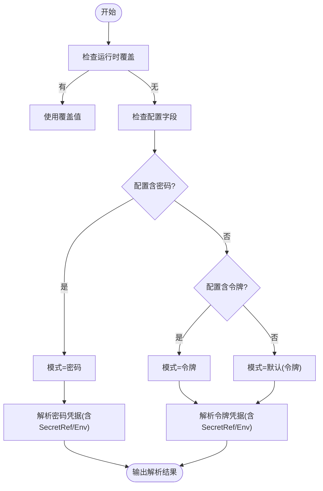
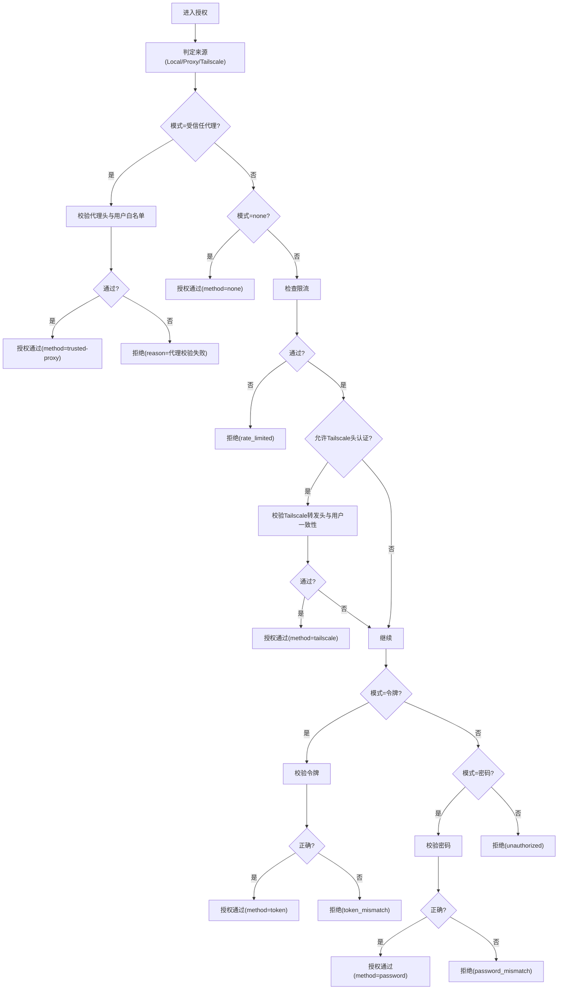
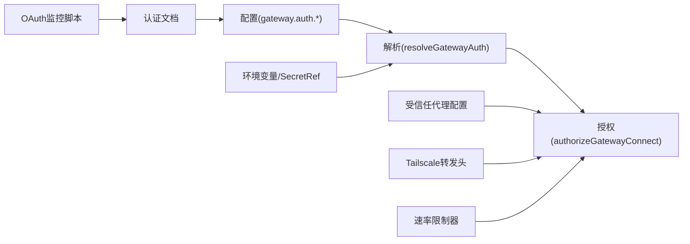

# 网关认证

<cite>
**本文引用的文件**
- [src/gateway/auth.ts](file://src/gateway/auth.ts)
- [docs/gateway/authentication.md](file://docs/gateway/authentication.md)
- [docs/gateway/configuration.md](file://docs/gateway/configuration.md)
- [docs/gateway/configuration-reference.md](file://docs/gateway/configuration-reference.md)
- [docs/gateway/troubleshooting.md](file://docs/gateway/troubleshooting.md)
- [docs/automation/auth-monitoring.md](file://docs/automation/auth-monitoring.md)
- [docs/gateway/secrets.md](file://docs/gateway/secrets.md)
</cite>

## 目录

1. [简介](#简介)
2. [项目结构](#项目结构)
3. [核心组件](#核心组件)
4. [架构总览](#架构总览)
5. [详细组件分析](#详细组件分析)
6. [依赖关系分析](#依赖关系分析)
7. [性能考虑](#性能考虑)
8. [故障排除指南](#故障排除指南)
9. [结论](#结论)
10. [附录](#附录)

## 简介

本文件面向OpenClaw网关的“网关级别认证与访问控制”，系统化阐述以下内容：

- 网关认证策略：共享密钥令牌（token）、密码（password）、受信任代理（trusted-proxy）与设备身份（Tailscale/设备令牌）的组合使用
- 多层安全架构：基于来源（本地直连/反向代理/受信任代理/Tailscale）与速率限制的分层授权
- 访问控制策略：HTTP与WebSocket控制界面的不同授权路径；设备身份与用户标识的提取与校验
- 配置、切换与优先级：认证模式解析、覆盖与默认回退；环境变量与SecretRef对认证凭据的影响
- 性能优化与安全加固：速率限制、防爆破、最小暴露面与最小权限原则
- 监控、审计与故障排除：OAuth与网关凭据健康检查、错误码映射与排障流程

## 项目结构

围绕网关认证的关键代码与文档分布如下：

- 认证核心逻辑位于网关运行时模块，负责解析配置、提取请求来源、执行授权与速率限制
- 文档侧提供认证模式、凭据管理、配置参考与排障指南
- 自动化脚本与定时器用于模型提供商OAuth到期监控与告警

**图表来源**

- [src/gateway/auth.ts:217-292](file://src/gateway/auth.ts#L217-L292)
- [src/gateway/auth.ts:378-503](file://src/gateway/auth.ts#L378-L503)
- [docs/gateway/authentication.md:1-180](file://docs/gateway/authentication.md#L1-L180)
- [docs/gateway/configuration.md:1-547](file://docs/gateway/configuration.md#L1-L547)
- [docs/gateway/configuration-reference.md:1-800](file://docs/gateway/configuration-reference.md#L1-L800)
- [docs/gateway/troubleshooting.md:1-380](file://docs/gateway/troubleshooting.md#L1-L380)
- [docs/automation/auth-monitoring.md:1-45](file://docs/automation/auth-monitoring.md#L1-L45)

**章节来源**

- [src/gateway/auth.ts:1-504](file://src/gateway/auth.ts#L1-L504)
- [docs/gateway/authentication.md:1-180](file://docs/gateway/authentication.md#L1-L180)
- [docs/gateway/configuration.md:1-547](file://docs/gateway/configuration.md#L1-L547)
- [docs/gateway/configuration-reference.md:1-800](file://docs/gateway/configuration-reference.md#L1-L800)
- [docs/gateway/troubleshooting.md:1-380](file://docs/gateway/troubleshooting.md#L1-L380)
- [docs/automation/auth-monitoring.md:1-45](file://docs/automation/auth-monitoring.md#L1-L45)

## 核心组件

- 认证模式解析与覆盖
  - 支持从配置、环境变量与SecretRef解析认证凭据，并按优先级确定最终模式
  - 允许通过运行时覆盖临时调整认证模式（如仅在特定场景启用设备身份）
- 连接授权
  - HTTP与WS控制界面采用不同授权路径：WS允许在受信情况下使用设备令牌免密登录
  - 对受信任代理与Tailscale转发头进行校验，提取用户身份
- 速率限制
  - 对失败尝试进行记录与限流，防止暴力破解；成功后重置计数
- 受信任代理与设备身份
  - 通过受信任代理头传递用户标识；Tailscale场景下验证转发头与用户声明一致性

**章节来源**

- [src/gateway/auth.ts:217-292](file://src/gateway/auth.ts#L217-L292)
- [src/gateway/auth.ts:378-503](file://src/gateway/auth.ts#L378-L503)

## 架构总览

下图展示网关认证的多层授权流程：从来源识别到模式选择，再到凭据校验与速率限制。

**图表来源**

- [src/gateway/auth.ts:217-292](file://src/gateway/auth.ts#L217-L292)
- [src/gateway/auth.ts:378-503](file://src/gateway/auth.ts#L378-L503)

## 详细组件分析

### 组件A：认证模式解析与优先级

- 模式来源优先级（从高到低）：
  - 运行时覆盖（authOverride）
  - 配置（gateway.auth.\*）
  - 密码（gateway.auth.password）
  - 令牌（gateway.auth.token）
  - 默认：令牌
- 凭据来源优先级（以令牌为例）：
  - 配置中的明文或SecretRef
  - 环境变量（如OPENCLAW_GATEWAY_TOKEN）
  - SecretRef解析（当配置中使用ref且活跃表面生效）

**图表来源**

- [src/gateway/auth.ts:217-292](file://src/gateway/auth.ts#L217-L292)

**章节来源**

- [src/gateway/auth.ts:217-292](file://src/gateway/auth.ts#L217-L292)

### 组件B：连接授权与来源判定

- 来源判定
  - 本地直连检测：基于Host头与反向代理头判断
  - 受信任代理：要求代理列表与必要头部存在
  - Tailscale：仅在WS控制界面允许使用转发头进行设备身份登录
- 授权分支
  - 受信任代理：校验必要头部与用户白名单
  - 令牌/密码：进行凭据比对，失败计入限流
  - 成功后重置限流计数

**图表来源**

- [src/gateway/auth.ts:378-503](file://src/gateway/auth.ts#L378-L503)

**章节来源**

- [src/gateway/auth.ts:378-503](file://src/gateway/auth.ts#L378-L503)

### 组件C：受信任代理与设备身份

- 受信任代理
  - 必需头部校验与可选用户白名单
  - 仅在配置了可信代理列表时启用
- 设备身份（Tailscale）
  - WS控制界面允许使用转发头进行免密登录
  - 校验转发头完整性与用户声明一致性

**章节来源**

- [src/gateway/auth.ts:335-372](file://src/gateway/auth.ts#L335-L372)
- [src/gateway/auth.ts:433-446](file://src/gateway/auth.ts#L433-L446)

### 组件D：凭据存储与SecretRef

- SecretRef支持
  - env/file/exec三种来源，分别对应环境变量、文件与外部命令
  - 活跃表面过滤：仅在有效运行面才强制解析，避免非激活功能阻塞启动
- 凭据优先级与预检
  - 明文与SecretRef同时存在时，SecretRef优先
  - 启动阶段严格失败，运行期失败保持上次可用快照

**章节来源**

- [docs/gateway/secrets.md:1-455](file://docs/gateway/secrets.md#L1-L455)
- [docs/gateway/configuration.md:501-536](file://docs/gateway/configuration.md#L501-L536)

### 组件E：配置与切换

- 配置项
  - gateway.auth.mode/token/password/trustedProxy
  - gateway.auth.allowTailscale
  - 受信任代理userHeader/requiredHeaders/allowUsers
- 切换与覆盖
  - 运行时覆盖优先于配置
  - 环境变量可作为明文或SecretRef输入（SecretRef在活跃表面生效）

**章节来源**

- [docs/gateway/configuration.md:449-539](file://docs/gateway/configuration.md#L449-L539)
- [docs/gateway/configuration-reference.md:1-800](file://docs/gateway/configuration-reference.md#L1-L800)

## 依赖关系分析

- 认证解析依赖配置与环境变量，SecretRef在活跃表面解析
- 连接授权依赖来源识别、速率限制器与可选的Tailscale/代理校验
- 文档与自动化脚本提供运维视角的健康检查与告警

**图表来源**

- [src/gateway/auth.ts:217-292](file://src/gateway/auth.ts#L217-L292)
- [src/gateway/auth.ts:378-503](file://src/gateway/auth.ts#L378-L503)
- [docs/gateway/authentication.md:1-180](file://docs/gateway/authentication.md#L1-L180)
- [docs/automation/auth-monitoring.md:1-45](file://docs/automation/auth-monitoring.md#L1-L45)

**章节来源**

- [src/gateway/auth.ts:1-504](file://src/gateway/auth.ts#L1-L504)
- [docs/gateway/authentication.md:1-180](file://docs/gateway/authentication.md#L1-L180)
- [docs/automation/auth-monitoring.md:1-45](file://docs/automation/auth-monitoring.md#L1-L45)

## 性能考虑

- 速率限制
  - 对失败尝试进行限流，减少无效请求；成功后重置，避免误伤
  - 建议结合IP维度与共享密钥作用域，合理设置阈值与冷却时间
- 最小暴露面
  - 非本地绑定时必须配置认证；避免在公网暴露未认证端点
- 最小权限
  - 受信任代理仅在必要时启用；明确requiredHeaders与allowUsers
- 读取路径优化
  - SecretRef在启动/热重载时一次性解析，运行期直接读取内存快照，避免热路径阻塞

[本节为通用指导，无需具体文件分析]

## 故障排除指南

- 控制界面连接失败
  - 关注错误详情码：缺少令牌、令牌不匹配、设备令牌不匹配、需要配对等
  - 按指引检查令牌配置、设备配对状态与客户端握手流程
- 网关服务不可达
  - 检查绑定地址与认证配置是否匹配；确认端口占用与服务状态
- OAuth与模型凭据
  - 使用models status --check进行自动化健康检查；过期/即将过期返回不同退出码
  - 定时任务与systemd timer辅助自动告警与一键重认证

**章节来源**

- [docs/gateway/troubleshooting.md:120-151](file://docs/gateway/troubleshooting.md#L120-L151)
- [docs/gateway/troubleshooting.md:152-181](file://docs/gateway/troubleshooting.md#L152-L181)
- [docs/automation/auth-monitoring.md:14-27](file://docs/automation/auth-monitoring.md#L14-L27)

## 结论

OpenClaw网关认证采用“多层授权+速率限制”的安全架构：通过来源识别（本地/代理/Tailscale）与模式选择（令牌/密码/受信任代理），在HTTP与WS控制界面采用差异化授权策略；配合SecretRef与活跃表面过滤，实现凭据的安全存储与解析。运维侧可通过健康检查与自动化脚本实现持续监控与告警，确保认证链路稳定可靠。

[本节为总结性内容，无需具体文件分析]

## 附录

### A. 认证模式与配置要点

- 模式选择
  - none：跳过授权（不推荐用于公网暴露）
  - token：共享密钥令牌
  - password：密码
  - trusted-proxy：受信任代理透传用户
  - 默认：令牌
- 受信任代理关键字段
  - userHeader：承载用户标识的头部名
  - requiredHeaders：必需头部清单
  - allowUsers：用户白名单（可选）
- Tailscale
  - WS控制界面允许使用转发头进行设备身份免密登录

**章节来源**

- [src/gateway/auth.ts:23-38](file://src/gateway/auth.ts#L23-L38)
- [src/gateway/auth.ts:335-372](file://src/gateway/auth.ts#L335-L372)
- [src/gateway/auth.ts:433-446](file://src/gateway/auth.ts#L433-L446)

### B. 凭据与SecretRef最佳实践

- 明文与SecretRef同时存在时，SecretRef优先
- 启动阶段严格失败，运行期失败保持上次可用快照
- 活跃表面过滤：仅在有效运行面才强制解析，避免非激活功能阻塞

**章节来源**

- [docs/gateway/secrets.md:28-65](file://docs/gateway/secrets.md#L28-L65)

### C. OAuth与模型凭据健康检查

- 使用openclaw models status --check进行自动化检查
- 退出码：0正常；1缺失/过期；2即将过期（24小时内）
- 可结合systemd timer与通知脚本实现告警

**章节来源**

- [docs/automation/auth-monitoring.md:14-27](file://docs/automation/auth-monitoring.md#L14-L27)
