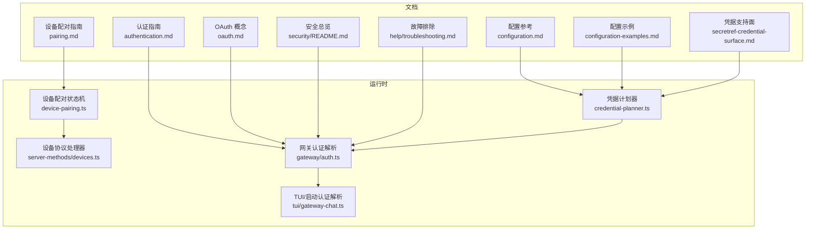
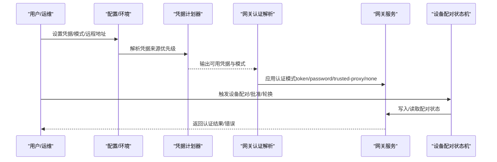
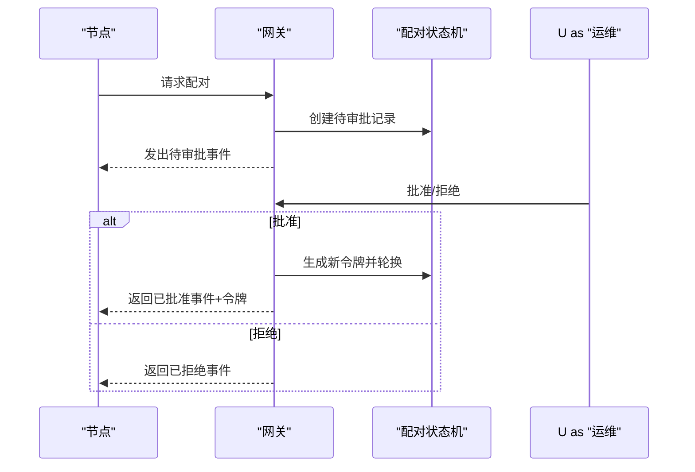
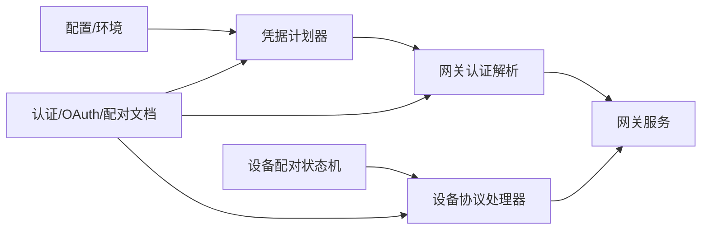
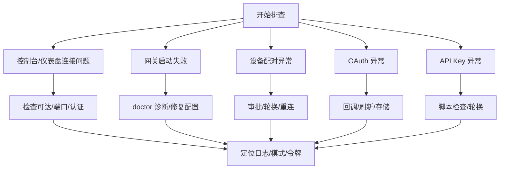

# 认证配置

<cite>
**本文引用的文件**
- [authentication.md](file://docs/gateway/authentication.md)
- [oauth.md](file://docs/concepts/oauth.md)
- [pairing.md](file://docs/gateway/pairing.md)
- [configuration.md](file://docs/gateway/configuration.md)
- [configuration-examples.md](file://docs/gateway/configuration-examples.md)
- [secretref-credential-surface.md](file://docs/reference/secretref-credential-surface.md)
- [README.md（安全）](file://docs/security/README.md)
- [credential-planner.ts](file://src/gateway/credential-planner.ts)
- [devices.ts](file://src/gateway/server-methods/devices.ts)
- [device-pairing.ts](file://src/infra/device-pairing.ts)
- [auth.ts](file://src/gateway/auth.ts)
- [gateway-chat.ts](file://src/tui/gateway-chat.ts)
- [startup-auth.test.ts](file://src/gateway/startup-auth.test.ts)
- [configure.gateway-auth.test.ts](file://src/commands/configure.gateway-auth.test.ts)
- [troubleshooting.md](file://docs/help/troubleshooting.md)
</cite>

## 目录

1. [简介](#简介)
2. [项目结构](#项目结构)
3. [核心组件](#核心组件)
4. [架构总览](#架构总览)
5. [详细组件分析](#详细组件分析)
6. [依赖关系分析](#依赖关系分析)
7. [性能考量](#性能考量)
8. [故障排除指南](#故障排除指南)
9. [结论](#结论)
10. [附录](#附录)

## 简介

本指南面向在 OpenClaw 平台上进行认证配置的用户与运维人员，系统讲解以下认证方式的配置方法、安全性考量、配置步骤与故障排除：

- API 密钥认证（模型提供商）
- OAuth 令牌认证（订阅型或第三方授权）
- 设备配对认证（WS 节点与远程客户端）
- 第三方认证（受信代理模式）

同时提供最佳实践与安全建议，并汇总认证失败的常见原因与解决方案。

## 项目结构

OpenClaw 的认证相关能力由“文档指引 + 运行时实现 + 配置解析 + 协议接口”共同构成：

- 文档层：认证策略、OAuth 流程、设备配对、配置示例与故障排除
- 实现层：网关认证解析、凭据计划器、设备配对状态机与协议处理
- 配置层：凭据来源优先级、SecretRef 支持面、远程/本地模式切换

图示来源

- [authentication.md](file://docs/gateway/authentication.md)
- [oauth.md](file://docs/concepts/oauth.md)
- [pairing.md](file://docs/gateway/pairing.md)
- [configuration.md](file://docs/gateway/configuration.md)
- [configuration-examples.md](file://docs/gateway/configuration-examples.md)
- [secretref-credential-surface.md](file://docs/reference/secretref-credential-surface.md)
- [README.md（安全）](file://docs/security/README.md)
- [credential-planner.ts](file://src/gateway/credential-planner.ts)
- [device-pairing.ts](file://src/infra/device-pairing.ts)
- [devices.ts](file://src/gateway/server-methods/devices.ts)
- [auth.ts](file://src/gateway/auth.ts)
- [gateway-chat.ts](file://src/tui/gateway-chat.ts)
- [troubleshooting.md](file://docs/help/troubleshooting.md)

章节来源

- [authentication.md](file://docs/gateway/authentication.md)
- [oauth.md](file://docs/concepts/oauth.md)
- [pairing.md](file://docs/gateway/pairing.md)
- [configuration.md](file://docs/gateway/configuration.md)
- [configuration-examples.md](file://docs/gateway/configuration-examples.md)
- [secretref-credential-surface.md](file://docs/reference/secretref-credential-surface.md)
- [README.md（安全）](file://docs/security/README.md)
- [credential-planner.ts](file://src/gateway/credential-planner.ts)
- [device-pairing.ts](file://src/infra/device-pairing.ts)
- [devices.ts](file://src/gateway/server-methods/devices.ts)
- [auth.ts](file://src/gateway/auth.ts)
- [gateway-chat.ts](file://src/tui/gateway-chat.ts)
- [troubleshooting.md](file://docs/help/troubleshooting.md)

## 核心组件

- 凭据计划器：根据配置、环境变量与默认值，计算当前可用的凭据来源与生效模式（本地/远程），并决定 token 或 password 是否可胜出。
- 网关认证解析：在启动阶段与交互场景中，解析最终认证模式（token/password/trusted-proxy/none），并处理受信代理用户头、允许 Tailscale 等。
- 设备配对与令牌：管理节点配对请求、批准/拒绝、令牌轮换与吊销；对令牌进行摘要化输出以降低泄露风险。
- OAuth 与 API Key：提供 OAuth（PKCE）与 API Key 的存储、刷新、多账户路由与失效处理。
- 配置与 SecretRef：定义凭据支持面，明确哪些凭据可通过 SecretRef 注入与覆盖。

章节来源

- [credential-planner.ts](file://src/gateway/credential-planner.ts)
- [auth.ts](file://src/gateway/auth.ts)
- [device-pairing.ts](file://src/infra/device-pairing.ts)
- [devices.ts](file://src/gateway/server-methods/devices.ts)
- [oauth.md](file://docs/concepts/oauth.md)
- [authentication.md](file://docs/gateway/authentication.md)
- [secretref-credential-surface.md](file://docs/reference/secretref-credential-surface.md)

## 架构总览

下图展示从配置到运行时认证决策的关键路径，以及设备配对与 OAuth 的交互位置。

图示来源

- [credential-planner.ts](file://src/gateway/credential-planner.ts)
- [auth.ts](file://src/gateway/auth.ts)
- [device-pairing.ts](file://src/infra/device-pairing.ts)
- [devices.ts](file://src/gateway/server-methods/devices.ts)

## 详细组件分析

### API 密钥认证（模型提供商）

- 适用场景：长期运行的网关主机，首选稳定且可控的 API Key。
- 配置要点：
  - 在网关主机上设置环境变量或通过向导写入配置文件。
  - 对于 systemd/launchd 守护进程，推荐使用用户目录下的环境文件。
  - 可通过 SecretRef 将 Key 存储在受控位置，避免明文硬编码。
- 行为特性：
  - 支持多 Key 列表与重试策略（仅在限流类错误时自动切换下一个 Key）。
  - 支持按会话/按代理覆盖认证配置，便于多账户或多模型路由。
- 安全建议：
  - 使用 SecretRef 并限制访问权限。
  - 定期轮换 Key，结合“检查到期/缺失”的自动化脚本监控。

章节来源

- [authentication.md](file://docs/gateway/authentication.md)
- [configuration.md](file://docs/gateway/configuration.md)
- [configuration-examples.md](file://docs/gateway/configuration-examples.md)
- [secretref-credential-surface.md](file://docs/reference/secretref-credential-surface.md)

### OAuth 令牌认证（订阅/第三方授权）

- 适用场景：需要长期有效且可自动刷新的令牌，如 OpenAI Codex OAuth。
- 配置要点：
  - 使用交互式登录流程完成 PKCE 授权与回调。
  - 令牌存储在每个代理的独立文件中，避免跨应用互相挤掉旧刷新令牌。
  - 支持多账户配置与按会话覆盖。
- 安全建议：
  - 严格控制令牌存储位置与访问权限。
  - 定期检查过期时间，必要时重新授权。
  - 对于受限订阅（如 Anthropic），谨慎评估外部使用政策。

章节来源

- [oauth.md](file://docs/concepts/oauth.md)
- [authentication.md](file://docs/gateway/authentication.md)

### 设备配对认证（WS 节点与远程客户端）

- 适用场景：iOS/其他远程节点通过 WebSocket 连接网关，需经批准后发放一次性设备令牌。
- 工作流程：
  1. 节点发起配对请求，网关记录待审批。
  2. 运维批准后，网关签发新令牌并轮换历史令牌。
  3. 节点使用令牌重连，完成配对。
- CLI 与协议：
  - CLI：查看待审批、批准/拒绝、状态查询、重命名等。
  - 协议：事件与方法（请求、列表、批准、拒绝、验证、轮换、吊销）。
- 安全建议：
  - 令牌为敏感信息，妥善保管配对状态文件。
  - 轮换令牌需重新审批，避免旧令牌继续使用。

图示来源

- [pairing.md](file://docs/gateway/pairing.md)
- [devices.ts](file://src/gateway/server-methods/devices.ts)
- [device-pairing.ts](file://src/infra/device-pairing.ts)

章节来源

- [pairing.md](file://docs/gateway/pairing.md)
- [devices.ts](file://src/gateway/server-methods/devices.ts)
- [device-pairing.ts](file://src/infra/device-pairing.ts)

### 第三方认证（受信代理模式）

- 适用场景：通过反向代理（如 Nginx/Tailscale）统一鉴权，网关以“受信代理”模式接收用户标识。
- 配置要点：
  - 指定用户头字段、必需头、允许用户白名单。
  - 可与远程暴露（如 Tailscale）协同，但不与密码模式混用。
- 安全建议：
  - 仅在可信网络与代理链路中启用。
  - 明确用户头来源与校验规则，防止伪造。

章节来源

- [configure.gateway-auth.test.ts](file://src/commands/configure.gateway-auth.test.ts)
- [auth.ts](file://src/gateway/auth.ts)

## 依赖关系分析

- 凭据计划器依赖配置与环境变量，输出“可用凭据与模式”，供网关认证解析使用。
- 网关认证解析在启动与交互中综合考虑模式覆盖、默认值与受信代理参数。
- 设备配对状态机与协议处理器相互协作，保证令牌生命周期与审计日志一致。
- 文档与配置示例为实现提供规范依据，SecretRef 支持面定义凭据注入边界。

图示来源

- [credential-planner.ts](file://src/gateway/credential-planner.ts)
- [auth.ts](file://src/gateway/auth.ts)
- [devices.ts](file://src/gateway/server-methods/devices.ts)
- [device-pairing.ts](file://src/infra/device-pairing.ts)
- [authentication.md](file://docs/gateway/authentication.md)
- [oauth.md](file://docs/concepts/oauth.md)
- [pairing.md](file://docs/gateway/pairing.md)

章节来源

- [credential-planner.ts](file://src/gateway/credential-planner.ts)
- [auth.ts](file://src/gateway/auth.ts)
- [devices.ts](file://src/gateway/server-methods/devices.ts)
- [device-pairing.ts](file://src/infra/device-pairing.ts)
- [authentication.md](file://docs/gateway/authentication.md)
- [oauth.md](file://docs/concepts/oauth.md)
- [pairing.md](file://docs/gateway/pairing.md)

## 性能考量

- 凭据解析与加载：优先使用环境变量与 SecretRef，减少磁盘 IO 与路径解析开销。
- 多 Key 重试：仅在限流错误时切换，避免无谓的重试放大延迟。
- 设备令牌轮换：批准即轮换，降低令牌泄露窗口，但会增加一次重连成本。
- OAuth 自动刷新：在过期前自动刷新，减少人工干预与失败率。

## 故障排除指南

- 控制台/仪表盘无法连接：
  - 检查网关是否可达、端口占用、非回环绑定缺少认证。
  - 关注“AUTH_TOKEN_MISMATCH”与“unauthorized”日志，确认令牌/密码正确、模式匹配、设备令牌未过期。
- 网关无法启动：
  - 检查配置严格校验，修复阻断性问题后再启动。
- 设备配对失败：
  - 待审批请求是否超时；批准后是否轮换令牌；节点是否使用最新令牌重连。
- OAuth 失败：
  - 回调端口不可用时，使用粘贴回调 URL/Code；检查账户 ID 提取与存储完整性。
- API Key 失败：
  - 使用“检查到期/缺失”的自动化脚本；确认多 Key 列表顺序与去重逻辑。

图示来源

- [troubleshooting.md](file://docs/help/troubleshooting.md)

章节来源

- [troubleshooting.md](file://docs/help/troubleshooting.md)

## 结论

OpenClaw 的认证体系以“文档规范 + 配置解析 + 运行时实现 + 协议接口”协同工作，既支持传统 API Key 的稳定接入，也支持 OAuth 的自动刷新与多账户路由，同时提供设备配对与受信代理等高级场景。遵循本文的安全建议与最佳实践，可显著提升系统的安全性与可维护性。

## 附录

### 最佳实践与安全建议

- 凭据管理
  - 优先使用 SecretRef，避免明文写入配置文件。
  - 严格控制凭据文件权限，定期轮换。
- 模式选择
  - 长期运行优先 API Key；需要自动刷新与多账户时采用 OAuth。
  - 受信代理模式仅在可信链路启用，并明确用户头与白名单。
- 设备配对
  - 令牌轮换即批准，避免旧令牌复用；妥善保管配对状态文件。
- 监控与告警
  - 使用“检查到期/缺失”的自动化脚本，结合日志与 doctor 命令快速定位问题。

章节来源

- [secretref-credential-surface.md](file://docs/reference/secretref-credential-surface.md)
- [README.md（安全）](file://docs/security/README.md)
- [authentication.md](file://docs/gateway/authentication.md)
- [oauth.md](file://docs/concepts/oauth.md)
- [pairing.md](file://docs/gateway/pairing.md)
