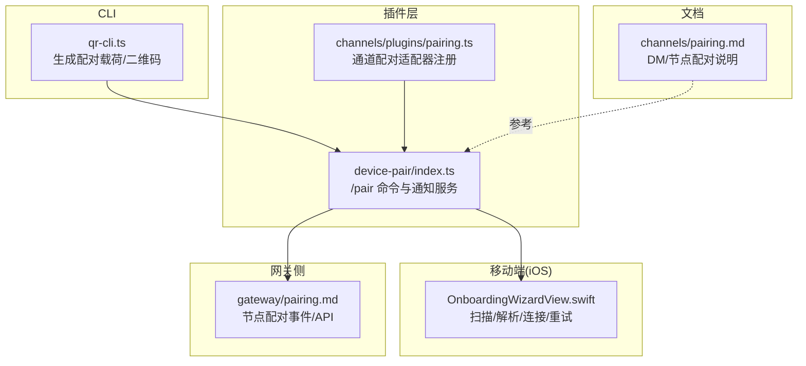
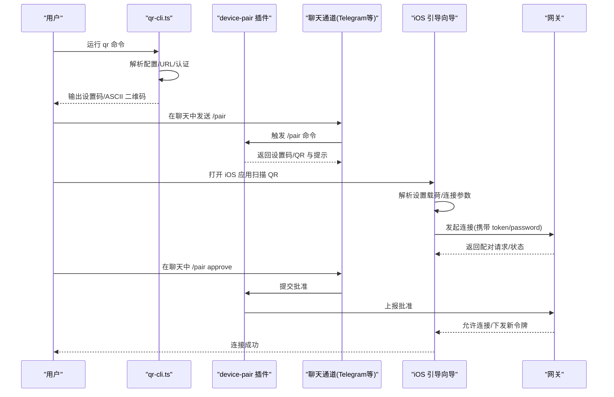
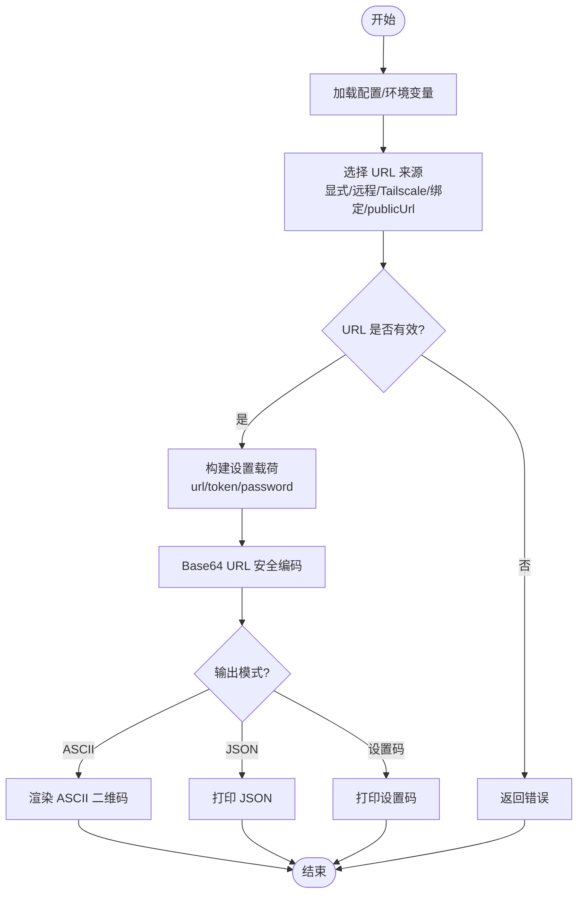
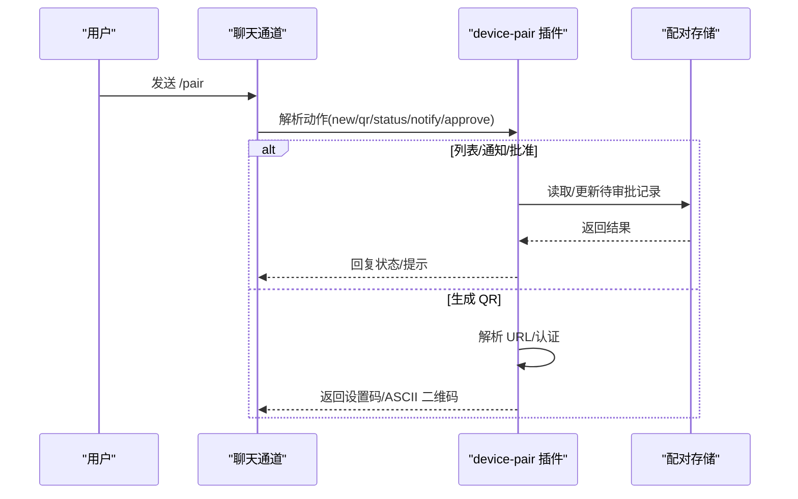
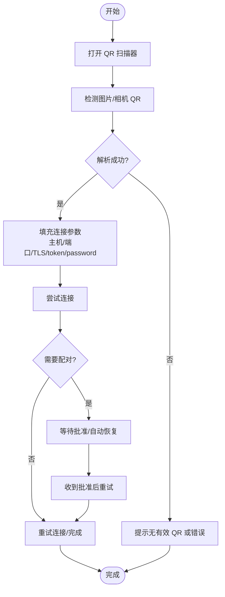
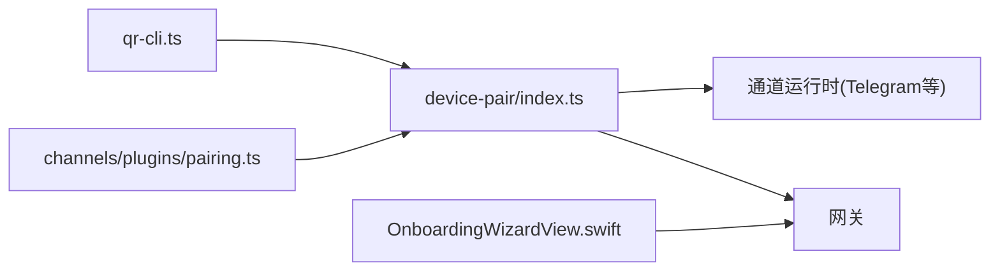

# 设备配对

<cite>
**本文引用的文件**
- [extensions/device-pair/index.ts](file://extensions/device-pair/index.ts)
- [apps/ios/Sources/Onboarding/OnboardingWizardView.swift](file://apps/ios/Sources/Onboarding/OnboardingWizardView.swift)
- [src/cli/qr-cli.ts](file://src/cli/qr-cli.ts)
- [docs/channels/pairing.md](file://docs/channels/pairing.md)
- [docs/gateway/pairing.md](file://docs/gateway/pairing.md)
- [src/channels/plugins/pairing.ts](file://src/channels/plugins/pairing.ts)
</cite>

## 目录

1. [简介](#简介)
2. [项目结构](#项目结构)
3. [核心组件](#核心组件)
4. [架构总览](#架构总览)
5. [详细组件分析](#详细组件分析)
6. [依赖关系分析](#依赖关系分析)
7. [性能与安全考量](#性能与安全考量)
8. [故障排除指南](#故障排除指南)
9. [结论](#结论)
10. [附录](#附录)

## 简介

本文件系统性阐述 OpenClaw 的设备配对能力，覆盖以下主题：

- 配对类型：QR 码配对、PIN 码配对（DM 入站通道）、节点设备配对（WS 节点）
- 配对流程：从生成配对载荷到移动端扫描、批准与连接
- 安全与加密：认证模式、凭据存储、传输安全与访问控制
- 设备管理：请求列表、批准/拒绝、状态查询与撤销
- 不同设备类型的配置示例与故障排除策略

## 项目结构

OpenClaw 将“设备配对”能力拆分为多个层次：

- CLI 层：生成配对二维码与设置载荷，支持本地或远程网关
- 插件层（device-pair）：在聊天渠道中提供 /pair 命令，生成 QR 或设置码，并处理批准
- 移动端（iOS）：在引导向导中扫描 QR、解析设置载荷、触发连接与重试
- 文档层：明确 DM 入站配对与节点设备配对的策略与存储位置
- 网关侧文档：说明节点配对的事件与 API 表面

**图表来源**

- [src/cli/qr-cli.ts:118-272](file://src/cli/qr-cli.ts#L118-L272)
- [extensions/device-pair/index.ts:326-550](file://extensions/device-pair/index.ts#L326-L550)
- [apps/ios/Sources/Onboarding/OnboardingWizardView.swift:641-722](file://apps/ios/Sources/Onboarding/OnboardingWizardView.swift#L641-L722)
- [docs/gateway/pairing.md:27-100](file://docs/gateway/pairing.md#L27-L100)
- [docs/channels/pairing.md:10-111](file://docs/channels/pairing.md#L10-L111)
- [src/channels/plugins/pairing.ts:11-70](file://src/channels/plugins/pairing.ts#L11-L70)

**章节来源**

- [src/cli/qr-cli.ts:118-272](file://src/cli/qr-cli.ts#L118-L272)
- [extensions/device-pair/index.ts:326-550](file://extensions/device-pair/index.ts#L326-L550)
- [apps/ios/Sources/Onboarding/OnboardingWizardView.swift:641-722](file://apps/ios/Sources/Onboarding/OnboardingWizardView.swift#L641-L722)
- [docs/gateway/pairing.md:27-100](file://docs/gateway/pairing.md#L27-L100)
- [docs/channels/pairing.md:10-111](file://docs/channels/pairing.md#L10-L111)
- [src/channels/plugins/pairing.ts:11-70](file://src/channels/plugins/pairing.ts#L11-L70)

## 核心组件

- CLI 二维码生成器：负责解析配置、选择 URL 来源（本地绑定、远程、Tailscale），生成设置载荷与 ASCII 二维码，支持仅输出设置码或 JSON 输出。
- 设备配对插件：在聊天渠道暴露 /pair 命令，支持列出待审批、通知、批准（latest/指定 requestId）、QR 渲染与提示信息；在 Telegram 中可启用一次性配对提醒。
- iOS 引导向导：扫描 QR 或从图片导入，解析设置载荷，自动填充连接参数，处理配对后重试与自动恢复。
- 通道配对适配器：声明式注册各通道的配对能力，提供通知批准的能力接口。
- 文档与网关协议：明确 DM 入站配对与节点设备配对的策略、存储位置与 API 表面。

**章节来源**

- [src/cli/qr-cli.ts:118-272](file://src/cli/qr-cli.ts#L118-L272)
- [extensions/device-pair/index.ts:326-550](file://extensions/device-pair/index.ts#L326-L550)
- [apps/ios/Sources/Onboarding/OnboardingWizardView.swift:641-722](file://apps/ios/Sources/Onboarding/OnboardingWizardView.swift#L641-L722)
- [src/channels/plugins/pairing.ts:11-70](file://src/channels/plugins/pairing.ts#L11-L70)
- [docs/channels/pairing.md:10-111](file://docs/channels/pairing.md#L10-L111)
- [docs/gateway/pairing.md:27-100](file://docs/gateway/pairing.md#L27-L100)

## 架构总览

下图展示从 CLI 到插件、再到移动端与网关的端到端配对流程。

**图表来源**

- [src/cli/qr-cli.ts:118-272](file://src/cli/qr-cli.ts#L118-L272)
- [extensions/device-pair/index.ts:326-550](file://extensions/device-pair/index.ts#L326-L550)
- [apps/ios/Sources/Onboarding/OnboardingWizardView.swift:641-722](file://apps/ios/Sources/Onboarding/OnboardingWizardView.swift#L641-L722)
- [docs/gateway/pairing.md:27-100](file://docs/gateway/pairing.md#L27-L100)

## 详细组件分析

### 组件一：QR 码与设置载荷生成（CLI）

- 功能要点
  - 解析配置与环境变量，确定网关 URL 来源优先级：显式 URL > 远程 URL > Tailscale 主机 > 绑定地址 > 插件 publicUrl
  - 支持强制使用 wss/ws，以及端口选择
  - 生成设置载荷（包含 url、token/password），并进行 Base64 URL 安全编码
  - 可输出 ASCII 二维码、仅设置码或 JSON
- 关键路径
  - URL 解析与校验：[resolveGatewayUrl:244-291](file://extensions/device-pair/index.ts#L244-L291)
  - 设置载荷编码：[encodeSetupCode:293-297](file://extensions/device-pair/index.ts#L293-L297)
  - CLI 命令入口与输出格式：[registerQrCli:98-272](file://src/cli/qr-cli.ts#L98-L272)

**图表来源**

- [extensions/device-pair/index.ts:244-291](file://extensions/device-pair/index.ts#L244-L291)
- [extensions/device-pair/index.ts:293-297](file://extensions/device-pair/index.ts#L293-L297)
- [src/cli/qr-cli.ts:118-272](file://src/cli/qr-cli.ts#L118-L272)

**章节来源**

- [src/cli/qr-cli.ts:118-272](file://src/cli/qr-cli.ts#L118-L272)
- [extensions/device-pair/index.ts:244-291](file://extensions/device-pair/index.ts#L244-L291)
- [extensions/device-pair/index.ts:293-297](file://extensions/device-pair/index.ts#L293-L297)

### 组件二：聊天渠道中的 /pair 命令与批准

- 功能要点
  - /pair status/pending：列出待审批的设备配对请求
  - /pair notify：在 Telegram 中启用一次性配对提醒，便于自动发现配对请求
  - /pair approve [requestId|latest]：批准指定或最新请求，返回批准结果
  - /pair qr：生成 ASCII 二维码与提示信息，Telegram 下可分条发送以提升兼容性
  - 认证来源：优先 token，其次 password，支持环境变量与配置注入
- 关键路径
  - 命令注册与路由：[/pair 主逻辑:326-550](file://extensions/device-pair/index.ts#L326-L550)
  - URL/认证解析：[resolveGatewayUrl:244-291](file://extensions/device-pair/index.ts#L244-L291)、[resolveAuth:190-215](file://extensions/device-pair/index.ts#L190-L215)
  - Telegram 通知与发送：[armPairNotifyOnce/handleNotifyCommand/sendMessageTelegram:412-501](file://extensions/device-pair/index.ts#L412-L501)

**图表来源**

- [extensions/device-pair/index.ts:326-550](file://extensions/device-pair/index.ts#L326-L550)

**章节来源**

- [extensions/device-pair/index.ts:326-550](file://extensions/device-pair/index.ts#L326-L550)

### 组件三：iOS 引导向导（扫描、解析与重试）

- 功能要点
  - 扫描 QR 或从相册导入图片，使用 CoreImage 检测 QR 内容
  - 解析设置载荷为深链参数，自动填充主机、端口、TLS、token/password
  - 处理配对后自动重试与后台恢复，避免重复请求
  - 显示连接状态、错误提示与“重新扫描/重试连接”
- 关键路径
  - 扫描与解析：[handleScannedLink:641-659](file://apps/ios/Sources/Onboarding/OnboardingWizardView.swift#L641-L659)、[detectQRCode:708-722](file://apps/ios/Sources/Onboarding/OnboardingWizardView.swift#L708-L722)
  - 自动恢复与重试：[resumeAfterPairingApproval:672-684](file://apps/ios/Sources/Onboarding/OnboardingWizardView.swift#L672-L684)、[attemptAutomaticPairingResumeIfNeeded:694-706](file://apps/ios/Sources/Onboarding/OnboardingWizardView.swift#L694-L706)
  - 状态与 UI 更新：[状态变更监听与 UI 同步:243-294](file://apps/ios/Sources/Onboarding/OnboardingWizardView.swift#L243-L294)

**图表来源**

- [apps/ios/Sources/Onboarding/OnboardingWizardView.swift:641-722](file://apps/ios/Sources/Onboarding/OnboardingWizardView.swift#L641-L722)
- [apps/ios/Sources/Onboarding/OnboardingWizardView.swift:672-706](file://apps/ios/Sources/Onboarding/OnboardingWizardView.swift#L672-L706)

**章节来源**

- [apps/ios/Sources/Onboarding/OnboardingWizardView.swift:641-722](file://apps/ios/Sources/Onboarding/OnboardingWizardView.swift#L641-L722)
- [apps/ios/Sources/Onboarding/OnboardingWizardView.swift:672-706](file://apps/ios/Sources/Onboarding/OnboardingWizardView.swift#L672-L706)

### 组件四：通道配对适配器与通知

- 功能要点
  - 通过插件声明式注册配对能力，按通道获取适配器
  - 提供通知批准接口，允许扩展在批准后回调通知
- 关键路径
  - 通道配对能力枚举与适配器获取：[listPairingChannels/getPairingAdapter:11-29](file://src/channels/plugins/pairing.ts#L11-L29)
  - 通知批准调用：[notifyPairingApproved:51-69](file://src/channels/plugins/pairing.ts#L51-L69)

**章节来源**

- [src/channels/plugins/pairing.ts:11-70](file://src/channels/plugins/pairing.ts#L11-L70)

### 组件五：节点设备配对（WS 节点）

- 流程概览
  - 节点连接网关 WS 并请求配对，网关创建待审批请求并发出事件
  - 管理端批准后颁发新令牌，节点使用新令牌重连
  - 待审批请求具有过期时间，令牌轮换确保安全性
- 关键路径
  - 事件与方法：[node.pair.requested/node.pair.resolved:51-62](file://docs/gateway/pairing.md#L51-L62)
  - CLI 工作流：[nodes pending/approve/reject/status:37-47](file://docs/gateway/pairing.md#L37-L47)

**章节来源**

- [docs/gateway/pairing.md:27-100](file://docs/gateway/pairing.md#L27-L100)

## 依赖关系分析

- CLI 与插件：CLI 生成设置载荷，插件在聊天中消费并触发移动端连接
- 插件与通道：插件依赖通道适配器与运行时发送能力（如 Telegram）
- 插件与网关：插件通过批准 API 与网关交互，网关维护节点配对状态
- iOS 与网关：iOS 解析设置载荷后直接连接网关，遵循网关认证策略

**图表来源**

- [src/cli/qr-cli.ts:118-272](file://src/cli/qr-cli.ts#L118-L272)
- [extensions/device-pair/index.ts:326-550](file://extensions/device-pair/index.ts#L326-L550)
- [apps/ios/Sources/Onboarding/OnboardingWizardView.swift:641-722](file://apps/ios/Sources/Onboarding/OnboardingWizardView.swift#L641-L722)
- [src/channels/plugins/pairing.ts:11-70](file://src/channels/plugins/pairing.ts#L11-L70)

**章节来源**

- [src/cli/qr-cli.ts:118-272](file://src/cli/qr-cli.ts#L118-L272)
- [extensions/device-pair/index.ts:326-550](file://extensions/device-pair/index.ts#L326-L550)
- [apps/ios/Sources/Onboarding/OnboardingWizardView.swift:641-722](file://apps/ios/Sources/Onboarding/OnboardingWizardView.swift#L641-L722)
- [src/channels/plugins/pairing.ts:11-70](file://src/channels/plugins/pairing.ts#L11-L70)

## 性能与安全考量

- 性能
  - QR 渲染与 ASCII 输出为轻量操作，主要开销在网络连接与通道发送
  - 一次性配对提醒（Telegram）减少重复轮询，降低消息风暴
- 安全
  - 认证模式：优先 token，其次 password；设置载荷有效期短，建议尽快批准
  - 传输安全：推荐 wss；若必须使用 ws，请确保在受控网络内
  - 存储敏感：设置载荷与配对状态属于敏感数据，妥善保管
- 访问控制
  - DM 入站配对默认策略与配对码规则见文档
  - 节点配对需经批准，且令牌轮换，避免长期使用同一凭据

[本节为通用指导，不直接分析具体文件]

## 故障排除指南

- 常见问题与定位
  - 无法生成 QR/设置码：检查网关 URL 解析与认证配置是否正确
    - 参考：[resolveGatewayUrl:244-291](file://extensions/device-pair/index.ts#L244-L291)、[resolveAuth:190-215](file://extensions/device-pair/index.ts#L190-L215)
  - Telegram 发送失败：插件会回退到单条消息；确认运行时可用与目标存在
    - 参考：[Telegram 发送回退逻辑:508-542](file://extensions/device-pair/index.ts#L508-L542)
  - iOS 未识别 QR：检查图片质量与 QR 识别精度；必要时手动输入连接参数
    - 参考：[detectQRCode:708-722](file://apps/ios/Sources/Onboarding/OnboardingWizardView.swift#L708-L722)
  - 配对后仍提示需要配对：检查是否已批准、是否使用最新令牌、是否触发自动恢复
    - 参考：[resumeAfterPairingApproval:672-684](file://apps/ios/Sources/Onboarding/OnboardingWizardView.swift#L672-L684)
  - 节点配对超时：待审批请求有有效期，及时批准或重试
    - 参考：[待审批过期时间](file://docs/gateway/pairing.md#L35)

**章节来源**

- [extensions/device-pair/index.ts:244-291](file://extensions/device-pair/index.ts#L244-L291)
- [extensions/device-pair/index.ts:508-542](file://extensions/device-pair/index.ts#L508-L542)
- [apps/ios/Sources/Onboarding/OnboardingWizardView.swift:708-722](file://apps/ios/Sources/Onboarding/OnboardingWizardView.swift#L708-L722)
- [apps/ios/Sources/Onboarding/OnboardingWizardView.swift:672-684](file://apps/ios/Sources/Onboarding/OnboardingWizardView.swift#L672-L684)
- [docs/gateway/pairing.md](file://docs/gateway/pairing.md#L35)

## 结论

OpenClaw 的设备配对体系通过 CLI 生成设置载荷、插件在聊天中协调批准、移动端解析与连接，形成闭环。配合 DM 入站配对与节点设备配对的双轨策略，既保证了易用性，也强化了安全与可控性。建议在生产环境中优先使用 wss、token 认证与一次性配对提醒，并定期轮换令牌。

[本节为总结，不直接分析具体文件]

## 附录

### 不同设备类型的配对配置示例

- iOS 设备（推荐）
  - 使用 CLI 生成设置码/二维码，iOS 引导向导扫描并连接
  - 参考：[qr-cli.ts:118-272](file://src/cli/qr-cli.ts#L118-L272)、[OnboardingWizardView.swift:641-722](file://apps/ios/Sources/Onboarding/OnboardingWizardView.swift#L641-L722)
- 节点设备（WS）
  - 管理端批准后颁发新令牌，节点使用新令牌重连
  - 参考：[gateway/pairing.md:27-100](file://docs/gateway/pairing.md#L27-L100)
- DM 入站配对（Telegram/WhatsApp/Signal 等）
  - 配置通道策略为 pairing，使用 /pair approve 授权
  - 参考：[channels/pairing.md:10-111](file://docs/channels/pairing.md#L10-L111)

**章节来源**

- [src/cli/qr-cli.ts:118-272](file://src/cli/qr-cli.ts#L118-L272)
- [apps/ios/Sources/Onboarding/OnboardingWizardView.swift:641-722](file://apps/ios/Sources/Onboarding/OnboardingWizardView.swift#L641-L722)
- [docs/gateway/pairing.md:27-100](file://docs/gateway/pairing.md#L27-L100)
- [docs/channels/pairing.md:10-111](file://docs/channels/pairing.md#L10-L111)
