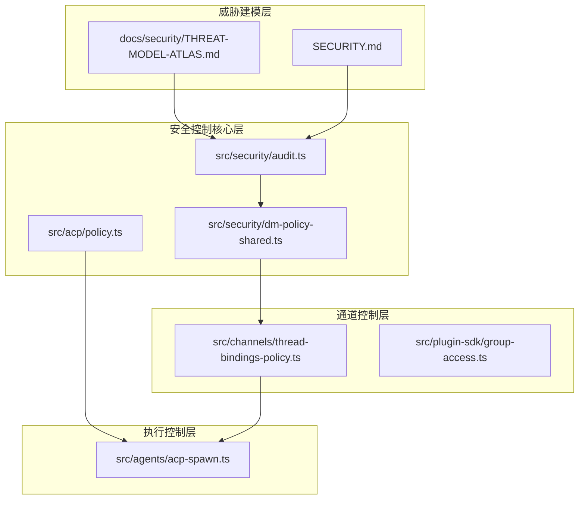
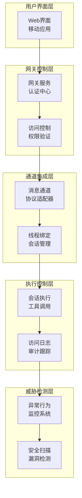
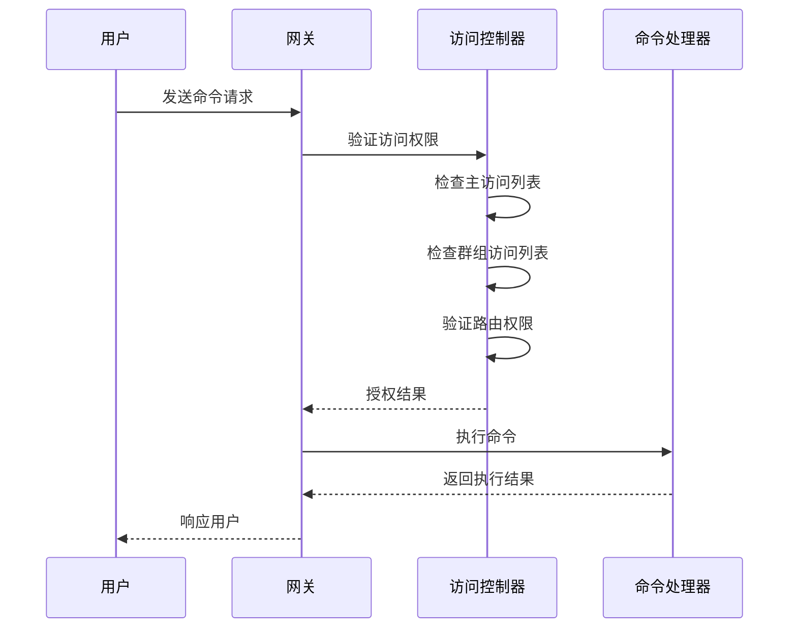
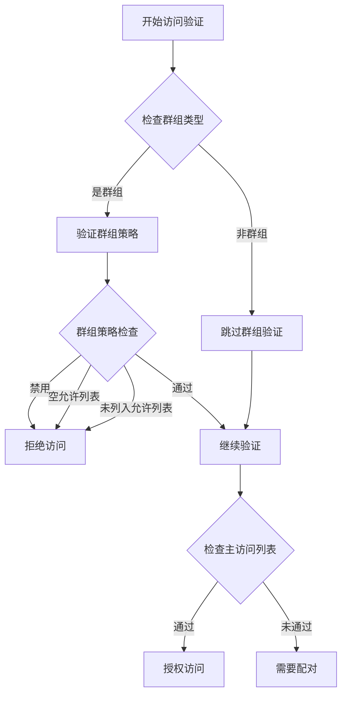
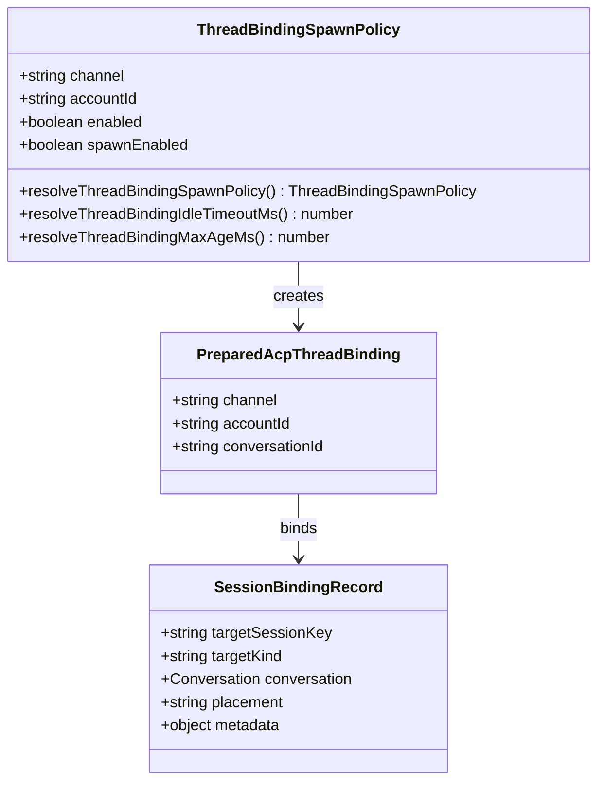
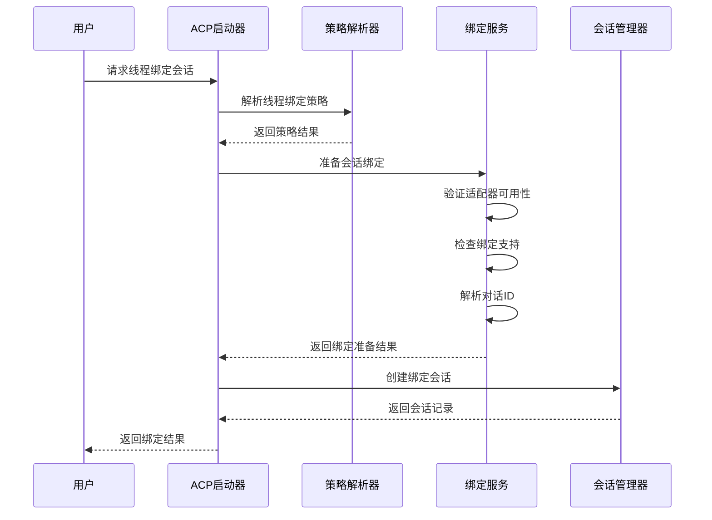
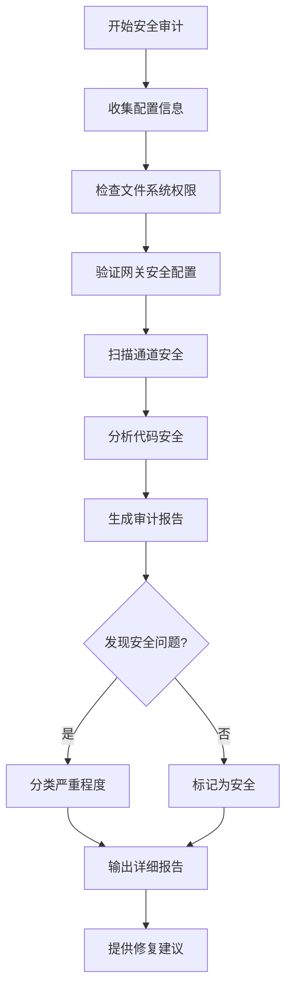
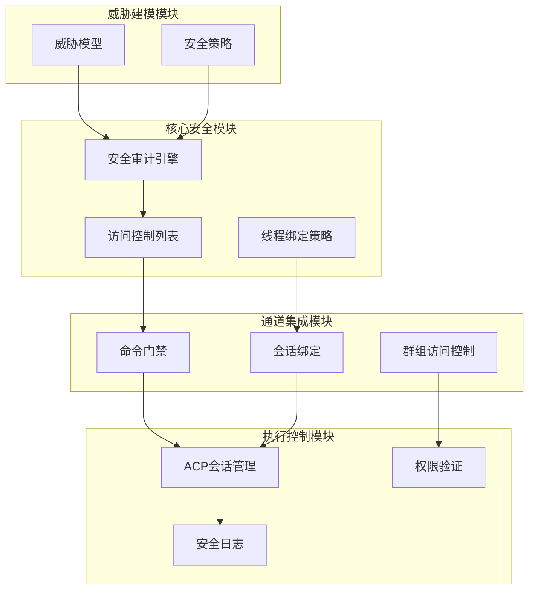
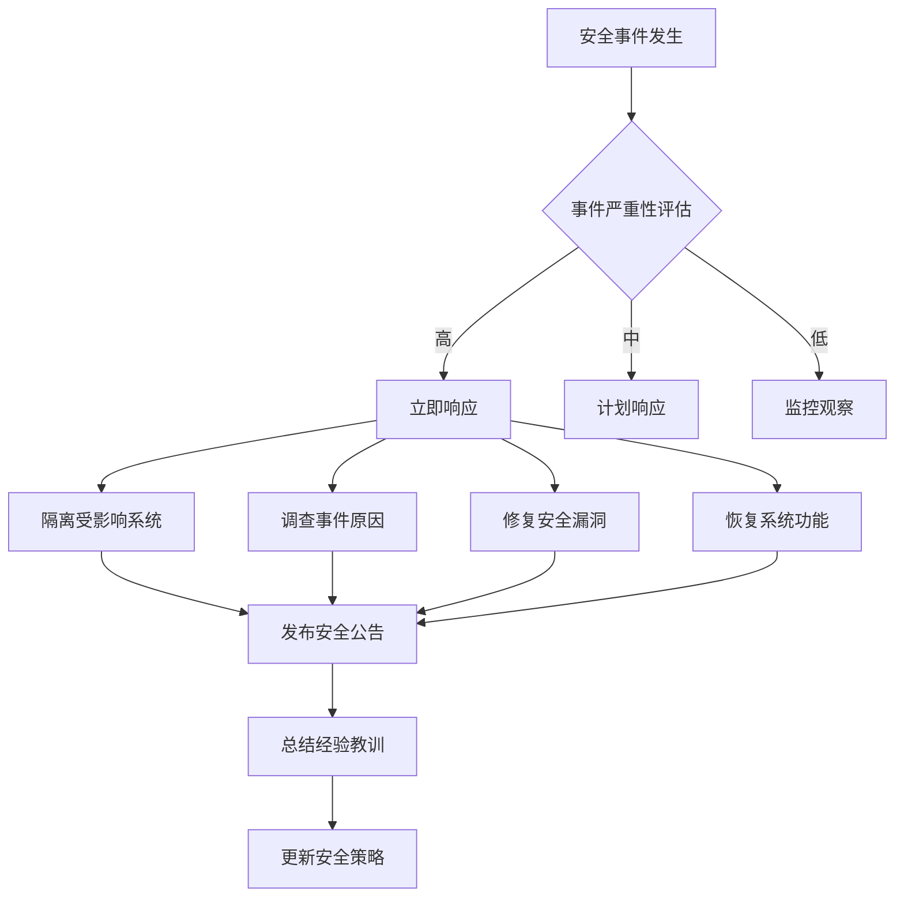

# 通道安全控制

<cite>
**本文档引用的文件**
- [src/security/audit.ts](file://src/security/audit.ts)
- [src/security/audit.test.ts](file://src/security/audit.test.ts)
- [src/channels/thread-bindings-policy.ts](file://src/channels/thread-bindings-policy.ts)
- [src/agents/acp-spawn.ts](file://src/agents/acp-spawn.ts)
- [src/acp/policy.ts](file://src/acp/policy.ts)
- [src/security/dm-policy-shared.ts](file://src/security/dm-policy-shared.ts)
- [src/plugin-sdk/group-access.ts](file://src/plugin-sdk/group-access.ts)
- [docs/security/THREAT-MODEL-ATLAS.md](file://docs/security/THREAT-MODEL-ATLAS.md)
- [SECURITY.md](file://SECURITY.md)
</cite>

## 目录

1. [简介](#简介)
2. [项目结构](#项目结构)
3. [核心组件](#核心组件)
4. [架构概览](#架构概览)
5. [详细组件分析](#详细组件分析)
6. [依赖关系分析](#依赖关系分析)
7. [性能考虑](#性能考虑)
8. [故障排除指南](#故障排除指南)
9. [结论](#结论)
10. [附录](#附录)

## 简介

OpenClaw的通道安全控制系统是一个多层次的安全框架，专门设计用于保护AI代理平台在多渠道通信环境中的安全。该系统通过实施严格的命令门禁机制、访问控制列表、权限验证和安全审计来确保系统的整体安全性。

本系统的核心目标是：

- 实施细粒度的命令门禁控制
- 建立基于访问控制列表的权限验证机制
- 提供线程绑定安全政策
- 实现全面的安全审计和威胁检测
- 建立异常行为监控体系

## 项目结构

OpenClaw的安全控制体系由多个相互关联的模块组成，形成了一个完整的安全生态系统：



**图表来源**

- [src/security/audit.ts:1-1254](file://src/security/audit.ts#L1-L1254)
- [src/channels/thread-bindings-policy.ts:1-202](file://src/channels/thread-bindings-policy.ts#L1-L202)
- [src/agents/acp-spawn.ts:1-763](file://src/agents/acp-spawn.ts#L1-L763)

**章节来源**

- [src/security/audit.ts:1-1254](file://src/security/audit.ts#L1-L1254)
- [src/channels/thread-bindings-policy.ts:1-202](file://src/channels/thread-bindings-policy.ts#L1-L202)

## 核心组件

### 安全审计引擎

安全审计引擎是整个安全控制系统的核心，负责执行全面的安全检查和风险评估。它提供了以下关键功能：

- **文件系统权限检查**：验证状态目录和配置文件的访问权限
- **网关安全配置审计**：检查网关绑定、认证和授权设置
- **通道安全评估**：分析各通信渠道的安全配置
- **代码安全扫描**：检测技能和插件中的潜在安全风险

### 访问控制列表（ACL）系统

ACL系统实现了多层访问控制机制：

- **主访问控制列表**：管理直接消息发送者的访问权限
- **群组访问控制**：基于群组策略的访问控制
- **路由级访问控制**：针对特定路由的精细化控制
- **动态权限验证**：实时验证用户的访问权限

### 线程绑定安全政策

线程绑定功能提供了基于会话的细粒度安全控制：

- **线程绑定策略解析**：根据配置确定是否启用线程绑定
- **会话绑定管理**：管理会话与线程的绑定关系
- **权限继承机制**：确保子会话继承父会话的安全策略
- **超时和生命周期管理**：控制绑定会话的有效期

**章节来源**

- [src/security/audit.ts:87-113](file://src/security/audit.ts#L87-L113)
- [src/security/dm-policy-shared.ts:62-196](file://src/security/dm-policy-shared.ts#L62-L196)
- [src/channels/thread-bindings-policy.ts:23-28](file://src/channels/thread-bindings-policy.ts#L23-L28)

## 架构概览

OpenClaw的通道安全控制系统采用分层架构设计，每层都有明确的安全职责：



**图表来源**

- [src/agents/acp-spawn.ts:403-763](file://src/agents/acp-spawn.ts#L403-L763)
- [src/security/audit.ts:208-337](file://src/security/audit.ts#L208-L337)

## 详细组件分析

### 命令门禁机制

命令门禁机制是OpenClaw安全控制的核心组成部分，它通过多层验证确保只有经过授权的命令才能被执行。

#### 访问组授权验证



**图表来源**

- [src/security/dm-policy-shared.ts:227-292](file://src/security/dm-policy-shared.ts#L227-L292)
- [src/plugin-sdk/group-access.ts:114-143](file://src/plugin-sdk/group-access.ts#L114-L143)

#### 命令授权决策流程

命令门禁机制采用决策树模式，确保每个命令都经过严格的验证：

1. **主访问控制列表检查**
   - 验证发送者是否在允许列表中
   - 检查通配符配置的影响

2. **群组访问控制验证**
   - 基于群组策略的访问控制
   - 支持开放、禁用和白名单模式

3. **路由级权限验证**
   - 针对特定路由的权限检查
   - 支持路由启用/禁用状态

4. **动态权限计算**
   - 合并多个权限源
   - 处理权限继承关系

**章节来源**

- [src/security/dm-policy-shared.ts:105-196](file://src/security/dm-policy-shared.ts#L105-L196)
- [src/plugin-sdk/group-access.ts:114-143](file://src/plugin-sdk/group-access.ts#L114-L143)

### 访问控制列表（ACL）系统

ACL系统实现了灵活而强大的访问控制机制，支持多种配置模式：

#### 主访问控制列表

主访问控制列表管理直接消息发送者的访问权限：

| 配置项           | 类型   | 描述               | 默认值      |
| ---------------- | ------ | ------------------ | ----------- |
| `allowFrom`      | 数组   | 允许的发送者标识符 | []          |
| `groupAllowFrom` | 数组   | 群组级别的允许列表 | []          |
| `dmPolicy`       | 字符串 | 直接消息策略       | "pairing"   |
| `groupPolicy`    | 字符串 | 群组策略           | "allowlist" |

#### 群组访问控制

群组访问控制提供了更精细的权限管理：



**图表来源**

- [src/security/dm-policy-shared.ts:125-161](file://src/security/dm-policy-shared.ts#L125-L161)

#### 动态权限合并

系统支持从多个源合并权限信息：

1. **配置权限**：来自配置文件的静态权限
2. **存储权限**：来自配对存储的动态权限
3. **群组权限**：基于群组策略的权限
4. **路由权限**：针对特定路由的权限

**章节来源**

- [src/security/dm-policy-shared.ts:31-60](file://src/security/dm-policy-shared.ts#L31-L60)
- [src/security/dm-policy-shared.ts:204-225](file://src/security/dm-policy-shared.ts#L204-L225)

### 线程绑定安全政策

线程绑定功能为OpenClaw提供了基于会话的细粒度安全控制，确保命令执行的上下文完整性。

#### 线程绑定策略解析



**图表来源**

- [src/channels/thread-bindings-policy.ts:23-28](file://src/channels/thread-bindings-policy.ts#L23-L28)
- [src/agents/acp-spawn.ts:120-125](file://src/agents/acp-spawn.ts#L120-L125)

#### 线程绑定执行流程



**图表来源**

- [src/agents/acp-spawn.ts:323-401](file://src/agents/acp-spawn.ts#L323-L401)
- [src/channels/thread-bindings-policy.ts:109-138](file://src/channels/thread-bindings-policy.ts#L109-L138)

#### 线程绑定生命周期管理

线程绑定会话具有严格的生命周期管理：

1. **创建阶段**：初始化会话并设置元数据
2. **绑定阶段**：建立与聊天线程的绑定关系
3. **活跃阶段**：处理命令执行和状态更新
4. **清理阶段**：超时或错误时清理资源

**章节来源**

- [src/agents/acp-spawn.ts:520-641](file://src/agents/acp-spawn.ts#L520-L641)
- [src/channels/thread-bindings-policy.ts:140-162](file://src/channels/thread-bindings-policy.ts#L140-L162)

### 权限验证和安全审计

系统提供了全面的权限验证和安全审计功能：

#### 安全审计报告生成



**图表来源**

- [src/security/audit.ts:134-148](file://src/security/audit.ts#L134-L148)
- [src/security/audit.ts:208-337](file://src/security/audit.ts#L208-L337)

#### 审计发现分类

安全审计将发现的问题分为三个严重级别：

| 严重级别     | 描述                   | 示例场景                   |
| ------------ | ---------------------- | -------------------------- |
| **critical** | 立即需要修复的安全漏洞 | 文件权限配置错误、缺少认证 |
| **warn**     | 需要关注的安全问题     | 权限过于宽松、配置不推荐   |
| **info**     | 一般性安全信息         | 系统状态、配置摘要         |

**章节来源**

- [src/security/audit.ts:56-70](file://src/security/audit.ts#L56-L70)
- [src/security/audit.ts:134-148](file://src/security/audit.ts#L134-L148)

## 依赖关系分析

OpenClaw的安全控制系统具有清晰的模块化架构，各组件之间的依赖关系如下：



**图表来源**

- [src/security/audit.ts:1-1254](file://src/security/audit.ts#L1-L1254)
- [src/agents/acp-spawn.ts:1-763](file://src/agents/acp-spawn.ts#L1-L763)

### 组件耦合度分析

系统采用了松耦合的设计原则：

- **低内聚高耦合**：核心安全功能保持高内聚性
- **接口抽象**：通过清晰的接口定义降低模块间耦合
- **依赖注入**：支持测试和扩展的依赖注入机制

**章节来源**

- [src/security/audit.ts:1093-1129](file://src/security/audit.ts#L1093-L1129)
- [src/agents/acp-spawn.ts:338-391](file://src/agents/acp-spawn.ts#L338-L391)

## 性能考虑

OpenClaw的安全控制系统在保证安全性的同时，也充分考虑了性能影响：

### 审计性能优化

- **异步文件系统检查**：避免阻塞主线程
- **缓存机制**：重用代码安全扫描结果
- **深度审计可选**：提供浅层和深层审计选项

### 访问控制性能

- **快速路径优化**：常用场景的快速判断逻辑
- **内存缓存**：权限验证结果的内存缓存
- **批量操作**：支持批量权限检查

### 线程绑定性能

- **延迟绑定**：按需创建绑定关系
- **超时管理**：自动清理长时间未使用的绑定
- **资源池**：复用绑定服务资源

## 故障排除指南

### 常见安全问题诊断

#### 文件权限问题

当遇到文件权限相关的安全警告时：

1. **检查状态目录权限**

   ```bash
   ls -la ~/.openclaw/state/
   ```

2. **验证配置文件权限**

   ```bash
   ls -la ~/.openclaw/openclaw.json
   ```

3. **修正权限设置**
   ```bash
   chmod 700 ~/.openclaw/state/
   chmod 600 ~/.openclaw/openclaw.json
   ```

#### 网关安全配置问题

网关安全配置错误会导致严重的安全风险：

1. **检查绑定配置**

   ```bash
   openclaw security audit
   ```

2. **验证认证设置**
   - 确保设置了有效的令牌或密码
   - 检查反向代理配置

3. **审查工具权限**
   - 限制HTTP工具调用
   - 配置适当的工具白名单

#### 线程绑定问题

线程绑定功能异常时：

1. **检查通道适配器**

   ```bash
   openclaw channels list
   ```

2. **验证绑定权限**
   - 检查线程绑定配置
   - 确认账户权限设置

3. **查看绑定日志**
   ```bash
   openclaw sessions list
   ```

**章节来源**

- [src/security/audit.test.ts:645-722](file://src/security/audit.test.ts#L645-L722)
- [src/security/audit.ts:208-337](file://src/security/audit.ts#L208-L337)

### 安全审计报告解读

理解安全审计报告的含义：

1. **严重级别解读**
   - **critical**：立即修复，存在高风险漏洞
   - **warn**：需要关注，建议尽快修复
   - **info**：一般信息，无需立即处理

2. **常见问题类型**
   - 文件权限配置不当
   - 缺少必要的认证机制
   - 工具权限过于宽松
   - 配置文件可读性问题

3. **修复优先级**
   - 高优先级：critical级别问题
   - 中优先级：warn级别问题
   - 低优先级：info级别问题

**章节来源**

- [src/commands/status.command.ts:473-508](file://src/commands/status.command.ts#L473-L508)

## 结论

OpenClaw的通道安全控制系统通过多层次的安全机制，为AI代理平台提供了全面的安全保护。该系统的主要优势包括：

### 核心安全特性

1. **分层安全架构**：从用户界面到执行层的完整安全覆盖
2. **灵活的访问控制**：支持多种配置模式和动态权限管理
3. **细粒度的命令控制**：基于上下文的精确命令执行控制
4. **全面的安全审计**：持续的安全监控和风险评估
5. **强大的威胁建模**：基于MITRE ATLAS框架的威胁分析

### 最佳实践建议

1. **最小权限原则**：始终使用最严格的权限配置
2. **定期安全审计**：定期运行安全审计检查系统状态
3. **监控和告警**：建立异常行为监控和告警机制
4. **及时更新**：保持系统和依赖项的最新状态
5. **文档和培训**：确保团队了解安全策略和最佳实践

### 未来发展方向

1. **增强威胁检测**：改进异常行为识别算法
2. **自动化响应**：实现自动化的安全事件响应
3. **机器学习防护**：利用AI技术增强安全防护能力
4. **合规性支持**：加强合规性检查和报告功能

通过遵循这些指导原则和最佳实践，OpenClaw用户可以构建一个既安全又高效的人工智能代理平台。

## 附录

### 安全配置参考

#### 基础安全配置

| 配置项                           | 推荐值       | 说明             |
| -------------------------------- | ------------ | ---------------- |
| `gateway.bind`                   | `"loopback"` | 默认仅本地访问   |
| `gateway.auth.mode`              | `"token"`    | 使用令牌认证     |
| `logging.redactSensitive`        | `"on"`       | 启用敏感信息脱敏 |
| `session.threadBindings.enabled` | `true`       | 启用线程绑定安全 |

#### 高级安全配置

| 配置项                                | 推荐值                                                   | 说明             |
| ------------------------------------- | -------------------------------------------------------- | ---------------- |
| `gateway.auth.rateLimit`              | `{ maxAttempts: 5, windowMs: 60000, lockoutMs: 300000 }` | 启用防暴力破解   |
| `tools.exec.applyPatch.workspaceOnly` | `true`                                                   | 限制文件操作范围 |
| `channels.*.groupPolicy`              | `"allowlist"`                                            | 使用白名单模式   |
| `agents.list[].sandbox.mode`          | `"all"`                                                  | 启用沙箱执行     |

### 威胁检测指标

#### 异常行为监控

| 指标类型     | 阈值           | 响应措施 |
| ------------ | -------------- | -------- |
| 登录失败次数 | 超过5次/分钟   | 锁定账户 |
| 命令执行频率 | 超过100次/小时 | 警告通知 |
| 文件访问异常 | 跨工作区访问   | 审计记录 |
| 网络连接异常 | 非常规端口访问 | 阻断连接 |

#### 安全事件分类

| 事件类型       | 影响等级 | 处理优先级 |
| -------------- | -------- | ---------- |
| 未授权访问尝试 | 高       | P0         |
| 权限滥用       | 中       | P1         |
| 配置变更       | 低       | P2         |
| 系统异常       | 中       | P1         |

### 安全更新和维护

#### 定期维护任务

1. **每周**：运行安全审计，检查系统状态
2. **每月**：更新安全策略，审查权限配置
3. **每季度**：安全培训，渗透测试
4. **每年**：安全评估，威胁建模更新

#### 应急响应流程



**图表来源**

- [docs/security/THREAT-MODEL-ATLAS.md:505-527](file://docs/security/THREAT-MODEL-ATLAS.md#L505-L527)
