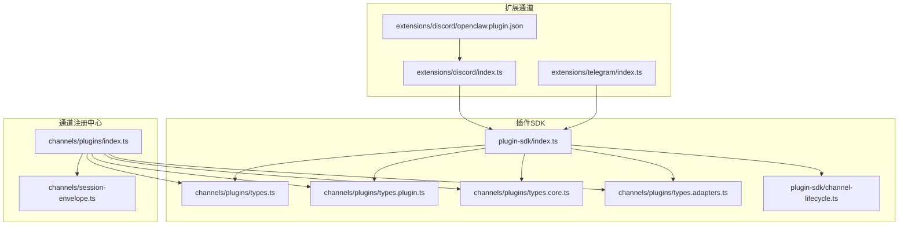
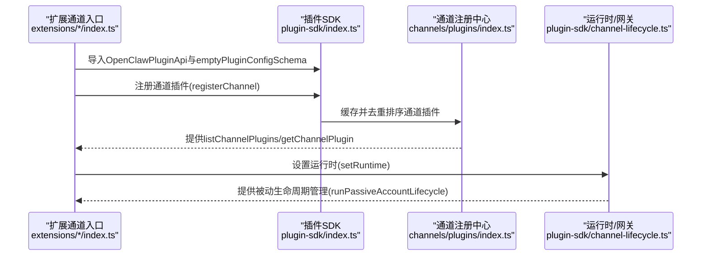
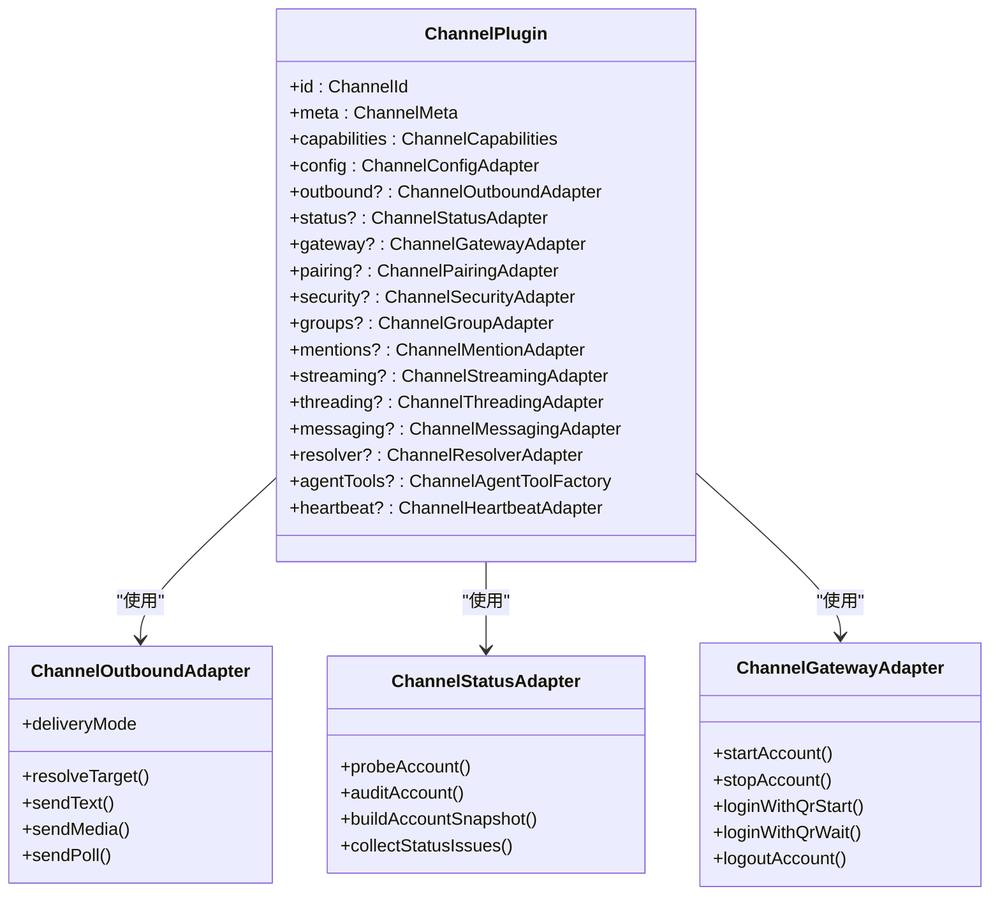
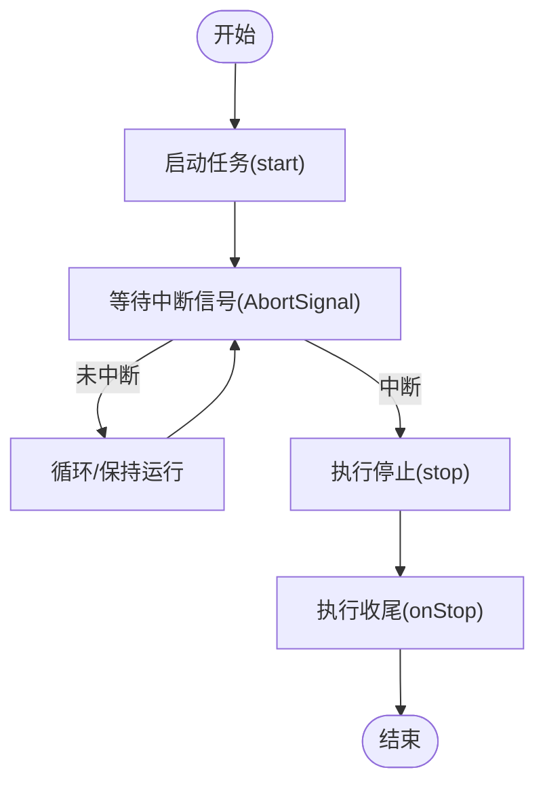
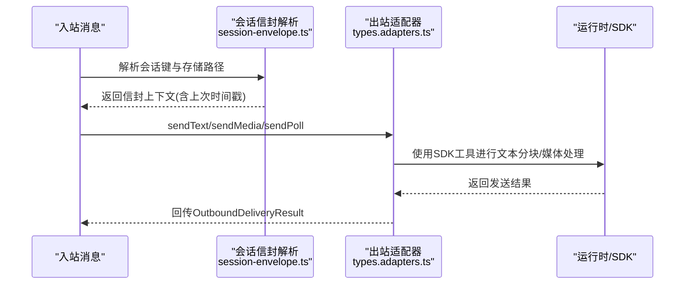
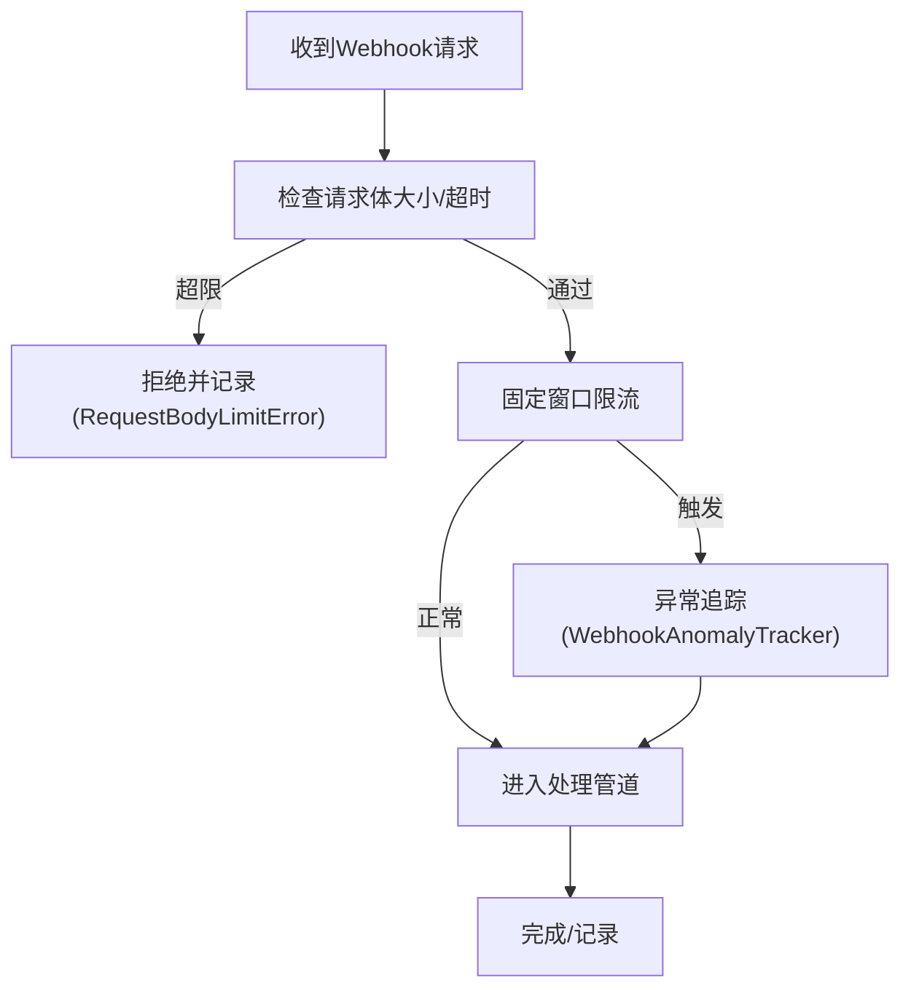
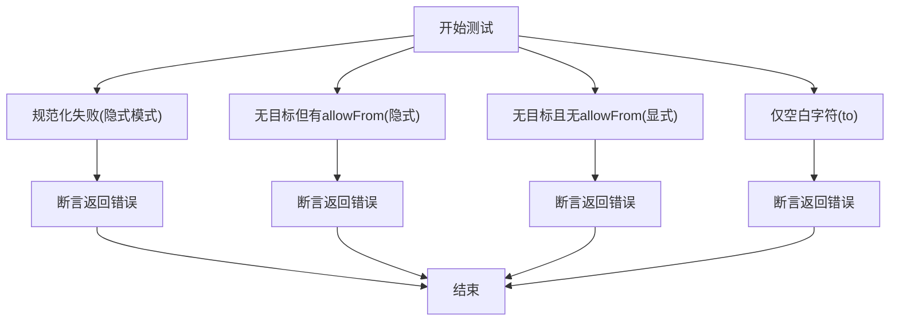
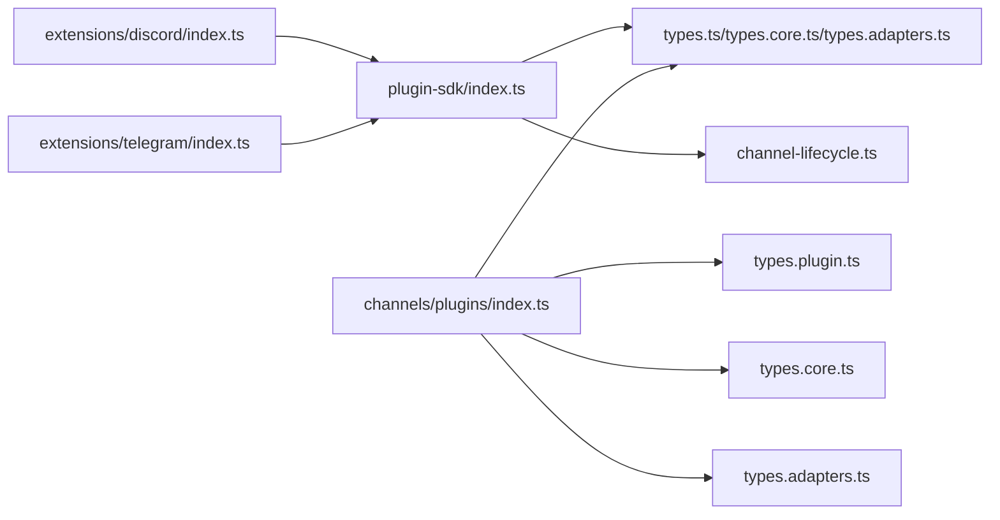

# 通道开发指南

<cite>
**本文档引用的文件**
- [src/plugin-sdk/index.ts](file://src/plugin-sdk/index.ts)
- [src/channels/plugins/types.ts](file://src/channels/plugins/types.ts)
- [src/channels/plugins/types.plugin.ts](file://src/channels/plugins/types.plugin.ts)
- [src/channels/plugins/index.ts](file://src/channels/plugins/index.ts)
- [src/channels/plugins/types.adapters.ts](file://src/channels/plugins/types.adapters.ts)
- [src/channels/plugins/types.core.ts](file://src/channels/plugins/types.core.ts)
- [src/plugin-sdk/channel-lifecycle.ts](file://src/plugin-sdk/channel-lifecycle.ts)
- [src/channels/session-envelope.ts](file://src/channels/session-envelope.ts)
- [extensions/discord/index.ts](file://extensions/discord/index.ts)
- [extensions/telegram/index.ts](file://extensions/telegram/index.ts)
- [extensions/shared/resolve-target-test-helpers.ts](file://extensions/shared/resolve-target-test-helpers.ts)
- [extensions/discord/openclaw.plugin.json](file://extensions/discord/openclaw.plugin.json)
</cite>

## 目录

1. [简介](#简介)
2. [项目结构](#项目结构)
3. [核心组件](#核心组件)
4. [架构总览](#架构总览)
5. [详细组件分析](#详细组件分析)
6. [依赖关系分析](#依赖关系分析)
7. [性能考虑](#性能考虑)
8. [故障排除指南](#故障排除指南)
9. [结论](#结论)
10. [附录](#附录)

## 简介

本指南面向希望在 OpenClaw 中开发自定义“通道”（Channel）的开发者。通道是连接不同即时通讯平台或消息系统（如 Discord、Telegram、Slack 等）的插件化模块。通过遵循本文档的插件架构、接口实现与生命周期管理规范，您可以快速创建可配置、可测试且可维护的通道插件，并将其集成到 OpenClaw 的统一运行时中。

## 项目结构

OpenClaw 将通道开发抽象为“插件 SDK + 通道适配器 + 生命周期管理 + 配置与路由”的分层架构。核心位置如下：

- 插件 SDK：统一导出通道类型、适配器接口、工具函数与运行时能力
- 通道插件注册中心：集中缓存与排序已加载的通道插件
- 具体通道实现：以扩展包形式存在，负责具体平台对接
- 生命周期管理：提供被动账户生命周期、HTTP 服务器保活等通用能力

**图表来源**

- [src/plugin-sdk/index.ts:1-826](file://src/plugin-sdk/index.ts#L1-L826)
- [src/channels/plugins/types.ts:1-66](file://src/channels/plugins/types.ts#L1-L66)
- [src/channels/plugins/types.plugin.ts:1-86](file://src/channels/plugins/types.plugin.ts#L1-L86)
- [src/channels/plugins/types.core.ts:1-403](file://src/channels/plugins/types.core.ts#L1-L403)
- [src/channels/plugins/types.adapters.ts:1-384](file://src/channels/plugins/types.adapters.ts#L1-L384)
- [src/plugin-sdk/channel-lifecycle.ts:1-108](file://src/plugin-sdk/channel-lifecycle.ts#L1-L108)
- [src/channels/plugins/index.ts:1-118](file://src/channels/plugins/index.ts#L1-L118)
- [src/channels/session-envelope.ts:1-22](file://src/channels/session-envelope.ts#L1-L22)
- [extensions/discord/index.ts:1-20](file://extensions/discord/index.ts#L1-L20)
- [extensions/telegram/index.ts:1-18](file://extensions/telegram/index.ts#L1-L18)
- [extensions/discord/openclaw.plugin.json:1-10](file://extensions/discord/openclaw.plugin.json#L1-L10)

**章节来源**

- [src/plugin-sdk/index.ts:1-826](file://src/plugin-sdk/index.ts#L1-L826)
- [src/channels/plugins/index.ts:1-118](file://src/channels/plugins/index.ts#L1-L118)

## 核心组件

- 通道插件契约（ChannelPlugin）
  - 定义通道标识、元数据、能力集与可选适配器集合
  - 支持配置模式、网关方法、心跳、安全策略、目录解析等
- 通道适配器族（Adapters）
  - 配置与设置：配置解析、账号启用/删除、默认目标解析
  - 出站消息：目标解析、文本/媒体发送、轮询投票
  - 状态与健康：探针、审计、快照构建、状态汇总
  - 网关与生命周期：账号启动/停止、二维码登录、登出
  - 安全与权限：DM 策略、警告收集
  - 目录与解析：用户/群组列表、目标解析
  - 命令与提示：命令授权、代理提示
- 生命周期管理
  - 被动账户生命周期：启动、等待中断信号、清理
  - HTTP 服务器保活：监听关闭事件并触发清理
- 会话与消息处理
  - 入站会话信封上下文：基于会话存储路径与格式选项解析时间戳
- 类型与工具
  - 统一导出类型、配置 Schema、运行时工具、Webhook 路由注册等

**章节来源**

- [src/channels/plugins/types.plugin.ts:49-86](file://src/channels/plugins/types.plugin.ts#L49-L86)
- [src/channels/plugins/types.adapters.ts:24-384](file://src/channels/plugins/types.adapters.ts#L24-L384)
- [src/channels/plugins/types.core.ts:76-403](file://src/channels/plugins/types.core.ts#L76-L403)
- [src/plugin-sdk/channel-lifecycle.ts:14-108](file://src/plugin-sdk/channel-lifecycle.ts#L14-L108)
- [src/channels/session-envelope.ts:5-22](file://src/channels/session-envelope.ts#L5-L22)

## 架构总览

下图展示了通道插件从注册到运行的关键交互：

**图表来源**

- [extensions/discord/index.ts:12-16](file://extensions/discord/index.ts#L12-L16)
- [extensions/telegram/index.ts:11-14](file://extensions/telegram/index.ts#L11-L14)
- [src/plugin-sdk/index.ts:125-134](file://src/plugin-sdk/index.ts#L125-L134)
- [src/channels/plugins/index.ts:74-84](file://src/channels/plugins/index.ts#L74-L84)
- [src/plugin-sdk/channel-lifecycle.ts:51-62](file://src/plugin-sdk/channel-lifecycle.ts#L51-L62)

## 详细组件分析

### 通道插件契约与类型体系

- ChannelPlugin
  - 关键字段：id、meta、capabilities、config、gateway、outbound、status 等
  - 可选扩展：onboarding、pairing、security、group、mentions、streaming、threading、messaging、resolver、agentTools、heartbeat
- 适配器接口族
  - 配置与设置：ChannelConfigAdapter、ChannelSetupAdapter
  - 出站消息：ChannelOutboundAdapter（含目标解析、文本/媒体/轮询发送）
  - 状态与健康：ChannelStatusAdapter（probe、audit、snapshot）
  - 网关与生命周期：ChannelGatewayAdapter（startAccount/stopAccount、QR 登录/等待、logoutAccount）
  - 安全与权限：ChannelSecurityAdapter（DM 策略、警告）
  - 目录与解析：ChannelDirectoryAdapter、ChannelResolverAdapter
  - 命令与提示：ChannelCommandAdapter、ChannelAgentPromptAdapter
- 核心类型
  - ChannelMeta、ChannelCapabilities、ChannelAccountSnapshot、ChannelGroupContext、ChannelThreadingContext、ChannelMessageActionContext 等

**图表来源**

- [src/channels/plugins/types.plugin.ts:49-86](file://src/channels/plugins/types.plugin.ts#L49-L86)
- [src/channels/plugins/types.adapters.ts:108-166](file://src/channels/plugins/types.adapters.ts#L108-L166)
- [src/channels/plugins/types.adapters.ts:275-289](file://src/channels/plugins/types.adapters.ts#L275-L289)
- [src/channels/plugins/types.adapters.ts:127-166](file://src/channels/plugins/types.adapters.ts#L127-L166)

**章节来源**

- [src/channels/plugins/types.plugin.ts:49-86](file://src/channels/plugins/types.plugin.ts#L49-L86)
- [src/channels/plugins/types.adapters.ts:108-384](file://src/channels/plugins/types.adapters.ts#L108-L384)
- [src/channels/plugins/types.core.ts:76-403](file://src/channels/plugins/types.core.ts#L76-L403)

### 生命周期管理与运行时集成

- 被动账户生命周期
  - start 启动任务，等待 AbortSignal 触发，随后执行 stop/onStop 清理
- HTTP 服务器保活
  - 监听 close 事件，在服务器关闭后完成清理
- 运行时注入
  - 扩展通过 setRuntime 注入运行时，以便使用 SDK 提供的高级功能（回复派发、路由、文本处理、会话管理、媒体、命令与组策略、配对）

**图表来源**

- [src/plugin-sdk/channel-lifecycle.ts:51-62](file://src/plugin-sdk/channel-lifecycle.ts#L51-L62)

**章节来源**

- [src/plugin-sdk/channel-lifecycle.ts:14-108](file://src/plugin-sdk/channel-lifecycle.ts#L14-L108)
- [extensions/discord/index.ts:12-16](file://extensions/discord/index.ts#L12-L16)
- [extensions/telegram/index.ts:11-14](file://extensions/telegram/index.ts#L11-L14)

### 消息处理与会话管理

- 入站会话信封上下文
  - 基于会话存储路径与格式选项解析上一次更新时间戳，用于消息去重与顺序控制
- 出站消息流
  - 通过 ChannelOutboundAdapter 的 sendText/sendMedia/sendPoll 发送
  - 支持文本分块、Markdown 处理、媒体下载与分片发送
- 目标解析与显示
  - ChannelMessagingAdapter 提供目标规范化与展示格式化

**图表来源**

- [src/channels/session-envelope.ts:5-22](file://src/channels/session-envelope.ts#L5-L22)
- [src/channels/plugins/types.adapters.ts:108-125](file://src/channels/plugins/types.adapters.ts#L108-L125)

**章节来源**

- [src/channels/session-envelope.ts:5-22](file://src/channels/session-envelope.ts#L5-L22)
- [src/channels/plugins/types.adapters.ts:108-125](file://src/channels/plugins/types.adapters.ts#L108-L125)

### 错误处理与诊断

- Webhook 请求限制与异常追踪
  - 读取请求体限制、速率限制与异常计数器，避免过载与滥用
- 通道状态问题收集
  - ChannelStatusAdapter.collectStatusIssues 收集配置、权限、认证、运行时等问题
- 通道清单与配置校验
  - 扩展可通过 openclaw.plugin.json 提供空配置 Schema，便于初始化与校验

**图表来源**

- [src/plugin-sdk/index.ts:440-447](file://src/plugin-sdk/index.ts#L440-L447)

**章节来源**

- [src/plugin-sdk/index.ts:440-447](file://src/plugin-sdk/index.ts#L440-L447)
- [src/channels/plugins/types.adapters.ts:127-166](file://src/channels/plugins/types.adapters.ts#L127-L166)
- [extensions/discord/openclaw.plugin.json:4-8](file://extensions/discord/openclaw.plugin.json#L4-L8)

### 测试方法与验证用例

- 目标解析错误用例
  - 包括：规范化失败、无目标但有白名单、无目标且无白名单、仅空白字符等场景
- 建议测试点
  - 正常路径：目标解析成功、发送成功
  - 异常路径：输入非法、网络错误、鉴权失败、速率限制
  - 边界条件：空字符串、超长文本、大文件、多线程并发

**图表来源**

- [extensions/shared/resolve-target-test-helpers.ts:23-65](file://extensions/shared/resolve-target-test-helpers.ts#L23-L65)

**章节来源**

- [extensions/shared/resolve-target-test-helpers.ts:17-67](file://extensions/shared/resolve-target-test-helpers.ts#L17-L67)

## 依赖关系分析

- 插件 SDK 对通道类型与适配器的集中导出，确保扩展与内置通道共享同一套契约
- 通道注册中心对插件进行去重、排序与按 ID 映射，降低耦合度
- 扩展通道通过入口文件注册插件并注入运行时，形成清晰的边界

**图表来源**

- [src/plugin-sdk/index.ts:1-826](file://src/plugin-sdk/index.ts#L1-L826)
- [src/channels/plugins/index.ts:1-118](file://src/channels/plugins/index.ts#L1-L118)
- [extensions/discord/index.ts:1-20](file://extensions/discord/index.ts#L1-L20)
- [extensions/telegram/index.ts:1-18](file://extensions/telegram/index.ts#L1-L18)

**章节来源**

- [src/channels/plugins/index.ts:74-84](file://src/channels/plugins/index.ts#L74-L84)
- [src/plugin-sdk/index.ts:125-134](file://src/plugin-sdk/index.ts#L125-L134)

## 性能考虑

- 文本分块与媒体传输
  - 使用 SDK 的文本分块与媒体分片能力，避免单次超大负载
- 并发与队列
  - 利用 keyed-async-queue 等机制，按目标键进行任务排队，减少竞争与抖动
- 速率限制与异常检测
  - 合理配置 Webhook 速率限制与异常计数，防止雪崩效应
- 会话与去重
  - 借助会话信封上下文的时间戳，实现消息去重与顺序控制，降低重复处理成本

[本节为通用指导，无需特定文件引用]

## 故障排除指南

- 常见问题定位
  - 配置问题：检查 ChannelConfigAdapter 的 resolveAccount/isConfigured 与 describeAccount
  - 权限问题：核对 ChannelSecurityAdapter 的 resolveDmPolicy 与 collectWarnings
  - 认证问题：确认 ChannelAuthAdapter 的 login 流程与令牌来源
  - 发送失败：查看 OutboundDeliveryResult 与 OutboundSendDeps 的错误信息
- 日志与诊断
  - 使用 ChannelLogSink 输出 info/warn/error，并结合诊断事件系统进行追踪
- 生命周期与资源释放
  - 确保在 stop/onStop 中释放资源（连接、文件句柄、定时器），避免泄漏

**章节来源**

- [src/channels/plugins/types.adapters.ts:291-384](file://src/channels/plugins/types.adapters.ts#L291-L384)
- [src/plugin-sdk/channel-lifecycle.ts:51-62](file://src/plugin-sdk/channel-lifecycle.ts#L51-L62)

## 结论

通过遵循 OpenClaw 的通道插件架构与适配器契约，您可以快速实现跨平台的消息通道。建议从最小可用的 ChannelPlugin 开始，逐步完善配置、出站发送、状态监控与安全策略，并利用 SDK 提供的生命周期管理与工具函数，确保插件的稳定性与可维护性。

[本节为总结，无需特定文件引用]

## 附录

### 开发步骤速查

- 创建扩展包与入口文件
  - 在 extensions/<channel>/index.ts 导出插件对象，调用 api.registerChannel 注册
- 实现 ChannelPlugin
  - 至少实现 config、outbound、status、gateway 等核心适配器
- 配置与 Schema
  - 使用 emptyPluginConfigSchema 初始化，后续根据平台需求扩展
- 生命周期集成
  - 在入口中调用 setRuntime 注入运行时，使用 runPassiveAccountLifecycle 管理任务
- 测试与验证
  - 基于 resolve-target 测试用例模板编写边界与异常场景测试
- 文档与清单
  - 在 openclaw.plugin.json 中声明通道 ID 与配置 Schema

**章节来源**

- [extensions/discord/index.ts:7-16](file://extensions/discord/index.ts#L7-L16)
- [extensions/telegram/index.ts:6-14](file://extensions/telegram/index.ts#L6-L14)
- [extensions/discord/openclaw.plugin.json:1-10](file://extensions/discord/openclaw.plugin.json#L1-L10)
- [extensions/shared/resolve-target-test-helpers.ts:17-67](file://extensions/shared/resolve-target-test-helpers.ts#L17-L67)
